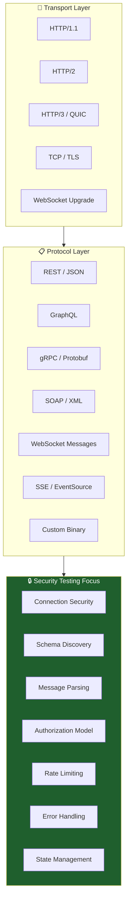
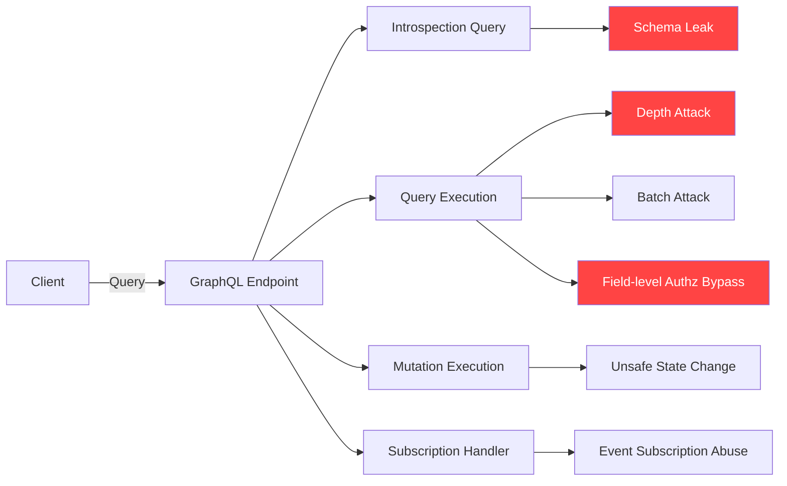
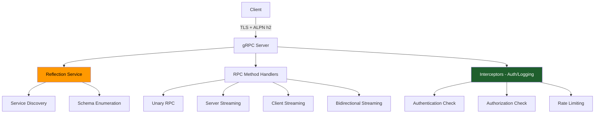
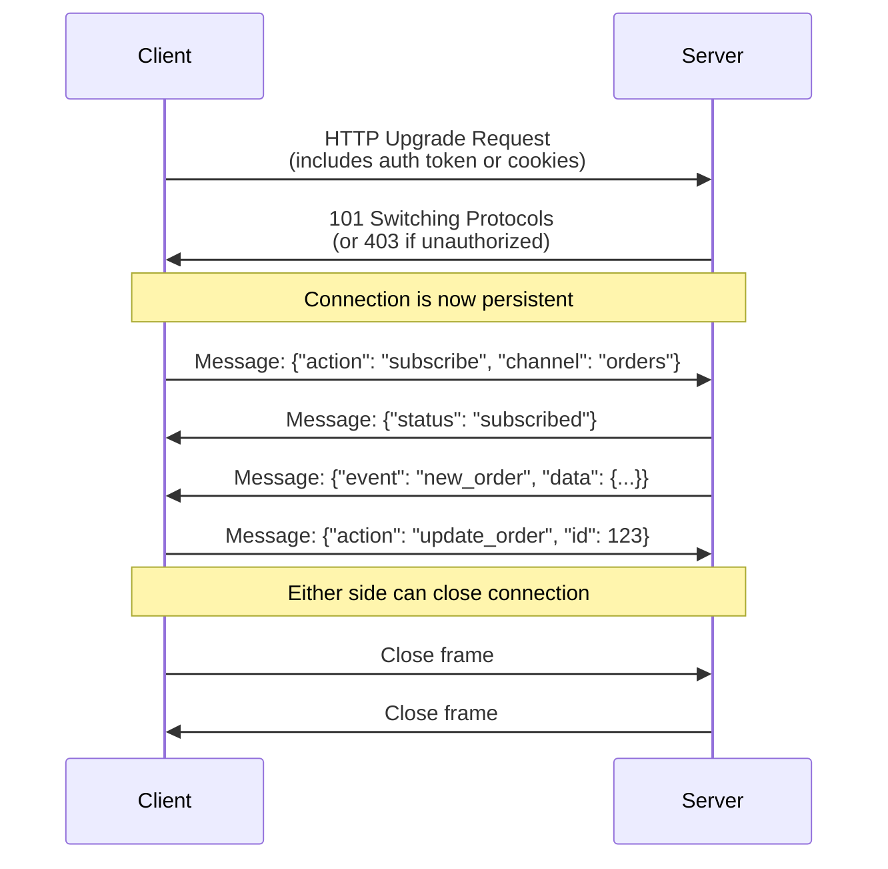
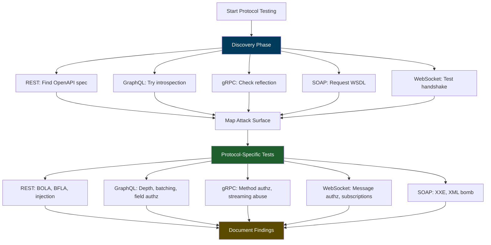

# Protocol-Specific Testing

> **Protocol-specific testing is the practice of examining security controls, message handling, state management, and authorization enforcement within the unique constraints and features of each API transport protocol. What looks safe in REST may be broken in GraphQL, gRPC, WebSocket, or other specialized protocols.**

---

## 🧠 What Is It? (Beginner Explanation)

Think of API protocols like different building designs:

- **REST** is like a standard office building: well-known layout, clear entry points, conventional security
- **GraphQL** is like a building with a universal request desk that can route to any department
- **gRPC** is like a secured facility with binary access cards and fast internal communication
- **WebSocket** is like a building with dedicated phone lines that stay open continuously
- **SOAP** is like a formal government building with strict documentation requirements

Each design creates different **trust boundaries, attack surfaces, and defensive blind spots**.

In authorized API testing, protocol-specific testing means you:

1. **Understand how the protocol actually works** — message format, state model, connection lifecycle
2. **Map where security controls are applied** — handshake, message-level, session-level
3. **Test protocol-specific weaknesses** — introspection leaks, streaming abuse, binary parser bugs
4. **Validate that authorization works consistently** — across query complexity, RPC methods, or message handlers

### Real-world analogy

Imagine you are a security auditor inspecting multiple bank branches:

- One uses traditional teller windows (REST)
- Another uses a smart ATM that lets you chain multiple transactions (GraphQL)
- Another uses pneumatic tubes for fast internal transfers (gRPC)
- Another has dedicated phone lines to specialists (WebSocket)

Even though all are banks with the same core security goals, **each design changes where mistakes hide**.

That is protocol-specific testing in API security.

---

## 🎯 Why Protocol-Specific Testing Matters

Most API security guidance starts with REST or JSON over HTTP. That makes sense because REST is everywhere.

But real production environments now include:

- GraphQL for flexible frontend-driven queries
- gRPC for microservice-to-microservice communication
- WebSocket for real-time features
- Server-Sent Events for live notifications
- SOAP for legacy integrations
- Binary or custom formats for performance-critical workloads

### Common failure patterns

| What teams assume | What actually happens |
|---|---|
| "We secured the REST API" | GraphQL schema exposes hundreds of fields with weak depth/cost controls |
| "We validate all HTTP requests" | gRPC reflection service leaks internal method names and structures |
| "We check auth on connect" | WebSocket messages bypass per-action authorization after the handshake |
| "SOAP is old, so it is hardened" | XXE injection and WSDL enumeration are still common |
| "Binary protocols hide details" | Protobuf definitions are available via reflection or client decompilation |

Protocol-specific testing catches these assumptions **before** they become incidents.

---

## 🏗️ Mental Model: Protocol Layers and Testing Focus



### Key questions for each protocol

When you encounter a new protocol in an authorized assessment, ask:

1. **Discovery** — How do I learn what is available? (OpenAPI, reflection, WSDL, introspection)
2. **Request format** — What is the message structure? (JSON, XML, Protobuf, custom)
3. **Session model** — Is it stateless requests, long-lived connections, or streaming?
4. **Authorization enforcement** — Where is access control applied? (gateway, service, handler, field)
5. **Error behavior** — Do errors leak internal state or schema details?
6. **Resource controls** — How does it prevent abuse through query complexity, depth, batch size, or duration?

---

## 📚 REST API Testing (Baseline)

REST is the most common API style, but "REST" in practice often means **JSON over HTTP with CRUD-style semantics**.

### What makes REST different

| Characteristic | Security implication |
|---|---|
| Resource-oriented paths | Authorization often happens at route level |
| Stateless by design | Each request carries auth context (tokens, API keys, cookies) |
| HTTP verbs map to actions | GET = read, POST = create, PUT/PATCH = update, DELETE = destroy |
| Well-defined status codes | 401, 403, 404, 429 signal auth, permission, existence, and rate limiting |
| OpenAPI / Swagger specs | Schema disclosure may reveal more than needed |

### Core REST testing checklist

```mermaid
flowchart TD
    A[REST API Testing] --> B[Schema Discovery]
    A --> C[Authorization Boundaries]
    A --> D[Input Validation]
    A --> E[Rate Limiting]
    A --> F[Error Handling]

    B --> B1[OpenAPI / Swagger endpoint]
    B --> B2[OPTIONS method enumeration]
    B --> B3[Path fuzzing]

    C --> C1[BOLA - access others' objects]
    C --> C2[BFLA - access privileged functions]
    C --> C3[HTTP verb tampering]
    C --> C4[Mass assignment]

    D --> D1[Injection in query params]
    D --> D2[JSON body structure abuse]
    D --> D3[Content-Type confusion]

    E --> E1[Per-user limits]
    E --> E2[429 response validation]
    E --> E3[Bypass via header manipulation]

    F --> F1[Stack traces in 500 errors]
    F --> F2[Existence leaks in 404 vs 403]
    F --> F3[Verbose validation messages]

    style A fill:#003b5c,color:#fff
```



### Practical REST testing examples

**Test: BOLA via ID manipulation**

```http
GET /api/v1/orders/1234 HTTP/1.1
Authorization: Bearer user_A_token
```

Expected: Only user A's orders are returned.  
Test: Try other IDs (1235, 1000, 9999) to see if authorization is enforced per object.

**Test: HTTP verb tampering**

```http
DELETE /api/v1/users/5678 HTTP/1.1
Authorization: Bearer read_only_token
```

Expected: 403 Forbidden.  
Test: Some APIs only protect GET/POST and forget DELETE/PATCH.

**Test: Mass assignment**

```http
PUT /api/v1/profile HTTP/1.1
Content-Type: application/json

{
  "email": "attacker@example.com",
  "is_admin": true
}
```

Expected: Server should ignore `is_admin` or reject the request.  
Test: Can regular users elevate privileges by adding unexpected fields?

---

## 🔍 GraphQL Testing

GraphQL replaces many REST endpoints with a single query endpoint that lets clients request exactly the data they need.

That flexibility creates unique security challenges.

### What makes GraphQL different

| Characteristic | Security implication |
|---|---|
| Schema-driven | Introspection can reveal the entire API surface |
| Nested queries | Depth and complexity can cause DoS |
| Field-level resolution | Authorization may be inconsistent across fields |
| Mutations and subscriptions | Side effects and real-time updates need separate controls |
| Single endpoint | Traditional path-based controls do not apply |

### GraphQL attack surface



### Core GraphQL testing checklist

| Test category | What to validate |
|---|---|
| **Introspection** | Is `__schema` query disabled in production? Does it leak internal types? |
| **Query depth** | Are deeply nested queries rejected? (e.g., 20+ levels) |
| **Query complexity** | Is total resolver cost calculated and limited? |
| **Batching** | Can clients send 1000 queries in a single request? |
| **Field authorization** | Are sensitive fields protected even if the parent object is accessible? |
| **Mutation side effects** | Do mutations enforce the same authorization as queries? |
| **Subscription access** | Can users subscribe to events they should not see? |
| **Error verbosity** | Do errors reveal SQL, resolver logic, or internal types? |

### Practical GraphQL testing examples

**Test: Introspection disclosure**

```graphql
query IntrospectionQuery {
  __schema {
    types {
      name
      fields {
        name
        type { name }
      }
    }
  }
}
```

Expected: 400 or introspection disabled in production.  
Test: If enabled, review schema for admin-only types, internal fields, or deprecated endpoints.

**Test: Depth attack**

```graphql
query NestedDepth {
  user {
    posts {
      author {
        posts {
          author {
            posts {
              author {
                id
              }
            }
          }
        }
      }
    }
  }
}
```

Expected: Request rejected with depth limit error.  
Test: If not rejected, keep nesting until server degrades.

**Test: Field-level authorization**

```graphql
query {
  user(id: "123") {
    email
    ssn
    internalNotes
  }
}
```

Expected: Sensitive fields should be null or rejected even if `user` is accessible.  
Test: Can regular users access admin-only fields on publicly visible objects?

**Test: Batch abuse**

```graphql
[
  { query: "{ users { id } }" },
  { query: "{ users { id } }" },
  ...repeat 500 times...
]
```

Expected: Server rejects oversized batches or applies strict rate limits.  
Test: Can a single HTTP request trigger thousands of resolver executions?

---

## ⚡ gRPC Testing

gRPC is a binary RPC framework built on HTTP/2 and Protocol Buffers (Protobuf).

It is common in microservices, internal APIs, and mobile backends.

### What makes gRPC different

| Characteristic | Security implication |
|---|---|
| Binary serialization (Protobuf) | Traditional HTTP proxies may not inspect traffic |
| RPC-style methods | Authorization happens per method, not per URL path |
| HTTP/2 multiplexing | Many concurrent streams over one connection |
| Reflection service | Can expose all available methods and message schemas |
| Bidirectional streaming | Long-lived sessions with multiple request/response pairs |

### gRPC security model



### Core gRPC testing checklist

| Test category | What to validate |
|---|---|
| **Reflection exposure** | Is `grpc.reflection.v1alpha.ServerReflection` accessible without auth? |
| **Method enumeration** | Can unauthenticated clients list all services and methods? |
| **Per-method authorization** | Are all RPC methods protected, including internal/admin ones? |
| **Protobuf parsing** | Are malformed or oversized messages rejected safely? |
| **Streaming abuse** | Can clients hold streams open indefinitely or flood with messages? |
| **TLS enforcement** | Is plaintext gRPC disabled? Is mTLS required where appropriate? |
| **Error messages** | Do gRPC status messages leak internal service names or logic? |

### Practical gRPC testing examples

**Test: Reflection enumeration**

```bash
grpcurl -plaintext target.example.com:50051 list
```

Expected: Authentication required or reflection disabled.  
Test: If accessible, catalog all services and methods for further testing.

**Test: Unauthenticated RPC access**

```bash
grpcurl -plaintext \
  -d '{"user_id": "123"}' \
  target.example.com:50051 \
  company.user.v1.AdminService/DeleteUser
```

Expected: Authentication or authorization error.  
Test: Try admin/internal methods without credentials or with regular user tokens.

**Test: Oversized message**

```bash
grpcurl -plaintext \
  -d '{"name": "'$(python3 -c 'print("A"*10000000)')'" }' \
  target.example.com:50051 \
  company.api.v1.Service/CreateItem
```

Expected: Message rejected with size limit error.  
Test: Does the server handle or crash on extremely large Protobuf messages?

**Test: Stream flooding**

```bash
# Open bidirectional stream and send rapid messages
grpcurl -plaintext -d @ target.example.com:50051 \
  company.stream.v1.ChatService/LiveChat
```

Expected: Per-stream message rate limits or max message count.  
Test: Can clients exhaust server resources by opening many streams or flooding one stream?

---

## 🔌 WebSocket Testing

WebSocket APIs upgrade from HTTP into a persistent bidirectional channel.

They power real-time features like chat, notifications, live dashboards, and collaborative editing.

### What makes WebSocket different

| Characteristic | Security implication |
|---|---|
| Persistent connection | Auth may only be checked during handshake, not per message |
| Bidirectional messaging | Server can push data without client request |
| Message-based actions | Authorization enforcement may differ from HTTP APIs |
| Browser support with cookies | CSRF-like risks if `Origin` is not validated |
| Long session lifetime | Stolen or leaked connection tokens can be abused for extended periods |

### WebSocket security flow



### Core WebSocket testing checklist

| Test category | What to validate |
|---|---|
| **Handshake authentication** | Is the upgrade request properly authenticated? |
| **Origin validation** | Does server check `Origin` header to prevent cross-site WebSocket hijacking? |
| **Per-message authorization** | Are actions in each message individually authorized? |
| **Subscription controls** | Can users subscribe to channels or events they should not access? |
| **Message rate limiting** | Are clients prevented from flooding the server with messages? |
| **Session lifetime** | Are connections eventually expired or revalidated? |
| **Broadcast leaks** | Do server-pushed messages expose data to the wrong clients? |
| **Reconnection abuse** | Can clients rapidly reconnect to bypass rate limits? |

### Practical WebSocket testing examples

**Test: Unauthenticated handshake**

```http
GET /ws/chat HTTP/1.1
Host: app.example.com
Upgrade: websocket
Connection: Upgrade
Sec-WebSocket-Version: 13
Sec-WebSocket-Key: dGhlIHNhbXBsZSBub25jZQ==
```

Expected: 403 Forbidden if no authentication provided.  
Test: Does the server require authentication during the upgrade?

**Test: Cross-site WebSocket hijacking (CSWSH)**

```http
GET /ws/private HTTP/1.1
Host: app.example.com
Origin: https://attacker.com
Cookie: session=valid_session_token
Upgrade: websocket
```

Expected: Server rejects due to mismatched Origin.  
Test: If server accepts, attacker can open WebSocket from malicious site using victim's cookies.

**Test: Subscription authorization bypass**

```json
// After successful connection
{"action": "subscribe", "channel": "admin_alerts"}
```

Expected: Server checks if current user is allowed to subscribe to admin channels.  
Test: Can regular users subscribe to privileged channels by guessing channel names?

**Test: Message flooding**

```python
# Send 1000 messages rapidly
import websocket
ws = websocket.create_connection("ws://app.example.com/ws")
for i in range(1000):
    ws.send('{"action":"ping"}')
```

Expected: Server applies per-connection or per-user rate limits.  
Test: Does server degrade or accept unlimited messages?

---

## 📡 Server-Sent Events (SSE) Testing

SSE is a unidirectional protocol where the server pushes events to the client over HTTP.

Unlike WebSocket, it is read-only from the client's perspective.

### What makes SSE different

| Characteristic | Security implication |
|---|---|
| Server → client only | Simpler than WebSocket, but still can leak sensitive events |
| Built on HTTP | Traditional authentication (cookies, tokens) applies |
| Long-lived HTTP connection | Session validation may happen only at connection start |
| Automatic reconnection | Browser clients reconnect automatically, which can bypass some controls |

### Core SSE testing checklist

| Test category | What to validate |
|---|---|
| **Connection authentication** | Is the SSE endpoint protected? |
| **Event filtering** | Does server send only events the user is authorized to see? |
| **Reconnection limits** | Are rapid reconnections rate-limited? |
| **Cross-origin controls** | Is CORS configured correctly to prevent unauthorized sites from connecting? |

### Practical SSE testing example

**Test: Unauthorized event access**

```bash
curl -H "Authorization: Bearer regular_user_token" \
  https://app.example.com/events/admin-feed
```

Expected: 403 Forbidden or connection closed.  
Test: Can regular users connect to admin or privileged event streams?

---

## 🧼 SOAP / XML-RPC Testing

SOAP is an older protocol using XML messages, often with WSDL service definitions.

Despite its age, SOAP is still common in enterprise, government, and financial systems.

### What makes SOAP different

| Characteristic | Security implication |
|---|---|
| XML-based | Vulnerable to XXE, XML bomb, and XSLT injection |
| WSDL schema | Service definition may be publicly accessible |
| WS-Security extensions | Complex authentication and encryption standards with implementation flaws |
| Verbose error messages | Often leak internal stack traces or schema details |

### Core SOAP testing checklist

| Test category | What to validate |
|---|---|
| **WSDL enumeration** | Is WSDL accessible without authentication? Does it expose internal operations? |
| **XXE injection** | Are XML parsers configured to reject external entities? |
| **XML bomb** | Does server handle maliciously crafted XML (billion laughs, quadratic blowup)? |
| **SOAP action spoofing** | Can clients change `SOAPAction` header to invoke unauthorized methods? |
| **WS-Security validation** | Are signatures, timestamps, and encryption validated properly? |

### Practical SOAP testing examples

**Test: WSDL disclosure**

```bash
curl https://api.example.com/service?wsdl
```

Expected: Authentication required or WSDL disabled.  
Test: Review WSDL for internal methods, admin operations, or verbose type definitions.

**Test: XXE injection**

```xml
<?xml version="1.0"?>
<!DOCTYPE foo [
  <!ENTITY xxe SYSTEM "file:///etc/passwd">
]>
<soap:Envelope xmlns:soap="http://schemas.xmlsoap.org/soap/envelope/">
  <soap:Body>
    <GetUser>
      <userId>&xxe;</userId>
    </GetUser>
  </soap:Body>
</soap:Envelope>
```

Expected: Request rejected with XML parsing error.  
Test: Does server process external entities and leak file contents?

**Test: XML bomb**

```xml
<?xml version="1.0"?>
<!DOCTYPE lolz [
  <!ENTITY lol "lol">
  <!ENTITY lol1 "&lol;&lol;&lol;&lol;&lol;&lol;&lol;&lol;&lol;&lol;">
  <!ENTITY lol2 "&lol1;&lol1;&lol1;&lol1;&lol1;&lol1;&lol1;&lol1;&lol1;&lol1;">
  <!ENTITY lol3 "&lol2;&lol2;&lol2;&lol2;&lol2;&lol2;&lol2;&lol2;&lol2;&lol2;">
]>
<soap:Envelope>
  <soap:Body>&lol3;</soap:Body>
</soap:Envelope>
```

Expected: Request rejected before expansion.  
Test: Does server consume excessive memory or crash?

---

## 🛠️ Protocol Testing Toolkit

### Essential tools for protocol-specific testing

| Protocol | Recommended tools | Key use cases |
|---|---|---|
| **REST** | `curl`, `httpie`, Postman, Burp Suite, Insomnia | Manual testing, automated scanning, OpenAPI fuzzing |
| **GraphQL** | GraphQL Playground, Altair, Burp Suite, `graphw00f`, InQL | Introspection, query depth testing, batching attacks |
| **gRPC** | `grpcurl`, `grpcui`, Postman, Burp Suite with Protobuf plugins | Reflection enumeration, method fuzzing, message tampering |
| **WebSocket** | `wscat`, `websocat`, Burp Suite WebSocket tab, custom scripts | Handshake testing, message injection, subscription abuse |
| **SSE** | `curl`, browser DevTools, custom listeners | Connection auth, event filtering |
| **SOAP** | SoapUI, Burp Suite, `wsdler`, custom XML clients | WSDL parsing, XXE testing, WS-Security validation |

### Example: Multi-protocol testing workflow



---

## 🎓 Advanced Protocol Testing Concepts

### Custom and proprietary protocols

Some APIs use:

- **MessagePack, CBOR, or other binary formats** instead of JSON
- **Thrift** instead of Protobuf
- **MQTT, AMQP, or STOMP** for message queuing
- **Custom TCP or UDP protocols** for low-latency communication

When testing these:

1. **Obtain or reverse-engineer the schema** — client SDKs, documentation, traffic captures
2. **Understand message structure** — headers, payload, checksums, compression
3. **Test parser robustness** — oversized fields, malformed messages, type confusion
4. **Validate authentication and authorization** — same principles as standard protocols
5. **Check transport security** — TLS usage, certificate validation, encryption at rest

### Protocol downgrade and upgrade attacks

Some systems support multiple protocol versions or can upgrade/downgrade:

- **HTTP/1.1 ↔ HTTP/2** — Do security controls remain consistent?
- **WebSocket upgrade from HTTP** — Is authentication checked during upgrade?
- **ALPN negotiation** — Can clients force the server into weaker protocol modes?

Test these boundaries to ensure security controls are enforced uniformly.

### Multi-protocol environments

Modern applications often expose the same business logic through multiple protocols:

- REST API for web clients
- GraphQL for mobile clients
- gRPC for internal microservices
- WebSocket for real-time features

**Critical testing question:**

> Are authorization and validation rules consistent across all protocol entry points?

If REST API blocks a query but GraphQL allows it, that is a protocol-specific bypass.

### Protocol-agnostic attack patterns

Some attacks work across protocols:

| Attack pattern | Works on |
|---|---|
| **Authentication bypass** | REST, GraphQL, gRPC, WebSocket, SOAP |
| **Authorization bypass** | All protocols — enforcement is application logic |
| **Injection (SQL, NoSQL, command, template)** | Anywhere user input reaches an interpreter |
| **Rate limiting bypass** | All protocols — limits must be protocol-aware |
| **Data exposure** | All protocols — sensitive fields may leak in any response format |
| **DoS via resource exhaustion** | All protocols — complexity, depth, batch size, concurrency |

Protocol-specific testing is not about learning entirely new vulnerabilities. It is about **understanding where familiar vulnerabilities hide in unfamiliar message formats and connection models**.

---

## 🔒 Defense and Hardening Guidance

### REST API defenses

- Require authentication on all endpoints except explicitly public ones
- Enforce object-level authorization (BOLA prevention)
- Enforce function-level authorization (BFLA prevention)
- Validate all input against strict schemas (JSON Schema, OpenAPI)
- Disable or protect `/swagger`, `/openapi`, and other documentation endpoints in production
- Use parameterized queries to prevent injection
- Apply rate limiting per user, endpoint, and globally
- Return consistent error messages that do not leak implementation details

### GraphQL defenses

- Disable introspection in production or require authentication
- Enforce query depth limits (typically 7-10 max)
- Enforce query complexity limits based on resolver cost
- Limit batch query size (e.g., max 10 queries per request)
- Apply field-level authorization using middleware or decorators
- Validate all mutations with the same rigor as queries
- Monitor and limit subscription counts per user
- Use persisted queries (query allowlisting) where feasible

### gRPC defenses

- Disable reflection in production or require authentication
- Enforce per-method authorization using interceptors
- Validate all Protobuf messages against expected schemas
- Limit message size, stream duration, and concurrent streams
- Require TLS; consider mTLS for service-to-service communication
- Log RPC method calls for audit and monitoring
- Use least-privilege service accounts for internal gRPC calls

### WebSocket defenses

- Require authentication during the HTTP upgrade handshake
- Validate `Origin` header to prevent cross-site WebSocket hijacking
- Enforce per-message authorization, not just connection-level auth
- Validate user subscriptions to channels and event streams
- Apply per-connection and per-user message rate limits
- Set maximum connection lifetime and require periodic reauthentication
- Use TLS (WSS) for all WebSocket connections
- Monitor for unusual connection patterns (rapid reconnects, large message counts)

### SOAP defenses

- Disable or protect WSDL endpoints in production
- Configure XML parsers to reject external entities (XXE prevention)
- Set XML parsing limits (max depth, max entity expansion, max attribute count)
- Validate all SOAP messages against WSDL schemas
- Use WS-Security for message-level authentication and encryption where appropriate
- Validate `SOAPAction` header matches the actual operation being invoked
- Apply rate limiting and input validation like any other API

---

## 🧪 Authorized Testing Workflow Example

### Scenario: Multi-protocol e-commerce API assessment

**Scope:**
- REST API at `https://api.shop.example.com`
- GraphQL API at `https://api.shop.example.com/graphql`
- gRPC service at `grpc.shop.example.com:443`
- WebSocket at `wss://api.shop.example.com/ws`

**Phase 1: Discovery**

| Protocol | Discovery action | Expected result |
|---|---|---|
| REST | `GET /openapi.json` | OpenAPI 3.0 spec with all endpoints |
| GraphQL | Introspection query | Schema with types, queries, mutations |
| gRPC | `grpcurl grpc.shop.example.com:443 list` | List of services and methods |
| WebSocket | Connect to `/ws` without auth | 403 or connection rejected |

**Phase 2: Authentication testing**

- Validate that all endpoints require valid authentication
- Test token expiration and refresh flows
- Verify that revoked tokens are rejected
- Check for authentication bypass via protocol switching

**Phase 3: Authorization testing**

| Protocol | Test | Expected outcome |
|---|---|---|
| REST | Access other users' orders via `/orders/{id}` | 403 Forbidden |
| GraphQL | Query `{ user(id: "admin") { email, ssn } }` | Null or error for sensitive fields |
| gRPC | Call `AdminService/DeleteUser` with regular token | Permission denied error |
| WebSocket | Subscribe to `admin_events` channel | Subscription rejected |

**Phase 4: Input validation and injection**

- Test SQL/NoSQL injection in REST query parameters and GraphQL filters
- Test Protobuf message corruption in gRPC
- Test JSON injection in WebSocket messages
- Test XXE if any XML processing exists

**Phase 5: Resource exhaustion**

- GraphQL: Send deeply nested or batched queries
- gRPC: Open many concurrent streams
- WebSocket: Flood server with rapid messages
- REST: Attempt high-volume requests without proper rate limiting

**Phase 6: Error handling**

- Trigger errors in each protocol and check for stack traces, internal paths, or verbose messages
- Verify that 403 vs 404 responses do not leak object existence
- Confirm that gRPC status details do not expose internal service names

**Phase 7: Documentation**

Document all findings with:
- Protocol and endpoint affected
- Steps to reproduce
- Expected vs actual behavior
- Business impact
- Remediation guidance

---

## 📊 Protocol Comparison Table

| Feature | REST | GraphQL | gRPC | WebSocket | SOAP |
|---|---|---|---|---|---|
| **Transport** | HTTP/1.1 or HTTP/2 | HTTP/1.1 or HTTP/2 | HTTP/2 | HTTP → WebSocket | HTTP/1.1 |
| **Message format** | JSON (usually) | JSON | Protobuf (binary) | JSON or custom | XML |
| **Schema discovery** | OpenAPI, Swagger | Introspection | Reflection | N/A (message-driven) | WSDL |
| **Connection model** | Stateless requests | Stateless requests | Can be streaming | Persistent duplex | Stateless requests |
| **Authorization model** | Per endpoint or resource | Per field or query | Per RPC method | Per message or subscription | Per operation |
| **Complexity attacks** | Limited | High (depth, batching) | Medium (streaming) | Medium (flooding) | Medium (XML bomb) |
| **Binary protocol?** | No | No | Yes | No (usually JSON) | No |
| **Browser support** | Native | Native | Needs gRPC-Web | Native | Limited |
| **Common in** | Web APIs | Frontend-driven apps | Microservices | Real-time features | Enterprise/legacy |

---

## 🎯 Key Takeaways

1. **Protocol choice changes the attack surface**, not the security fundamentals. Authentication, authorization, validation, and rate limiting still matter everywhere.

2. **Schema and method discovery is protocol-specific.** REST has OpenAPI, GraphQL has introspection, gRPC has reflection, SOAP has WSDL. Secure or disable these in production.

3. **Authorization must be enforced at the right layer.** REST checks endpoints, GraphQL checks fields, gRPC checks methods, WebSocket checks messages. Inconsistent enforcement creates bypasses.

4. **Binary protocols are not inherently more secure.** gRPC Protobuf can be decoded, reflected, and tested just like JSON. Obscurity is not security.

5. **Long-lived connections (WebSocket, gRPC streaming) need session and rate controls beyond the initial handshake.** Connection-time auth is not enough.

6. **Error handling must be protocol-aware.** Stack traces in REST 500s, verbose GraphQL errors, gRPC status details, and SOAP fault messages all leak implementation details if not carefully configured.

7. **Multi-protocol environments require consistent policy enforcement.** If the same business logic is exposed via REST, GraphQL, and gRPC, all three must enforce the same authorization rules.

8. **Authorized testing means understanding the protocol before attacking it.** Read the spec, test legitimate flows, then test boundary conditions and abuse cases.

---

## 📚 References and Further Reading

### Official protocol specifications

- **REST / HTTP:** [RFC 9110 - HTTP Semantics](https://www.rfc-editor.org/rfc/rfc9110.html)
- **GraphQL:** [GraphQL Specification](https://spec.graphql.org/)
- **gRPC:** [gRPC Documentation](https://grpc.io/docs/)
- **WebSocket:** [RFC 6455 - The WebSocket Protocol](https://www.rfc-editor.org/rfc/rfc6455.html)
- **SOAP:** [W3C SOAP 1.2 Specification](https://www.w3.org/TR/soap12/)

### Security guidance

- **OWASP API Security Top 10 (2023):** https://owasp.org/API-Security/
- **OWASP GraphQL Cheat Sheet:** https://cheatsheetseries.owasp.org/cheatsheets/GraphQL_Cheat_Sheet.html
- **OWASP Web Service Security Cheat Sheet:** https://cheatsheetseries.owasp.org/cheatsheets/Web_Service_Security_Cheat_Sheet.html
- **PortSwigger Web Security Academy - API Testing:** https://portswigger.net/web-security/api-testing

### Tools and testing resources

- **grpcurl:** https://github.com/fullstorydev/grpcurl
- **GraphQL Voyager:** https://graphql-kit.com/graphql-voyager/
- **wscat:** https://github.com/websockets/wscat
- **Postman GraphQL support:** https://learning.postman.com/docs/sending-requests/graphql/graphql-overview/
- **Burp Suite extensions for gRPC and GraphQL:** https://portswigger.net/bappstore

### Research and attack techniques

- **GraphQL Security Best Practices:** https://apollographql.com/blog/graphql-security-best-practices
- **gRPC Security Model:** https://grpc.io/docs/guides/auth/
- **WebSocket Security:** https://christian-schneider.net/CrossSiteWebSocketHijacking.html
- **SOAP Security:** https://www.ws-attacks.org/

---

## Summary

Protocol-specific testing recognizes that **how** an API communicates shapes **where** security controls must be applied. REST, GraphQL, gRPC, WebSocket, and SOAP all carry similar risks (broken authentication, authorization bypasses, injection, DoS), but each protocol exposes those risks in different locations — endpoints vs fields vs methods vs messages.

Effective authorized testing requires understanding the protocol's schema discovery mechanisms, message structure, session model, and authorization enforcement model, then validating that security controls are applied consistently across all protocol entry points into the same business logic.
