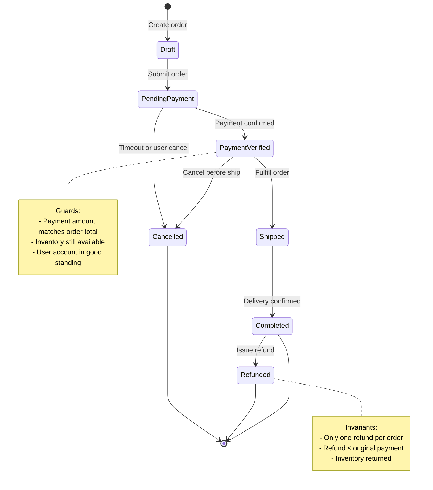
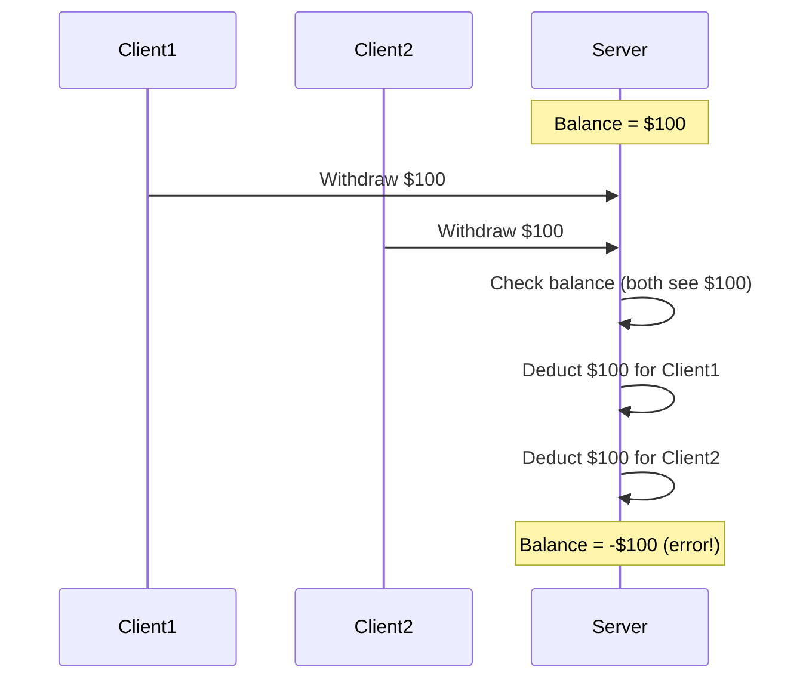
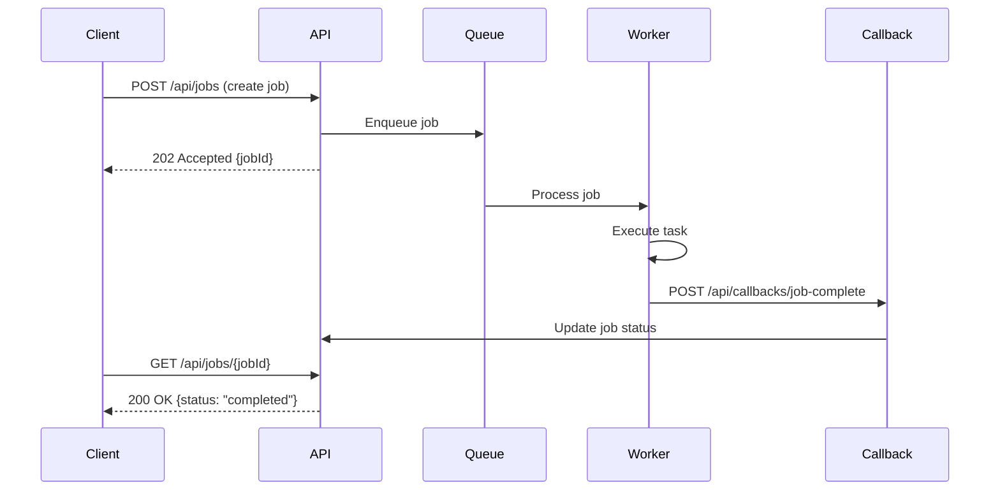
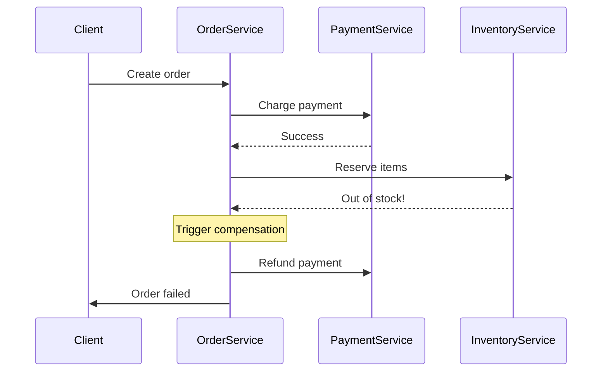

# Stateful Workflow Testing

> **Stateful workflow testing verifies that an API correctly enforces business flow sequencing, state transitions, resource lifecycle rules, and temporal constraints across multiple requests — especially when adversaries attempt to skip steps, replay operations, or trigger race conditions.**

---

## Table of Contents

1. What Is It? (Beginner Explanation)
2. Why APIs Make Workflow Testing Harder
3. Core Mental Model — APIs as Multi-Step State Machines
4. Key Workflow Dimensions to Test
5. Common Stateful Workflow Vulnerabilities
6. Reading the Spec for Workflow Expectations
7. Building a Workflow Test Matrix
8. Authorized Defensive Testing Techniques
9. Race Conditions and Concurrent Workflow Testing
10. Async Workflows and Callback Testing
11. Multi-Tenant and Multi-Actor Workflow Isolation
12. Detection and Response Signals
13. Defensive Engineering Practices
14. Testing Checklist
15. References

---

## 🧠 What Is It? (Beginner Explanation)

Imagine a vending machine:

1. You insert money
2. You select a product
3. The machine delivers the product
4. It returns any change

That sequence matters. You should not be able to:

- get a product before paying
- select twice and pay once
- receive change without inserting money
- re-use the same transaction after it completes

APIs implement hundreds of these business flows — account registration, checkout, refunds, approvals, promotions, transfers, reservations. **Stateful workflow testing** is the practice of ensuring that these flows:

- enforce the correct sequence
- prevent skipped or out-of-order steps
- block replays and duplicates
- handle concurrent or interrupted operations safely
- maintain correct state across distributed systems

Unlike single-endpoint testing, workflow testing examines the **relationships between operations** over time.

---

## 🌐 Why APIs Make Workflow Testing Harder

APIs introduce unique challenges for workflow correctness:

### 1. Statelessness Design Philosophy

Most APIs are designed to be stateless. Each request should be self-contained. But workflows are inherently stateful:

- "Has the user verified their email?"
- "Has payment been completed?"
- "Is the inventory still reserved?"
- "Has this coupon already been used?"

The server must reconstruct workflow state from persistent storage on every request.

### 2. Distributed Workflow Execution

In microservices and event-driven architectures:

- Step 1 happens in service A
- Step 2 happens in service B
- Step 3 is triggered by an async event

Workflow state must be consistent across service boundaries, message queues, and eventual consistency windows.

### 3. Client Control Over Sequencing

Unlike a traditional web app where the server controls page flow, API clients can:

- call endpoints in any order
- replay previous requests
- skip intermediate steps
- run parallel workflows
- automate at high speed

The server cannot assume the client follows the "happy path."

### 4. Multiple Access Paths

A single business object may be accessible through:

- REST API v1 and v2
- GraphQL mutations
- mobile-specific endpoints
- partner APIs
- admin interfaces
- background job triggers

Each path may have different state-checking logic.

### 5. Time and Concurrency

APIs often face:

- simultaneous requests from the same user
- race conditions between read-check-write operations
- delayed async side effects
- retry storms from failed webhooks
- distributed clock skew

Traditional single-threaded thinking does not apply.

---

## 🏗️ Core Mental Model — APIs as Multi-Step State Machines

Think of every business workflow as a state machine with:

- **States**: draft, pending, verified, processing, completed, cancelled, refunded
- **Transitions**: actions that move between states
- **Guards**: conditions that must be true for a transition
- **Invariants**: business rules that must always hold
- **Side effects**: what happens during or after a transition



### The Six Questions Framework

For any workflow, ask:

| Dimension | Question | Testing focus |
|---|---|---|
| **States** | What are all possible states? | Can you force invalid states? |
| **Transitions** | What actions move between states? | Can you skip steps or reverse direction? |
| **Guards** | What must be true to allow a transition? | Can you bypass preconditions? |
| **Invariants** | What must always remain true? | Can you violate business rules? |
| **Side effects** | What else happens during transitions? | Are side effects idempotent and atomic? |
| **Timing** | How do delays and races affect correctness? | What breaks under concurrency? |

---

## 🔍 Key Workflow Dimensions to Test

### 1. Sequential Integrity

**Question:** Must steps happen in a specific order?

**Examples:**
- Email verification must precede password reset
- Payment must precede fulfillment
- Approval must precede disbursement
- Checkout must precede shipping

**Test cases:**
- Call step 3 before completing step 1
- Submit step 2 twice and skip step 3
- Use tokens/IDs from incomplete workflows

### 2. State Transition Validity

**Question:** Are all state transitions properly guarded?

**Examples:**
- Draft → Completed (skipping payment)
- Refunded → Shipped (impossible reversal)
- Cancelled → Active (resurrection attack)

**Test cases:**
- Forge state values in requests
- Replay old state-changing calls
- Trigger transitions from every current state

### 3. Single-Use and Idempotency

**Question:** Should an operation execute only once?

**Examples:**
- Coupon redemption
- Referral bonus claims
- Password reset token usage
- Invoice payment

**Test cases:**
- Replay successful completion requests
- Submit duplicate requests concurrently
- Reuse consumed tokens or codes

### 4. Temporal Constraints

**Question:** Do time limits and expirations work correctly?

**Examples:**
- Session timeout
- Reservation expiry
- Promotional windows
- OTP validity periods

**Test cases:**
- Use expired tokens
- Extend deadlines client-side
- Submit requests after timeout but before cleanup
- Race between expiry check and usage

### 5. Quantity and Rate Limits

**Question:** Are usage quotas enforced across workflow steps?

**Examples:**
- Free trial limited to one per user
- Three failed login attempts
- Daily withdrawal limit
- Max concurrent sessions

**Test cases:**
- Create multiple workflows in parallel
- Reset and retry after hitting limits
- Use multiple identities for the same resource

### 6. Conditional Logic Paths

**Question:** Do business rules adapt to context correctly?

**Examples:**
- Discount applies only to first-time buyers
- Approval required above $10,000
- Admin override available for support
- Refund policy varies by product category

**Test cases:**
- Manipulate conditions (change order value, user attributes)
- Switch contexts mid-flow
- Test all branches of decision trees

---

## 🚨 Common Stateful Workflow Vulnerabilities

### 1. Step Skipping / Out-of-Order Execution

**Description:** Server accepts later steps without validating earlier prerequisites.

**Example:**
```http
# Normal flow
POST /api/cart/create → cartId
POST /api/cart/123/add-items
POST /api/cart/123/checkout → orderId
POST /api/orders/456/confirm

# Attack: skip payment
POST /api/cart/create → cartId
POST /api/orders/456/confirm
```

**Root cause:** Each endpoint independently checks authentication but not workflow state.

**Impact:** Free goods, unauthorized actions, data corruption.

### 2. Replay Attacks

**Description:** Repeating a valid past request produces unintended duplicate effects.

**Example:**
```http
# Original request
POST /api/wallets/credit
{"amount": 100, "promoCode": "WELCOME100"}

# Replay 10 times → $1000 credited
```

**Root cause:** No nonce, request signature, or idempotency key enforcement.

**Impact:** Financial loss, resource exhaustion, duplicate records.

### 3. Race Conditions in State Checks

**Description:** Concurrent requests exploit time-of-check to time-of-use (TOCTOU) gaps.

**Example:**
```python
# Vulnerable pattern
if wallet.balance >= withdrawal_amount:
    # Gap here: another request could withdraw in parallel
    wallet.balance -= withdrawal_amount
    wallet.save()
```

**Attack:** Submit multiple withdrawal requests simultaneously before balance updates.

**Impact:** Double-spend, overdraft, inventory overselling.

### 4. State Transition Confusion

**Description:** Objects enter invalid or unexpected states.

**Example:**
```http
PATCH /api/subscriptions/789
{"status": "trial"}  # Revert from "cancelled" to "trial"
```

**Root cause:** State field treated as simple property instead of controlled transition.

**Impact:** Bypassing payment, re-enabling cancelled accounts, resurrecting deleted data.

### 5. Callback and Webhook Replay

**Description:** Async completion callbacks can be replayed or spoofed.

**Example:**
```http
# Payment provider webhook
POST /api/webhooks/payment
{"orderId": "456", "status": "success", "amount": 100}

# Attacker replays with different orderId
```

**Root cause:** Inadequate webhook signature validation or replay protection.

**Impact:** Fraudulent fulfillment, duplicate credits.

### 6. Cross-Workflow Contamination

**Description:** Resources or state leak between independent workflows.

**Example:**
- User A creates order, abandons it
- User B somehow references User A's orderId
- User B's payment completes User A's order

**Root cause:** Missing owner/tenant checks during workflow continuation.

**Impact:** Data leakage, authorization bypass, financial discrepancies.

### 7. Dangling References After Cancellation

**Description:** Cancelled or deleted workflows leave active tokens, reservations, or references.

**Example:**
- User reserves concert seats
- User cancels reservation
- Reservation API still accepts the old reservationId
- Inventory not released

**Root cause:** Incomplete cleanup or missing "cancelled" state checks.

**Impact:** Resource leaks, denial of service, orphaned records.

---

## 📘 Reading the Spec for Workflow Expectations

An API specification can reveal intended workflow structure even if business rules are implicit.

### What to Extract

| Spec element | Workflow clue | Testing implication |
|---|---|---|
| **Operation sequences** | `POST /cart` → `POST /cart/{id}/items` → `POST /checkout` | Try calling checkout without cart creation |
| **Status fields in schemas** | `{ "status": "enum[draft, pending, completed]" }` | Attempt invalid transitions |
| **Callback definitions** | Webhook URLs for payment confirmation | Test replay and signature validation |
| **Required vs optional fields** | `paymentMethodId` becomes required at checkout | Submit without required fields at each step |
| **Response codes** | `402 Payment Required` vs `200 OK` | Map state transitions to expected responses |
| **Idempotency headers** | `Idempotency-Key` in spec | Test enforcement and collision behavior |
| **Time-related fields** | `expiresAt`, `validUntil`, `createdAt` | Test expiry handling and backdating |

### Example OpenAPI Analysis

```yaml
paths:
  /api/bookings:
    post:
      summary: Create booking
      responses:
        201:
          schema:
            properties:
              id: string
              status: {enum: [draft]}
              expiresAt: datetime  # 15 min reservation

  /api/bookings/{id}/confirm:
    post:
      summary: Confirm booking with payment
      parameters:
        - name: id
        - name: paymentToken
      responses:
        200:
          schema:
            properties:
              status: {enum: [confirmed]}

  /api/bookings/{id}:
    delete:
      summary: Cancel booking
```

**Inferred workflow:**

1. Create booking (draft) → 15-minute timer starts
2. Confirm with payment → status moves to confirmed
3. Or cancel before confirmation

**Test questions:**
- Can you confirm an expired booking?
- Can you confirm twice with different payment tokens?
- Can you cancel after confirmation?
- Can you use the same booking ID for different users?
- What happens if two users try to confirm the same draft booking?

---

## 🧪 Building a Workflow Test Matrix

Effective workflow testing benefits from a structured matrix.

### Example: E-commerce Checkout Flow

| Step | Endpoint | Expected state before | Action | Expected state after | Auth | Test cases |
|---|---|---|---|---|---|---|
| 1 | `POST /cart` | None | Create cart | `cart:active` | User | Multiple carts per user? |
| 2 | `POST /cart/{id}/items` | `cart:active` | Add items | `cart:active` | Owner | Add to someone else's cart? |
| 3 | `POST /cart/{id}/promo` | `cart:active` | Apply coupon | `cart:active,discounted` | Owner | Replay same coupon? |
| 4 | `POST /cart/{id}/checkout` | `cart:active, items > 0` | Start checkout | `order:pending_payment` | Owner | Checkout empty cart? |
| 5 | `POST /orders/{id}/pay` | `order:pending_payment` | Submit payment | `order:paid` | Owner | Pay cancelled order? |
| 6 | Webhook callback | `order:paid` | Confirm payment | `order:confirmed` | System | Replay webhook? |
| 7 | `POST /orders/{id}/ship` | `order:confirmed` | Fulfill | `order:shipped` | Admin | Ship before payment? |

### Multi-User Testing Grid

| Actor | Step 3 action | Expected result |
|---|---|---|
| Cart owner | Apply coupon | Success |
| Different user, same tenant | Apply coupon to owner's cart | 403 Forbidden |
| Different tenant user | Apply coupon to owner's cart | 404 Not Found or 403 |
| Unauthenticated request | Apply coupon | 401 Unauthorized |
| Admin user | Apply admin-level override coupon | Success (if authorized) |

---

## 🛡️ Authorized Defensive Testing Techniques

These techniques validate workflow correctness within ethical boundaries.

### 1. Sequential Permutation Testing

Execute workflow steps in different orders:

```text
Normal:  A → B → C → D
Test 1:  A → C → B → D
Test 2:  A → D
Test 3:  B (without A)
Test 4:  D → C → B → A (reverse)
```

**Look for:** State errors, missing prerequisite checks, unintended successes.

### 2. State Injection Testing

Manually craft requests with unexpected state values:

```http
PATCH /api/orders/123
{
  "status": "shipped",
  "paymentStatus": "pending"
}
```

**Look for:** Server acceptance of contradictory states.

### 3. Temporal Manipulation

Adjust timing-related parameters:

```http
POST /api/verify-otp
{
  "code": "123456",
  "issuedAt": "2020-01-01T00:00:00Z"  # Past timestamp
}
```

**Look for:** Expired token acceptance, time-based bypass.

### 4. Replay with Variation

Capture successful workflow completion, then replay with modified parameters:

```http
# Original
POST /api/transfers
{"from": "user123", "to": "user456", "amount": 100}

# Replay variations
# Same request (should be idempotent)
# Different "to" (should create new transfer or fail)
# Different "amount" (should fail or create new transfer)
```

**Look for:** Duplicate processing, insufficient idempotency.

### 5. Concurrent Request Testing

Submit identical or related requests simultaneously:

```bash
# Launch 5 concurrent redemptions of same coupon
for i in {1..5}; do
  curl -X POST /api/coupons/SAVE50/redeem &
done
wait
```

**Look for:** Race conditions, double-processing.

### 6. Partial Workflow Abandonment

Start a workflow, abandon it, then attempt to:

- Resume from a different account
- Skip to completion step
- Reuse generated tokens or IDs

**Look for:** Session confusion, dangling references.

### 7. Cross-Workflow Interference

Run two workflows in parallel and attempt to:

- Use resource from workflow A in workflow B
- Cancel one while confirming the other
- Swap identifiers mid-stream

**Look for:** Isolation failures, resource leakage.

### 8. Negative Flow Testing

Deliberately trigger error conditions:

- Insufficient balance
- Expired resources
- Exceeded quotas
- Invalid references

Then verify:
- State correctly reverts or stays unchanged
- Partial side effects are rolled back
- Error messages don't leak sensitive state

---

## ⚡ Race Conditions and Concurrent Workflow Testing

Race conditions are among the most dangerous stateful workflow bugs.

### Common Race Patterns

#### 1. Double-Spend Race



**Test:** Submit simultaneous withdrawal/transfer/purchase requests.

#### 2. Resource Reservation Race

```text
Thread A: Check inventory → 1 item available → Reserve
Thread B: Check inventory → 1 item available → Reserve
Result: 2 reservations for 1 item
```

**Test:** Parallel booking, seat selection, or inventory claims.

#### 3. Idempotency Key Collision

```text
Request 1: POST /api/payment (Idempotency-Key: abc123)
Request 2: POST /api/payment (Idempotency-Key: abc123, different payload)

Question: Does the server detect different payload with same key?
```

**Test:** Same idempotency key with varying request bodies.

#### 4. State Transition Race

```text
Process A: Read state=active → Validate → Update to cancelled
Process B: Read state=active → Validate → Update to completed

Result: Which final state wins? Is there conflict detection?
```

**Test:** Simultaneous state-changing operations on the same object.

### Safe Concurrency Testing Approach

1. **Use controlled test accounts and resources**
2. **Run tests in isolated environments** (not production)
3. **Limit concurrent request volume** (5-20 requests, not 1000s)
4. **Monitor for unintended side effects** (check database consistency)
5. **Clean up test artifacts** after completion

---

## 🔄 Async Workflows and Callback Testing

Modern APIs often use asynchronous patterns for long-running operations.

### Async Workflow Architecture



### Testing Async Workflows

#### 1. Callback Replay Protection

**Test:**
```bash
# Capture webhook callback
POST /api/webhooks/payment-confirmed
Signature: sha256=abc123...
{"orderId": "789", "status": "success"}

# Replay multiple times
# Expected: Idempotent processing or explicit rejection
```

**Check:**
- Signature validation
- Nonce/timestamp enforcement
- Idempotent handling

#### 2. Out-of-Order Callback Handling

**Test:**
```text
Expected: started → processing → completed
Submit:   completed → started → processing

Does the state machine reject impossible transitions?
```

#### 3. Delayed Callback Race

**Test:**
```text
1. Client initiates job
2. Client cancels job before callback
3. Callback arrives after cancellation

Question: Is the completed work still applied?
```

#### 4. Webhook Spoofing

**Test:** Can an attacker craft valid-looking callbacks?

**Defenses to verify:**
- HMAC signature with secret key
- IP allowlisting
- Unique per-request tokens
- Timestamp within acceptable window

---

## 🏢 Multi-Tenant and Multi-Actor Workflow Isolation

Stateful workflows in multi-tenant APIs must enforce strict isolation.

### Tenant Isolation Test Matrix

| Scenario | User A (Tenant 1) | User B (Tenant 2) | Expected result |
|---|---|---|---|
| A creates order | Order belongs to Tenant 1 | — | Success |
| B tries to view A's order | — | GET /orders/{A-order-id} | 404 or 403 |
| B tries to pay for A's order | — | POST /orders/{A-order-id}/pay | 403 Forbidden |
| Webhook for A's order | Callback contains A-order-id | System processes | Updates only A's order |
| B crafts request with Tenant-1 header | — | `X-Tenant-ID: 1` | Ignored (server-side tenant binding) |

### Multi-Actor Workflow Tests

**Scenario:** Order approval workflow

| Actor | Create | Submit | Approve | Fulfill | Expected access |
|---|---|---|---|---|---|
| Regular user | ✅ | ✅ | ❌ | ❌ | Own orders only |
| Manager | ✅ | ✅ | ✅ (team orders) | ❌ | Team orders |
| Operations | ❌ | ❌ | ❌ | ✅ (approved orders) | Fulfillment only |
| Admin | ✅ | ✅ | ✅ | ✅ | All actions |

**Tests:**
- Can regular user approve their own order?
- Can manager approve orders outside their team?
- Can operations fulfill before approval?
- Can admin override all checks?

---

## 🔔 Detection and Response Signals

Defenders should monitor for workflow abuse patterns.

### Indicators of Workflow Attack

| Signal | Pattern | Possible attack |
|---|---|---|
| **Repeated state errors** | Many 409 Conflict or 422 Unprocessable | Step skipping attempts |
| **Duplicate idempotency keys** | Same key, different payloads | Replay or collision testing |
| **Out-of-sequence timestamps** | Callbacks or requests with old/future times | Temporal manipulation |
| **Unusual state transitions** | Direct jumps to terminal states | State injection |
| **High concurrency from single user** | 10+ identical requests in <1 second | Race condition exploitation |
| **Abandoned workflow surge** | Many created but uncompleted workflows | Resource exhaustion or probing |
| **Cross-tenant state queries** | 403/404 errors with pattern-matched IDs | BOLA + workflow probing |

### Logging Best Practices

Log workflow transitions with:

```json
{
  "timestamp": "2024-03-13T10:15:30Z",
  "userId": "user_123",
  "tenantId": "tenant_456",
  "workflowId": "order_789",
  "previousState": "pending_payment",
  "newState": "confirmed",
  "action": "confirm_payment",
  "actor": "webhook_callback",
  "context": {
    "paymentId": "pay_abc",
    "amount": 99.99,
    "idempotencyKey": "idem_xyz"
  }
}
```

This enables:
- Workflow reconstruction
- Anomaly detection
- Compliance audits
- Incident response

---

## 🛡️ Defensive Engineering Practices

### 1. Server-Side State Management

**Don't trust client-supplied state.**

```javascript
// Vulnerable
app.post('/orders/:id/confirm', (req) => {
  if (req.body.status === 'paid') {  // ❌ Client control
    confirmOrder(req.params.id);
  }
});

// Safe
app.post('/orders/:id/confirm', (req) => {
  const order = db.getOrder(req.params.id);
  if (order.paymentStatus === 'verified') {  // ✅ Server state
    confirmOrder(order);
  }
});
```

### 2. Explicit State Machines

Use state machine libraries to enforce transitions:

```python
from transitions import Machine

class Order:
    states = ['draft', 'pending_payment', 'paid', 'shipped', 'completed']
    
    transitions = [
        {'trigger': 'submit', 'source': 'draft', 'dest': 'pending_payment'},
        {'trigger': 'confirm_payment', 'source': 'pending_payment', 'dest': 'paid'},
        {'trigger': 'ship', 'source': 'paid', 'dest': 'shipped'},
        {'trigger': 'complete', 'source': 'shipped', 'dest': 'completed'},
    ]

# Attempting invalid transition raises error
order.ship()  # When state=draft → MachineError
```

### 3. Idempotency Keys

Require and enforce idempotency keys for non-idempotent operations:

```http
POST /api/payments
Idempotency-Key: unique_key_per_client_operation

# Server stores: (idempotency_key, request_hash, response)
# Duplicate key + same request → return cached response
# Duplicate key + different request → 409 Conflict
```

### 4. Optimistic Locking

Use version fields to detect concurrent modifications:

```sql
UPDATE orders
SET status = 'shipped', version = version + 1
WHERE id = 123
  AND version = 5  -- Expected version
  AND status = 'paid';

-- If version mismatch: 0 rows updated → conflict detected
```

### 5. Database Constraints

Encode invariants in the database:

```sql
CREATE TABLE coupons (
  code VARCHAR(50) PRIMARY KEY,
  max_uses INT NOT NULL,
  current_uses INT DEFAULT 0,
  CHECK (current_uses <= max_uses)
);

CREATE UNIQUE INDEX one_use_per_user
ON coupon_redemptions(coupon_code, user_id);
```

### 6. Distributed Locks

For distributed systems, use locks for critical sections:

```python
import redis
from redlock import RedLock

def redeem_coupon(coupon_code, user_id):
    lock = RedLock(f"lock:coupon:{coupon_code}")
    
    if lock.acquire(timeout=5):
        try:
            # Check and redeem atomically
            coupon = db.get_coupon(coupon_code)
            if coupon.current_uses < coupon.max_uses:
                coupon.increment_uses()
                return True
        finally:
            lock.release()
    
    return False  # Could not acquire lock
```

### 7. Webhook Validation

Validate all async callbacks:

```python
import hmac
import hashlib

def validate_webhook(request):
    signature = request.headers['X-Signature']
    payload = request.body
    
    expected = hmac.new(
        WEBHOOK_SECRET.encode(),
        payload,
        hashlib.sha256
    ).hexdigest()
    
    if not hmac.compare_digest(signature, expected):
        raise Unauthorized("Invalid signature")
    
    # Check timestamp freshness
    timestamp = request.headers['X-Timestamp']
    if abs(time.time() - int(timestamp)) > 300:  # 5 min window
        raise Unauthorized("Timestamp too old")
```

### 8. Saga Pattern for Distributed Workflows

For multi-service workflows, implement compensating transactions:



---

## ✅ Testing Checklist

Use this for systematic workflow validation:

### Pre-Testing

- [ ] Map all workflow states from spec/documentation
- [ ] Identify state transition triggers (endpoints/events)
- [ ] List expected guards and invariants
- [ ] Document happy path sequence
- [ ] Prepare test user accounts and data
- [ ] Set up isolated test environment

### Sequential Testing

- [ ] Execute happy path end-to-end
- [ ] Try skipping each intermediate step
- [ ] Attempt steps in reverse order
- [ ] Call final step before initial step
- [ ] Repeat steps that should be single-use

### State Testing

- [ ] Attempt all invalid state transitions
- [ ] Inject forbidden state values in requests
- [ ] Test state persistence across sessions
- [ ] Verify state isolation between users/tenants

### Temporal Testing

- [ ] Use expired tokens/resources
- [ ] Submit requests before validity window
- [ ] Test behavior at exact expiry moment
- [ ] Check timezone and clock skew handling

### Concurrency Testing

- [ ] Submit duplicate requests simultaneously (2-5 instances)
- [ ] Test concurrent state changes on same object
- [ ] Verify idempotency key enforcement
- [ ] Check database constraint enforcement

### Async/Callback Testing

- [ ] Replay webhook callbacks
- [ ] Submit callbacks out of order
- [ ] Validate signature/authentication on callbacks
- [ ] Test delayed callback scenarios
- [ ] Verify timeout and retry handling

### Authorization Testing

- [ ] Test each step with wrong user
- [ ] Test cross-tenant workflow access
- [ ] Verify role-based step restrictions
- [ ] Test admin override paths

### Negative Testing

- [ ] Trigger each possible error condition
- [ ] Verify state rollback on failure
- [ ] Check partial side effect cleanup
- [ ] Confirm error messages don't leak state

### Cleanup Verification

- [ ] Confirm cancelled workflows release resources
- [ ] Verify completed workflows close properly
- [ ] Check orphaned records after errors
- [ ] Test deletion/cleanup endpoints

---

## 📚 References

### Standards and Frameworks

- [OWASP API Security Top 10 2023 — API10: Unsafe Consumption of APIs](https://owasp.org/API-Security/editions/2023/en/0xaa-unsafe-consumption-of-apis/)
- [OWASP Testing Guide — Business Logic Testing](https://owasp.org/www-project-web-security-testing-guide/latest/4-Web_Application_Security_Testing/10-Business_Logic_Testing/)
- [NIST SP 800-63B — Digital Identity Guidelines](https://pages.nist.gov/800-63-3/sp800-63b.html)

### Distributed Systems Patterns

- [Saga Pattern — Microservices.io](https://microservices.io/patterns/data/saga.html)
- [Idempotency Patterns — AWS Architecture Blog](https://aws.amazon.com/builders-library/making-retries-safe-with-idempotent-APIs/)
- [Optimistic Concurrency Control — Martin Fowler](https://martinfowler.com/eaaCatalog/optimisticOfflineLock.html)

### Security Research

- [PortSwigger Web Security Academy — Race Conditions](https://portswigger.net/web-security/race-conditions)
- [OWASP Cheat Sheet — Transaction Authorization](https://cheatsheetseries.owasp.org/cheatsheets/Transaction_Authorization_Cheat_Sheet.html)
- [State Machine Security — USENIX Security Papers](https://www.usenix.org/conference/usenixsecurity23)

### Tools and Automation

- [Burp Suite Turbo Intruder — Race Condition Testing](https://portswigger.net/burp/documentation/desktop/tools/turbo-intruder)
- [Postman Test Scripts — Workflow Automation](https://learning.postman.com/docs/writing-scripts/test-scripts/)
- [GraphQL Voyager — Schema Workflow Visualization](https://apis.guru/graphql-voyager/)

---

## 🎯 Key Takeaways

1. **Workflows are state machines** — Every business flow has states, transitions, guards, and invariants.

2. **Statelessness creates risk** — APIs must reconstruct and validate workflow state on every request.

3. **Test relationships, not just endpoints** — The vulnerabilities appear in how operations interact over time.

4. **Time and concurrency matter** — Race conditions and replay attacks are real threats.

5. **Authorization must span the entire flow** — Checking auth on step 1 doesn't protect step 5.

6. **Async adds complexity** — Webhooks, callbacks, and queues need replay protection and validation.

7. **Defensive coding is essential** — State machines, idempotency keys, optimistic locking, and database constraints prevent workflow attacks.

8. **Testing must be systematic** — Use matrices to cover state transitions, actors, timing, and concurrency.

---

**Stateful workflow testing is where authorization, business logic, and distributed systems intersect. Master it, and you'll catch the vulnerabilities that matter most.**
