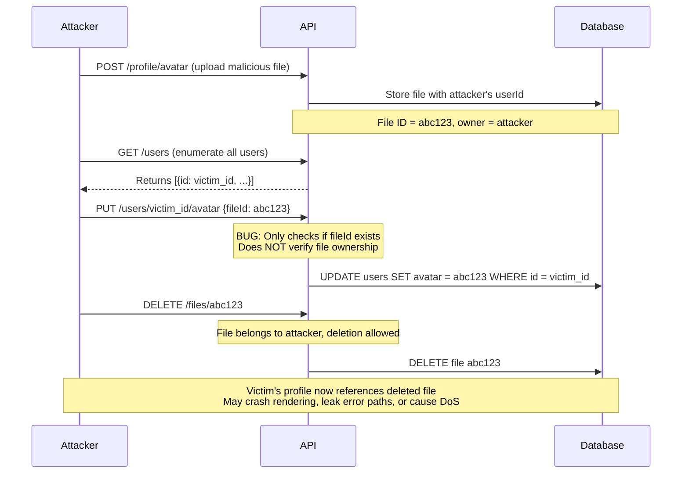
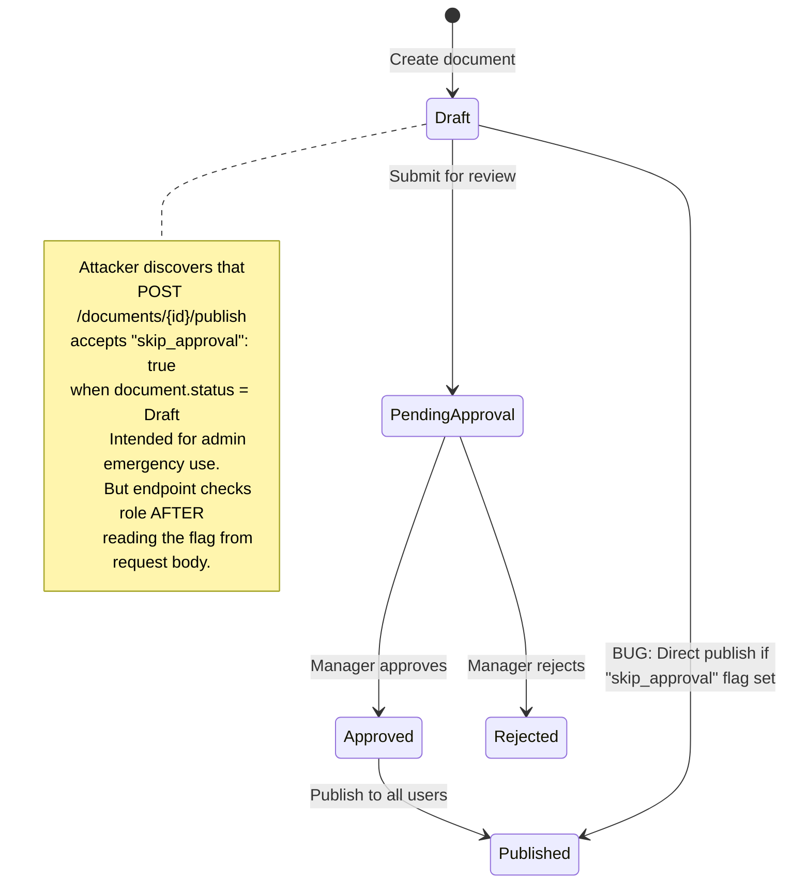
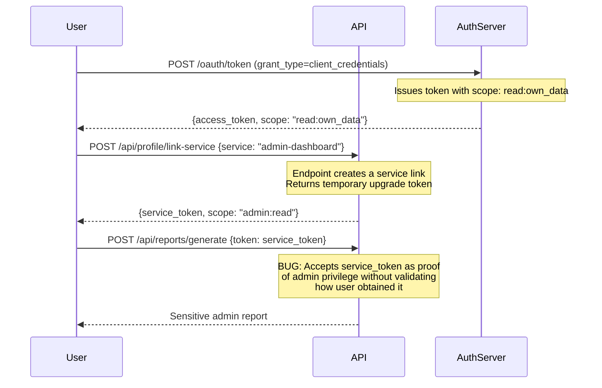
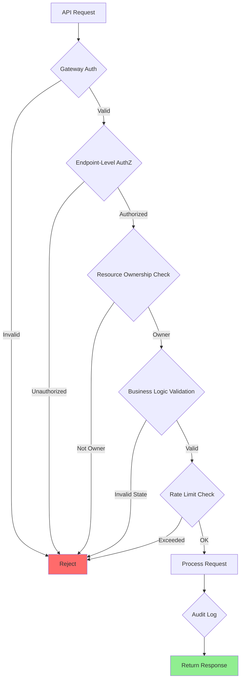

# API Chaining Attacks

> **API chaining attacks in post-exploitation context means leveraging multiple legitimate API endpoints in sequence to achieve an objective no single endpoint would permit on its own. In authorized security testing, your goal is to verify that each API enforces its own authorization checks rather than trusting outputs from upstream APIs.**

---

## 🧠 What Is It? (Beginner Explanation)

Imagine you have access to a document management API with these three endpoints:

1. `GET /api/documents/{id}` — retrieve document metadata
2. `POST /api/documents/{id}/share` — share a document with another user
3. `POST /api/documents/{id}/delete` — delete a document

Each endpoint checks whether **you** own the document. That looks secure on paper. But what if there's a fourth endpoint?

4. `GET /api/users/me/documents` — list all documents shared **with** you

If the API uses "shared with you" as proof of ownership, then you can:

- Ask someone to share a document with you (legitimate action)
- The document appears in *your* shared list (legitimate state)
- Now you call `/api/documents/{id}/delete` and the API sees you in the shared list, assumes you're the owner, and allows deletion (unintended consequence)

That sequence of legitimate actions → unintended privilege escalation is an **API chaining attack**.

**Example analogy:** You're allowed to check out a library book. You're allowed to return books to the drop-box. But chaining those two actions in a specific order with the right timing lets you return a book you never checked out and trigger a billing error for someone else.

API chaining exploits the **composition of authorization decisions** across endpoints.

---

## 🏗️ How It Works (Technical Deep Dive)

### Step 1: Reconnaissance of API Relationships

API chaining starts by mapping which endpoints feed data or state to other endpoints.

**Common patterns:**

| Pattern | Description | Example Chain |
|---------|-------------|---------------|
| **State mutation chain** | Endpoint A changes state; endpoint B relies on that state | Create draft → Publish → Share |
| **Data extraction chain** | Endpoint A provides IDs/tokens; endpoint B consumes them | List resources → Get details → Download file |
| **Privilege escalation chain** | Endpoint A grants a weak capability; endpoint B trusts it as strong proof | Request trial → Upgrade feature → Access admin panel |
| **Workflow bypass chain** | Endpoint A enforces rules; endpoint B skips checks if invoked after C | Submit for approval → Admin override (via separate flow) → Publish |
| **Cross-context chain** | Endpoint A operates in user context; endpoint B operates in service context but trusts user-controlled input | User uploads file → Backend processes file → Backend writes to privileged location |

### Step 2: Identify Trust Boundaries

For each API endpoint, determine:

- What **inputs** does it accept?
- What **authorization checks** does it perform?
- What **downstream actions** does it trigger?
- What **assumptions** does it make about the caller's identity or permissions?

**Critical question:** Does endpoint B perform its **own** authorization check, or does it assume that "if you reached this point, you must have permission"?

### Step 3: Chain Construction

Build a directed graph of API calls:

```mermaid
graph LR
    A[GET /users/me] -->|returns userId| B[POST /documents]
    B -->|returns documentId| C[POST /documents/id/share]
    C -->|shares with attacker-controlled user| D[GET /documents/id/export]
    D -->|trusts shared status| E[Access to sensitive data]
    
    style A fill:#90EE90
    style B fill:#90EE90
    style C fill:#FFD700
    style D fill:#FFD700
    style E fill:#FF6B6B
```



- **Green** = Legitimate, authorized actions
- **Yellow** = Borderline actions that require specific context
- **Red** = Unintended consequence

### Step 4: Execution With Timing and State Coordination

Some chains require precise timing:

- Race conditions between two endpoints
- Exploiting eventual consistency windows in distributed APIs
- Replaying state transitions before caches invalidate

---

## 📊 Chain Attack Architecture Patterns

### Pattern 1: BOLA Chain



**What made this chain possible:**

- The `PUT /users/{id}/avatar` endpoint assumed any valid `fileId` was safe to assign
- It trusted the **existence** of the file but not **ownership** of the file
- It allowed cross-user resource assignment without verifying the relationship

### Pattern 2: Workflow State Bypass



**Exploitation sequence:**

1. Create document (attacker has `create` permission)
2. Call `POST /documents/{id}/publish?skip_approval=true`
3. API reads flag **before** checking role
4. Logic flaw: if flag is true, skip role check
5. Document published without approval workflow

### Pattern 3: Token Scope Escalation



**Why this works:**

- The link-service endpoint was meant for internal service-to-service communication
- But it was exposed to regular users
- The report generation endpoint trusted any token with the right scope claim
- It didn't verify the **issuance context** or **subject** of the token

---

## ⚙️ Technical Details

### Identifying Chainable Endpoints

**Method 1: Static analysis of OpenAPI spec**

```python
import yaml

with open('openapi.yaml') as f:
    spec = yaml.safe_load(f)

# Find endpoints that return resource IDs
for path, methods in spec['paths'].items():
    for method, details in methods.items():
        responses = details.get('responses', {})
        schema = responses.get('200', {}).get('content', {}).get('application/json', {}).get('schema', {})
        
        if 'properties' in schema:
            for prop, prop_schema in schema['properties'].items():
                if 'Id' in prop or 'Reference' in prop:
                    print(f"{method.upper()} {path} returns {prop}")
```

**Method 2: Runtime tracing with Burp Suite**

Use Burp's **Logger++** or **Flow** extension to:

- Record sequences of API calls made by the legitimate frontend
- Identify which responses contain values reused in subsequent requests
- Extract parameter flow: `response[A].userId → request[B].targetUser`

**Method 3: GraphQL introspection analysis**

```graphql
query {
  __schema {
    types {
      name
      fields {
        name
        type {
          name
          ofType {
            name
          }
        }
      }
    }
  }
}
```

Look for fields that return object IDs, then find mutations that accept those IDs.

### Authorization Decision Points to Test

| Decision Point | What to verify |
|----------------|----------------|
| **Resource ownership** | Does endpoint B re-verify the user owns the resource from endpoint A? |
| **Scope inheritance** | If endpoint A grants a temporary capability, does B validate its boundaries? |
| **Context preservation** | Does B enforce the same context (tenant, user, role) as A? |
| **State transition rules** | Can you reach state X directly without going through required state Y? |
| **Cross-endpoint rate limits** | Are rate limits enforced per-endpoint or per-user-action? |
| **Idempotency assumptions** | Does retry logic assume previous calls succeeded or failed? |

---

## 🔴 Attack Surface

### Vulnerable Scenario 1: User Enumeration → BOLA

**Vulnerable code pattern:**

```javascript
// Endpoint 1: Get current user's ID
app.get('/api/user/me', authenticate, (req, res) => {
  res.json({ id: req.user.id, name: req.user.name });
});

// Endpoint 2: Update user email (VULNERABLE)
app.put('/api/user/:id/email', authenticate, (req, res) => {
  // BUG: Authenticates user but doesn't verify req.user.id === req.params.id
  db.query('UPDATE users SET email = ? WHERE id = ?', 
           [req.body.email, req.params.id]);
  res.json({ success: true });
});
```

**Chain:**

1. Call `/api/user/me` to get your own ID (e.g., `42`)
2. Guess or enumerate other user IDs (`1`, `2`, `3`, ...)
3. Call `PUT /api/user/1/email` to change victim's email
4. Use password reset flow to take over victim's account

### Vulnerable Scenario 2: Payment Bypass

**Vulnerable API flow:**

```javascript
// Step 1: Create order
app.post('/api/orders', authenticate, (req, res) => {
  const order = {
    id: generateId(),
    userId: req.user.id,
    items: req.body.items,
    total: calculateTotal(req.body.items),
    status: 'pending_payment'
  };
  db.insert('orders', order);
  res.json(order);
});

// Step 2: Process payment
app.post('/api/payments', authenticate, (req, res) => {
  // ... payment gateway logic ...
  db.query('UPDATE orders SET status = ? WHERE id = ?', 
           ['paid', req.body.orderId]);
});

// Step 3: Fulfill order (VULNERABLE)
app.post('/api/orders/:id/fulfill', authenticate, (req, res) => {
  const order = db.query('SELECT * FROM orders WHERE id = ?', [req.params.id]);
  
  // BUG: Only checks if order exists and status is 'paid'
  // Doesn't verify req.user.id === order.userId
  if (order.status === 'paid') {
    fulfillOrder(order);
    res.json({ success: true });
  }
});
```

**Chain:**

1. Create your own order (orderId = `A`)
2. **Don't pay for it**
3. Victim creates and pays for their order (orderId = `B`)
4. Call `POST /api/orders/B/fulfill` — API checks order B is paid (true), fulfills it
5. Call `POST /api/orders/A/fulfill` — if caching is weak or logic flawed, your unpaid order might get fulfilled

**Real-world variant:** In microservices, the fulfillment service might only receive `orderId` from the API gateway and trust the payment service already validated it. Race conditions can allow fulfillment before payment completion propagates.

### Vulnerable Scenario 3: Admin Feature Exposure

```python
# Backend assumes this endpoint is only called by admin UI
@app.route('/api/debug/impersonate', methods=['POST'])
@require_authenticated
def impersonate_user():
    target_user_id = request.json.get('userId')
    
    # BUG: Checks authentication but not authorization
    # Assumes "if you know this endpoint exists, you're admin"
    session['impersonated_user'] = target_user_id
    return jsonify({'success': True})

@app.route('/api/protected/resource', methods=['GET'])
@require_authenticated
def get_protected_resource():
    user_id = session.get('impersonated_user', session['user_id'])
    # Returns resource for impersonated user
    return jsonify(get_resource_for_user(user_id))
```

**Chain:**

1. Discover `/api/debug/impersonate` via JavaScript source maps, developer tools, or endpoint fuzzing
2. Call `POST /api/debug/impersonate {"userId": "admin"}`
3. Call `GET /api/protected/resource` → receive admin's data

---

## 💥 Exploitation Methodology

### Prerequisites

- Valid API credentials (even low-privilege)
- Understanding of API endpoint relationships
- Tools for session management and request sequencing
- Burp Suite, Postman, or custom scripts

### Step 1: Map API Dependency Graph

**Using Burp Suite:**

1. Browse the application normally while proxying through Burp
2. Go to **Proxy → HTTP History**
3. Filter for API calls (e.g., `/api/*`)
4. Export to CSV and analyze parameter flow

**Using `jq` and shell scripts:**

```bash
# Extract all API endpoints from HAR file
cat requests.har | jq -r '.log.entries[].request.url' | grep '/api/' | sort -u > endpoints.txt

# Identify response fields that appear in subsequent requests
cat requests.har | jq -r '.log.entries[] | 
  select(.response.content.mimeType | contains("json")) | 
  .response.content.text' | jq -r 'keys[]' | sort | uniq -c | sort -rn
```

### Step 2: Test Each Endpoint Independently

For each endpoint, verify:

```http
# Test 1: Direct object reference
GET /api/documents/1 HTTP/1.1
Authorization: Bearer <your_token>

# Expected: 404 or 403 if document doesn't belong to you
# Vulnerable: 200 with document data

# Test 2: Mass assignment
POST /api/users/me HTTP/1.1
Content-Type: application/json
Authorization: Bearer <your_token>

{"email": "new@example.com", "role": "admin"}

# Expected: Ignore or reject 'role' field
# Vulnerable: Role updated to admin
```

### Step 3: Build Exploitation Chain

**Example Python script for chaining:**

```python
import requests

API_BASE = "https://api.example.com"
session = requests.Session()

# Step 1: Authenticate
auth_response = session.post(f"{API_BASE}/auth/login", json={
    "username": "attacker",
    "password": "password123"
})
token = auth_response.json()['access_token']
session.headers.update({'Authorization': f'Bearer {token}'})

# Step 2: Create resource
create_response = session.post(f"{API_BASE}/api/documents", json={
    "title": "Test Document",
    "content": "Benign content"
})
doc_id = create_response.json()['id']
print(f"[+] Created document {doc_id}")

# Step 3: Share with victim (if endpoint allows specifying target)
share_response = session.post(f"{API_BASE}/api/documents/{doc_id}/share", json={
    "targetUserId": "victim_user_id",
    "permission": "read"
})
print(f"[+] Shared document with victim")

# Step 4: Escalate permission via separate endpoint
# This endpoint might not re-check ownership if user is in ACL
escalate_response = session.put(f"{API_BASE}/api/documents/{doc_id}/permissions", json={
    "userId": "victim_user_id",
    "permission": "owner"  # Escalate from read to owner
})

# Step 5: Victim can now delete document they don't actually own
print(f"[+] Escalated victim to owner")
print(f"[!] Victim can now call DELETE /api/documents/{doc_id}")
```

### Step 4: Timing-Based Chains

For race conditions or eventual consistency exploitation:

```python
import threading
import requests

def create_and_use_token():
    # Thread 1: Create temporary token
    response = requests.post(f"{API_BASE}/api/tokens/temporary", 
                            headers={'Authorization': f'Bearer {auth_token}'})
    temp_token = response.json()['token']
    
    # Thread 2: Use token before expiry
    # Race condition: use token before server-side validation completes
    requests.get(f"{API_BASE}/api/admin/dashboard",
                headers={'Authorization': f'Bearer {temp_token}'})

threads = [threading.Thread(target=create_and_use_token) for _ in range(10)]
for t in threads:
    t.start()
for t in threads:
    t.join()
```

---

## 🛠️ Tools & Commands

| Tool | Purpose | Usage |
|------|---------|-------|
| **Burp Suite Pro** | Intercept, sequence, and automate API chains | Use **Macros** and **Session Handling Rules** |
| **Postman** | Build and test API sequences | Use **Collection Runner** with data files |
| **mitmproxy** | Script-based request modification | Python scripting for dynamic chaining |
| **GraphQL Voyager** | Visualize GraphQL schema relationships | Identify mutation chains |
| **Arjun** | Discover hidden API parameters | `arjun -u https://api.example.com/endpoint` |
| **ffuf** | Fuzz API endpoint paths | `ffuf -u https://api.example.com/FUZZ -w wordlist.txt` |

### Burp Suite Macro Example

**Scenario:** Chain authentication → resource creation → privilege escalation

1. Go to **Project options → Sessions → Session Handling Rules**
2. Add rule → **Run a macro**
3. Record macro:
   - Request 1: `POST /auth/login` → extract token
   - Request 2: `POST /api/resources` → extract resource ID
   - Request 3: `PUT /api/resources/{ID}/owner` → inject ID from step 2
4. Set scope to match your target API
5. Run the sequence automatically for each test case

### Custom Python Chain Script

```python
#!/usr/bin/env python3
"""
API Chain Exploit Framework
Tests for authorization bypass via endpoint chaining
"""

import requests
import sys
from typing import Dict, List, Any

class APIChainTester:
    def __init__(self, base_url: str, auth_token: str):
        self.base_url = base_url
        self.session = requests.Session()
        self.session.headers.update({
            'Authorization': f'Bearer {auth_token}',
            'Content-Type': 'application/json'
        })
        self.chain_log = []
    
    def log(self, step: str, endpoint: str, status: int, note: str = ""):
        entry = {
            'step': step,
            'endpoint': endpoint,
            'status': status,
            'note': note
        }
        self.chain_log.append(entry)
        print(f"[{step}] {endpoint} → {status} | {note}")
    
    def test_bola_chain(self, victim_id: str) -> bool:
        """
        Test if endpoints allow cross-user resource manipulation
        """
        # Step 1: Create resource as attacker
        resp = self.session.post(f"{self.base_url}/api/files", json={
            'name': 'test.txt',
            'content': 'attacker content'
        })
        
        if resp.status_code != 201:
            self.log("CREATE", "/api/files", resp.status_code, "Failed to create")
            return False
        
        file_id = resp.json().get('id')
        self.log("CREATE", "/api/files", 201, f"Created file {file_id}")
        
        # Step 2: Try to assign file to victim
        resp = self.session.put(f"{self.base_url}/api/users/{victim_id}/avatar", json={
            'fileId': file_id
        })
        
        if resp.status_code == 200:
            self.log("EXPLOIT", f"/api/users/{victim_id}/avatar", 200, 
                    "⚠️  VULNERABLE: Cross-user resource assignment allowed")
            return True
        else:
            self.log("BLOCKED", f"/api/users/{victim_id}/avatar", resp.status_code,
                    "✓ Properly rejected")
            return False
    
    def test_workflow_bypass(self, resource_id: str) -> bool:
        """
        Test if workflow states can be bypassed
        """
        # Step 1: Create draft
        resp = self.session.post(f"{self.base_url}/api/documents", json={
            'title': 'Test Doc',
            'status': 'draft'
        })
        doc_id = resp.json().get('id')
        self.log("CREATE", "/api/documents", 201, f"Created draft {doc_id}")
        
        # Step 2: Try to publish without approval
        resp = self.session.post(f"{self.base_url}/api/documents/{doc_id}/publish", json={
            'skip_approval': True
        })
        
        if resp.status_code == 200:
            self.log("EXPLOIT", f"/api/documents/{doc_id}/publish", 200,
                    "⚠️  VULNERABLE: Workflow bypass allowed")
            return True
        else:
            self.log("BLOCKED", f"/api/documents/{doc_id}/publish", resp.status_code,
                    "✓ Workflow enforced")
            return False
    
    def report(self):
        print("\n" + "="*60)
        print("API CHAIN TEST REPORT")
        print("="*60)
        
        vulnerable_steps = [s for s in self.chain_log if 'VULNERABLE' in s['note']]
        if vulnerable_steps:
            print(f"\n⚠️  Found {len(vulnerable_steps)} vulnerable chain(s):\n")
            for step in vulnerable_steps:
                print(f"  - {step['endpoint']}: {step['note']}")
        else:
            print("\n✓ No chain vulnerabilities detected")
        
        print(f"\nTotal steps tested: {len(self.chain_log)}")

if __name__ == "__main__":
    if len(sys.argv) < 3:
        print("Usage: python3 api_chain_tester.py <base_url> <auth_token>")
        sys.exit(1)
    
    tester = APIChainTester(sys.argv[1], sys.argv[2])
    
    # Run test suite
    tester.test_bola_chain(victim_id="victim_user_123")
    tester.test_workflow_bypass(resource_id="doc_456")
    
    tester.report()
```

**Usage:**

```bash
python3 api_chain_tester.py https://api.example.com eyJhbGciOiJIUzI1NiIsInR5cCI6IkpXVCJ9...
```

---

## 🔍 Detection

### Log-Based Detection

**Pattern 1: Rapid sequential calls to related endpoints**

```sql
-- Detect user making create → share → modify chain within short time window
SELECT 
    user_id,
    COUNT(DISTINCT endpoint) as unique_endpoints,
    COUNT(*) as total_calls,
    MIN(timestamp) as first_call,
    MAX(timestamp) as last_call,
    TIMESTAMPDIFF(SECOND, MIN(timestamp), MAX(timestamp)) as duration_seconds
FROM api_logs
WHERE endpoint IN (
    '/api/documents',
    '/api/documents/*/share',
    '/api/documents/*/permissions'
)
AND timestamp > NOW() - INTERVAL 5 MINUTE
GROUP BY user_id
HAVING unique_endpoints = 3 
AND duration_seconds < 10;
```

**Pattern 2: Cross-user resource access after relationship creation**

```python
# Pseudo-code for SIEM rule
if (
    event.endpoint == "/api/documents/{id}/share" and
    event.status == 200 and
    within(5 minutes, 
        related_event where (
            related_event.endpoint == "/api/documents/{same_id}/delete" and
            related_event.user_id == event.target_user_id
        )
    )
):
    alert("Potential share → escalate → delete chain")
```

### Behavioral Indicators

| Indicator | Description | Confidence |
|-----------|-------------|------------|
| **Out-of-order API calls** | Endpoints called in sequence not seen in normal workflows | Medium |
| **Parameter value reuse** | Response value from endpoint A appears in request to endpoint B within seconds | High |
| **Cross-context access** | Same user accessing both user and admin endpoints in same session | High |
| **State transition anomaly** | Resource moves from state A → C without visiting required state B | High |
| **Failed authorization followed by success** | 403 on endpoint A, then 200 on related endpoint B with similar parameters | Medium |

### Application-Level Detection

**Implement sequence validation:**

```javascript
// Track expected workflow sequences
const validWorkflows = {
  'document_publish': ['create', 'submit_for_review', 'approve', 'publish'],
  'payment_flow': ['create_order', 'initiate_payment', 'confirm_payment', 'fulfill']
};

function validateWorkflowStep(userId, workflow, currentStep) {
  const userState = getUserWorkflowState(userId, workflow);
  const validSteps = validWorkflows[workflow];
  const currentIndex = validSteps.indexOf(currentStep);
  const lastIndex = validSteps.indexOf(userState.lastStep);
  
  // Ensure user follows sequence in order
  if (currentIndex !== lastIndex + 1) {
    logSecurityEvent({
      type: 'workflow_violation',
      userId: userId,
      workflow: workflow,
      expected: validSteps[lastIndex + 1],
      actual: currentStep
    });
    return false;
  }
  
  return true;
}
```

---

## 🛡️ Mitigation & Defense

### Defense in Depth Strategy



### Secure Code Patterns

**Pattern 1: Always Re-Verify Resource Ownership**

```javascript
// VULNERABLE: Trusts that authentication implies authorization
app.put('/api/documents/:id', authenticate, async (req, res) => {
  await db.updateDocument(req.params.id, req.body);
  res.json({ success: true });
});

// SECURE: Explicitly checks ownership at each endpoint
app.put('/api/documents/:id', authenticate, async (req, res) => {
  const document = await db.getDocument(req.params.id);
  
  if (!document) {
    return res.status(404).json({ error: 'Document not found' });
  }
  
  // Critical: Verify caller owns the resource
  if (document.ownerId !== req.user.id) {
    return res.status(403).json({ error: 'Access denied' });
  }
  
  await db.updateDocument(req.params.id, req.body);
  res.json({ success: true });
});
```

**Pattern 2: Validate State Transitions**

```python
# VULNERABLE: Allows arbitrary state changes
@app.route('/api/orders/<order_id>/status', methods=['PUT'])
@require_authenticated
def update_order_status(order_id):
    new_status = request.json.get('status')
    db.execute("UPDATE orders SET status = ? WHERE id = ?", (new_status, order_id))
    return jsonify({'success': True})

# SECURE: Enforces valid state machine
VALID_TRANSITIONS = {
    'pending': ['processing', 'cancelled'],
    'processing': ['shipped', 'cancelled'],
    'shipped': ['delivered'],
    'delivered': [],
    'cancelled': []
}

@app.route('/api/orders/<order_id>/status', methods=['PUT'])
@require_authenticated
def update_order_status(order_id):
    order = db.query("SELECT * FROM orders WHERE id = ?", (order_id,)).fetchone()
    
    if order['user_id'] != session['user_id']:
        return jsonify({'error': 'Access denied'}), 403
    
    new_status = request.json.get('status')
    current_status = order['status']
    
    # Validate state transition
    if new_status not in VALID_TRANSITIONS.get(current_status, []):
        return jsonify({
            'error': f'Invalid transition: {current_status} → {new_status}'
        }), 400
    
    db.execute("UPDATE orders SET status = ? WHERE id = ?", (new_status, order_id))
    return jsonify({'success': True})
```

**Pattern 3: Context-Aware Authorization**

```go
// SECURE: Tracks and validates request context
type RequestContext struct {
    UserID      string
    Role        string
    TenantID    string
    Permissions []string
}

func (ctx *RequestContext) CanAccessResource(resourceID string) bool {
    resource, err := db.GetResource(resourceID)
    if err != nil {
        return false
    }
    
    // Multi-layered checks
    checks := []bool{
        resource.TenantID == ctx.TenantID,           // Tenant isolation
        resource.OwnerID == ctx.UserID,              // Ownership
        ctx.HasPermission("read:" + resource.Type),  // Role-based permission
    }
    
    return allTrue(checks)
}

func UpdateResourceHandler(w http.ResponseWriter, r *http.Request) {
    ctx := extractRequestContext(r)
    resourceID := mux.Vars(r)["id"]
    
    // Always re-verify, never trust upstream
    if !ctx.CanAccessResource(resourceID) {
        http.Error(w, "Access denied", http.StatusForbidden)
        return
    }
    
    // Proceed with update
}
```

### Architecture-Level Mitigations

| Mitigation | Implementation | Effectiveness |
|------------|----------------|---------------|
| **API Gateway Authorization** | Centralized policy enforcement before routing | High |
| **Zero Trust Model** | Every endpoint validates full context independently | Very High |
| **Immutable Audit Logs** | Log every authorization decision for forensic analysis | Medium (detective) |
| **Request Signing** | Cryptographically sign inter-service requests | High for service-to-service |
| **Workflow Orchestration** | Use state machine framework (e.g., AWS Step Functions) | High |
| **Rate Limiting Per Chain** | Track and limit sequences, not just individual calls | Medium |

### Configuration Example: API Gateway Policy

```yaml
# Kong API Gateway - Authorization Plugin Configuration
plugins:
  - name: request-validator
    config:
      body_schema: 
        - required: ["userId"]
          properties:
            userId:
              type: string
              pattern: "^[0-9a-f]{24}$"
  
  - name: acl
    config:
      allow: ["authenticated"]
  
  - name: custom-authorization
    config:
      enforce_ownership: true
      ownership_claim: "sub"
      resource_id_from: "path"  # Extract from URL path
      validate_state_transitions: true
      
  - name: rate-limiting
    config:
      second: 10
      policy: redis
      # Track chains by user + endpoint sequence
      identifier: user_endpoint_sequence
```

### Defensive Checklist

- [ ] Every endpoint performs its own authorization check
- [ ] Resource ownership is verified against authenticated user ID
- [ ] State transitions follow a defined state machine
- [ ] Sensitive operations require re-authentication or MFA
- [ ] Cross-user resource sharing is explicitly granted, not inferred
- [ ] API responses don't leak resource IDs user shouldn't access
- [ ] Workflow bypasses (admin overrides) require elevated privileges
- [ ] Audit logs capture full request context (user, tenant, resource)
- [ ] Rate limits account for multi-step attack chains
- [ ] Regression tests cover known chain attack patterns

---

## 📚 Real-World Examples

### Example 1: Uber - God Mode

**What happened:**

Uber's internal admin tool allowed support staff to:

1. Search for user by email
2. View user's trip history
3. Impersonate user to debug issues

The chain became abusable when:

- Step 1 didn't log the search query
- Step 2 didn't require justification
- Step 3 allowed full account takeover without time limits

**Chain attack:**

```
Search user → View trips → Impersonate → Book rides on victim's card
```

**Fix:**

- Require manager approval for impersonation
- Auto-expire impersonation sessions after 15 minutes
- Log every impersonation action with justification ticket ID

### Example 2: Instagram - Account Takeover

**Vulnerability chain:**

1. `POST /api/accounts/password_reset` — send reset code to phone
2. `POST /api/accounts/verify_code` — no rate limit on attempts
3. Brute force 6-digit code
4. `POST /api/accounts/set_password` — set new password

**Mitigation:**

- Add rate limit to verification endpoint (max 3 attempts)
- Implement exponential backoff
- Require re-entering email/username after failed attempts
- Send notification to account email when reset initiated

### Example 3: GitHub - Private Repo Access

**Theoretical chain:**

1. Create public repo
2. Fork target private repo (if you have read access)
3. Create PR from your fork to original repo
4. Use PR API to read diff of private repo
5. Even if PR is rejected, diff remains accessible via API

**Why it's prevented:**

GitHub's fork API:

- Validates source repo visibility before allowing fork
- PR APIs check read permission on both source and target
- Diff endpoints re-verify authorization even for cached content

---

## 🎯 Testing Strategy

### Test Case Matrix

| Test ID | Chain Pattern | Expected Behavior | Test Steps |
|---------|---------------|-------------------|------------|
| TC-01 | Create → Share → Delete | Only owner can delete even if shared | 1. Create resource<br>2. Share with user B<br>3. User B attempts delete<br>4. Expect 403 |
| TC-02 | Draft → Publish (skip review) | Publish requires approval state | 1. Create draft<br>2. POST /publish<br>3. Expect 400 or 403 |
| TC-03 | Token create → Token use (expired) | Expired tokens rejected | 1. Create temp token<br>2. Wait for expiry<br>3. Use token<br>4. Expect 401 |
| TC-04 | User A creates → User B modifies | Cross-user modification blocked | 1. User A creates resource<br>2. User B PUTs to /resources/{id}<br>3. Expect 403 |
| TC-05 | Payment pending → Fulfill order | Fulfillment requires payment complete | 1. Create order<br>2. Skip payment<br>3. POST /fulfill<br>4. Expect 402 |

### Automation Script Template

```bash
#!/bin/bash
# API Chain Test Suite

API_BASE="https://api.example.com"
TOKEN_USER_A="<token_a>"
TOKEN_USER_B="<token_b>"

# Test Case 1: BOLA Chain
echo "[*] Testing BOLA chain..."

# User A creates resource
RESOURCE_ID=$(curl -s -X POST "$API_BASE/api/files" \
  -H "Authorization: Bearer $TOKEN_USER_A" \
  -H "Content-Type: application/json" \
  -d '{"name":"test.txt"}' | jq -r '.id')

echo "[+] User A created resource: $RESOURCE_ID"

# User B tries to access User A's resource
HTTP_CODE=$(curl -s -o /dev/null -w "%{http_code}" \
  -X GET "$API_BASE/api/files/$RESOURCE_ID" \
  -H "Authorization: Bearer $TOKEN_USER_B")

if [ "$HTTP_CODE" == "200" ]; then
  echo "[!] VULNERABLE: User B can access User A's resource"
else
  echo "[✓] SECURE: User B received $HTTP_CODE"
fi

# Test Case 2: Workflow Bypass
echo "[*] Testing workflow bypass..."

DOC_ID=$(curl -s -X POST "$API_BASE/api/documents" \
  -H "Authorization: Bearer $TOKEN_USER_A" \
  -H "Content-Type: application/json" \
  -d '{"title":"Test","status":"draft"}' | jq -r '.id')

HTTP_CODE=$(curl -s -o /dev/null -w "%{http_code}" \
  -X POST "$API_BASE/api/documents/$DOC_ID/publish" \
  -H "Authorization: Bearer $TOKEN_USER_A" \
  -H "Content-Type: application/json" \
  -d '{"skip_approval":true}')

if [ "$HTTP_CODE" == "200" ]; then
  echo "[!] VULNERABLE: Workflow bypass allowed"
else
  echo "[✓] SECURE: Workflow enforced (HTTP $HTTP_CODE)"
fi
```

---

## 📚 References

- [OWASP API Security Top 10 - API1:2023 Broken Object Level Authorization](https://owasp.org/API-Security/editions/2023/en/0xa1-broken-object-level-authorization/)
- [OWASP API Security Top 10 - API5:2023 Broken Function Level Authorization](https://owasp.org/API-Security/editions/2023/en/0xa5-broken-function-level-authorization/)
- [PortSwigger - API Testing](https://portswigger.net/web-security/api-testing)
- [NIST SP 800-204 - Security Strategies for Microservices](https://csrc.nist.gov/publications/detail/sp/800-204/final)
- [IETF RFC 8693 - OAuth 2.0 Token Exchange](https://www.rfc-editor.org/rfc/rfc8693.html)
- [Burp Suite - API Security Testing](https://portswigger.net/burp/documentation/desktop/testing-workflow/working-with-apis)
- [Postman - Authorization Workflows](https://learning.postman.com/docs/sending-requests/authorization/)
- [SANS - API Security Best Practices](https://www.sans.org/white-papers/)
- [HackerOne - API Security Findings](https://www.hackerone.com/company/vulnerability-database)

---

## 🔑 Key Takeaways

1. **API chaining exploits composition, not individual flaws** — Each endpoint may be secure in isolation but vulnerable when combined
2. **Authorization must be re-verified at every endpoint** — Never trust that upstream checks were performed
3. **State machines prevent workflow bypasses** — Explicitly define and enforce valid state transitions
4. **Context matters more than credentials** — User ID, tenant ID, role, and resource ownership must all align
5. **Defense requires thinking in graphs, not trees** — Map all possible paths through your API, not just intended ones
6. **Logging sequence patterns is critical for detection** — Individual requests may look legitimate; the sequence reveals intent
7. **Testing requires building chains, not just fuzzing endpoints** — Use Burp macros, Postman collections, or custom scripts to automate multi-step testing

---

**Remember:** In post-exploitation, API chaining is how attackers move laterally, escalate privileges, and persist. As an authorized tester, your goal is to find these chains before they're weaponized.
