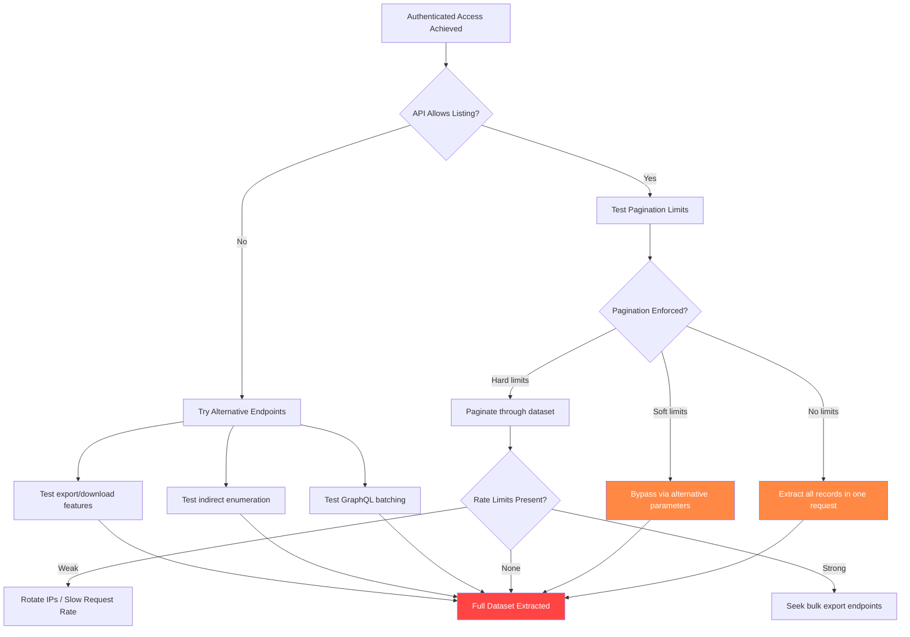
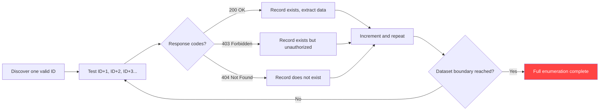
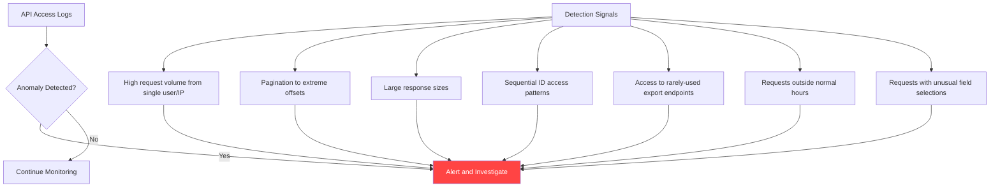
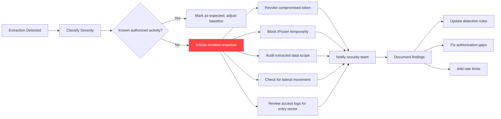
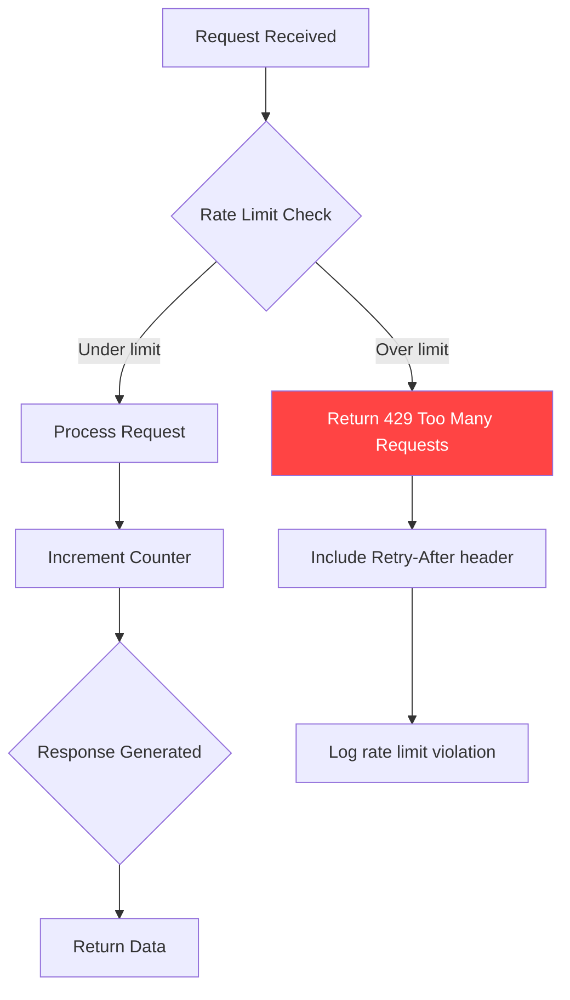
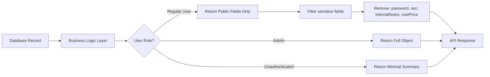
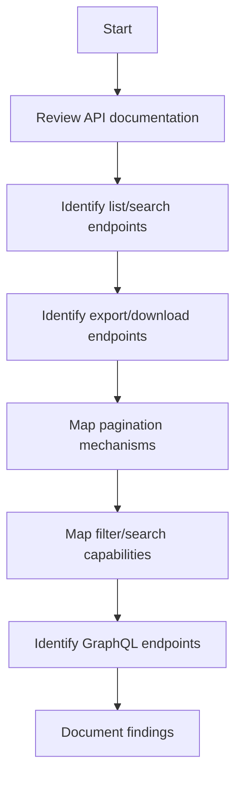

# Data Extraction

> **Data extraction in API post-exploitation is the authorized process of retrieving business-critical information after gaining access to verify the full scope of impact. For defenders and authorized testers, it means understanding what data could be exfiltrated by attackers, how pagination and rate limits can be bypassed, and what detection opportunities exist during bulk data access.**

> **Authorized use only:** everything in this note is for approved security assessments, penetration testing engagements with explicit written permission, or internal defensive research.

---

## 🧠 What Is Data Extraction? (Beginner Explanation)

Data extraction is what happens after you have already compromised an API. You have:

- a valid token
- access to an endpoint
- the ability to read data

Now the question becomes: **how much data can you retrieve, and how fast?**

Think of it like walking into a library with a valid library card. The card proves you should be there, but the real question is:

- Can you check out one book at a time, or can you take the entire shelf?
- Can you photocopy restricted archives, or are there controls watching for bulk copying?
- Will alarms go off if you try to export the catalog in the middle of the night?

That is the essence of data extraction testing in APIs:

> **Proving access is step one. Understanding the extraction boundary is step two.**

---

## 🎯 Why Data Extraction Matters in API Security

APIs are uniquely vulnerable to bulk data access for several structural reasons.

### 1. APIs are designed for automation and scale

Unlike web pages meant for one human user clicking through slowly, APIs are built to:

- return hundreds or thousands of records per request
- accept pagination and filtering parameters
- enable batch operations
- serve mobile apps, integrations, and background jobs

That efficiency becomes a security risk when authorization checks are missing or weak.

### 2. APIs often expose more data than the UI shows

A frontend may display 10 fields, but the backend API might return:

- internal IDs
- timestamps and metadata
- linked object references
- soft-deleted records
- computed fields and aggregations
- embedded related objects

An authorized tester with API access may discover that the real data exposure is far larger than what the application UI suggests.

### 3. APIs rarely apply strict per-user rate limits on reads

Many APIs enforce rate limits on:

- authentication attempts
- password resets
- expensive operations like report generation

But they often overlook rate limiting on:

- simple `GET` endpoints
- paginated list operations
- search queries
- filtered record retrieval

An attacker with a valid token may be able to extract an entire database through legitimate-looking read requests.

### 4. Detection is harder without proper instrumentation

Unlike SQL dumps or file downloads from compromised servers, API-based data extraction often looks like normal traffic:

- valid tokens
- successful responses (200 OK)
- no server-side errors
- typical user-agent strings
- reasonable query patterns

Without proper logging, anomaly detection, and monitoring, defenders may never realize a full data extraction occurred.

---

## 🧩 Data Extraction vs Related Concepts

| Concept | Core question | Example | Security layer |
|---|---|---|---|
| **Data extraction** | How much data can I retrieve? | Paginate through `/users` and save 500,000 records | Post-exploitation, data leakage |
| **Broken Object Level Authorization (BOLA)** | Can I access objects I should not? | Read invoice belonging to another tenant | Authorization failure |
| **Excessive Data Exposure** | Does the API return more fields than needed? | `GET /profile` returns password hash and internal flags | API design / response filtering |
| **Security Misconfiguration** | Are there missing or weak controls? | No pagination limits, no rate limits on list endpoints | Configuration and hardening |
| **Mass Assignment** | Can I write fields I should not control? | Change `role=admin` via PATCH request | Input validation / property-level authz |

### The key distinction

- **BOLA** is about **what** you can access.
- **Excessive Data Exposure** is about **what fields** are returned.
- **Data extraction** is about **how much** you can extract once access is granted.

All three are related, but testing them requires different approaches.

---

## 🔬 Common Data Extraction Patterns



---

## 📦 Extraction Attack Surfaces

### 1. Pagination abuse

Most APIs implement pagination to control response sizes, but many do it poorly.

| Weakness | What it looks like | Example | Impact |
|---|---|---|---|
| **No pagination enforcement** | API accepts `limit=999999` or `pageSize=all` | `GET /users?limit=999999` returns full dataset | One-request full extraction |
| **Soft maximum not enforced** | Stated max is 100, but API accepts 10,000 | Docs say max 100, but `limit=10000` works | Minimal pagination needed |
| **Missing offset validation** | No check on `offset` value | Request offset=1000000 to probe dataset size | Enumeration and probing |
| **Cursor reuse** | Pagination cursors do not expire or validate ownership | Reuse cursors across tenants or users | Cross-tenant data leakage |
| **Inconsistent pagination across endpoints** | Some endpoints enforce limits, others do not | `/v1/orders` limited, `/v2/orders` unlimited | Bypass via API version hopping |

#### Testing approach

```http
# Test 1: No limit parameter
GET /api/users HTTP/1.1
Authorization: Bearer <token>

# Test 2: Excessive limit
GET /api/users?limit=999999 HTTP/1.1

# Test 3: Alternative parameter names
GET /api/users?pageSize=10000 HTTP/1.1
GET /api/users?per_page=50000 HTTP/1.1
GET /api/users?count=all HTTP/1.1

# Test 4: Negative or zero offset
GET /api/users?offset=-1&limit=100 HTTP/1.1
GET /api/users?offset=0&limit=999999 HTTP/1.1

# Test 5: Cursor manipulation
GET /api/users?cursor=eyJpZCI6MTB9 HTTP/1.1
# Try decoding, modifying, or reusing cursors
```

### 2. Search and filter abuse

Many APIs expose powerful filtering to improve UX, but these same features can enable full data extraction.

| Feature | Normal use | Extraction abuse | Example |
|---|---|---|---|
| **Wildcard search** | Find records matching `John*` | Use `*` or empty string to match all | `GET /search?q=*` or `?q=` |
| **Date range filters** | Show orders from last 7 days | Request records from 1970 to 2099 | `?createdAfter=1970-01-01&createdBefore=2099-12-31` |
| **Multi-field OR filters** | Search by name OR email | Construct filters that always evaluate true | `?filter=status:active OR status:inactive` |
| **Field inclusion** | Request only needed fields | Request all possible fields, including hidden ones | `?fields=*` or `?fields=id,name,ssn,secret` |
| **Relationship expansion** | Load user with their posts | Deeply expand nested relations to pull linked data | `?include=posts,posts.comments,posts.author.profile` |

#### Common filter bypass patterns

```http
# Bypass 1: Empty or wildcard search
GET /api/customers?search= HTTP/1.1
GET /api/customers?q=* HTTP/1.1
GET /api/customers?query=% HTTP/1.1

# Bypass 2: Tautology filters (always true)
GET /api/orders?status=paid&status=unpaid HTTP/1.1
GET /api/records?id>0 HTTP/1.1

# Bypass 3: Date range covering all time
GET /api/logs?start=1970-01-01&end=2099-12-31 HTTP/1.1

# Bypass 4: Field expansion
GET /api/users?fields=* HTTP/1.1
GET /api/users?_fields=password,token,secret HTTP/1.1

# Bypass 5: Include all relationships
GET /api/projects?include=owner,members,files,comments HTTP/1.1
```

### 3. GraphQL over-fetching

GraphQL is designed to let clients request exactly what they need, but this same flexibility can be exploited.

| Risk | What it looks like | Impact |
|---|---|---|
| **Unbounded query depth** | Nested queries 10+ levels deep | Extract entire relationship graph |
| **Batching and aliasing** | Request same object with different aliases hundreds of times | Bypass per-query limits |
| **Introspection abuse** | Use `__schema` to discover hidden fields and types | Map full API surface |
| **Field-level authz gaps** | Query checks object access but not field access | Retrieve sensitive fields like `internalNotes`, `costPrice`, `SSN` |

#### Example extraction query

```graphql
query ExtractUsers {
  users(first: 10000) {
    edges {
      node {
        id
        email
        profile {
          firstName
          lastName
          dateOfBirth
          ssn
          address {
            street
            city
            state
            zip
          }
        }
        orders(first: 1000) {
          edges {
            node {
              id
              total
              items {
                productId
                quantity
                price
              }
            }
          }
        }
        paymentMethods {
          id
          lastFour
          expiryDate
        }
      }
    }
  }
}
```

Each request could return megabytes of structured data if field-level limits are missing.

### 4. Bulk export endpoints

Some APIs expose dedicated export features intended for legitimate use but often poorly secured.

| Endpoint type | Purpose | Extraction risk |
|---|---|---|
| **CSV/Excel export** | Let users download reports | No limits on row count, no logging of large exports |
| **Backup/archive endpoints** | Allow users to download their data | Weak authorization, cross-tenant data leakage |
| **Webhook replay logs** | Let users debug webhook delivery | Full payload history accessible without limits |
| **Admin diagnostic dumps** | Support troubleshooting | Exposed without function-level authorization |
| **Data portability (GDPR)** | Provide user data on request | Automated, no verification, exploitable |

#### Testing checklist

```http
# Look for export variations
GET /api/users/export HTTP/1.1
GET /api/orders/download?format=csv HTTP/1.1
GET /api/reports/generate?type=full HTTP/1.1
GET /api/backup/tenant HTTP/1.1
GET /api/admin/dump HTTP/1.1
GET /api/webhooks/history?limit=99999 HTTP/1.1

# GDPR/data portability endpoints
POST /api/users/me/export HTTP/1.1
GET /api/account/download-my-data HTTP/1.1

# Check for async job endpoints
POST /api/export/create HTTP/1.1
GET /api/export/{jobId}/download HTTP/1.1
```

### 5. Enumeration via incremental IDs

Even if list endpoints are protected, sequential or predictable IDs enable record-by-record extraction.



#### Example enumeration script concept

```python
# Conceptual example for authorized testing
import requests

base_url = "https://api.example.com"
headers = {"Authorization": "Bearer <valid-token>"}

for invoice_id in range(1, 100000):
    response = requests.get(
        f"{base_url}/invoices/{invoice_id}",
        headers=headers
    )
    if response.status_code == 200:
        # Record exists and is accessible
        save_data(response.json())
    elif response.status_code == 403:
        # Record exists but authorization failed (BOLA issue)
        log_authz_issue(invoice_id)
    # Continue regardless of response
```

This pattern works when:

- IDs are sequential integers
- UUIDs are predictable or leaked elsewhere
- ID generation has low entropy

---

## 🛡️ Detection and Response Signals

For defenders, data extraction often leaves subtle traces if you know what to look for.



### Key indicators of extraction activity

| Signal | What to monitor | Example threshold |
|---|---|---|
| **Request volume spike** | Requests per user per hour | >1000 requests/hour from one token |
| **Pagination depth** | Offset or page number values | Requests with `offset > 10000` |
| **Response size** | Total bytes returned per user per session | >100 MB in one hour |
| **Sequential access pattern** | Requests to `/resource/{id}` with incrementing IDs | >100 consecutive ID requests |
| **Unusual field requests** | Use of `fields=*` or inclusion of sensitive field names | Requests containing `ssn`, `password`, `secret` |
| **Export endpoint access** | Calls to `/export`, `/download`, `/backup` | Any access without corresponding support ticket |
| **Off-hours activity** | Requests during nights/weekends | Bulk queries between 2am-5am local time |
| **Wide date range queries** | Filters with years of data requested | `startDate` and `endDate` span >1 year |

### Response playbook



---

## 🔧 Defensive Controls and Testing Validation

### 1. Pagination hardening

| Control | Implementation | Validation test |
|---|---|---|
| **Enforce maximum page size** | Cap `limit` at server side (e.g., 100) | Request `limit=999999`, verify capped at 100 |
| **Require pagination for large datasets** | Return 400 if `limit` missing on endpoints with >100 records | Omit `limit`, verify error response |
| **Use opaque cursors** | Replace offset with encrypted, expiring cursors | Attempt to decode or replay old cursor |
| **Validate cursor ownership** | Bind cursor to user/tenant/session | Reuse cursor from different session |
| **Limit total pages** | Prevent pagination beyond reasonable depth (e.g., 1000 pages) | Request `offset=999999`, verify rejection |

### 2. Rate limiting and throttling



| Rate limit type | Scope | Example | Purpose |
|---|---|---|---|
| **Per-user request limit** | Requests per user per minute/hour | 100 req/min per user | Prevent single user abuse |
| **Per-IP request limit** | Requests per IP address per minute | 200 req/min per IP | Slow down distributed extraction |
| **Per-endpoint limit** | Requests to specific sensitive endpoints | 10 req/hour to `/export` | Protect high-risk operations |
| **Response size limit** | Total bytes returned per user per hour | 50 MB/hour | Limit data volume extracted |
| **Concurrent request limit** | Simultaneous requests from one user | Max 5 concurrent | Prevent parallel scraping |

#### Rate limit testing

```http
# Test 1: Exceed per-minute limit
# Send 200 requests in 60 seconds, verify 429 response

# Test 2: Check Retry-After header
GET /api/users?limit=100 HTTP/1.1
# (repeat until rate limited)

HTTP/1.1 429 Too Many Requests
Retry-After: 60
X-RateLimit-Remaining: 0
X-RateLimit-Reset: 1678901234

# Test 3: Validate limit scope (per-user vs per-IP)
# Use same token from different IP, verify separate limits
# Use different tokens from same IP, verify separate limits
```

### 3. Authorization at every layer

| Layer | Control | Test |
|---|---|---|
| **Endpoint access** | Verify user has permission to call endpoint | Call admin endpoint with regular user token |
| **Object access** | Verify user owns/can access specific record | Request `GET /invoices/{other-user-id}` |
| **Field access** | Verify user can read specific fields | Request sensitive fields like `ssn`, `salary` |
| **Relationship access** | Verify user can expand related objects | Request `?include=internalAuditLogs` |
| **Bulk operation access** | Verify user can perform exports/downloads | Call `/export` without admin role |

### 4. Logging and monitoring

Critical fields to log for extraction detection:

```json
{
  "timestamp": "2024-03-12T14:23:45Z",
  "userId": "user_12345",
  "sessionId": "sess_abc123",
  "ip": "203.0.113.45",
  "endpoint": "/api/users",
  "method": "GET",
  "queryParams": {
    "limit": "10000",
    "offset": "50000",
    "fields": "*"
  },
  "responseCode": 200,
  "responseSize": 5242880,
  "responseTime": 2.3,
  "recordsReturned": 10000,
  "userAgent": "python-requests/2.28.0"
}
```

Alert on:

- `responseSize > threshold`
- `recordsReturned > threshold`
- `offset > threshold`
- `limit > expected_max`
- `fields = "*"` or contains sensitive field names
- Request rate exceeds baseline by 3+ standard deviations

### 5. Response filtering

Ensure APIs return only necessary fields, not internal or sensitive data.



Example implementation pattern:

```javascript
// Anti-pattern: Return everything
app.get('/api/users/:id', async (req, res) => {
  const user = await User.findByPk(req.params.id);
  res.json(user); // Exposes all fields including sensitive ones
});

// Correct pattern: Filter by role
app.get('/api/users/:id', async (req, res) => {
  const user = await User.findByPk(req.params.id);
  
  const publicFields = ['id', 'name', 'email', 'createdAt'];
  const adminFields = [...publicFields, 'lastLogin', 'role', 'status'];
  
  const allowedFields = req.user.isAdmin ? adminFields : publicFields;
  
  const filtered = Object.keys(user)
    .filter(key => allowedFields.includes(key))
    .reduce((obj, key) => {
      obj[key] = user[key];
      return obj;
    }, {});
  
  res.json(filtered);
});
```

---

## 🧪 Testing Methodology for Authorized Assessments

### Phase 1: Reconnaissance

**Goal:** Understand what data exists and how it is accessed.



Key questions:

- What endpoints return collections of records?
- What parameters control pagination (limit, offset, page, cursor)?
- What search/filter parameters are accepted?
- Are there dedicated export or bulk access endpoints?
- Does the API use GraphQL, and if so, what is the query depth limit?

### Phase 2: Boundary testing

**Goal:** Find the limits and weaknesses in access controls.

| Test | Request | Expected secure behavior | Common weakness |
|---|---|---|---|
| **Max page size** | `?limit=999999` | Capped at reasonable max (e.g., 100) | Accepts arbitrary limit |
| **Missing limit** | No `limit` param | Returns only first page with default limit | Returns all records |
| **Extreme offset** | `?offset=999999999` | Validates offset against dataset size | Accepts any offset |
| **Negative offset** | `?offset=-1` | Returns error (400) | Interprets as alternative logic |
| **Wildcard search** | `?q=*` or `?search=` | Returns error or limited results | Returns all records |
| **Tautology filter** | `?status=active&status=inactive` | Returns error (conflicting filters) | Returns all records |
| **Field expansion** | `?fields=*` | Returns only public fields | Returns all fields including sensitive |
| **All-time date range** | `?start=1970-01-01&end=2099-12-31` | Limits to reasonable range (e.g., 90 days) | Returns entire history |

### Phase 3: Extraction simulation

**Goal:** Quantify the actual risk by extracting a representative dataset.

```python
# Conceptual testing approach for authorized engagements

def test_extraction_capacity(api_client, endpoint, auth_token):
    """
    Measure how much data can be extracted and how quickly.
    For authorized testing only.
    """
    results = {
        'total_records': 0,
        'total_bytes': 0,
        'request_count': 0,
        'duration_seconds': 0,
        'rate_limited': False,
        'pagination_effective': True
    }
    
    start_time = time.time()
    offset = 0
    limit = 1000  # Test with large limit
    
    while True:
        response = api_client.get(
            endpoint,
            params={'offset': offset, 'limit': limit},
            headers={'Authorization': f'Bearer {auth_token}'}
        )
        
        results['request_count'] += 1
        
        if response.status_code == 429:
            results['rate_limited'] = True
            break
        
        if response.status_code != 200:
            break
        
        data = response.json()
        records = data.get('results', [])
        
        if not records:
            break  # No more data
        
        results['total_records'] += len(records)
        results['total_bytes'] += len(response.content)
        
        # Check if limit was respected
        if len(records) > limit:
            results['pagination_effective'] = False
        
        offset += limit
    
    results['duration_seconds'] = time.time() - start_time
    
    return results
```

Document:

- Total records extracted
- Total data volume (MB)
- Time to extract
- Number of requests needed
- Whether rate limits triggered
- Whether pagination limits were enforced

### Phase 4: Detection validation

**Goal:** Verify that extraction activity is logged and alertable.

Work with defenders to confirm:

- [ ] Extraction attempts appear in logs
- [ ] Logs include user ID, IP, endpoint, parameters, response size
- [ ] Alerts trigger on volume thresholds
- [ ] Alerts trigger on unusual patterns (sequential IDs, extreme offsets)
- [ ] Alert fatigue is manageable (low false positive rate)

### Phase 5: Remediation validation

**Goal:** Verify that fixes actually work.

After defenders implement controls, retest:

- [ ] Excessive `limit` values are capped
- [ ] Missing `limit` param triggers error or applies default
- [ ] Wildcard searches are blocked or limited
- [ ] Rate limits trigger on expected thresholds
- [ ] Sensitive fields are filtered from responses
- [ ] Export endpoints require additional authorization

---

## 📊 Real-World Extraction Scenarios (Defensive Focus)

### Scenario 1: E-commerce order history extraction

**Setup:**

- API endpoint: `GET /api/orders`
- Supports filtering by `status`, `dateFrom`, `dateTo`
- Returns order details including customer info, items, payment method

**Weakness:**

- No pagination enforcement
- No rate limits on reads
- Date range accepts any value

**Extraction method:**

```http
GET /api/orders?dateFrom=2000-01-01&dateTo=2099-12-31&limit=999999 HTTP/1.1
Authorization: Bearer <token>
```

**Impact:**

- Single request returns entire order history
- Includes customer PII, payment details, purchase patterns
- Enables competitor analysis, customer targeting, fraud

**Fix:**

- Enforce maximum page size (100 records)
- Limit date range to 90 days
- Require pagination
- Rate limit to 60 requests/hour
- Filter payment details from response unless explicitly needed

### Scenario 2: User enumeration via GraphQL

**Setup:**

- GraphQL API with `users` query
- Supports pagination via `first` parameter
- Allows deep nesting of related objects

**Weakness:**

- No query depth limit
- No complexity limit
- `first` parameter accepts large values

**Extraction method:**

```graphql
query {
  users(first: 10000) {
    id
    email
    profile {
      fullName
      phoneNumber
      address {
        street
        city
        state
      }
    }
    orders {
      id
      total
      createdAt
    }
    savedPaymentMethods {
      type
      lastFour
    }
  }
}
```

**Impact:**

- One query returns 10,000 users with nested PII
- Bypasses typical REST pagination
- Can be aliased to multiply extraction

**Fix:**

- Implement query complexity analysis
- Limit query depth to 5 levels
- Cap `first`/`last` parameters at 100
- Require cursor-based pagination for large datasets
- Apply field-level authorization

### Scenario 3: Invoice enumeration via sequential IDs

**Setup:**

- Endpoint: `GET /api/invoices/{id}`
- Uses sequential integer IDs
- Returns invoice details if user has access

**Weakness:**

- Weak authorization checking
- No detection of sequential access patterns
- IDs are predictable

**Extraction method:**

```python
for invoice_id in range(1, 1000000):
    response = requests.get(
        f"https://api.example.com/invoices/{invoice_id}",
        headers={"Authorization": f"Bearer {token}"}
    )
    if response.status_code == 200:
        # Accessible due to BOLA
        save_invoice(response.json())
```

**Impact:**

- 1 million invoices enumerated over hours/days
- Looks like normal API traffic
- Exposes cross-tenant/cross-user financial data

**Fix:**

- Implement proper object-level authorization
- Use UUIDs instead of sequential IDs
- Monitor for sequential access patterns
- Rate limit per-object endpoints
- Alert on unusual access volumes

---

## 🎓 Key Takeaways for Defenders

### Essential defensive principles

| Principle | Why it matters | How to implement |
|---|---|---|
| **Assume tokens will leak** | Valid tokens do not prove legitimate use | Layer rate limits, pagination, and monitoring even for authenticated users |
| **Pagination is not optional** | Bulk extraction is too easy without it | Enforce pagination on all endpoints returning collections |
| **Monitor volume, not just failures** | Extraction uses successful requests | Alert on high request counts, large response sizes, unusual patterns |
| **Filter responses by role** | APIs often over-expose data | Return only fields needed for caller's role and use case |
| **Make extraction noisy** | Stealth extraction is the biggest risk | Log aggressively, alert on thresholds, make bulk access require approvals |

### Quick security checklist

For any endpoint returning collections:

- [ ] Pagination is required, not optional
- [ ] Maximum page size is enforced server-side (e.g., 100)
- [ ] Cursors are opaque, expiring, and tied to session
- [ ] Rate limits apply (requests per user per time window)
- [ ] Response size limits apply (MB per user per hour)
- [ ] Search/filter wildcards are blocked or limited
- [ ] Sensitive fields are filtered based on caller role
- [ ] Logs capture user, endpoint, params, response size, record count
- [ ] Alerts exist for volume spikes and unusual patterns
- [ ] Export endpoints require elevated authorization

### When to treat extraction as critical

Extraction is a critical finding if:

- Entire datasets can be retrieved in one or few requests
- No rate limits exist on read operations
- PII, financial data, or credentials are accessible at scale
- Extraction is undetectable in current logging/monitoring
- Authorization relies solely on authentication (any valid token can access any data)

---

## 🔗 Related Topics

- **Broken Object Level Authorization (BOLA)** — the authorization failure that often enables extraction
- **Excessive Data Exposure** — APIs returning more fields than needed
- **Security Misconfiguration** — missing rate limits, pagination, and hardening
- **API Security Logging and Monitoring** — detecting and responding to extraction attempts
- **GraphQL Security** — query depth, complexity, and batching controls

---

## 📚 References and Further Reading

### OWASP Resources

- [OWASP API Security Top 10 2023](https://owasp.org/API-Security/)
- [OWASP API Security Project](https://owasp.org/www-project-api-security/)
- [OWASP Cheat Sheet: REST Security](https://cheatsheetseries.owasp.org/cheatsheets/REST_Security_Cheat_Sheet.html)

### Industry Standards

- [NIST SP 800-204: Security Strategies for Microservices](https://csrc.nist.gov/publications/detail/sp/800-204/final)
- [CIS Controls: API Security](https://www.cisecurity.org/)

### Technical Guidance

- [GraphQL Security Best Practices](https://graphql.org/learn/best-practices/)
- [REST API Pagination Patterns](https://www.ietf.org/archive/id/draft-ietf-httpapi-pagination-00.html)
- [API Rate Limiting Strategies](https://cloud.google.com/architecture/rate-limiting-strategies-techniques)

### Research and Case Studies

- "The API Security Disconnect" — Arxiv research on API vulnerabilities in practice
- Postman State of the API Report — industry trends and common weaknesses
- Various bug bounty disclosures on HackerOne, Bugcrowd involving bulk data extraction

---

> **Final Note for Testers:** Data extraction testing proves the *real* impact of access control failures. A single unauthorized record read is a vulnerability; extracting 10 million records is a critical data breach. Always measure not just *what* can be accessed, but *how much* and *how fast*. Document the extraction rate, volume, and detection gaps to help defenders understand true business risk.
