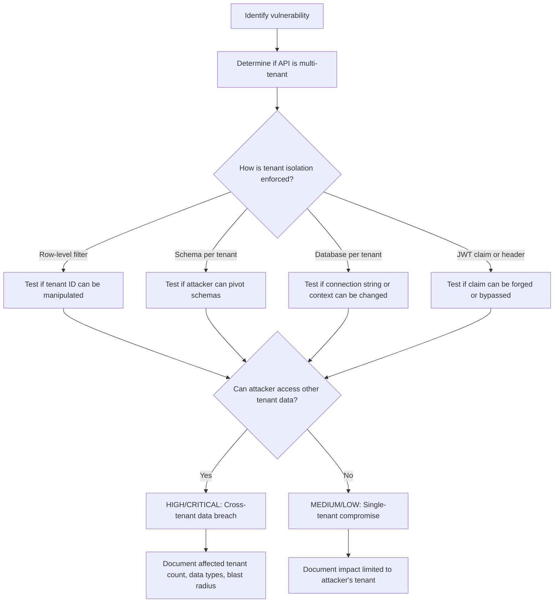
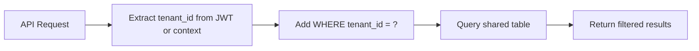
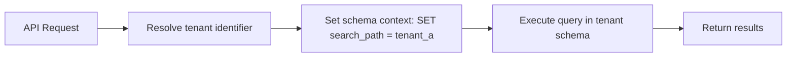
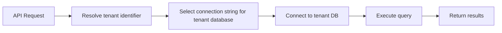

# Tenant Impact Analysis

> **Tenant impact analysis is the process of determining whether a security flaw in a multi-tenant API can be exploited to access, modify, or disrupt data or resources belonging to other tenants. In authorized security testing, this analysis validates tenant isolation controls, helps quantify blast radius, and informs risk severity without causing actual cross-tenant harm.**

---

## 🧠 What Is It? (Beginner Explanation)

Think of a multi-tenant API like an apartment building:

- **Each tenant** is a customer, organization, workspace, or account.
- **The building** is the shared infrastructure (database, API, storage, compute).
- **Tenant isolation** is what prevents you from opening your neighbor's door with your key.

A **tenant impact analysis** answers:

> "If an attacker exploits this vulnerability, can they reach data or actions belonging to *other* tenants?"

This matters because:

- A bug in **single-tenant mode** affects only the attacker's own account.
- A bug in **multi-tenant mode** affects *every customer using the platform*.

In security testing, you validate the isolation controls without crossing actual tenant boundaries in production.

---

## 🔍 Why This Analysis Matters

Multi-tenant API vulnerabilities have different risk profiles than single-tenant bugs.

### Real-world incident patterns

| Incident type | Tenant impact | Example |
|---|---|---|
| **BOLA in single-tenant API** | Attacker accesses own org's data, escalates privilege | User reads admin logs within their workspace |
| **BOLA in multi-tenant API** | Attacker accesses any customer's data | User changes `tenantId=123` to `tenantId=456` and reads competitor invoices |
| **SQL injection in isolated schema** | Compromise limited to one tenant's schema | Attacker dumps their own database but cannot pivot |
| **SQL injection in shared schema** | Compromise affects all tenants in table | Attacker dumps `customers` table containing all tenant records |
| **GraphQL field leak** | Metadata reveals existence of other tenants | Query exposes tenant names, IDs, or subscription tiers |
| **Function-level authorization flaw** | Admin function callable across tenant boundaries | User from Tenant A calls `DELETE /tenants/{id}` and removes Tenant B |

### Severity amplification

A vulnerability's CVSS or severity rating often increases when tenant isolation fails:

- **Confidentiality impact:** Grows from `C:L` (low) to `C:H` (high) if attacker can read *all* customer data
- **Integrity impact:** Grows if attacker can modify or delete records across tenants
- **Availability impact:** Grows if attacker can exhaust shared resources or lock accounts
- **Scope change:** CVSS 3.1 may trigger a scope change if the vulnerable component affects resources outside its privilege boundary

---

## 🧭 Core Mental Model

A tenant impact analysis follows this flow:



### Key questions for every finding

| Question | Why it matters |
|---|---|
| **Is this API multi-tenant?** | If not, skip cross-tenant analysis. |
| **How is the tenant context established?** | JWT claim, subdomain, header, query param, session? |
| **Where is the tenant filter applied?** | Application code, ORM, database view, row-level security? |
| **Can the tenant context be manipulated?** | Can attacker change `X-Tenant-ID`, forge JWT `tenant_claim`, modify subdomain? |
| **What happens if tenant context is missing?** | Does the API fail safe (deny) or fail open (allow)? |
| **Are administrative functions tenant-scoped?** | Can `DELETE /users/{id}` delete users across all tenants? |
| **Are background jobs tenant-aware?** | Can a queued task accidentally process data from the wrong tenant? |
| **Can one tenant exhaust shared resources?** | Rate limits, storage quotas, compute pools? |

---

## 🏗️ Multi-Tenant Architecture Patterns

Understanding how the API implements multi-tenancy helps you assess blast radius.

### 1. Shared Database, Shared Schema (Row-Level Filtering)

All tenants share the same tables. Tenant ID is a column.



**Security dependency:**

- Every query must include `WHERE tenant_id = <authenticated_tenant>`
- ORM or query builder must enforce this automatically

**Common weaknesses:**

- Developers forget to add tenant filter in raw SQL
- GraphQL resolvers bypass ORM and hit database directly
- Admin endpoints skip tenant scoping
- Background jobs use hard-coded or missing tenant context

**Testing approach:**

1. Identify how `tenant_id` is determined (JWT claim, header, session)
2. Test if you can manipulate that value
3. Test if queries without tenant filter still execute
4. Test aggregation, reporting, or export endpoints that may skip filters

**Blast radius if broken:**

- **High:** Attacker can read/modify *all* tenant records in the table
- Scope: Entire customer base

---

### 2. Shared Database, Separate Schemas

Each tenant gets their own schema within the same database.



**Security dependency:**

- The API must correctly map tenant identifier → schema name
- Schema switching must happen *before* any query
- No query should allow schema name injection

**Common weaknesses:**

- Attacker manipulates tenant identifier to switch schemas
- Schema name constructed from untrusted input (`SET search_path = ${userInput}`)
- Error messages leak schema names or tenant identifiers
- Migration or admin scripts access wrong schema

**Testing approach:**

1. Identify how schema is selected (subdomain, header, JWT claim)
2. Try to inject schema switching commands
3. Test if error messages reveal schema structure
4. Test if admin or background tasks use shared schema

**Blast radius if broken:**

- **High:** Attacker can access any tenant's schema
- Scope: Full tenant data exposure per pivot

---

### 3. Separate Databases

Each tenant gets a completely separate database instance.



**Security dependency:**

- Connection pooling must not leak connections across tenants
- Tenant-to-database mapping must be secure and tamper-proof
- No SQL injection in database selection logic

**Common weaknesses:**

- Connection string or database name derived from user input
- Connection pool accidentally reuses a connection for different tenant
- Backup or migration scripts access wrong database
- Attacker triggers DNS rebinding or SSRF to redirect connection

**Testing approach:**

1. Identify how database is selected
2. Test if database identifier can be manipulated
3. Test connection pooling behavior under concurrent requests
4. Test error handling when database is unavailable

**Blast radius if broken:**

- **Medium:** Attacker can access one other tenant's database per exploit
- Scope: Requires repeated exploitation to affect multiple tenants

---

### 4. Subdomain-Based Isolation

Each tenant is accessed via a unique subdomain.

```text
tenant-a.api.example.com
tenant-b.api.example.com
```

**Security dependency:**

- Subdomain must map securely to tenant context
- TLS certificates must be scoped correctly
- No CORS or cookie sharing across subdomains

**Common weaknesses:**

- Attacker registers a similar subdomain and intercepts traffic
- CORS misconfiguration allows `*.example.com` to access all tenants
- Shared session cookies allow cross-subdomain session fixation
- DNS rebinding or cache poisoning redirects subdomain

**Testing approach:**

1. Test if you can register arbitrary subdomains
2. Test CORS headers for wildcard or overly permissive origins
3. Test cookie scope (`Domain=.example.com` vs specific subdomain)
4. Test if API accepts `Host` header manipulation

**Blast radius if broken:**

- **Variable:** Depends on whether subdomain compromise grants access to other tenants
- Scope: Isolated to compromised subdomain unless pivoting is possible

---

## 🧪 Testing Methodology

This is a structured approach to tenant impact analysis during authorized security testing.

### Phase 1: Understand the tenant model

| Task | Method | Output |
|---|---|---|
| **Determine if API is multi-tenant** | Review documentation, observe subdomain patterns, inspect JWT claims | Yes/No |
| **Identify tenant identifier** | Analyze JWT `tenant_id`, subdomain, `X-Tenant-ID` header, query param | Claim name or header |
| **Map architecture pattern** | Infer from error messages, response timing, or ask development team | Shared schema / separate schema / separate DB |
| **Document admin vs user scopes** | List endpoints that should be tenant-scoped vs globally scoped | Endpoint inventory |

---

### Phase 2: Identify tenant context sources

Common places tenant context is derived:

```text
1. JWT claims
   - "tenant_id": "abc123"
   - "org_id": "enterprise-corp"
   - "workspace": "team-alpha"

2. HTTP headers
   - X-Tenant-ID: 12345
   - X-Organization: acme-corp

3. Subdomain
   - tenant-abc.api.example.com

4. Query parameter
   - GET /data?tenantId=xyz

5. Session or cookie
   - sessionStorage or backend session mapping

6. Path segment
   - /api/tenants/{tenantId}/resources
```

### Validation matrix

| Tenant source | Can attacker modify it? | Verification method | Risk if bypassed |
|---|---|---|---|
| JWT `tenant_id` claim | Only if signature is weak or not verified | Modify claim, re-sign with `none`, stolen key | **Critical** |
| HTTP header | Yes, trivially | Change `X-Tenant-ID: 123` to `456` | **Critical** |
| Subdomain | Harder, but DNS/CORS misconfig possible | Register malicious subdomain, test `Host` header | **High** |
| Query parameter | Yes, trivially | Change `?tenantId=A` to `?tenantId=B` | **Critical** |
| Session mapping | Depends on session integrity | Session fixation, session hijacking | **High** |
| Path segment | Yes, if not validated against authenticated context | Change `/tenants/A/` to `/tenants/B/` | **Critical** |

---

### Phase 3: Test tenant isolation boundaries

#### Test 1: Direct tenant ID manipulation

**Goal:** Determine if you can access another tenant's data by changing the tenant identifier.

**Setup (authorized test environment):**

1. Create two test tenant accounts: `tenant-test-a` and `tenant-test-b`
2. Populate each with unique identifiable data
3. Authenticate as `tenant-test-a`

**Test steps:**

```http
# Normal request as tenant-test-a
GET /api/v1/invoices
Authorization: Bearer <token-for-tenant-a>
X-Tenant-ID: tenant-test-a
```

Response:
```json
{
  "invoices": [
    {"id": "inv-a-001", "amount": 100, "tenant": "tenant-test-a"}
  ]
}
```

**Now modify tenant identifier:**

```http
GET /api/v1/invoices
Authorization: Bearer <token-for-tenant-a>
X-Tenant-ID: tenant-test-b
```

**Expected safe behavior:**

- `403 Forbidden` (tenant mismatch)
- `401 Unauthorized` (header rejected)
- `400 Bad Request` (invalid tenant context)

**Vulnerable behavior:**

- Returns `tenant-test-b` data
- Returns combined data from both tenants
- Returns error message revealing `tenant-test-b` structure

---

#### Test 2: JWT claim tampering

**Goal:** Test if tenant context in JWT can be modified.

**Setup:**

1. Obtain a valid JWT for `tenant-test-a`
2. Decode the payload

Example JWT payload:
```json
{
  "sub": "user-123",
  "tenant_id": "tenant-test-a",
  "role": "member",
  "exp": 1700000000
}
```

**Test steps:**

1. Change `"tenant_id": "tenant-test-a"` to `"tenant_id": "tenant-test-b"`
2. Re-encode and re-sign with:
   - `alg: none` (signature bypass)
   - Same signing key if you have access in test environment
   - A key from another tenant (key confusion attack)

**Expected safe behavior:**

- Token rejected due to invalid signature
- `403 Forbidden` even if signature is valid (server checks claim vs authenticated identity)

**Vulnerable behavior:**

- Token accepted with modified `tenant_id`
- API grants access to `tenant-test-b` resources

---

#### Test 3: Missing tenant context

**Goal:** Test what happens if tenant identifier is omitted.

**Test steps:**

```http
# Remove X-Tenant-ID header entirely
GET /api/v1/invoices
Authorization: Bearer <token-for-tenant-a>
```

**Expected safe behavior:**

- `400 Bad Request` (missing required header)
- `403 Forbidden` (no tenant context)
- Default to tenant from JWT, ignore header

**Vulnerable behavior:**

- Returns data from *all* tenants
- Returns data from a default/shared tenant
- Fails open and allows access without filtering

---

#### Test 4: Admin function tenant scoping

**Goal:** Verify that administrative endpoints respect tenant boundaries.

**Setup:**

1. Identify admin functions: `DELETE /users/{id}`, `PATCH /settings`, `GET /audit-logs`
2. Authenticate as admin in `tenant-test-a`

**Test steps:**

```http
# Attempt to delete a user in tenant-test-b
DELETE /api/v1/users/user-from-tenant-b
Authorization: Bearer <admin-token-for-tenant-a>
```

**Expected safe behavior:**

- `404 Not Found` (user not in your tenant)
- `403 Forbidden` (cross-tenant action denied)

**Vulnerable behavior:**

- User deleted across tenant boundary
- API returns success without validating tenant ownership

---

#### Test 5: Aggregation and reporting endpoints

**Goal:** Test if bulk queries or reports leak cross-tenant data.

**High-risk endpoints:**

- `/api/reports/all-invoices`
- `/api/analytics/revenue`
- `/api/export/users.csv`
- GraphQL queries with no tenant filter

**Test steps:**

```http
GET /api/reports/all-invoices
Authorization: Bearer <token-for-tenant-a>
```

**Expected safe behavior:**

- Returns only `tenant-test-a` invoices
- Tenant filter automatically applied

**Vulnerable behavior:**

- Returns invoices from all tenants
- CSV export contains cross-tenant data
- GraphQL resolver bypasses tenant scoping

---

### Phase 4: Assess blast radius

Once you've determined a flaw allows cross-tenant access, quantify the impact.

| Metric | How to measure | Example |
|---|---|---|
| **Affected tenant count** | Can attacker enumerate and access all tenants, or only specific ones? | All 10,000 tenants vs. only tenants with sequential IDs |
| **Data sensitivity** | What type of data is exposed? | PII, financial records, credentials, health data |
| **Action scope** | Can attacker read, modify, delete, or execute functions? | Read-only leak vs. full CRUD access |
| **Privilege escalation** | Can attacker gain admin access in other tenants? | User in Tenant A becomes admin in Tenant B |
| **Resource exhaustion** | Can attacker exhaust quotas or resources affecting other tenants? | Upload fills shared storage, starving other tenants |
| **Lateral movement potential** | Can attacker use this access to pivot further? | Steal API keys from Tenant B, use them for external access |

---

## 📊 Impact Classification Table

| Scenario | Isolation failure | Impact rating | Example |
|---|---|---|---|
| **Cross-tenant read access** | Attacker reads another tenant's data | **High / Critical** | User from Tenant A reads Tenant B invoices |
| **Cross-tenant write access** | Attacker modifies another tenant's data | **Critical** | User from Tenant A deletes Tenant B records |
| **Cross-tenant privilege escalation** | Attacker gains admin rights in another tenant | **Critical** | Member in Tenant A becomes admin in Tenant B |
| **Tenant enumeration** | Attacker discovers existence/names of other tenants | **Low / Medium** | API leaks tenant IDs or names in error messages |
| **Resource exhaustion** | Attacker consumes shared resources affecting others | **Medium / High** | Upload or query exhausts database connections |
| **Metadata leakage** | Attacker learns tenant count, size, or subscription tier | **Low** | GraphQL introspection reveals tenant schema |

---

## 🛡️ Recommended Controls

These controls help prevent cross-tenant impact.

### 1. Enforce tenant context at every layer

**Application layer:**
```python
# Always derive tenant from authenticated identity, not user input
def get_current_tenant(request):
    token = verify_jwt(request.headers['Authorization'])
    return token['tenant_id']  # NOT request.headers['X-Tenant-ID']
```

**ORM layer:**
```python
# Sequelize example with tenant-scoped queries
const invoices = await Invoice.findAll({
  where: {
    tenant_id: req.tenant.id,  # Enforced automatically
    id: req.params.invoiceId
  }
});
```

**Database layer (PostgreSQL Row-Level Security):**
```sql
-- Ensure users can only see their tenant's rows
CREATE POLICY tenant_isolation ON invoices
  USING (tenant_id = current_setting('app.current_tenant')::uuid);

ALTER TABLE invoices ENABLE ROW LEVEL SECURITY;
```

---

### 2. Validate tenant ownership for all resource access

**Before any read, write, or delete:**

```javascript
async function getInvoice(invoiceId, authenticatedTenant) {
  const invoice = await db.invoice.findByPk(invoiceId);
  
  if (!invoice) {
    throw new NotFoundError();
  }
  
  // Critical check: does this resource belong to the authenticated tenant?
  if (invoice.tenant_id !== authenticatedTenant.id) {
    throw new ForbiddenError('Resource does not belong to your tenant');
  }
  
  return invoice;
}
```

---

### 3. Use framework-level tenant scoping

**Rails example:**
```ruby
class ApplicationController < ActionController::API
  around_action :set_tenant

  def set_tenant
    Tenant.with_tenant(current_tenant) do
      yield
    end
  end

  def current_tenant
    @current_tenant ||= Tenant.find_by(id: jwt_payload['tenant_id'])
  end
end
```

---

### 4. Avoid deriving tenant context from user input

**Dangerous patterns:**

```python
# ❌ Never do this
tenant_id = request.headers.get('X-Tenant-ID')
tenant_id = request.args.get('tenantId')
tenant_id = request.json.get('tenant')
```

**Safe patterns:**

```python
# ✅ Derive from authenticated token
def get_tenant_from_jwt(request):
    token = verify_jwt_signature(request.headers['Authorization'])
    validate_claims(token)  # iss, aud, exp, nbf
    return token['tenant_id']
```

---

### 5. Audit and log tenant boundary crossings

**What to log:**

```json
{
  "event": "cross_tenant_attempt",
  "authenticated_tenant": "tenant-a",
  "requested_tenant": "tenant-b",
  "resource_type": "invoice",
  "resource_id": "inv-b-123",
  "action": "read",
  "outcome": "denied",
  "ip": "203.0.113.42",
  "timestamp": "2025-03-12T10:15:30Z"
}
```

**Why it matters:**

- Detects exploitation attempts early
- Helps identify logic errors in tenant scoping
- Supports incident investigation

---

### 6. Test tenant isolation in CI/CD

**Automated test example:**

```javascript
describe('Tenant isolation', () => {
  it('should prevent cross-tenant access', async () => {
    const tenantA = await createTestTenant('tenant-a');
    const tenantB = await createTestTenant('tenant-b');
    
    const invoiceB = await createInvoice(tenantB, { amount: 500 });
    const tokenA = await getAuthToken(tenantA);
    
    const response = await request(app)
      .get(`/api/invoices/${invoiceB.id}`)
      .set('Authorization', `Bearer ${tokenA}`);
    
    expect(response.status).toBe(403);  // Not 200
  });
});
```

---

## 🧾 Documentation Template

When reporting tenant impact in a security assessment, include:

### Vulnerability Summary

**Title:** Cross-Tenant Data Access via Manipulated Tenant ID  
**Severity:** Critical  
**CVSS 3.1:** 9.1 (AV:N/AC:L/PR:L/UI:N/S:C/C:H/I:H/A:N)  
**Affected Component:** `/api/v1/invoices` endpoint  

---

### Description

The `/api/v1/invoices` endpoint accepts a `X-Tenant-ID` header to determine which tenant's data to return. This header is not validated against the authenticated user's tenant claim in the JWT.

An attacker authenticated to Tenant A can modify the `X-Tenant-ID` header to any other tenant identifier and retrieve, modify, or delete that tenant's invoices.

---

### Proof of Concept (Authorized Test)

**Step 1:** Authenticate as `tenant-test-a`:
```http
POST /api/v1/auth/login
Content-Type: application/json

{"username": "user-a", "password": "test123"}
```

**Step 2:** Retrieve invoices for `tenant-test-a`:
```http
GET /api/v1/invoices
Authorization: Bearer <token-for-tenant-a>
X-Tenant-ID: tenant-test-a
```

Response (safe, own tenant):
```json
{"invoices": [{"id": "inv-a-001", "amount": 100}]}
```

**Step 3:** Modify `X-Tenant-ID` to `tenant-test-b`:
```http
GET /api/v1/invoices
Authorization: Bearer <token-for-tenant-a>
X-Tenant-ID: tenant-test-b
```

Response (vulnerable):
```json
{"invoices": [{"id": "inv-b-001", "amount": 500}]}
```

Result: Attacker gains unauthorized access to another tenant's data.

---

### Impact

| Impact type | Description |
|---|---|
| **Confidentiality** | Attacker can read invoices, customer data, PII, and financial records for *all* tenants |
| **Integrity** | Attacker can modify or delete records belonging to other tenants |
| **Availability** | Attacker can delete critical resources, disrupting service for other tenants |
| **Tenant count affected** | All tenants in the system (~10,000 organizations) |
| **Data types exposed** | Invoices, payments, customer PII, billing addresses |
| **Compliance risk** | GDPR, PCI-DSS, HIPAA violations due to unauthorized cross-tenant data access |

---

### Remediation

**Immediate:**
1. Remove `X-Tenant-ID` header from API entirely
2. Derive tenant context exclusively from the authenticated JWT `tenant_id` claim
3. Validate that the JWT signature is verified using approved algorithms and keys

**Short-term:**
4. Add server-side checks to ensure accessed resources belong to the authenticated tenant:
   ```javascript
   if (invoice.tenant_id !== req.user.tenant_id) {
     throw new ForbiddenError();
   }
   ```

**Long-term:**
5. Implement ORM-level or database-level tenant scoping (e.g., PostgreSQL RLS)
6. Add automated tests to verify tenant isolation for all endpoints
7. Conduct security code review of all endpoints that access tenant-scoped resources

---

### References

- OWASP API Security Top 10: API1:2023 Broken Object Level Authorization
- CWE-639: Authorization Bypass Through User-Controlled Key
- Multi-Tenancy Architecture Patterns: https://learn.microsoft.com/en-us/azure/architecture/guide/multitenant/considerations/tenancy-models

---

## 🔗 Related Topics

| Topic | Why it connects |
|---|---|
| **Broken Object Level Authorization** | Tenant isolation is a special case of object-level authorization |
| **JWT Security** | Tenant claims in JWTs must be validated and not derived from user input |
| **GraphQL Security** | Tenant filtering must apply to all resolvers and nested queries |
| **Database Security** | Row-level security and schema isolation enforce tenant boundaries |
| **Session Management** | Session-to-tenant mapping must be tamper-proof |
| **API Gateway Security** | Gateways should enforce tenant routing and not trust client-supplied IDs |
| **Rate Limiting** | Per-tenant rate limits prevent one tenant from exhausting shared resources |

---

## ✅ Key Takeaways

1. **Tenant isolation failure is critical** — it affects every customer, not just the attacker.
2. **Never trust client-supplied tenant identifiers** — derive tenant context from verified authentication tokens.
3. **Test all layers** — application logic, ORM queries, database policies, and background jobs.
4. **Admin functions need extra scrutiny** — they often bypass tenant filters unintentionally.
5. **Blast radius quantification matters** — document how many tenants are affected, what data is exposed, and what actions are possible.
6. **Defense in depth** — enforce tenant scoping at application, ORM, and database layers.
7. **Automate tenant isolation tests** — make them part of every CI/CD pipeline.

---

## 📚 Further Reading

### Official guidance

- **OWASP API Security Top 10 (2023):** API1 Broken Object Level Authorization  
  https://owasp.org/API-Security/editions/2023/en/0xa1-broken-object-level-authorization/

- **OWASP Multi-Tenancy Cheat Sheet**  
  https://cheatsheetseries.owasp.org/cheatsheets/Multitenant_Architecture_Cheat_Sheet.html

- **Microsoft Azure Multi-Tenancy Architecture**  
  https://learn.microsoft.com/en-us/azure/architecture/guide/multitenant/

- **AWS SaaS Tenant Isolation Strategies**  
  https://docs.aws.amazon.com/wellarchitected/latest/saas-lens/tenant-isolation.html

### Research and incidents

- **"Tenant Isolation Gone Wrong: A Survey of Multi-Tenant SaaS Vulnerabilities"** (2022)  
  Common patterns in cross-tenant data exposure incidents.

- **Salesforce unauthorized data access (2020)**  
  Metadata API allowed users to query objects across orgs in certain configurations.

- **Slack shared channel security model**  
  How Slack enforces workspace boundaries in shared channels.

- **Postgres Row-Level Security for Multi-Tenant Apps**  
  https://www.postgresql.org/docs/current/ddl-rowsecurity.html

### Tools for testing

- **Burp Suite** — Intercept and modify tenant headers, JWT claims  
- **Postman / Insomnia** — Build tenant-switching test collections  
- **SQLMap** — Test for SQL injection that bypasses tenant filters  
- **GraphQL Voyager** — Visualize schema and identify tenant-scoped types  
- **Tenant isolation test scripts** — Custom scripts to automate cross-tenant access tests

---

**Remember:** Tenant impact analysis is not about breaking production. It's about validating that isolation controls work correctly in authorized test environments, so you can confidently report the real-world risk if those controls fail.
