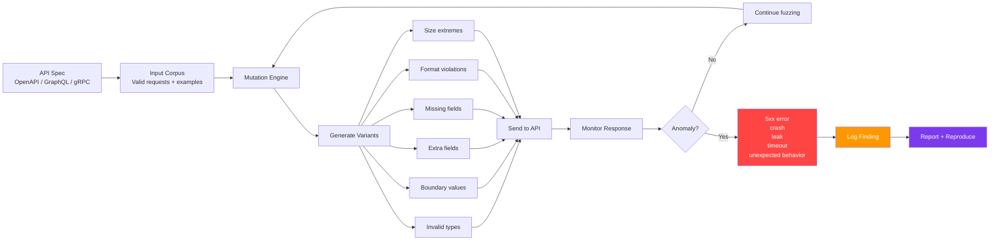
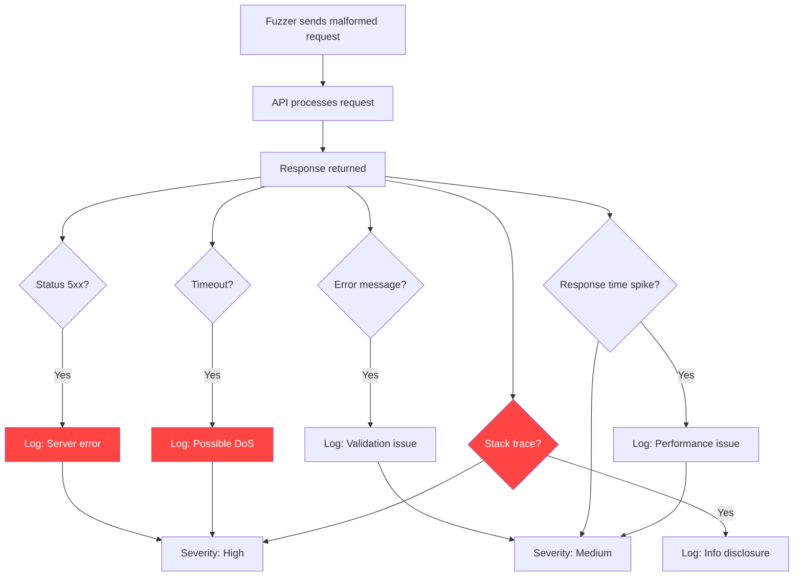
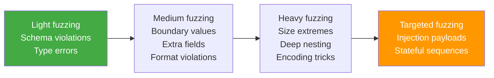

# API Fuzzing Concepts

> **API fuzzing is the automated discipline of sending malformed, unexpected, or extreme inputs to an API in order to uncover security flaws, crashes, exceptions, and logic errors that humans might miss. For authorized testers and defenders, it is a force multiplier that systematically challenges input handling, validation boundaries, error paths, and resource limits.**

> **Authorized use only:** all fuzzing activities described here must be conducted in approved lab environments, internal test systems, or production-like staging with explicit written authorization. Never fuzz APIs you do not own or do not have clear permission to test.

---

## 🧠 What Is API Fuzzing? (Beginner Explanation)

Think of a human tester as someone carefully trying valid and slightly broken inputs to see what happens:

- What if I send a negative quantity?
- What if I provide an extra field?
- What if I change the HTTP method?

That is **manual testing**. Fuzzing does the same thing, but:

- **Automatically** — the tool tries hundreds or thousands of variations
- **Systematically** — following mutation rules, grammars, or coverage targets
- **At scale** — across many endpoints, many parameters, many types of brokenness

The goal is to find what a human would miss: rare edge cases, unexpected parser behavior, unhandled exceptions, resource exhaustion paths, or subtle logic failures.

### Simple mental model

API fuzzing is like a relentless curiosity machine. It asks:

> **"What happens if I send this input in a way the developers never imagined?"**

If the API crashes, leaks secrets, bypasses auth, consumes too many resources, or violates business rules, the fuzzer surfaces that failure so defenders can fix it.

---

## 🎯 Why Fuzzing Matters for API Security

Manual testing is critical, but humans:

- Tire out after a few hundred test cases
- Forget to test all endpoints
- Miss rare combinations
- Do not efficiently explore complex input spaces
- Can overlook edge cases in nested JSON or recursive structures

Fuzzers shine at:

1. **Uncovering parser bugs** — malformed JSON, unexpected encodings, oversized arrays, deeply nested objects
2. **Testing boundary conditions** — extremely small, large, negative, or zero values
3. **Discovering unhandled error paths** — inputs that trigger code rarely executed in normal flow
4. **Spotting inconsistent validation** — accepting something at the schema level but rejecting it in business logic
5. **Finding resource exhaustion risks** — huge strings, massive arrays, pathological regex triggers
6. **Exploring undocumented behavior** — what happens if you mix allowed fields in unexpected ways

Modern API security frameworks such as **OWASP API Security Top 10 2023** do not call out fuzzing explicitly, but many of the vulnerabilities fuzzing helps find appear across:

- **API3: Broken Object Property Level Authorization** — fuzzing extra fields or mass assignment
- **API4: Unrestricted Resource Consumption** — fuzzing file sizes, pagination limits, array lengths
- **API8: Security Misconfiguration** — fuzzing HTTP methods, headers, or endpoints that should not be exposed
- **API9: Improper Inventory Management** — fuzzing old or undocumented endpoints
- **API10: Unsafe Consumption of APIs** — fuzzing what happens when an API consumes unexpected responses

The **National Institute of Standards and Technology (NIST)** recognizes fuzz testing as a critical technique for discovering vulnerabilities in software. Their guidance emphasizes the importance of fuzzing in security testing programs, especially for complex software with parsers, protocol handlers, and API endpoints.

---

## 🏗️ Core Mental Model: Fuzzing as Controlled Mutation



Fuzzing is not random chaos. Good fuzzers:

1. **Understand the structure** (types, schemas, formats)
2. **Mutate intelligently** (change one thing at a time or combine multiple changes)
3. **Monitor outcomes** (HTTP status, response time, error messages, backend logs)
4. **Adapt based on feedback** (coverage-guided fuzzers favor mutations that reach new code paths)

---

## 📊 Fuzzing Approaches: Dumb vs Smart

Not all fuzzers are created equal. The two extremes:

| Approach | How it works | Strengths | Weaknesses |
|---|---|---|---|
| **Dumb / Blackbox Fuzzing** | Generates random or semi-random variations with no knowledge of API structure | Fast to set up; no spec required; can find parser crashes | Low efficiency; lots of invalid requests; poor coverage of business logic |
| **Smart / Grammar-Based Fuzzing** | Uses OpenAPI spec, GraphQL schema, or protobuf definitions to generate structurally valid but semantically mutated inputs | High efficiency; better coverage; finds subtle logic bugs | Requires accurate spec; setup overhead |

### Spectrum of intelligence


Modern API fuzzers aim for the right side: they understand the schema, monitor coverage, and may even track state across requests (e.g., create → update → delete).

---

## 🔧 Key Fuzzing Strategies for APIs

### 1. Type Confusion

Try sending the wrong type for a field.

| Expected | Fuzzing input | What you might find |
|---|---|---|
| `integer` | `"string"`, `null`, `true`, `[]`, `{}` | Type coercion bugs, crashes, bypasses |
| `string` | `123`, `null`, very long strings, special chars | Parser bugs, overflow, injection sinks |
| `boolean` | `1`, `"true"`, `null` | Logic errors, unexpected defaults |
| `array` | `null`, empty array, single item, deeply nested array | Array handling bugs, DoS via size |
| `object` | `null`, empty object, extra fields, missing required fields | Mass assignment, property pollution |

### 2. Boundary and Edge Values

Push numeric and string limits.

| Field type | Boundary values to try | Potential findings |
|---|---|---|
| Integer | `0`, `-1`, `2147483647`, `-2147483648`, `9999999999` | Overflow, underflow, off-by-one |
| Decimal/Float | `0.0`, negative, very small, very large, `NaN`, `Infinity` | Precision bugs, DoS |
| String length | Empty, 1 char, max allowed, max + 1, 10,000+ chars | Buffer issues, truncation, DoS |
| Array length | 0 items, 1 item, max, max + 1, 100,000+ items | Memory issues, timeout, logic bypass |
| Date/Time | `null`, far past, far future, invalid formats, leap second | Validation bypass, business logic errors |

### 3. Format Violations

Break expected patterns.

- Email: `test@`, `@example.com`, `<script>@example.com`, excessively long local/domain part
- URL: `javascript:`, `file://`, extremely long, missing protocol, path traversal `../../`
- UUID: shorter, longer, invalid chars, wrong version
- Phone: letters, symbols, international formats, too short, too long
- JSON: trailing commas, unquoted keys, comments, control characters in strings
- XML: malformed tags, entity expansion bombs, XXE payloads, namespaces abuse

### 4. Size Extremes and Resource Exhaustion

Test how the API handles **large or complex inputs**.

- **Huge strings**: 1 MB, 10 MB, 100 MB strings in a single field
- **Deep nesting**: JSON objects nested 100, 1000, or 10,000 levels deep
- **Large arrays**: 10,000-element arrays in a single request
- **File uploads**: 0-byte files, multi-gigabyte files, zip bombs, polyglot files
- **Pagination abuse**: request 1 million records at once, page size of `-1`

What you might find:

- Crashes or timeouts
- Out-of-memory errors
- Uncontrolled recursion
- Lack of pagination enforcement
- Missing file size checks

### 5. Missing and Extra Fields

Challenge the schema validation.

| Scenario | What to try | Findings |
|---|---|---|
| **Required field missing** | Omit `user_id`, `price`, `action` | Missing validation, defaults, crash |
| **Extra unexpected fields** | Add `is_admin`, `role`, `internal_flag` | Mass assignment, property pollution |
| **Null for non-nullable** | Send `null` when spec says required | Null-pointer issues, logic bypass |
| **Read-only fields in writes** | Send `created_at`, `id`, `balance` in POST/PUT | Overwrite protection failures |

### 6. HTTP Method and Header Fuzzing

APIs often restrict methods per endpoint. Fuzzing can find misconfigurations.

- Try `GET`, `POST`, `PUT`, `PATCH`, `DELETE`, `HEAD`, `OPTIONS`, `TRACE` on every endpoint
- Fuzz `Content-Type`: `application/json`, `text/xml`, `application/x-www-form-urlencoded`, `multipart/form-data`, nonsense values
- Fuzz `Accept`: request unusual formats, see if error messages leak info
- Fuzz custom headers: send very long values, special characters, duplicate headers
- Fuzz `Authorization`: malformed tokens, empty tokens, tokens from other users

### 7. Injection Payload Fuzzing

If the API passes data to interpreters, fuzzing can uncover injection risks.

| Sink | Example fuzzing payloads |
|---|---|
| **SQL** | `' OR 1=1--`, `'; DROP TABLE--`, `UNION SELECT`, time-based delays |
| **NoSQL** | `{"$ne": null}`, `{"$gt": ""}`, operator injection in JSON |
| **Command** | `; ls`, `| whoami`, backticks, command separators |
| **LDAP** | `*)(uid=*))(` , logic alteration via special chars |
| **XPath** | `' or '1'='1`, node traversal |
| **Template** | `{{7*7}}`, `${7*7}`, engine-specific syntax |

**Important:** These payloads are for **authorized, defensive testing only**. The goal is to discover if input reaches interpreters unsafely so developers can fix it.

### 8. Encoding and Character Set Tricks

- Unicode normalization issues (e.g., `Å` vs `A` + combining ring)
- Homoglyphs (e.g., Cyrillic 'а' vs Latin 'a')
- URL encoding variations: `%2e`, `%252e`, mixed encoding
- Double encoding
- UTF-8 overlong sequences
- Null bytes `%00` in filenames or paths
- Special characters: newlines `\n`, carriage returns `\r`, tabs, CRLF injection

---

## 🔍 What to Monitor While Fuzzing

Fuzzing without observability is like shooting in the dark. Monitor:

| Signal | What to look for | Meaning |
|---|---|---|
| **HTTP status codes** | Unexpected 500s, 502s, 503s, 504s | Server crashes, uncaught exceptions, backend failures |
| **Response time** | Sudden spikes, timeouts | Resource exhaustion, expensive queries, infinite loops |
| **Response size** | Unexpectedly large or small responses | Data leakage, debug info exposure |
| **Error messages** | Stack traces, SQL errors, file paths, internal IPs | Information disclosure |
| **Backend logs** | Application crashes, exceptions, warning patterns | Deeper insight into what broke |
| **Resource usage** | CPU, memory, disk I/O spikes | Denial-of-service risks |
| **Anomalous behavior** | Same input gives different results | Race conditions, state corruption |



---

## 🛠️ Fuzzing Workflow for Authorized API Assessments

### Step 1: Inventory and Spec Extraction

Before you fuzz, know what exists.

1. **Collect API specifications**: OpenAPI/Swagger, GraphQL introspection, gRPC reflection, WSDL
2. **Capture real traffic**: Use a proxy (Burp, ZAP, Caido) to capture legitimate requests
3. **Identify all endpoints**: paths, methods, parameters, headers, authentication requirements
4. **Enumerate versions**: look for `/v1/`, `/v2/`, `/api/`, legacy endpoints

### Step 2: Baseline Testing

Establish normal behavior before fuzzing.

- Send valid requests and record responses
- Note expected status codes, response times, content types
- Identify which endpoints require authentication
- Document rate limits or throttling behavior

### Step 3: Choose Your Fuzzing Strategy

| Scenario | Recommended approach |
|---|---|
| You have an OpenAPI spec | Use schema-aware fuzzing (Schemathesis, Tcases, Restler) |
| You have GraphQL schema | Use GraphQL-specific fuzzing (Batch GraphQL, InQL, Graphinder) |
| No spec, only traffic | Use format-aware fuzzing (ffuf, Radamsa-based workflows) |
| Coverage-guided testing available | Use Restler or custom instrumentation |
| Looking for injection bugs | Use payload-focused fuzzing (sqlmap, NoSQLMap, custom lists) |

### Step 4: Configure and Execute Fuzzing

Start conservatively, then increase aggression.



**Important fuzzing hygiene:**

- **Respect scope**: only fuzz systems you are authorized to test
- **Start with read-only endpoints**: reduce risk of corrupting production data
- **Use test accounts and data**: never fuzz with real user accounts or live transactions
- **Rate-limit yourself**: avoid overwhelming the server or triggering DDoS protections
- **Monitor during fuzzing**: watch for service degradation and stop if needed
- **Restore state**: clean up test data, revert changes

### Step 5: Analyze and Triage Findings

Not every anomaly is exploitable. Prioritize by impact.

| Finding | Severity | Example |
|---|---|---|
| **Crash / 500 error** | High to Critical | Repeatable crash on malformed input, stack trace exposure |
| **Timeout / DoS** | High | Single request causes 30+ second delay or resource exhaustion |
| **Info disclosure** | Medium to High | Error reveals database structure, file paths, internal IPs |
| **Validation bypass** | Medium to High | Extra fields accepted that should be rejected (mass assignment) |
| **Type coercion issue** | Low to Medium | String accepted where integer expected, but no exploit path |
| **Expected 4xx errors** | Informational | API correctly rejects invalid input with 400/422 |

### Step 6: Reproduce and Report

For each real finding:

1. **Minimize the test case**: reduce to the simplest input that triggers the issue
2. **Document the request and response**: exact payload, headers, curl command
3. **Explain the impact**: what could an attacker do with this?
4. **Provide remediation guidance**: type checking, input validation, error handling, resource limits
5. **Verify the fix**: re-test after developers patch

---

## 🧪 Fuzzing Different API Types

### REST APIs

- **Spec-driven**: Use OpenAPI definitions for intelligent fuzzing
- **Focus on**: path parameters, query strings, JSON bodies, HTTP methods
- **Tools**: Schemathesis, Tcases, ffuf, Burp Intruder with custom payloads

### GraphQL APIs

- **Introspection-driven**: Extract schema via introspection query
- **Focus on**: query depth, field aliasing, batch queries, argument fuzzing
- **Challenges**: nested queries, resolver logic, authorization per field
- **Tools**: Batch GraphQL scripts, InQL, graphw00f, custom mutations

### gRPC APIs

- **Protobuf-driven**: Use reflection or `.proto` files
- **Focus on**: message field types, repeated fields, enums, oneof
- **Tools**: grpcurl, grpc-fuzzer, custom proto mutations

### SOAP APIs

- **WSDL-driven**: Parse WSDL for operations and types
- **Focus on**: XML structure, namespaces, XXE risks, oversized elements
- **Tools**: SoapUI, wsfuzzer, custom XML mutation scripts

### WebSocket APIs

- **Message-driven**: Capture and replay message patterns
- **Focus on**: message framing, JSON payloads, connection state
- **Tools**: ws-harness, custom scripts with websocket libraries

---

## 🧩 Common Findings from API Fuzzing

Based on research from **OWASP**, **PortSwigger**, **NIST**, and real-world bug bounty disclosures, here are the most common issues fuzzers uncover:

| Finding | Description | Typical root cause |
|---|---|---|
| **Uncaught exceptions** | 500 errors from malformed input | Missing try/catch, weak validation |
| **Stack trace leakage** | Error messages expose code paths, file names, library versions | Debug mode left on, verbose error handling |
| **Type coercion bugs** | String accepted as integer, logic behaves unexpectedly | Weak typing, implicit conversion |
| **Mass assignment** | Extra fields in request modify unintended properties | No allowlist of writable fields |
| **Null pointer dereferences** | Crash when required field is null or missing | Missing null checks |
| **Integer overflow/underflow** | Large numbers cause wrap-around or crash | No range validation |
| **Buffer overruns** | Extremely long strings crash or hang the API | No length limits |
| **Resource exhaustion** | Huge arrays or deep nesting consume excessive memory/CPU | No size or depth limits |
| **Regex DoS (ReDoS)** | Pathological input causes regex engine to hang | Inefficient regex patterns |
| **Injection sinks exposed** | SQL/NoSQL/command/template errors from fuzzing | Unsanitized input reaches interpreters |
| **Authorization bypass via extra fields** | Sending `role=admin` or `is_internal=true` changes permissions | Server trusts client-provided authz hints |
| **Inconsistent validation** | Accepted in one layer, rejected in another | Schema validation and business logic mismatch |

---

## 🚀 Practical Fuzzing Patterns

### Pattern 1: Schema-Based Type Fuzzing

Use the OpenAPI spec to generate mutations for every field.

**Example schema:**

```json
{
  "type": "object",
  "properties": {
    "user_id": {"type": "integer", "minimum": 1},
    "amount": {"type": "number", "minimum": 0.01},
    "currency": {"type": "string", "enum": ["USD", "EUR"]}
  },
  "required": ["user_id", "amount"]
}
```

**Fuzzing mutations:**

| Field | Mutation | Expected behavior | Finding if different |
|---|---|---|---|
| `user_id` | `"not_a_number"` | 400 or 422 | Accepted or 500 = bug |
| `user_id` | `0` | 400 (below minimum) | Accepted = validation bypass |
| `user_id` | `-1` | 400 | Accepted = logic error |
| `amount` | `null` | 400 (required) | Accepted or 500 = bug |
| `amount` | `"string"` | 400 | Accepted or 500 = bug |
| `amount` | `999999999999` | Accept or business rule reject | Overflow or financial bug |
| `currency` | `"BTC"` | 400 (not in enum) | Accepted = enum bypass |
| `currency` | `123` | 400 | Accepted = type coercion bug |
| Add extra field | `"admin": true` | Ignored or 400 | Used in logic = mass assignment |

### Pattern 2: Boundary Value Fuzzing

For every numeric or string field, test limits.

```python
# Integer boundaries
test_values = [0, 1, -1, 127, 128, 255, 256, 32767, 32768, 
               2147483647, 2147483648, -2147483648, -2147483649,
               9999999999999999999]

# String boundaries
test_strings = ["", "a", "A"*255, "A"*256, "A"*1000, "A"*10000, "A"*1000000]

# Array boundaries
test_arrays = [[], [1], [1]*100, [1]*1000, [1]*10000]
```

### Pattern 3: Nested Object Fuzzing

Test how deep the API can go.

```json
// Depth 1
{"data": {"value": 1}}

// Depth 10
{"data": {"data": {"data": {"data": {"data": {"data": {"data": {"data": {"data": {"data": {"value": 1}}}}}}}}}}}

// Depth 1000
// (recursively nested objects)
```

If the API crashes or times out, you found an unhandled recursion issue.

### Pattern 4: Stateful Fuzzing

Many APIs require sequences. Fuzzing can test what happens when you break the sequence.

**Normal workflow:**

1. `POST /cart` → create cart
2. `POST /cart/{id}/items` → add item
3. `POST /cart/{id}/checkout` → finalize

**Fuzzed sequences:**

- Skip step 1, go directly to step 2
- Call checkout on an empty cart
- Call checkout twice on the same cart
- Use another user's cart ID in step 2
- Delete the cart mid-checkout

What you might find: race conditions, state corruption, authorization bypass, double-spend bugs.

---

## 🔐 Defensive Fuzzing vs Offensive Fuzzing

| Purpose | Who does it | When | What they look for |
|---|---|---|---|
| **Defensive fuzzing** | Developers, QA, internal security teams | During development, CI/CD, pre-release | Crashes, exceptions, resource issues, regressions |
| **Offensive fuzzing** | Authorized penetration testers, bug bounty hunters | During assessments, after release | Exploitable bugs, auth bypasses, injection, data leaks |

Both use the same techniques, but the mindset differs:

- **Defenders** want to find and fix bugs early, ideally before release
- **Authorized testers** simulate attackers to find what defenders missed

**Best practice:** Defenders should fuzz continuously. Offensive fuzzers validate that the defensive work is effective.

---

## 📈 Measuring Fuzzing Effectiveness

How do you know if your fuzzing is working?

| Metric | What it tells you |
|---|---|
| **Code coverage** | Percentage of code paths exercised by fuzzing |
| **Unique crashes** | Number of distinct failure modes discovered |
| **Time to first crash** | How quickly the fuzzer finds issues |
| **Request throughput** | Requests per second the fuzzer can sustain |
| **False positive rate** | How many findings are noise vs real bugs |

**Coverage-guided fuzzing** is the gold standard: fuzzers track which code paths are hit and prioritize mutations that reach new paths. This dramatically increases bug-finding efficiency.

---

## ⚙️ Tooling Landscape

### Schema-Aware Fuzzers

| Tool | Best for | Key features |
|---|---|---|
| **Schemathesis** | OpenAPI and GraphQL fuzzing | Python-based, pytest integration, hypothesis-driven, stateful testing |
| **Restler** | REST API fuzzing with coverage | Microsoft Research tool, grammar-based, intelligent ordering |
| **Tcases** | OpenAPI test case generation | Java-based, combinatorial input modeling |
| **Dredd** | API spec validation | Compares spec to actual API behavior |

### Payload-Focused Fuzzers

| Tool | Best for | Key features |
|---|---|---|
| **ffuf** | Fast web fuzzing | Go-based, high performance, flexible wordlists |
| **wfuzz** | Python web fuzzing | Multi-position fuzzing, plugins, authentication support |
| **Radamsa** | Mutation-based fuzzing | General-purpose mutator, language-agnostic |
| **Burp Intruder** | Manual and automated fuzzing | GUI-based, extensive payload processing, good for targeted attacks |

### Coverage-Guided Fuzzers

| Tool | Best for | Key features |
|---|---|---|
| **libFuzzer** | C/C++ code fuzzing | LLVM-based, integrates with code, extremely fast |
| **AFL / AFL++** | Binary and source fuzzing | Industry standard, high bug-finding rate |
| **Jazzer** | Java/JVM fuzzing | Coverage-guided JVM fuzzing, integrates with JUnit |

### GraphQL-Specific

| Tool | Best for | Key features |
|---|---|---|
| **BatchQL** | Batch query fuzzing | Finds alias-based DoS and resource abuse |
| **InQL** | Introspection and fuzzing | Burp extension, GraphQL schema analysis |
| **graphw00f** | GraphQL fingerprinting and fuzzing | Detects engines, tests security headers |

### Injection-Focused

| Tool | Best for | Key features |
|---|---|---|
| **sqlmap** | SQL injection detection | Automated, supports many databases, tamper scripts |
| **NoSQLMap** | NoSQL injection | MongoDB, CouchDB, Cassandra support |
| **Commix** | Command injection | OS command injection testing |

---

## 🎓 Fuzzing Maturity Levels

Organizations can assess their fuzzing maturity:

| Level | Characteristics | Next step |
|---|---|---|
| **Level 0: None** | No automated fuzzing; only manual testing | Introduce basic fuzzing in pre-prod |
| **Level 1: Ad-hoc** | Developers or security run fuzzers occasionally | Integrate into CI/CD |
| **Level 2: Continuous** | Fuzzing runs on every build or daily | Add coverage tracking |
| **Level 3: Coverage-driven** | Fuzzers monitor code coverage and optimize | Expand to stateful and multi-API fuzzing |
| **Level 4: Intelligent** | Stateful, multi-step, feedback-driven fuzzing at scale | Correlate findings with threat models, automate triage |

**Goal:** Reach Level 3 or 4 for APIs that handle sensitive data, payments, or authentication.

---

## 🛡️ How Developers Should Respond to Fuzzing Findings

When fuzzing uncovers issues, developers should:

1. **Reproduce the finding**: confirm the input and response
2. **Classify severity**: crash? info leak? logic bypass? input rejection working?
3. **Fix the root cause**, not the symptom:
   - Add missing validation (type, range, length, format)
   - Implement proper error handling (catch exceptions, return safe errors)
   - Enforce resource limits (max array size, max string length, recursion depth)
   - Use parameterized queries or safe APIs to prevent injection
   - Implement allowlists for writable fields to prevent mass assignment
4. **Add a regression test**: ensure the bug does not return
5. **Review similar code**: if one endpoint has the bug, others might too
6. **Update the spec**: if behavior was unclear, clarify expected validation

---

## 🧠 Advanced Fuzzing Concepts

### Stateful Fuzzing

Most fuzzers treat each request independently. Stateful fuzzers track workflows:

- Create a resource, then try to access it with different privileges
- Perform action A, then see if action B behaves differently
- Test sequences: login → add to cart → checkout → refund

**Tools that support stateful fuzzing:** Schemathesis (with custom test scenarios), Restler (infers dependencies), custom scripts.

### Differential Fuzzing

Send the same input to two implementations (e.g., old vs new version, or two different APIs that should behave the same) and look for differences.

**Use cases:**

- Compare REST API v1 vs v2
- Compare staging vs production
- Compare open-source library vs custom implementation

**Findings:** logic drift, version-specific bugs, migration issues.

### Corpus-Based Fuzzing

Start with a set of valid requests (corpus) and mutate them. Over time, keep mutations that reach new code paths.

**Coverage-guided fuzzers** like AFL and libFuzzer excel at this.

### Concolic (Symbolic + Concrete) Fuzzing

Combines symbolic execution (analyzing code paths mathematically) with concrete fuzzing (running actual inputs). Can automatically discover inputs that reach specific code branches.

**Advanced topic**, mostly used in low-level and high-assurance systems, but emerging in API security research.

---

## 📚 Fuzzing Resources and Further Learning

### Standards and Frameworks

- **OWASP API Security Top 10 (2023)**: Context for what fuzzers help find
- **NIST SP 800-53**: Security controls, including fuzz testing as verification
- **ISO/IEC 29119**: Software testing standards, includes fuzz testing guidance

### Research and Whitepapers

- **"The Art, Science, and Engineering of Fuzzing: A Survey"** (IEEE 2019): Comprehensive academic overview
- **Microsoft Security Development Lifecycle**: Includes fuzz testing as a required activity
- **Google OSS-Fuzz**: Continuous fuzzing service for open-source projects

### Community Resources

- **OWASP Testing Guide**: API testing chapters cover fuzzing techniques
- **PortSwigger Web Security Academy**: Includes API fuzzing labs
- **HackerOne / Bugcrowd disclosed reports**: Real-world fuzzing findings

### Practical Guides

- **Schemathesis documentation**: Step-by-step API fuzzing with OpenAPI
- **Restler GitHub**: Examples of grammar-based REST fuzzing
- **AFL++ documentation**: Coverage-guided fuzzing principles
- **FFUF usage guides**: Community-written fuzzing cookbooks

---

## ✅ Fuzzing Checklist for Authorized API Assessments

Before you start:

- [ ] Confirm scope and authorization in writing
- [ ] Use test accounts and non-production data
- [ ] Identify all endpoints and methods
- [ ] Obtain or extract API specifications
- [ ] Set up monitoring (logs, metrics, alerts)

During fuzzing:

- [ ] Start with schema validation fuzzing
- [ ] Test type confusion and boundary values
- [ ] Fuzz for extra and missing fields
- [ ] Test size extremes and resource limits
- [ ] Try HTTP method and header variations
- [ ] Include injection payload fuzzing (authorized context only)
- [ ] Monitor for crashes, timeouts, errors, anomalies
- [ ] Rate-limit yourself to avoid service disruption

After fuzzing:

- [ ] Triage findings by severity and exploitability
- [ ] Reproduce each real issue with minimal test case
- [ ] Document: request, response, impact, remediation
- [ ] Clean up test data and restore state
- [ ] Report findings with clear context and evidence
- [ ] Verify fixes with regression tests

---

## 🔑 Key Takeaways

1. **Fuzzing is systematic exploration** — it finds edge cases humans miss by testing at scale and with methodical variation.

2. **Not all fuzzing is equal** — smart, schema-aware fuzzing is far more efficient than random fuzzing.

3. **Observe, don't just send** — fuzzing without monitoring is pointless. Watch for crashes, errors, timeouts, and anomalies.

4. **Fuzzing complements manual testing** — it is a force multiplier, not a replacement for human insight and threat modeling.

5. **Defensive fuzzing is underused** — developers should fuzz continuously, not just during security assessments.

6. **Findings need triage** — not every anomaly is exploitable. Focus on crashes, resource exhaustion, info leaks, and logic bypasses.

7. **Authorization is mandatory** — never fuzz systems you do not own or have explicit permission to test.

---

## 🏁 Summary

API fuzzing is a critical tool in the modern security toolkit. It automates the discovery of input-handling bugs, validation failures, resource exhaustion risks, and injection vulnerabilities that would take humans weeks to find manually.

For **defenders**, fuzzing should be integrated into development and CI/CD to catch bugs before release.

For **authorized penetration testers**, fuzzing amplifies manual testing and uncovers issues in code paths that rarely execute under normal use.

The key to effective fuzzing:

- Understand your target (specs, traffic, structure)
- Choose the right fuzzing strategy (schema-aware, coverage-guided, stateful)
- Monitor carefully (status codes, errors, logs, performance)
- Triage intelligently (severity, exploitability, root cause)
- Report clearly (reproducible test cases, impact, remediation)

**Fuzzing is not chaos — it is controlled, intelligent, systematic exploration of the unexpected.**

---

**Next steps:**

- Explore **[Tool-Specific Fuzzing Guides]** for practical command examples
- Review **[API Security Testing Methodology]** to integrate fuzzing into broader assessments
- Study **[Coverage-Guided Fuzzing]** for advanced techniques

**Remember:** Fuzzing finds the bugs developers did not think to test for. Use it responsibly, report findings constructively, and help make APIs more resilient.
