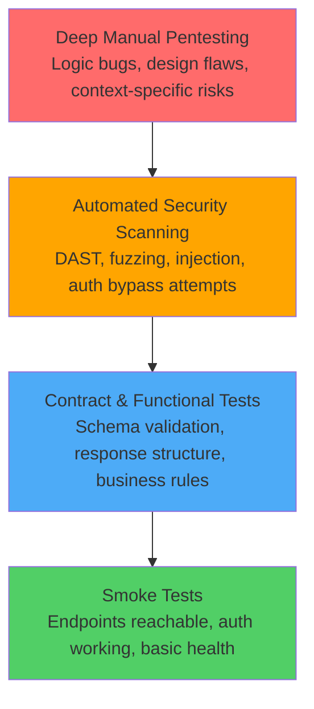
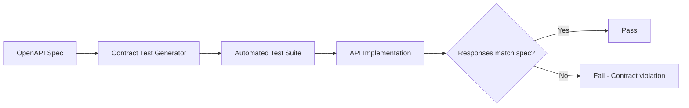
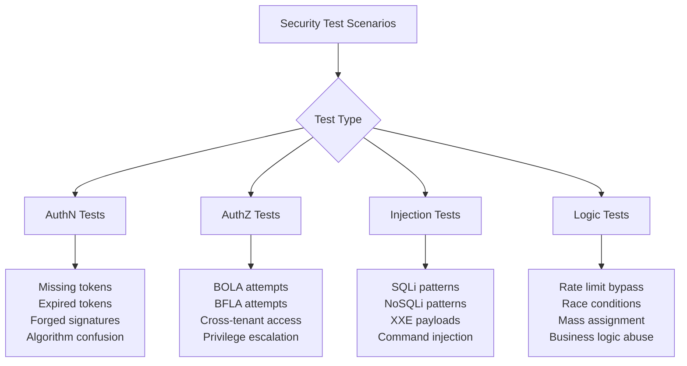
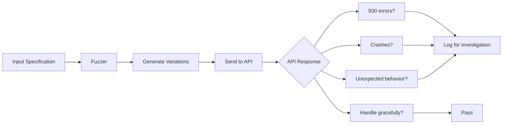
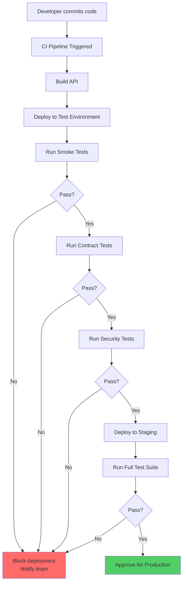
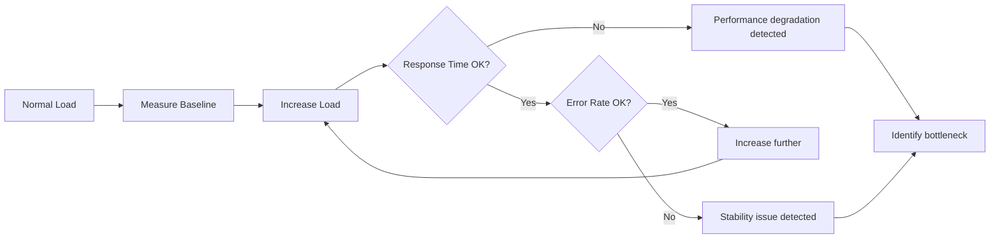
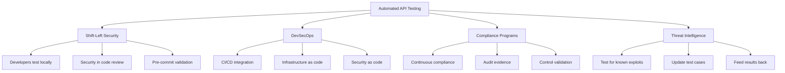

# Automated API Testing

> **Automated API testing integrates continuous security validation into development and deployment pipelines, enabling rapid discovery of regressions, misconfigurations, and common vulnerabilities without manual repetition. In authorized testing contexts, automation accelerates coverage, improves consistency, and helps defenders prove that security controls work across every deployment.**

> **Authorized testing only:** Automated API testing must respect agreed scope, avoid destructive actions, honor rate limits, and integrate safely into CI/CD without disrupting production or violating compliance policies. The goal is to help development teams ship secure APIs faster, not to exploit them at scale.

---

## 🧠 What Is It? (Beginner Explanation)

**Automated API testing** means using tools, scripts, and frameworks to programmatically exercise an API's security controls, functional behavior, and contract compliance **without manual intervention each time**.

Think of it like this:

- **Manual testing** is like inspecting every door lock in a building by hand every single day.
- **Automated testing** is like installing sensors that continuously verify every lock is working correctly and alert you when one breaks.

In API security work, automation helps with:

- **regression prevention** — ensuring fixes don't break
- **configuration drift detection** — catching when environments diverge
- **contract validation** — verifying APIs match their documented behavior
- **security posture monitoring** — confirming authentication, authorization, and input validation remain strong
- **scalability** — testing hundreds of endpoints consistently
- **integration with DevSecOps** — embedding security checks in CI/CD pipelines

A useful mental model is:

> **Automated testing doesn't replace deep manual review. It accelerates the parts that can be codified so manual effort focuses on logic, design, and context-specific risks.**

### Simple analogy

If API security testing is like a health checkup:

- **manual testing** is a specialist examining you thoroughly once
- **automated testing** is continuous heart rate, blood pressure, and glucose monitoring
- **both together** catch different problems at different speeds

---

## 🎯 Why Automation Matters for API Security

APIs change rapidly. Without automation, security validation falls behind.

| Challenge | Manual approach | Automated approach |
|---|---|---|
| Testing 200 endpoints across 3 environments | Days of repetitive work | Minutes of execution |
| Verifying JWT validation after library update | Re-run all token tests by hand | Run suite automatically on merge |
| Checking authorization on every GraphQL resolver | Error-prone manual enumeration | Schema-driven script execution |
| Detecting broken auth in staging vs production | Hope you catch it during manual review | CI pipeline fails before deploy |
| Proving controls work 6 months later | No evidence unless retested | Historical test results available |
| Onboarding new testers | Slow knowledge transfer | Documented test cases and scripts |

### Key automation benefits

| Benefit | Impact |
|---|---|
| **Consistency** | Same tests run the same way every time |
| **Speed** | Hundreds of validations in seconds |
| **Repeatability** | Can retest any time, any environment |
| **Documentation** | Test scripts serve as executable security requirements |
| **CI/CD integration** | Blocks insecure code before deployment |
| **Evidence generation** | Creates audit trails for compliance |
| **Regression detection** | Catches when fixes break or configuration drifts |

---

## 🏗️ Automation Pyramid for API Security

API test automation works best when structured as a pyramid, not a single layer.



### Layer breakdown

| Layer | What it tests | When to run | Tools | Example |
|---|---|---|---|---|
| **Smoke tests** | Basic connectivity, authentication, health | Every commit, every deploy | curl, Newman, Postman, pytest | `GET /health` returns 200 |
| **Contract tests** | API matches OpenAPI spec, GraphQL schema correct, types valid | On PR merge, nightly | Dredd, Pact, Schemathesis, Spectral | Response structure matches documented schema |
| **Functional tests** | Business logic, workflows, state transitions | On PR merge, pre-release | Postman, REST Assured, pytest, Jest | Creating order with invalid product fails correctly |
| **Security tests** | AuthN/AuthZ, injection, BOLA, BFLA, rate limiting | Nightly, weekly, pre-release | OWASP ZAP, Nuclei, custom scripts, Burp Suite API | JWT signature validation enforced |
| **Deep manual testing** | Complex logic bugs, privilege escalation chains, race conditions | Major releases, quarterly reviews | Burp Suite Pro, manual reasoning | Multi-step BOLA via leaked reference in async webhook |

---

## 🔬 Core Automation Approaches

### 1. Contract-Based Testing

**Contract testing** verifies that API implementations match their documented contracts (OpenAPI, GraphQL schema, Protobuf definitions).



#### What contract testing catches

| Issue type | Example |
|---|---|
| Missing required fields | Spec says `userId` required, API returns null |
| Wrong data types | Spec says integer, API returns string |
| Undocumented endpoints | API exposes `/admin/debug` not in spec |
| Missing security schemes | Spec requires bearer auth, endpoint allows unauthenticated access |
| Incorrect status codes | Spec says 404, API returns 500 |
| Schema drift | Production API diverges from development spec |

#### Contract testing tools

| Tool | Best for | Language | Integration |
|---|---|---|---|
| **Dredd** | OpenAPI/Swagger validation | Node.js | CLI, CI/CD |
| **Schemathesis** | Property-based testing against OpenAPI | Python | pytest integration |
| **Spectral** | Linting OpenAPI specs | Node.js | Pre-commit hooks |
| **Pact** | Consumer-driven contract testing | Multi-language | Microservices |
| **Postman** | Collection-based contract validation | JavaScript | Newman CLI |

#### Example: Schemathesis

```python
import schemathesis

schema = schemathesis.from_uri("https://api.example.com/openapi.json")

@schema.parametrize()
def test_api_contract(case):
    # Schemathesis generates test cases from OpenAPI spec
    response = case.call()
    case.validate_response(response)
```

This single test can generate hundreds of validation cases automatically.

---

### 2. Security-Focused Automation

Security automation goes beyond "does it work?" to ask "can it be abused?"



#### Security test categories

| Category | What to test | Automation level | Tools |
|---|---|---|---|
| **Authentication bypass** | Missing tokens, malformed tokens, algorithm none | High | Custom scripts, ZAP, Nuclei |
| **Authorization flaws** | BOLA, BFLA, cross-tenant access | High | Custom scripts, Authz test frameworks |
| **Injection** | SQLi, NoSQLi, XXE, command injection, LDAP | High | SQLMap, NoSQLMap, ZAP, Nuclei |
| **Input validation** | Type confusion, boundary conditions, special chars | High | Fuzzing tools, Schemathesis |
| **Rate limiting** | Excessive requests, distributed attacks | Medium | Custom scripts, load testing tools |
| **Business logic** | Order of operations, state manipulation, negative amounts | Low | Custom test cases |
| **Cryptography** | Weak algorithms, short keys, improper randomness | Medium | SSLyze, testssl.sh, custom validation |

#### Example: Automated BOLA testing

```python
import requests

def test_bola_cross_tenant():
    """Test if user A can access user B's resources"""
    
    # Setup: Two test accounts in different tenants
    token_user_a = login("userA@tenant1.com", "password")
    token_user_b = login("userB@tenant2.com", "password")
    
    # User B creates a resource
    response = requests.post(
        "https://api.example.com/v1/invoices",
        headers={"Authorization": f"Bearer {token_user_b}"},
        json={"amount": 100, "description": "Test invoice"}
    )
    invoice_id = response.json()["id"]
    
    # User A attempts to access User B's invoice (should fail)
    response = requests.get(
        f"https://api.example.com/v1/invoices/{invoice_id}",
        headers={"Authorization": f"Bearer {token_user_a}"}
    )
    
    # Assert proper authorization check
    assert response.status_code in [403, 404], \
        f"BOLA vulnerability: User A accessed User B's invoice. Status: {response.status_code}"
```

---

### 3. Fuzzing and Property-Based Testing

**Fuzzing** sends unexpected, malformed, or random inputs to discover how APIs handle edge cases.



#### What fuzzing catches

| Issue | Example |
|---|---|
| Unhandled exceptions | 500 errors on null input |
| Type confusion | Sending string where integer expected crashes service |
| Buffer overflows | Extremely long strings cause crashes |
| SQL injection | Unescaped quotes break queries |
| DoS conditions | Large payloads consume all memory |
| Information disclosure | Stack traces in error responses |

#### Fuzzing tools for APIs

| Tool | Approach | Best for |
|---|---|---|
| **ffuf** | Fast fuzzing via wordlists | Endpoint discovery, parameter fuzzing |
| **Radamsa** | Mutation-based fuzzing | Binary protocols, gRPC |
| **Atheris** | Coverage-guided fuzzing | Python APIs |
| **RESTler** | Stateful REST API fuzzing | Complex workflows |
| **Schemathesis** | OpenAPI-driven fuzzing | Contract + security validation |
| **Burp Suite Intruder** | Position-based fuzzing | Manual-guided fuzzing |

#### Example: Schemathesis fuzzing

```python
import schemathesis

schema = schemathesis.from_uri("https://api.example.com/openapi.json")

@schema.parametrize()
@settings(max_examples=100)  # Run 100 fuzz iterations per endpoint
def test_no_server_errors(case):
    response = case.call()
    # API should never return 500-level errors
    assert response.status_code < 500, \
        f"Server error on {case.method} {case.path}: {response.status_code}"
```

---

### 4. CI/CD Pipeline Integration

Automation reaches its full value when integrated into continuous deployment pipelines.



#### Pipeline integration best practices

| Practice | Why it matters | Example |
|---|---|---|
| **Fail fast** | Catch obvious issues early | Run smoke tests before expensive security scans |
| **Separate test stages** | Different tests have different speeds and purposes | Smoke → Contract → Security → Performance |
| **Parallel execution** | Speed up pipelines | Run security tests in parallel where possible |
| **Clear failure messages** | Developers need actionable feedback | "JWT signature validation failed on GET /profile" not "Security test failed" |
| **Test data management** | Tests need realistic but safe data | Use test tenants, synthetic users, scrubbed production data |
| **Secret management** | Tests need credentials without exposing them | Use CI secret managers, vault integration |
| **Environment parity** | Tests should match production closely | Use containers, IaC, feature flags to minimize drift |

#### Example: GitHub Actions workflow

```yaml
name: API Security Tests

on:
  pull_request:
    branches: [main]
  push:
    branches: [main]

jobs:
  security_tests:
    runs-on: ubuntu-latest
    
    steps:
      - uses: actions/checkout@v3
      
      - name: Start API in test mode
        run: docker-compose up -d api
      
      - name: Wait for API health
        run: |
          timeout 30 bash -c 'until curl -f http://localhost:8080/health; do sleep 2; done'
      
      - name: Run contract tests
        run: |
          npm install -g dredd
          dredd openapi.yaml http://localhost:8080
      
      - name: Run security tests
        run: |
          pip install -r requirements-test.txt
          pytest tests/security/ --junitxml=report.xml
      
      - name: OWASP ZAP baseline scan
        uses: zaproxy/action-baseline@v0.7.0
        with:
          target: 'http://localhost:8080'
          rules_file_name: '.zap/rules.tsv'
          cmd_options: '-a'
      
      - name: Upload results
        if: always()
        uses: actions/upload-artifact@v3
        with:
          name: security-test-results
          path: |
            report.xml
            zap-report.html
```

---

## 🛠️ Tool Ecosystem

### Open Source Security Testing Tools

| Tool | Type | Best for | Language | Learning curve |
|---|---|---|---|---|
| **OWASP ZAP** | DAST proxy | Active scanning, baseline scans | Java | Medium |
| **Nuclei** | Template-based scanner | Known vulnerability patterns | Go | Low |
| **Postman/Newman** | Collection runner | Functional + basic security tests | JavaScript | Low |
| **Schemathesis** | Property-based tester | OpenAPI fuzzing + validation | Python | Medium |
| **REST Assured** | Test framework | Java API testing | Java | Medium |
| **Pytest + requests** | Test framework | Custom Python test suites | Python | Low |
| **Dredd** | Contract tester | OpenAPI compliance | Node.js | Low |
| **GraphQL Cop** | GraphQL security scanner | GraphQL-specific issues | Python | Low |
| **Kiterunner** | API discovery | Endpoint enumeration | Go | Low |
| **ffuf** | Fuzzer | Fast parameter/endpoint fuzzing | Go | Low |

### Commercial / Enterprise Tools

| Tool | Type | Best for | Key differentiator |
|---|---|---|---|
| **Burp Suite Pro** | Manual + automated testing | Deep inspection, extensions | Best manual tooling integration |
| **PortSwigger Burp Enterprise** | CI/CD scanning | Automated enterprise scanning | Burp capabilities in pipeline |
| **Acunetix** | DAST platform | Comprehensive web + API scanning | Coverage breadth |
| **Veracode** | SAST/DAST/SCA platform | Enterprise compliance | Policy enforcement |
| **Checkmarx** | SAST + API security | Code-to-runtime correlation | Deep SAST integration |
| **42Crunch** | API security platform | OpenAPI-first security | API-specific design validation |
| **Salt Security** | API threat detection | Runtime protection | ML-based anomaly detection |
| **Traceable AI** | API security + observability | Runtime behavior analysis | Real-time threat correlation |

---

## 📋 Building an Automated Test Suite

### Step 1: Define test scenarios

Start by categorizing what needs testing.

```mermaid
flowchart TD
    A[API Test Requirements] --> B[Authentication Tests]
    A --> C[Authorization Tests]
    A --> D[Input Validation Tests]
    A --> E[Business Logic Tests]
    A --> F[Error Handling Tests]
    
    B --> B1[Valid tokens accepted]
    B --> B2[Invalid tokens rejected]
    B --> B3[Expired tokens rejected]
    B --> B4[Missing tokens rejected]
    
    C --> C1[BOLA prevention]
    C --> C2[BFLA prevention]
    C --> C3[Scope enforcement]
    C --> C4[Role-based access]
    
    D --> D1[Type validation]
    D --> D2[Boundary conditions]
    D --> D3[Injection prevention]
    D --> D4[Rate limiting]
    
    E --> E1[State transitions]
    E --> E2[Workflow enforcement]
    E --> E3[Negative values blocked]
    E --> E4[Idempotency]
    
    F --> F1[Proper status codes]
    F --> F2[No stack traces]
    F --> F3[No sensitive data leaks]
    F --> F4[Consistent error format]
```



### Step 2: Create test data fixtures

```python
# conftest.py - pytest fixtures
import pytest
import requests

@pytest.fixture(scope="session")
def api_base_url():
    return "https://api-test.example.com"

@pytest.fixture(scope="session")
def admin_token(api_base_url):
    """Obtain admin access token"""
    response = requests.post(
        f"{api_base_url}/auth/login",
        json={"email": "admin@test.com", "password": "test-password"}
    )
    return response.json()["access_token"]

@pytest.fixture(scope="session")
def user_tokens(api_base_url):
    """Create two regular user tokens for cross-user testing"""
    users = []
    for i in range(2):
        response = requests.post(
            f"{api_base_url}/auth/login",
            json={"email": f"user{i}@test.com", "password": "test-password"}
        )
        users.append({
            "email": f"user{i}@test.com",
            "token": response.json()["access_token"]
        })
    return users

@pytest.fixture
def sample_invoice(api_base_url, user_tokens):
    """Create a sample invoice for user 0"""
    response = requests.post(
        f"{api_base_url}/v1/invoices",
        headers={"Authorization": f"Bearer {user_tokens[0]['token']}"},
        json={"amount": 100.00, "description": "Test invoice"}
    )
    invoice = response.json()
    yield invoice
    # Cleanup after test
    requests.delete(
        f"{api_base_url}/v1/invoices/{invoice['id']}",
        headers={"Authorization": f"Bearer {user_tokens[0]['token']}"}
    )
```

### Step 3: Write focused test cases

```python
# test_authorization.py
import pytest
import requests

def test_bola_read_protection(api_base_url, user_tokens, sample_invoice):
    """Verify user 1 cannot read user 0's invoice"""
    response = requests.get(
        f"{api_base_url}/v1/invoices/{sample_invoice['id']}",
        headers={"Authorization": f"Bearer {user_tokens[1]['token']}"}
    )
    assert response.status_code in [403, 404], \
        f"BOLA: User 1 accessed User 0's invoice (status {response.status_code})"

def test_bola_update_protection(api_base_url, user_tokens, sample_invoice):
    """Verify user 1 cannot update user 0's invoice"""
    response = requests.patch(
        f"{api_base_url}/v1/invoices/{sample_invoice['id']}",
        headers={"Authorization": f"Bearer {user_tokens[1]['token']}"},
        json={"amount": 999.99}
    )
    assert response.status_code in [403, 404], \
        f"BOLA: User 1 modified User 0's invoice (status {response.status_code})"

def test_bola_delete_protection(api_base_url, user_tokens, sample_invoice):
    """Verify user 1 cannot delete user 0's invoice"""
    response = requests.delete(
        f"{api_base_url}/v1/invoices/{sample_invoice['id']}",
        headers={"Authorization": f"Bearer {user_tokens[1]['token']}"}
    )
    assert response.status_code in [403, 404], \
        f"BOLA: User 1 deleted User 0's invoice (status {response.status_code})"

def test_admin_endpoint_requires_admin_role(api_base_url, user_tokens):
    """Verify regular user cannot access admin endpoint"""
    response = requests.get(
        f"{api_base_url}/v1/admin/users",
        headers={"Authorization": f"Bearer {user_tokens[0]['token']}"}
    )
    assert response.status_code == 403, \
        f"BFLA: Regular user accessed admin endpoint (status {response.status_code})"
```

### Step 4: Organize test execution

```python
# pytest.ini
[pytest]
markers =
    smoke: Quick health checks
    contract: API contract validation
    security: Security-focused tests
    slow: Long-running tests

# Run specific test groups
# pytest -m smoke           # Fast health checks
# pytest -m security        # All security tests
# pytest -m "not slow"      # Skip slow tests in CI
```

---

## 🔍 GraphQL-Specific Automation

GraphQL APIs require specialized automation approaches.

### GraphQL testing challenges

| Challenge | Why it differs from REST | Solution |
|---|---|---|
| **Schema introspection** | Single endpoint exposes entire schema | Query `__schema` and generate tests from it |
| **Query depth** | Nested queries can cause DoS | Test depth limiting and complexity analysis |
| **Field-level authZ** | Different fields have different permissions | Test every field with different roles |
| **Batching** | Multiple operations in one request | Test batch operation limits |
| **Mutations** | State changes need careful sequencing | Use GraphQL-aware frameworks |

### GraphQL automation tools

| Tool | Purpose | Example |
|---|---|---|
| **GraphQL Cop** | Security scanner | Detects introspection, field suggestions, batching issues |
| **InQL** | Burp Suite extension | Schema analysis, introspection, query generation |
| **graphql-schema-diff** | Contract testing | Detect breaking schema changes |
| **Artillery** | Load testing | GraphQL-aware performance testing |
| **Schemathesis** | Fuzzing | Supports GraphQL schema fuzzing |

### Example: Automated GraphQL schema testing

```python
import requests
import pytest

def test_introspection_disabled_in_production(api_base_url):
    """Verify introspection is disabled in production"""
    query = """
    {
        __schema {
            types {
                name
            }
        }
    }
    """
    response = requests.post(
        f"{api_base_url}/graphql",
        json={"query": query}
    )
    
    # Production should reject introspection
    assert "errors" in response.json(), \
        "Introspection should be disabled in production"

def test_query_depth_limiting(api_base_url, user_token):
    """Verify deep nested queries are rejected"""
    # Craft deeply nested query
    query = """
    {
        user {
            posts {
                comments {
                    author {
                        posts {
                            comments {
                                author {
                                    posts {
                                        id
                                    }
                                }
                            }
                        }
                    }
                }
            }
        }
    }
    """
    response = requests.post(
        f"{api_base_url}/graphql",
        headers={"Authorization": f"Bearer {user_token}"},
        json={"query": query}
    )
    
    assert "errors" in response.json(), \
        "Excessively deep query should be rejected"
```

---

## ⚡ Performance and Load Testing

Security testing should include performance validation to detect DoS conditions.



### Load testing tools for APIs

| Tool | Best for | Protocol support | Learning curve |
|---|---|---|---|
| **k6** | Modern load testing with scripting | HTTP/1.1, HTTP/2, WebSocket, gRPC | Low |
| **Locust** | Python-based load testing | HTTP, custom protocols | Low |
| **Artillery** | Quick YAML-based scenarios | HTTP, WebSocket, Socket.io, GraphQL | Low |
| **JMeter** | Enterprise-grade load testing | HTTP, SOAP, FTP, JDBC, many others | High |
| **Gatling** | Scala-based performance testing | HTTP, WebSocket, SSE, JMS | Medium |

### Example: k6 load test

```javascript
// load-test.js
import http from 'k6/http';
import { check, sleep } from 'k6';

export let options = {
    stages: [
        { duration: '30s', target: 20 },  // Ramp up to 20 users
        { duration: '1m', target: 20 },   // Stay at 20 users
        { duration: '30s', target: 0 },   // Ramp down to 0 users
    ],
    thresholds: {
        http_req_duration: ['p(95)<500'], // 95% of requests must complete below 500ms
        http_req_failed: ['rate<0.01'],   // Error rate must be below 1%
    },
};

export default function () {
    // Authenticate
    let loginRes = http.post('https://api.example.com/auth/login', JSON.stringify({
        email: 'test@example.com',
        password: 'testpass'
    }), {
        headers: { 'Content-Type': 'application/json' },
    });
    
    check(loginRes, {
        'login successful': (r) => r.status === 200,
    });
    
    let token = loginRes.json('access_token');
    
    // Make authenticated request
    let apiRes = http.get('https://api.example.com/v1/invoices', {
        headers: {
            'Authorization': `Bearer ${token}`,
        },
    });
    
    check(apiRes, {
        'invoices retrieved': (r) => r.status === 200,
        'response time OK': (r) => r.timings.duration < 500,
    });
    
    sleep(1);
}
```

---

## 🎓 Best Practices for Automated API Security Testing

### 1. Test design principles

| Principle | Description | Example |
|---|---|---|
| **Test behavior, not implementation** | Focus on what the API should/shouldn't allow | Test "unauthenticated user cannot access invoices" not "session cookie is set" |
| **One assertion per test** | Each test validates one security control | Separate tests for missing token, invalid token, expired token |
| **Clear test names** | Name describes what is tested and expected | `test_expired_jwt_returns_401` not `test_auth` |
| **Independent tests** | Tests don't depend on execution order | Each test sets up its own data |
| **Fail fast, fail clearly** | Provide actionable error messages | "BOLA: User A read User B's invoice #123" |
| **Positive and negative cases** | Test both allowed and blocked scenarios | Test valid auth works AND invalid auth fails |

### 2. Data management strategies

| Strategy | When to use | Example |
|---|---|---|
| **Synthetic test data** | Preferred for most tests | Generate users, invoices, orders programmatically |
| **Database seeding** | Tests need consistent starting state | Load fixtures before test suite |
| **Test data cleanup** | Prevent test pollution | Delete created resources in teardown |
| **Tenant isolation** | Multi-tenant APIs | Use dedicated test tenant IDs |
| **Production data snapshots** | Need realistic complexity | Scrub PII, import to test environment |

### 3. Secrets and credentials

| Practice | Why | How |
|---|---|---|
| **Never commit secrets** | Prevents exposure | Use .env files, CI secrets, vaults |
| **Rotate test credentials** | Limits damage if leaked | Automated rotation via scripts |
| **Separate test accounts** | Prevents production impact | Dedicated test user pool |
| **Use short-lived tokens** | Reduces persistence risk | Request tokens at test runtime |
| **Audit test account usage** | Detect abuse | Log all test account API calls |

### 4. CI/CD integration patterns

| Pattern | When to use | Benefit |
|---|---|---|
| **Pre-commit hooks** | Prevent bad code from entering VCS | Catch issues before CI runs |
| **PR validation** | Every pull request | Fast feedback on proposed changes |
| **Scheduled scans** | Nightly or weekly | Comprehensive security validation |
| **Pre-deployment gate** | Before staging/production deploy | Prevent insecure releases |
| **Post-deployment verification** | After deploy completes | Confirm production works correctly |
| **Continuous monitoring** | Production runtime | Detect regressions immediately |

---

## 🚨 Common Pitfalls and How to Avoid Them

### Pitfall 1: Over-reliance on automation

**Problem:** Believing automation finds everything.

**Reality:** Automation excels at known patterns and repetitive checks. It struggles with:
- Complex business logic flaws
- Multi-step attack chains
- Context-specific authorization bugs
- Design-level security issues

**Solution:** Use automation to scale known checks, manual testing for discovery and complex scenarios.

---

### Pitfall 2: Testing only happy paths

**Problem:** Tests verify correct usage but not abuse.

**Example:**
```python
# Incomplete test
def test_create_invoice():
    response = create_invoice(amount=100)
    assert response.status_code == 201
```

**Better approach:**
```python
# Comprehensive test suite
def test_create_invoice_success():
    """Valid invoice creation works"""
    response = create_invoice(amount=100)
    assert response.status_code == 201

def test_create_invoice_negative_amount():
    """Negative amounts are rejected"""
    response = create_invoice(amount=-100)
    assert response.status_code == 400

def test_create_invoice_missing_auth():
    """Unauthenticated requests are blocked"""
    response = create_invoice_no_auth(amount=100)
    assert response.status_code == 401

def test_create_invoice_wrong_tenant():
    """Cross-tenant creation is blocked"""
    response = create_invoice_different_tenant(amount=100)
    assert response.status_code == 403
```

---

### Pitfall 3: Ignoring rate limiting in tests

**Problem:** Overwhelming APIs during testing.

**Solution:**
- Respect rate limits even in test environments
- Use backoff strategies
- Parallelize carefully
- Configure test-specific higher limits if possible

```python
import time
from requests.adapters import HTTPAdapter
from requests.packages.urllib3.util.retry import Retry

def get_session_with_retries():
    session = requests.Session()
    retry = Retry(
        total=3,
        backoff_factor=1,
        status_forcelist=[429, 500, 502, 503, 504]
    )
    adapter = HTTPAdapter(max_retries=retry)
    session.mount('http://', adapter)
    session.mount('https://', adapter)
    return session
```

---

### Pitfall 4: Poor test environment parity

**Problem:** Tests pass in staging but security issues exist in production.

**Causes:**
- Different configurations
- Different data
- Different dependencies
- Feature flags differ
- Auth providers differ

**Solution:**
- Use infrastructure as code
- Environment-specific security test suites
- Smoke test production regularly
- Monitor configuration drift

---

### Pitfall 5: Unclear test ownership

**Problem:** Tests fail and no one fixes them.

**Solution:**
| Practice | Benefit |
|---|---|
| Assign test suites to teams | Clear responsibility |
| Treat tests as production code | Quality standards apply |
| Review test failures in standups | Visibility |
| Track test suite health metrics | Accountability |
| Document test purpose and scope | Knowledge transfer |

---

## 📊 Measuring Automation Effectiveness

### Key metrics

| Metric | What it measures | Target | Why it matters |
|---|---|---|---|
| **Test coverage** | % of endpoints/operations tested | >80% | Blind spots create risk |
| **Test reliability** | % of runs without false positives | >95% | Flaky tests get ignored |
| **Time to feedback** | Minutes from commit to test results | <10 min | Fast feedback drives adoption |
| **Security issue detection rate** | Known vulns caught by automation | 100% for known patterns | Validates automation quality |
| **Regression prevention** | Fixed issues that don't recur | 100% | Tests prevent re-introduction |
| **Mean time to resolution** | Days from issue found to fixed | <7 days | Fast fixes reduce exposure |

### Test health dashboard example

```markdown
## API Security Test Suite Health (Last 30 Days)

| Metric | Value | Trend | Status |
|---|---|---|---|
| Total test cases | 342 | ↑ | ✅ |
| Passing rate | 98.5% | → | ✅ |
| Execution time | 8m 23s | ↓ | ✅ |
| Endpoints covered | 127/142 (89%) | ↑ | ✅ |
| Security issues found | 3 | ↓ | ✅ |
| False positive rate | 2.1% | ↓ | ✅ |
| Issues resolved (avg) | 4.2 days | ↓ | ✅ |
```

---

## 🔗 Integration with Security Programs

Automated API testing fits into broader security initiatives.



### Integration points

| Program | How automation helps | Example |
|---|---|---|
| **Vulnerability management** | Continuous scanning for known issues | Automated tests for OWASP API Top 10 |
| **Compliance** | Evidence of control effectiveness | Automated tests prove auth works |
| **Incident response** | Reproduce and validate fixes | Test case for each security incident |
| **Secure SDLC** | Gates at each phase | No deploy without passing security tests |
| **Bug bounty** | Faster validation of reports | Quickly test researcher claims |
| **Red team** | Regression prevention | Convert attack chains to test cases |

---

## 🎯 Actionable Next Steps

### For defenders building automation

1. **Start small**
   - Pick 5-10 critical endpoints
   - Write authentication tests first
   - Add authorization tests next
   - Gradually expand coverage

2. **Integrate early**
   - Add to CI/CD pipeline immediately
   - Make tests block deployments on failure
   - Create feedback loops

3. **Maintain ruthlessly**
   - Fix flaky tests immediately
   - Update tests with every API change
   - Treat test failures seriously

4. **Measure and improve**
   - Track metrics
   - Review failures weekly
   - Continuously add new test cases

### For organizations adopting API security automation

| Phase | Timeline | Deliverables |
|---|---|---|
| **Phase 1: Foundation** | Weeks 1-4 | Smoke tests, basic contract validation, CI integration |
| **Phase 2: Security core** | Weeks 5-8 | AuthN/AuthZ tests, injection tests, BOLA/BFLA validation |
| **Phase 3: Comprehensive coverage** | Weeks 9-12 | Rate limiting, fuzzing, GraphQL-specific tests |
| **Phase 4: Continuous improvement** | Ongoing | New test cases, performance tuning, metric analysis |

---

## 📚 Further Learning

### Essential resources

| Resource | Type | Focus |
|---|---|---|
| [OWASP API Security Project](https://owasp.org/www-project-api-security/) | Documentation | API security fundamentals |
| [OWASP ZAP API Testing](https://www.zaproxy.org/docs/api/) | Documentation | ZAP automation |
| [Schemathesis Documentation](https://schemathesis.readthedocs.io/) | Documentation | Property-based API testing |
| [Postman Learning Center](https://learning.postman.com/docs/writing-scripts/test-scripts/) | Tutorials | Collection-based testing |
| [Testing Distributed Systems](https://asatarin.github.io/testing-distributed-systems/) | Curated list | Advanced testing techniques |
| [API Security in Action (Neil Madden)](https://www.manning.com/books/api-security-in-action) | Book | Comprehensive API security |
| [Continuous API Security (Isabelle Mauny)](https://www.manning.com/books/continuous-api-security) | Book | DevSecOps for APIs |

### OpenAPI and contract testing

| Resource | Purpose |
|---|---|
| [OpenAPI Specification](https://swagger.io/specification/) | Official spec reference |
| [Spectral Rulesets](https://docs.stoplight.io/docs/spectral/) | API spec linting |
| [Pact Documentation](https://docs.pact.io/) | Consumer-driven contracts |
| [Dredd Documentation](https://dredd.org/en/latest/) | HTTP API testing against OpenAPI |

### Tools and frameworks

| Category | Resources |
|---|---|
| **Python testing** | pytest, requests, Schemathesis, Tavern |
| **JavaScript testing** | Jest, Supertest, Newman, Artillery |
| **Java testing** | REST Assured, Karate DSL, JUnit |
| **Security scanning** | OWASP ZAP, Nuclei, Burp Suite, GraphQL Cop |
| **Performance testing** | k6, Locust, Gatling, JMeter |

---

## 🔐 Summary

Automated API security testing transforms security from a bottleneck into a continuous quality gate.

### Key takeaways

1. **Automation complements, doesn't replace, manual testing** — use it for known patterns and repetition
2. **Start with authentication and authorization** — highest value tests first
3. **Integrate into CI/CD immediately** — security feedback must be fast
4. **Maintain tests as production code** — flaky tests get ignored
5. **Measure effectiveness** — track coverage, reliability, and issue detection
6. **Test negative cases** — verify the API blocks abuse, not just allows valid use
7. **Use contract testing** — catch API drift early
8. **Combine multiple approaches** — contracts, security scans, fuzzing, performance tests
9. **Build test pyramids** — many fast tests, fewer slow deep tests
10. **Make results actionable** — clear failures with specific remediation guidance

### The automation mindset

> **"If we can describe the security requirement clearly, we can test it automatically. If we can test it automatically, we can prevent regressions. If we can prevent regressions, we ship secure APIs faster."**

Automation isn't about replacing security expertise. It's about scaling that expertise so humans focus on discovery, design review, and complex attack chains while machines handle repetitive validation.

---

**Related Topics:**
- [API Reconnaissance](../05-recon/api-reconnaissance.md)
- [Broken Object Level Authorization](../07-core-vulnerabilities/broken-object-level-authorization.md)
- [JWT Security](../04-authentication/jwt-security.md)
- [GraphQL Introspection](../09-graphql-security/graphql-introspection.md)
- OpenAPI/Swagger Enumeration
- API Security Testing Methodology
