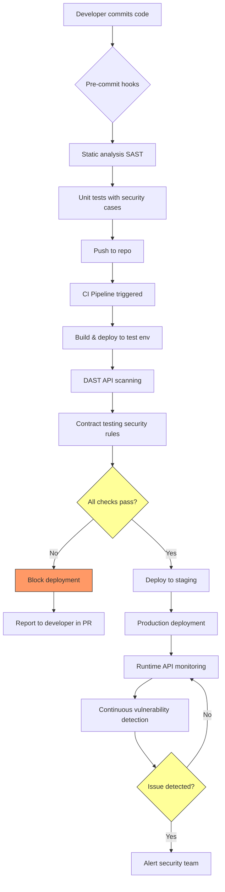
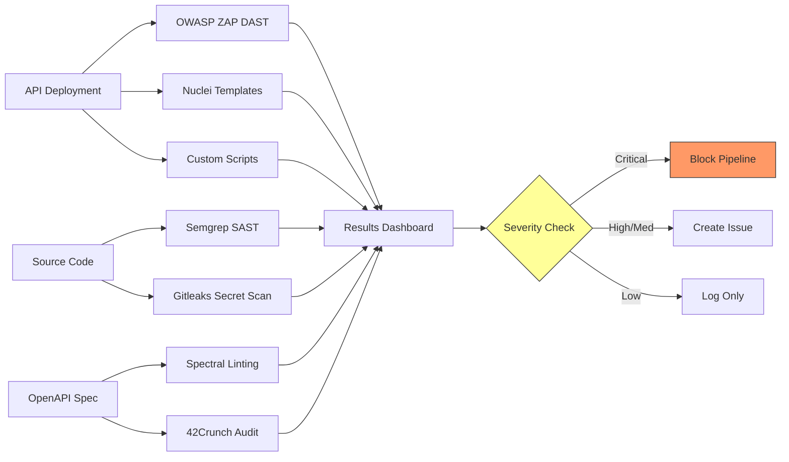
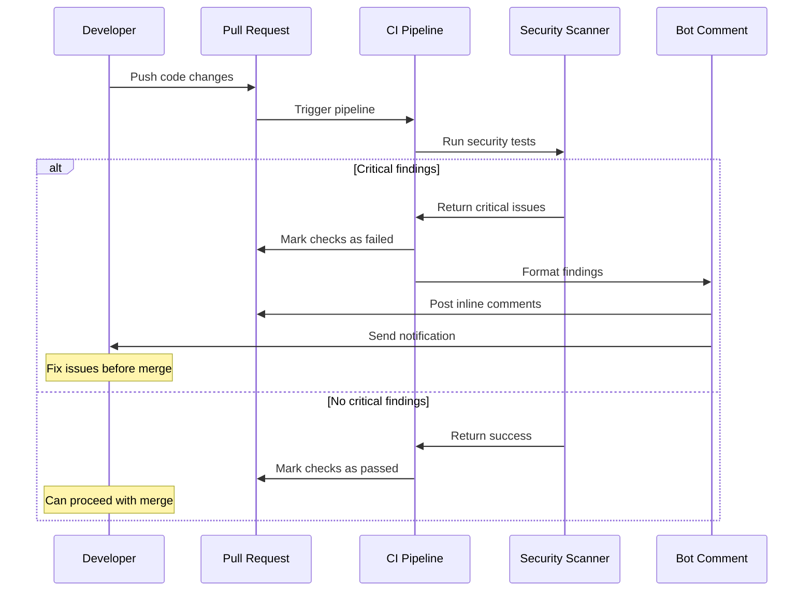

# Continuous API Security Testing

> **Continuous API security testing integrates automated security validation into your development pipeline, shifting security left while maintaining the depth needed to catch real vulnerabilities. In authorized testing, your goal is to build repeatable, maintainable security checks that run alongside functional tests without creating noise, blocking releases, or missing critical flaws.**

---

## 🧠 What Is It? (Beginner Explanation)

**Continuous API security testing** means running automated security checks every time your API changes—during development, in CI/CD pipelines, and in production monitoring.

Think of it like having a security expert review every code commit, but:

- the checks run in **seconds**, not days
- they catch **regressions** immediately
- they scale to **thousands of endpoints**
- they produce **actionable findings** developers can fix

Traditional security testing happens once per quarter or before major releases. Continuous testing happens on every:

- pull request
- commit to main
- deployment to staging
- release to production

The challenge is balancing:

| Goal | Risk if ignored |
|---|---|
| **Coverage** — test all critical endpoints and vulnerabilities | False sense of security; major flaws slip through |
| **Speed** — complete scans in minutes, not hours | Developers disable slow tests or skip security gates |
| **Accuracy** — minimize false positives | Teams ignore all findings (alert fatigue) |
| **Integration** — fit into existing workflows | Security remains siloed and slow |
| **Feedback loops** — show results where developers work | Findings get lost in separate dashboards |

---

## 🔍 When Continuous Testing Matters Most

Not all APIs benefit equally from continuous security testing. Prioritize when:

### High-value scenarios

```text
✓ API handles authentication or authorization decisions
✓ API processes financial transactions or payment data
✓ API exposes PII, PHI, or regulated data
✓ API integrates with third-party services (supply chain risk)
✓ API is publicly exposed or consumed by mobile/web clients
✓ API undergoes frequent changes (multiple deploys per week)
✓ API serves as a platform for other services (internal or external)
```

### Lower-value scenarios

```text
✗ Internal read-only APIs with no sensitive data
✗ Prototype/POC APIs not intended for production
✗ APIs with comprehensive security controls at gateway/proxy layer
✗ Rarely-changing legacy APIs with stable attack surface
```

---

## 🏗️ Continuous Testing Architecture



### Testing layers

| Layer | When it runs | What it catches | Tools |
|---|---|---|---|
| **Pre-commit** | Before code is pushed | Secrets, hardcoded credentials, obvious code flaws | git hooks, TruffleHog, Gitleaks |
| **SAST** | On every commit | Code-level vulnerabilities, insecure patterns | Semgrep, CodeQL, SonarQube |
| **Unit tests** | On every commit | Business logic flaws, auth bypass in isolated functions | JUnit, pytest, Jest |
| **DAST** | On every build | Runtime vulnerabilities, config issues, injection flaws | OWASP ZAP, Burp Suite Enterprise, Nuclei |
| **Contract tests** | On every build | Breaking changes, unexpected behavior, schema violations | Pact, Postman, Dredd |
| **Integration tests** | On every build | Multi-service auth flows, privilege escalation | Custom scripts, Playwright |
| **Staging validation** | Before production deploy | Full attack simulation in production-like environment | Custom security suite |
| **Production monitoring** | Continuously | Real attacks, anomalies, policy violations | API gateways, WAFs, RASP, runtime agents |

---

## 📋 Building Your Security Test Suite

### 1. Start with the OWASP API Security Top 10

Map each vulnerability to automated checks:

```text
┌─────────────────────────────────────────┬──────────────────────────────────┐
│ Vulnerability                           │ Automated Test Approach          │
├─────────────────────────────────────────┼──────────────────────────────────┤
│ API1:2023 Broken Object Level Auth     │ • Test object ID enumeration     │
│ (BOLA)                                  │ • Verify ownership checks        │
│                                         │ • Cross-user data access tests   │
├─────────────────────────────────────────┼──────────────────────────────────┤
│ API2:2023 Broken Authentication        │ • Test token validation          │
│                                         │ • Password policy checks         │
│                                         │ • MFA bypass attempts            │
├─────────────────────────────────────────┼──────────────────────────────────┤
│ API3:2023 Broken Object Property Level │ • Mass assignment tests          │
│ Authorization                           │ • Hidden field discovery         │
│                                         │ • Privilege field modification   │
├─────────────────────────────────────────┼──────────────────────────────────┤
│ API4:2023 Unrestricted Resource        │ • Rate limiting validation       │
│ Consumption                             │ • Pagination abuse tests         │
│                                         │ • Large payload handling         │
├─────────────────────────────────────────┼──────────────────────────────────┤
│ API5:2023 Broken Function Level        │ • Role-based access matrix       │
│ Authorization (BFLA)                    │ • Admin endpoint discovery       │
│                                         │ • Vertical privilege escalation  │
├─────────────────────────────────────────┼──────────────────────────────────┤
│ API6:2023 Unrestricted Access to       │ • Business flow manipulation     │
│ Sensitive Business Flows                │ • State machine validation       │
│                                         │ • Order bypass tests             │
├─────────────────────────────────────────┼──────────────────────────────────┤
│ API7:2023 Server Side Request Forgery  │ • URL parameter validation       │
│                                         │ • Internal resource access tests │
│                                         │ • Cloud metadata endpoint checks │
├─────────────────────────────────────────┼──────────────────────────────────┤
│ API8:2023 Security Misconfiguration    │ • Header security validation     │
│                                         │ • CORS policy tests              │
│                                         │ • Error message exposure         │
├─────────────────────────────────────────┼──────────────────────────────────┤
│ API9:2023 Improper Inventory Management│ • Endpoint discovery scans       │
│                                         │ • Version detection              │
│                                         │ • Shadow API identification      │
├─────────────────────────────────────────┼──────────────────────────────────┤
│ API10:2023 Unsafe Consumption of APIs  │ • Upstream response validation   │
│                                         │ • Dependency security checks     │
│                                         │ • Third-party API trust tests    │
└─────────────────────────────────────────┴──────────────────────────────────┘
```

### 2. Design test categories

Organize tests into categories matching your pipeline stages:

#### Critical (must pass before merge)
```yaml
critical_tests:
  - authentication_bypass
  - sql_injection
  - command_injection
  - hardcoded_secrets
  - exposed_admin_endpoints
  - broken_access_control
  
  characteristics:
    - run_time: < 5 minutes
    - false_positive_rate: < 1%
    - blocks_deployment: true
```

#### High (must pass before staging)
```yaml
high_priority_tests:
  - rate_limiting
  - input_validation
  - cors_misconfiguration
  - sensitive_data_exposure
  - mass_assignment
  - xxe_injection
  
  characteristics:
    - run_time: < 15 minutes
    - false_positive_rate: < 5%
    - blocks_deployment: true
    - requires_review: on_failure
```

#### Medium (must pass before production)
```yaml
medium_priority_tests:
  - security_headers
  - tls_configuration
  - cookie_security
  - redirect_validation
  - file_upload_restrictions
  
  characteristics:
    - run_time: < 30 minutes
    - false_positive_rate: < 10%
    - blocks_deployment: false
    - creates_ticket: on_failure
```

#### Continuous (runs in production)
```yaml
continuous_monitoring:
  - anomaly_detection
  - attack_pattern_recognition
  - data_exfiltration_detection
  - privilege_escalation_attempts
  
  characteristics:
    - run_time: real-time
    - alert_on: suspicious_patterns
    - auto_block: optional
```

---

## 🛠️ Tool Selection and Integration

### Open-source foundation



### Tool comparison

| Tool | Type | Best For | Integration | Cost |
|---|---|---|---|---|
| **Semgrep** | SAST | Custom security rules, language-specific patterns | CLI, GitHub Actions | Free/Paid |
| **OWASP ZAP** | DAST | Active scanning, baseline scans, API testing | CLI, Docker, CI plugins | Free |
| **Nuclei** | DAST | Template-based scanning, CVE detection | CLI, YAML templates | Free |
| **Burp Suite Enterprise** | DAST | Advanced scanning, authenticated testing | API, webhooks | Paid |
| **Postman/Newman** | Functional | Collection-based testing, contract validation | CLI, JavaScript | Free/Paid |
| **Spectral** | Spec linting | OpenAPI security validation | CLI, pre-commit hooks | Free |
| **42Crunch** | Spec analysis | Deep OpenAPI auditing, data flow analysis | SaaS, IDE plugins | Paid |
| **StackHawk** | DAST | Developer-focused, quick feedback | GitHub Actions, GitLab CI | Paid |
| **Snyk** | SCA/SAST | Dependency vulnerabilities, code scanning | IDE, CI/CD, SCM | Free/Paid |

---

## ⚙️ Pipeline Implementation Patterns

### Pattern 1: Progressive security gates

```yaml
# .github/workflows/security.yml
name: API Security Pipeline

on: [push, pull_request]

jobs:
  secrets-scan:
    runs-on: ubuntu-latest
    steps:
      - uses: actions/checkout@v3
        with:
          fetch-depth: 0
      - name: Gitleaks scan
        uses: gitleaks/gitleaks-action@v2
        env:
          GITHUB_TOKEN: ${{ secrets.GITHUB_TOKEN }}
      # Blocks on secrets

  sast:
    runs-on: ubuntu-latest
    needs: secrets-scan
    steps:
      - uses: actions/checkout@v3
      - name: Semgrep scan
        run: |
          pip install semgrep
          semgrep --config auto --json > semgrep-results.json
      - name: Check critical findings
        run: |
          CRITICAL=$(jq '[.results[] | select(.severity=="CRITICAL")] | length' semgrep-results.json)
          if [ "$CRITICAL" -gt 0 ]; then
            echo "Critical SAST findings detected"
            exit 1
          fi

  build-and-test:
    runs-on: ubuntu-latest
    needs: sast
    steps:
      - uses: actions/checkout@v3
      - name: Build API
        run: docker-compose up -d
      - name: Wait for API
        run: ./scripts/wait-for-api.sh
      - name: Run security tests
        run: |
          pytest tests/security/ -v --tb=short
      - name: OWASP ZAP baseline scan
        run: |
          docker run -v $(pwd):/zap/wrk/:rw \
            owasp/zap2docker-stable \
            zap-baseline.py -t http://api:8080/openapi.json \
            -r zap-report.html -J zap-report.json
      - name: Upload results
        uses: actions/upload-artifact@v3
        if: always()
        with:
          name: security-reports
          path: |
            zap-report.html
            zap-report.json

  dast-full:
    runs-on: ubuntu-latest
    needs: build-and-test
    if: github.ref == 'refs/heads/main'
    steps:
      - uses: actions/checkout@v3
      - name: Deploy to staging
        run: ./scripts/deploy-staging.sh
      - name: Full DAST scan
        run: |
          docker run -v $(pwd)/zap-config:/zap/wrk/:rw \
            owasp/zap2docker-stable \
            zap-full-scan.py -t https://staging-api.example.com \
            -r full-scan-report.html
```

### Pattern 2: Contract-based security testing

```javascript
// tests/security/contract-security.test.js
const { Pact } = require('@pact-foundation/pact');
const { securityMatchers } = require('./security-matchers');

describe('User API Security Contract', () => {
  const provider = new Pact({
    consumer: 'WebApp',
    provider: 'UserAPI',
    port: 8080
  });

  beforeAll(() => provider.setup());
  afterAll(() => provider.finalize());

  describe('GET /users/:id', () => {
    it('returns 401 without valid token', async () => {
      await provider.addInteraction({
        state: 'user 123 exists',
        uponReceiving: 'request without auth header',
        withRequest: {
          method: 'GET',
          path: '/users/123'
        },
        willRespondWith: {
          status: 401,
          headers: {
            'WWW-Authenticate': 'Bearer realm="api"'
          }
        }
      });

      const response = await fetch('http://localhost:8080/users/123');
      expect(response.status).toBe(401);
    });

    it('returns 403 when accessing other user data', async () => {
      await provider.addInteraction({
        state: 'user 123 and 456 exist',
        uponReceiving: 'request for user 456 with user 123 token',
        withRequest: {
          method: 'GET',
          path: '/users/456',
          headers: {
            Authorization: 'Bearer user123-token'
          }
        },
        willRespondWith: {
          status: 403
        }
      });

      const response = await fetch('http://localhost:8080/users/456', {
        headers: { Authorization: 'Bearer user123-token' }
      });
      expect(response.status).toBe(403);
    });

    it('does not expose sensitive fields without admin scope', async () => {
      await provider.addInteraction({
        state: 'user 123 exists',
        uponReceiving: 'request from regular user',
        withRequest: {
          method: 'GET',
          path: '/users/123',
          headers: {
            Authorization: 'Bearer user123-token'
          }
        },
        willRespondWith: {
          status: 200,
          body: {
            id: '123',
            username: 'alice',
            email: 'alice@example.com',
            // Should NOT include: ssn, internal_id, admin_notes
          }
        }
      });

      const response = await fetch('http://localhost:8080/users/123', {
        headers: { Authorization: 'Bearer user123-token' }
      });
      const data = await response.json();
      
      expect(data).not.toHaveProperty('ssn');
      expect(data).not.toHaveProperty('internal_id');
      expect(data).not.toHaveProperty('admin_notes');
    });
  });
});
```

### Pattern 3: Role-based authorization matrix testing

```python
# tests/security/rbac_matrix.py
import pytest
import requests
from itertools import product

# Define roles and their expected permissions
ROLES = {
    'anonymous': {'token': None},
    'user': {'token': 'user-token'},
    'premium_user': {'token': 'premium-token'},
    'moderator': {'token': 'moderator-token'},
    'admin': {'token': 'admin-token'}
}

# Define endpoints and allowed roles
AUTHORIZATION_MATRIX = [
    # (method, path, allowed_roles)
    ('GET', '/api/public/status', ['anonymous', 'user', 'premium_user', 'moderator', 'admin']),
    ('GET', '/api/users/me', ['user', 'premium_user', 'moderator', 'admin']),
    ('GET', '/api/users/{id}', ['moderator', 'admin']),
    ('PUT', '/api/users/{id}', ['admin']),
    ('DELETE', '/api/users/{id}', ['admin']),
    ('GET', '/api/premium/features', ['premium_user', 'admin']),
    ('POST', '/api/moderation/reports', ['moderator', 'admin']),
    ('GET', '/api/admin/settings', ['admin']),
]

@pytest.mark.parametrize('method,path,allowed_roles', AUTHORIZATION_MATRIX)
def test_authorization_matrix(method, path, allowed_roles, api_base_url):
    """Test that each role has exactly the expected access."""
    
    # Replace placeholders with test data
    test_path = path.replace('{id}', '123')
    
    for role_name, role_config in ROLES.items():
        headers = {}
        if role_config['token']:
            headers['Authorization'] = f"Bearer {role_config['token']}"
        
        response = requests.request(
            method=method,
            url=f"{api_base_url}{test_path}",
            headers=headers
        )
        
        if role_name in allowed_roles:
            # Should succeed (2xx or 3xx) or return business logic error (4xx except 401/403)
            assert response.status_code not in [401, 403], \
                f"{role_name} should access {method} {path} but got {response.status_code}"
        else:
            # Should be denied
            assert response.status_code in [401, 403], \
                f"{role_name} should NOT access {method} {path} but got {response.status_code}"
            
            # Verify correct error code
            if role_name == 'anonymous':
                assert response.status_code == 401, "Anonymous should get 401"
            else:
                assert response.status_code == 403, "Authenticated but unauthorized should get 403"


def test_no_privilege_escalation():
    """Test that users cannot escalate their own privileges."""
    
    # User tries to modify their own role
    response = requests.patch(
        'http://api/users/me',
        headers={'Authorization': 'Bearer user-token'},
        json={'role': 'admin'}
    )
    
    assert response.status_code in [400, 403], \
        "Users should not be able to modify their own role"
    
    # Verify role didn't change
    profile = requests.get(
        'http://api/users/me',
        headers={'Authorization': 'Bearer user-token'}
    ).json()
    
    assert profile['role'] != 'admin', "Role should not have changed"
```

---

## 📊 Managing Test Results

### Result categorization strategy

```text
┌──────────────┬────────────────────┬─────────────────┬──────────────────┐
│ Severity     │ Action Required    │ SLA             │ Assignment       │
├──────────────┼────────────────────┼─────────────────┼──────────────────┤
│ Critical     │ Block deployment   │ Fix immediately │ Security + Dev   │
│              │ Rollback if prod   │ < 4 hours       │                  │
├──────────────┼────────────────────┼─────────────────┼──────────────────┤
│ High         │ Block deployment   │ Fix in sprint   │ Dev team         │
│              │ Create ticket      │ < 1 week        │                  │
├──────────────┼────────────────────┼─────────────────┼──────────────────┤
│ Medium       │ Create ticket      │ Fix in backlog  │ Dev team         │
│              │ Track in dashboard │ < 1 month       │                  │
├──────────────┼────────────────────┼─────────────────┼──────────────────┤
│ Low          │ Log finding        │ Fix opportunist │ Dev team         │
│              │ No ticket          │ No deadline     │                  │
├──────────────┼────────────────────┼─────────────────┼──────────────────┤
│ Info         │ Document only      │ N/A             │ Security team    │
└──────────────┴────────────────────┴─────────────────┴──────────────────┘
```

### Automated triage with custom rules

```yaml
# security-triage.yaml
rules:
  - name: "SQL Injection in production endpoint"
    condition:
      type: sql_injection
      environment: production
      endpoint_exposure: public
    severity: critical
    action: block_and_alert
    notify:
      - security-team@company.com
      - oncall-engineer@company.com

  - name: "BOLA in authenticated endpoint"
    condition:
      type: broken_object_level_authorization
      authentication_required: true
    severity: high
    action: block_deployment
    create_jira:
      project: SEC
      labels: [api-security, bola]

  - name: "Missing security header in internal API"
    condition:
      type: missing_security_header
      endpoint_exposure: internal
    severity: low
    action: log_only

  - name: "Known false positive pattern"
    condition:
      type: xss
      endpoint: /api/render/template
      parameter: template_name
    severity: info
    action: suppress
    reason: "Template rendering is server-side only, no client reflection"
```

### Feedback loop to developers



Example bot comment in PR:

```markdown
## 🔒 Security Scan Results

**Status:** ❌ Failed  
**Critical Issues:** 2  
**High Issues:** 1  

---

### Critical: SQL Injection in user lookup
**File:** `src/api/users.py:45`  
**CWE:** CWE-89  

```python
# Vulnerable code
query = f"SELECT * FROM users WHERE username = '{username}'"
cursor.execute(query)
```

**Recommendation:** Use parameterized queries

```python
# Fixed code
query = "SELECT * FROM users WHERE username = ?"
cursor.execute(query, (username,))
```

**References:**
- [OWASP SQL Injection](https://owasp.org/www-community/attacks/SQL_Injection)
- [Internal Secure Coding Guidelines](https://wiki.company.com/secure-sql)

---

### Critical: Broken Access Control
**File:** `src/api/documents.py:78`  
**Endpoint:** `GET /api/documents/{doc_id}`  

Missing authorization check allows any authenticated user to access any document by changing the `doc_id` parameter.

**Fix:** Add ownership verification before returning document
```

---

## 🔄 Handling False Positives

### Build a suppression database

```json
{
  "suppressions": [
    {
      "id": "SUPP-001",
      "scanner": "semgrep",
      "rule_id": "python.django.security.audit.xss.template-autoescape-off",
      "file": "src/admin/reports.py",
      "reason": "Admin-only template rendering with trusted input",
      "approved_by": "security-team",
      "expires": "2024-12-31",
      "requires_review": true
    },
    {
      "id": "SUPP-002",
      "scanner": "zap",
      "alert": "X-Frame-Options Header Not Set",
      "url_pattern": "^https://api\\.example\\.com/webhooks/.*",
      "reason": "Webhooks are not rendered in browsers",
      "approved_by": "alice@company.com",
      "expires": null
    }
  ]
}
```

### Tuning strategy

```text
Week 1-2: Discovery
  ├─ Run all scanners in audit mode
  ├─ Collect all findings
  ├─ Categorize true vs false positives
  └─ Identify noisy rules

Week 3-4: Calibration
  ├─ Disable rules with >30% false positive rate
  ├─ Create suppressions for known false positives
  ├─ Configure scanner-specific settings
  └─ Adjust severity thresholds

Week 5-6: Validation
  ├─ Run calibrated scanners on new code
  ├─ Measure false positive rate
  ├─ Collect developer feedback
  └─ Iterate on configuration

Week 7+: Maintenance
  ├─ Review suppressions quarterly
  ├─ Update rules for new vulnerability patterns
  ├─ Add new test cases for regressions
  └─ Track metrics (detection rate, false positive rate)
```

---

## 📈 Metrics and KPIs

### Security metrics to track

| Metric | Goal | Why it matters |
|---|---|---|
| **Mean Time to Detect (MTTD)** | < 1 day | How quickly you find vulnerabilities after they're introduced |
| **Mean Time to Resolve (MTTR)** | < 7 days | How quickly you fix vulnerabilities after detection |
| **Security test coverage** | > 80% of endpoints | Percentage of API endpoints with security tests |
| **False positive rate** | < 10% | Percentage of findings that are not real vulnerabilities |
| **Security gate pass rate** | > 90% | Percentage of builds that pass security checks |
| **Critical vulnerabilities escaped** | 0 per quarter | Critical vulnerabilities found in production |
| **Security test execution time** | < 10 min | Time to run security tests in CI/CD |

### Example dashboard

```text
╔══════════════════════════════════════════════════════════════════╗
║                  API SECURITY DASHBOARD                          ║
║                  Last updated: 2024-03-15 14:30 UTC              ║
╠══════════════════════════════════════════════════════════════════╣
║                                                                  ║
║  Security Test Coverage:  ████████████████░░░░  82%             ║
║  Endpoints Tested:        245 / 298                              ║
║                                                                  ║
║  Current Sprint:                                                 ║
║    Critical Issues:  0                                           ║
║    High Issues:      3  (2 in progress, 1 pending)              ║
║    Medium Issues:    12 (8 in progress, 4 pending)              ║
║                                                                  ║
║  Scan Performance:                                               ║
║    SAST:      2m 15s  ✓                                         ║
║    DAST:      8m 42s  ✓                                         ║
║    Secrets:   0m 34s  ✓                                         ║
║                                                                  ║
║  Trend (30 days):                                                ║
║    MTTD:      18h → 12h  ↓ 33%                                  ║
║    MTTR:      5.2d → 4.1d  ↓ 21%                                ║
║    False Positives:  15% → 9%  ↓ 40%                            ║
║                                                                  ║
║  Top Vulnerability Types:                                        ║
║    1. Broken Access Control      (18 findings)                  ║
║    2. Security Misconfiguration  (12 findings)                  ║
║    3. Injection                  (5 findings)                   ║
║                                                                  ║
╚══════════════════════════════════════════════════════════════════╝
```

---

## 🎯 Advanced Patterns

### 1. Chaos testing for security

Inject security faults to verify defensive mechanisms:

```python
# chaos_security.py
import random
from datetime import datetime, timedelta

class SecurityChaosTests:
    """Inject security-related chaos to test resilience."""
    
    def test_expired_token_handling(self):
        """Verify API rejects expired tokens correctly."""
        expired_token = self.generate_token(
            exp=datetime.utcnow() - timedelta(hours=1)
        )
        
        response = requests.get(
            'http://api/users/me',
            headers={'Authorization': f'Bearer {expired_token}'}
        )
        
        assert response.status_code == 401
        assert 'expired' in response.json()['error'].lower()
    
    def test_corrupted_token_handling(self):
        """Verify API handles malformed tokens gracefully."""
        valid_token = self.get_valid_token()
        
        # Corrupt token signature
        parts = valid_token.split('.')
        corrupted = '.'.join([parts[0], parts[1], 'corrupted'])
        
        response = requests.get(
            'http://api/users/me',
            headers={'Authorization': f'Bearer {corrupted}'}
        )
        
        assert response.status_code == 401
        assert 'invalid' in response.json()['error'].lower()
        
        # Should not leak internal details
        assert 'signature' not in response.text.lower()
        assert 'jwt' not in response.text.lower()
    
    def test_rate_limit_enforcement_under_attack(self):
        """Simulate burst attack to verify rate limiting."""
        responses = []
        
        for i in range(100):
            resp = requests.get('http://api/public/status')
            responses.append(resp.status_code)
        
        # Should rate limit after threshold
        assert 429 in responses, "Rate limiting not enforced"
        
        # Should include Retry-After header
        rate_limited = [r for r in responses if r == 429][0]
        assert 'Retry-After' in rate_limited.headers
```

### 2. Security regression testing

Track historical vulnerabilities to prevent reintroduction:

```python
# regression_tests.py
import pytest

@pytest.mark.regression
class TestSecurityRegressions:
    """Tests for previously fixed security vulnerabilities."""
    
    def test_regression_CVE_2023_12345(self):
        """
        Regression test for CVE-2023-12345: BOLA in document access.
        
        Fixed in: PR #456 on 2023-06-15
        Root cause: Missing authorization check in DocumentController
        """
        user1_token = self.get_token_for_user('user1')
        user2_token = self.get_token_for_user('user2')
        
        # User1 creates document
        doc = requests.post(
            'http://api/documents',
            headers={'Authorization': f'Bearer {user1_token}'},
            json={'title': 'Private Document'}
        ).json()
        
        # User2 should NOT access User1's document
        response = requests.get(
            f"http://api/documents/{doc['id']}",
            headers={'Authorization': f'Bearer {user2_token}'}
        )
        
        assert response.status_code == 403, \
            "REGRESSION: CVE-2023-12345 reintroduced - unauthorized document access"
    
    def test_regression_mass_assignment_CVE_2023_67890(self):
        """
        Regression test for CVE-2023-67890: Mass assignment in user profile.
        
        Fixed in: PR #512 on 2023-08-22
        Root cause: Insufficient input validation allowed role modification
        """
        user_token = self.get_token_for_user('regular_user')
        
        # Attempt to escalate privileges via mass assignment
        response = requests.patch(
            'http://api/users/me',
            headers={'Authorization': f'Bearer {user_token}'},
            json={
                'name': 'Alice',
                'role': 'admin',  # Should be ignored
                'is_verified': True  # Should be ignored
            }
        )
        
        # Update should succeed for allowed fields
        assert response.status_code == 200
        
        # But role should not change
        profile = response.json()
        assert profile['role'] != 'admin', \
            "REGRESSION: Mass assignment vulnerability reintroduced"
        assert profile['name'] == 'Alice', "Legitimate update should work"
```

### 3. Multi-tenant security isolation testing

```python
# tenant_isolation_tests.py

class TenantIsolationTests:
    """Verify complete data isolation between tenants."""
    
    def test_tenant_data_isolation(self):
        """Ensure tenant A cannot access tenant B's data."""
        
        tenant_a_token = self.get_tenant_token('tenant-a')
        tenant_b_token = self.get_tenant_token('tenant-b')
        
        # Create resource in tenant A
        resource_a = requests.post(
            'http://api/v1/resources',
            headers={
                'Authorization': f'Bearer {tenant_a_token}',
                'X-Tenant-ID': 'tenant-a'
            },
            json={'name': 'Tenant A Resource'}
        ).json()
        
        # Create resource in tenant B
        resource_b = requests.post(
            'http://api/v1/resources',
            headers={
                'Authorization': f'Bearer {tenant_b_token}',
                'X-Tenant-ID': 'tenant-b'
            },
            json={'name': 'Tenant B Resource'}
        ).json()
        
        # Tenant A should NOT see tenant B's resource
        response = requests.get(
            f"http://api/v1/resources/{resource_b['id']}",
            headers={
                'Authorization': f'Bearer {tenant_a_token}',
                'X-Tenant-ID': 'tenant-a'
            }
        )
        assert response.status_code == 404
        
        # Even with manipulated tenant header
        response = requests.get(
            f"http://api/v1/resources/{resource_b['id']}",
            headers={
                'Authorization': f'Bearer {tenant_a_token}',
                'X-Tenant-ID': 'tenant-b'  # Attempt to impersonate tenant B
            }
        )
        assert response.status_code in [401, 403, 404]
        
        # List endpoint should only show own resources
        resources = requests.get(
            'http://api/v1/resources',
            headers={
                'Authorization': f'Bearer {tenant_a_token}',
                'X-Tenant-ID': 'tenant-a'
            }
        ).json()
        
        resource_ids = [r['id'] for r in resources['items']]
        assert resource_a['id'] in resource_ids
        assert resource_b['id'] not in resource_ids
```

---

## 🚨 Production Security Monitoring

### Real-time attack detection

```yaml
# attack-detection-rules.yaml
detection_rules:
  - name: "Credential stuffing attack"
    pattern:
      - failed_logins > 10 within 60 seconds
      - from_same_ip: true
      - distinct_usernames > 5
    action:
      - rate_limit_ip: 1 hour
      - alert: security-team
      - log_detail: full_request
    
  - name: "BOLA enumeration attempt"
    pattern:
      - sequential_id_access: true
      - success_rate < 30%
      - request_count > 50 within 120 seconds
    action:
      - increase_monitoring: true
      - require_captcha: true
      - alert: security-team
    
  - name: "Privilege escalation attempt"
    pattern:
      - endpoint: /admin/*
      - role: user
      - response_code: 403
      - attempts > 3 within 300 seconds
    action:
      - flag_account: true
      - alert: security-team
      - block_user: 24 hours
  
  - name: "Data exfiltration pattern"
    pattern:
      - endpoint: /api/users/*
      - response_size > 1MB
      - request_count > 100 within 600 seconds
    action:
      - throttle_response: true
      - alert: security-team
      - create_incident: high_priority
```

### Security metrics collection

```python
# security_metrics.py
from prometheus_client import Counter, Histogram, Gauge

# Define metrics
auth_failures = Counter(
    'api_auth_failures_total',
    'Total authentication failures',
    ['endpoint', 'reason']
)

authz_denials = Counter(
    'api_authorization_denials_total',
    'Total authorization denials',
    ['endpoint', 'role', 'resource']
)

suspicious_activity = Counter(
    'api_suspicious_activity_total',
    'Suspicious activity patterns detected',
    ['pattern_type', 'severity']
)

request_validation_errors = Counter(
    'api_validation_errors_total',
    'Request validation errors',
    ['endpoint', 'error_type']
)

# Track in middleware
class SecurityMetricsMiddleware:
    def process_response(self, request, response):
        if response.status_code == 401:
            auth_failures.labels(
                endpoint=request.path,
                reason=response.get('X-Auth-Failure-Reason', 'unknown')
            ).inc()
        
        elif response.status_code == 403:
            authz_denials.labels(
                endpoint=request.path,
                role=request.user.role if request.user else 'anonymous',
                resource=request.path
            ).inc()
        
        return response
```

---

## 🔧 Troubleshooting Common Issues

### Issue 1: Tests are too slow

**Symptoms:**
- Security pipeline takes > 30 minutes
- Developers skip security checks locally
- CI/CD queue backs up

**Solutions:**

```yaml
# Parallelize tests
jobs:
  security-sast:
    runs-on: ubuntu-latest
    # Runs in parallel with other jobs
  
  security-secrets:
    runs-on: ubuntu-latest
    # Runs in parallel with other jobs
  
  security-dast:
    needs: [security-sast, security-secrets]
    runs-on: ubuntu-latest
    strategy:
      matrix:
        scan_type: [baseline, api, spa]
      max-parallel: 3

# Use incremental scanning
- name: ZAP incremental scan
  run: |
    # Only scan changed endpoints
    git diff --name-only origin/main | grep -E '(routes|controllers)' > changed_files.txt
    python scripts/extract_endpoints.py changed_files.txt > endpoints.txt
    zap-cli quick-scan --scanners all -t endpoints.txt

# Cache dependencies
- uses: actions/cache@v3
  with:
    path: |
      ~/.cache/semgrep
      ~/.zap
    key: security-tools-${{ hashFiles('**/security-config.yml') }}
```

### Issue 2: Too many false positives

**Symptoms:**
- Developers ignore security findings
- Security gates always fail
- Security team spends time on triage

**Solutions:**

1. **Tune scanner configuration**
```yaml
# semgrep-config.yml
rules:
  - id: sql-injection
    severity: ERROR
    # Add exceptions for known safe patterns
    patterns:
      - pattern: cursor.execute($QUERY, ...)
      - pattern-not: cursor.execute("SELECT ...")
    
  - id: xss-template
    severity: WARNING
    # Lower severity for server-side rendering
    metadata:
      environment: server-side
```

2. **Implement smart suppression**
```python
def should_suppress(finding):
    """Determine if finding should be suppressed."""
    
    # Suppress based on context
    if finding.type == 'missing_auth' and finding.endpoint.startswith('/public/'):
        return True
    
    # Suppress based on mitigation
    if finding.type == 'sqli':
        # Check if using ORM
        if uses_orm(finding.file):
            return True
    
    # Suppress based on environment
    if finding.severity == 'LOW' and finding.environment == 'development':
        return True
    
    return False
```

3. **Require manual review for suppressions**
```yaml
# .github/workflows/security-suppressions.yml
name: Review Security Suppressions

on:
  pull_request:
    paths:
      - '.security/suppressions.json'

jobs:
  review:
    runs-on: ubuntu-latest
    steps:
      - name: Require security team approval
        uses: actions/github-script@v6
        with:
          script: |
            const { data: reviews } = await github.rest.pulls.listReviews({
              owner: context.repo.owner,
              repo: context.repo.repo,
              pull_number: context.issue.number
            });
            
            const securityApproval = reviews.find(r => 
              r.state === 'APPROVED' && 
              r.user.login === 'security-team-bot'
            );
            
            if (!securityApproval) {
              core.setFailed('Security team approval required for suppression changes');
            }
```

### Issue 3: Missing coverage for new endpoints

**Symptoms:**
- New APIs deployed without security tests
- Vulnerabilities found in production
- Inconsistent security posture

**Solutions:**

1. **Auto-generate test stubs from OpenAPI spec**
```python
# generate_security_tests.py
import yaml

def generate_tests_from_spec(spec_path):
    """Generate security test stubs from OpenAPI spec."""
    
    with open(spec_path) as f:
        spec = yaml.safe_load(f)
    
    tests = []
    for path, methods in spec['paths'].items():
        for method, details in methods.items():
            # Generate auth tests
            if 'security' in details:
                tests.append(f"""
def test_{method}_{path.replace('/', '_')}_requires_auth():
    response = requests.{method.lower()}('http://api{path}')
    assert response.status_code == 401
                """)
            
            # Generate parameter validation tests
            if 'parameters' in details:
                for param in details['parameters']:
                    if param.get('required'):
                        tests.append(f"""
def test_{method}_{path.replace('/', '_')}_validates_{param['name']}():
    response = requests.{method.lower()}('http://api{path}')
    assert response.status_code == 400
                        """)
    
    return '\n'.join(tests)
```

2. **Enforce test coverage in CI**
```yaml
- name: Check security test coverage
  run: |
    # Extract all endpoints from spec
    python scripts/extract_endpoints.py openapi.yaml > endpoints.txt
    
    # Extract tested endpoints from tests
    grep -rh "def test_.*" tests/security/ | \
      sed 's/def test_//' | \
      cut -d'(' -f1 > tested_endpoints.txt
    
    # Find untested endpoints
    comm -23 <(sort endpoints.txt) <(sort tested_endpoints.txt) > untested.txt
    
    if [ -s untested.txt ]; then
      echo "Untested endpoints found:"
      cat untested.txt
      exit 1
    fi
```

---

## ✅ Best Practices Checklist

```text
Pre-implementation:
  ☐ Identify critical APIs and sensitive operations
  ☐ Define security requirements and acceptance criteria
  ☐ Choose tools based on tech stack and budget
  ☐ Establish baseline metrics (current vulnerabilities, MTTD, MTTR)
  ☐ Get buy-in from development teams

Pipeline setup:
  ☐ Start with fast, high-confidence checks (secrets, SAST)
  ☐ Add progressive gates (block on critical, warn on high)
  ☐ Integrate with existing CI/CD (don't create separate pipeline)
  ☐ Configure result reporting in developer tools (PR comments, IDE)
  ☐ Set up monitoring and alerting for pipeline failures

Test development:
  ☐ Cover OWASP API Top 10 systematically
  ☐ Create role-based authorization matrix
  ☐ Add regression tests for fixed vulnerabilities
  ☐ Implement business logic security tests
  ☐ Test both positive and negative cases

Tuning and maintenance:
  ☐ Measure and reduce false positive rate
  ☐ Create documented suppression process
  ☐ Review suppressions quarterly
  ☐ Update tests when requirements change
  ☐ Track metrics and improve coverage over time

Production monitoring:
  ☐ Deploy real-time attack detection
  ☐ Set up security metrics dashboards
  ☐ Configure alerting for suspicious patterns
  ☐ Implement automated response for critical threats
  ☐ Conduct regular security reviews of monitoring rules
```

---

## 📚 Additional Resources

### Tools and frameworks
- [OWASP ZAP](https://www.zaproxy.org/) - Open-source DAST scanner
- [Semgrep](https://semgrep.dev/) - Static analysis with custom rules
- [Nuclei](https://nuclei.projectdiscovery.io/) - Template-based vulnerability scanner
- [42Crunch](https://42crunch.com/) - OpenAPI security audit
- [StackHawk](https://www.stackhawk.com/) - Modern DAST for APIs

### Standards and references
- [OWASP API Security Top 10](https://owasp.org/www-project-api-security/)
- [OWASP DevSecOps Guideline](https://owasp.org/www-project-devsecops-guideline/)
- [NIST SP 800-204](https://csrc.nist.gov/publications/detail/sp/800-204/final) - Security for Microservices
- [CWE API Security Weaknesses](https://cwe.mitre.org/data/definitions/1210.html)

### Implementation guides
- [GitHub Actions Security Hardening](https://docs.github.com/en/actions/security-guides)
- [GitLab CI/CD Security](https://docs.gitlab.com/ee/user/application_security/)
- [API Security Testing with Postman](https://learning.postman.com/docs/api-security/security-testing/)

---

## 🎓 Key Takeaways

1. **Start small, iterate fast** — Begin with critical APIs and high-confidence checks, then expand coverage
2. **Developer experience matters** — Fast feedback, low false positives, and clear remediation guidance drive adoption
3. **Security is not just scanning** — Combine SAST, DAST, contract tests, and custom business logic tests
4. **Automate everything** — From test execution to result triage to ticket creation
5. **Measure and improve** — Track MTTD, MTTR, coverage, and false positive rates
6. **Production is different** — Runtime monitoring catches attacks that tests miss
7. **Tune aggressively** — False positives kill credibility; suppress noise, highlight signal
8. **Security is a team sport** — Security tools enable developers; they don't replace security expertise

Continuous API security testing shifts security left **and** right—catching vulnerabilities in development while detecting attacks in production. The goal is making security fast, automated, and integrated enough that it becomes invisible infrastructure rather than a separate gate.
