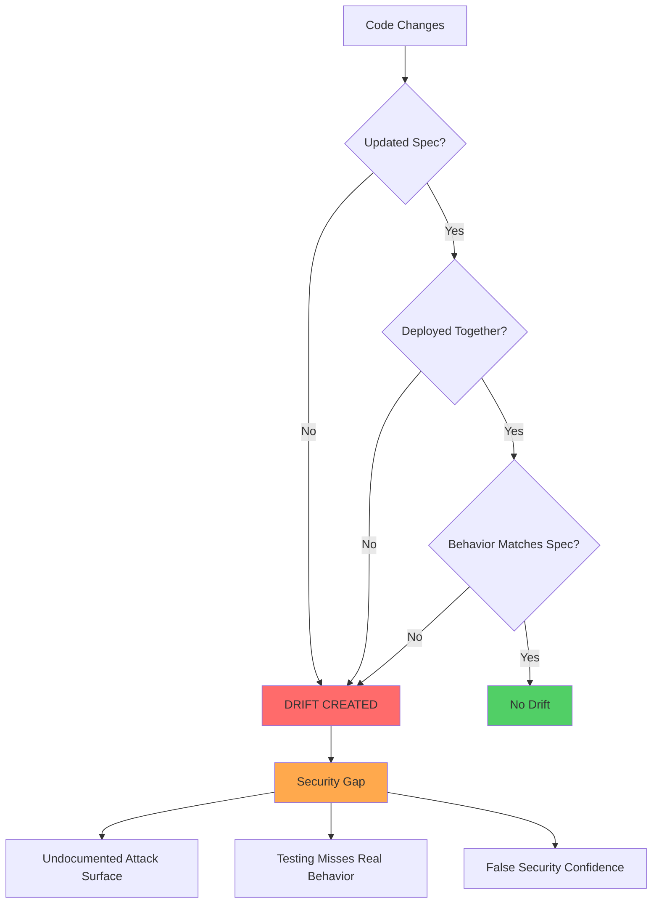
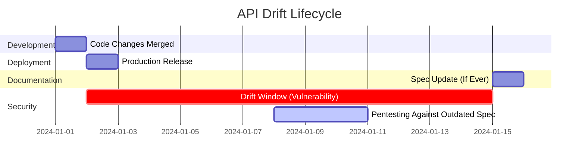
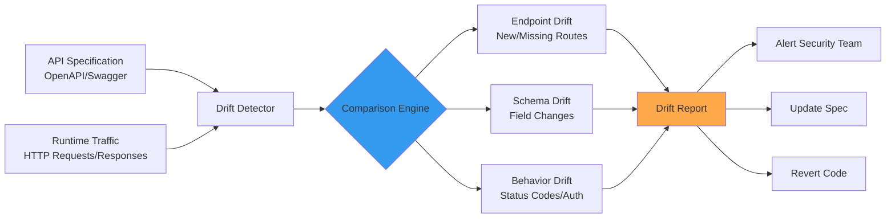
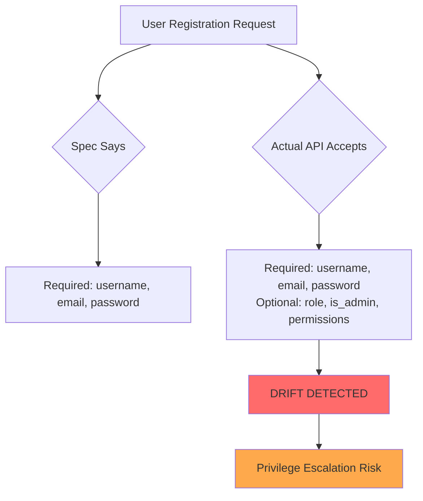
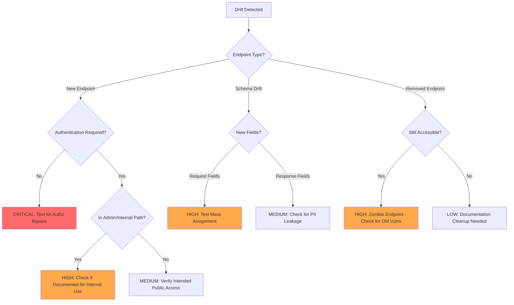
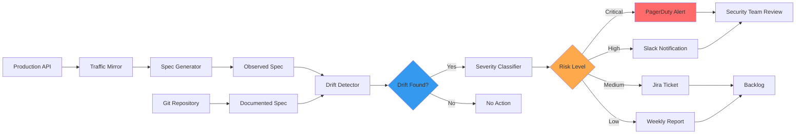
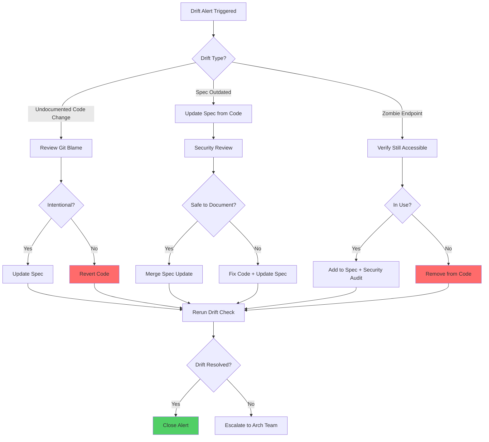

# API Drift Detection
> Automated identification of discrepancies between documented API specifications and actual runtime behavior, preventing security gaps from undocumented changes.

## Table of Contents
1. [🧠 What Is Drift Detection?](#-what-is-drift-detection)
2. [🏗️ How Drift Happens](#-how-drift-happens)
3. [📊 Drift Detection Architecture](#-drift-detection-architecture)
4. [⚙️ Types of API Drift](#-types-of-api-drift)
5. [🔴 Security Impact](#-security-impact)
6. [💥 Detection Methodology](#-detection-methodology)
7. [🛠️ Tools & Commands](#-tools--commands)
8. [🔍 Monitoring & Analysis](#-monitoring--analysis)
9. [🛡️ Prevention & Remediation](#-prevention--remediation)
10. [📚 References](#-references)

---

## 🧠 What Is Drift Detection?

**Beginner Explanation:**

API drift detection is like a "spot the difference" game between what your API documentation says and what your API actually does. Imagine a restaurant menu that lists a burger for $10, but the cash register rings it up as $12 with extra toppings you didn't order. That gap between the menu (specification) and reality (implementation) is drift.

In APIs, this happens when:
- Developers deploy code changes without updating OpenAPI/Swagger specs
- New endpoints get added but aren't documented
- Authentication requirements change silently
- Response schemas evolve but documentation doesn't

**Why It Matters for Security:**

Drift creates **invisible attack surface**. If security teams only test against documented APIs, they miss:
- Undocumented endpoints that bypass authorization
- Changed validation rules that enable injection attacks
- Deprecated endpoints still running (and vulnerable)
- New fields exposing sensitive data

**Real-World Example:**

A company's OpenAPI spec shows `/api/v2/users/{id}` requires admin role. But the actual deployment allows any authenticated user to access it. Pentests against the spec show "secure," but production is vulnerable. That's drift.

---

## 🏗️ How Drift Happens

### Common Drift Scenarios



### Root Causes

| Cause | How It Creates Drift | Example |
|-------|---------------------|---------|
| **Manual Spec Updates** | Developers forget to update YAML/JSON specs | New `/admin/debug` endpoint deployed but not in OpenAPI file |
| **Framework Auto-Generation** | Generated specs lag behind code | Django REST Framework serializers changed, swagger not regenerated |
| **Microservices Versioning** | Service A updates, API Gateway spec doesn't | Payment service now requires `idempotency_key`, but gateway spec omits it |
| **Environment Differences** | Dev/staging specs diverge from production | Rate limits documented as 1000/hour, prod actually enforces 100/hour |
| **Shadow Deployments** | Feature flags enable undocumented features | `/beta/ai-search` active in prod but not in public spec |
| **Deprecated Endpoints** | Old versions removed from docs but still running | `/v1/login` removed from spec 2 years ago, still accepts requests |
| **Third-Party Integrations** | External APIs change without notice | Stripe webhook payload adds new fields, your spec outdated |

### The Drift Timeline



**Critical Period:** The gap between deployment (Day 2) and spec update (Day 15) is when drift exists. Security testing during this window produces false negatives.

---

## 📊 Drift Detection Architecture

### High-Level Detection Flow



### Detection Approaches

| Approach | Data Source | When to Use | Pros | Cons |
|----------|-------------|-------------|------|------|
| **Passive Monitoring** | Production traffic logs | Continuous monitoring | Non-intrusive, sees real usage | Requires traffic, may miss unused endpoints |
| **Active Probing** | Synthetic test requests | Pre-deployment/CI/CD | Catches drift before production | May miss runtime-only behavior |
| **Contract Testing** | Automated test suites | CI/CD pipeline | Fast feedback loop | Requires test maintenance |
| **Shadow Spec Generation** | Runtime introspection | Periodic audits | Auto-generates truth spec | Can be noisy, needs filtering |

---

## ⚙️ Types of API Drift

### 1. Endpoint Drift

**What It Is:** Differences in available routes/paths.

| Drift Type | Example | Security Impact |
|------------|---------|-----------------|
| **Undocumented Endpoint** | `/api/internal/reset-password` exists but not in spec | Bypasses documented auth flows |
| **Zombie Endpoint** | `/v1/admin` in spec but returns 404 | Wasted security testing effort |
| **Method Mismatch** | Spec says `POST /users`, actual accepts `PUT` too | CSRF protection bypassed via PUT |
| **Path Parameter Drift** | Spec: `/users/{id}`, Actual: `/users/{id}/profile` works | Hidden data exposure |

**Detection Command:**
```bash
# Compare spec endpoints vs actual routes
cat openapi.yaml | yq '.paths | keys' > spec_endpoints.txt
curl -s https://api.example.com/ | grep -oP '(?<=href=")[^"]*' > actual_endpoints.txt
diff spec_endpoints.txt actual_endpoints.txt
```

### 2. Schema Drift

**What It Is:** Request/response structure differences.



| Drift Type | Spec Says | Actual Behavior | Attack Vector |
|------------|-----------|-----------------|---------------|
| **Extra Fields** | `{username, email}` | Also accepts `{role: "admin"}` | Privilege escalation via mass assignment |
| **Missing Validation** | `email` format: `email` | Accepts any string | Injection via malformed email |
| **Type Coercion** | `age` type: `integer` | Accepts `"999999999999999999"` | Integer overflow |
| **Sensitive Data Leakage** | Response omits `ssn` field | Actually returns `ssn` in response | PII exposure |

**Detection with Schemathesis:**
```python
import schemathesis

schema = schemathesis.from_uri("https://api.example.com/openapi.json")

@schema.parametrize()
def test_schema_compliance(case):
    response = case.call()
    case.validate_response(response)  # Checks response matches spec
    
    # Custom drift detection
    spec_fields = set(case.endpoint.definition["responses"]["200"]["schema"]["properties"].keys())
    actual_fields = set(response.json().keys())
    
    drift = actual_fields - spec_fields
    if drift:
        print(f"DRIFT: Undocumented fields in response: {drift}")
```

### 3. Authentication/Authorization Drift

**What It Is:** Security control mismatches.

| Drift Type | Example | Impact |
|------------|---------|--------|
| **Removed Auth** | Spec requires `Bearer token`, endpoint now accepts anonymous | Unauthorized access |
| **Weakened Auth** | Spec: OAuth 2.0 required, Actual: Also accepts API key | Downgrade attack surface |
| **Scope Creep** | Spec: `read:users` scope, Actual: Allows write operations | Privilege escalation |
| **CORS Drift** | Spec: `example.com` origin, Actual: Allows wildcard `*` | Cross-origin attacks |

**Detection Example:**
```bash
# Test endpoint with no auth (should fail per spec)
curl -X GET https://api.example.com/api/v2/admin/users

# Expected: 401 Unauthorized
# Actual: 200 OK with user data → AUTH DRIFT DETECTED
```

### 4. Behavior Drift

**What It Is:** Response codes, rate limits, error handling changes.

| Aspect | Spec Definition | Actual Behavior | Risk |
|--------|----------------|-----------------|------|
| **Status Codes** | 404 for missing resource | Returns 200 with empty array | Info leak (resource existence) |
| **Rate Limits** | 100 req/minute | Actually 1000 req/minute | DoS vulnerability |
| **Error Messages** | Generic "Invalid request" | Returns full SQL error | Info disclosure |
| **Pagination** | Max 100 items/page | Accepts `?limit=999999` | Resource exhaustion |

---

## 🔴 Security Impact

### Attack Scenarios Enabled by Drift

#### Scenario 1: Mass Assignment via Undocumented Fields

**Setup:**
- Spec shows `POST /api/users` accepts: `{username, email, password}`
- Actual API also accepts: `{role, is_verified, credits}`
- Drift detection not in place

**Attack:**
```http
POST /api/users HTTP/1.1
Host: api.example.com
Content-Type: application/json

{
  "username": "attacker",
  "email": "attacker@evil.com",
  "password": "hunter2",
  "role": "admin",
  "is_verified": true,
  "credits": 999999
}
```

**Result:** Attacker creates admin account because drift wasn't caught.

#### Scenario 2: Zombie Endpoint Exploitation

**Setup:**
- Spec shows `/v1/auth/login` deprecated, removed from docs
- Endpoint still exists in production with old vulnerabilities
- Pentesters only test documented `/v2/auth/login` (secure)

**Attack:**
```bash
# Old endpoint has SQL injection vulnerability
curl -X POST https://api.example.com/v1/auth/login \
  -d "username=admin' OR '1'='1&password=anything"

# Returns admin session token
```

**Result:** Security team has false confidence; old vuln still exploitable.

#### Scenario 3: Response Drift Data Exposure

**Spec:**
```yaml
/api/users/{id}:
  get:
    responses:
      200:
        schema:
          properties:
            id: {type: integer}
            username: {type: string}
            avatar: {type: string}
```

**Actual Response:**
```json
{
  "id": 123,
  "username": "john_doe",
  "avatar": "https://cdn.example.com/avatars/123.jpg",
  "email": "john@personal.com",
  "ssn": "123-45-6789",
  "internal_notes": "VIP customer - comp credits if complains"
}
```

**Impact:** PII and internal data exposed to any authenticated user.

### Drift Risk Matrix

| Drift Type | Likelihood | Exploitability | Impact | Overall Risk |
|------------|------------|----------------|--------|--------------|
| Undocumented Admin Endpoint | Medium | High | Critical | **CRITICAL** |
| Extra Response Fields (PII) | High | High | High | **CRITICAL** |
| Relaxed Auth Requirements | Low | High | Critical | **HIGH** |
| Missing Rate Limits | High | Medium | Medium | **MEDIUM** |
| Status Code Inconsistencies | High | Low | Low | **LOW** |

---

## 💥 Detection Methodology

### Phase 1: Baseline Establishment

**Objective:** Create source of truth.

```bash
# Step 1: Export current API specification
curl -o baseline_spec.yaml https://api.example.com/openapi.yaml

# Step 2: Validate spec structure
docker run --rm -v "${PWD}:/local" openapitools/openapi-generator-cli validate \
  -i /local/baseline_spec.yaml

# Step 3: Generate endpoint inventory
cat baseline_spec.yaml | \
  yq '.paths | to_entries | .[] | .key + " " + (.value | keys | join(","))' \
  > baseline_endpoints.txt

# Output example:
# /api/users GET,POST
# /api/users/{id} GET,PUT,DELETE
# /api/auth/login POST
```

### Phase 2: Runtime Traffic Capture

**Objective:** Observe actual API behavior.

```bash
# Option A: Proxy-based capture (Burp/OWASP ZAP)
# Configure app to proxy through 127.0.0.1:8080
# Exercise all API functionality
# Export traffic as HAR file

# Option B: Production log analysis
# Parse access logs for unique endpoints
cat /var/log/nginx/access.log | \
  awk '{print $7}' | \
  grep '^/api/' | \
  sort -u > observed_endpoints.txt

# Option C: Active scanning with Akita
akita learn --filter "url contains api.example.com" \
  --out observed_spec.yaml
```

### Phase 3: Differential Analysis

**Objective:** Compare spec vs reality.

```bash
# Install openapi-diff
npm install -g openapi-diff

# Generate drift report
openapi-diff baseline_spec.yaml observed_spec.yaml \
  --format markdown > drift_report.md

# Sample output:
# ## Breaking Changes
# - Removed endpoint: DELETE /api/users/{id}
# - New required field: POST /api/orders requires `idempotency_key`
# 
# ## Non-Breaking Changes  
# - New endpoint: GET /api/internal/debug
# - New optional field: POST /api/users accepts `referral_code`
```

**Custom Drift Detector (Python):**

```python
import yaml
from deepdiff import DeepDiff
from openpyxl import Workbook

def detect_drift(spec_file, observed_file):
    """
    Compare OpenAPI specs and report drift
    """
    with open(spec_file) as f:
        spec = yaml.safe_load(f)
    with open(observed_file) as f:
        observed = yaml.safe_load(f)
    
    # Find new endpoints
    spec_paths = set(spec.get('paths', {}).keys())
    observed_paths = set(observed.get('paths', {}).keys())
    
    new_endpoints = observed_paths - spec_paths
    removed_endpoints = spec_paths - observed_paths
    
    # Find schema drift
    schema_drifts = []
    for path in spec_paths & observed_paths:
        for method in spec['paths'][path].keys():
            if method in observed['paths'][path]:
                spec_schema = spec['paths'][path][method]
                obs_schema = observed['paths'][path][method]
                
                diff = DeepDiff(spec_schema, obs_schema, ignore_order=True)
                if diff:
                    schema_drifts.append({
                        'endpoint': f"{method.upper()} {path}",
                        'changes': diff
                    })
    
    # Generate Excel report
    wb = Workbook()
    ws = wb.active
    ws.title = "Drift Report"
    
    ws.append(["Drift Type", "Endpoint", "Details", "Risk Level"])
    
    for endpoint in new_endpoints:
        ws.append(["New Endpoint", endpoint, "Not in specification", "HIGH"])
    
    for endpoint in removed_endpoints:
        ws.append(["Removed Endpoint", endpoint, "In spec but not responding", "MEDIUM"])
    
    for drift in schema_drifts:
        ws.append(["Schema Drift", drift['endpoint'], str(drift['changes']), "MEDIUM"])
    
    wb.save("api_drift_report.xlsx")
    
    print(f"✅ Drift Report Generated")
    print(f"   New Endpoints: {len(new_endpoints)}")
    print(f"   Removed Endpoints: {len(removed_endpoints)}")
    print(f"   Schema Drifts: {len(schema_drifts)}")
    
    return {
        'new': list(new_endpoints),
        'removed': list(removed_endpoints),
        'schema_changes': schema_drifts
    }

# Usage
drift = detect_drift('baseline_spec.yaml', 'observed_spec.yaml')
```

### Phase 4: Security Assessment

**Objective:** Triage drift findings by risk.



**Risk Scoring Formula:**

```python
def calculate_drift_risk(drift_item):
    """
    Score drift findings (0-100)
    """
    score = 0
    
    # Endpoint criticality
    if '/admin' in drift_item['path'] or '/internal' in drift_item['path']:
        score += 40
    elif '/auth' in drift_item['path'] or '/password' in drift_item['path']:
        score += 35
    elif '/api/v1' in drift_item['path']:  # Old version
        score += 25
    
    # Drift type
    if drift_item['type'] == 'new_endpoint':
        score += 30
    elif drift_item['type'] == 'auth_weakened':
        score += 40
    elif drift_item['type'] == 'sensitive_field_exposed':
        score += 35
    
    # Authentication status
    if not drift_item.get('requires_auth', True):
        score += 30
    
    return min(score, 100)

# Example
drift_finding = {
    'path': '/api/internal/debug',
    'type': 'new_endpoint',
    'requires_auth': False
}

risk = calculate_drift_risk(drift_finding)
print(f"Risk Score: {risk}/100")  # Output: 70/100 (HIGH)
```

---

## 🛠️ Tools & Commands

### Drift Detection Tools

| Tool | Type | Best For | Command Example |
|------|------|----------|-----------------|
| **Akita Software** | Passive monitoring | Production traffic analysis | `akita learn --filter "api.example.com"` |
| **Optic** | Contract testing | CI/CD integration | `optic diff openapi.yaml --base main` |
| **Schemathesis** | Active testing | Fuzzing + drift detection | `schemathesis run --checks all https://api.example.com/openapi.json` |
| **openapi-diff** | Static comparison | Spec version comparison | `openapi-diff old.yaml new.yaml` |
| **Portman** | Newman/Postman | Collection-based testing | `portman --local openapi.yaml` |
| **Dredd** | Contract testing | Continuous validation | `dredd openapi.yaml https://api.example.com` |
| **Swagger Inspector** | Manual testing | Ad-hoc exploration | Web UI at inspector.swagger.io |

### Automated Drift Detection Pipeline

```yaml
# .github/workflows/drift-detection.yml
name: API Drift Detection

on:
  schedule:
    - cron: '0 2 * * *'  # Daily at 2 AM
  push:
    branches: [main]

jobs:
  detect-drift:
    runs-on: ubuntu-latest
    steps:
      - uses: actions/checkout@v3
      
      - name: Fetch Current Spec
        run: |
          curl -o spec_documented.yaml \
            https://api.example.com/openapi.yaml
      
      - name: Generate Spec from Runtime
        run: |
          # Use Akita to learn actual behavior
          docker run --rm -v $(pwd):/app akitasoftware/cli \
            learn --filter "api.example.com" \
            --out /app/spec_observed.yaml
      
      - name: Compare Specs
        run: |
          npm install -g openapi-diff
          openapi-diff spec_documented.yaml spec_observed.yaml \
            --format markdown > drift_report.md
      
      - name: Check for Critical Drift
        run: |
          # Fail pipeline if critical drift found
          python3 << 'EOF'
          import yaml
          
          with open('drift_report.md') as f:
              content = f.read()
          
          critical_patterns = [
              'Removed endpoint',
              'New required field',
              'Breaking change'
          ]
          
          for pattern in critical_patterns:
              if pattern in content:
                  print(f"❌ CRITICAL DRIFT: {pattern}")
                  exit(1)
          
          print("✅ No critical drift detected")
          EOF
      
      - name: Create Issue if Drift Found
        if: failure()
        uses: actions/github-script@v6
        with:
          script: |
            github.rest.issues.create({
              owner: context.repo.owner,
              repo: context.repo.repo,
              title: '🚨 API Drift Detected',
              body: require('fs').readFileSync('drift_report.md', 'utf8'),
              labels: ['security', 'api-drift', 'urgent']
            })
```

### Schemathesis Full Example

```python
# test_drift.py
import schemathesis
from hypothesis import settings

# Load documented spec
schema = schemathesis.from_uri("https://api.example.com/openapi.json")

# Configure testing
schema.add_link(
    source=schema["/users"]["POST"],
    target=schema["/users/{id}"]["GET"],
    status_code="201",
    parameters={"id": "$response.body#/id"}
)

@schema.parametrize()
@settings(max_examples=50, deadline=5000)
def test_no_drift(case):
    """
    Test that API behavior matches specification
    """
    response = case.call()
    
    # Check response schema matches spec
    case.validate_response(response)
    
    # Custom checks for common drift patterns
    if response.status_code == 200:
        spec_fields = set(case.endpoint.definition.get("responses", {})
                          .get("200", {})
                          .get("schema", {})
                          .get("properties", {}).keys())
        
        actual_fields = set(response.json().keys())
        
        # Drift: Extra fields in response
        undocumented = actual_fields - spec_fields
        assert not undocumented, f"Undocumented fields: {undocumented}"
        
        # Drift: Missing expected fields
        missing = spec_fields - actual_fields
        assert not missing, f"Missing expected fields: {missing}"

# Run tests
# pytest test_drift.py -v
```

### Real-Time Monitoring with Prometheus

```yaml
# prometheus-drift-exporter.py
from prometheus_client import start_http_server, Gauge
import time
import requests
import yaml

# Metrics
drift_endpoints = Gauge('api_drift_endpoints_total', 'Number of drifted endpoints')
drift_fields = Gauge('api_drift_fields_total', 'Number of drifted schema fields')

def check_drift():
    """
    Periodically check for drift and export metrics
    """
    spec_url = "https://api.example.com/openapi.yaml"
    
    while True:
        try:
            # Fetch documented spec
            doc_spec = yaml.safe_load(requests.get(spec_url).text)
            
            # Fetch observed spec (from monitoring tool)
            obs_spec = yaml.safe_load(requests.get(f"{spec_url}?source=observed").text)
            
            # Count drifts
            doc_paths = set(doc_spec.get('paths', {}).keys())
            obs_paths = set(obs_spec.get('paths', {}).keys())
            
            endpoint_drift = len(obs_paths - doc_paths)
            drift_endpoints.set(endpoint_drift)
            
            # Update metrics
            print(f"Drift detected: {endpoint_drift} endpoints")
            
        except Exception as e:
            print(f"Error checking drift: {e}")
        
        time.sleep(300)  # Check every 5 minutes

if __name__ == '__main__':
    start_http_server(8000)
    check_drift()
```

---

## 🔍 Monitoring & Analysis

### Continuous Drift Monitoring Strategy



### Log-Based Drift Detection

```bash
# Parse Nginx logs to find undocumented endpoints
cat /var/log/nginx/access.log | \
  awk '{print $7}' | \                    # Extract request path
  grep '^/api/' | \                       # Filter API requests
  sed 's/\?.*$//' | \                     # Remove query params
  sed 's/\/[0-9]\+/\/{id}/g' | \          # Normalize IDs to {id}
  sed 's/\/[a-f0-9-]\{36\}/\/{uuid}/g' | \ # Normalize UUIDs
  sort -u > observed_endpoints.txt

# Compare with documented endpoints
comm -13 <(cat openapi.yaml | yq '.paths | keys' | sort) \
         <(sort observed_endpoints.txt)

# Output: Endpoints in logs but not in spec (drift)
```

### Drift Severity Classification

| Indicator | Severity | Rationale | Action |
|-----------|----------|-----------|--------|
| New `/admin/*` or `/internal/*` endpoint | **CRITICAL** | Likely exposes privileged operations | Immediate review + auth test |
| Undocumented field accepts `role`, `admin`, `permissions` | **CRITICAL** | Mass assignment → privilege escalation | Block deployment |
| Response includes `ssn`, `password`, `token` not in spec | **HIGH** | PII/credential exposure | Data leak investigation |
| Deprecated endpoint still responding | **HIGH** | May contain unpatched vulnerabilities | Zombie endpoint audit |
| Missing rate limit in practice | **MEDIUM** | DoS vulnerability | Add rate limiting |
| Status code mismatch (404 vs 200) | **LOW** | Information disclosure | Update spec or code |

### Drift Dashboard (Grafana Query)

```sql
-- Query for Grafana dashboard
-- Data source: PostgreSQL with drift detection results

SELECT 
    date_trunc('day', detected_at) as day,
    drift_type,
    COUNT(*) as occurrences,
    AVG(risk_score) as avg_risk
FROM api_drift_log
WHERE detected_at > NOW() - INTERVAL '30 days'
GROUP BY day, drift_type
ORDER BY day DESC;

-- Panels to create:
-- 1. Drift count over time (line chart)
-- 2. Drift by type (pie chart)
-- 3. High-risk drifts (table)
-- 4. Mean time to remediation (stat)
```

---

## 🛡️ Prevention & Remediation

### Preventive Controls

#### 1. Spec-First Development

**Principle:** Write OpenAPI spec before code.

```yaml
# Step 1: Design API contract (openapi.yaml)
paths:
  /api/users:
    post:
      summary: Create new user
      requestBody:
        required: true
        content:
          application/json:
            schema:
              type: object
              required: [username, email, password]
              properties:
                username: {type: string, minLength: 3}
                email: {type: string, format: email}
                password: {type: string, minLength: 8}
              additionalProperties: false  # Block extra fields
      responses:
        201:
          description: User created
          content:
            application/json:
              schema:
                type: object
                properties:
                  id: {type: integer}
                  username: {type: string}
                # Explicitly list all fields (no additionalProperties)
```

```python
# Step 2: Generate server stubs from spec
# openapi-generator generate -i openapi.yaml -g python-flask -o ./server

# Step 3: Implement handlers (code must match spec)
from openapi_server import models

@app.route('/api/users', methods=['POST'])
def create_user():
    # Spec enforced by decorator
    if not request.is_json:
        abort(400)
    
    # Pydantic model auto-generated from spec validates input
    user_data = models.UserCreate.from_dict(request.json)
    
    # Only fields in spec are accessible
    user = User(
        username=user_data.username,
        email=user_data.email
    )
    user.set_password(user_data.password)
    db.session.add(user)
    db.session.commit()
    
    # Response schema auto-validated
    return models.UserResponse(
        id=user.id,
        username=user.username
    ).to_dict(), 201
```

#### 2. CI/CD Drift Gates

```yaml
# .gitlab-ci.yml
stages:
  - test
  - drift-check
  - deploy

drift-detection:
  stage: drift-check
  script:
    # Regenerate spec from code
    - python manage.py spectacular --file generated_spec.yaml
    
    # Compare with committed spec
    - openapi-diff docs/openapi.yaml generated_spec.yaml --fail-on-incompatible
    
    # If drift detected, fail pipeline
  allow_failure: false
  only:
    - main
    - merge_requests
```

#### 3. Contract Testing in CI

```javascript
// tests/contract.test.js
const Dredd = require('dredd');

describe('API Contract Tests', () => {
  it('should match OpenAPI specification', (done) => {
    const dredd = new Dredd({
      endpoint: 'http://localhost:3000',
      path: './docs/openapi.yaml',
      'dry-run': false,
      'fail-fast': true
    });
    
    dredd.run((err, stats) => {
      if (err) return done(err);
      
      // Fail if any contract violations
      expect(stats.failures).toBe(0);
      expect(stats.errors).toBe(0);
      done();
    });
  });
});

// Run: npm test -- contract.test.js
```

### Remediation Workflow



### Remediation Checklist

**When Drift is Detected:**

- [ ] **Classify severity** using risk matrix
- [ ] **Identify root cause** (git blame, deployment logs)
- [ ] **Assess security impact** (is this exploitable?)
- [ ] **Decide on fix:**
  - [ ] Update spec to match code (if code is correct)
  - [ ] Update code to match spec (if spec is correct)
  - [ ] Remove zombie endpoint
  - [ ] Add missing auth/validation
- [ ] **Security test the drift area:**
  - [ ] Authorization checks (BOLA, BFLA)
  - [ ] Input validation (injection, overflow)
  - [ ] Data exposure (PII in responses)
- [ ] **Update security tests** to cover drifted functionality
- [ ] **Document in changelog** for transparency
- [ ] **Rerun drift detection** to confirm resolution

### Preventing Drift: Code Review Checklist

```markdown
## Pull Request Template - API Changes

### Spec Updated? (Required for API changes)
- [ ] OpenAPI spec updated in `docs/openapi.yaml`
- [ ] New endpoints documented with auth requirements
- [ ] Request/response schemas defined
- [ ] Status codes documented (200, 400, 401, 403, 404, 500)
- [ ] Contract tests added/updated

### Security Checklist
- [ ] Authorization enforced (who can access this?)
- [ ] Input validation on all parameters
- [ ] No sensitive data in responses (PII, tokens, passwords)
- [ ] Rate limiting applied
- [ ] Tested with Schemathesis against updated spec

### Drift Prevention
- [ ] Ran `openapi-diff` against main branch spec
- [ ] No breaking changes without version bump
- [ ] Deprecated endpoints removed from code (not just spec)
- [ ] No hardcoded feature flags enabling undocumented routes
```

---

## 📚 References

### Standards & Specifications
- [OpenAPI Specification 3.1](https://spec.openapis.org/oas/v3.1.0)
- [JSON Schema Validation](https://json-schema.org/draft/2020-12/json-schema-validation.html)
- [API Design Guidelines - Microsoft](https://github.com/microsoft/api-guidelines)
- [Zalando RESTful API Guidelines](https://opensource.zalando.com/restful-api-guidelines/)

### Tools Documentation
- [Akita Software - API Observability](https://docs.akita.software/)
- [Optic - API Change Management](https://www.useoptic.com/docs)
- [Schemathesis - Property-Based Testing](https://schemathesis.readthedocs.io/)
- [openapi-diff](https://github.com/OpenAPITools/openapi-diff)
- [Dredd - HTTP API Testing](https://dredd.org/en/latest/)
- [Portman - OpenAPI to Postman](https://github.com/apideck-libraries/portman)

### Security Research
- [OWASP API Security Top 10](https://owasp.org/www-project-api-security/)
- [OWASP API8:2023 - Security Misconfiguration](https://owasp.org/API-Security/editions/2023/en/0xa8-security-misconfiguration/)
- [API Drift and Shadow APIs - Salt Security](https://salt.security/blog/what-is-api-drift)
- [Continuous API Contract Testing - Martin Fowler](https://martinfowler.com/articles/practical-test-pyramid.html)

### Academic Papers
- *Automatically Detecting API Changes* - IEEE Software Engineering Conference 2019
- *Drift Detection in Microservice Architectures* - ACM SoCC 2021

### Industry Reports
- [State of API Security 2024 - Imperva](https://www.imperva.com/resources/resource-library/reports/state-of-api-security/)
- [API Security Trends - Traceable AI](https://www.traceable.ai/api-security-trends)

### Videos & Tutorials
- [API Spec-Driven Development - Postman](https://www.youtube.com/watch?v=2p_1qPvCrKo)
- [Contract Testing with Pact - Thoughtworks](https://docs.pact.io/)
- [OpenAPI Best Practices - Swagger](https://swagger.io/resources/webinars/)

---

**Last Updated:** 2024  
**Threat Model:** Defensive security testing, authorized API assessment  
**Risk Level:** Medium to Critical (depending on drift type)  
**Detection Difficulty:** Easy (with proper tooling)  
**Remediation Difficulty:** Medium (requires coordination between dev and security)
