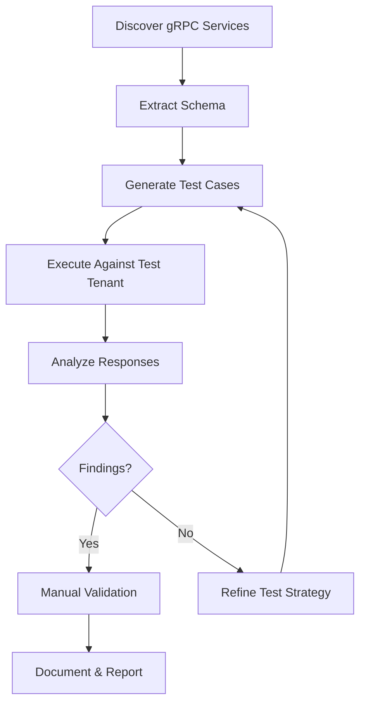
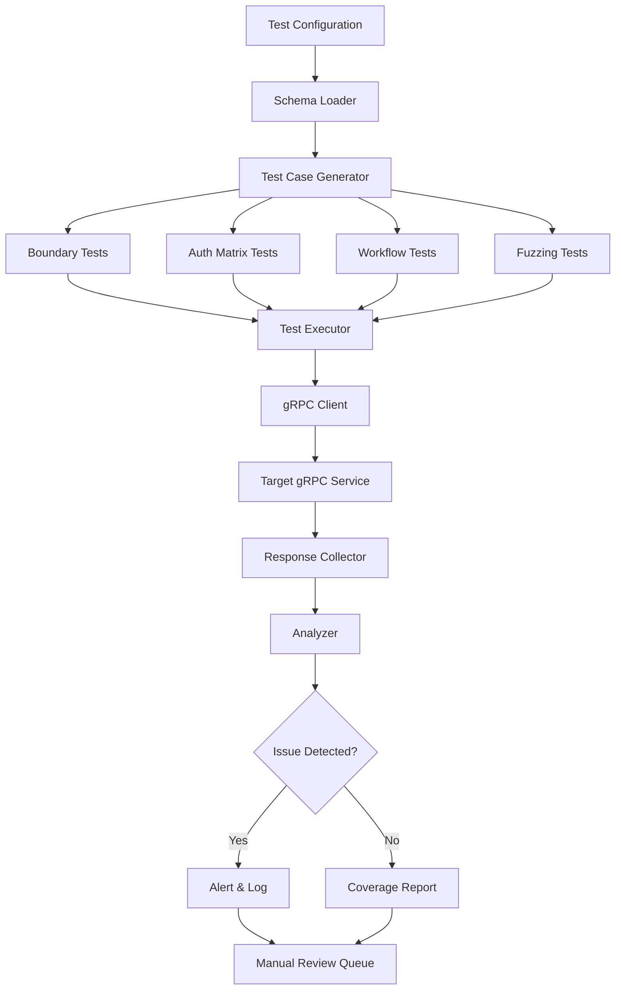

# gRPC Testing Automation

> **gRPC testing automation is about using the structured, schema-driven nature of Protocol Buffers to generate test cases, validate security controls, and detect service misbehavior at scale — while recognizing that business logic, authorization, and context-aware abuse still require manual reasoning.**

---

## 🧠 What Is It? (Beginner Explanation)

**gRPC** is a high-performance RPC (Remote Procedure Call) framework built by Google. Unlike REST APIs that use JSON over HTTP/1.1, gRPC:

- Uses **Protocol Buffers (protobuf)** for serialization
- Runs over **HTTP/2** for multiplexing and streaming
- Defines service contracts in `.proto` files
- Generates client and server code automatically

Think of it like this:

- **REST API** = like sending letters (JSON) through the mail (HTTP/1.1)
- **gRPC** = like making phone calls (binary protobuf) over fiber optic lines (HTTP/2)

### Why gRPC matters in API security testing

gRPC is increasingly common in:

- **Microservice communication** (service mesh environments like Istio, Linkerd)
- **Mobile apps** (efficient binary protocol, battery-friendly)
- **Real-time systems** (streaming support)
- **Internal APIs** (high performance, strong typing)
- **IoT and edge computing** (small message size)

For authorized security testers, gRPC creates unique challenges:

| Challenge | Why it matters |
|---|---|
| Binary protocol | Can't read or modify messages with standard HTTP tools |
| HTTP/2 multiplexing | Multiple requests on one connection complicates logging |
| Code generation | Clients are often tightly coupled to specific `.proto` versions |
| Streaming RPCs | Stateful conversations that traditional scanners can't model |
| Service mesh integration | Authentication, authorization, and routing may be handled by sidecars |
| Reflection API | Sometimes enabled in dev/staging, exposing all methods without documentation |

### What automation can and cannot do

✅ **Automation is good at:**

- Discovering methods via **gRPC reflection**
- Generating valid requests from **`.proto` schemas**
- Fuzzing field values with **type-aware mutations**
- Replaying captured traffic with **modifications**
- Testing authentication with **token rotation**
- Validating **error handling** and **input validation**
- Detecting **unintended method exposure**

❌ **Automation struggles with:**

- **Authorization context** — whether a user should access a specific tenant's data
- **Business logic flows** — multi-step workflows with state dependencies
- **Abuse patterns** — using legitimate methods in harmful ways
- **Lateral movement** — chaining gRPC services to reach unintended targets
- **Contextual parameter constraints** — knowing which user IDs, account IDs, or resource IDs are valid for testing

> **The automated parts shrink the testing space. The manual parts focus reasoning on high-value risks.**

---

## 🏗️ gRPC Security Testing Workflow



### Phase 1: Discovery

Before you can test, you need to know what methods exist.

**Common discovery techniques:**

| Technique | How it works | When to use |
|---|---|---|
| **gRPC Reflection API** | Server exposes live schema via `ServerReflection` | Dev/staging environments, misconfigured prod |
| **`.proto` files** | Obtain from documentation, Git repos, APK decompilation | When reflection is disabled |
| **Traffic capture** | Intercept and decode gRPC frames from app traffic | Reverse engineering mobile/desktop apps |
| **Service mesh observability** | Query mesh control plane for service catalog | Cloud-native environments with Istio/Linkerd |
| **Documentation scraping** | Extract method signatures from docs portals | Public or partner-facing gRPC APIs |

**Tool examples:**

```bash
# Check if reflection is enabled
grpcurl -plaintext api.example.com:50051 list

# List all services
grpcurl -plaintext api.example.com:50051 list

# Describe a specific service
grpcurl -plaintext api.example.com:50051 describe myapp.UserService

# Call a method interactively
grpcurl -plaintext -d '{"user_id": "123"}' \
  api.example.com:50051 myapp.UserService/GetUser
```

### Phase 2: Schema Extraction

Once you know services exist, extract their `.proto` definitions.

**From gRPC Reflection:**

```bash
# Save full descriptor
grpcurl -plaintext api.example.com:50051 describe myapp.UserService > user_service.txt

# Or use grpcui for interactive browsing
grpcui -plaintext api.example.com:50051
```

**From mobile apps (Android APK):**

```bash
# Decompile APK
apktool d app.apk -o app_src/

# Search for .proto files or embedded descriptors
find app_src/ -name "*.proto"
grep -r "FileDescriptorProto" app_src/
```

**From protobuf binary payloads:**

If you capture gRPC traffic but don't have the `.proto`:

- Use **protobuf-inspector** or **blackboxprotobuf** to reverse-engineer field types
- Correlate observed fields with likely message structures

### Phase 3: Generate Test Cases

With a `.proto` schema, you can automate test generation.

**Schema-driven test strategies:**

| Strategy | What it tests | Example |
|---|---|---|
| **Boundary value fuzzing** | Field min/max limits, overflow | `int32 user_id` → test -2147483648, 0, 2147483647 |
| **Type confusion** | Wrong types for fields | Send string where int expected |
| **Required field omission** | Missing mandatory fields | Omit `user_id` in GetUser request |
| **Enum fuzzing** | Invalid enum values | Send enum value 999 for UserRole |
| **Nested message fuzzing** | Deep object graphs | Deeply nested `repeated` fields |
| **Streaming abuse** | Rapid message flooding | Send 10,000 streaming messages |
| **Authorization matrix** | User A accessing User B's data | Test cross-user access with different auth tokens |

**Tool: grpc-fuzz (conceptual example)**

```python
# Generate test cases from .proto
from grpc_fuzz import ProtoFuzzer

fuzzer = ProtoFuzzer('user_service.proto')

# Generate 1000 fuzzed GetUser requests
test_cases = fuzzer.generate(
    service='myapp.UserService',
    method='GetUser',
    num_cases=1000,
    strategies=['boundary', 'type_confusion', 'omission']
)

for test in test_cases:
    response = client.GetUser(test.request)
    analyze_response(test, response)
```

### Phase 4: Execute Tests

**Authentication considerations:**

gRPC APIs typically authenticate via:

- **Metadata headers** (like HTTP headers): `authorization: Bearer <token>`
- **TLS client certificates** (mTLS)
- **Service mesh identity** (SPIFFE/SPIRE)

**Example with metadata:**

```python
import grpc

# Create channel with TLS
creds = grpc.ssl_channel_credentials()
channel = grpc.secure_channel('api.example.com:443', creds)

# Add authorization metadata
metadata = [('authorization', 'Bearer YOUR_TOKEN')]

# Call with auth
stub = UserServiceStub(channel)
response = stub.GetUser(
    GetUserRequest(user_id='123'),
    metadata=metadata
)
```

**Execution patterns:**

| Pattern | When to use | Risk to manage |
|---|---|---|
| **Sequential execution** | Stateful workflows (create → update → delete) | Test isolation, cleanup |
| **Parallel execution** | Large test suites, fuzzing campaigns | Rate limiting, service impact |
| **Streaming tests** | Server-streaming, client-streaming, bidirectional | Connection exhaustion |
| **Replay with mutation** | Captured production-like traffic | Avoid sensitive data exposure |

### Phase 5: Response Analysis

**What to look for in responses:**

| Signal | Security implication |
|---|---|
| **Status codes** | `PERMISSION_DENIED` vs `UNAUTHENTICATED` vs `NOT_FOUND` |
| **Error messages** | Stack traces, SQL errors, internal paths |
| **Response timing** | Timing attacks, enumeration signals |
| **Data leakage** | Extra fields in response (e.g., admin fields to non-admin) |
| **Unexpected success** | Request should have failed but didn't |
| **Server errors (INTERNAL)** | Unhandled exceptions, validation bypass |

**gRPC status codes map to security concerns:**

| gRPC Status | HTTP Equivalent | Security Concern |
|---|---|---|
| `UNAUTHENTICATED` | 401 | Missing or invalid credentials |
| `PERMISSION_DENIED` | 403 | Authenticated but not authorized |
| `NOT_FOUND` | 404 | Resource doesn't exist (or enumeration defense) |
| `INVALID_ARGUMENT` | 400 | Input validation working correctly |
| `INTERNAL` | 500 | Unhandled error, possible crash or exploit |
| `RESOURCE_EXHAUSTED` | 429 | Rate limiting active |

---

## 🛠️ Tools for gRPC Testing Automation

### Discovery & Interaction

| Tool | Purpose | Example use |
|---|---|---|
| **grpcurl** | CLI for gRPC like `curl` for REST | `grpcurl -plaintext host:port list` |
| **grpcui** | Web UI for interactive gRPC calls | Browse methods, build requests, inspect responses |
| **ghz** | gRPC load testing & benchmarking | Performance testing, rate limit validation |
| **Evans** | gRPC client REPL | Interactive exploration, manual testing |

### Traffic Capture & Analysis

| Tool | Purpose | Example use |
|---|---|---|
| **mitmproxy with http2** | Intercept gRPC traffic | Modify requests, analyze flows |
| **Wireshark** | Packet-level analysis | Decode HTTP/2 frames, extract protobuf |
| **proxyman / Charles** | macOS/Windows GUI proxies | Mobile app gRPC interception |
| **Envoy access logs** | Service mesh observability | Trace gRPC calls through mesh |

### Fuzzing & Automation

| Tool | Purpose | Example use |
|---|---|---|
| **grpc-fuzz** | Schema-driven fuzzing | Generate malformed requests from `.proto` |
| **boofuzz** | Protocol fuzzer | Stateful gRPC fuzzing campaigns |
| **Nuclei with gRPC templates** | Vulnerability scanning | Automated checks for known misconfigurations |
| **custom Python/Go scripts** | Tailored test logic | Authorization matrices, workflow testing |

### Reflection & Schema Analysis

| Tool | Purpose | Example use |
|---|---|---|
| **grpcurl describe** | Extract method signatures | `grpcurl -plaintext host:port describe Service.Method` |
| **protoc** | Compile `.proto` files | Generate client code for testing |
| **protobuf-inspector** | Reverse-engineer protobuf | Decode unknown binary messages |
| **blackboxprotobuf** | Burp Suite protobuf decoder | Modify protobuf in Burp Repeater |

---

## 🔍 Common gRPC Security Issues (Automation-Detectable)

### 1. Reflection API Exposed in Production

**What it is:**

The gRPC reflection API allows clients to query the server for available services and methods **without** needing `.proto` files.

**Security impact:**

- Attackers discover internal methods not meant for public use
- Enumerates API surface area
- Reveals method names that hint at functionality

**How to detect:**

```bash
# Check if reflection is enabled
grpcurl -plaintext target.com:50051 list

# If it returns services, reflection is on
```

**Automation approach:**

```python
import grpc
from grpc_reflection.v1alpha import reflection_pb2, reflection_pb2_grpc

def check_reflection(host, port):
    channel = grpc.insecure_channel(f'{host}:{port}')
    stub = reflection_pb2_grpc.ServerReflectionStub(channel)
    try:
        request = reflection_pb2.ServerReflectionRequest(list_services="")
        responses = stub.ServerReflectionInfo(iter([request]))
        for response in responses:
            if response.HasField('list_services_response'):
                return True, response.list_services_response.service
    except grpc.RpcError:
        return False, []
    return False, []

enabled, services = check_reflection('api.example.com', 50051)
if enabled:
    print(f"⚠️ Reflection enabled, found services: {services}")
```

**Mitigation:**

- Disable reflection in production
- Enable only in dev/staging environments
- Use authentication on reflection endpoint if needed

---

### 2. Missing Authentication

**What it is:**

gRPC methods callable without any credentials.

**Security impact:**

- Unauthorized access to data
- Ability to invoke privileged methods
- Service abuse (resource exhaustion)

**How to detect:**

```bash
# Try calling method without auth
grpcurl -plaintext -d '{"user_id": "123"}' \
  api.example.com:50051 myapp.UserService/GetUser

# If it succeeds without metadata, auth is missing
```

**Automation approach:**

```python
# Test matrix: method × auth state
test_cases = [
    {'method': 'GetUser', 'auth': None},
    {'method': 'GetUser', 'auth': 'valid_token'},
    {'method': 'DeleteUser', 'auth': None},
]

for test in test_cases:
    response = call_grpc_method(
        method=test['method'],
        auth=test['auth']
    )
    if test['auth'] is None and response.success:
        print(f"⚠️ {test['method']} allows unauthenticated access")
```

**Expected behavior:**

- Methods requiring auth should return `UNAUTHENTICATED` status
- Public methods (if any) should be clearly documented

---

### 3. Broken Authorization (BOLA/IDOR in gRPC)

**What it is:**

Authenticated user can access or modify resources belonging to other users.

**Security impact:**

- Data leakage
- Privilege escalation
- Account takeover

**How to detect:**

```python
# User A token
tokenA = "user_a_token"
# User B token
tokenB = "user_b_token"

# User A's resource ID
resourceA_id = "123"

# User B tries to access User A's resource
response = call_with_auth(
    method='GetUser',
    request={'user_id': resourceA_id},
    auth=tokenB
)

if response.success:
    print(f"⚠️ User B accessed User A's resource: BOLA detected")
```

**Automation approach: Authorization matrix**

| Actor | Resource | Expected | Actual | Result |
|---|---|---|---|---|
| User A | User A's data | Allow | Allow | ✅ Pass |
| User A | User B's data | Deny | Allow | ❌ **BOLA** |
| Admin | User A's data | Allow | Allow | ✅ Pass |
| Guest | User A's data | Deny | Deny | ✅ Pass |

**Mitigation:**

- Validate resource ownership on every request
- Use context-aware authorization (e.g., check if `user_id` in token matches `user_id` in request)
- Implement attribute-based access control (ABAC)

---

### 4. Excessive Error Information

**What it is:**

Error responses leak internal details (stack traces, SQL queries, file paths).

**Security impact:**

- Information disclosure aids further attacks
- Reveals technology stack
- Exposes database schema

**How to detect:**

```python
# Send malformed request
response = call_grpc(
    method='GetUser',
    request={'user_id': "'; DROP TABLE users; --"}
)

if 'SQLException' in response.error_message:
    print("⚠️ SQL error leaked in gRPC response")
if '/var/www/' in response.error_message:
    print("⚠️ File path leaked")
```

**Automation approach:**

- Inject payloads designed to trigger errors
- Parse error messages for sensitive patterns
- Compare dev vs prod error verbosity

**Mitigation:**

- Return generic error messages to clients
- Log detailed errors server-side only
- Use error codes instead of free-text messages

---

### 5. Lack of Rate Limiting

**What it is:**

gRPC service allows unlimited requests.

**Security impact:**

- Resource exhaustion (CPU, memory, database)
- Denial of service
- Brute force attacks (e.g., enumeration, credential stuffing)

**How to detect:**

```bash
# Send rapid requests
ghz --insecure \
  --proto user_service.proto \
  --call myapp.UserService/GetUser \
  -d '{"user_id": "123"}' \
  -n 10000 \
  -c 100 \
  api.example.com:50051
```

**Automation approach:**

```python
import time

start = time.time()
for i in range(1000):
    call_grpc_method('GetUser', {'user_id': '123'})
elapsed = time.time() - start

if elapsed < 10:  # 1000 requests in under 10 seconds
    print("⚠️ No rate limiting detected")
```

**Expected behavior:**

- After N requests in M seconds, server should return `RESOURCE_EXHAUSTED`
- Different limits for authenticated vs unauthenticated users

---

### 6. Insecure Transport (Plaintext gRPC)

**What it is:**

gRPC running over unencrypted HTTP/2.

**Security impact:**

- Credentials transmitted in clear text
- Message content exposed to network eavesdropping
- Man-in-the-middle attacks

**How to detect:**

```bash
# If this works, transport is insecure
grpcurl -plaintext api.example.com:50051 list
```

**Automation approach:**

```python
# Try both secure and insecure channels
import grpc

def check_transport_security(host, port):
    # Try plaintext
    try:
        channel = grpc.insecure_channel(f'{host}:{port}')
        stub = YourServiceStub(channel)
        stub.SomeMethod(Request(), timeout=5)
        return False  # Plaintext works
    except:
        pass
    
    # Try TLS
    try:
        creds = grpc.ssl_channel_credentials()
        channel = grpc.secure_channel(f'{host}:{port}', creds)
        stub = YourServiceStub(channel)
        stub.SomeMethod(Request(), timeout=5)
        return True  # TLS required
    except:
        pass
    
    return None  # Unreachable
```

**Mitigation:**

- Always use TLS in production (`grpc.ssl_channel_credentials()`)
- Consider mTLS for service-to-service communication
- Disable plaintext listeners

---

## 🧪 Advanced Automation Scenarios

### Scenario 1: Stateful Workflow Testing

**Challenge:**

Many gRPC services implement workflows:

1. `CreateOrder()` → returns `order_id`
2. `AddItem(order_id, item)` → modifies order
3. `Checkout(order_id)` → finalizes order
4. `CancelOrder(order_id)` → state transition

**Automation strategy:**

```python
class WorkflowTester:
    def test_order_workflow(self):
        # Step 1: Create order as User A
        order = self.create_order(user='A')
        
        # Step 2: Try to modify as User B (should fail)
        result = self.add_item(order_id=order.id, user='B', item='laptop')
        assert result.status == 'PERMISSION_DENIED', "BOLA in AddItem"
        
        # Step 3: Checkout as User A
        checkout = self.checkout(order_id=order.id, user='A')
        assert checkout.status == 'SUCCESS'
        
        # Step 4: Try to modify after checkout (should fail)
        result = self.add_item(order_id=order.id, user='A', item='mouse')
        assert result.status == 'FAILED_PRECONDITION', "State validation missing"
```

### Scenario 2: Streaming RPC Abuse

**Challenge:**

gRPC supports four types of RPCs:

1. **Unary:** Single request → single response
2. **Server streaming:** Single request → stream of responses
3. **Client streaming:** Stream of requests → single response
4. **Bidirectional streaming:** Stream ↔ stream

**Automation tests:**

```python
# Test 1: Stream flooding
def test_client_stream_flood():
    stub = ChatServiceStub(channel)
    
    def message_generator():
        for i in range(100000):  # Flood with messages
            yield ChatMessage(user='attacker', text=f'msg_{i}')
    
    response = stub.SendMessages(message_generator())
    # Check if server handles resource exhaustion

# Test 2: Stream timeout
def test_stream_timeout():
    stub = NotificationServiceStub(channel)
    
    # Open stream and hold it indefinitely
    responses = stub.SubscribeToNotifications(SubscribeRequest())
    time.sleep(3600)  # Hold for 1 hour
    # Check if server enforces stream timeout

# Test 3: Stream authorization
def test_stream_auth_revocation():
    stub = LiveDataStub(channel)
    
    # Start stream with valid token
    metadata = [('authorization', f'Bearer {valid_token}')]
    responses = stub.GetLiveData(Request(), metadata=metadata)
    
    # Revoke token server-side
    revoke_token(valid_token)
    
    # Check if stream is terminated
    try:
        next(responses)  # Should fail
    except grpc.RpcError as e:
        assert e.code() == grpc.StatusCode.UNAUTHENTICATED
```

### Scenario 3: Service Mesh Testing

**Challenge:**

In Kubernetes with Istio/Linkerd, gRPC security is often enforced by sidecar proxies:

- mTLS between services
- Policy-based authorization
- Request routing and retries

**Automation approach:**

```python
# Test 1: Bypass service mesh by calling pod directly
def test_mesh_bypass():
    # Normal call through mesh
    response1 = call_via_mesh('UserService/GetUser')
    
    # Direct call to pod IP (bypassing sidecar)
    response2 = call_direct_pod('10.1.2.3:50051', 'UserService/GetUser')
    
    if response2.success:
        print("⚠️ Service accessible outside mesh, bypassing mTLS")

# Test 2: Authorization policy validation
def test_istio_authz_policy():
    # As service A, call service B (should be allowed by policy)
    result = call_as_service('serviceA', 'serviceB', 'GetData')
    assert result.success
    
    # As service C, call service B (should be denied by policy)
    result = call_as_service('serviceC', 'serviceB', 'GetData')
    assert result.status == 'PERMISSION_DENIED'
```

### Scenario 4: Differential Testing

**Challenge:**

Detect behavior differences between:

- Different API versions
- Different deployment environments
- Different authentication contexts

**Automation approach:**

```python
# Compare v1 vs v2 API responses
def test_api_version_diff():
    request = GetUserRequest(user_id='123')
    
    response_v1 = v1_stub.GetUser(request)
    response_v2 = v2_stub.GetUser(request)
    
    diff = compare_responses(response_v1, response_v2)
    
    if 'ssn' in diff.removed_fields:
        print("✅ v2 removed sensitive field 'ssn'")
    
    if 'admin_notes' in diff.added_fields:
        print("⚠️ v2 added potentially sensitive field 'admin_notes'")

# Compare staging vs production behavior
def test_env_diff():
    request = DeleteUserRequest(user_id='123')
    
    staging_response = staging_stub.DeleteUser(request, metadata=user_token)
    prod_response = prod_stub.DeleteUser(request, metadata=user_token)
    
    if staging_response.success and not prod_response.success:
        print("✅ Prod has stricter controls than staging")
    elif prod_response.success and not staging_response.success:
        print("⚠️ Prod is more permissive than staging")
```

---

## 📊 Automation Framework Architecture



### Core Components

**1. Schema Loader**

```python
class SchemaLoader:
    """Load and parse .proto files"""
    
    def load_from_file(self, proto_path):
        """Load from .proto file"""
        pass
    
    def load_from_reflection(self, host, port):
        """Load from gRPC reflection API"""
        pass
    
    def get_services(self):
        """Return list of services"""
        pass
    
    def get_methods(self, service):
        """Return list of methods for service"""
        pass
    
    def get_message_schema(self, message_type):
        """Return field definitions for message"""
        pass
```

**2. Test Case Generator**

```python
class TestCaseGenerator:
    """Generate test cases from schema"""
    
    def generate_boundary_tests(self, method):
        """Min/max values for numeric fields"""
        pass
    
    def generate_auth_matrix(self, method, users):
        """Test all user combinations"""
        pass
    
    def generate_fuzz_cases(self, method, num_cases):
        """Random mutations"""
        pass
    
    def generate_workflow_tests(self, workflow_def):
        """Multi-step scenarios"""
        pass
```

**3. Test Executor**

```python
class TestExecutor:
    """Execute test cases against gRPC service"""
    
    def __init__(self, host, port, use_tls=True):
        if use_tls:
            creds = grpc.ssl_channel_credentials()
            self.channel = grpc.secure_channel(f'{host}:{port}', creds)
        else:
            self.channel = grpc.insecure_channel(f'{host}:{port}')
    
    def execute(self, test_case):
        """Run single test case"""
        try:
            response = self._call_method(
                service=test_case.service,
                method=test_case.method,
                request=test_case.request,
                metadata=test_case.metadata
            )
            return TestResult(
                test_case=test_case,
                response=response,
                status='success'
            )
        except grpc.RpcError as e:
            return TestResult(
                test_case=test_case,
                error=e,
                status='error',
                grpc_code=e.code()
            )
```

**4. Response Analyzer**

```python
class ResponseAnalyzer:
    """Analyze responses for security issues"""
    
    def analyze(self, test_result):
        findings = []
        
        # Check for information disclosure
        if self._has_stack_trace(test_result.error):
            findings.append(Finding(
                severity='MEDIUM',
                title='Stack trace in error response',
                description=test_result.error.details()
            ))
        
        # Check for authorization bypass
        if test_result.test_case.should_deny and test_result.status == 'success':
            findings.append(Finding(
                severity='HIGH',
                title='Authorization bypass',
                description=f"User {test_result.test_case.user} accessed {test_result.test_case.resource}"
            ))
        
        # Check for unexpected behavior
        if test_result.grpc_code == grpc.StatusCode.INTERNAL:
            findings.append(Finding(
                severity='MEDIUM',
                title='Unhandled server error',
                description='Method crashed with INTERNAL status'
            ))
        
        return findings
```

---

## 🎯 Continuous gRPC Security Testing

### CI/CD Integration

**Pipeline stage example:**

```yaml
# .gitlab-ci.yml
stages:
  - build
  - test
  - security-test
  - deploy

grpc-security-scan:
  stage: security-test
  image: grpc-security-tools:latest
  script:
    # Run automated gRPC security tests
    - python3 grpc_security_scanner.py --host staging.api.internal --port 50051
    - python3 analyze_results.py --output report.json
  artifacts:
    reports:
      junit: test-results.xml
    paths:
      - report.json
  only:
    - merge_requests
    - main
```

**What to test in CI:**

| Test Type | Frequency | Trigger |
|---|---|---|
| **Schema drift detection** | Every commit | Compare `.proto` changes |
| **Authentication regression** | Every merge request | Ensure auth still enforced |
| **Basic fuzzing** | Nightly | Catch input validation issues |
| **Authorization matrix** | Weekly | Test user permission boundaries |
| **Performance baseline** | Release candidates | Detect DoS-prone changes |

### Monitoring & Alerting

**Runtime security signals to monitor:**

```python
# Alert on suspicious gRPC activity
def monitor_grpc_logs():
    for log_entry in stream_grpc_logs():
        # Alert 1: High error rate
        if log_entry.error_rate > 0.1:  # 10% errors
            alert("High gRPC error rate detected")
        
        # Alert 2: Reflection API use in prod
        if log_entry.method == 'ServerReflection' and env == 'prod':
            alert("gRPC reflection called in production")
        
        # Alert 3: Unusual method access
        if log_entry.method in ['DeleteAllUsers', 'DisableAudit']:
            alert(f"Sensitive method called: {log_entry.method}")
        
        # Alert 4: Unauthenticated success
        if not log_entry.auth_metadata and log_entry.status == 'OK':
            alert("Unauthenticated gRPC call succeeded")
```

---

## ⚠️ Limitations of Automation

### What Automation Misses

| Security Issue | Why Automation Struggles |
|---|---|
| **Business logic flaws** | Requires understanding of what should vs shouldn't be allowed |
| **Race conditions** | Timing-sensitive, requires precise orchestration |
| **Context-aware authorization** | Needs knowledge of valid resource IDs per user |
| **Abuse of legitimate features** | Automated scanners don't understand harm from valid actions |
| **Lateral movement chains** | Requires mapping service dependencies and trust boundaries |

### Example: Business Logic Testing

**Automated test:**

```python
# This automated test passes, but misses the bug
def test_refund_api():
    # Create order
    order = create_order(amount=100)
    
    # Request refund
    refund = request_refund(order_id=order.id, amount=100)
    
    assert refund.status == 'SUCCESS'  # ✅ Test passes
```

**Manual reasoning required:**

```python
# What automation doesn't catch:
# Can I request the same refund multiple times?
refund1 = request_refund(order_id=order.id, amount=100)  # ✅ Works
refund2 = request_refund(order_id=order.id, amount=100)  # Should fail but doesn't
# Business logic bug: double refund possible

# Can I refund more than the order amount?
refund3 = request_refund(order_id=order.id, amount=10000)  # Should fail
# Another business logic bug if this succeeds
```

**Hybrid approach:**

1. **Automation** generates the baseline test cases
2. **Manual tester** adds edge cases based on business understanding
3. **Both** run in CI pipeline

---

## 🛡️ Defense: Hardening gRPC Services

### Checklist for Secure gRPC

| Control | Implementation |
|---|---|
| **Disable reflection in prod** | Remove `reflection.Register()` in production builds |
| **Enforce authentication** | All methods require valid credentials (mTLS or bearer tokens) |
| **Validate authorization** | Check resource ownership on every request |
| **Rate limiting** | Per-user and per-IP limits using middleware |
| **Input validation** | Validate all fields, not just in generated code |
| **Secure error handling** | Generic errors to clients, detailed logs server-side |
| **Use TLS** | `grpc.ssl_channel_credentials()` mandatory |
| **Token binding** | Consider DPoP or mTLS-bound tokens |
| **Audit logging** | Log all privileged method calls |
| **Schema validation** | Reject requests with unexpected fields |
| **Streaming limits** | Max message size, max stream duration, max open streams |

### Example: gRPC Server Hardening

```python
import grpc
from concurrent import futures

# Interceptor for authentication
class AuthInterceptor(grpc.ServerInterceptor):
    def intercept_service(self, continuation, handler_call_details):
        metadata = dict(handler_call_details.invocation_metadata)
        
        # Check for auth token
        if 'authorization' not in metadata:
            context = grpc.ServicerContext()
            context.abort(grpc.StatusCode.UNAUTHENTICATED, 'Missing auth token')
        
        token = metadata['authorization'].replace('Bearer ', '')
        
        # Validate token
        if not validate_token(token):
            context = grpc.ServicerContext()
            context.abort(grpc.StatusCode.UNAUTHENTICATED, 'Invalid token')
        
        return continuation(handler_call_details)

# Create secure server
def serve():
    # Load TLS certificates
    with open('server.key', 'rb') as f:
        private_key = f.read()
    with open('server.crt', 'rb') as f:
        certificate_chain = f.read()
    
    server_credentials = grpc.ssl_server_credentials(
        ((private_key, certificate_chain,),)
    )
    
    # Create server with interceptors
    server = grpc.server(
        futures.ThreadPoolExecutor(max_workers=10),
        interceptors=[AuthInterceptor()]
    )
    
    # Register service
    add_UserServiceServicer_to_server(UserServiceServicer(), server)
    
    # DO NOT register reflection in production
    # reflection.enable_server_reflection(SERVICE_NAMES, server)
    
    # Start with TLS
    server.add_secure_port('[::]:50051', server_credentials)
    server.start()
    server.wait_for_termination()
```

---

## 📚 Related Notes

- `../03-api-protocols/grpc-architecture.md` — gRPC fundamentals
- `../04-authentication/service-to-service-authentication.md` — mTLS and workload identity
- `../06-attack-surface/api-discovery.md` — Finding gRPC services
- `../07-core-vulnerabilities/broken-authentication.md` — Auth bypass patterns
- `../07-core-vulnerabilities/broken-object-level-authorization.md` — BOLA/IDOR in gRPC
- `automated-api-testing.md` — General API automation concepts
- `schema-based-testing.md` — Using schemas for test generation
- `api-fuzzing-concepts.md` — Fuzzing strategies
- `../14-defense/machine-identity-hardening.md` — Service-to-service security

---

## 🎓 Key Takeaways

1. **gRPC's binary nature and HTTP/2 transport require specialized tools** — standard HTTP proxies and scanners won't work
2. **The `.proto` schema is your testing blueprint** — it defines all methods, messages, and field types
3. **Reflection API is a double-edged sword** — useful for testing, dangerous in production
4. **Automation excels at input validation and auth checks** — but struggles with business logic and abuse scenarios
5. **Streaming RPCs introduce unique risks** — resource exhaustion, state management, long-lived connections
6. **Service mesh adds a security layer** — but direct pod access may bypass it
7. **Authorization is harder than authentication** — even with valid credentials, resource-level access control is critical
8. **Error messages leak information** — generic client errors, detailed server logs
9. **Rate limiting is essential** — both for DoS prevention and brute force mitigation
10. **Manual reasoning completes automation** — hybrid approach catches both obvious and subtle issues

---

**Next Steps:**

- Explore `automated-api-testing.md` for REST/GraphQL automation patterns
- Review `schema-based-testing.md` for OpenAPI-driven testing
- Study `../14-defense/machine-identity-hardening.md` for mTLS and SPIFFE/SPIRE
- Practice with `grpcurl`, `grpcui`, and `ghz` on a test gRPC service
