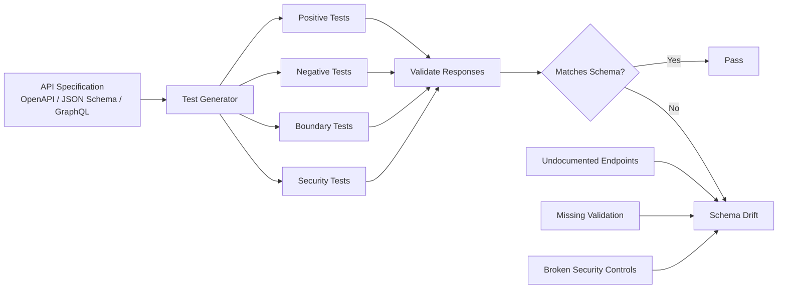
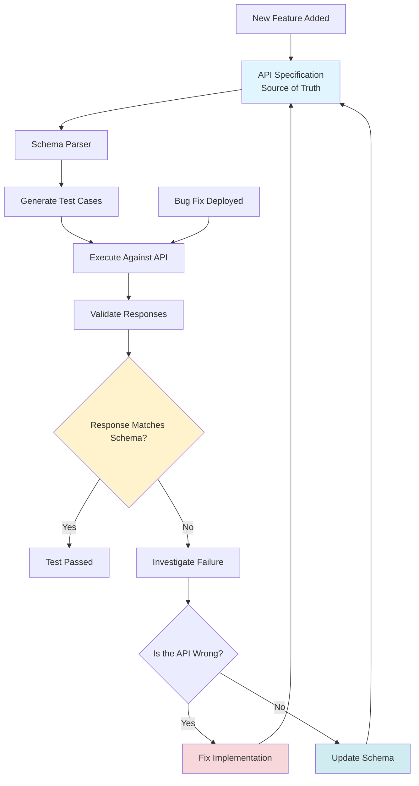
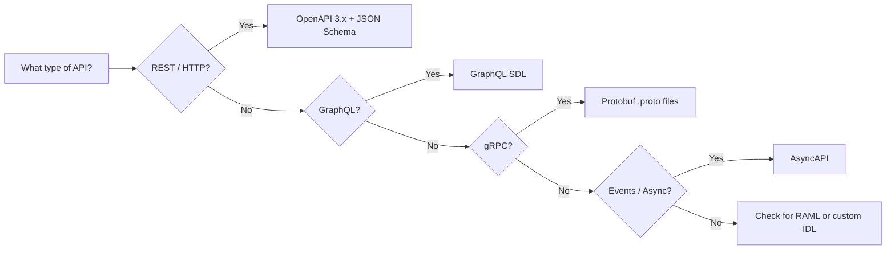
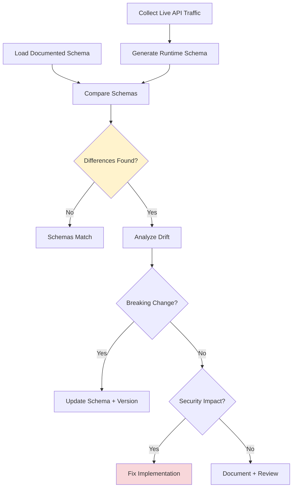
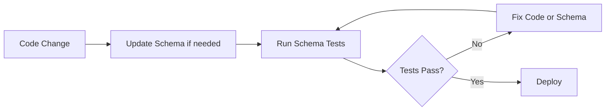

# Schema-Based Testing

> **Schema-based API testing uses structured API specifications (OpenAPI, JSON Schema, GraphQL schemas) to automatically generate test cases, validate responses, and detect deviations between documented contracts and actual behavior. In authorized testing, this transforms static documentation into a dynamic testing framework that scales with complexity.**

> **Authorized-use note:** Schema-based testing is about validating systems you are permitted to assess. The goal is to improve contract adherence, detect regressions, and identify defensive gaps — not to provide harmful exploitation guides.

---

## 🧠 What Is It? (Beginner Explanation)

Think of an API specification as a **contract** that says:

- which endpoints exist
- which methods they accept
- which parameters they require
- which response shapes they return
- which data types are valid
- which authentication is needed

**Schema-based testing** takes that contract and asks:

> "Does the API actually follow its own rules?"

Instead of manually writing hundreds of test cases, you feed the schema to automated tools that:

1. **Generate requests** covering different parameter combinations, edge cases, and invalid inputs
2. **Send traffic** to the API under test
3. **Validate responses** against the schema's declared structure and types
4. **Report violations** where behavior deviates from documentation

This approach scales naturally with API complexity and catches:

- **undocumented endpoints** that exist but are not in the spec
- **undocumented parameters** that change behavior
- **missing validation** where invalid input is accepted
- **schema drift** where responses no longer match documented models
- **security controls** that are documented but not enforced

From a defensive perspective, schema-based testing helps API teams keep their **specification, implementation, and security controls** in sync.

---

## 🎯 Why Schema-Based Testing Matters

### The Traditional Problem

Most API testing follows one of these patterns:

| Approach | Strength | Weakness |
|---|---|---|
| **Manual happy-path testing** | Confirms core flows work | Misses edge cases, negative tests, and undocumented behavior |
| **Exploratory fuzzing** | Finds unexpected issues | Noisy, hard to reproduce, lacks context, may trigger false alarms |
| **Static code review** | Identifies patterns and known vulnerabilities | Misses runtime logic issues, schema drift, integration problems |
| **Unit/integration tests** | Fast, focused on code paths | Usually test what devs expect, not what the contract promises |

### What Schema-Based Testing Adds

Schema-based testing bridges the gap:



In OWASP API Security terms, this approach helps detect:

- **API1: Broken Object Level Authorization** — schema can define expected ID formats and ownership rules
- **API2: Broken Authentication** — schema declares which operations require authentication
- **API3: Broken Object Property Level Authorization** — schema defines which fields should appear in responses
- **API4: Unrestricted Resource Access** — schema defines pagination, limits, filters
- **API5: Broken Function Level Authorization** — schema tags admin/privileged operations
- **API8: Security Misconfiguration** — schema defines required headers, content types, validation rules
- **API9: Improper Inventory Management** — schema drift reveals undocumented changes

---

## 📊 Schema-Based Testing Mental Model

### The Feedback Loop



The core insight:

> **The schema is both the testing blueprint and the enforcement mechanism. Keeping schema and implementation in sync is a continuous security and quality practice.**

---

## 🏗️ Core Schema Sources

| Schema Type | Common Use | What It Defines | Example Tools | Defensive Value |
|---|---|---|---|---|
| **OpenAPI 3.x / Swagger** | REST APIs | Paths, methods, parameters, request/response schemas, auth, servers | Schemathesis, Dredd, Portman, Postman, REST Assured | Validates REST contract adherence, detects undocumented endpoints, checks auth requirements |
| **JSON Schema** | Request/response validation | Data types, required fields, formats, patterns, enums, ranges | ajv, check-jsonschema, jsonschema (Python), Hypothesis | Enforces input validation rules, detects over-permissive acceptance |
| **GraphQL Schema (SDL)** | GraphQL APIs | Types, queries, mutations, subscriptions, arguments, directives | EasyGraphQL, graphql-inspector, Escape GraphQL fuzzer | Detects introspection exposure, validates depth limits, checks field-level auth |
| **Protocol Buffers (Protobuf)** | gRPC APIs | Message types, services, RPC methods | grpc\_cli, ghz, buf | Validates gRPC contract, tests streaming behavior, detects missing field validation |
| **AsyncAPI** | Event-driven APIs | Channels, messages, payloads, bindings | AsyncAPI tools, AMQP validators | Validates event contracts, message structure, and pub/sub policies |
| **RAML / API Blueprint** | Legacy REST specs | Endpoints, types, examples | Dredd, abao | Still used in some ecosystems; same validation goals as OpenAPI |

### Which Schema to Use?



For the rest of this guide, we will focus on **OpenAPI + JSON Schema**, since they are the most widely adopted in modern REST API ecosystems.

---

## 🔧 Schema-Based Testing Workflow

### Step 1: Obtain or Generate the Schema

| Scenario | How to get the schema | Quality considerations |
|---|---|---|
| **Team provides OpenAPI spec** | Best case — request the latest version | Verify it matches the deployed API version |
| **Spec is served at runtime** | `/openapi.json`, `/swagger.json`, `/api-docs` | May be stale or incomplete; compare with docs |
| **Generate from code annotations** | Frameworks like FastAPI, Swagger/Springdoc, NestJS | Usually accurate but may miss runtime behavior or middleware |
| **Reverse-engineer from traffic** | Tools like Akita, Optic, Swagger Inspector | Useful for legacy systems; requires clean baseline traffic |
| **No spec available** | Start with JSON Schema for key endpoints | Document as you test; push to formalize later |

**Best practice:**

```bash
# Validate the schema itself before testing
openapi-spec-validator openapi.yaml
# or
swagger-cli validate openapi.yaml
# or for JSON Schema
check-jsonschema --schemafile schema.json data.json
```

If the schema itself has errors, testing results will be misleading.

---

### Step 2: Choose Your Testing Approach

Schema-based testing can be run in different modes:

| Mode | What it does | When to use | Tools |
|---|---|---|---|
| **Contract testing** | Verifies API responses match declared schemas | CI/CD, regression testing, post-deployment validation | Dredd, Portman, Postman, Pact |
| **Property-based fuzzing** | Generates hundreds of valid and invalid inputs based on schema rules | Security testing, edge-case discovery, input validation review | Schemathesis, Hypothesis, QuickCheck integrations |
| **Negative testing** | Sends schema-violating requests to confirm rejection | Validates error handling and input filtering | Schemathesis, custom scripts with ajv/jsonschema |
| **Stateful testing** | Chains operations based on schema links (e.g., create → read → update → delete) | Workflow testing, state-machine coverage | Schemathesis stateful mode, custom state engines |
| **Diff-based testing** | Compares two schema versions and tests changes | Breaking change detection, migration testing | openapi-diff, swagger-diff, oasdiff |

**Recommended starting sequence for authorized testing:**

1. **Contract validation** — confirm happy-path responses match the schema
2. **Negative testing** — confirm invalid inputs are rejected
3. **Stateful fuzzing** — test sequences and side effects
4. **Schema drift detection** — compare live behavior against spec

---

### Step 3: Generate and Execute Tests

#### Example 1: Using Schemathesis (Python)

Schemathesis is a powerful schema-based API testing tool that supports OpenAPI and GraphQL.

**Install:**

```bash
pip install schemathesis
```

**Basic usage:**

```bash
# Test all endpoints defined in OpenAPI spec
schemathesis run https://api.example.com/openapi.json \
  --base-url https://api.example.com \
  --hypothesis-max-examples=100 \
  --auth bearer:$TOKEN
```

**What it does:**

- Parses the OpenAPI spec
- Generates hypothesis-driven test cases covering edge cases, boundary values, and random inputs
- Sends requests to the API
- Validates responses against schema definitions
- Reports failures

**Advanced filtering:**

```bash
# Test only specific operations
schemathesis run openapi.yaml \
  --endpoint "/v1/users" \
  --method POST \
  --checks all \
  --hypothesis-max-examples=500
```

**Available checks:**

| Check | What it validates |
|---|---|
| `not_a_server_error` | API does not return 5xx |
| `status_code_conformance` | Status codes match schema |
| `content_type_conformance` | Response content-type matches schema |
| `response_schema_conformance` | Response body matches JSON Schema |
| `response_headers_conformance` | Headers match schema |
| `negative_data_rejection` | Invalid inputs are rejected with 4xx |

**Stateful testing example:**

```python
import schemathesis

schema = schemathesis.from_uri("https://api.example.com/openapi.json")

@schema.parametrize()
@schema.as_state_machine()
class APIWorkflow:
    def validate_response(self, response, case):
        assert response.status_code < 500
        case.validate_response(response)

APIWorkflow.run()
```

---

#### Example 2: Using Dredd (Node.js)

Dredd is a contract testing tool that validates API implementations against OpenAPI or API Blueprint specs.

**Install:**

```bash
npm install -g dredd
```

**Basic usage:**

```bash
# Test API against OpenAPI spec
dredd openapi.yaml https://api.example.com \
  --header "Authorization: Bearer $TOKEN"
```

**Customize with hooks:**

```javascript
// hooks.js
const hooks = require('hooks');

hooks.before('/v1/users > GET', function(transaction) {
  transaction.request.headers['Authorization'] = 'Bearer valid-token';
});

hooks.after('/v1/users > POST', function(transaction) {
  console.log('User created:', transaction.real.body);
});
```

Run with hooks:

```bash
dredd openapi.yaml https://api.example.com --hookfiles=hooks.js
```

---

#### Example 3: Using Postman with OpenAPI

Postman can import OpenAPI specs and generate collections.

**Workflow:**

1. Import OpenAPI spec → Postman generates requests
2. Add test scripts to validate responses
3. Run via Collection Runner or Newman

**Example test script:**

```javascript
pm.test("Response matches schema", function() {
  const schema = {
    type: "object",
    required: ["id", "email", "role"],
    properties: {
      id: { type: "string", format: "uuid" },
      email: { type: "string", format: "email" },
      role: { type: "string", enum: ["user", "admin"] }
    }
  };
  pm.response.to.have.jsonSchema(schema);
});

pm.test("Status code is 200", function() {
  pm.response.to.have.status(200);
});
```

**Run via CLI:**

```bash
newman run collection.json -e environment.json --reporters cli,json
```

---

#### Example 4: Custom Python Script with JSON Schema Validation

For targeted testing or integration into CI/CD:

```python
import requests
import jsonschema
from jsonschema import validate

# Define expected response schema
user_schema = {
    "type": "object",
    "required": ["id", "email", "created_at"],
    "properties": {
        "id": {"type": "string", "pattern": "^[0-9a-f]{8}-[0-9a-f]{4}-[0-9a-f]{4}-[0-9a-f]{4}-[0-9a-f]{12}$"},
        "email": {"type": "string", "format": "email"},
        "role": {"type": "string", "enum": ["user", "admin", "moderator"]},
        "created_at": {"type": "string", "format": "date-time"}
    },
    "additionalProperties": False
}

# Make API request
response = requests.get(
    "https://api.example.com/v1/users/123",
    headers={"Authorization": f"Bearer {token}"}
)

# Validate response
assert response.status_code == 200, f"Expected 200, got {response.status_code}"

try:
    validate(instance=response.json(), schema=user_schema)
    print("✓ Response matches schema")
except jsonschema.exceptions.ValidationError as e:
    print(f"✗ Schema violation: {e.message}")
    print(f"  Path: {' -> '.join(str(p) for p in e.path)}")
    raise
```

**Key validation points:**

- Response structure matches declared schema
- Required fields are present
- Data types are correct
- Enums are enforced
- No unexpected additional properties

---

### Step 4: Validate Negative Cases

Schemas define **valid** inputs. Security testing requires also testing **invalid** inputs.

#### Common Negative Test Cases

| Test Type | What to send | Expected behavior | Common failure |
|---|---|---|---|
| **Missing required fields** | Omit required parameters | 400 Bad Request with clear error | 200 OK or 500 error with stack trace |
| **Wrong data types** | Send string where integer expected | 400 Bad Request | Coercion or silent failure |
| **Out-of-range values** | Exceed min/max, length limits | 400 or 422 with validation error | Accepted or causes crash |
| **Invalid formats** | Bad email, UUID, date formats | 400 Bad Request | Stored as-is or triggers injection |
| **Extra fields** | Add undocumented parameters | Ignored or 400 | Accepted and processed (mass assignment) |
| **Wrong content-type** | Send JSON with `text/plain` header | 415 Unsupported Media Type | Parsed anyway |
| **Missing authentication** | Omit auth header | 401 Unauthorized | 200 OK (auth bypass) |
| **Boundary values** | Min/max integers, empty arrays, null | Handled gracefully | Crash, injection, logic error |

**Schemathesis example:**

```bash
schemathesis run openapi.yaml \
  --checks negative_data_rejection \
  --hypothesis-seed=42 \
  --workers=4
```

**Custom Python example:**

```python
# Test missing required field
response = requests.post(
    "https://api.example.com/v1/users",
    json={"role": "admin"},  # Missing required "email"
    headers={"Authorization": f"Bearer {token}"}
)

assert response.status_code == 400, "Should reject missing required field"
assert "email" in response.json().get("message", ""), "Error should mention missing field"
```

---

### Step 5: Test Schema-Driven Security Controls

Schemas often declare security requirements. Validate that they are enforced.

#### Security Metadata in OpenAPI

```yaml
openapi: 3.1.0
paths:
  /v1/users:
    get:
      summary: List users
      security:
        - bearerAuth: []
      parameters:
        - name: limit
          in: query
          schema:
            type: integer
            minimum: 1
            maximum: 100
      responses:
        '200':
          description: Success
        '401':
          description: Unauthorized
        '403':
          description: Forbidden

  /admin/settings:
    post:
      summary: Update admin settings
      security:
        - bearerAuth: ['admin:write']
      requestBody:
        required: true
        content:
          application/json:
            schema:
              $ref: '#/components/schemas/AdminSettings'
```

#### What to Test

| Declared Control | Test Case | Expected Outcome | Common Failure |
|---|---|---|---|
| `security: [bearerAuth]` | Send request without token | 401 Unauthorized | 200 OK |
| Scope requirement `admin:write` | Send token with `user:read` | 403 Forbidden | 200 OK (privilege escalation) |
| `minimum: 1, maximum: 100` | Send `limit=999` | 400 Bad Request | Accepted, triggers resource exhaustion |
| `required: true` | Omit request body | 400 Bad Request | 500 error or accepted |
| `additionalProperties: false` | Send extra fields | 400 or ignored | Accepted (mass assignment risk) |
| `format: email` | Send `user@` | 400 Bad Request | Stored without validation |
| `readOnly: true` | Include field in write request | Ignored or rejected | Accepted, allows unauthorized writes |

**Test example:**

```python
# Test that admin-only endpoint rejects user token
user_token = get_token(role="user")
response = requests.post(
    "https://api.example.com/admin/settings",
    json={"maintenance_mode": True},
    headers={"Authorization": f"Bearer {user_token}"}
)

assert response.status_code == 403, "User token should not access admin endpoint"
```

---

## 🔍 Detecting Schema Drift

**Schema drift** occurs when the API implementation changes but the schema is not updated.

### Common Drift Scenarios

| Drift Type | What Happens | Risk |
|---|---|---|
| **Undocumented endpoint** | `/v2/beta/feature` exists but not in spec | Untested code path, shadow functionality |
| **Missing parameter** | API accepts `?debug=true` not in schema | Hidden behavior, potential bypass |
| **Changed response structure** | API returns `user_id` instead of documented `id` | Client breakage, integration failure |
| **Removed security requirement** | Endpoint documented as requiring auth but works without | Authentication bypass |
| **Added sensitive field** | API response now includes `ssn` field | Data exposure |

### Detection Workflow



### Tools for Drift Detection

| Tool | Method | Output |
|---|---|---|
| **Optic** | Compares traffic to OpenAPI spec | Highlights undocumented changes |
| **Akita** | Learns API schema from traffic | Generates spec from observed behavior |
| **openapi-diff** | Diffs two OpenAPI files | Breaking vs non-breaking changes |
| **Schemathesis** | Validates live responses against schema | Reports schema violations |
| **Custom scripts** | Parse traffic logs + compare to spec | Flexible, integrates with CI/CD |

**Example with openapi-diff:**

```bash
npm install -g openapi-diff

openapi-diff \
  old-spec.yaml \
  new-spec.yaml \
  --format markdown > diff-report.md
```

**Example output:**

```markdown
## Breaking Changes
- Removed endpoint: `DELETE /v1/users/{id}`
- Changed response type: `/v1/products` now returns array instead of object
- Removed required parameter: `email` in `POST /v1/signup`

## Non-Breaking Changes
- Added optional parameter: `sort` in `GET /v1/users`
- New endpoint: `GET /v1/health`
```

---

## 🛡️ Schema-Based Security Testing Checklist

Use schemas to systematically test these security dimensions:

### Authentication and Authorization

- [ ] All endpoints marked `security: [...]` require auth
- [ ] Endpoints without security declarations are intentionally public
- [ ] Required scopes or roles are enforced
- [ ] Tokens with expired/invalid claims are rejected
- [ ] Admin/privileged operations require correct permissions

### Input Validation

- [ ] Required fields are enforced
- [ ] Data types are validated
- [ ] String formats (email, UUID, date) are checked
- [ ] Numeric ranges (min, max, multipleOf) are enforced
- [ ] Enum values are restricted
- [ ] Array length limits are respected
- [ ] Additional properties are rejected when `additionalProperties: false`
- [ ] Null values are handled per schema rules

### Response Validation

- [ ] Responses match declared schemas
- [ ] Status codes match documented responses
- [ ] Content-Type headers match schema
- [ ] Sensitive fields are only present when authorized
- [ ] `readOnly` fields are not writable
- [ ] `writeOnly` fields are not readable
- [ ] Error responses do not leak sensitive data

### Rate Limiting and Resource Access

- [ ] Pagination limits are enforced
- [ ] Query filters work as documented
- [ ] Sorting and field selection are validated
- [ ] Batch operations respect size limits
- [ ] File upload size limits are enforced

### Deprecated and Legacy Paths

- [ ] Deprecated endpoints are marked and monitored
- [ ] Old API versions follow declared support policy
- [ ] Sunset headers are present where documented
- [ ] Migration paths to new versions are clear

---

## 🧪 Real-World Schema Testing Scenarios

### Scenario 1: Testing API Versioning

**Goal:** Validate that v1 and v2 of an API follow their respective schemas.

```bash
# Test v1
schemathesis run openapi-v1.yaml \
  --base-url https://api.example.com/v1 \
  --checks all

# Test v2
schemathesis run openapi-v2.yaml \
  --base-url https://api.example.com/v2 \
  --checks all

# Compare schemas
openapi-diff openapi-v1.yaml openapi-v2.yaml
```

**What to look for:**

- Breaking changes not reflected in version bump
- V1 accepting v2-only parameters
- V2 returning v1-formatted responses

---

### Scenario 2: Validating GraphQL Schema Enforcement

**Goal:** Confirm GraphQL API respects depth, complexity, and type constraints.

```python
import requests

query = """
query {
  user(id: "123") {
    id
    email
    posts {
      id
      comments {
        id
        author {
          posts {
            comments {
              # Deep nesting
            }
          }
        }
      }
    }
  }
}
"""

response = requests.post(
    "https://api.example.com/graphql",
    json={"query": query},
    headers={"Authorization": f"Bearer {token}"}
)

# Should reject if depth limit is configured
assert response.status_code == 400 or "depth" in response.json().get("errors", [{}])[0].get("message", "")
```

**Tools:**

- `EasyGraphQL Tester`
- `graphql-inspector`
- `Escape GraphQL Fuzzer`

---

### Scenario 3: Testing Mass Assignment Protection

**Schema declares certain fields as `readOnly`:**

```yaml
components:
  schemas:
    User:
      type: object
      properties:
        id:
          type: string
          readOnly: true
        email:
          type: string
        role:
          type: string
          readOnly: true
        name:
          type: string
```

**Test:**

```python
# Attempt to modify readOnly fields
response = requests.put(
    "https://api.example.com/v1/users/123",
    json={
        "id": "999",          # readOnly
        "role": "admin",      # readOnly
        "name": "Updated"     # Allowed
    },
    headers={"Authorization": f"Bearer {token}"}
)

assert response.status_code in [200, 204]

# Verify readOnly fields were not changed
user = requests.get(
    "https://api.example.com/v1/users/123",
    headers={"Authorization": f"Bearer {token}"}
).json()

assert user["id"] == "123", "ID should not have changed"
assert user["role"] != "admin", "Role should not have changed"
assert user["name"] == "Updated", "Name should have updated"
```

---

### Scenario 4: Continuous Schema Validation in CI/CD

**Integrate schema testing into deployment pipeline:**

```yaml
# .github/workflows/api-schema-tests.yml
name: API Schema Tests

on:
  push:
    branches: [main]
  pull_request:

jobs:
  schema-validation:
    runs-on: ubuntu-latest
    steps:
      - uses: actions/checkout@v3
      
      - name: Validate OpenAPI spec
        run: |
          npm install -g @apidevtools/swagger-cli
          swagger-cli validate openapi.yaml
      
      - name: Run schema-based tests
        run: |
          pip install schemathesis
          schemathesis run openapi.yaml \
            --base-url https://staging.example.com \
            --checks all \
            --hypothesis-max-examples=200 \
            --auth bearer:${{ secrets.API_TOKEN }}
      
      - name: Check for schema drift
        run: |
          npm install -g openapi-diff
          openapi-diff main-spec.yaml openapi.yaml --format markdown
```

---

## 🔗 Schema-Based Testing Tools Comparison

| Tool | Language | Schema Support | Strengths | Best For | License |
|---|---|---|---|---|---|
| **Schemathesis** | Python | OpenAPI 2/3, GraphQL | Hypothesis-driven fuzzing, stateful testing, CLI + library | Property-based security testing, fuzzing | MIT |
| **Dredd** | Node.js | OpenAPI, API Blueprint | Contract testing, hooks system, simple setup | CI/CD contract validation | MIT |
| **Portman** | Node.js | OpenAPI → Postman | Generates Postman tests from OpenAPI | Teams using Postman | Apache 2.0 |
| **REST Assured** | Java | OpenAPI via plugins | Java ecosystem integration, BDD style | Java/Kotlin projects, Spring Boot APIs | Apache 2.0 |
| **Pact** | Multi-language | Consumer-driven contracts | Provider/consumer contract testing | Microservices, distributed teams | MIT |
| **Postman** | JavaScript | OpenAPI, GraphQL | User-friendly, collection runner, Newman CLI | Manual and automated testing, collaboration | Proprietary |
| **Swagger Inspector** | SaaS | OpenAPI | Records traffic, generates specs | Reverse-engineering, quick testing | Proprietary |
| **Optic** | Node.js | OpenAPI | Live traffic diffing, CI/CD integration | Drift detection, API governance | MIT |
| **Akita** | SaaS/CLI | Learns from traffic | Auto-generates specs, detects drift | Legacy APIs, shadow endpoints | Proprietary |
| **check-jsonschema** | Python | JSON Schema | Fast standalone validation | Schema validation in scripts | MIT |
| **ajv** | JavaScript | JSON Schema | Fast, widely used, plugin ecosystem | Node.js validation | MIT |

---

## 📚 Best Practices for Schema-Based Testing

### 1. Treat the Schema as a Contract

**Anti-pattern:**

> "We'll update the spec later after the feature ships."

**Better:**

> "Schema changes are reviewed, versioned, and deployed alongside code."

**Why:**

- Schema drift creates blind spots
- Out-of-date specs mislead testers, clients, and security reviewers
- Breaking changes are harder to detect retroactively

---

### 2. Validate the Schema Itself First

Before testing the API, validate the schema:

```bash
# OpenAPI validation
swagger-cli validate openapi.yaml

# JSON Schema validation
check-jsonschema --check-metaschema schema.json

# GraphQL schema validation
graphql-schema-linter schema.graphql
```

Invalid schemas produce invalid test results.

---

### 3. Test Both Positive and Negative Cases

| Positive Testing | Negative Testing |
|---|---|
| Valid inputs produce expected responses | Invalid inputs are rejected |
| Required fields are present | Required fields can't be omitted |
| Types match schema | Wrong types are caught |
| Auth succeeds with valid token | Auth fails without token |

Tools like Schemathesis automatically generate both.

---

### 4. Use Schema Testing to Catch Regressions

**Workflow:**



Schema-based tests act as a regression safety net.

---

### 5. Combine Schema Testing with Other Approaches

| Approach | What It Adds |
|---|---|
| **Unit tests** | Test internal logic |
| **Integration tests** | Test service interactions |
| **Schema-based tests** | Test contract adherence |
| **Manual exploratory testing** | Test business logic, UX flows |
| **Security-focused fuzzing** | Test injection, overflow, encoding edge cases |

No single approach is sufficient. Schema-based testing complements, not replaces.

---

### 6. Monitor Schema Drift in Production

**Continuous validation:**

```bash
# Periodically compare live API to spec
curl https://api.example.com/openapi.json > live-spec.json
openapi-diff canonical-spec.yaml live-spec.json
```

**Drift signals:**

- New endpoints not in spec → shadow functionality
- Missing endpoints that should exist → incomplete deployment
- Changed response shapes → breaking changes

---

### 7. Secure Schema Exposure

**Public APIs:**

- Exposing OpenAPI specs publicly is common and useful
- Ensure no internal endpoints, secrets, or environment details leak

**Internal APIs:**

- Consider access control on `/openapi.json` or `/swagger.json`
- Serve sanitized public specs vs full internal specs

**GraphQL:**

- Disable introspection in production if not needed
- Alternatively, restrict introspection to authenticated users

---

## ⚠️ Common Pitfalls

| Pitfall | Why It Happens | How to Avoid |
|---|---|---|
| **Schema says required, API doesn't enforce** | Missing validation layer | Test negative cases, enforce validation at API gateway or app layer |
| **Tests pass but security controls fail** | Schema describes happy path, not security | Explicitly test auth requirements, scopes, rate limits |
| **Schema drift goes unnoticed** | No automated comparison | Integrate schema diff checks into CI/CD |
| **False sense of security** | Passing schema tests ≠ secure API | Combine with DAST, code review, threat modeling |
| **Over-reliance on auto-generated tests** | Generated tests may miss business logic edge cases | Supplement with manual security test cases |
| **Ignoring deprecated endpoints** | Old code paths still deployed | Test deprecated endpoints, enforce sunset timelines |

---

## 🎓 Learning Path

### Beginner

1. Validate a simple OpenAPI spec with `swagger-cli`
2. Run Dredd against a local API
3. Write a JSON Schema and validate a response with `ajv` or `check-jsonschema`

### Intermediate

1. Use Schemathesis to fuzz a REST API with property-based testing
2. Integrate schema tests into CI/CD pipeline
3. Compare two OpenAPI versions with `openapi-diff`
4. Test GraphQL schema depth and complexity limits

### Advanced

1. Implement stateful schema-based testing workflows
2. Build custom schema validators for internal IDLs
3. Detect schema drift from production traffic with Optic or Akita
4. Contribute security-focused test strategies to schema-based testing tools

---

## 🔗 References and Further Reading

### Standards and Specifications

- **OpenAPI Specification** — https://spec.openapis.org/oas/latest.html
- **JSON Schema** — https://json-schema.org/
- **GraphQL Schema Language** — https://graphql.org/learn/schema/
- **Protocol Buffers** — https://protobuf.dev/
- **AsyncAPI** — https://www.asyncapi.com/

### OWASP Resources

- **OWASP API Security Top 10** — https://owasp.org/API-Security/
- **OWASP API9: Improper Inventory Management** — Highlights the importance of schema accuracy
- **OWASP Testing Guide: API Testing** — https://owasp.org/www-project-web-security-testing-guide/

### Tools

- **Schemathesis** — https://github.com/schemathesis/schemathesis
- **Dredd** — https://dredd.org/
- **Postman** — https://www.postman.com/
- **Optic** — https://www.useoptic.com/
- **Akita Software** — https://www.akitasoftware.com/
- **openapi-diff** — https://github.com/OpenAPITools/openapi-diff
- **Pact** — https://pact.io/
- **REST Assured** — https://rest-assured.io/

### Research and Articles

- Zalando API Guidelines — Schema-first design principles
- Microsoft API Design Guidelines — Contract-based testing patterns
- "Contract Testing" by Martin Fowler — Conceptual foundation for schema-based validation
- "Property-Based Testing" — Hypothesis-driven fuzzing approach used by Schemathesis

---

## 🧭 Summary

Schema-based testing transforms API specifications from documentation artifacts into **executable test contracts**.

**Key takeaways:**

1. **Automate what the schema already knows** — paths, types, required fields, auth requirements
2. **Detect drift early** — continuous validation prevents undocumented changes from becoming vulnerabilities
3. **Scale testing with complexity** — as APIs grow, manual testing becomes infeasible; schema-based testing scales naturally
4. **Combine with other security practices** — schema testing complements, but does not replace, fuzzing, code review, and threat modeling
5. **Keep schema and implementation in sync** — drift is a governance and security risk

Schema-based testing is not a silver bullet, but it is a **force multiplier** for API security and quality assurance. When integrated into CI/CD, it helps teams **ship faster without sacrificing contract integrity or defensive controls**.

**Next steps:**

- Validate your API's schema
- Run contract tests in your CI/CD pipeline
- Set up schema drift detection
- Combine with exploratory security testing and threat modeling

**The schema is your blueprint. Test it. Trust it. Keep it true.**
