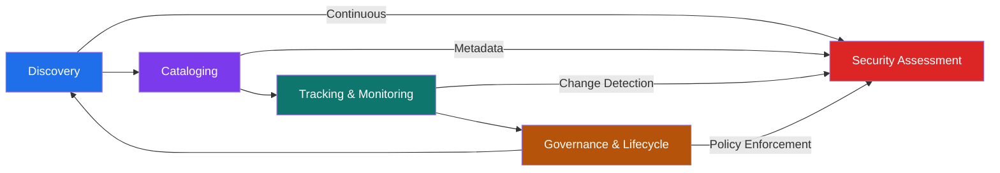
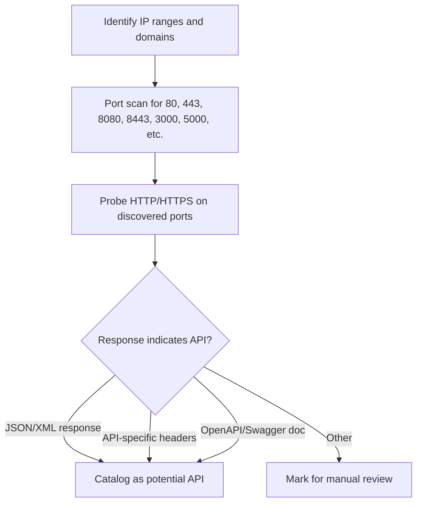
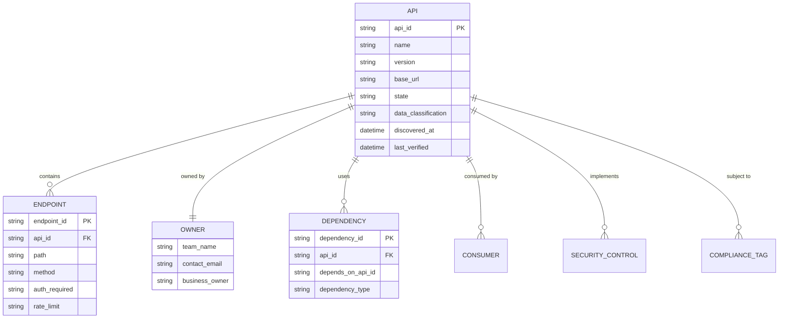
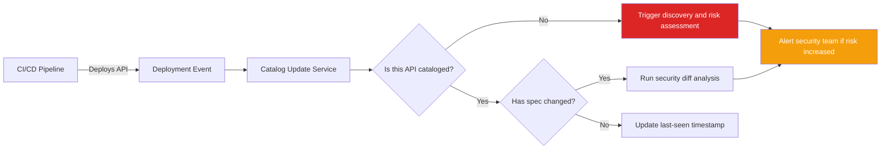
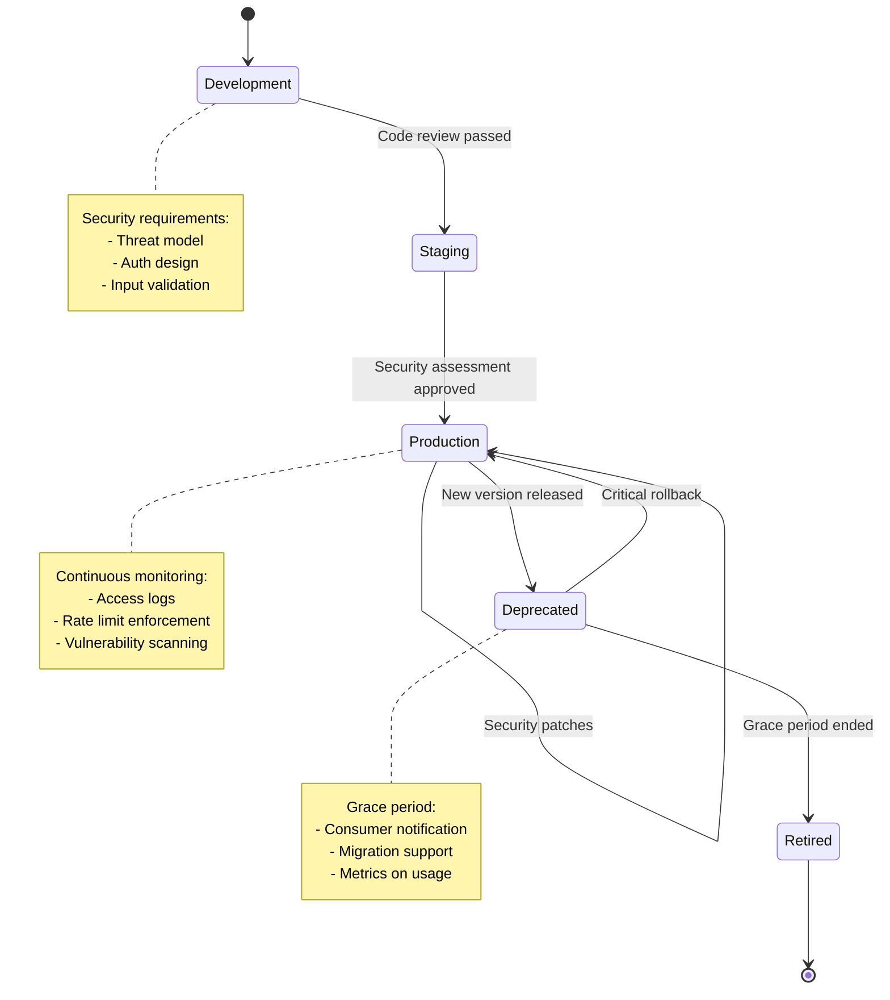

# API Inventory Management

> **API inventory management is the practice of discovering, cataloging, tracking, and maintaining oversight of all APIs across an organization—including production, staging, deprecated, shadow, and third-party APIs. For security teams and authorized testers, a complete API inventory is the foundation for enforcing governance, detecting risks, preventing breaches, and ensuring compliance.**

> **Authorized use only:** everything in this note is for approved internal security assessments, governance programs, or engagements with explicit written permission.

---

## 🧠 What Is API Inventory Management? (Beginner Explanation)

Imagine a large enterprise with hundreds of developers, dozens of teams, and years of accumulated applications. Every team builds APIs, integrates third-party services, deploys microservices, and exposes endpoints for partners, mobile apps, and internal automation.

**API inventory management** is the discipline of **knowing what exists**.

Without a comprehensive inventory, security teams face fundamental problems:

- **You cannot secure what you do not know exists**
- **You cannot patch vulnerabilities in unknown APIs**
- **You cannot enforce policies on undocumented endpoints**
- **You cannot detect data leaks from shadow APIs**
- **You cannot retire deprecated versions that still run in production**

### The core problem

Organizations typically struggle with three types of unknown APIs:

| Type | What it is | Why it matters |
|---|---|---|
| **Zombie APIs** | Deprecated or retired versions still running and accessible | Old code often lacks modern security controls; attackers find these first |
| **Shadow APIs** | Undocumented or untracked endpoints created outside formal processes | No security review, no monitoring, no ownership |
| **Third-party / Dependency APIs** | External APIs your apps consume or expose via integrations | Supply chain risk; outages or breaches propagate inward |

### Simple mental model

Think of API inventory management like **asset management for digital interfaces**:

- **Discovery** = finding every API that exists (scanning, network monitoring, code analysis)
- **Catalog** = documenting what each API does, who owns it, and where it runs
- **Tracking** = monitoring for changes, new deployments, and decommissioned services
- **Governance** = enforcing standards, applying policies, and managing lifecycle

---

## 🎯 Why API Inventory Management Is Critical

The Gartner prediction is often cited: **by 2025, less than 50% of enterprise APIs will be managed**, leaving security blind to exposure.

### Real-world impact

| Risk | What happens without inventory | Example scenario |
|---|---|---|
| **Unknown attack surface** | Attackers discover and exploit APIs that security teams don't know exist | A forgotten staging API with admin access and weak auth is found via subdomain enumeration |
| **Data breaches** | Sensitive data leaks through unmonitored or deprecated endpoints | A retired mobile API still serves PII without rate limits or logging |
| **Compliance failures** | Auditors find APIs processing regulated data without proper controls | GDPR audit reveals customer data exported via an undocumented partner integration |
| **Incident response gaps** | Teams cannot assess blast radius or patch all affected services | A library vulnerability affects 40 microservices, but only 15 are in the CMDB |
| **Operational waste** | Resources spent running, securing, and troubleshooting forgotten services | Cloud costs for zombie APIs that no application actually calls |

### The attacker advantage

Attackers perform **aggressive discovery** using:

- Subdomain enumeration and DNS brute-forcing
- Certificate transparency logs
- Public code repositories and leaks
- Wayback Machine and archive scraping
- API documentation leaks (Swagger/OpenAPI files on public buckets)
- Network scanning and service fingerprinting
- Mobile app decompilation and traffic analysis

**If an attacker can find an API faster than your security team knows it exists, you are already at a disadvantage.**

---

## 🏗️ The API Inventory Management Mental Model

A comprehensive API inventory program has four connected phases.



### The four phases explained

| Phase | Purpose | Key activities | Common tools |
|---|---|---|---|
| **Discovery** | Find all APIs that exist right now | Network scanning, traffic analysis, code scanning, cloud asset enumeration, documentation scraping | Network scanners, API gateways, service mesh logs, SAST tools, cloud APIs |
| **Cataloging** | Document what each API is, does, and who owns it | Record endpoints, methods, authentication, data sensitivity, ownership, dependencies | Asset management systems, API catalogs, CMDB, spreadsheets, wiki |
| **Tracking** | Detect changes, additions, and retirements over time | Monitor deployments, version changes, new endpoints, traffic patterns | CI/CD hooks, gateway logs, network monitoring, cloud change logs |
| **Governance** | Enforce policies and manage lifecycle | Apply security standards, retire old versions, enforce authentication, assess risk | API management platforms, policy engines, workflow automation |

---

## 🔍 Discovery: Finding All Your APIs

Discovery is the hardest and most critical step. You cannot secure what you do not know exists.

### Discovery techniques

Organizations should use **multiple complementary methods** because no single approach finds everything.

#### 1. **Network-based discovery**

Scan your networks to identify services responding on typical API ports and paths.

| Technique | What it finds | How it works |
|---|---|---|
| **Port scanning** | Services listening on HTTP/HTTPS ports | Nmap, Masscan, cloud network logs |
| **HTTP service enumeration** | Web servers and API gateways | Check for JSON/XML responses, API-specific headers |
| **TLS certificate inspection** | Domains and subdomains in SANs | Certificate Transparency logs, internal PKI records |
| **DNS enumeration** | API subdomains and environments | Subdomain brute-forcing, zone transfers, cloud DNS queries |

**Example discovery using network scanning:**



#### 2. **Traffic-based discovery**

Monitor actual network traffic to see what APIs are being called.

| Technique | What it finds | How it works |
|---|---|---|
| **API gateway logs** | All traffic through managed gateways | Parse access logs for endpoints, methods, auth patterns |
| **Service mesh telemetry** | Microservice-to-microservice calls | Istio, Linkerd, Consul telemetry and tracing |
| **Network packet capture** | Unmanaged and direct API calls | Deep packet inspection, TLS interception (with legal authorization) |
| **Load balancer logs** | Public-facing and internal endpoints | Analyze request patterns and endpoint usage |

**Key insight:** Traffic analysis finds **active** APIs, including undocumented ones that bypass formal gateways.

#### 3. **Code-based discovery**

Scan source code, configuration files, and infrastructure-as-code for API definitions and endpoints.

| Technique | What it finds | How it works |
|---|---|---|
| **Static code analysis** | API route definitions in code | Scan for framework-specific patterns (Express routes, Django URLs, Spring controllers) |
| **OpenAPI/Swagger scanning** | Documented API specifications | Search repos, CI artifacts, documentation sites for `swagger.json`, `openapi.yaml` |
| **Infrastructure-as-code parsing** | APIs defined in cloud configs | Parse Terraform, CloudFormation, Kubernetes manifests for service definitions |
| **Container image scanning** | APIs packaged in containers | Inspect Dockerfiles, image layers, and registry metadata |

**Example patterns to search for in code:**

```python
# Express.js route definitions
app.get('/api/users/:id', ...)
app.post('/api/orders', ...)

# Django URL patterns
path('api/products/<int:id>/', ...)

# Spring Boot annotations
@GetMapping("/api/customers/{id}")
@PostMapping("/api/invoices")

# OpenAPI specifications
openapi: 3.0.0
paths:
  /api/payments:
```

#### 4. **Cloud platform enumeration**

Use cloud provider APIs to enumerate deployed resources.

| Cloud Provider | Discovery approach | Tools and APIs |
|---|---|---|
| **AWS** | List API Gateways, Lambda functions, Load Balancers, ECS/EKS services | AWS CLI, CloudMapper, Prowler, Cartography |
| **Azure** | Enumerate API Management instances, App Services, Functions, AKS | Azure CLI, AzureHound, ScoutSuite |
| **GCP** | List API Gateway instances, Cloud Run, Cloud Functions, GKE services | gcloud CLI, GCP Scanner, Forseti |

**Example AWS discovery commands:**

```bash
# List all API Gateways
aws apigateway get-rest-apis --region us-east-1

# List all Lambda functions
aws lambda list-functions --region us-east-1

# List all load balancers
aws elbv2 describe-load-balancers --region us-east-1
```

#### 5. **Documentation and artifact scanning**

Search for API documentation, schemas, and client SDKs.

| Source | What it reveals | Where to look |
|---|---|---|
| **Developer portals** | Public and partner API catalogs | company.com/developers, company.com/api-docs |
| **Internal wikis** | Documented internal APIs | Confluence, Notion, SharePoint, GitHub wikis |
| **Public code repositories** | Leaked or accidentally public API specs | GitHub, GitLab, Bitbucket (use code search) |
| **Cloud storage buckets** | Publicly accessible API documentation | S3, Azure Blob, GCS bucket enumeration |
| **Mobile/desktop apps** | Client-side API endpoints and keys | Decompile APKs, reverse engineer binaries |

---

## 📋 Cataloging: Documenting Your APIs

Once discovered, every API must be documented with sufficient detail for security assessment, incident response, and governance.

### Essential catalog fields

A production-grade API catalog should record:

| Category | Fields | Why it matters |
|---|---|---|
| **Identity** | API name, ID/slug, version, description | Unique identification and human readability |
| **Location** | Base URL, subdomains, IP addresses, regions | Where the API is deployed and accessible |
| **Ownership** | Owning team, technical contact, business owner | Who to alert, who approves changes, who retires it |
| **Technical details** | Protocol (REST, GraphQL, gRPC), auth method, data formats | Security assessment and integration requirements |
| **Lifecycle state** | Development, staging, production, deprecated, retired | Risk prioritization and policy enforcement |
| **Data sensitivity** | PII, financial, health, public, internal | Compliance requirements and breach impact |
| **Dependencies** | Upstream APIs called, downstream consumers | Blast radius analysis and change impact |
| **Security controls** | Authentication, authorization, rate limiting, encryption, monitoring | Current security posture |
| **Compliance** | GDPR, HIPAA, PCI-DSS, SOC 2, ISO 27001 applicability | Audit scope and regulatory requirements |
| **Documentation** | OpenAPI spec, README, runbook links | Security testing and developer onboarding |

### Catalog structure example



### Catalog maturity levels

| Level | Characteristics | Typical for organizations... |
|---|---|---|
| **Level 0: None** | No inventory; teams guess what exists | Early-stage startups, siloed teams |
| **Level 1: Spreadsheet** | Manual tracking in Excel/Google Sheets; often stale | Small teams, initial governance efforts |
| **Level 2: Tool-assisted** | API management tool, CMDB, or catalog software; partially automated | Mid-size orgs with dedicated API platform teams |
| **Level 3: Automated** | Continuous discovery integrated with CI/CD; real-time sync | Mature API-first organizations, high-security environments |
| **Level 4: Self-healing** | Automated policy enforcement, lifecycle management, and remediation | Advanced enterprises, heavily regulated industries |

---

## 📊 Tracking: Monitoring Changes Over Time

APIs are not static. New endpoints are added, versions change, services are deployed, and old APIs are (sometimes) retired.

### What to track

| Change type | Why it matters | Detection method |
|---|---|---|
| **New API deployments** | Undiscovered APIs mean undiscovered risk | CI/CD hooks, cloud event logs, gateway config changes |
| **Endpoint additions/removals** | New attack surface or deprecated functionality | API spec diff, gateway route changes, code commits |
| **Version changes** | New vulnerabilities, breaking changes, security improvements | Version headers, documentation updates, release notes |
| **Authentication changes** | Weakened or strengthened access controls | Config file diffs, gateway policy changes |
| **Dependency updates** | Supply chain risk from upstream changes | Package manifests, SCA tool alerts, SBOMs |
| **Traffic pattern shifts** | Unusual usage may indicate abuse or shadow consumers | Access log analysis, anomaly detection |

### Automated change detection



### Drift detection

**Configuration drift** happens when the running API diverges from documented specifications.

| Drift type | Example | Impact |
|---|---|---|
| **Spec drift** | API accepts fields not in OpenAPI spec | Unvalidated inputs, potential injection |
| **Auth drift** | Endpoint documented as authenticated but accepts anonymous requests | Unauthorized access |
| **Versioning drift** | Multiple undocumented versions running in production | Inconsistent security controls |
| **Deployment drift** | API running in regions not documented | Compliance violations, data residency issues |

---

## 🛡️ Governance: Enforcing Policies and Lifecycle Management

Inventory without governance is just documentation. **Governance turns awareness into action.**

### Key governance activities

#### 1. **Policy enforcement**

Define and enforce standards for all APIs.

| Policy area | Example rules | Enforcement point |
|---|---|---|
| **Authentication** | All production APIs must use OAuth 2.0 or mutual TLS | API gateway, CI/CD gate |
| **Rate limiting** | Public APIs must enforce rate limits per client | Gateway configuration |
| **Versioning** | Max 2 production versions; deprecation notices 90 days before retirement | Release approval process |
| **Documentation** | OpenAPI 3.x spec required for all APIs | CI/CD gate, catalog validation |
| **Data classification** | APIs handling PII must log access and enforce encryption at rest | Code review, compliance check |

#### 2. **Lifecycle management**

Manage APIs from inception to retirement.



**Retirement is critical:** Failing to decommission deprecated APIs is one of the top causes of API security incidents.

#### 3. **Risk scoring and prioritization**

Not all APIs carry equal risk. Score and prioritize based on:

| Risk factor | Weight rationale |
|---|---|
| **Data sensitivity** | High: PII, financial, health; Medium: internal business data; Low: public data |
| **Authentication strength** | High risk: no auth, basic auth; Medium: API keys; Low: OAuth, mTLS |
| **Exposure** | High: public internet; Medium: partner networks; Low: internal only |
| **Lifecycle state** | High: deprecated/zombie; Medium: production; Low: staging |
| **Criticality** | High: revenue-critical, regulatory; Medium: operational; Low: experimental |
| **Vulnerability history** | Recent CVEs, past incidents, penetration test findings |

**Example risk score formula:**

```
API Risk Score = (Data Sensitivity × 3) + (Exposure × 2) + (Auth Weakness × 2) + (State × 1) + (Criticality × 1)
```

---

## 🔧 Tools and Technologies

### Commercial API inventory and governance platforms

| Tool | Strengths | Typical use case |
|---|---|---|
| **Salt Security** | Automated discovery via traffic analysis; ML-based anomaly detection | Enterprises with large, dynamic API estates |
| **Noname Security** | Passive discovery, API security posture management | Security-first organizations, compliance-heavy industries |
| **Traceable AI** | API discovery, threat detection, distributed tracing integration | DevSecOps teams, microservices architectures |
| **42Crunch** | API security audit, OpenAPI-based testing, CI/CD integration | Development teams wanting shift-left security |
| **Imperva API Security** | WAF integration, bot protection, DDoS mitigation | Organizations with existing Imperva infrastructure |
| **Akamai API Security** | CDN-integrated discovery and protection | Global enterprises with Akamai CDN |

### Open-source and free tools

| Tool | Purpose | Example use |
|---|---|---|
| **Swagger/OpenAPI Inspector** | Parse and validate API specs | Catalog documented APIs, detect spec drift |
| **Postman Collections** | Manual API catalog and testing | Small teams, exploratory testing |
| **Spectral** | Scan repos for API keys and secrets | Prevent credential leaks during discovery |
| **Nmap / Masscan** | Network scanning for API endpoints | Initial discovery in unknown environments |
| **OWASP Amass** | Subdomain enumeration and DNS discovery | Find shadow APIs on forgotten subdomains |
| **Cartography / CloudMapper** | Cloud asset graphing | AWS/GCP/Azure inventory visualization |
| **Swagger UI / ReDoc** | Host and explore OpenAPI specs | Developer portal, internal documentation |

### API management platforms with inventory features

| Platform | Inventory capability | Strengths |
|---|---|---|
| **Kong** | Gateway-based discovery, plugin ecosystem | High performance, flexible deployment |
| **Apigee (Google Cloud)** | Full lifecycle management, analytics | Enterprise-grade, deep GCP integration |
| **AWS API Gateway** | Native AWS integration, CloudWatch logs | AWS-native shops, serverless architectures |
| **Azure API Management** | Azure-native discovery, policy enforcement | Microsoft ecosystem, hybrid deployments |
| **Tyk** | Open-source core, plugin support | Cost-conscious teams, Kubernetes-native |
| **MuleSoft Anypoint** | Enterprise integration, API catalog | Large enterprises, complex integrations |

---

## 🧪 Building an Effective API Inventory Program

### Step-by-step implementation

#### Phase 1: Initial discovery (Weeks 1-4)

| Week | Activity | Deliverable |
|---|---|---|
| **1** | Identify key stakeholders (security, platform, DevOps, compliance) | Kickoff meeting notes, RACI matrix |
| **2** | Run network scans, enumerate cloud assets, search code repos | Raw list of discovered APIs (expect hundreds to thousands) |
| **3** | Deduplicate and classify by environment (prod, staging, dev) | Prioritized list of production and customer-facing APIs |
| **4** | Validate with development teams; identify owners | Initial catalog with ownership and basic metadata |

#### Phase 2: Catalog enrichment (Weeks 5-8)

| Week | Activity | Deliverable |
|---|---|---|
| **5** | Gather authentication, authorization, and security details | Catalog with auth methods and security controls |
| **6** | Classify data sensitivity and compliance requirements | Catalog with data classification and regulatory tags |
| **7** | Document dependencies (upstream and downstream) | Dependency map or graph |
| **8** | Assign risk scores and identify high-priority gaps | Risk-ranked API list and remediation backlog |

#### Phase 3: Automation and governance (Weeks 9-12)

| Week | Activity | Deliverable |
|---|---|---|
| **9** | Integrate discovery with CI/CD pipelines | Automated new API detection |
| **10** | Set up continuous monitoring and drift detection | Alerts for spec changes and new endpoints |
| **11** | Define and publish API security policies | Written standards and approval workflows |
| **12** | Establish retirement process and decommission first deprecated API | Documented lifecycle management process |

#### Ongoing: Continuous improvement

- **Monthly:** Review new API discoveries and update catalog
- **Quarterly:** Re-scan environments for shadow and zombie APIs
- **Annually:** Audit compliance, assess risk scores, retire unused APIs

---

## 📊 Metrics and KPIs

Track program health and demonstrate value to leadership.

### Discovery metrics

| Metric | What it measures | Target direction |
|---|---|---|
| **Total APIs discovered** | Inventory completeness | Stabilizes after initial discovery |
| **APIs discovered per month** | Rate of new API creation | Should trend down as governance improves |
| **Shadow APIs found** | Unmanaged or undocumented APIs | Should decrease over time |
| **Time to catalog new APIs** | How quickly new APIs are documented | Decrease; automate toward real-time |

### Security metrics

| Metric | What it measures | Target direction |
|---|---|---|
| **% APIs with strong authentication** | Enforcement of auth standards | Increase toward 100% |
| **% APIs with rate limiting** | Protection against abuse | Increase toward 100% |
| **Mean time to patch vulnerable APIs** | Incident response effectiveness | Decrease |
| **Deprecated APIs still running** | Technical debt and exposure | Decrease toward 0 |

### Governance metrics

| Metric | What it measures | Target direction |
|---|---|---|
| **% APIs with documented owners** | Accountability | 100% |
| **% APIs with OpenAPI specs** | Documentation coverage | Increase toward 100% |
| **Average API lifespan in deprecated state** | Retirement discipline | Decrease; enforce SLAs |
| **APIs retired per quarter** | Lifecycle hygiene | Depends on estate; should not be zero |

---

## 🚨 Common Pitfalls and How to Avoid Them

### Pitfall 1: One-time discovery treated as ongoing inventory

**Problem:** Teams run a discovery project, build a catalog, and never update it. Within months, the catalog is stale.

**Solution:** Treat inventory as a **continuous process**. Automate discovery hooks into CI/CD, cloud events, and gateway deployments.

---

### Pitfall 2: No ownership or accountability

**Problem:** APIs are cataloged but no one is assigned as owner. When vulnerabilities are found, no one knows who to contact.

**Solution:** Require **documented ownership** for every API. Make ownership a gate in the deployment process.

---

### Pitfall 3: Catalog without governance

**Problem:** A beautiful catalog exists but no policies are enforced. Teams know deprecated APIs exist but they continue running.

**Solution:** Tie inventory to **automated policy enforcement**. If an API violates standards, block deployment or generate executive escalation.

---

### Pitfall 4: Ignoring third-party and partner APIs

**Problem:** Internal APIs are cataloged, but external APIs consumed by apps or exposed to partners are invisible.

**Solution:** Expand discovery to include **dependency scanning**, **SBOMs**, and **partner integration reviews**.

---

### Pitfall 5: Security team works in isolation

**Problem:** Security builds the inventory alone. Developers don't use it, don't trust it, and don't update it.

**Solution:** Make inventory a **shared responsibility**. Integrate with developer tools (Slack, Jira, CI/CD) and provide value to dev teams (faster onboarding, clearer dependencies).

---

## 🎓 Best Practices Summary

### For security teams

| Best practice | Why it matters |
|---|---|
| **Assume undiscovered APIs exist** | Continuous discovery is a security mindset, not a one-time project |
| **Prioritize by risk, not by count** | A single deprecated admin API is riskier than 100 internal monitoring endpoints |
| **Automate everything possible** | Manual processes do not scale and will be bypassed |
| **Make the catalog useful beyond security** | If developers, SREs, and compliance teams find value, they will help maintain it |
| **Enforce lifecycle discipline** | Retire deprecated APIs aggressively; they are the easiest attack vector |

### For development teams

| Best practice | Why it matters |
|---|---|
| **Document APIs at creation time** | It is easier to write an OpenAPI spec during development than reverse-engineer later |
| **Register APIs in the catalog before production** | Catalog should be a deployment gate, not an afterthought |
| **Assign ownership and contact info** | Security and operations need to reach someone when issues arise |
| **Tag data sensitivity accurately** | Misclassified data can cause compliance violations and breaches |
| **Retire old versions promptly** | Every deprecated endpoint is a maintenance burden and security risk |

### For leadership and governance teams

| Best practice | Why it matters |
|---|---|
| **Invest in tooling, not just process** | Manual inventory does not scale; buy or build automation |
| **Measure and report metrics** | Visibility drives accountability and funding |
| **Tie API inventory to compliance** | Auditors will ask what APIs handle regulated data; "we don't know" is unacceptable |
| **Enforce retirement SLAs** | Deprecated APIs must have a sunset timeline and enforcement mechanism |
| **Make API security a KPI** | What gets measured gets managed |

---

## 🔗 Additional Resources

### Standards and frameworks

| Resource | Focus | Link concept |
|---|---|---|
| **OWASP API Security Top 10** | Common API vulnerabilities | Inventory prevents API9:2023 (Improper Inventory Management) |
| **NIST Cybersecurity Framework** | Risk management and asset identification | Inventory supports "Identify" function |
| **OpenAPI Specification (OAS)** | API documentation standard | Foundation for catalog metadata |
| **ISO/IEC 27001** | Information security management | Asset inventory is a core control |

### Industry research

| Source | Key finding | Implication |
|---|---|---|
| **Gartner** | By 2025, <50% of enterprise APIs will be managed | Unmanaged APIs are the majority attack surface |
| **Salt Security State of API Security** | 94% of orgs experienced API security incidents in 2022 | Most incidents involve undiscovered or misconfigured APIs |
| **Forrester** | 35% of organizations cannot identify all their APIs | Discovery gaps are a universal challenge |

### Learning and community

- **OWASP API Security Project:** Open-source resources, tools, and community
- **API Security Articles:** Blog posts from Salt, Noname, 42Crunch, Traceable
- **API Days / API conferences:** Industry events on API design and security
- **Cloud provider documentation:** AWS, Azure, GCP API enumeration guides

---

## 🧠 Key Takeaways

1. **You cannot secure what you do not know exists.** API inventory is the foundation of all API security.

2. **Discovery must be continuous, not one-time.** APIs are constantly deployed, changed, and (sometimes) retired.

3. **Use multiple discovery methods.** Network scanning, traffic analysis, code scanning, and cloud enumeration each find different APIs.

4. **Catalog with purpose.** Document ownership, data sensitivity, dependencies, and security controls—not just URLs.

5. **Enforce governance.** Inventory without policy enforcement is just documentation.

6. **Prioritize zombie and shadow APIs.** Old, undocumented, and unmanaged APIs are the easiest targets for attackers.

7. **Automate everything.** Manual processes do not scale and will be bypassed in fast-moving development environments.

8. **Make it a shared responsibility.** Security cannot do this alone; developers, SREs, and leadership must participate.

---

**Next steps:** Start with a pilot discovery effort on one application or service, document findings, assign owners, and build momentum for organization-wide rollout. The first 10 APIs you catalog will teach you more than a year of planning.
