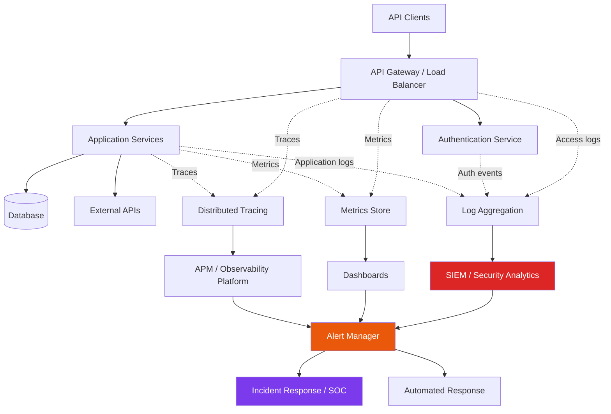
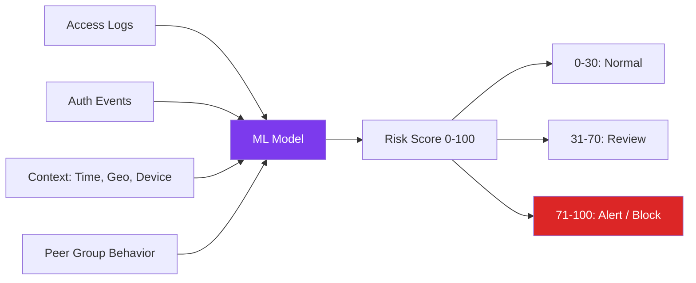

# API Monitoring and Detection

> **API monitoring is the practice of continuously observing API behavior to detect security threats, performance degradation, unauthorized access, and anomalous patterns in real time. For defenders, it means shifting from "hope nothing breaks" to "know immediately when something is wrong, who did it, and what the impact is."**

> **Authorized use only:** everything in this note is for approved security operations, internal defense posture improvement, or authorized incident response work.

---

## 🧠 What Is API Monitoring? (Beginner Explanation)

API monitoring is your **security and reliability radar**. While authentication asks "who are you?" and authorization asks "what can you do?", monitoring asks:

- **What is actually happening right now?**
- **Is this normal or suspicious?**
- **Who did what, when, and with what result?**
- **Are we under attack, degraded, or fine?**

APIs are harder to monitor than traditional web applications because:

- **No visible UI** — attacks happen silently in structured requests
- **High request volume** — millions of calls per day are normal
- **Machine-to-machine traffic** — attackers blend in with legitimate automation
- **Distributed architecture** — a single user action may touch 10+ microservices
- **Complex authorization** — subtle privilege escalation is easy to miss in logs

### Simple mental model

Think of API monitoring as a combination of:

1. **Security cameras** → logs and traces showing who did what
2. **Alarms** → real-time alerts on dangerous patterns
3. **Health sensors** → metrics showing performance, errors, and capacity
4. **Forensic tools** → ability to reconstruct an incident after the fact

Without monitoring, you are blind to attacks until the damage is discovered days or weeks later.

---

## 🎯 Goals of API Monitoring

Effective API monitoring serves multiple overlapping purposes.

| Goal | What it means | Example question |
|---|---|---|
| **Threat detection** | Identify active attacks or reconnaissance | Is someone brute-forcing object IDs or testing for BOLA? |
| **Compliance enforcement** | Verify policy adherence and audit trails | Can we prove who accessed PII and when? |
| **Incident response** | Enable fast investigation and containment | Which accounts were compromised in the breach? |
| **Performance assurance** | Maintain SLAs and user experience | Are latency spikes correlated with specific endpoints? |
| **Anomaly detection** | Spot unusual but not explicitly forbidden patterns | Why is this service account calling endpoints it never used before? |
| **Capacity planning** | Understand usage trends and growth | Are we approaching API gateway or database limits? |
| **Authorization validation** | Confirm access controls are working | Are low-privilege users ever reaching admin endpoints? |

---

## 🏗️ The API Monitoring Architecture

API monitoring works as a multi-layer system where each component has a specific purpose.



### The three pillars of observability

Modern API monitoring relies on three complementary data types:

| Pillar | Purpose | Example | Retention typical |
|---|---|---|---|
| **Logs** | Discrete event records | `User 1234 called GET /orders/5678 → 200` | Days to months |
| **Metrics** | Aggregated time-series data | `p95 latency on /checkout is 850ms` | Weeks to years (downsampled) |
| **Traces** | Request flow across services | Request took 2.3s: gateway 10ms → auth 50ms → orders 1.8s → DB 400ms | Hours to days |

Each pillar answers different questions:

- **Logs** answer "what happened?" and "who did it?"
- **Metrics** answer "how much?" and "how fast?"
- **Traces** answer "where is the bottleneck?" and "which service failed?"

You need all three. Logs alone miss patterns. Metrics alone miss context. Traces alone miss security signals.

---

## 📊 What to Monitor in API Security

### 1. Authentication Events

Track every authentication attempt, success, and failure.

| Event type | Why it matters | Detection pattern |
|---|---|---|
| **Failed login attempts** | Credential stuffing, brute force | >5 failures from same IP in 1 minute |
| **Successful login from new location/device** | Account takeover | User's first login from a country they've never used |
| **Token generation** | Unusual access pattern | Service account creates 100+ tokens in an hour |
| **Token validation failures** | Expired, revoked, or tampered tokens | Spike in 401 errors on authenticated endpoints |
| **Session hijacking indicators** | Token reuse from multiple IPs | Same token active from US and Russia simultaneously |
| **Privilege escalation attempts** | Role manipulation | User modifies JWT claims before sending |

#### Example log structure (JSON)

```json
{
  "timestamp": "2024-03-15T14:23:11Z",
  "event_type": "auth.login.failed",
  "user_identifier": "user@example.com",
  "source_ip": "203.0.113.42",
  "user_agent": "PostmanRuntime/7.32.1",
  "reason": "invalid_password",
  "attempt_count": 6,
  "geo": {"country": "US", "city": "New York"},
  "risk_score": 75
}
```

### 2. Authorization Events

Every access decision should be logged, especially denials.

| Event type | Why it matters | Detection pattern |
|---|---|---|
| **403 Forbidden responses** | Authorization boundary testing | User attempts 20+ different object IDs and gets 403 each time |
| **Vertical privilege escalation** | User reaches admin endpoint | Regular user calls `/admin/users` |
| **Horizontal privilege escalation** | User accesses peer data | User A accesses User B's `/profile`, `/orders`, `/settings` |
| **Bulk data access** | Potential data exfiltration | User downloads 10,000 records in 5 minutes |
| **Unusual endpoint access** | Reconnaissance or lateral movement | Service that normally calls 3 endpoints suddenly tries 50 |
| **Mass assignment attempts** | Property-level auth bypass | Request includes `isAdmin`, `role`, `internal_notes` fields |

#### Example detection rule (pseudocode)

```python
# BOLA (Broken Object Level Authorization) detector
if event.status_code == 403 and event.path.contains_resource_id():
    user_failures = count_failures(event.user, last_minutes=5)
    unique_resources = count_unique_resource_ids(event.user, last_minutes=5)
    
    if user_failures > 10 and unique_resources > 10:
        alert(
            severity="HIGH",
            title="Possible BOLA enumeration attack",
            description=f"User {event.user} tried {unique_resources} different resource IDs",
            recommended_action="Review user activity, consider temporary block"
        )
```

### 3. Input Validation and Attack Patterns

Monitor for common attack vectors.

| Attack vector | What to log | Detection pattern |
|---|---|---|
| **SQL injection attempts** | Requests with SQL keywords | Payload contains `UNION`, `SELECT`, `DROP`, `--`, `/*` |
| **NoSQL injection** | Unusual operators in JSON | Request contains `$where`, `$ne`, `$gt` in unexpected fields |
| **Command injection** | Shell metacharacters | Payload contains `;`, `|`, `&&`, backticks, `$(...)` |
| **Path traversal** | Directory traversal sequences | Request contains `../`, `..%2F`, `..%5C` |
| **XXE / XML attacks** | Suspicious XML entities | XML contains `<!ENTITY`, `<!DOCTYPE`, external references |
| **Deserialization attacks** | Unusual serialized objects | Java serialization magic bytes, Python pickle patterns |
| **Large payloads** | Potential DoS | Request body >10 MB, array with >10,000 elements |
| **GraphQL complexity** | Query depth/breadth abuse | Query depth >10, requests >100 fields |

### 4. Rate Limiting and Abuse

Track volume and velocity to spot abuse.

| Metric | Threshold example | What it indicates |
|---|---|---|
| **Requests per user per minute** | >300 | Automated scraping or brute force |
| **Requests per IP per minute** | >1000 | Bot traffic or distributed attack |
| **Bandwidth consumed per user** | >100 MB/min | Data exfiltration or large export abuse |
| **Error rate per user** | >50% errors | Fuzzing, scanning, or broken integration |
| **Unique endpoints accessed per user** | >30 in 1 min | Reconnaissance, API discovery |
| **429 responses issued** | Sustained high rate | Rate limit is working, but investigate source |

### 5. Data Access Patterns

Sensitive data access deserves special logging.

| Event | What to log | Purpose |
|---|---|---|
| **PII access** | User ID, record ID, field names, timestamp | Compliance audit (GDPR, HIPAA) |
| **Admin operations** | Full context: who, what, when, before/after state | Accountability, fraud prevention |
| **Export/download actions** | Number of records, filters applied | Insider threat detection |
| **Cross-tenant access** | When multi-tenant APIs interact | Tenant isolation verification |
| **Sensitive field reads** | SSN, credit card, password hash views | Unauthorized access detection |

#### Example sensitive access log

```json
{
  "timestamp": "2024-03-15T14:30:22Z",
  "event_type": "data.access.pii",
  "user_id": "usr_admin_42",
  "action": "GET",
  "resource": "/users/67890/profile",
  "fields_accessed": ["email", "phone", "address", "ssn_last4"],
  "justification": "Support ticket #12345",
  "audit_retention_years": 7
}
```

### 6. Performance and Reliability Metrics

Security and performance monitoring overlap more than most teams realize.

| Metric | Why it's security-relevant | Example threshold |
|---|---|---|
| **Latency percentiles (p50, p95, p99)** | Sudden slowness may indicate DDoS or resource exhaustion | p95 >2s sustained |
| **Error rate** | Spike in 5xx errors may indicate attack or exploit attempt | >5% error rate |
| **Endpoint-specific error rates** | Single endpoint with high errors suggests targeted attack | `/admin/export` at 80% errors |
| **Database query time** | Slow queries may indicate injection attempt or N+1 abuse | Query >10s |
| **External API call failures** | Dependency compromise or supply chain attack | >20% failure to payment API |
| **Resource exhaustion** | CPU, memory, disk, connection pool usage | Connections >90% capacity |

---

## 🔍 Detection Strategies

### Signature-based detection

Identify known attack patterns using predefined rules.

**Pros:**
- Low false positive rate
- Easy to understand and tune
- Fast to evaluate

**Cons:**
- Only catches known attacks
- Easily bypassed with encoding or obfuscation
- Requires constant rule updates

**Example rules:**

```yaml
# WAF / SIEM rule examples

- name: SQL Injection in Query Parameter
  pattern: (union.*select|drop.*table|exec\(|execute\()
  fields: [query_string, request_body]
  severity: HIGH
  
- name: JWT Algorithm Confusion
  pattern: "alg":\s*"none"
  fields: [authorization_header]
  severity: CRITICAL
  
- name: Admin Endpoint Access by Non-Admin
  condition: path.startsWith('/admin') AND user.role != 'admin'
  severity: HIGH
```

### Anomaly-based detection

Use baselines and statistical models to find deviations.

**Pros:**
- Catches unknown attacks
- Adapts to normal behavior
- Good for insider threats and slow attacks

**Cons:**
- Higher false positive rate
- Requires training period
- Harder to explain to stakeholders

**Example anomalies:**

| Behavior | Baseline | Anomaly | Action |
|---|---|---|---|
| API calls per hour | User typically: 50–200 | Suddenly: 5,000 | Alert and soft-rate-limit |
| Endpoints accessed | Service calls 5 specific endpoints | Calls 40 different endpoints in an hour | Investigate, potential reconnaissance |
| Geographic location | User always from US East | Sudden login from Ukraine | Require MFA step-up or block |
| Time of day | User active 9am–6pm EST | Activity at 3am EST | Alert security team |
| Peer comparison | Most users access 1–3 tenants | User accesses 50 tenants | Flag as high risk |

### Behavioral analytics (UEBA)

User and Entity Behavior Analytics combines multiple signals.



**Example risk scoring:**

```python
def calculate_risk_score(event):
    score = 0
    
    # Failed auth attempts
    if event.failed_logins_last_hour > 5:
        score += 20
    
    # New device/location
    if event.is_new_device or event.is_new_location:
        score += 15
    
    # Unusual time
    if event.is_outside_normal_hours:
        score += 10
    
    # Forbidden access attempts
    if event.forbidden_count_last_10min > 3:
        score += 25
    
    # Sensitive data access
    if event.accessed_pii and not event.has_justification:
        score += 20
    
    # Velocity anomaly
    if event.requests_last_minute > user_baseline * 3:
        score += 15
    
    return min(score, 100)
```

---

## 📡 Monitoring Techniques and Tools

### 1. API Gateway Logging

**Where:** At the edge, before requests reach application code.

**What to capture:**
- Request method, path, query parameters, headers
- Response status code, size, latency
- Client IP, user agent, geographic location
- Authentication metadata (token fingerprint, user ID)
- Rate limiting decisions

**Tools:**
- AWS API Gateway → CloudWatch Logs
- Kong → logging plugins (HTTP, file, syslog)
- Apigee → Analytics and logging services
- Nginx → access logs with custom formats
- Traefik → JSON access logs

**Example Nginx log format:**

```nginx
log_format api_json escape=json '{'
  '"timestamp":"$time_iso8601",'
  '"client_ip":"$remote_addr",'
  '"method":"$request_method",'
  '"uri":"$request_uri",'
  '"status":$status,'
  '"bytes_sent":$bytes_sent,'
  '"latency":$request_time,'
  '"user_agent":"$http_user_agent",'
  '"user_id":"$http_x_user_id",'
  '"request_id":"$request_id"'
'}';

access_log /var/log/nginx/api_access.log api_json;
```

### 2. Application-Level Logging

**Where:** Within your application code.

**What to capture:**
- Business logic decisions
- Authorization checks (allow/deny)
- Sensitive data access
- Database queries (sanitized)
- External API calls
- Exception traces (without secrets)

**Best practices:**

```javascript
// Good: Structured logging with context
logger.info('Order created', {
  event: 'order.created',
  user_id: userId,
  order_id: orderId,
  amount: order.total,
  currency: order.currency,
  payment_method: 'credit_card', // Not full card number
  ip: req.ip,
  request_id: req.requestId
});

// Bad: Unstructured, missing context
console.log('Order created: ' + orderId);
```

**Sensitive data handling:**

```python
# Never log raw sensitive data
logger.info(f"User login: {email} password: {password}")  # ❌ WRONG

# Hash or redact PII
logger.info("User login", extra={
    "email_hash": hashlib.sha256(email.encode()).hexdigest()[:16],
    "ip": request.remote_addr,
    "success": True
})  # ✅ CORRECT
```

### 3. Database Activity Monitoring

**Where:** Between application and database.

**What to capture:**
- Query patterns (SELECT, INSERT, UPDATE, DELETE)
- Slow queries (>1s execution time)
- Failed queries (syntax errors, permission denied)
- Unusual access patterns (full table scans)
- Schema changes (ALTER, DROP, CREATE)

**Tools:**
- PostgreSQL → `pg_stat_statements`, pgBadger
- MySQL → slow query log, Performance Schema
- MongoDB → profiler, system.profile
- Database Activity Monitoring (DAM) solutions: Imperva, IBM Guardium

### 4. Distributed Tracing

**Where:** Across all services in a request path.

**What to capture:**
- Request propagation through microservices
- Service-to-service authentication
- Error propagation
- Latency breakdown by service

**Standards & Tools:**
- OpenTelemetry (vendor-neutral standard)
- Jaeger (CNCF project, open source)
- Zipkin (Twitter's original tracer)
- Datadog APM (commercial)
- New Relic (commercial)
- AWS X-Ray

**Example trace structure:**

```
Trace ID: 7d8a3f5e2b1c4a6d
├─ Span: API Gateway [120ms]
│  └─ Span: Auth Service [45ms]
│     └─ Span: User DB Query [30ms]
├─ Span: Order Service [850ms]
│  ├─ Span: Inventory Check [200ms]
│  ├─ Span: Payment Processing [600ms] ⚠️ SLOW
│  └─ Span: Notification Queue [50ms]
└─ Total: 970ms
```

### 5. SIEM Integration

Security Information and Event Management platforms correlate logs from multiple sources.

**Popular SIEM platforms:**
- Splunk (commercial, widely used)
- Elastic Stack (ELK: Elasticsearch, Logstash, Kibana)
- Sumo Logic (cloud-native)
- Microsoft Sentinel (Azure-native)
- IBM QRadar
- Google Chronicle

**Example Splunk query for BOLA detection:**

```spl
index=api_logs status=403
| stats count as forbidden_count, dc(resource_id) as unique_resources by user_id
| where forbidden_count > 10 AND unique_resources > 10
| eval severity="HIGH"
| table user_id, forbidden_count, unique_resources, severity
```

### 6. Real-Time Alerting

Alerts should be actionable, specific, and routed correctly.

**Alert levels:**

| Severity | When to use | Response time | Example |
|---|---|---|---|
| **CRITICAL** | Active exploitation, data breach | <5 minutes | Mass data exfiltration in progress |
| **HIGH** | Likely attack, authorization bypass | <30 minutes | Repeated admin endpoint access by non-admin |
| **MEDIUM** | Suspicious pattern, policy violation | <4 hours | User accessing API from new country |
| **LOW** | Anomaly, worth investigating | <24 hours | Unusual API call volume for service account |
| **INFO** | Normal security event | No action needed | User changed password |

**Example alert payload:**

```json
{
  "alert_id": "alert_20240315_0023",
  "severity": "HIGH",
  "title": "Possible BOLA enumeration attack",
  "description": "User usr_12345 attempted to access 47 different order IDs in 3 minutes, receiving 403 Forbidden on all attempts",
  "detection_time": "2024-03-15T14:35:12Z",
  "affected_user": "usr_12345",
  "source_ip": "198.51.100.42",
  "recommended_actions": [
    "Review user account for compromise",
    "Check if other users from same IP exhibit similar behavior",
    "Consider temporary account suspension pending investigation"
  ],
  "evidence": {
    "forbidden_count": 47,
    "time_window_seconds": 180,
    "sample_requests": [
      "GET /orders/1001 → 403",
      "GET /orders/1002 → 403",
      "GET /orders/1003 → 403"
    ]
  }
}
```

---

## 🛡️ Monitoring Best Practices

### 1. Log What Matters

**Do log:**
- Authentication events (all)
- Authorization decisions (especially denials)
- Sensitive data access
- Admin actions
- API errors and exceptions
- Rate limit enforcement
- Security-relevant state changes

**Don't log:**
- Passwords (plaintext or hashed)
- API keys or tokens (full values)
- Credit card numbers
- Social Security numbers
- Private keys or certificates
- Session cookies (full value)

**Redaction example:**

```python
def safe_log_request(request):
    headers = dict(request.headers)
    
    # Redact sensitive headers
    if 'Authorization' in headers:
        headers['Authorization'] = 'Bearer ***REDACTED***'
    if 'X-API-Key' in headers:
        headers['X-API-Key'] = '***REDACTED***'
    
    # Redact sensitive body fields
    body = request.json.copy() if request.json else {}
    for field in ['password', 'ssn', 'credit_card', 'secret']:
        if field in body:
            body[field] = '***REDACTED***'
    
    return {
        'method': request.method,
        'path': request.path,
        'headers': headers,
        'body': body
    }
```

### 2. Use Structured Logging

JSON logs are parseable, searchable, and indexable.

**Comparison:**

```
# Unstructured (hard to parse)
2024-03-15 14:23:11 User john@example.com logged in from 203.0.113.42 successfully

# Structured (easy to parse)
{
  "timestamp": "2024-03-15T14:23:11Z",
  "level": "INFO",
  "event": "user.login.success",
  "user_email": "john@example.com",
  "source_ip": "203.0.113.42",
  "user_agent": "Mozilla/5.0...",
  "session_id": "sess_7d8a3f5e"
}
```

### 3. Implement Log Sampling for High-Volume APIs

For endpoints handling millions of requests per hour, log sampling reduces cost without losing visibility.

**Strategies:**

| Strategy | When to use | Example |
|---|---|---|
| **Sample successful requests** | High-traffic read endpoints | Log 1% of 200 OK responses |
| **Always log errors** | All endpoints | Log 100% of 4xx and 5xx |
| **Always log sensitive operations** | Admin, PII, financial | Log 100% of writes to sensitive data |
| **Tail sampling** | Distributed traces | Keep traces that contain errors, drop normal ones |

**Example Python code:**

```python
import random

def should_log_request(request, response):
    # Always log errors
    if response.status_code >= 400:
        return True
    
    # Always log sensitive endpoints
    if request.path.startswith('/admin') or request.path.startswith('/api/v1/users'):
        return True
    
    # Sample 5% of successful requests on high-volume endpoints
    if request.path in ['/api/v1/products', '/api/v1/search']:
        return random.random() < 0.05
    
    # Log everything else
    return True
```

### 4. Set Appropriate Retention Periods

Balance security needs, compliance requirements, and storage costs.

| Log type | Typical retention | Reason |
|---|---|---|
| **Security events** | 90 days - 1 year | Incident investigation, threat hunting |
| **Audit logs (PII access)** | 7 years | GDPR, HIPAA compliance |
| **Access logs** | 30-90 days | Performance analysis, debugging |
| **Debug logs** | 7-14 days | Troubleshooting only |
| **Metrics (high resolution)** | 30 days | Real-time dashboards |
| **Metrics (downsampled)** | 1-2 years | Trend analysis |
| **Traces** | 7-30 days | Performance debugging |

### 5. Enrich Logs with Context

Add metadata that makes investigation easier.

**Useful context fields:**

```json
{
  "timestamp": "2024-03-15T14:23:11Z",
  "event": "api.request",
  
  // Request identity
  "request_id": "req_7d8a3f5e",
  "trace_id": "trace_2b1c4a6d",
  "correlation_id": "corr_9f3e7a2b",
  
  // User context
  "user_id": "usr_12345",
  "tenant_id": "tenant_acme",
  "user_roles": ["user", "support"],
  
  // Request details
  "method": "POST",
  "path": "/api/v1/orders",
  "status_code": 201,
  "latency_ms": 245,
  
  // Client context
  "client_ip": "203.0.113.42",
  "user_agent": "Mozilla/5.0...",
  "client_type": "web",
  
  // Geographic context
  "geo_country": "US",
  "geo_city": "New York",
  "geo_asn": "AS15169",
  
  // Environment
  "environment": "production",
  "service_name": "order-api",
  "service_version": "v2.3.1"
}
```

### 6. Monitor the Monitors

Ensure your monitoring system itself is reliable.

**Watch for:**
- Log ingestion lag (events delayed >5 minutes)
- Missing logs from specific services
- Alert fatigue (too many false positives)
- Storage approaching capacity
- SIEM query performance degradation

**Example health check:**

```python
# Canary log injection
def monitor_health_check():
    logger.info("MONITORING_HEALTH_CHECK", extra={
        "canary": True,
        "expected_arrival_time": datetime.utcnow().isoformat()
    })
    
    # Verify canary appears in SIEM within 60 seconds
    # Alert if missing
```

---

## 🚨 Common Attack Patterns and Detection Rules

### 1. Credential Stuffing

**Attack pattern:**
- Attacker has username/password pairs from previous breaches
- Attempts to login with those credentials on your API
- Uses automation to try thousands of combinations

**Detection:**

```python
# Pseudocode detection rule
if (
    failed_login_attempts > 5 
    AND source_ip in known_proxy_networks
    AND user_agent in automated_tools
    AND time_window < 60_seconds
):
    alert("Credential stuffing attack detected")
    apply_rate_limit(source_ip, duration=1_hour)
```

### 2. BOLA (Broken Object Level Authorization) Enumeration

**Attack pattern:**
- User tries sequential or random object IDs
- Looking for objects they can access without authorization
- Example: `/api/orders/1`, `/api/orders/2`, `/api/orders/3`...

**Detection:**

```yaml
# SIEM correlation rule
name: BOLA_Enumeration
condition:
  - unique_resource_ids > 20
  - time_window: 5 minutes
  - status_code: 403 OR 404
  - same_user: true
action:
  - alert: HIGH
  - block: temporary
```

### 3. Token Replay Attack

**Attack pattern:**
- Attacker captures a valid token
- Reuses it from different IP or device
- Bypasses intended session controls

**Detection:**

```python
# Token fingerprinting
def detect_token_anomaly(token_hash, current_request):
    previous_use = token_cache.get(token_hash)
    
    if previous_use:
        ip_changed = previous_use.ip != current_request.ip
        country_changed = previous_use.country != current_request.country
        user_agent_changed = previous_use.user_agent != current_request.user_agent
        
        if ip_changed and country_changed:
            alert("Possible token replay from different location")
            revoke_token(token_hash)
    
    token_cache.set(token_hash, current_request)
```

### 4. Mass Data Exfiltration

**Attack pattern:**
- Compromised account or insider threat
- Downloads large amounts of data
- May use pagination to bypass simple volume checks

**Detection:**

```sql
-- SQL query for SIEM
SELECT 
    user_id,
    COUNT(*) as request_count,
    SUM(response_size_bytes) as total_bytes,
    COUNT(DISTINCT resource_type) as resource_types
FROM api_logs
WHERE 
    timestamp > NOW() - INTERVAL '1 hour'
    AND status_code = 200
    AND method = 'GET'
GROUP BY user_id
HAVING 
    total_bytes > 100000000  -- 100 MB
    OR request_count > 1000
ORDER BY total_bytes DESC;
```

### 5. API Reconnaissance

**Attack pattern:**
- Attacker maps available endpoints
- Uses OPTIONS, different HTTP methods
- Probes for undocumented endpoints

**Detection:**

```python
# Track endpoint diversity
def detect_reconnaissance(user_id, time_window=10*60):
    events = get_user_events(user_id, last_seconds=time_window)
    
    unique_endpoints = set(e.path for e in events)
    http_methods_used = set(e.method for e in events)
    new_endpoints = [e for e in unique_endpoints if not is_typical_endpoint(user_id, e)]
    
    if (
        len(unique_endpoints) > 30 
        and len(new_endpoints) > 20
        and 'OPTIONS' in http_methods_used
    ):
        alert("API reconnaissance detected", severity="MEDIUM")
```

---

## 📈 Metrics and KPIs for API Security Monitoring

### Security Metrics

| Metric | Target | Why it matters |
|---|---|---|
| **Mean Time to Detect (MTTD)** | <10 minutes | How fast you spot an active attack |
| **Mean Time to Respond (MTTR)** | <30 minutes | How fast you contain/mitigate |
| **False Positive Rate** | <5% | Alert quality and analyst efficiency |
| **Failed authentication rate** | <1% | Baseline for detecting credential attacks |
| **Authorization denial rate** | Track per endpoint | Unusual spikes indicate enumeration |
| **Sensitive data access by role** | Track and compare | Spot privilege creep or insider threats |
| **API coverage** | 100% of endpoints | Ensure no blind spots |

### Example Dashboard Layout

```
┌─────────────────────────────────────────────────────────┐
│  API Security Overview                 Last 24 hours    │
├─────────────────────────────────────────────────────────┤
│  🔴 CRITICAL ALERTS: 2                                  │
│  🟡 HIGH ALERTS: 7                                      │
│  🔵 MEDIUM ALERTS: 23                                   │
├─────────────────────────────────────────────────────────┤
│  Authentication Events                                  │
│  ├─ Successful logins:        142,384                   │
│  ├─ Failed logins:              1,209  (0.8%)           │
│  └─ Account lockouts:               3                   │
├─────────────────────────────────────────────────────────┤
│  Authorization Events                                   │
│  ├─ Successful requests:    2,348,921                   │
│  ├─ 403 Forbidden:              8,234  (0.35%)          │
│  └─ 401 Unauthorized:          12,441  (0.53%)          │
├─────────────────────────────────────────────────────────┤
│  Attack Patterns Detected                               │
│  ├─ BOLA enumeration attempts:     12                   │
│  ├─ Rate limit violations:        451                   │
│  ├─ SQL injection attempts:         3                   │
│  └─ Suspicious token usage:         2                   │
├─────────────────────────────────────────────────────────┤
│  Top Blocked IPs                                        │
│  1. 198.51.100.42      (1,248 blocked requests)         │
│  2. 203.0.113.89         (892 blocked requests)         │
│  3. 192.0.2.123          (634 blocked requests)         │
└─────────────────────────────────────────────────────────┘
```

---

## 🔧 Implementation Checklist

### Phase 1: Foundation (Week 1-2)

- [ ] Enable access logging on API gateway
- [ ] Configure structured JSON logging in applications
- [ ] Set up centralized log aggregation (ELK, Splunk, etc.)
- [ ] Define log retention policies
- [ ] Implement log redaction for sensitive data
- [ ] Create basic dashboards for request volume and error rates

### Phase 2: Security Events (Week 3-4)

- [ ] Log all authentication attempts (success and failure)
- [ ] Log all authorization decisions (allow and deny)
- [ ] Track sensitive data access (PII, financial, admin)
- [ ] Implement request ID correlation across services
- [ ] Create alerts for critical security events
- [ ] Set up on-call rotation for alert response

### Phase 3: Advanced Detection (Week 5-8)

- [ ] Deploy signature-based detection rules (injection, traversal)
- [ ] Establish baselines for normal user behavior
- [ ] Implement anomaly detection for unusual patterns
- [ ] Configure distributed tracing
- [ ] Integrate with SIEM or security analytics platform
- [ ] Create runbooks for common incident types

### Phase 4: Optimization (Week 9-12)

- [ ] Tune alert thresholds to reduce false positives
- [ ] Implement log sampling for high-volume endpoints
- [ ] Add machine learning models for advanced threat detection
- [ ] Create executive dashboards and security metrics
- [ ] Conduct tabletop exercises using monitoring data
- [ ] Document monitoring architecture and procedures

---

## 🛠️ Tool Comparison

### Log Aggregation Platforms

| Tool | Best for | Pros | Cons |
|---|---|---|---|
| **Elastic Stack (ELK)** | Open-source flexibility | Free, powerful search, large community | Complex to scale, resource-intensive |
| **Splunk** | Enterprise scale | Mature, powerful analytics, good support | Expensive, pricing by data volume |
| **Sumo Logic** | Cloud-native apps | Fast deployment, good integrations | Cost increases with usage |
| **Datadog** | Full observability stack | Unified logs+metrics+traces | Premium pricing |
| **AWS CloudWatch** | AWS-native apps | Tight AWS integration, simple setup | Limited query capabilities |

### SIEM Platforms

| Tool | Best for | Pros | Cons |
|---|---|---|---|
| **Microsoft Sentinel** | Azure shops | Native Azure integration, AI-powered | Azure lock-in |
| **Splunk Enterprise Security** | Large enterprises | Mature, extensive content library | Very expensive |
| **IBM QRadar** | Regulated industries | Compliance focus, good support | Complex, heavy |
| **Google Chronicle** | Cloud-first orgs | Petabyte scale, fast search | Newer, smaller ecosystem |
| **AlienVault OSSIM** | Budget-conscious teams | Open source, integrated threat intel | Limited scalability |

### API-Specific Monitoring Tools

| Tool | Focus | Key features |
|---|---|---|
| **Salt Security** | API threat detection | Behavioral analysis, posture management |
| **Traceable AI** | API security analytics | ML-based detection, distributed tracing |
| **Noname Security** | API discovery and security | Shadow API discovery, runtime protection |
| **42Crunch** | API security testing | OpenAPI validation, security scoring |
| **Wallarm** | WAF for APIs | Real-time blocking, virtual patching |

---

## 📚 Real-World Examples

### Example 1: Detecting Account Takeover

**Scenario:** User account compromised via credential stuffing

**Detection sequence:**

```
14:23:11 - Failed login attempt from 198.51.100.42
14:23:12 - Failed login attempt from 198.51.100.42
14:23:13 - Failed login attempt from 198.51.100.42
14:23:15 - Successful login from 198.51.100.42
           ⚠️  Alert: Multiple failed attempts followed by success
           
14:23:17 - Password change requested
           ⚠️  Alert: Password change within 10 seconds of login
           
14:23:22 - GET /api/users/12345/contacts (200 OK)
14:23:23 - GET /api/users/12345/payment-methods (200 OK)
14:23:25 - POST /api/transfers (403 Forbidden)
           ⚠️  Alert: Attempted financial transaction immediately after password change
           
🚨 CRITICAL ALERT: Suspected account takeover
   - Automatic actions: Account locked, user notified via backup email
   - Manual actions required: SOC investigation, verify user identity
```

### Example 2: Catching Insider Threat

**Scenario:** Employee exfiltrating customer data before leaving company

**Detection over 72 hours:**

```
Day 1: 
  - User downloads 45 customer records (within normal)
  
Day 2:
  - User downloads 240 customer records
  - 🟡 MEDIUM: 5x increase over baseline
  
Day 3:
  - User downloads 1,830 customer records
  - Accesses HR API endpoints (never accessed before)
  - Downloads employee directory
  - 🔴 HIGH: Mass data access + unusual endpoint access
  
SOC Investigation:
  - User submitted resignation 4 days ago
  - Downloads include competitors' contact info
  - Flagged for HR and legal review
```

### Example 3: GraphQL Query Depth Attack

**Scenario:** Attacker uses deeply nested query to cause DoS

**Detection:**

```graphql
# Malicious query
query {
  user {
    posts {
      comments {
        author {
          posts {
            comments {
              author {
                posts {
                  comments {
                    # ... continues 20 levels deep
                  }
                }
              }
            }
          }
        }
      }
    }
  }
}
```

**Log entry:**

```json
{
  "timestamp": "2024-03-15T14:30:45Z",
  "event": "graphql.query.rejected",
  "reason": "max_depth_exceeded",
  "query_depth": 22,
  "max_allowed_depth": 10,
  "client_ip": "203.0.113.77",
  "user_id": "usr_98765",
  "action": "blocked"
}
```

---

## 🎓 Summary and Key Takeaways

### The monitoring mindset

**You cannot defend what you cannot see.** API monitoring is not optional — it is the foundation of API security.

### Critical success factors

1. **Log everything security-relevant** — auth, authz, sensitive data, errors
2. **Use structured logs** — JSON format for easy parsing
3. **Enrich with context** — user, tenant, geo, trace IDs
4. **Alert on patterns, not just events** — detect attacks, not just single requests
5. **Balance retention and cost** — keep what you need, compress or delete the rest
6. **Tune continuously** — reduce false positives, update baselines
7. **Monitor the monitors** — ensure logging infrastructure is healthy

### The three questions every API monitoring system must answer

1. **What just happened?** → Logs with full context
2. **Is this normal?** → Metrics and baselines
3. **Where is the problem?** → Distributed traces

### Next steps for defenders

- **Start simple:** Gateway access logs + application auth logs
- **Add structure:** Move to JSON, add correlation IDs
- **Build detection:** Create alerts for known attack patterns
- **Establish baselines:** Learn normal behavior, detect anomalies
- **Integrate:** Connect logs, metrics, and traces into unified platform
- **Automate response:** Block IPs, revoke tokens, notify teams automatically

---

## 📖 Further Reading

### Standards and Frameworks

- **OWASP API Security Top 10** (2023)  
  https://owasp.org/API-Security/

- **OpenTelemetry Documentation**  
  https://opentelemetry.io/docs/

- **NIST SP 800-92: Guide to Computer Security Log Management**  
  https://csrc.nist.gov/publications/detail/sp/800-92/final

- **Cloud Security Alliance: API Security Best Practices**  
  https://cloudsecurityalliance.org/

### Tools and Platforms

- **Elastic Stack (ELK)**  
  https://www.elastic.co/elastic-stack

- **Splunk**  
  https://www.splunk.com/

- **Jaeger Distributed Tracing**  
  https://www.jaegertracing.io/

- **Grafana for Dashboards**  
  https://grafana.com/

### Research and Whitepapers

- **Salt Security: State of API Security Report**  
  Annual report on API threat landscape

- **Gartner: API Management Market Guide**  
  Strategic guidance on API infrastructure

- **F5 Labs: API Security Threat Reports**  
  Real-world attack data and trends

---

**Document prepared for authorized security professionals, SOC analysts, and platform engineers responsible for API defense and incident response.**
