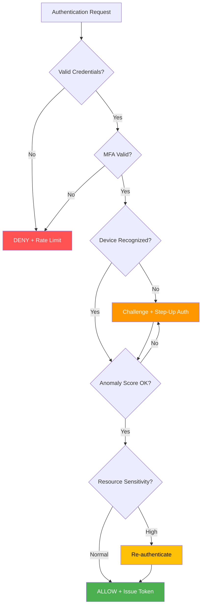
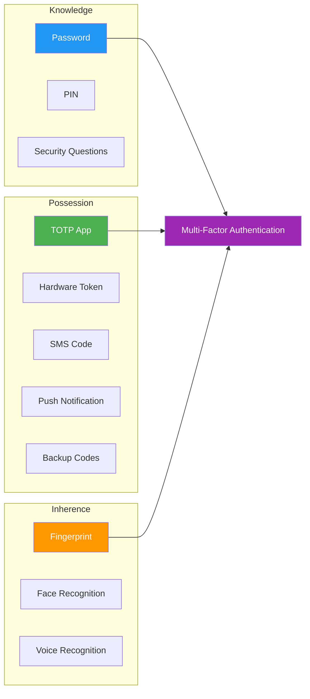
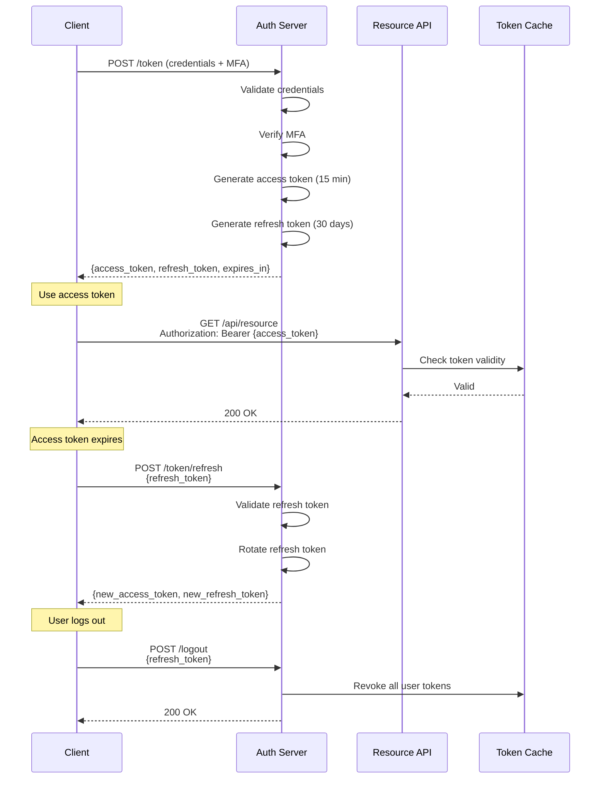
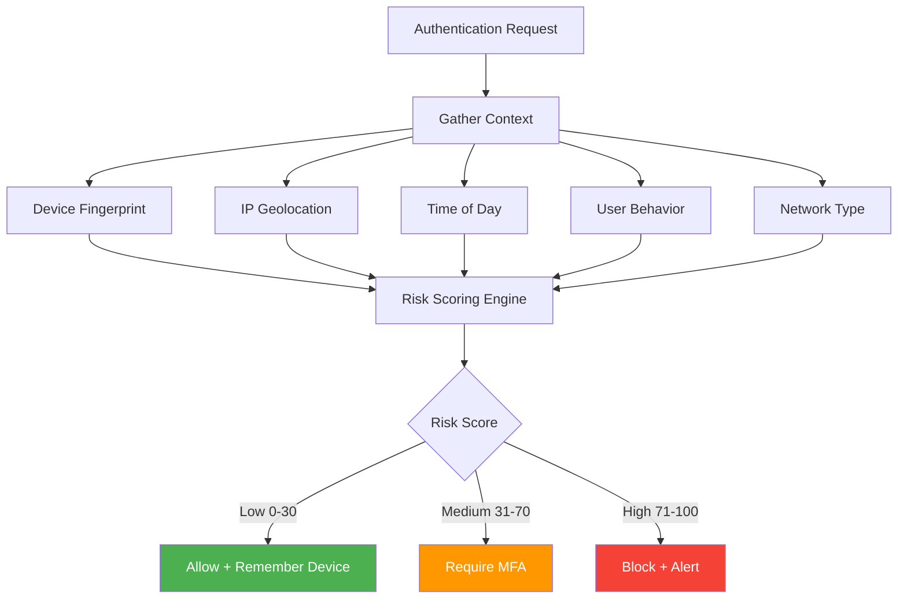
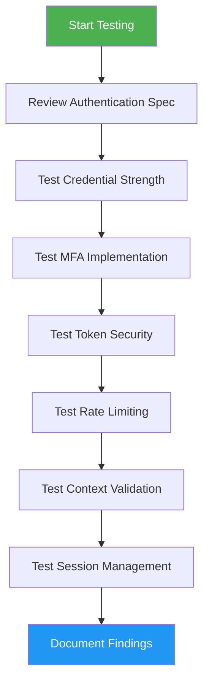

# Authentication Hardening

> **Authentication hardening is the process of implementing multiple defensive layers to ensure that only legitimate, authorized principals gain access to your API — and that compromise of any single factor or secret does not result in total authentication bypass.**

---

## 🧠 What Is It? (Beginner Explanation)

Think of authentication hardening like fortifying a bank vault:

- **Single lock** = username and password only (weak)
- **Multi-factor entry** = card + PIN + biometric (better)
- **Defense in depth** = multiple checkpoints, monitoring, anomaly detection, time-based restrictions, session controls (best)

In API security, authentication hardening means:

1. **Not trusting a single credential** — requiring multiple independent factors
2. **Not trusting the credential alone** — validating context (IP, device, time, behavior)
3. **Not trusting forever** — enforcing token expiration, rotation, and revocation
4. **Not trusting without monitoring** — detecting anomalies, brute force, credential stuffing

> The goal is to make authentication compromise **expensive, detectable, and recoverable** — not just "possible if you get the password."

---

## 🔍 Why Authentication Hardening Matters

Authentication is the **primary trust boundary** for APIs. When authentication fails, everything downstream fails with it.

### Common Authentication Weaknesses

| Weakness | Real-World Impact |
|----------|-------------------|
| **Weak password policy** | Brute force, credential stuffing, dictionary attacks succeed |
| **Single-factor authentication** | Stolen credentials = full compromise |
| **No rate limiting** | Automated attacks can test millions of credentials |
| **Static API keys never rotated** | Leaked keys remain valid indefinitely |
| **Weak token generation** | Predictable tokens can be guessed or enumerated |
| **No session invalidation** | Stolen tokens work forever |
| **Missing context validation** | Tokens work from anywhere, any device, any time |
| **No anomaly detection** | Compromised accounts go unnoticed for months |

### Defense Philosophy



**Key principle:** Authentication should not be binary (yes/no). It should be **continuous, contextual, and risk-adaptive**.

---

## 🏗️ Authentication Hardening Layers

### Layer 1: Credential Strength

Strong credentials are the foundation. Weak foundations collapse under pressure.

#### Password Policy (User Authentication)

```yaml
# Modern password policy (NIST SP 800-63B compliant)
password_requirements:
  min_length: 12               # Longer is better than complex
  max_length: 128              # Support passphrases
  complexity: false            # No forced special characters (encourages weak patterns)
  
  blacklist:
    - common_passwords         # Top 10k from HaveIBeenPwned
    - dictionary_words         # English + localized dictionaries
    - context_specific:        # No "CompanyName123"
        - organization_name
        - product_names
        - username_variants
  
  breach_check:
    enabled: true
    provider: "HaveIBeenPwned API (k-anonymity)"
    action: "reject_if_breached"
  
  expiration:
    forced_rotation: false      # Encourages predictable patterns (Winter2024!)
    rotate_on_breach: true      # Only when compromised
    
  history:
    prevent_reuse: 5            # Last 5 passwords
```

**Why this matters:**

| Old Policy (Bad) | Modern Policy (Good) |
|-----------------|----------------------|
| "8+ chars, 1 upper, 1 number, 1 special" | "12+ chars, check against breach database" |
| Leads to: `Password1!` | Leads to: `correct-horse-battery-staple` |
| Rotate every 90 days | Rotate only on breach or suspicion |
| Users write it down or use simple patterns | Users can remember passphrases |

#### API Key Strength (Service Authentication)

```python
# Secure API key generation
import secrets
import hashlib
import base64

def generate_api_key():
    """
    Generate cryptographically secure API key.
    
    Returns:
        tuple: (key_id, secret_key, hashed_secret)
    """
    # 256 bits of entropy for the secret
    secret_bytes = secrets.token_bytes(32)
    
    # Base64url encode for safe transmission
    secret_key = base64.urlsafe_b64encode(secret_bytes).decode('ascii').rstrip('=')
    
    # Store only the hash, never the plaintext
    hashed = hashlib.sha256(secret_bytes).hexdigest()
    
    # Separate key ID for lookup (not secret)
    key_id = f"ak_{secrets.token_hex(16)}"
    
    return key_id, secret_key, hashed

# Example output:
# key_id:  ak_7f3c9e2b8a1d4f6e9c0b3a5d8e1f4c7b
# secret:  kZXvG9mN8pQ2wR5tY7uI0oP3aS6dF9gH1jK4lM7nB8vC (show once)
# stored:  e3b0c44298fc1c149afbf4c8996fb92427ae41e4649b934ca495991b7852b855 (hash)
```

**API Key Best Practices:**

| Practice | Why |
|----------|-----|
| **256+ bits entropy** | Prevents brute force |
| **Cryptographically random** | Prevents prediction |
| **Store only hash** | Leaked database doesn't expose keys |
| **Prefix with type** | `ak_` (API key), `sk_` (secret key) for detection in logs/repos |
| **One-time display** | User must save it immediately |
| **Support multiple keys** | Allow rotation without downtime |

---

### Layer 2: Multi-Factor Authentication (MFA)

MFA is the **most effective** authentication control. Even if credentials leak, the attacker still cannot authenticate.

#### MFA Factor Types



#### MFA Strength Ranking

| Factor | Strength | Phishing Resistant? | Recommended |
|--------|----------|---------------------|-------------|
| **FIDO2/WebAuthn** | ⭐⭐⭐⭐⭐ | ✅ Yes | ✅ Best choice |
| **Hardware TOTP (YubiKey)** | ⭐⭐⭐⭐⭐ | ✅ Yes | ✅ Best choice |
| **TOTP App (Authy, Google Auth)** | ⭐⭐⭐⭐ | ⚠️ No | ✅ Good |
| **Push Notification (Duo, Okta)** | ⭐⭐⭐ | ⚠️ No (prompt bombing) | ⚠️ OK with number matching |
| **SMS OTP** | ⭐⭐ | ❌ No (SIM swap, intercept) | ❌ Avoid if possible |
| **Email OTP** | ⭐⭐ | ❌ No | ❌ Avoid if possible |
| **Security Questions** | ⭐ | ❌ No | ❌ Never use |

#### TOTP Implementation (Time-based One-Time Password)

```python
import pyotp
import qrcode
import time

def setup_totp_for_user(user_id, issuer_name="MyAPI"):
    """
    Set up TOTP for a user.
    
    Returns:
        dict: Setup information including secret and QR code
    """
    # Generate secure random secret (base32 encoded)
    secret = pyotp.random_base32()
    
    # Create TOTP object
    totp = pyotp.TOTP(secret)
    
    # Generate provisioning URI for QR code
    provisioning_uri = totp.provisioning_uri(
        name=user_id,
        issuer_name=issuer_name
    )
    
    # Generate QR code
    qr = qrcode.make(provisioning_uri)
    
    return {
        'secret': secret,              # Store encrypted in database
        'provisioning_uri': provisioning_uri,
        'qr_code': qr,
        'backup_codes': generate_backup_codes()
    }

def verify_totp(secret, user_code):
    """
    Verify TOTP code with time window tolerance.
    
    Args:
        secret: User's TOTP secret
        user_code: 6-digit code entered by user
    
    Returns:
        bool: True if valid
    """
    totp = pyotp.TOTP(secret)
    
    # Verify with ±1 time window (30 sec before/after)
    # Compensates for clock skew
    return totp.verify(user_code, valid_window=1)

def generate_backup_codes(count=10):
    """Generate single-use backup codes."""
    import secrets
    codes = []
    for _ in range(count):
        # 8 character alphanumeric codes
        code = ''.join(secrets.choice('ABCDEFGHJKLMNPQRSTUVWXYZ23456789') 
                      for _ in range(8))
        codes.append(code)
    return codes
```

#### MFA Enforcement Strategy

```yaml
# MFA policy configuration
mfa_policy:
  enforcement:
    admin_users: required              # Always require for privileged access
    regular_users: optional_prompt     # Prompt to enable, incentivize
    service_accounts: not_applicable   # Use mTLS or sender-constrained tokens
    
  allowed_factors:
    - webauthn                         # FIDO2 security keys
    - totp                             # Authenticator apps
    - backup_codes                     # Recovery codes (single-use)
    
  disallowed_factors:
    - sms                              # Too vulnerable to SIM swap
    - security_questions               # Too vulnerable to social engineering
    
  grace_period:
    new_users: 7_days                  # Time to set up MFA
    existing_users: 30_days            # Migration period
    
  step_up_authentication:
    sensitive_operations:
      - delete_account
      - change_email
      - export_data
      - modify_mfa_settings
    require_recent_mfa: 5_minutes      # Must re-authenticate
    
  trusted_devices:
    enabled: true
    remember_for: 30_days              # Don't re-prompt on trusted devices
    max_trusted: 5                     # Limit per user
```

---

### Layer 3: Token Security

Modern APIs use tokens (JWT, OAuth access tokens, session tokens). Token compromise is authentication compromise.

#### Token Hardening Checklist

| Control | Implementation | Why |
|---------|---------------|-----|
| **Short-lived access tokens** | 15-60 minutes | Limits blast radius if stolen |
| **Refresh token rotation** | New refresh token per use | Detects token replay |
| **Sender-constrained tokens** | DPoP, mTLS, certificate-bound | Token only works from original client |
| **Audience validation** | Check `aud` claim | Prevents cross-API token reuse |
| **Issuer validation** | Check `iss` claim | Prevents forged tokens |
| **Algorithm validation** | Enforce RS256/ES256 | Prevents `alg: none` attacks |
| **Token revocation** | Maintain revocation list | Invalidate on logout/compromise |
| **Secure token storage** | HttpOnly cookies or secure keychain | Prevents XSS token theft |

#### JWT Security Implementation

```python
import jwt
import datetime
from cryptography.hazmat.primitives import serialization
from cryptography.hazmat.primitives.asymmetric import rsa

class SecureJWT:
    """Secure JWT generation and validation."""
    
    def __init__(self, private_key, public_key, issuer, audience):
        self.private_key = private_key
        self.public_key = public_key
        self.issuer = issuer
        self.audience = audience
    
    def create_access_token(self, subject, scopes, expires_in=900):
        """
        Create short-lived access token.
        
        Args:
            subject: User/service identifier
            scopes: List of granted scopes
            expires_in: Seconds until expiration (default 15 min)
        """
        now = datetime.datetime.utcnow()
        
        payload = {
            # Standard claims
            'iss': self.issuer,              # Issuer
            'sub': subject,                   # Subject (user ID)
            'aud': self.audience,             # Intended audience
            'exp': now + datetime.timedelta(seconds=expires_in),
            'iat': now,                       # Issued at
            'nbf': now,                       # Not before
            'jti': self._generate_jti(),     # Unique token ID
            
            # Custom claims
            'scopes': scopes,
            'token_type': 'access'
        }
        
        # Sign with RS256 (asymmetric - more secure than HS256)
        token = jwt.encode(
            payload,
            self.private_key,
            algorithm='RS256',
            headers={'kid': self._get_key_id()}  # Key ID for rotation
        )
        
        return token
    
    def verify_token(self, token, required_scopes=None):
        """
        Verify and decode token with comprehensive validation.
        
        Args:
            token: JWT to verify
            required_scopes: Optional list of required scopes
            
        Returns:
            dict: Decoded payload if valid
            
        Raises:
            jwt.InvalidTokenError: If validation fails
        """
        try:
            # Decode and validate
            payload = jwt.decode(
                token,
                self.public_key,
                algorithms=['RS256'],          # Only allow RS256
                issuer=self.issuer,            # Validate issuer
                audience=self.audience,        # Validate audience
                options={
                    'require_exp': True,       # Require expiration
                    'require_iat': True,       # Require issued-at
                    'require_nbf': True,       # Require not-before
                    'verify_signature': True,  # Always verify signature
                    'verify_exp': True,
                    'verify_nbf': True,
                    'verify_iat': True,
                    'verify_aud': True,
                    'verify_iss': True
                }
            )
            
            # Check revocation list
            if self._is_revoked(payload['jti']):
                raise jwt.InvalidTokenError("Token has been revoked")
            
            # Validate scopes if required
            if required_scopes:
                token_scopes = set(payload.get('scopes', []))
                if not set(required_scopes).issubset(token_scopes):
                    raise jwt.InvalidTokenError("Insufficient scopes")
            
            return payload
            
        except jwt.ExpiredSignatureError:
            raise jwt.InvalidTokenError("Token has expired")
        except jwt.InvalidAudienceError:
            raise jwt.InvalidTokenError("Invalid audience")
        except jwt.InvalidIssuerError:
            raise jwt.InvalidTokenError("Invalid issuer")
        except jwt.InvalidAlgorithmError:
            raise jwt.InvalidTokenError("Invalid algorithm")
    
    def _generate_jti(self):
        """Generate unique token ID."""
        import secrets
        return secrets.token_hex(16)
    
    def _get_key_id(self):
        """Get key identifier for rotation."""
        return "key-2024-01"  # Rotate periodically
    
    def _is_revoked(self, jti):
        """Check if token is revoked (implement with Redis/database)."""
        # Example: Check Redis revocation list
        # return redis.sismember('revoked_tokens', jti)
        return False
```

#### Token Lifecycle Management



---

### Layer 4: Rate Limiting & Brute Force Protection

Even strong credentials fail if attackers can guess forever.

#### Rate Limiting Strategy

```yaml
# Multi-tier rate limiting configuration
rate_limits:
  
  # Layer 1: Per-IP limits (before authentication)
  authentication_attempts:
    endpoint: /auth/login
    per_ip:
      max_attempts: 5
      window: 15_minutes
      action: temporary_block
      block_duration: 30_minutes
    
    per_username:
      max_attempts: 10         # Higher than per-IP (distributed attacks)
      window: 1_hour
      action: account_lock_soft
      notification: send_email
  
  # Layer 2: Token-based API limits (after authentication)
  api_requests:
    default:
      per_token: 1000
      window: 1_hour
      
    sensitive_endpoints:
      endpoints:
        - /user/delete
        - /user/export
        - /admin/*
      per_token: 10
      window: 1_hour
      require_step_up_auth: true
  
  # Layer 3: Global circuit breaker
  global:
    max_failed_auth_per_second: 100    # Credential stuffing detection
    action: enable_captcha_all

# Progressive response
progressive_delays:
  attempt_1_3: 0_seconds               # Normal response time
  attempt_4_5: 2_seconds               # Slow down attacker
  attempt_6_10: 5_seconds              # Significant delay
  attempt_11_plus: 30_seconds          # Severe throttling
```

#### Implementation Example (Redis-based)

```python
import redis
import time
import hashlib
from datetime import datetime, timedelta

class RateLimiter:
    """Redis-based rate limiting for authentication."""
    
    def __init__(self, redis_client):
        self.redis = redis_client
    
    def check_rate_limit(self, identifier, max_attempts, window_seconds):
        """
        Check if identifier has exceeded rate limit.
        
        Args:
            identifier: IP, username, or token
            max_attempts: Maximum allowed attempts
            window_seconds: Time window in seconds
            
        Returns:
            dict: {allowed: bool, remaining: int, retry_after: int}
        """
        key = f"ratelimit:{identifier}"
        now = time.time()
        window_start = now - window_seconds
        
        # Use sorted set to track attempts with timestamps
        pipe = self.redis.pipeline()
        
        # Remove old attempts outside window
        pipe.zremrangebyscore(key, 0, window_start)
        
        # Count attempts in current window
        pipe.zcard(key)
        
        # Add current attempt
        pipe.zadd(key, {str(now): now})
        
        # Set expiration
        pipe.expire(key, window_seconds)
        
        results = pipe.execute()
        current_attempts = results[1]
        
        allowed = current_attempts < max_attempts
        remaining = max(0, max_attempts - current_attempts - 1)
        
        retry_after = 0
        if not allowed:
            # Calculate when oldest attempt will expire
            oldest = self.redis.zrange(key, 0, 0, withscores=True)
            if oldest:
                retry_after = int(oldest[0][1] + window_seconds - now)
        
        return {
            'allowed': allowed,
            'remaining': remaining,
            'retry_after': retry_after,
            'reset_at': int(now + window_seconds)
        }
    
    def block_ip(self, ip_address, duration_seconds):
        """Block IP address temporarily."""
        key = f"blocked_ip:{ip_address}"
        self.redis.setex(key, duration_seconds, "blocked")
    
    def is_blocked(self, ip_address):
        """Check if IP is blocked."""
        return self.redis.exists(f"blocked_ip:{ip_address}")

# Usage in authentication endpoint
def login_handler(request, rate_limiter):
    """Example login handler with rate limiting."""
    ip = request.remote_addr
    username = request.json.get('username')
    
    # Check IP-based rate limit
    ip_limit = rate_limiter.check_rate_limit(
        identifier=f"ip:{ip}",
        max_attempts=5,
        window_seconds=900  # 15 minutes
    )
    
    if not ip_limit['allowed']:
        return {
            'error': 'Too many attempts',
            'retry_after': ip_limit['retry_after']
        }, 429
    
    # Check username-based rate limit
    username_limit = rate_limiter.check_rate_limit(
        identifier=f"user:{username}",
        max_attempts=10,
        window_seconds=3600  # 1 hour
    )
    
    if not username_limit['allowed']:
        # Send alert - possible credential stuffing
        send_security_alert(username, "Multiple failed login attempts")
        return {
            'error': 'Account temporarily locked',
            'retry_after': username_limit['retry_after']
        }, 429
    
    # Proceed with authentication...
```

---

### Layer 5: Contextual Authentication

Authentication should consider **context** — not just credentials.

#### Context Signals



#### Risk-Based Authentication

```python
import geoip2.database
from user_agents import parse
import math

class RiskScoreCalculator:
    """Calculate authentication risk score based on context."""
    
    def __init__(self, geoip_db_path):
        self.geoip = geoip2.database.Reader(geoip_db_path)
    
    def calculate_risk(self, user_id, request_context):
        """
        Calculate risk score 0-100.
        
        Args:
            user_id: User identifier
            request_context: Dict with IP, user_agent, timestamp, etc.
            
        Returns:
            dict: Risk score and contributing factors
        """
        risk_factors = {}
        total_risk = 0
        
        # Factor 1: Unusual location (0-30 points)
        location_risk = self._check_location_risk(user_id, request_context['ip'])
        risk_factors['location'] = location_risk
        total_risk += location_risk
        
        # Factor 2: New device (0-20 points)
        device_risk = self._check_device_risk(user_id, request_context['user_agent'])
        risk_factors['device'] = device_risk
        total_risk += device_risk
        
        # Factor 3: Unusual time (0-15 points)
        time_risk = self._check_time_risk(user_id, request_context['timestamp'])
        risk_factors['time'] = time_risk
        total_risk += time_risk
        
        # Factor 4: Velocity (0-20 points)
        velocity_risk = self._check_velocity_risk(user_id, request_context['ip'])
        risk_factors['velocity'] = velocity_risk
        total_risk += velocity_risk
        
        # Factor 5: Tor/VPN/Proxy (0-15 points)
        anonymity_risk = self._check_anonymity_risk(request_context['ip'])
        risk_factors['anonymity'] = anonymity_risk
        total_risk += anonymity_risk
        
        return {
            'score': min(100, total_risk),
            'factors': risk_factors,
            'action': self._determine_action(total_risk)
        }
    
    def _check_location_risk(self, user_id, ip):
        """Check if location is unusual for this user."""
        try:
            response = self.geoip.city(ip)
            country = response.country.iso_code
            city = response.city.name
            
            # Get user's typical locations (from database)
            typical_locations = self._get_user_locations(user_id)
            
            if not typical_locations:
                # First login - medium risk
                return 15
            
            if country not in [loc['country'] for loc in typical_locations]:
                # New country - high risk
                return 30
            
            if city not in [loc['city'] for loc in typical_locations]:
                # New city in known country - medium risk
                return 15
            
            # Known location - low risk
            return 0
            
        except:
            # Cannot determine location - medium risk
            return 10
    
    def _check_device_risk(self, user_id, user_agent_string):
        """Check if device is recognized."""
        ua = parse(user_agent_string)
        
        # Generate device fingerprint
        fingerprint = f"{ua.browser.family}:{ua.os.family}:{ua.device.family}"
        
        known_devices = self._get_user_devices(user_id)
        
        if fingerprint not in known_devices:
            return 20  # New device
        
        return 0  # Known device
    
    def _check_time_risk(self, user_id, timestamp):
        """Check if login time is unusual."""
        hour = timestamp.hour
        
        # Get user's typical login hours
        typical_hours = self._get_user_login_pattern(user_id)
        
        if not typical_hours:
            return 0  # No pattern yet
        
        if hour in typical_hours:
            return 0  # Typical time
        
        # Off-hours login
        if 2 <= hour <= 6:
            return 15  # Very unusual (3am-6am)
        
        return 8  # Somewhat unusual
    
    def _check_velocity_risk(self, user_id, current_ip):
        """Check for impossible travel."""
        last_auth = self._get_last_authentication(user_id)
        
        if not last_auth:
            return 0
        
        # Calculate time since last auth
        time_diff = (datetime.utcnow() - last_auth['timestamp']).total_seconds()
        
        if time_diff < 300:  # Less than 5 minutes
            # Check if IPs are geographically distant
            distance_km = self._get_distance_between_ips(last_auth['ip'], current_ip)
            
            if distance_km > 500:  # More than 500km in 5 minutes = impossible
                return 20
        
        return 0
    
    def _check_anonymity_risk(self, ip):
        """Check if IP is Tor/VPN/proxy."""
        # Use service like IPHub, IPQualityScore, or internal database
        is_vpn = self._check_ip_reputation(ip)
        
        if is_vpn:
            return 15  # Higher risk (legitimate or malicious)
        
        return 0
    
    def _determine_action(self, risk_score):
        """Determine action based on risk score."""
        if risk_score >= 70:
            return "BLOCK"
        elif risk_score >= 40:
            return "REQUIRE_MFA"
        elif risk_score >= 20:
            return "CHALLENGE"
        else:
            return "ALLOW"
    
    # Placeholder methods (implement with actual database)
    def _get_user_locations(self, user_id):
        return []
    
    def _get_user_devices(self, user_id):
        return []
    
    def _get_user_login_pattern(self, user_id):
        return []
    
    def _get_last_authentication(self, user_id):
        return None
    
    def _get_distance_between_ips(self, ip1, ip2):
        return 0
    
    def _check_ip_reputation(self, ip):
        return False
```

---

### Layer 6: Session Management

Secure session management prevents token replay, session fixation, and session hijacking.

#### Session Security Checklist

| Control | Implementation | Rationale |
|---------|---------------|-----------|
| **Secure token generation** | Cryptographically random (32+ bytes) | Prevents prediction/guessing |
| **HTTPOnly cookies** | Set `HttpOnly` flag | Prevents JavaScript access (XSS protection) |
| **Secure flag** | Set `Secure` flag | Forces HTTPS-only transmission |
| **SameSite attribute** | `SameSite=Strict` or `Lax` | Prevents CSRF |
| **Session expiration** | Absolute + idle timeout | Limits window of compromise |
| **Session fixation protection** | Regenerate session ID on login | Prevents pre-set session attacks |
| **Concurrent session limits** | Max N sessions per user | Detects account sharing/compromise |
| **Logout invalidation** | Clear session on server | Prevents reuse of old tokens |
| **Device binding** | Tie session to device fingerprint | Prevents session hijacking |

#### Secure Session Implementation

```python
from datetime import datetime, timedelta
import secrets
import hashlib

class SessionManager:
    """Secure session management."""
    
    def __init__(self, redis_client):
        self.redis = redis_client
        self.absolute_timeout = 86400  # 24 hours
        self.idle_timeout = 3600       # 1 hour
        self.max_sessions_per_user = 5
    
    def create_session(self, user_id, device_fingerprint, ip_address):
        """
        Create new session with security controls.
        
        Returns:
            str: Session token
        """
        # Generate cryptographically secure session ID
        session_token = secrets.token_urlsafe(32)
        
        # Hash token for storage (store hash, not plaintext)
        session_id = hashlib.sha256(session_token.encode()).hexdigest()
        
        now = datetime.utcnow()
        
        session_data = {
            'user_id': user_id,
            'session_id': session_id,
            'device_fingerprint': device_fingerprint,
            'ip_address': ip_address,
            'created_at': now.isoformat(),
            'last_activity': now.isoformat(),
            'expires_at': (now + timedelta(seconds=self.absolute_timeout)).isoformat()
        }
        
        # Store session
        self.redis.setex(
            f"session:{session_id}",
            self.absolute_timeout,
            json.dumps(session_data)
        )
        
        # Track user's active sessions
        self.redis.sadd(f"user_sessions:{user_id}", session_id)
        
        # Enforce max sessions per user
        self._enforce_session_limit(user_id)
        
        return session_token
    
    def validate_session(self, session_token, device_fingerprint, ip_address):
        """
        Validate session with security checks.
        
        Returns:
            dict: Session data if valid, None otherwise
        """
        # Hash token to lookup
        session_id = hashlib.sha256(session_token.encode()).hexdigest()
        
        # Retrieve session
        session_json = self.redis.get(f"session:{session_id}")
        if not session_json:
            return None  # Session not found or expired
        
        session = json.loads(session_json)
        
        # Check device binding
        if session['device_fingerprint'] != device_fingerprint:
            self._flag_suspicious_activity(session['user_id'], "Device mismatch")
            return None
        
        # Check IP address (optional - may change legitimately)
        if session['ip_address'] != ip_address:
            # Log but don't reject (mobile users change IPs)
            self._log_ip_change(session['user_id'], session['ip_address'], ip_address)
        
        # Check idle timeout
        last_activity = datetime.fromisoformat(session['last_activity'])
        if (datetime.utcnow() - last_activity).total_seconds() > self.idle_timeout:
            self.destroy_session(session_id)
            return None  # Idle timeout exceeded
        
        # Update last activity (sliding window)
        session['last_activity'] = datetime.utcnow().isoformat()
        self.redis.setex(
            f"session:{session_id}",
            self.absolute_timeout,
            json.dumps(session)
        )
        
        return session
    
    def destroy_session(self, session_id):
        """Invalidate session."""
        session_json = self.redis.get(f"session:{session_id}")
        if session_json:
            session = json.loads(session_json)
            self.redis.delete(f"session:{session_id}")
            self.redis.srem(f"user_sessions:{session['user_id']}", session_id)
    
    def destroy_all_user_sessions(self, user_id):
        """Destroy all sessions for a user (e.g., on password change)."""
        session_ids = self.redis.smembers(f"user_sessions:{user_id}")
        for session_id in session_ids:
            self.redis.delete(f"session:{session_id}")
        self.redis.delete(f"user_sessions:{user_id}")
    
    def _enforce_session_limit(self, user_id):
        """Enforce maximum concurrent sessions."""
        session_ids = list(self.redis.smembers(f"user_sessions:{user_id}"))
        
        if len(session_ids) > self.max_sessions_per_user:
            # Get session creation times and remove oldest
            sessions_with_time = []
            for sid in session_ids:
                session_json = self.redis.get(f"session:{sid}")
                if session_json:
                    session = json.loads(session_json)
                    sessions_with_time.append((sid, session['created_at']))
            
            # Sort by created_at and remove oldest
            sessions_with_time.sort(key=lambda x: x[1])
            excess = len(sessions_with_time) - self.max_sessions_per_user
            
            for sid, _ in sessions_with_time[:excess]:
                self.destroy_session(sid)
    
    def _flag_suspicious_activity(self, user_id, reason):
        """Flag suspicious session activity."""
        # Send alert, log to SIEM, etc.
        pass
    
    def _log_ip_change(self, user_id, old_ip, new_ip):
        """Log IP address change."""
        # Track for analysis
        pass
```

---

## 🛡️ Defense Matrix

### Complete Authentication Hardening Checklist

| Layer | Control | Priority | Effort | Impact |
|-------|---------|----------|--------|--------|
| **Credentials** | Strong password policy (12+ chars, breach check) | 🔴 Critical | Low | High |
| **Credentials** | API key entropy (256+ bits, crypto random) | 🔴 Critical | Low | High |
| **MFA** | TOTP or FIDO2 for all users | 🔴 Critical | Medium | Very High |
| **MFA** | Backup codes for recovery | 🟡 High | Low | Medium |
| **MFA** | Step-up auth for sensitive operations | 🟡 High | Medium | High |
| **Tokens** | Short-lived access tokens (15-60 min) | 🔴 Critical | Low | High |
| **Tokens** | Refresh token rotation | 🔴 Critical | Medium | High |
| **Tokens** | Sender-constrained tokens (DPoP/mTLS) | 🟡 High | High | Very High |
| **Tokens** | Comprehensive JWT validation | 🔴 Critical | Low | High |
| **Tokens** | Token revocation capability | 🔴 Critical | Medium | High |
| **Rate Limiting** | Per-IP authentication rate limits | 🔴 Critical | Low | High |
| **Rate Limiting** | Per-username rate limits | 🔴 Critical | Low | High |
| **Rate Limiting** | Progressive delays | 🟡 High | Low | Medium |
| **Rate Limiting** | Global circuit breaker | 🟡 High | Medium | Medium |
| **Context** | Device fingerprinting | 🟢 Medium | Medium | Medium |
| **Context** | IP geolocation tracking | 🟢 Medium | Low | Medium |
| **Context** | Impossible travel detection | 🟡 High | Medium | High |
| **Context** | Risk-based authentication | 🟡 High | High | High |
| **Session** | Secure random session IDs | 🔴 Critical | Low | High |
| **Session** | HTTPOnly + Secure + SameSite cookies | 🔴 Critical | Low | High |
| **Session** | Idle and absolute timeouts | 🔴 Critical | Low | Medium |
| **Session** | Session regeneration on login | 🔴 Critical | Low | High |
| **Session** | Concurrent session limits | 🟡 High | Low | Medium |
| **Monitoring** | Failed authentication logging | 🔴 Critical | Low | High |
| **Monitoring** | Anomaly detection alerts | 🟡 High | Medium | High |
| **Monitoring** | Account takeover detection | 🟡 High | High | Very High |

---

## 🔧 Testing Authentication Hardening

### Authorized Testing Methodology



### Test Cases

#### 1. Password Policy Testing

```bash
# Test weak password rejection
curl -X POST https://api.example.com/auth/register \
  -H "Content-Type: application/json" \
  -d '{
    "username": "testuser",
    "password": "password123"
  }'

# Expected: 400 Bad Request - "Password does not meet requirements"

# Test breached password rejection
curl -X POST https://api.example.com/auth/register \
  -H "Content-Type: application/json" \
  -d '{
    "username": "testuser",
    "password": "P@ssw0rd123"
  }'

# Expected: 400 Bad Request - "Password found in breach database"

# Test acceptable password
curl -X POST https://api.example.com/auth/register \
  -H "Content-Type: application/json" \
  -d '{
    "username": "testuser",
    "password": "correct-horse-battery-staple-2024"
  }'

# Expected: 201 Created
```

#### 2. MFA Bypass Testing

```bash
# Attempt to skip MFA with valid credentials
curl -X POST https://api.example.com/auth/login \
  -H "Content-Type: application/json" \
  -d '{
    "username": "testuser@example.com",
    "password": "correct-password"
  }'

# Expected response should NOT include full access token
# Should return: {"status": "mfa_required", "session_token": "temp_token"}

# Attempt to use temp token for API access
curl https://api.example.com/api/protected \
  -H "Authorization: Bearer <temp_token>"

# Expected: 401 Unauthorized - "MFA verification required"

# Complete MFA flow
curl -X POST https://api.example.com/auth/mfa/verify \
  -H "Content-Type: application/json" \
  -d '{
    "session_token": "temp_token",
    "totp_code": "123456"
  }'

# Expected: {"access_token": "...", "refresh_token": "..."}
```

#### 3. Rate Limiting Testing

```bash
# Test rate limiting (bash loop)
for i in {1..10}; do
  echo "Attempt $i:"
  curl -X POST https://api.example.com/auth/login \
    -H "Content-Type: application/json" \
    -d '{
      "username": "testuser@example.com",
      "password": "wrong-password"
    }' \
    -w "\nHTTP Status: %{http_code}\n" \
    -s
  sleep 1
done

# Expected:
# Attempts 1-5: 401 Unauthorized (invalid credentials)
# Attempts 6+: 429 Too Many Requests (rate limited)
# Response should include Retry-After header
```

#### 4. Token Validation Testing

```python
import jwt
import requests

# Test algorithm confusion
header = {"alg": "none"}
payload = {
    "sub": "testuser",
    "aud": "https://api.example.com",
    "iss": "https://auth.example.com",
    "exp": 9999999999
}

# Create unsigned token
token = jwt.encode(payload, "", algorithm="none")

response = requests.get(
    "https://api.example.com/api/protected",
    headers={"Authorization": f"Bearer {token}"}
)

# Expected: 401 Unauthorized - "Invalid token signature"

# Test audience mismatch
valid_token_for_different_api = "eyJ..."

response = requests.get(
    "https://api.example.com/api/protected",
    headers={"Authorization": f"Bearer {valid_token_for_different_api}"}
)

# Expected: 401 Unauthorized - "Invalid audience"

# Test expired token
expired_token = "eyJ..."  # Valid but expired

response = requests.get(
    "https://api.example.com/api/protected",
    headers={"Authorization": f"Bearer {expired_token}"}
)

# Expected: 401 Unauthorized - "Token expired"
```

#### 5. Session Security Testing

```bash
# Test session fixation
# 1. Obtain session ID before login
curl -i https://api.example.com/auth/login

# Extract Set-Cookie: session_id=abc123

# 2. Login with valid credentials
curl -X POST https://api.example.com/auth/login \
  -H "Cookie: session_id=abc123" \
  -H "Content-Type: application/json" \
  -d '{"username": "user", "password": "pass"}'

# Expected: New session_id in Set-Cookie (should NOT reuse abc123)

# Test concurrent session limit
# Open 6+ sessions for same user
# Expected: Oldest sessions should be invalidated
```

---

## 📚 References & Further Reading

### Industry Standards

- **NIST SP 800-63B** - Digital Identity Guidelines (Authentication and Lifecycle Management)
- **OWASP Authentication Cheat Sheet** - Comprehensive authentication security guide
- **NIST SP 800-63C** - Federation and Assertions
- **PCI DSS v4.0** - Requirements for authentication in payment systems

### RFCs & Specifications

- **RFC 6749** - OAuth 2.0 Authorization Framework
- **RFC 7519** - JSON Web Token (JWT)
- **RFC 8252** - OAuth 2.0 for Native Apps
- **RFC 9068** - JWT Profile for OAuth 2.0 Access Tokens
- **RFC 9449** - OAuth 2.0 Demonstrating Proof-of-Possession (DPoP)
- **WebAuthn Specification** - W3C Web Authentication API

### Tools & Libraries

| Tool | Purpose | URL |
|------|---------|-----|
| **PyOTP** | TOTP implementation (Python) | github.com/pyauth/pyotp |
| **Authy** | TOTP authenticator app | authy.com |
| **YubiKey** | Hardware security key | yubico.com |
| **Auth0** | Authentication platform | auth0.com |
| **Keycloak** | Open-source IAM | keycloak.org |
| **HaveIBeenPwned** | Breach database API | haveibeenpwned.com/API |
| **PyJWT** | JWT library (Python) | github.com/jpadilla/pyjwt |
| **redis-py** | Redis client (rate limiting) | github.com/redis/redis-py |

### Further Learning

- **OWASP Top 10 API Security 2023** - API1:2023 Broken Object Level Authorization
- **PortSwigger Web Security Academy** - Authentication vulnerabilities
- **JWT.io** - JWT debugger and library directory
- **OAuth.net** - OAuth 2.0 resources and tools

---

## ✅ Summary

Authentication hardening is **not** a single control — it is a **defense-in-depth strategy** combining:

1. **Strong credentials** (entropy, breach checking, rotation)
2. **Multi-factor authentication** (TOTP, FIDO2, backup codes)
3. **Token security** (short-lived, sender-constrained, validated comprehensively)
4. **Rate limiting** (per-IP, per-user, progressive delays)
5. **Contextual validation** (device, location, time, behavior)
6. **Session management** (secure generation, binding, expiration, limits)

**Key takeaway:**

> Assume credentials will be stolen. Design authentication to survive credential compromise through MFA, context validation, and anomaly detection.

When testing authentication, verify that:
- Single factor compromise does NOT grant access
- Tokens are validated comprehensively (signature, issuer, audience, expiration)
- Rate limiting prevents brute force
- Context changes trigger additional challenges
- Sessions expire and invalidate properly

**Remember:** Authentication is the gateway to your API. Harden it like you're protecting the keys to the kingdom — because you are.
