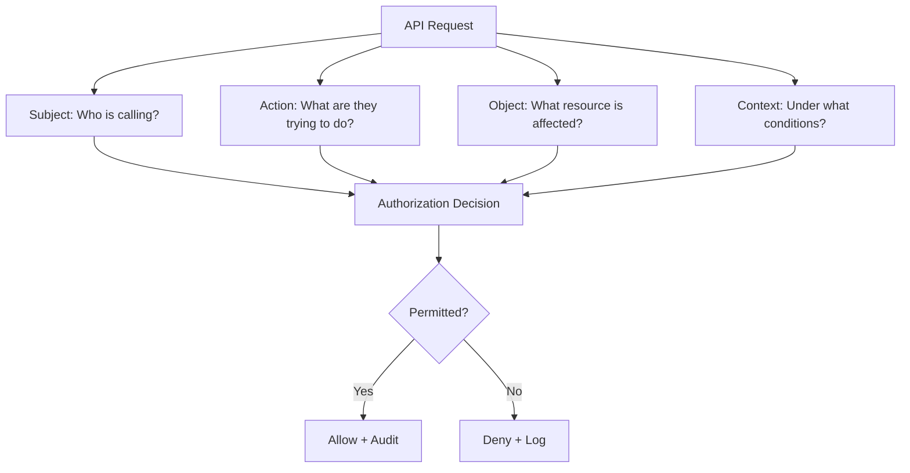
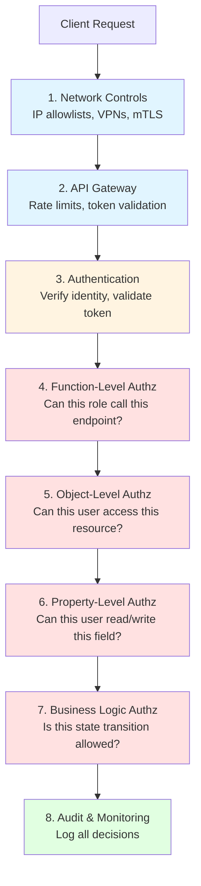
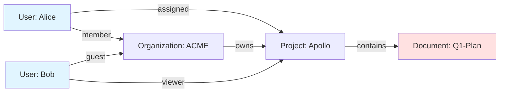
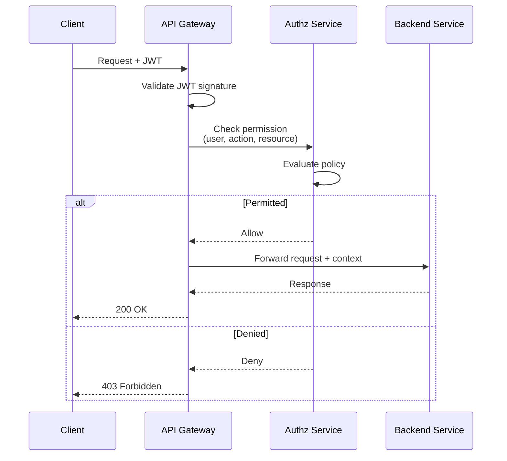
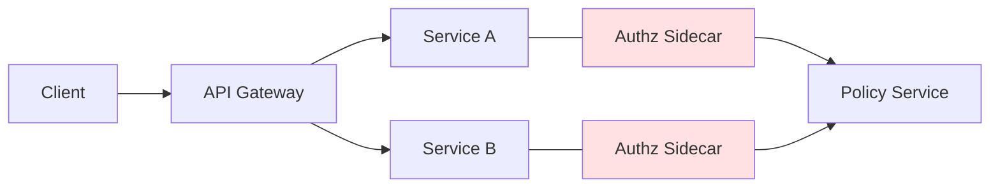
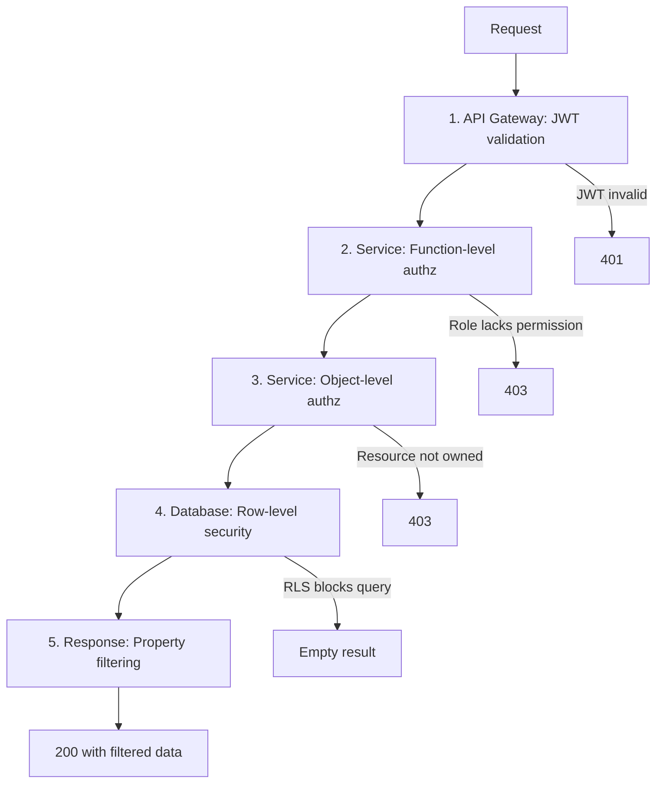

# Authorization Hardening

> **Authorization hardening is the practice of systematically strengthening API access controls to ensure that authenticated users can only perform actions on resources they legitimately own or are explicitly permitted to access, across all API endpoints, methods, and data flows.**

---

## 🧠 What Is It? (Beginner Explanation)

Imagine a hospital where:

- **Authentication** is your ID badge that proves you work there
- **Authorization** is the set of doors, systems, and files you can actually access

Even with a valid badge, a lab technician should not be able to:

- access payroll systems (function-level authorization)
- read another patient's records (object-level authorization)
- modify treatment dosages (property-level authorization)

**Authorization hardening** is the process of building, testing, and maintaining those boundaries in an API.

In APIs, authorization failures are the **most common** class of high-severity findings:

- **OWASP API Security Top 10 2023** lists three authorization issues in the top five:
  - **API1** — Broken Object Level Authorization (BOLA)
  - **API3** — Broken Object Property Level Authorization (BOPLA)
  - **API5** — Broken Function Level Authorization (BFLA)

Authorization hardening means ensuring those controls work correctly **before** attackers find gaps.

---

## 🔑 Core Authorization Concepts

| Concept | Question Answered | Example |
|---------|-------------------|---------|
| **Authentication** | Who are you? | "This JWT belongs to user `alice@example.com`" |
| **Function-level authorization** | Can you perform this action? | "Can Alice create admin invites?" |
| **Object-level authorization** | Can you access this specific resource? | "Can Alice read invoice `INV-5042`?" |
| **Property-level authorization** | Can you read/write this field? | "Can Alice modify the `role` field or view `salary`?" |
| **Contextual authorization** | Is this action allowed right now? | "Can Alice approve this transaction outside business hours?" |
| **Attribute-based authorization** | Do your attributes allow this? | "Can Alice access resources tagged `region:EU` from `region:US`?" |

### The Four-Dimensional Authorization Model

Every API request should be evaluated across four dimensions:



**Subject**: user identity, service account, API key holder, delegation chain  
**Action**: HTTP verb, GraphQL mutation, gRPC method, business operation  
**Object**: specific resource ID, tenant, workspace, file, record  
**Context**: time, location, device, workflow state, environment, rate limits

Missing any dimension creates authorization gaps.

---

## 🏗️ How Authorization Hardening Works

### The Defense-in-Depth Stack

Authorization hardening is not a single control—it is a layered strategy:



Each layer assumes the previous ones may fail or be bypassed.

---

## 📋 Authorization Hardening Checklist

### 1. Function-Level Authorization

Ensure every API endpoint enforces role/permission checks before executing sensitive operations.

| Control | Description | Implementation |
|---------|-------------|----------------|
| **Default deny** | No endpoint is accessible without explicit permission | All routes require authorization metadata |
| **Role-based access** | Map roles to allowed operations | Middleware checks `user.role` against endpoint policy |
| **Scope validation** | Validate OAuth scopes match endpoint requirements | Verify `token.scope` includes `read:invoices` for invoice endpoints |
| **Verb-specific policies** | Separate permissions for GET, POST, PUT, DELETE | Reading invoices ≠ creating invoices |
| **Admin endpoint isolation** | Admin functions require admin authentication | Separate JWT issuer, audience, or scope for admin tokens |

**Secure example (Node.js/Express):**

```javascript
// Define permissions per endpoint
const permissions = {
  'GET /api/invoices': ['user', 'admin'],
  'POST /api/invoices': ['admin', 'billing'],
  'DELETE /api/users/:id': ['admin']
};

// Authorization middleware
function authorize(requiredRoles) {
  return (req, res, next) => {
    const endpoint = `${req.method} ${req.route.path}`;
    const userRole = req.user?.role;
    
    if (!requiredRoles.includes(userRole)) {
      return res.status(403).json({ 
        error: 'Forbidden',
        message: 'Insufficient privileges for this operation'
      });
    }
    
    next();
  };
}

// Apply to routes
app.delete('/api/users/:id', 
  authenticate,
  authorize(['admin']),
  deleteUser
);
```

**Anti-pattern (vulnerable):**

```javascript
// VULNERABLE: Only checks authentication, not authorization
app.delete('/api/users/:id', authenticate, deleteUser);

// VULNERABLE: Authorization in client/frontend only
if (user.role === 'admin') {
  showAdminButton();  // UI hiding ≠ security
}
```

---

### 2. Object-Level Authorization (BOLA Prevention)

Verify the authenticated user has permission to access the **specific resource** referenced in the request.

| Control | Description | Implementation |
|---------|-------------|----------------|
| **Ownership verification** | Check `resource.owner_id === user.id` | Query resource with ownership filter |
| **Tenant isolation** | Ensure multi-tenant resources include tenant filter | Add `WHERE tenant_id = user.tenant_id` |
| **Access control lists (ACLs)** | Support shared/delegated access | Check resource ACL contains user or group |
| **Consistent checks** | Apply same logic to GET, PUT, PATCH, DELETE | Centralize resource ownership logic |
| **Opaque identifiers** | Use UUIDs, not sequential IDs | Reduces guessing, but still requires authorization |

**Secure example (Python/Flask):**

```python
from flask import abort, g
from functools import wraps

def require_resource_ownership(resource_loader):
    """Decorator to verify user owns the requested resource"""
    def decorator(f):
        @wraps(f)
        def decorated_function(*args, **kwargs):
            resource_id = kwargs.get('resource_id')
            resource = resource_loader(resource_id)
            
            if not resource:
                abort(404, description="Resource not found")
            
            # Critical: Check ownership or ACL
            if resource.owner_id != g.user.id:
                # Check if user has explicit access
                if not has_access(resource, g.user):
                    abort(403, description="Access denied to this resource")
            
            # Pass resource to handler to avoid redundant lookup
            kwargs['resource'] = resource
            return f(*args, **kwargs)
        return decorated_function
    return decorator

# Usage
@app.route('/api/invoices/<uuid:invoice_id>', methods=['GET'])
@require_authentication
@require_resource_ownership(lambda id: Invoice.query.get(id))
def get_invoice(invoice_id, invoice):
    return jsonify(invoice.to_dict())
```

**Secure multi-tenant pattern:**

```python
# GOOD: Tenant filter in every query
def get_user_invoices(user):
    return Invoice.query.filter_by(
        tenant_id=user.tenant_id,
        owner_id=user.id
    ).all()

# BAD: Missing tenant filter
def get_user_invoices_bad(user):
    return Invoice.query.filter_by(owner_id=user.id).all()
    # Vulnerable if owner_id is reused across tenants
```

---

### 3. Property-Level Authorization (BOPLA Prevention)

Control which fields users can read or modify, even when they have access to the resource.

| Control | Description | Implementation |
|---------|-------------|----------------|
| **Field-level ACLs** | Define readable/writable fields per role | Serialize only permitted fields |
| **Separate DTOs** | Use different response models for different roles | Admin sees all fields, user sees limited subset |
| **Input validation** | Reject writes to protected fields | Validate request body against allowed field list |
| **Mass assignment protection** | Prevent unintended field updates | Explicitly allow fields, never accept raw request body |
| **Sensitive data masking** | Redact PII/secrets in responses | Mask SSN, credit cards, API keys |

**Secure example (Ruby on Rails/Strong Parameters):**

```ruby
class UsersController < ApplicationController
  def update
    @user = User.find(params[:id])
    
    # Verify ownership
    unless current_user.admin? || @user.id == current_user.id
      return render json: { error: 'Forbidden' }, status: 403
    end
    
    # Property-level authorization: different fields per role
    allowed_params = if current_user.admin?
      user_admin_params
    else
      user_self_params
    end
    
    if @user.update(allowed_params)
      render json: @user
    else
      render json: @user.errors, status: 422
    end
  end
  
  private
  
  def user_self_params
    # Regular users can only update their own profile fields
    params.require(:user).permit(:name, :email, :bio)
  end
  
  def user_admin_params
    # Admins can modify role, status, etc.
    params.require(:user).permit(:name, :email, :bio, :role, :status, :verified)
  end
end
```

**JSON serialization with field filtering:**

```javascript
// Define views per role
const serializeUser = (user, viewerRole) => {
  const baseFields = {
    id: user.id,
    name: user.name,
    email: user.email
  };
  
  if (viewerRole === 'admin') {
    return {
      ...baseFields,
      role: user.role,
      created_at: user.createdAt,
      last_login: user.lastLogin,
      internal_notes: user.internalNotes
    };
  }
  
  if (viewerRole === 'support') {
    return {
      ...baseFields,
      created_at: user.createdAt,
      last_login: user.lastLogin
    };
  }
  
  // Default: minimal public view
  return baseFields;
};
```

---

### 4. Context-Aware Authorization

Enforce policies based on request context beyond identity and resource.

| Control | Description | Example |
|---------|-------------|---------|
| **Time-based policies** | Restrict actions to business hours | Refunds only 9am-5pm Monday-Friday |
| **Location-based policies** | Enforce geographic restrictions | EU data accessible only from EU regions |
| **Device/client policies** | Require specific client types | Admin actions require web UI, not mobile |
| **Workflow state policies** | Allow actions only in valid states | Cannot approve a canceled transaction |
| **Rate-based policies** | Limit frequency of sensitive actions | Max 3 password resets per hour |
| **Environment separation** | Enforce prod vs staging isolation | Production tokens rejected in staging |

**Example: Time-based authorization:**

```python
from datetime import datetime, time

def is_business_hours():
    now = datetime.now()
    # Monday=0, Sunday=6
    if now.weekday() >= 5:  # Weekend
        return False
    
    start = time(9, 0)
    end = time(17, 0)
    return start <= now.time() <= end

@app.route('/api/refunds', methods=['POST'])
@require_authentication
@require_role('finance')
def create_refund():
    if not is_business_hours():
        return jsonify({
            'error': 'Forbidden',
            'message': 'Refunds can only be processed during business hours'
        }), 403
    
    # Process refund
    ...
```

**Example: Workflow state authorization:**

```go
type Order struct {
    ID     string
    Status string  // pending, approved, shipped, delivered, canceled
    Items  []Item
}

func (s *OrderService) CancelOrder(orderID string, user User) error {
    order, err := s.repo.GetOrder(orderID)
    if err != nil {
        return err
    }
    
    // Object-level authz: verify ownership
    if order.CustomerID != user.ID && !user.IsAdmin() {
        return ErrForbidden
    }
    
    // Context-based authz: check workflow state
    if order.Status == "shipped" || order.Status == "delivered" {
        return errors.New("cannot cancel order after shipment")
    }
    
    if order.Status == "canceled" {
        return errors.New("order already canceled")
    }
    
    // Proceed with cancellation
    return s.repo.UpdateOrderStatus(orderID, "canceled")
}
```

---

## 🔐 Advanced Authorization Patterns

### Policy-Based Access Control (PBAC/ABAC)

Move from hard-coded role checks to centralized policy engines.

```yaml
# Example: Open Policy Agent (OPA) policy
package api.authz

default allow = false

# Allow users to read their own profile
allow {
    input.method == "GET"
    input.path == ["users", user_id]
    input.user.id == user_id
}

# Allow admins to read any profile
allow {
    input.method == "GET"
    input.path == ["users", _]
    input.user.role == "admin"
}

# Allow finance role to create refunds during business hours
allow {
    input.method == "POST"
    input.path == ["refunds"]
    input.user.role == "finance"
    is_business_hours(input.time)
}

is_business_hours(t) {
    hour := time.clock(t)[0]
    hour >= 9
    hour < 17
}
```

**Integration example:**

```javascript
const { OPAClient } = require('opa-node-sdk');
const opa = new OPAClient('http://opa:8181');

async function authorize(req, res, next) {
  const decision = await opa.evaluate('api/authz/allow', {
    method: req.method,
    path: req.path.split('/').filter(Boolean),
    user: req.user,
    time: new Date().toISOString(),
    resource: req.resource
  });
  
  if (!decision.result) {
    return res.status(403).json({ error: 'Forbidden' });
  }
  
  next();
}
```

### Relationship-Based Access Control (ReBAC)

Model complex access relationships (common in B2B SaaS, healthcare, finance).



**Access rule**: "Alice can edit `Q1-Plan` because she is a member of the organization that owns the project containing the document."

**Implementation using Google Zanzibar-style system (e.g., SpiceDB):**

```yaml
# Schema definition
definition user {}

definition organization {
    relation member: user
    relation admin: user
    permission view = member + admin
}

definition project {
    relation organization: organization
    relation assigned: user
    permission edit = assigned + organization->admin
}

definition document {
    relation project: project
    permission read = project->assigned + project->organization->member
    permission write = project->edit
}
```

**Check authorization:**

```python
import spicedb

client = spicedb.Client()

# Check if Alice can write to document
response = client.check_permission(
    resource=spicedb.ObjectRef(type='document', id='q1-plan'),
    permission='write',
    subject=spicedb.SubjectRef(type='user', id='alice')
)

if response.has_permission:
    # Allow
    ...
else:
    # Deny
    ...
```

---

## 🛠️ Authorization Hardening Tools & Frameworks

| Tool/Framework | Purpose | Use Case |
|----------------|---------|----------|
| **Open Policy Agent (OPA)** | Policy engine with Rego language | Centralized authorization decisions |
| **Casbin** | Access control library (RBAC, ABAC, ACL) | Embed policies in Go, Python, Node.js, etc. |
| **SpiceDB / Authzed** | Zanzibar-inspired relationship-based authz | Complex multi-tenant B2B scenarios |
| **AWS IAM** | Cloud resource authorization | AWS service-to-service authorization |
| **Google Zanzibar** | Google's internal authz system (paper/concept) | Design inspiration for ReBAC |
| **Keycloak** | Identity and access management | SSO + role/group-based policies |
| **Permit.io** | Policy-as-code platform | Combine RBAC, ABAC, ReBAC |
| **Oso** | Policy engine for applications | Embed authorization logic with declarative policies |

---

## 🔍 Testing Authorization Controls

### Authorization Test Matrix

Create a matrix mapping roles × endpoints × actions:

| Endpoint | Method | Role: Admin | Role: User | Role: Guest | Unauthenticated |
|----------|--------|-------------|------------|-------------|-----------------|
| `/api/users` | GET | ✅ 200 | ❌ 403 | ❌ 403 | ❌ 401 |
| `/api/users/{id}` | GET | ✅ 200 (any user) | ✅ 200 (own ID) | ❌ 403 | ❌ 401 |
| `/api/users/{id}` | PATCH | ✅ 200 | ✅ 200 (own ID) | ❌ 403 | ❌ 401 |
| `/api/users/{id}` | DELETE | ✅ 200 | ❌ 403 | ❌ 403 | ❌ 401 |
| `/api/admin/invites` | POST | ✅ 200 | ❌ 403 | ❌ 403 | ❌ 401 |

### Automated Authorization Testing

**Example: BurpSuite Authorize extension**

```yaml
# Authorize configuration
roles:
  - name: admin
    token: eyJhbGc...admin_token
  - name: user
    token: eyJhbGc...user_token

test_cases:
  - endpoint: "DELETE /api/users/.*"
    allowed_roles: [admin]
    forbidden_roles: [user]
```

**Example: Postman test script**

```javascript
pm.test("Regular user cannot access admin endpoint", function() {
    pm.sendRequest({
        url: pm.environment.get("base_url") + "/api/admin/export",
        method: 'POST',
        header: {
            'Authorization': 'Bearer ' + pm.environment.get("user_token")
        }
    }, function(err, response) {
        pm.expect(response).to.have.status(403);
    });
});
```

**Example: Python integration test**

```python
import pytest
from app import create_app
from tests.fixtures import admin_token, user_token, guest_token

def test_authorization_matrix():
    app = create_app()
    client = app.test_client()
    
    test_cases = [
        # (method, path, token, expected_status)
        ('DELETE', '/api/users/123', admin_token(), 200),
        ('DELETE', '/api/users/123', user_token(), 403),
        ('DELETE', '/api/users/123', guest_token(), 403),
        ('DELETE', '/api/users/123', None, 401),
    ]
    
    for method, path, token, expected in test_cases:
        headers = {'Authorization': f'Bearer {token}'} if token else {}
        response = client.delete(path, headers=headers)
        assert response.status_code == expected
```

---

## 📊 Authorization Architecture Patterns

### Centralized Authorization Gateway



**Benefits:**
- Consistent enforcement across all services
- Centralized policy management
- Reduced code duplication

**Drawbacks:**
- Single point of failure (requires HA)
- Added latency per request
- Gateway becomes bottleneck

### Embedded Authorization (Sidecar Pattern)



Each service has a co-located authorization sidecar that:
- Caches policies locally
- Makes authorization decisions with minimal latency
- Syncs policy updates from central store

**Example: Envoy + OPA sidecar**

```yaml
# Envoy configuration
static_resources:
  listeners:
  - address:
      socket_address:
        address: 0.0.0.0
        port_value: 8080
    filter_chains:
    - filters:
      - name: envoy.filters.network.http_connection_manager
        typed_config:
          "@type": type.googleapis.com/envoy.extensions.filters.network.http_connection_manager.v3.HttpConnectionManager
          http_filters:
          - name: envoy.ext_authz
            typed_config:
              "@type": type.googleapis.com/envoy.extensions.filters.http.ext_authz.v3.ExtAuthz
              grpc_service:
                envoy_grpc:
                  cluster_name: opa-service
```

---

## 🛡️ Defense Best Practices

### 1. Default Deny

```python
# GOOD: Explicit allowlist
ALLOWED_ENDPOINTS = {
    '/api/public/health': ['*'],
    '/api/users/me': ['user', 'admin'],
    '/api/admin/*': ['admin']
}

def is_authorized(user, endpoint):
    for pattern, roles in ALLOWED_ENDPOINTS.items():
        if matches(endpoint, pattern):
            return '*' in roles or user.role in roles
    # Default deny
    return False
```

```python
# BAD: Default allow
def is_authorized_bad(user, endpoint):
    if endpoint.startswith('/api/admin/'):
        return user.role == 'admin'
    # Forgets to check other endpoints
    return True  # DANGEROUS
```

### 2. Separation of Duties

```javascript
// Require multiple approvers for sensitive actions
class RefundService {
  async createRefund(amount, orderId, requestedBy) {
    // Creator cannot approve their own refund
    const refund = await Refund.create({
      amount,
      orderId,
      requestedBy,
      status: 'pending',
      approvedBy: null
    });
    
    return refund;
  }
  
  async approveRefund(refundId, approver) {
    const refund = await Refund.findByPk(refundId);
    
    // Authorization: approver must be finance role
    if (approver.role !== 'finance') {
      throw new ForbiddenError('Only finance can approve refunds');
    }
    
    // Separation of duties: cannot approve own request
    if (refund.requestedBy === approver.id) {
      throw new ForbiddenError('Cannot approve your own refund');
    }
    
    refund.status = 'approved';
    refund.approvedBy = approver.id;
    await refund.save();
    
    return refund;
  }
}
```

### 3. Principle of Least Privilege

```yaml
# OAuth scope design: granular permissions
scopes:
  # Read operations
  - read:invoices          # Can list and view invoices
  - read:transactions      # Can view transaction history
  
  # Write operations  
  - write:invoices         # Can create/update invoices
  - write:refunds          # Can request refunds
  
  # Admin operations
  - admin:billing          # Full billing administration
  - admin:users            # User management
  
# Issue narrow scopes
user_token_scopes: [read:invoices, write:refunds]
admin_token_scopes: [admin:billing, admin:users]
```

### 4. Fail Securely

```go
func getInvoice(userID, invoiceID string) (*Invoice, error) {
    invoice, err := db.GetInvoice(invoiceID)
    if err != nil {
        // Fail closed: deny on error
        return nil, fmt.Errorf("access denied: %w", err)
    }
    
    // Verify ownership
    if invoice.OwnerID != userID {
        return nil, ErrForbidden
    }
    
    return invoice, nil
}

// ANTI-PATTERN: Fail open
func getInvoiceBad(userID, invoiceID string) (*Invoice, error) {
    invoice, err := db.GetInvoice(invoiceID)
    if err != nil {
        log.Println("Error fetching invoice:", err)
        // DANGEROUS: returns invoice anyway
        return invoice, nil
    }
    return invoice, nil
}
```

### 5. Defense in Depth

Never rely on a single authorization layer:



**Example: PostgreSQL Row-Level Security**

```sql
-- Enable RLS on invoices table
ALTER TABLE invoices ENABLE ROW LEVEL SECURITY;

-- Users can only see their own invoices
CREATE POLICY user_invoices ON invoices
    FOR SELECT
    USING (owner_id = current_setting('app.user_id')::int);

-- Admins can see all invoices
CREATE POLICY admin_invoices ON invoices
    FOR ALL
    USING (
        current_setting('app.user_role') = 'admin'
    );
```

---

## 📈 Monitoring & Detection

### Critical Authorization Events to Log

| Event | Why Log It | Example Log Entry |
|-------|-----------|-------------------|
| Authorization failure | Detect enumeration attacks | `{"event":"authz_denied","user":"alice","resource":"/api/users/999","reason":"not_owner"}` |
| Privilege escalation attempt | Detect role abuse | `{"event":"privilege_escalation","user":"bob","attempted_role":"admin","current_role":"user"}` |
| Cross-tenant access | Detect tenant isolation breach | `{"event":"cross_tenant","user":"alice","user_tenant":"A","resource_tenant":"B"}` |
| Admin action | Audit trail for compliance | `{"event":"admin_action","admin":"carol","action":"delete_user","target":"bob"}` |
| Token reuse across APIs | Detect token confusion | `{"event":"wrong_audience","token_aud":"api://billing","requested_api":"api://admin"}` |

### Anomaly Detection Patterns

```python
# Example: Detect unusual access patterns
from collections import defaultdict
from datetime import datetime, timedelta

class AccessAnomalyDetector:
    def __init__(self):
        self.access_history = defaultdict(list)
    
    def check_anomaly(self, user_id, resource_id):
        key = f"{user_id}:{resource_id}"
        now = datetime.now()
        
        # Get recent access attempts
        recent = [t for t in self.access_history[key] 
                  if now - t < timedelta(minutes=5)]
        
        # Flag if >10 access attempts in 5 minutes
        if len(recent) > 10:
            return {
                'anomaly': True,
                'reason': 'excessive_access_attempts',
                'count': len(recent)
            }
        
        # Log this access
        self.access_history[key].append(now)
        
        return {'anomaly': False}
```

### Metrics to Track

```prometheus
# Authorization decision metrics
authz_decisions_total{result="allow",policy="object_level"} 15234
authz_decisions_total{result="deny",policy="object_level"} 47

# Authorization latency
authz_decision_duration_seconds{policy="opa"} 0.003

# Failed authorization by endpoint
authz_denials_by_endpoint{endpoint="/api/admin/export",role="user"} 23
```

---

## 🔬 Common Authorization Anti-Patterns

### Anti-Pattern 1: Client-Side Authorization

```javascript
// ❌ WRONG: Authorization in frontend
function AdminPanel() {
  if (user.role !== 'admin') {
    return <div>Access Denied</div>;
  }
  
  return <AdminControls />;
}

// API still processes request from modified client
fetch('/api/admin/delete-user', {
  method: 'POST',
  body: JSON.stringify({ userId: 123 })
});
```

**Fix:** Always enforce authorization server-side.

### Anti-Pattern 2: Authorization by Obscurity

```python
# ❌ WRONG: Assuming secret URLs are secure
@app.route('/api/internal-admin-panel-x7f2q9/users')
def secret_admin_endpoint():
    # No authorization check
    return jsonify(User.query.all())
```

**Fix:** Obscure URLs are discoverable. Always check permissions.

### Anti-Pattern 3: JWT Claims as Authorization Source of Truth

```javascript
// ❌ WRONG: Trusting JWT claims without server-side validation
app.post('/api/admin/promote', (req, res) => {
  const token = jwt.decode(req.headers.authorization);
  
  // Assumes 'role' in JWT is current and accurate
  if (token.role === 'admin') {
    promoteUser(req.body.userId);
  }
});
```

**Problem:** JWTs are often long-lived. Role changes don't update existing tokens.

**Fix:** Validate role against authoritative source (database, IAM service).

### Anti-Pattern 4: Missing Verb-Level Checks

```ruby
# ❌ WRONG: Same authorization for all HTTP methods
class InvoicesController < ApplicationController
  before_action :authenticate_user!
  before_action :check_access
  
  def check_access
    # Only checks if user can "access" invoices
    unless current_user.can_access_invoices?
      render json: { error: 'Forbidden' }, status: 403
    end
  end
  
  def destroy
    # DELETE allowed because check_access passed
    Invoice.find(params[:id]).destroy
  end
end
```

**Fix:** Separate read, write, delete permissions.

---

## 🎯 Authorization Hardening Roadmap

### Phase 1: Assess Current State (Week 1-2)

- [ ] Inventory all API endpoints
- [ ] Document intended authorization model
- [ ] Map roles/scopes to endpoints
- [ ] Identify authentication vs authorization gaps
- [ ] Review framework/library authorization features

### Phase 2: Implement Core Controls (Week 3-6)

- [ ] Add function-level authorization to all endpoints
- [ ] Implement object-level authorization checks
- [ ] Add property-level filtering for sensitive fields
- [ ] Centralize authorization logic (middleware/decorators)
- [ ] Add authorization decision logging

### Phase 3: Testing & Validation (Week 7-8)

- [ ] Build authorization test matrix
- [ ] Write automated authorization tests
- [ ] Perform manual security testing
- [ ] Use tools like Burp Authorize extension
- [ ] Test cross-tenant isolation (if multi-tenant)

### Phase 4: Advanced Hardening (Week 9-12)

- [ ] Implement context-aware policies (time, location, state)
- [ ] Add separation of duties for sensitive operations
- [ ] Deploy centralized policy engine (e.g., OPA)
- [ ] Implement database row-level security
- [ ] Add anomaly detection monitoring

### Phase 5: Continuous Improvement (Ongoing)

- [ ] Regular authorization audits
- [ ] Monitor authorization failures
- [ ] Update policies as business logic evolves
- [ ] Train developers on secure authorization patterns
- [ ] Integrate authz tests into CI/CD pipeline

---

## 📚 Standards & References

### OWASP Resources

- [OWASP API Security Top 10 2023](https://owasp.org/API-Security/editions/2023/en/0x00-header/)
- [OWASP API Security Project](https://owasp.org/www-project-api-security/)
- [OWASP Authorization Cheat Sheet](https://cheatsheetseries.owasp.org/cheatsheets/Authorization_Cheat_Sheet.html)
- [OWASP Access Control Cheat Sheet](https://cheatsheetseries.owasp.org/cheatsheets/Access_Control_Cheat_Sheet.html)

### Industry Standards

- [NIST SP 800-162: Guide to Attribute Based Access Control](https://csrc.nist.gov/publications/detail/sp/800-162/final)
- [NIST SP 800-204: Security Strategies for Microservices-based Application Systems](https://csrc.nist.gov/publications/detail/sp/800-204/final)
- [OAuth 2.0 RFC 6749](https://datatracker.ietf.org/doc/html/rfc6749)
- [OAuth 2.0 Security Best Current Practice](https://datatracker.ietf.org/doc/html/draft-ietf-oauth-security-topics)

### Research Papers

- [Google Zanzibar: A Global Authorization System](https://research.google/pubs/pub48190/)
- [The Confused Deputy Problem](https://css.csail.mit.edu/6.858/2020/readings/confused-deputy.html)

### Security Guidance

- [PortSwigger Web Security Academy: Access Control](https://portswigger.net/web-security/access-control)
- [CWE-285: Improper Authorization](https://cwe.mitre.org/data/definitions/285.html)
- [CWE-639: Authorization Bypass Through User-Controlled Key](https://cwe.mitre.org/data/definitions/639.html)
- [MITRE ATT&CK: Privilege Escalation](https://attack.mitre.org/tactics/TA0004/)

### Tools & Frameworks

- [Open Policy Agent (OPA)](https://www.openpolicyagent.org/)
- [Casbin Authorization Library](https://casbin.org/)
- [SpiceDB / Authzed](https://authzed.com/)
- [Ory Keto](https://www.ory.sh/keto/)
- [Permit.io](https://www.permit.io/)
- [AWS IAM Policy Simulator](https://policysim.aws.amazon.com/)

---

## 🎓 Key Takeaways

1. **Authorization ≠ Authentication** — A valid identity doesn't grant permission.

2. **Defense in depth** — Layer multiple authorization checks (gateway, service, database).

3. **Four dimensions matter** — Subject, Action, Object, Context must all be validated.

4. **Default deny** — No endpoint should be accessible without explicit permission.

5. **Test systematically** — Build role × endpoint matrices and automate testing.

6. **Centralize policy** — Use frameworks like OPA rather than scattered if/else checks.

7. **Log everything** — Authorization decisions are critical audit events.

8. **Fail securely** — Deny access on errors or missing data.

9. **Least privilege** — Grant minimum permissions necessary for each role.

10. **Continuous validation** — Authorization requirements evolve with business logic.

---

**Authorization hardening is not a one-time task—it is an ongoing architectural discipline that requires systematic design, rigorous testing, and continuous monitoring to defend against privilege escalation, unauthorized access, and data breaches.**
