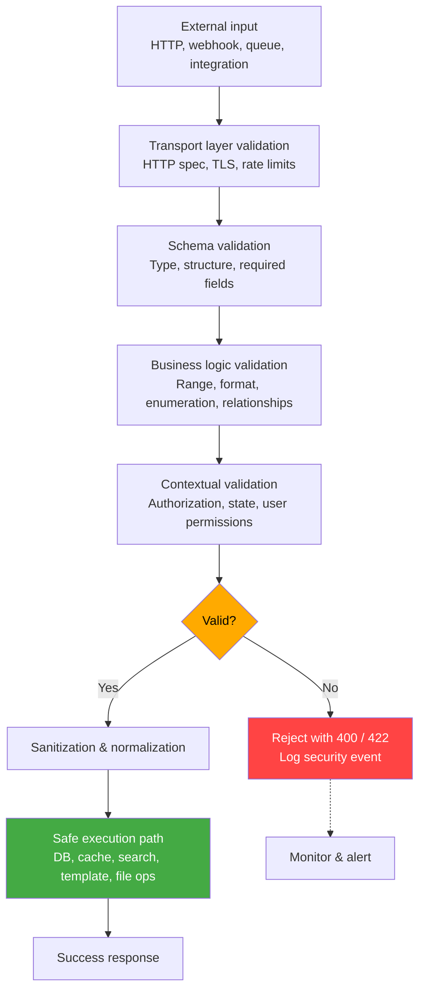
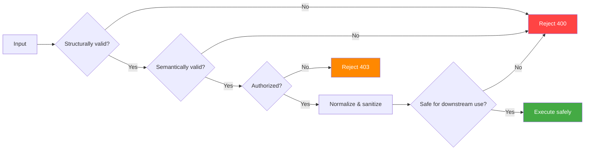

# Input Validation

> **Input validation is the defensive practice of verifying that data received by an API conforms to strict structural, semantic, and security expectations before allowing it to influence any downstream processing, storage, or interpretation.**

---

## 🧠 What Is It? (Beginner Explanation)

Every API is a bridge between the external world and your system's internal logic.

Data crosses that bridge constantly—from HTTP requests, webhooks, message queues, third-party integrations, and upstream APIs. Most of that data is benign. Some is malformed by accident. A fraction is crafted to abuse trust.

**Input validation** is the gatekeeper. Its job is to:

1. **Reject data that does not match the API's contract.**
2. **Transform data into safe, canonical forms before use.**
3. **Prevent external input from influencing interpreters or sensitive operations in unexpected ways.**

Without input validation, your API acts like an unlocked front door with no security checkpoint. Even if authentication works, you are trusting input shape, type, length, encoding, and semantics without verification.

### Real-world analogy

Think of airport security screening.

- Passengers (client input) must pass through scanners (validation).
- Prohibited items (malicious payloads, invalid data) are identified and rejected.
- Legitimate travelers (valid input) proceed to the gate (application logic).
- If you skip the screening, anyone can board a plane with anything.

Input validation is your API's security checkpoint.

---

## 🏗️ Why Input Validation Matters for APIs

Modern APIs face a different threat landscape than traditional web applications:

1. **APIs are machine-to-machine.**  
   Attackers can script requests at scale, test edge cases, and fuzz parameters faster than any manual effort.

2. **APIs accept structured data.**  
   JSON, XML, protobuf, GraphQL, and MessagePack allow nested objects, arrays, custom types, and metadata. More structure means more attack surface.

3. **APIs trust frameworks and parsers too much.**  
   Developers assume that typed schemas, ORM layers, and middleware provide safety by default. They often do not.

4. **APIs expose backend systems more directly.**  
   REST and GraphQL endpoints frequently map client requests to database queries, search indices, cache keys, template engines, or downstream services with minimal transformation.

5. **APIs blur the line between data and control.**  
   Parameters like `filter`, `sort`, `fields`, `include`, and `search` sometimes control not just *what* data to return, but *how the query is structured*.

These properties make **strong, layered input validation** one of the most important defensive investments for API security.

---

## 📊 Input Validation Mental Model



Input validation is **not a single step**. It is a **layered control** that happens at multiple stages:

1. **Transport layer** – enforce HTTPS, valid headers, content-length limits
2. **Schema layer** – enforce type, structure, required fields
3. **Business logic layer** – enforce allowed values, ranges, patterns
4. **Contextual layer** – enforce authorization, state transitions, user roles
5. **Sanitization layer** – normalize, encode, escape data before downstream use

---

## ⚙️ Validation Layers in Detail

### 1. Transport Layer Validation

Validate properties of the HTTP request itself, before parsing bodies.

| Check | Purpose | Example enforcement |
|---|---|---|
| **HTTPS enforcement** | Prevent cleartext credential exposure | Redirect HTTP → HTTPS or reject |
| **Content-Type** | Prevent parser confusion attacks | Reject if `Content-Type` does not match expected format |
| **Content-Length** | Prevent resource exhaustion | Reject oversized bodies early |
| **Header structure** | Prevent header injection | Reject malformed or forbidden headers |
| **Rate limiting** | Throttle abuse and fuzzing | Per-client, per-endpoint request caps |

**Example: Reject oversized request bodies**

```javascript
// ✅ Express middleware: enforce size limit
const express = require('express');
const app = express();

app.use(express.json({ limit: '100kb' })); // reject bodies > 100KB
```

---

### 2. Schema Validation

Enforce the shape, type, and structure of the input using a formal schema.

**Options by API type:**

| API type | Schema tool | Example |
|---|---|---|
| REST (JSON) | JSON Schema, Joi, Yup, Zod, AJV | Define structure, required fields, types |
| REST (OpenAPI) | OpenAPI 3.x spec + validator middleware | Validate requests and responses |
| GraphQL | GraphQL schema + input validation directives | Enforce types, nullable fields, enums |
| gRPC | Protocol Buffers (`.proto`) | Built-in type and structure enforcement |
| SOAP | XML Schema (XSD) | Validate SOAP envelopes |

**Example: JSON Schema validation in Node.js**

```javascript
// ✅ Validate request body with JSON Schema + AJV
const Ajv = require('ajv');
const ajv = new Ajv();

const userSchema = {
  type: 'object',
  properties: {
    username: { type: 'string', minLength: 3, maxLength: 30 },
    email: { type: 'string', format: 'email' },
    age: { type: 'integer', minimum: 13, maximum: 120 }
  },
  required: ['username', 'email'],
  additionalProperties: false // reject unexpected fields
};

const validate = ajv.compile(userSchema);

app.post('/api/users', (req, res) => {
  if (!validate(req.body)) {
    return res.status(400).json({ error: 'Invalid input', details: validate.errors });
  }
  // proceed with safe input
});
```

**Key principle:**

> **Reject unknown fields by default.** Use `additionalProperties: false` or equivalent. This prevents object pollution, mass assignment, and unexpected field injection.

---

### 3. Business Logic Validation

Schema validation ensures the input is structurally valid. Business logic validation ensures it is **semantically valid**.

| Validation type | Examples |
|---|---|
| **Allowed values (enumerations)** | `status` must be `"active"`, `"pending"`, or `"closed"` |
| **Range constraints** | `discount` must be 0–100, `quantity` must be positive |
| **Format patterns** | Phone numbers, postal codes, UUIDs, IBANs |
| **Cross-field dependencies** | If `payment_type = "credit_card"`, then `card_number` is required |
| **State transitions** | Order status can only go from `pending` → `confirmed` → `shipped` |
| **Relationship constraints** | `product_id` must reference an existing product |

**Example: Enforce enumeration**

```python
# ✅ Python (Flask): validate allowed status values
ALLOWED_STATUSES = {'active', 'pending', 'closed'}

@app.route('/api/orders', methods=['POST'])
def create_order():
    data = request.get_json()
    status = data.get('status')
    
    if status not in ALLOWED_STATUSES:
        return jsonify({'error': f'Invalid status. Allowed: {ALLOWED_STATUSES}'}), 400
    
    # proceed with validated status
```

**Example: Cross-field validation**

```javascript
// ✅ Validate dependent fields (Joi example)
const Joi = require('joi');

const paymentSchema = Joi.object({
  payment_type: Joi.string().valid('credit_card', 'paypal').required(),
  card_number: Joi.when('payment_type', {
    is: 'credit_card',
    then: Joi.string().creditCard().required(),
    otherwise: Joi.forbidden()
  }),
  paypal_email: Joi.when('payment_type', {
    is: 'paypal',
    then: Joi.string().email().required(),
    otherwise: Joi.forbidden()
  })
});
```

---

### 4. Contextual Validation

Validate input **in the context of the authenticated user and current system state**.

| Check | Purpose |
|---|---|
| **Authorization** | Does the user have permission to access or modify this resource? |
| **Ownership** | Does this resource belong to the current user? |
| **State consistency** | Is this operation allowed given the current object state? |
| **Duplicate detection** | Has this request already been processed (idempotency)? |
| **Rate/quota enforcement** | Has the user exceeded usage limits? |

**Example: Verify resource ownership**

```python
# ✅ Verify user owns the resource before allowing updates
@app.route('/api/orders/<int:order_id>', methods=['PUT'])
@login_required
def update_order(order_id):
    order = Order.query.get_or_404(order_id)
    
    # Contextual validation: ownership check
    if order.user_id != current_user.id:
        return jsonify({'error': 'Forbidden'}), 403
    
    # proceed with update
```

---

### 5. Sanitization and Normalization

Even after validation, normalize data to a canonical form to prevent encoding attacks, case-sensitivity issues, and downstream interpreter confusion.

| Technique | Purpose | Example |
|---|---|---|
| **Trimming** | Remove leading/trailing whitespace | `username.strip()` |
| **Case normalization** | Prevent case-sensitivity bypass | `email.lower()` |
| **Unicode normalization** | Prevent visual homograph attacks | `unicodedata.normalize('NFC', input)` |
| **HTML entity decoding** | Detect encoded injection payloads | Decode then re-validate |
| **Path traversal cleanup** | Remove `..` and resolve paths safely | Use `path.resolve()` or `realpath()` |
| **Null byte removal** | Prevent null-byte injection | `input.replace('\x00', '')` |

**Example: Email normalization**

```javascript
// ✅ Normalize email before storage or comparison
function normalizeEmail(email) {
  return email.trim().toLowerCase();
}

const userEmail = normalizeEmail(req.body.email);
```

**Example: Prevent path traversal**

```python
# ✅ Safe file access: validate and resolve paths
import os

UPLOAD_DIR = '/var/uploads'

def safe_file_path(filename):
    # Remove dangerous characters
    safe_name = os.path.basename(filename)
    full_path = os.path.join(UPLOAD_DIR, safe_name)
    real_path = os.path.realpath(full_path)
    
    # Ensure path stays within allowed directory
    if not real_path.startswith(os.path.realpath(UPLOAD_DIR)):
        raise ValueError('Invalid file path')
    
    return real_path
```

---

## 🛡️ Defense Patterns by Attack Type

### Preventing Injection Attacks

**Threat:** User input influences SQL, NoSQL, LDAP, OS commands, templates, or search queries.

**Validation approach:**

1. **Use parameterized queries or prepared statements** – never concatenate input into query strings.
2. **Reject raw query fragments** – do not accept `filter`, `where`, or `search` as freeform strings.
3. **Allowlist identifiers** – if the client controls column names, sort keys, or operators, map them server-side.
4. **Escape or encode** only as a last resort, and only with context-appropriate functions.

**Example: Safe SQL query**

```python
# ✅ Parameterized query (safe)
cursor.execute('SELECT * FROM users WHERE email = ?', (user_email,))

# ❌ String concatenation (unsafe)
cursor.execute(f"SELECT * FROM users WHERE email = '{user_email}'")
```

**Example: Safe NoSQL query (MongoDB)**

```javascript
// ✅ Use exact-match object (safe)
db.users.find({ email: userEmail });

// ❌ Accept raw query from client (unsafe)
db.users.find(req.body.filter); // attacker can inject $where, $regex, etc.
```

---

### Preventing Mass Assignment / Property Pollution

**Threat:** Client sends unexpected fields that modify internal object properties or bypass authorization.

**Validation approach:**

1. **Define explicit allowlists** – specify exactly which fields are allowed.
2. **Reject unknown properties** – use schema validation with `additionalProperties: false`.
3. **Use DTOs (Data Transfer Objects)** – map input to a clean internal model.

**Example: Prevent mass assignment**

```javascript
// ❌ Dangerous: directly assign all input fields
app.post('/api/users', (req, res) => {
  const user = new User(req.body); // attacker can set isAdmin: true
  user.save();
});

// ✅ Safe: allowlist specific fields
app.post('/api/users', (req, res) => {
  const { username, email, age } = req.body; // only these fields
  const user = new User({ username, email, age });
  user.save();
});
```

---

### Preventing Resource Exhaustion (DoS)

**Threat:** Attacker sends oversized input, deeply nested structures, or expensive queries to exhaust server resources.

**Validation approach:**

1. **Limit request size** – enforce `Content-Length` and body size caps.
2. **Limit nesting depth** – reject deeply nested JSON/XML (e.g., depth > 10).
3. **Limit array length** – cap the number of items in arrays.
4. **Limit query complexity** – for GraphQL, enforce query depth and cost limits.
5. **Timeout long-running operations** – abort expensive parsing or validation.

**Example: Limit JSON nesting depth**

```javascript
// ✅ Reject deeply nested JSON (custom middleware)
function limitNestingDepth(obj, maxDepth = 10, currentDepth = 0) {
  if (currentDepth > maxDepth) {
    throw new Error('Nesting depth exceeded');
  }
  for (let key in obj) {
    if (typeof obj[key] === 'object' && obj[key] !== null) {
      limitNestingDepth(obj[key], maxDepth, currentDepth + 1);
    }
  }
}

app.use((req, res, next) => {
  try {
    limitNestingDepth(req.body);
    next();
  } catch (err) {
    res.status(400).json({ error: 'Input too complex' });
  }
});
```

---

### Preventing SSRF (Server-Side Request Forgery)

**Threat:** API accepts URLs or hostnames and makes outbound requests to attacker-controlled or internal addresses.

**Validation approach:**

1. **Use allowlists** – only allow specific trusted domains or URL patterns.
2. **Block private IP ranges** – reject `127.0.0.0/8`, `10.0.0.0/8`, `172.16.0.0/12`, `192.168.0.0/16`, `169.254.0.0/16`, `::1`, `fc00::/7`.
3. **Disable redirects** or validate redirect targets.
4. **Use DNS resolution checks** – resolve the hostname and verify it is not internal.

**Example: Validate URL allowlist**

```python
# ✅ Validate webhook URLs against allowlist
from urllib.parse import urlparse

ALLOWED_DOMAINS = {'example.com', 'api.partner.com'}

def validate_webhook_url(url):
    parsed = urlparse(url)
    
    if parsed.scheme not in ['https']:
        raise ValueError('Only HTTPS URLs allowed')
    
    if parsed.hostname not in ALLOWED_DOMAINS:
        raise ValueError('Domain not in allowlist')
    
    return url
```

---

## 🧪 Validation Best Practices

| Principle | Explanation |
|---|---|
| **Fail securely** | Reject invalid input by default. Do not try to "fix" or "sanitize" your way to safety. |
| **Validate on the server** | Never trust client-side validation. Always re-validate server-side. |
| **Validate early** | Reject bad input as soon as possible, before business logic or database access. |
| **Use allowlists, not denylists** | Define what is allowed, not what is blocked. Denylists are easy to bypass. |
| **Enforce least privilege on data** | Validate not just type and format, but also whether the user should have access to that data. |
| **Log validation failures** | Track repeated validation failures as potential attack indicators. |
| **Return generic error messages** | Avoid leaking implementation details (e.g., "Invalid email" not "Email not found in database"). |

---

## 🔴 Common Validation Mistakes

| Mistake | Why it fails | Better approach |
|---|---|---|
| **Client-side validation only** | Attackers bypass the client entirely | Always validate server-side |
| **Denylist filtering** | `SELECT`, `UNION`, `<script>` can be bypassed with encoding, case, etc. | Use parameterized queries and allowlists |
| **Regex-only validation** | Regexes are brittle and prone to ReDoS | Combine regex with schema, type, and business logic validation |
| **Trusting Content-Type** | Attacker controls headers | Validate actual content structure, not just headers |
| **Validating after use** | Data is already in the database or cache | Validate before any downstream processing |
| **Over-reliance on frameworks** | Frameworks do not validate business logic or context | Add custom validation layers |

---

## 📋 Validation Checklist for API Developers

**General input validation:**

- [ ] Reject requests without valid `Content-Type`
- [ ] Enforce maximum request body size
- [ ] Validate JSON/XML structure with a schema
- [ ] Reject unknown or unexpected fields (`additionalProperties: false`)
- [ ] Validate field types (string, integer, boolean, etc.)
- [ ] Enforce required fields
- [ ] Validate field lengths (min/max for strings, arrays)
- [ ] Validate numeric ranges
- [ ] Validate string patterns (email, UUID, phone, etc.)
- [ ] Normalize and trim string inputs
- [ ] Validate enumerations (only allow predefined values)
- [ ] Validate cross-field dependencies
- [ ] Limit nesting depth for JSON/XML
- [ ] Limit array lengths
- [ ] Remove null bytes and control characters

**Security-specific validation:**

- [ ] Use parameterized queries (no string concatenation in SQL/NoSQL)
- [ ] Allowlist identifiers (table names, columns, sort keys)
- [ ] Reject raw query fragments from clients
- [ ] Validate file paths and prevent traversal (`..`)
- [ ] Validate URLs and hostnames (block internal IPs)
- [ ] Validate redirect targets
- [ ] Validate file upload extensions and MIME types
- [ ] Scan uploaded files for malware (if applicable)
- [ ] Enforce idempotency keys to prevent replay
- [ ] Validate CSRF tokens (for state-changing operations)
- [ ] Validate JWT claims and structure
- [ ] Validate API keys and tokens (not just presence, but format and signature)

**Contextual validation:**

- [ ] Verify user authentication before processing
- [ ] Verify user authorization (role, permissions, ownership)
- [ ] Validate resource state transitions
- [ ] Enforce rate limits per user/IP/endpoint
- [ ] Validate request origin (CORS, Referer, Origin headers)
- [ ] Log and monitor validation failures

---

## 🧩 Input Validation in Different API Paradigms

### REST APIs

**Validation points:**

- Path parameters (e.g., `/api/users/:id`)
- Query parameters (e.g., `?filter=active&sort=name`)
- Headers (e.g., `Authorization`, `Content-Type`)
- Request body (JSON, XML, form data)

**Example: OpenAPI schema enforcement**

```yaml
# OpenAPI 3.x spec
paths:
  /api/users:
    post:
      requestBody:
        required: true
        content:
          application/json:
            schema:
              type: object
              required:
                - username
                - email
              properties:
                username:
                  type: string
                  minLength: 3
                  maxLength: 30
                email:
                  type: string
                  format: email
              additionalProperties: false
```

Use middleware like `express-openapi-validator` (Node.js) or `connexion` (Python) to enforce the spec.

---

### GraphQL APIs

**Validation points:**

- Query depth
- Query complexity (field count, resolver cost)
- Input types and directives
- Argument values

**Example: GraphQL input validation**

```graphql
# Define input type with constraints
input CreateUserInput {
  username: String! @constraint(minLength: 3, maxLength: 30)
  email: String! @constraint(format: "email")
  age: Int @constraint(min: 13, max: 120)
}

type Mutation {
  createUser(input: CreateUserInput!): User
}
```

Use libraries like `graphql-constraint-directive` or custom directives for validation.

**GraphQL-specific defenses:**

```javascript
// ✅ Limit query depth (prevent deeply nested queries)
const depthLimit = require('graphql-depth-limit');

const server = new ApolloServer({
  schema,
  validationRules: [depthLimit(5)] // max depth = 5
});
```

---

### gRPC APIs

**Validation points:**

- Protocol Buffers (`.proto`) enforce structure and types at compile time
- Custom validation logic for business rules

**Example: Protobuf with validation annotations**

```protobuf
syntax = "proto3";

import "validate/validate.proto";

message CreateUserRequest {
  string username = 1 [(validate.rules).string = {min_len: 3, max_len: 30}];
  string email = 2 [(validate.rules).string.email = true];
  int32 age = 3 [(validate.rules).int32 = {gte: 13, lte: 120}];
}
```

Use `protoc-gen-validate` to generate validation code automatically.

---

## 🛠️ Tools and Libraries

| Language | Tool/Library | Purpose |
|---|---|---|
| **JavaScript/Node.js** | Joi, Yup, Zod, AJV | Schema validation |
| | express-validator | Middleware for Express |
| | express-openapi-validator | Enforce OpenAPI specs |
| **Python** | Pydantic, marshmallow, Cerberus | Schema and validation |
| | connexion | OpenAPI-driven Flask framework |
| | Django REST Framework serializers | Built-in validation |
| **Java** | Hibernate Validator (JSR-380) | Bean validation |
| | Spring Validation | Annotation-based validation |
| **Go** | go-playground/validator | Struct validation |
| | ozzo-validation | Fluent validation |
| **C# / .NET** | FluentValidation | Fluent validation library |
| | Data Annotations | Attribute-based validation |
| **Ruby** | ActiveModel validations (Rails) | Built-in model validation |
| | Dry-validation | Standalone validation |
| **GraphQL** | graphql-constraint-directive | Input validation directives |
| | graphql-depth-limit | Query depth limiting |

---

## 🔍 Testing Your Validation

### Validation fuzzing techniques

| Test type | Example input | What it reveals |
|---|---|---|
| **Type confusion** | Send `{"age": "not a number"}` | Weak type enforcement |
| **Oversized input** | 10 MB JSON body, 1M-character string | Missing size limits |
| **Deep nesting** | `{"a":{"b":{"c":{...}}}}` (depth 100) | No depth limit |
| **Large arrays** | `[1, 2, 3, ..., 100000]` | No array length cap |
| **Unexpected fields** | `{"username":"test","isAdmin":true}` | Mass assignment risk |
| **Missing required fields** | Omit `username` | Incomplete validation |
| **Invalid enums** | `{"status":"invalid_value"}` | Weak enum enforcement |
| **Boundary values** | `age: -1`, `age: 999` | Range check gaps |
| **Null bytes** | `username: "test\x00admin"` | Null byte injection |
| **Special characters** | `<script>`, `'; DROP TABLE--`, `${7*7}` | Injection surface |
| **Unicode edge cases** | Homoglyphs, RTL overrides, emoji | Encoding issues |
| **Path traversal** | `../../../etc/passwd` | File access control |
| **SSRF payloads** | `http://169.254.169.254/` | Internal IP access |

**Automated fuzzing tools:**

- **Burp Suite Intruder** – fuzz API parameters
- **ffuf, wfuzz** – HTTP fuzzing
- **Postman tests** – automated validation checks
- **RESTler** (Microsoft) – stateful REST API fuzzing
- **Schemathesis** – property-based testing from OpenAPI specs
- **GraphQL Cop** – GraphQL-specific security testing

---

## 📚 Real-World Validation Failures

### Case Study 1: Mass Assignment in GitHub (2012)

**Issue:** GitHub's API allowed users to update their own user objects. Validation did not restrict which fields could be updated.

**Attack:** Attacker sent `{"public_keys": [...]}` in a user update request and added SSH keys to other users' accounts.

**Root cause:** Missing field allowlist. The API trusted client input to only modify safe fields.

**Fix:** Explicit allowlist of updatable fields. Reject unknown properties.

---

### Case Study 2: NoSQL Injection in Multiple Platforms

**Issue:** APIs accepted JSON filter objects and passed them directly to MongoDB queries.

**Attack:** Attacker sent `{"password": {"$ne": null}}` to bypass authentication.

**Root cause:** Raw client-controlled query operators were trusted.

**Fix:** Use schema validation to only allow exact-match filters. Map complex queries server-side.

---

### Case Study 3: SSRF in Capital One Breach (2019)

**Issue:** AWS metadata service (`169.254.169.254`) was accessible from a misconfigured WAF, allowing access to IAM credentials.

**Root cause (partial):** Missing validation of outbound request targets.

**Fix:** Block internal IP ranges in any user-controlled URL parameter.

---

## 🧠 Mental Model for Secure Validation



**The key insight:**

> **Validation is not a single check. It is a series of gates. Each gate asks a different question. Fail at any gate, and input is rejected.**

---

## 📚 References

### Standards and Specifications

- **OWASP API Security Top 10 (2023)** – [https://owasp.org/API-Security/](https://owasp.org/API-Security/)  
  API3:2023 Broken Object Property Level Authorization, API8:2023 Security Misconfiguration, API10:2023 Unsafe Consumption of APIs

- **OWASP Input Validation Cheat Sheet** – [https://cheatsheetseries.owasp.org/cheatsheets/Input_Validation_Cheat_Sheet.html](https://cheatsheetseries.owasp.org/cheatsheets/Input_Validation_Cheat_Sheet.html)

- **CWE-20: Improper Input Validation** – [https://cwe.mitre.org/data/definitions/20.html](https://cwe.mitre.org/data/definitions/20.html)

- **JSON Schema Specification** – [https://json-schema.org/](https://json-schema.org/)

- **OpenAPI Specification (Swagger)** – [https://spec.openapis.org/oas/latest.html](https://spec.openapis.org/oas/latest.html)

### Research and Guidance

- **NIST SP 800-53 Rev. 5** – SI-10 Information Input Validation  
  [https://csrc.nist.gov/publications/detail/sp/800-53/rev-5/final](https://csrc.nist.gov/publications/detail/sp/800-53/rev-5/final)

- **OWASP Testing Guide – Input Validation Testing** – [https://owasp.org/www-project-web-security-testing-guide/](https://owasp.org/www-project-web-security-testing-guide/)

- **PortSwigger Web Security Academy – Input Validation** – [https://portswigger.net/web-security/essential-skills/obfuscating-attacks-using-encodings](https://portswigger.net/web-security/essential-skills/obfuscating-attacks-using-encodings)

- **SANS – Securing Web Application Technologies (SWAT) Checklist** – [https://www.sans.org/](https://www.sans.org/)

### Tools and Libraries

- **AJV (Another JSON Schema Validator)** – [https://ajv.js.org/](https://ajv.js.org/)
- **Joi (Node.js validation library)** – [https://joi.dev/](https://joi.dev/)
- **Pydantic (Python data validation)** – [https://pydantic-docs.helpmanual.io/](https://pydantic-docs.helpmanual.io/)
- **FluentValidation (.NET)** – [https://fluentvalidation.net/](https://fluentvalidation.net/)
- **protoc-gen-validate (gRPC/Protobuf validation)** – [https://github.com/bufbuild/protoc-gen-validate](https://github.com/bufbuild/protoc-gen-validate)
- **Schemathesis (API fuzzing from OpenAPI)** – [https://schemathesis.readthedocs.io/](https://schemathesis.readthedocs.io/)

### Incident Reports and Case Studies

- **GitHub Mass Assignment Vulnerability (2012)** – [https://blog.gdssecurity.com/labs/2012/3/5/github-enterprise-sql-injection-and-privilege-escalation.html](https://blog.gdssecurity.com/labs/2012/3/5/github-enterprise-sql-injection-and-privilege-escalation.html)

- **Capital One Data Breach (2019) – SSRF and Metadata Abuse** – [https://krebsonsecurity.com/2019/07/capital-one-data-theft-impacts-106m-people/](https://krebsonsecurity.com/2019/07/capital-one-data-theft-impacts-106m-people/)

- **MongoDB NoSQL Injection Examples** – [https://owasp.org/www-community/attacks/NoSQL_Injection](https://owasp.org/www-community/attacks/NoSQL_Injection)
