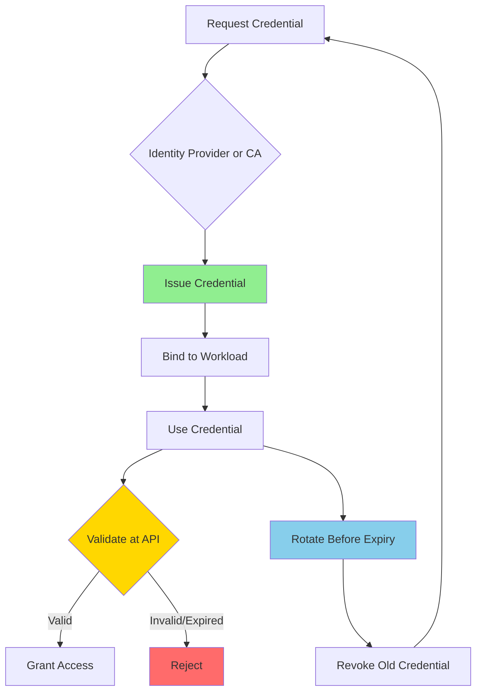
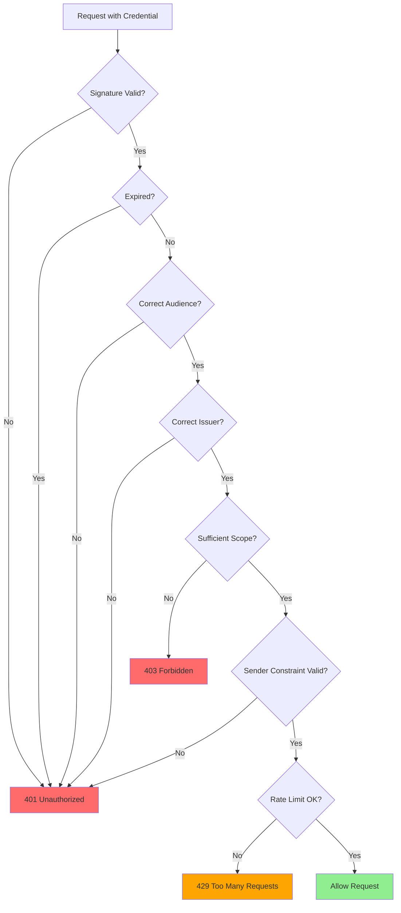
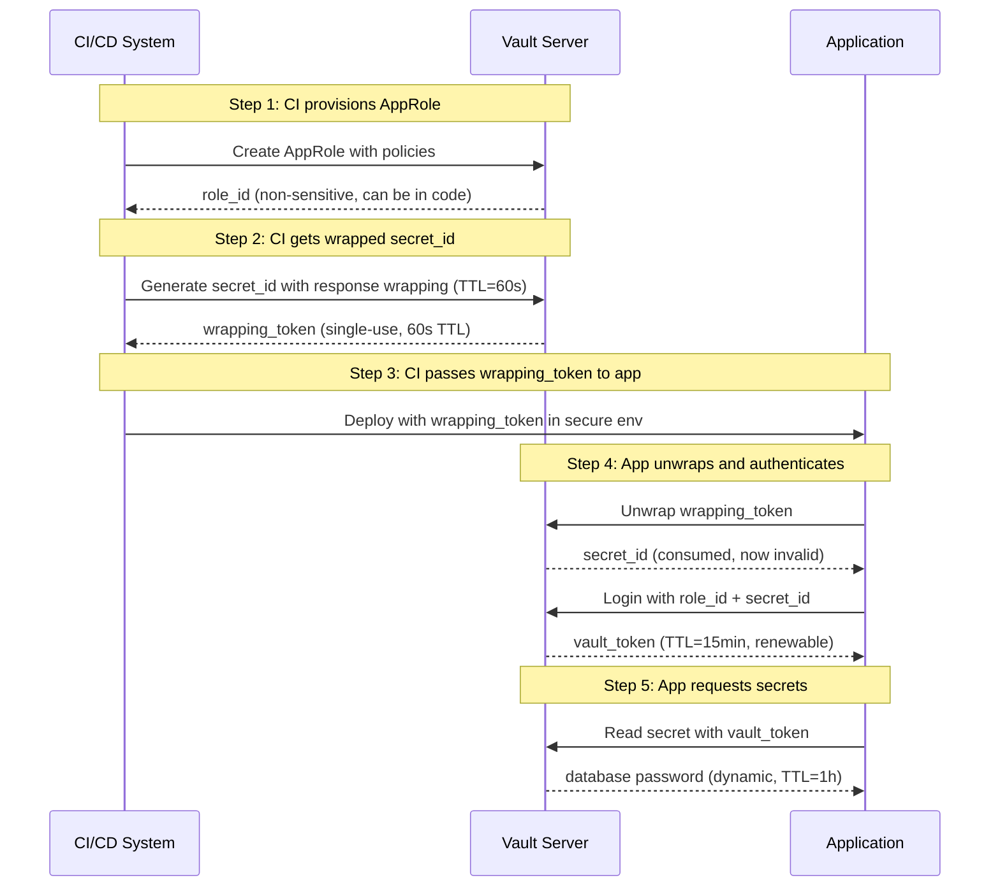

# Machine Identity Hardening

> **Machine identities—service accounts, API keys, workload credentials, and certificates—now outnumber human identities in most organizations. When these credentials are weak, stolen, or mismanaged, attackers can move laterally, impersonate services, and abuse APIs with legitimate-looking traffic. Hardening machine identity is about making those credentials difficult to steal, short-lived, scoped, and auditable.**

---

## 🧠 What Is It? (Beginner Explanation)

In traditional security, we think about protecting **users**: passwords, MFA, password reset, account recovery.

But in modern API environments, **machines authenticate to other machines** far more often than humans do:

- a CI/CD pipeline authenticating to GitHub, AWS, and a Docker registry
- a checkout service proving its identity to a payment API
- a Kubernetes pod presenting a workload certificate to an internal API gateway
- a Lambda function using an assumed IAM role to call DynamoDB
- a GitHub Action using OIDC federation to deploy to cloud infrastructure

Each of these is a **machine identity**.

If attackers can:

- steal a long-lived service account token,
- reuse an API key from a code repository,
- forge a workload identity through confused deputy problems,
- replay credentials from logs or crash dumps,
- or impersonate a trusted service with a leaked client secret,

then they get **the same access** as the legitimate service—often without triggering traditional user-focused security controls.

That is why **machine identity hardening** matters:

- reduce credential exposure
- limit blast radius when credentials are stolen
- make credentials hard to replay or reuse
- tie credentials to specific workloads, not just generic "service accounts"
- force credentials to expire and rotate automatically

---

## 🎯 Why API Security Teams Care

Most modern API breaches involve **legitimate credentials being abused**, not SQL injection or buffer overflows.

### Real-world scenarios where weak machine identity led to compromise:

| Scenario | What failed | Impact |
|---|---|---|
| **API key in public GitHub repo** | Long-lived key with no rotation, broad scope | Attacker scraped production database via API |
| **Service account JWT stolen from logs** | Token logged during debugging, did not expire | Lateral movement across internal microservices |
| **Client secret reused across environments** | Same secret in dev, staging, prod | Dev environment breach led to prod API abuse |
| **Workload identity confused deputy** | Service A could request tokens "on behalf of" Service B without validation | Privilege escalation and unauthorized data access |
| **mTLS certificate not validated properly** | API gateway checked cert existence but not SAN/CN | Attacker presented valid cert from wrong workload |
| **Cloud metadata service exploited via SSRF** | IMDSv1 allowed unauthenticated role credential theft | Full AWS account compromise via stolen temporary creds |

In OWASP API Security terms, weak machine identity contributes to:

- **API2: Broken Authentication** — weak or missing identity checks
- **API5: Broken Function Level Authorization** — service accounts with overbroad privileges
- **API7: Server Side Request Forgery** — used to steal cloud role credentials
- **API8: Security Misconfiguration** — default credentials, poor rotation policies
- **API9: Improper Inventory Management** — forgotten service accounts and API keys

---

## 📊 Machine Identity Lifecycle (Big Picture)



**Key phases:**

1. **Provisioning** — how credentials are created and distributed
2. **Binding** — tying credentials to specific workloads, not generic accounts
3. **Usage** — presenting credentials to APIs with proper constraints
4. **Validation** — APIs verifying authenticity, scope, audience, expiry
5. **Rotation** — replacing credentials before they expire or are compromised
6. **Revocation** — immediately invalidating credentials when trust is broken

---

## 🏗️ Types of Machine Identity

| Type | Examples | Common weaknesses | Strong implementation |
|---|---|---|---|
| **API keys** | Service API keys, partner keys, webhook secrets | Long-lived, stored in plaintext, broad scope, no binding | Short TTL, scoped to specific operations, rotated via automation, stored in vault |
| **OAuth client credentials** | `client_id` + `client_secret` for OAuth 2.0 | Reused across environments, no expiry, overbroad scopes | Environment-specific secrets, short-lived access tokens, `private_key_jwt` instead of shared secret |
| **Service account tokens** | Kubernetes ServiceAccount JWT, GCP service account key | Infinite lifetime tokens, mounted to every pod, no audience validation | Bound to specific pod, audience-scoped, time-limited, workload identity instead of static key |
| **X.509 client certificates** | mTLS workload certs, mutual TLS identity | Weak CA validation, long validity, not revoked when workload destroyed | SPIFFE identity, short validity (hours/days), automatic rotation via cert-manager or similar |
| **Cloud IAM roles** | AWS IAM role, Azure managed identity, GCP workload identity | Overly permissive policies, no external ID when needed, confused deputy risks | Least-privilege policy, external ID for cross-account, condition keys for workload binding |
| **Signed assertions / JWTs** | Self-signed service JWTs, GitHub OIDC tokens, Vault AppRole | Weak key management, no `aud` or `sub` validation, long expiry | Bound to CI job or workload context, validated `iss`/`aud`/`sub`, short expiry (minutes) |

---

## 🔐 Core Hardening Principles

### 1. **Short-Lived Credentials**

**Goal:** Reduce the window of opportunity if a credential is stolen.

| Credential type | Weak | Strong |
|---|---|---|
| API key | No expiration | Expires in 7-30 days, auto-rotated |
| OAuth access token | 1 hour+ | 5-15 minutes with refresh token rotation |
| Service account JWT | No `exp` claim | `exp` set to 1 hour or less |
| Client certificate | Valid for 1 year | Valid for 1-7 days, auto-renewed via ACME or cert-manager |
| Cloud temporary credentials | 12 hours | 15 minutes to 1 hour max |

**Implementation examples:**

- **AWS STS**: Use `DurationSeconds=900` (15 min) instead of default 3600
- **Kubernetes**: Use projected ServiceAccount tokens with `expirationSeconds: 3600`
- **OAuth**: Issue access tokens with 5-15 min TTL and enforce refresh token rotation
- **Vault**: Set `ttl=1h` and `max_ttl=24h` on dynamic secrets

---

### 2. **Credential Binding (Proof of Possession)**

**Goal:** Tie credentials to specific workloads so stealing the credential alone is not enough.

**Techniques:**

| Binding method | How it works | Prevents |
|---|---|---|
| **mTLS (certificate binding)** | Access token is bound to client cert thumbprint via `cnf` claim | Token replay from different workload |
| **DPoP (Demonstrating Proof of Possession)** | Client proves it holds private key by signing each request | Token theft and reuse from compromised logs |
| **Sender-constrained tokens** | Token includes `cnf` claim with key material hash | Bearer token theft via XSS, logs, or proxies |
| **Workload attestation** | Token issued only if workload can prove its runtime identity (TPM, enclave, signed pod spec) | Credential theft from non-genuine workloads |

**Example: DPoP-bound token validation (pseudo-code)**

```
1. Client requests token with DPoP proof (signed JWT with `jti`, `htm`, `htu`, `iat`)
2. Auth server issues access token with:
   {
     "sub": "service-checkout",
     "aud": "https://payment-api.example.com",
     "exp": 1700000000,
     "cnf": {
       "jkt": "SHA256-hash-of-client-public-key"
     }
   }
3. Client calls payment API with:
   - Authorization: DPoP <access-token>
   - DPoP: <signed-proof-JWT>
4. Payment API validates:
   - access token signature and claims
   - DPoP proof signature matches public key
   - DPoP proof `jkt` matches access token `cnf.jkt`
   - DPoP proof `htm` and `htu` match current request
   - DPoP proof is not replayed (check `jti` against cache)
```

---

### 3. **Least-Privilege Scoping**

**Goal:** Limit what a compromised credential can do.

**Scoping dimensions:**

| Dimension | Example weak | Example strong |
|---|---|---|
| **API scope** | `scope: api:*` | `scope: payments:read invoices:write` |
| **Resource scope** | Access to all S3 buckets | Access only to `s3://prod-invoices/*` with condition |
| **Audience restriction** | Token works for any API | `aud: https://payment-api.example.com` only |
| **IP/network binding** | Token works from anywhere | Token valid only from specific VPC or IP range |
| **Time-of-day restriction** | No time limit | Token only valid during business hours (cloud IAM condition) |
| **Action scope** | Full CRUD | Read-only except for specific write operations |

**AWS IAM policy example (least-privilege service credential):**

```json
{
  "Version": "2012-10-17",
  "Statement": [
    {
      "Effect": "Allow",
      "Action": [
        "s3:GetObject"
      ],
      "Resource": "arn:aws:s3:::prod-invoices/*",
      "Condition": {
        "IpAddress": {
          "aws:SourceIp": "10.0.1.0/24"
        },
        "StringEquals": {
          "aws:RequestedRegion": "us-east-1"
        }
      }
    }
  ]
}
```

---

### 4. **Automatic Rotation**

**Goal:** Replace credentials regularly without manual intervention.

| Credential type | Rotation strategy |
|---|---|
| **API keys** | Use secret management service (Vault, AWS Secrets Manager) with auto-rotation every 30-90 days |
| **Database passwords** | Rotate via Vault database secrets engine or AWS RDS auto-rotation |
| **OAuth client secrets** | Support multiple active secrets (blue/green rotation), retire old secret after grace period |
| **TLS certificates** | Use ACME (Let's Encrypt), cert-manager, or AWS Certificate Manager with auto-renewal |
| **Kubernetes ServiceAccount tokens** | Use projected volumes with automatic refresh before expiry |
| **Cloud IAM keys** | Prefer workload identity or IAM roles; if keys required, rotate via automation (e.g., AWS IAM key rotation Lambda) |

**Example: Vault dynamic database credentials**

```bash
# App requests DB credentials
$ vault read database/creds/readonly-role

Key                Value
---                -----
lease_id           database/creds/readonly-role/abc123
lease_duration     1h
password           A1b2-C3d4-E5f6
username           v-token-readonly-abc123

# Credential is valid for 1 hour
# Vault automatically revokes it after expiry
# App renews lease before expiry or requests new creds
```

---

### 5. **Secure Storage and Distribution**

**Goal:** Prevent credential leakage during storage, transit, and runtime.

| Anti-pattern (weak) | Best practice (strong) |
|---|---|
| Hardcoded in source code | Injected at runtime via secret manager or workload identity |
| Stored in environment variables (visible in `/proc/<pid>/environ`) | Mounted as file from secret volume with restrictive permissions |
| Committed to Git repository | Never in repo; use `.gitignore` and secret scanning tools (TruffleHog, GitGuardian) |
| Sent via Slack or email | Shared via encrypted secret sharing service with time-limited access |
| Logged in application logs | Redacted from logs via structured logging filters |
| Exposed via error messages | Generic error responses; credential details only in secure audit log |
| Stored in plaintext config files | Encrypted at rest; decrypted only in memory at runtime |
| Downloaded via HTTP | Always HTTPS with certificate validation |

**Secure distribution patterns:**

1. **Workload Identity (best for cloud-native):**
   - AWS: IAM roles for service accounts (IRSA), ECS task roles, Lambda execution roles
   - GCP: Workload Identity binds Kubernetes SA to GCP service account
   - Azure: Managed Identity for AKS pods, VMs, App Service

2. **Secret Injection at Runtime:**
   - Kubernetes: Use external-secrets-operator to sync from Vault/AWS Secrets Manager
   - Docker: Use `docker secret` (Swarm) or volume mounts (not env vars)
   - CI/CD: GitHub OIDC federation, GitLab CI/CD variables with masking

3. **Dynamic Secrets:**
   - Vault: Generate credentials on-demand with automatic revocation
   - AWS Secrets Manager: Rotate RDS/DocumentDB credentials automatically
   - cert-manager: Issue and renew TLS certs dynamically

---

## 🛡️ Validation and Enforcement at the API

Even with strong credentials, APIs must validate them correctly.

### Essential validation checks



**Validation checklist for JWTs:**

- [ ] **Signature verification**: Check `alg`, verify signature with correct public key or shared secret
- [ ] **Algorithm validation**: Reject `none`, validate expected algorithm (e.g., `RS256`, `ES256`)
- [ ] **Issuer (`iss`) check**: Ensure token is from trusted issuer
- [ ] **Audience (`aud`) check**: Ensure token is intended for this API
- [ ] **Expiration (`exp`) check**: Reject expired tokens
- [ ] **Not-before (`nbf`) check**: Reject tokens used before their valid time
- [ ] **Issued-at (`iat`) check**: Optionally enforce maximum age
- [ ] **Subject (`sub`) check**: Validate the identity claim matches expected workload
- [ ] **Scope/permissions check**: Ensure token has required scope for this operation
- [ ] **Sender constraint**: If using DPoP or mTLS binding, validate proof of possession

**Validation checklist for mTLS client certificates:**

- [ ] **Certificate chain validation**: Verify cert is signed by trusted CA
- [ ] **Expiration check**: Reject expired certificates
- [ ] **Revocation check**: Check CRL or OCSP (if applicable)
- [ ] **Subject Alternative Name (SAN) or Common Name (CN) validation**: Map cert identity to expected workload
- [ ] **SPIFFE ID validation**: If using SPIFFE, validate `spiffe://trust-domain/workload-id` format
- [ ] **Certificate pinning** (optional): For high-security APIs, pin expected cert thumbprint

**Validation checklist for API keys:**

- [ ] **Key format validation**: Ensure key matches expected format (length, prefix, checksum)
- [ ] **Constant-time comparison**: Prevent timing attacks
- [ ] **Expiration check**: Validate key is not expired
- [ ] **Scope/ACL check**: Ensure key has required permissions
- [ ] **Rate limiting**: Enforce per-key rate limits
- [ ] **Audit logging**: Log key usage for forensics

---

## 🔍 Detection and Monitoring

Even with strong machine identity, you need visibility into credential usage and abuse.

### Key signals to monitor

| Signal | What it detects | Alerting threshold |
|---|---|---|
| **Credential used from unexpected IP/location** | Stolen credential or compromised workload | First use from new IP/geo-location |
| **Credential used outside expected time window** | Replay attack or credential theft | Usage during off-hours when workload should be idle |
| **Rapid authentication failures** | Brute-force or credential stuffing against service account | >10 failures in 1 minute |
| **Token reuse across multiple source IPs** | Token theft and replay | Same token from >2 distinct IPs within TTL |
| **Unexpected API calls** | Compromised credential being abused | Service credential calling API it never called before |
| **High volume of requests from single credential** | Automated abuse or data exfiltration | >1000 requests/min from single service account |
| **Token introspection failures** | Invalid, expired, or revoked tokens being presented | Sustained introspection failures (>5/min) |
| **Workload identity mismatch** | Certificate CN/SAN does not match expected identity | Any mismatch if strict identity mapping enabled |

### Monitoring implementation

**Centralized audit logging:**

```json
{
  "timestamp": "2024-03-12T10:15:30Z",
  "event": "api.access",
  "service_identity": "payment-service",
  "credential_type": "oauth_client_credentials",
  "token_jti": "abc123",
  "source_ip": "10.0.1.42",
  "api_endpoint": "/v1/transactions",
  "http_method": "POST",
  "response_code": 200,
  "scope": "payments:write",
  "audience": "https://billing-api.example.com",
  "certificate_san": "spiffe://prod.example.com/ns/payments/sa/payment-service"
}
```

**SIEM correlation rules:**

- Alert if same `token_jti` seen from multiple `source_ip` addresses
- Alert if `service_identity` calls endpoint never seen in baseline
- Alert if credential is used after revocation timestamp
- Alert if `certificate_san` does not match expected namespace/service

**Dashboards to build:**

1. **Credential inventory**: Count of active credentials by type, environment, TTL
2. **Credential age**: Distribution of credential lifetimes (flag >90 day credentials)
3. **Rotation compliance**: % of credentials rotated in last 30/60/90 days
4. **Failed authentication trends**: Timeline of auth failures by service identity
5. **API usage by service identity**: Which services call which APIs (detect anomalies)

---

## ⚙️ Implementation Patterns by Environment

### Pattern 1: Kubernetes with SPIFFE/SPIRE

**Architecture:**

```
┌─────────────────────────────────────────────┐
│  Kubernetes Cluster                         │
│                                             │
│  ┌──────────────┐      ┌──────────────┐   │
│  │  Pod A       │      │  Pod B       │   │
│  │  (payment)   │      │  (billing)   │   │
│  │              │      │              │   │
│  │  ┌────────┐  │      │  ┌────────┐  │   │
│  │  │ SPIRE  │  │      │  │ SPIRE  │  │   │
│  │  │ Agent  │  │      │  │ Agent  │  │   │
│  │  └────┬───┘  │      │  └────┬───┘  │   │
│  └───────┼──────┘      └───────┼──────┘   │
│          │                     │           │
│          └──────────┬──────────┘           │
│                     │                       │
│              ┌──────▼──────┐               │
│              │ SPIRE Server│               │
│              │   (CA)      │               │
│              └─────────────┘               │
└─────────────────────────────────────────────┘
```

**Workflow:**

1. SPIRE Agent on each node attests pod identity based on:
   - Kubernetes namespace + ServiceAccount
   - Pod UID, node identity
   - Optional custom workload attestation

2. SPIRE Server issues short-lived X.509 SVID (SPIFFE Verifiable Identity Document):
   - SAN: `spiffe://prod.example.com/ns/payments/sa/payment-service`
   - Validity: 1 hour
   - Auto-rotated by agent before expiry

3. Payment service presents SVID when calling billing API via mTLS

4. Billing API validates:
   - Certificate is signed by SPIRE CA
   - SAN matches allowed identity (`spiffe://prod.example.com/ns/payments/sa/*`)
   - Certificate is not expired

**Benefits:**

- No long-lived secrets in pods
- Identity tied to workload context (namespace, ServiceAccount)
- Automatic rotation
- mTLS enforcement between services

**Tools:**

- [SPIRE](https://spiffe.io/docs/latest/spire-about/)
- [Istio with SPIFFE integration](https://istio.io/latest/docs/ops/integrations/spiffe/)
- [cert-manager with SPIRE issuer](https://cert-manager.io/docs/configuration/external/)

---

### Pattern 2: AWS with IAM Roles and IRSA

**Architecture:**

```
┌────────────────────────────────────────────┐
│  EKS Cluster                               │
│                                            │
│  ┌──────────────────────────────────┐     │
│  │  Pod                             │     │
│  │  ServiceAccount: s3-reader       │     │
│  │                                  │     │
│  │  ┌────────────────────────────┐  │     │
│  │  │ AWS SDK requests S3        │  │     │
│  │  │ → calls OIDC token webhook │  │     │
│  │  │ → gets signed JWT          │  │     │
│  │  │ → calls STS AssumeRoleWith │  │     │
│  │  │   WebIdentity              │  │     │
│  │  │ → receives temporary creds │  │     │
│  │  └────────────────────────────┘  │     │
│  └──────────────────────────────────┘     │
└────────────────────────────────────────────┘
         │
         ▼
┌────────────────────────────────────────────┐
│  AWS IAM                                   │
│                                            │
│  IAM Role: eks-s3-reader-role              │
│  Trust Policy:                             │
│    - Federated: oidc.eks.region.amazonaws │
│    - Condition: sub = system:serviceaccount│
│                       :default:s3-reader   │
│  Permissions:                              │
│    - s3:GetObject on bucket/path           │
└────────────────────────────────────────────┘
```

**Workflow:**

1. Pod is annotated with IAM role:
   ```yaml
   serviceAccount:
     annotations:
       eks.amazonaws.com/role-arn: arn:aws:iam::123456789:role/eks-s3-reader-role
   ```

2. When pod calls AWS API, SDK:
   - Reads projected ServiceAccount token (signed JWT)
   - Calls `sts:AssumeRoleWithWebIdentity` with JWT
   - Receives temporary credentials (access key, secret, session token) with 1-hour TTL

3. Pod uses temporary credentials to call S3

4. AWS validates:
   - JWT signature from EKS OIDC provider
   - `sub` claim matches trusted ServiceAccount
   - IAM role trust policy allows this federation
   - IAM permissions allow requested S3 action

**Benefits:**

- No static IAM keys in pod
- Credentials are temporary (default 1 hour, minimum 15 minutes)
- Scoped to specific Kubernetes ServiceAccount
- Automatic credential refresh by AWS SDK

**Hardening tips:**

- Set minimum session duration: `DurationSeconds=900` (15 min)
- Use least-privilege IAM policies with condition keys:
  ```json
  "Condition": {
    "StringEquals": {
      "aws:RequestedRegion": "us-east-1",
      "aws:SourceVpc": "vpc-abc123"
    }
  }
  ```
- Enable CloudTrail logging for all STS calls
- Monitor for `AssumeRoleWithWebIdentity` from unexpected IPs

---

### Pattern 3: GitHub Actions with OIDC Federation

**Architecture:**

```
┌─────────────────────────────────────────────┐
│  GitHub Actions Workflow                    │
│                                             │
│  steps:                                     │
│    - uses: aws-actions/configure-aws-creds  │
│      with:                                  │
│        role-to-assume: arn:aws:iam::123:... │
│        role-session-name: gha-deploy        │
│                                             │
│  GitHub provides OIDC token:                │
│    iss: https://token.actions.github.com    │
│    sub: repo:owner/repo:ref:refs/heads/main │
│    aud: sts.amazonaws.com                   │
└──────────────────┬──────────────────────────┘
                   │
                   ▼
┌─────────────────────────────────────────────┐
│  AWS IAM Role Trust Policy                  │
│                                             │
│  {                                          │
│    "Version": "2012-10-17",                 │
│    "Statement": [{                          │
│      "Effect": "Allow",                     │
│      "Principal": {                         │
│        "Federated": "arn:aws:iam::123:oidc-│
│         provider/token.actions.github.com"  │
│      },                                     │
│      "Action": "sts:AssumeRoleWithWebIdent",│
│      "Condition": {                         │
│        "StringEquals": {                    │
│          "token.actions.github.com:aud":    │
│            "sts.amazonaws.com",             │
│          "token.actions.github.com:sub":    │
│            "repo:owner/repo:ref:refs/heads/ │
│             main"                           │
│        }                                    │
│      }                                      │
│    }]                                       │
│  }                                          │
└─────────────────────────────────────────────┘
```

**Benefits:**

- No long-lived AWS access keys in GitHub secrets
- Credentials scoped to specific repository, branch, and workflow
- Temporary credentials (15 min - 1 hour)
- Automatic rotation (each workflow run gets new credentials)

**Hardening:**

- Use `sub` condition to restrict to specific repo, branch, or even specific workflow file:
  ```
  "token.actions.github.com:sub": "repo:myorg/myrepo:ref:refs/heads/main"
  ```
- Add environment condition:
  ```
  "token.actions.github.com:sub": "repo:myorg/myrepo:environment:production"
  ```
- Set minimum session duration in workflow
- Use `id-token: write` permission explicitly; avoid `permissions: write-all`

---

### Pattern 4: Vault AppRole with Response Wrapping

**Workflow:**



**Benefits:**

- `secret_id` is never exposed in CI logs (only single-use wrapping token)
- `wrapping_token` is valid for only 60 seconds
- Even if wrapping token is stolen, it can only be used once
- Application token is short-lived (15 min) and must be renewed
- Database credentials are dynamic and auto-revoked after 1 hour

**Implementation:**

```bash
# CI/CD creates AppRole
vault write auth/approle/role/my-app \
  token_ttl=15m \
  token_max_ttl=1h \
  policies=my-app-policy

# CI gets role_id (safe to store in code/env)
ROLE_ID=$(vault read -field=role_id auth/approle/role/my-app/role-id)

# CI generates wrapped secret_id
WRAPPING_TOKEN=$(vault write -wrap-ttl=60s \
  -field=wrapping_token \
  auth/approle/role/my-app/secret-id)

# CI deploys app with WRAPPING_TOKEN in env

# App unwraps secret_id at startup
SECRET_ID=$(vault unwrap -field=secret_id $WRAPPING_TOKEN)

# App authenticates
VAULT_TOKEN=$(vault write -field=token auth/approle/login \
  role_id=$ROLE_ID \
  secret_id=$SECRET_ID)

# App requests dynamic database credentials
vault read -field=password database/creds/readonly
```

---

## 📋 Hardening Checklist

Use this checklist when reviewing machine identity implementations:

### Credential Issuance

- [ ] Credentials are issued with minimum required TTL (prefer minutes/hours over days/weeks)
- [ ] Credentials include `aud` (audience) and `iss` (issuer) claims
- [ ] Credentials are scoped to specific APIs, resources, or actions
- [ ] Service accounts follow naming convention that indicates purpose and environment
- [ ] Credentials are bound to workload identity (mTLS, DPoP, workload attestation)

### Credential Storage

- [ ] No credentials hardcoded in source code
- [ ] No credentials in Git history (use `git-secrets` or `gitleaks` to verify)
- [ ] Credentials stored in encrypted secret manager (Vault, AWS Secrets Manager, etc.)
- [ ] Credentials injected at runtime, not baked into container images
- [ ] Credentials mounted as files with restrictive permissions (0400 or 0600), not env vars
- [ ] Credentials redacted from application logs and error messages
- [ ] Crash dumps and core dumps do not contain credentials

### Credential Usage

- [ ] Applications use latest SDK with automatic credential refresh
- [ ] Credentials are renewed before expiry (at 50-80% of TTL)
- [ ] Applications handle credential expiry gracefully (retry with new credential)
- [ ] Credentials are cached in-memory only, not on disk
- [ ] TLS is enforced for all credential transmission (no HTTP)

### Credential Validation (API side)

- [ ] API validates credential signature, expiry, issuer, audience
- [ ] API checks sender constraint (DPoP proof, mTLS cert binding)
- [ ] API enforces least-privilege scope checks
- [ ] API logs all authentication attempts (success and failure)
- [ ] API rate-limits requests per credential
- [ ] API rejects credentials with unexpected algorithms (e.g., `none` for JWT)

### Credential Rotation

- [ ] Credentials are rotated automatically (no manual process)
- [ ] Rotation schedule is defined and enforced (30-90 days for long-lived, hourly for short-lived)
- [ ] Old credentials are revoked after grace period
- [ ] Rotation failures trigger alerts
- [ ] Multiple concurrent credentials supported during rotation (blue/green pattern)

### Credential Revocation

- [ ] Revocation process is documented and tested
- [ ] Revoked credentials are checked during validation (token introspection, CRL, OCSP)
- [ ] Revocation is immediate (no reliance on expiry alone)
- [ ] Revocation events are logged and auditable

### Monitoring and Incident Response

- [ ] Credential usage is logged to centralized audit system
- [ ] Alerts exist for credential use from unexpected IP, geo, or time
- [ ] Alerts exist for authentication failures or invalid tokens
- [ ] Alerts exist for credentials nearing expiry without rotation
- [ ] Incident response plan includes credential revocation procedure
- [ ] Credential inventory is maintained and regularly reviewed

---

## 🚨 Common Mistakes and How to Avoid Them

| Mistake | Why it happens | Impact | Fix |
|---|---|---|---|
| **Long-lived credentials with no rotation** | "We'll rotate it manually later" | Stolen credential remains valid for months/years | Automate rotation; set max TTL in policy |
| **API keys in environment variables** | Easy to configure | Visible in process listings, logs, crash dumps | Use secret files with restrictive permissions |
| **Same client secret in dev and prod** | Copy-paste between environments | Dev breach leads to prod compromise | Generate environment-specific secrets; use Vault namespaces |
| **Bearer tokens without sender constraint** | Default OAuth flow | Token theft via XSS, logs, or proxies allows replay | Implement DPoP or mTLS-bound tokens |
| **No `aud` validation** | "We trust all tokens from our IdP" | Token issued for API A works for API B | Always validate `aud` claim matches current API |
| **mTLS enabled at gateway but not backend** | Gateway terminates TLS | Attacker bypasses gateway and calls backend directly | Enforce mTLS end-to-end; validate cert at backend |
| **Trusting `X-Client-Id` or similar headers** | Convenient for debugging | Attacker forges header to impersonate service | Use cryptographic proof (JWT, mTLS cert), not plain headers |
| **Service account with wildcard permissions** | "Easier to give full access now" | Compromised service can access all resources | Apply least-privilege; scope to specific resources and actions |
| **No monitoring of credential usage** | "Auth is working, no need to log it" | Stolen credentials used without detection | Log all auth events; alert on anomalies |
| **Client certificates valid for 1+ years** | Default OpenSSL settings | Stolen cert remains valid until manual revocation | Issue short-lived certs (1-7 days) with automatic rotation |

---

## 🎓 Learning Path and Next Steps

If you are implementing machine identity hardening, follow this progression:

### 1. **Inventory** (Week 1)
- Document all machine identities: API keys, service accounts, client secrets, certificates
- Identify credential types, TTLs, rotation status, scope
- Map which services use which credentials
- Tools: [Vault audit](https://www.vaultproject.io/docs/audit), [AWS IAM Access Advisor](https://docs.aws.amazon.com/IAM/latest/UserGuide/access_policies_access-advisor.html), [GCP recommender](https://cloud.google.com/iam/docs/recommender-overview)

### 2. **Quick wins** (Week 2-3)
- Enable secret scanning in CI/CD ([TruffleHog](https://github.com/trufflesecurity/trufflehog), [GitGuardian](https://www.gitguardian.com/))
- Rotate or revoke any credentials found in Git history
- Set expiration on long-lived credentials (30-90 day max)
- Enable audit logging for all authentication events

### 3. **Implement short-lived credentials** (Week 4-6)
- Migrate to workload identity where possible (IRSA, GCP Workload Identity, Azure Managed Identity)
- Reduce OAuth access token TTL to 5-15 minutes
- Implement refresh token rotation
- Use Vault dynamic secrets for database credentials

### 4. **Add sender constraint** (Week 7-10)
- Pilot DPoP or mTLS-bound tokens for critical APIs
- Deploy SPIFFE/SPIRE for Kubernetes workloads
- Validate sender constraint at API gateway and backend

### 5. **Automate rotation** (Week 11-14)
- Implement automatic rotation for all credentials
- Use cert-manager for TLS certificate lifecycle
- Use Vault or cloud secret manager auto-rotation
- Test rotation failure scenarios

### 6. **Monitor and respond** (Ongoing)
- Build dashboards for credential age, usage, failures
- Set up alerts for anomalous credential usage
- Conduct tabletop exercises for credential compromise scenarios
- Regularly review and reduce credential scope

---

## 🔗 References and Further Reading

### Standards and Specifications

- [RFC 9449: OAuth 2.0 Demonstrating Proof of Possession (DPoP)](https://datatracker.ietf.org/doc/html/rfc9449)
- [RFC 8705: OAuth 2.0 Mutual-TLS Client Authentication and Certificate-Bound Access Tokens](https://datatracker.ietf.org/doc/html/rfc8705)
- [RFC 7519: JSON Web Token (JWT)](https://datatracker.ietf.org/doc/html/rfc7519)
- [SPIFFE: Secure Production Identity Framework for Everyone](https://spiffe.io/)
- [NIST SP 800-204C: DevSecOps for Microservices-based Application Systems](https://csrc.nist.gov/publications/detail/sp/800-204c/final)

### Tools and Projects

- [SPIRE](https://spiffe.io/docs/latest/spire-about/) — Production-ready SPIFFE runtime
- [HashiCorp Vault](https://www.vaultproject.io/) — Secret management and dynamic credential generation
- [cert-manager](https://cert-manager.io/) — Kubernetes certificate management
- [external-secrets-operator](https://external-secrets.io/) — Sync secrets from external stores to Kubernetes
- [TruffleHog](https://github.com/trufflesecurity/trufflehog) — Find secrets in Git repos and filesystems
- [gitleaks](https://github.com/gitleaks/gitleaks) — Scan Git repos for secrets
- [AWS IAM Roles Anywhere](https://docs.aws.amazon.com/rolesanywhere/latest/userguide/introduction.html) — Use IAM roles with X.509 certificates outside AWS

### Vendor Guidance

- [AWS: IAM Roles for Service Accounts (IRSA)](https://docs.aws.amazon.com/eks/latest/userguide/iam-roles-for-service-accounts.html)
- [GCP: Workload Identity](https://cloud.google.com/kubernetes-engine/docs/how-to/workload-identity)
- [Azure: Managed Identities](https://learn.microsoft.com/en-us/azure/active-directory/managed-identities-azure-resources/overview)
- [GitHub: Using OpenID Connect with reusable workflows](https://docs.github.com/en/actions/deployment/security-hardening-your-deployments/using-openid-connect-with-reusable-workflows)
- [Vault: Dynamic Secrets](https://www.vaultproject.io/docs/secrets)

### Research and Incident Reports

- [CyberArk: Machine Identity Security Threat Landscape](https://www.cyberark.com/resources/threat-research-blog)
- [Venafi: Machine Identity Management Research](https://www.venafi.com/blog)
- [CISA: Cloud Security Technical Reference Architecture](https://www.cisa.gov/resources-tools/resources/cloud-security-technical-reference-architecture)
- [Wiz Research: Cloud workload identity misconfigurations](https://www.wiz.io/blog)
- [OWASP API Security Top 10](https://owasp.org/www-project-api-security/)

### Courses and Training

- [Linux Foundation: Securing Cloud Native Infrastructure (LFS482)](https://training.linuxfoundation.org/training/securing-cloud-native-infrastructure/)
- [SANS: Securing Cloud Infrastructure (SEC510)](https://www.sans.org/cyber-security-courses/cloud-security-aws-azure-gcp/)
- [Kubernetes Security Specialist (CKS) Certification](https://training.linuxfoundation.org/certification/certified-kubernetes-security-specialist/)

---

## 🎯 Summary

Machine identity hardening is about making service credentials:

1. **Short-lived** — reduce blast radius if stolen
2. **Bound to workload** — stealing credential alone is not enough
3. **Scoped** — limit what a compromised credential can do
4. **Rotated automatically** — replace before expiry or compromise
5. **Validated rigorously** — APIs check signature, expiry, audience, scope, sender constraint
6. **Monitored continuously** — detect anomalous usage and respond quickly

In modern API environments, **machine identities outnumber human identities 10:1 or more**. Weak machine identity is one of the fastest paths to lateral movement, data exfiltration, and privilege escalation.

By treating service credentials with the same rigor as user credentials—or even more—you significantly reduce the API attack surface.

**Next steps:**

- Inventory your machine identities
- Implement short-lived credentials with automatic rotation
- Add sender constraint (DPoP, mTLS) for high-value APIs
- Monitor credential usage and alert on anomalies
- Regularly review and reduce credential scope

Machine identity hardening is not a one-time project. It is an ongoing practice of reducing trust, enforcing least privilege, and detecting misuse.
