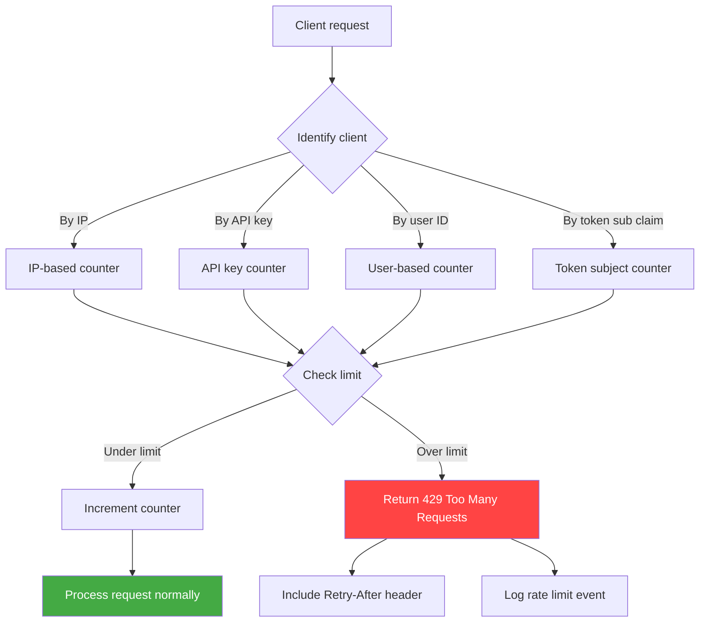
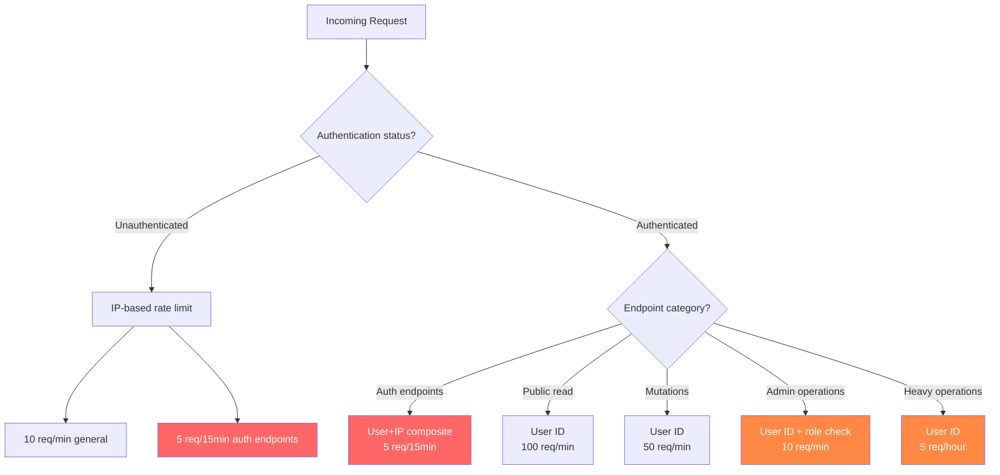
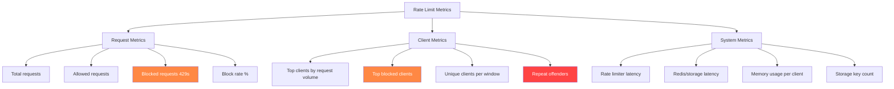
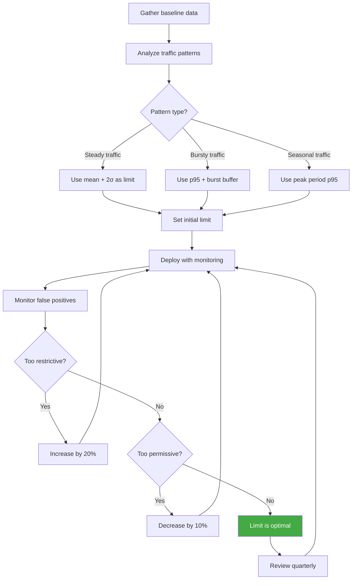
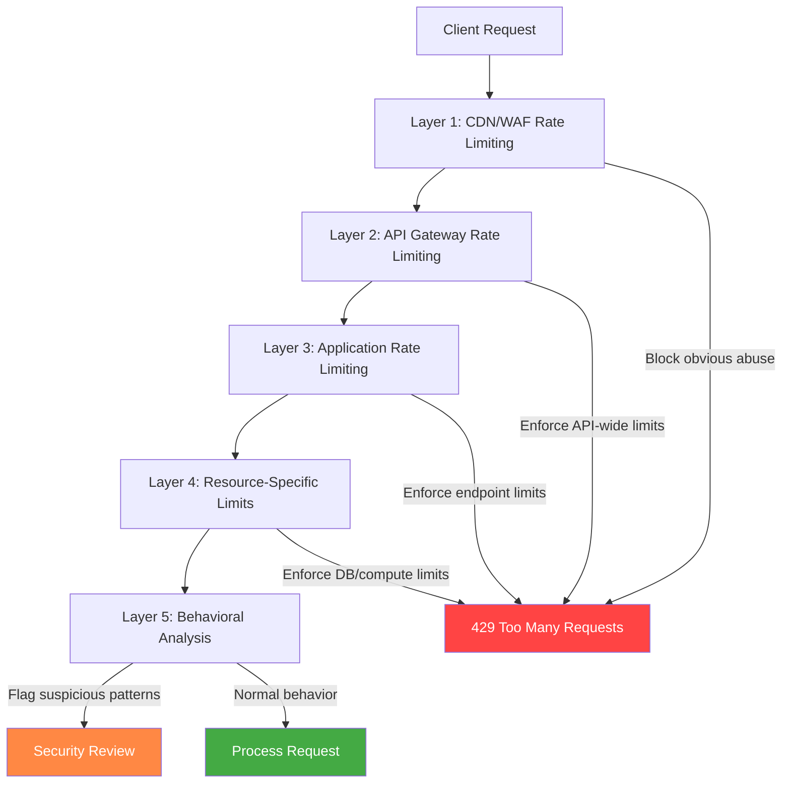

# Rate Limiting

> **Module:** API Pentesting → Defense  
> **Difficulty:** Beginner → Advanced  
> **Focus:** Understand rate limiting and throttling mechanisms, learn how to design, implement, test, and tune protective controls that prevent abuse while preserving legitimate API use.

---

## 1. Overview

**Rate limiting** is the practice of controlling how frequently a client can make requests to an API within a given timeframe.

In plain English:

> **Rate limiting says "you can make X requests per Y time period." If you exceed that, the API will reject your requests until the window resets.**

This is one of the most widely deployed API defense controls, and for good reason. Modern APIs serve:

- mobile apps that may have bugs or retry loops
- third-party integrations that may misbehave
- automated scripts that may lack backoff logic
- malicious actors attempting brute-force, credential stuffing, or resource exhaustion attacks

Without rate limiting, a single misconfigured client or hostile bot can consume all available API capacity, affecting every legitimate user.

### Why rate limiting matters in API security

| Risk | Without rate limiting | With rate limiting |
|---|---|---|
| **Brute-force attacks** | Attacker can try millions of passwords in minutes | Attacker is slowed to hundreds per hour |
| **Credential stuffing** | Stolen credentials can be tested in bulk | Attack becomes economically infeasible |
| **Resource exhaustion (DoS)** | Single client can monopolize CPU, database connections, memory | Consumption capped per client, blast radius limited |
| **Data scraping** | Entire dataset can be extracted rapidly | Extraction rate reduced to impractical levels |
| **Cost explosion** | Unlimited compute/egress charges | Budget protected, infrastructure stable |

Rate limiting is **not** a replacement for input validation, authentication, or authorization. It is a **protective layer** that enforces resource fairness and limits abuse velocity.

---

## 2. Core Concepts and Mental Model



### Key decisions

When designing rate limiting, you need to decide:

| Decision | Options | Typical use case |
|---|---|---|
| **Identifier** | IP, API key, user ID, session token, combination | User ID for authenticated, IP for public endpoints |
| **Limit scope** | Per endpoint, per resource type, global | Login: strict per endpoint; reads: lenient global |
| **Window type** | Fixed window, sliding window, token bucket, leaky bucket | Token bucket for burst tolerance, sliding for precision |
| **Limit values** | Requests per second/minute/hour/day | Public: 10/min, authenticated: 100/min, premium: 1000/min |
| **Response behavior** | Hard block, queue, dynamic throttling | Hard block for abusive patterns, queue for legitimate bursts |

### Common rate limiting algorithms

```mermaid
graph TB
    subgraph "Fixed Window"
        A1[Window 1: 0-60s<br/>Count: 5/10] --> A2[Window 2: 60-120s<br/>Count: 0/10]
    end
    
    subgraph "Sliding Window"
        B1[Current time: 75s<br/>Weighted count from<br/>last 60 seconds] --> B2[More accurate<br/>burst detection]
    end
    
    subgraph "Token Bucket"
        C1[Bucket fills at<br/>steady rate] --> C2[Each request<br/>consumes token]
        C2 --> C3[Allows bursts<br/>up to bucket size]
    end
    
    subgraph "Leaky Bucket"
        D1[Requests enter<br/>queue at any rate] --> D2[Processed at<br/>fixed rate]
        D2 --> D3[Smooths traffic<br/>but adds latency]
    end
    
    style C3 fill:#44aa88,color:#fff
    style D3 fill:#4488aa,color:#fff
```



---

## 3. Rate Limiting Algorithm Deep Dive

### Fixed Window Counter

**How it works:**

- Time is divided into fixed intervals (e.g., 1-minute windows starting at :00, :01, :02)
- Each request increments a counter for the current window
- When window expires, counter resets to zero

**Pseudocode:**

```python
def check_fixed_window(client_id, limit, window_seconds):
    current_window = floor(current_time / window_seconds)
    key = f"rate:{client_id}:{current_window}"
    
    count = redis.incr(key)
    if count == 1:
        redis.expire(key, window_seconds)
    
    if count > limit:
        return False  # Rate limit exceeded
    return True  # Request allowed
```

**Pros:**
- Simple to implement
- Memory efficient
- Fast lookups

**Cons:**
- Burst problem at window boundaries (user can make 2× limit across two adjacent windows)
- Not precise for strict rate enforcement

**Best for:** High-volume APIs where small boundary bursts are acceptable.

---

### Sliding Window Log

**How it works:**

- Store a timestamped log of each request
- On new request, remove entries older than the window
- Count remaining entries

**Pseudocode:**

```python
def check_sliding_window_log(client_id, limit, window_seconds):
    key = f"rate:{client_id}"
    now = current_timestamp()
    cutoff = now - window_seconds
    
    # Remove old entries
    redis.zremrangebyscore(key, 0, cutoff)
    
    # Count recent requests
    count = redis.zcard(key)
    
    if count >= limit:
        return False
    
    # Add current request
    redis.zadd(key, {now: now})
    redis.expire(key, window_seconds)
    return True
```

**Pros:**
- Precise, no boundary issues
- Accurate per-second rate limiting

**Cons:**
- High memory usage (stores every request timestamp)
- More expensive Redis operations

**Best for:** Critical endpoints (login, payment) where precision matters and volume is moderate.

---

### Sliding Window Counter (Hybrid)

**How it works:**

- Combines fixed window simplicity with sliding window accuracy
- Uses weighted count from current and previous windows

**Formula:**

```
weighted_count = (previous_window_count × overlap_percentage) + current_window_count
```

**Pseudocode:**

```python
def check_sliding_window_counter(client_id, limit, window_seconds):
    now = current_timestamp()
    current_window = floor(now / window_seconds)
    previous_window = current_window - 1
    
    current_key = f"rate:{client_id}:{current_window}"
    previous_key = f"rate:{client_id}:{previous_window}"
    
    current_count = redis.get(current_key) or 0
    previous_count = redis.get(previous_key) or 0
    
    # Calculate overlap percentage
    elapsed_in_window = now % window_seconds
    overlap = (window_seconds - elapsed_in_window) / window_seconds
    
    weighted_count = (previous_count × overlap) + current_count
    
    if weighted_count >= limit:
        return False
    
    redis.incr(current_key)
    redis.expire(current_key, window_seconds * 2)
    return True
```

**Pros:**
- Memory efficient (only 2 counters)
- Mitigates boundary burst problem
- Good balance of accuracy and performance

**Cons:**
- Approximation, not exact
- Slightly more complex logic

**Best for:** General-purpose API rate limiting at scale.

---

### Token Bucket

**How it works:**

- Bucket holds tokens (up to max capacity)
- Tokens are added at a steady rate
- Each request consumes one token
- If bucket is empty, request is rejected

**Pseudocode:**

```python
def check_token_bucket(client_id, capacity, refill_rate):
    key = f"rate:{client_id}"
    now = current_timestamp()
    
    bucket = redis.hmget(key, ["tokens", "last_refill"])
    
    if not bucket["tokens"]:
        # Initialize
        tokens = capacity
        last_refill = now
    else:
        tokens = float(bucket["tokens"])
        last_refill = float(bucket["last_refill"])
        
        # Refill tokens based on time elapsed
        elapsed = now - last_refill
        new_tokens = elapsed * refill_rate
        tokens = min(capacity, tokens + new_tokens)
    
    if tokens < 1:
        return False
    
    # Consume token
    tokens -= 1
    redis.hmset(key, {"tokens": tokens, "last_refill": now})
    redis.expire(key, 3600)
    return True
```

**Pros:**
- Allows controlled bursts (up to bucket capacity)
- Smooth long-term rate
- Flexible for varying traffic patterns

**Cons:**
- More complex state management
- Requires careful capacity tuning

**Best for:** APIs with legitimate burst patterns (mobile app launch, batch operations).

---

### Leaky Bucket

**How it works:**

- Requests enter a queue at any rate
- Queue drains at a fixed rate
- If queue is full, new requests are rejected

**Pseudocode:**

```python
def check_leaky_bucket(client_id, capacity, leak_rate):
    key = f"rate:{client_id}"
    now = current_timestamp()
    
    bucket = redis.hmget(key, ["queue_size", "last_leak"])
    
    if not bucket["queue_size"]:
        queue_size = 0
        last_leak = now
    else:
        queue_size = int(bucket["queue_size"])
        last_leak = float(bucket["last_leak"])
        
        # Leak requests
        elapsed = now - last_leak
        leaked = int(elapsed * leak_rate)
        queue_size = max(0, queue_size - leaked)
    
    if queue_size >= capacity:
        return False
    
    queue_size += 1
    redis.hmset(key, {"queue_size": queue_size, "last_leak": now})
    redis.expire(key, 3600)
    return True
```

**Pros:**
- Smooths traffic to backend
- Predictable processing rate

**Cons:**
- Adds latency (queueing)
- Can delay legitimate urgent requests

**Best for:** Protecting rate-sensitive backend systems (databases, external APIs).

---

## 4. Implementation Patterns

### Pattern 1: Application-level middleware

**Node.js (Express) example:**

```javascript
const rateLimit = require('express-rate-limit');
const RedisStore = require('rate-limit-redis');
const Redis = require('ioredis');

const redis = new Redis({
  host: process.env.REDIS_HOST,
  port: process.env.REDIS_PORT,
});

// General API rate limit
const apiLimiter = rateLimit({
  store: new RedisStore({
    client: redis,
    prefix: 'rl:api:',
  }),
  windowMs: 60 * 1000, // 1 minute
  max: 100, // 100 requests per minute
  standardHeaders: true, // Return rate limit info in RateLimit-* headers
  legacyHeaders: false, // Disable X-RateLimit-* headers
  handler: (req, res) => {
    res.status(429).json({
      error: 'Too Many Requests',
      message: 'Rate limit exceeded. Please try again later.',
      retryAfter: req.rateLimit.resetTime,
    });
  },
  keyGenerator: (req) => {
    // Use authenticated user ID if available, otherwise IP
    return req.user?.id || req.ip;
  },
});

// Strict rate limit for authentication endpoints
const authLimiter = rateLimit({
  store: new RedisStore({
    client: redis,
    prefix: 'rl:auth:',
  }),
  windowMs: 15 * 60 * 1000, // 15 minutes
  max: 5, // 5 attempts per 15 minutes
  skipSuccessfulRequests: true, // Don't count successful logins
  keyGenerator: (req) => {
    // Combine IP and username for precise tracking
    const username = req.body?.username || 'unknown';
    return `${req.ip}:${username}`;
  },
});

app.use('/api/', apiLimiter);
app.use('/api/auth/login', authLimiter);
app.use('/api/auth/reset-password', authLimiter);
```

---

### Pattern 2: API Gateway rate limiting

**NGINX example:**

```nginx
# Define rate limit zones
limit_req_zone $binary_remote_addr zone=general:10m rate=100r/m;
limit_req_zone $http_authorization zone=authenticated:10m rate=500r/m;
limit_req_zone $binary_remote_addr zone=auth_strict:10m rate=5r/m;

server {
    listen 443 ssl;
    server_name api.example.com;

    # General API rate limit
    location /api/ {
        limit_req zone=general burst=20 nodelay;
        limit_req_status 429;
        
        proxy_pass http://backend;
    }

    # Authenticated endpoints (higher limit)
    location /api/v1/ {
        limit_req zone=authenticated burst=50 nodelay;
        limit_req_status 429;
        
        proxy_pass http://backend;
    }

    # Strict rate limit for auth endpoints
    location ~ ^/api/auth/(login|register|reset-password) {
        limit_req zone=auth_strict burst=2 nodelay;
        limit_req_status 429;
        
        # Custom error response
        error_page 429 = @rate_limit_error;
        
        proxy_pass http://backend;
    }

    location @rate_limit_error {
        default_type application/json;
        return 429 '{"error":"Too Many Requests","message":"Rate limit exceeded"}';
    }
}
```

---

### Pattern 3: Distributed rate limiting (Go)

```go
package ratelimit

import (
    "context"
    "fmt"
    "time"
    
    "github.com/go-redis/redis/v8"
)

type RateLimiter struct {
    client *redis.Client
}

func NewRateLimiter(redisAddr string) *RateLimiter {
    return &RateLimiter{
        client: redis.NewClient(&redis.Options{
            Addr: redisAddr,
        }),
    }
}

// SlidingWindowCounter implements hybrid sliding window
func (rl *RateLimiter) Allow(ctx context.Context, key string, limit int, window time.Duration) (bool, error) {
    now := time.Now().Unix()
    windowSeconds := int64(window.Seconds())
    currentWindow := now / windowSeconds
    previousWindow := currentWindow - 1
    
    currentKey := fmt.Sprintf("rate:%s:%d", key, currentWindow)
    previousKey := fmt.Sprintf("rate:%s:%d", key, previousWindow)
    
    pipe := rl.client.Pipeline()
    currentCmd := pipe.Get(ctx, currentKey)
    previousCmd := pipe.Get(ctx, previousKey)
    _, err := pipe.Exec(ctx)
    
    var currentCount, previousCount int64
    if err != redis.Nil && err != nil {
        return false, err
    }
    
    if err := currentCmd.Err(); err == nil {
        currentCmd.Int64(&currentCount)
    }
    if err := previousCmd.Err(); err == nil {
        previousCmd.Int64(&previousCount)
    }
    
    // Calculate weighted count
    elapsedInWindow := now % windowSeconds
    overlapPct := float64(windowSeconds-elapsedInWindow) / float64(windowSeconds)
    weightedCount := int64(float64(previousCount)*overlapPct) + currentCount
    
    if weightedCount >= int64(limit) {
        return false, nil
    }
    
    // Increment current window
    pipe = rl.client.Pipeline()
    pipe.Incr(ctx, currentKey)
    pipe.Expire(ctx, currentKey, window*2)
    _, err = pipe.Exec(ctx)
    
    return true, err
}

// TokenBucket implements token bucket algorithm
func (rl *RateLimiter) AllowTokenBucket(ctx context.Context, key string, capacity, refillRate float64) (bool, error) {
    script := redis.NewScript(`
        local key = KEYS[1]
        local capacity = tonumber(ARGV[1])
        local refill_rate = tonumber(ARGV[2])
        local now = tonumber(ARGV[3])
        
        local bucket = redis.call('HMGET', key, 'tokens', 'last_refill')
        local tokens = tonumber(bucket[1])
        local last_refill = tonumber(bucket[2])
        
        if not tokens then
            tokens = capacity
            last_refill = now
        else
            local elapsed = now - last_refill
            local new_tokens = elapsed * refill_rate
            tokens = math.min(capacity, tokens + new_tokens)
            last_refill = now
        end
        
        if tokens < 1 then
            redis.call('HMSET', key, 'tokens', tokens, 'last_refill', last_refill)
            redis.call('EXPIRE', key, 3600)
            return 0
        end
        
        tokens = tokens - 1
        redis.call('HMSET', key, 'tokens', tokens, 'last_refill', last_refill)
        redis.call('EXPIRE', key, 3600)
        return 1
    `)
    
    now := float64(time.Now().Unix())
    result, err := script.Run(ctx, rl.client, []string{key}, capacity, refillRate, now).Int()
    
    return result == 1, err
}
```

---

## 5. Granular Rate Limiting Strategies

### Strategy matrix



### Recommended limits by endpoint type

| Endpoint type | Unauthenticated | Authenticated (basic) | Authenticated (premium) | Algorithm |
|---|---|---|---|---|
| **Login / auth** | 5/15min per IP+username | N/A | N/A | Sliding window |
| **Password reset** | 3/hour per IP | 5/hour per user | 10/hour per user | Sliding window |
| **Public search / list** | 10/min per IP | 100/min per user | 1000/min per user | Token bucket |
| **Resource read (GET)** | 30/min per IP | 300/min per user | 3000/min per user | Sliding window counter |
| **Resource write (POST/PUT)** | Block or 5/min per IP | 100/min per user | 500/min per user | Sliding window |
| **File upload** | Block or 2/hour per IP | 10/hour per user | 50/hour per user | Token bucket |
| **Export / report generation** | Block | 5/hour per user | 20/hour per user | Fixed window |
| **Admin operations** | Block | 10/min per user+role | 50/min per user+role | Sliding window |
| **GraphQL queries** | 10/min per IP | 100/min per user (with complexity limit) | 500/min per user | Token bucket + cost analysis |

---

## 6. HTTP Response Headers and Client Communication

### Standard headers

When rate limiting is active, APIs should return clear metadata:

```http
HTTP/1.1 200 OK
RateLimit-Limit: 100
RateLimit-Remaining: 73
RateLimit-Reset: 1678901234

HTTP/1.1 429 Too Many Requests
RateLimit-Limit: 100
RateLimit-Remaining: 0
RateLimit-Reset: 1678901294
Retry-After: 60
Content-Type: application/json

{
  "error": "rate_limit_exceeded",
  "message": "You have exceeded the rate limit of 100 requests per minute.",
  "limit": 100,
  "remaining": 0,
  "reset": 1678901294,
  "retryAfter": 60
}
```

### Header reference

| Header | Description | Example |
|---|---|---|
| `RateLimit-Limit` | Maximum requests allowed in window | `100` |
| `RateLimit-Remaining` | Requests remaining in current window | `73` |
| `RateLimit-Reset` | Unix timestamp when limit resets | `1678901234` |
| `Retry-After` | Seconds until client should retry | `60` |
| `X-RateLimit-*` | Legacy headers (still widely used) | `X-RateLimit-Limit: 100` |

### Draft IETF standard (RateLimit Fields)

The IETF has a draft specification for standardized rate limit headers:

```http
RateLimit-Policy: 100;w=60
RateLimit-Limit: 100
RateLimit-Remaining: 73
RateLimit-Reset: 47
```

Where:
- `RateLimit-Policy`: Describes the policy (100 requests per 60-second window)
- `RateLimit-Reset`: Seconds until reset (not Unix timestamp)

Ref: [draft-ietf-httpapi-ratelimit-headers](https://datatracker.ietf.org/doc/html/draft-ietf-httpapi-ratelimit-headers)

---

## 7. Advanced Patterns and Edge Cases

### Dynamic rate limiting based on behavior

```python
def get_dynamic_limit(user_id, base_limit):
    """Adjust rate limit based on user reputation"""
    
    # Check recent violations
    violations = redis.get(f"violations:{user_id}") or 0
    
    # Check account age and activity
    account_age_days = get_account_age(user_id)
    activity_score = get_activity_score(user_id)  # 0-100
    
    # Calculate multiplier
    multiplier = 1.0
    
    if violations > 5:
        multiplier *= 0.5  # Reduce limit by 50% for repeat offenders
    
    if account_age_days < 7:
        multiplier *= 0.7  # New accounts get reduced limits
    elif account_age_days > 365:
        multiplier *= 1.5  # Trusted accounts get bonus
    
    if activity_score > 80:
        multiplier *= 1.3  # Active, legitimate users get bonus
    
    return int(base_limit * multiplier)
```

---

### Burst allowance with penalties

```python
def check_with_burst_penalty(client_id, base_limit, burst_limit, window):
    """Allow bursts but track for pattern analysis"""
    
    count = get_request_count(client_id, window)
    
    if count < base_limit:
        return True, "allowed"
    elif count < burst_limit:
        # Allow but flag for monitoring
        log_burst_event(client_id, count)
        return True, "burst_allowed"
    else:
        # Apply temporary penalty
        apply_penalty(client_id, duration=300)  # 5-minute timeout
        return False, "rate_limit_exceeded"
```

---

### Rate limiting by resource cost

For GraphQL or complex query APIs:

```python
def calculate_query_cost(query_ast):
    """Calculate cost based on query complexity"""
    cost = 0
    
    for field in query_ast.fields:
        cost += 1  # Base cost per field
        
        if field.has_nested_selection():
            cost += calculate_query_cost(field.selection_set)
        
        if field.has_pagination():
            limit = field.arguments.get('limit', 10)
            cost += limit * 0.1  # Pagination cost
        
        if field.requires_join():
            cost += 5  # Expensive database joins
    
    return cost

def check_cost_based_limit(user_id, query_cost, max_cost_per_minute):
    """Track cumulative query cost instead of request count"""
    key = f"cost:{user_id}:{current_minute()}"
    
    current_cost = redis.get(key) or 0
    
    if current_cost + query_cost > max_cost_per_minute:
        return False
    
    redis.incrby(key, query_cost)
    redis.expire(key, 60)
    return True
```

---

### Distributed consensus for global limits

When running multiple API instances:

```python
# Option 1: Centralized counter (Redis)
def check_global_limit_redis(key, limit, window):
    return redis_sliding_window_counter(key, limit, window)

# Option 2: Gossip protocol for eventual consistency
# (Lower precision, higher performance)
def check_global_limit_gossip(key, limit, window):
    local_count = local_cache.get(key) or 0
    estimated_global_count = local_count * num_instances
    
    if estimated_global_count > limit * 0.9:  # 90% threshold
        # Fall back to Redis for precise check
        return check_global_limit_redis(key, limit, window)
    
    local_cache.incr(key)
    return True
```

---

## 8. Testing and Validation

### Automated rate limit testing

```python
import asyncio
import aiohttp
import time

async def test_rate_limit(url, expected_limit, window_seconds):
    """Test rate limiting behavior"""
    
    headers = {"Authorization": "Bearer test_token"}
    results = {
        "allowed": 0,
        "blocked": 0,
        "first_block_at": None,
        "headers_accurate": True
    }
    
    async with aiohttp.ClientSession() as session:
        tasks = []
        for i in range(expected_limit + 20):
            tasks.append(make_request(session, url, headers, i))
        
        responses = await asyncio.gather(*tasks)
        
        for i, (status, response_headers) in enumerate(responses):
            if status == 200:
                results["allowed"] += 1
                
                # Verify headers
                if "RateLimit-Remaining" in response_headers:
                    remaining = int(response_headers["RateLimit-Remaining"])
                    expected_remaining = expected_limit - (i + 1)
                    if remaining != expected_remaining:
                        results["headers_accurate"] = False
            
            elif status == 429:
                results["blocked"] += 1
                if results["first_block_at"] is None:
                    results["first_block_at"] = i
        
        # Verify behavior
        assert results["allowed"] == expected_limit, \
            f"Expected {expected_limit} allowed, got {results['allowed']}"
        
        assert results["blocked"] > 0, \
            "Rate limiting not enforced"
        
        assert results["first_block_at"] == expected_limit, \
            f"First block at request {results['first_block_at']}, expected {expected_limit}"
        
        assert results["headers_accurate"], \
            "RateLimit-Remaining headers inaccurate"
        
        print(f"✓ Rate limit test passed: {expected_limit} requests allowed, then blocked")
        
        # Test window reset
        print(f"Waiting {window_seconds}s for window reset...")
        await asyncio.sleep(window_seconds + 1)
        
        async with session.get(url, headers=headers) as resp:
            assert resp.status == 200, "Rate limit did not reset after window"
            print(f"✓ Rate limit reset after {window_seconds}s window")

async def make_request(session, url, headers, index):
    try:
        async with session.get(url, headers=headers) as resp:
            return resp.status, resp.headers
    except Exception as e:
        print(f"Request {index} failed: {e}")
        return None, {}

# Run test
asyncio.run(test_rate_limit(
    "https://api.example.com/v1/users",
    expected_limit=100,
    window_seconds=60
))
```

---

### Manual testing with curl

```bash
# Test basic rate limiting
for i in {1..15}; do
  curl -i https://api.example.com/v1/users \
    -H "Authorization: Bearer YOUR_TOKEN" \
    | grep -E "(HTTP|RateLimit)"
  sleep 0.5
done

# Test rate limit headers
curl -i https://api.example.com/v1/users \
  -H "Authorization: Bearer YOUR_TOKEN" \
  | grep -i ratelimit

# Expected output:
# RateLimit-Limit: 100
# RateLimit-Remaining: 99
# RateLimit-Reset: 1678901234

# Test 429 response after exceeding limit
for i in {1..120}; do
  curl -s -o /dev/null -w "%{http_code}\n" \
    https://api.example.com/v1/users \
    -H "Authorization: Bearer YOUR_TOKEN"
done | sort | uniq -c

# Expected output:
#     100 200
#      20 429
```

---

### Load testing with k6

```javascript
import http from 'k6/http';
import { check, sleep } from 'k6';

export const options = {
  stages: [
    { duration: '30s', target: 50 },   // Ramp up
    { duration: '1m', target: 100 },   // Stay at peak
    { duration: '30s', target: 0 },    // Ramp down
  ],
  thresholds: {
    http_req_duration: ['p(95)<500'], // 95% of requests under 500ms
    'http_req_duration{status:429}': ['p(95)<100'], // 429s should be fast
  },
};

export default function () {
  const url = 'https://api.example.com/v1/users';
  const headers = {
    'Authorization': 'Bearer YOUR_TOKEN',
  };
  
  const res = http.get(url, { headers });
  
  check(res, {
    'status is 200 or 429': (r) => r.status === 200 || r.status === 429,
    'has RateLimit headers': (r) => 
      r.headers['Ratelimit-Limit'] !== undefined,
    '429 includes Retry-After': (r) =>
      r.status !== 429 || r.headers['Retry-After'] !== undefined,
  });
  
  if (res.status === 429) {
    const retryAfter = parseInt(res.headers['Retry-After'] || '60');
    console.log(`Rate limited, retrying after ${retryAfter}s`);
    sleep(retryAfter);
  } else {
    sleep(0.1);
  }
}
```

---

## 9. Monitoring and Observability

### Key metrics to track



---

### Prometheus metrics example

```python
from prometheus_client import Counter, Histogram, Gauge

# Counters
rate_limit_requests_total = Counter(
    'api_rate_limit_requests_total',
    'Total API requests processed by rate limiter',
    ['endpoint', 'status']
)

rate_limit_blocks_total = Counter(
    'api_rate_limit_blocks_total',
    'Total requests blocked by rate limiter',
    ['endpoint', 'client_type']
)

# Histograms
rate_limit_check_duration = Histogram(
    'api_rate_limit_check_duration_seconds',
    'Time spent checking rate limits',
    ['algorithm']
)

# Gauges
rate_limit_clients_active = Gauge(
    'api_rate_limit_clients_active',
    'Number of active clients tracked by rate limiter'
)

# Usage in middleware
@rate_limit_check_duration.labels(algorithm='sliding_window').time()
def check_rate_limit(client_id, limit, window):
    # ... rate limit logic ...
    pass

def record_rate_limit_decision(endpoint, allowed, client_type):
    status = 'allowed' if allowed else 'blocked'
    rate_limit_requests_total.labels(
        endpoint=endpoint,
        status=status
    ).inc()
    
    if not allowed:
        rate_limit_blocks_total.labels(
            endpoint=endpoint,
            client_type=client_type
        ).inc()
```

---

### Alert conditions

```yaml
# Prometheus alert rules
groups:
  - name: rate_limiting
    interval: 30s
    rules:
      # High block rate
      - alert: HighRateLimitBlockRate
        expr: |
          rate(api_rate_limit_blocks_total[5m]) /
          rate(api_rate_limit_requests_total[5m]) > 0.3
        for: 5m
        labels:
          severity: warning
        annotations:
          summary: "High rate limit block rate ({{ $value | humanizePercentage }})"
          description: "More than 30% of requests are being rate limited"
      
      # Specific client abuse
      - alert: ClientExcessiveBlocking
        expr: |
          rate(api_rate_limit_blocks_total{client_type="single"}[10m]) > 100
        for: 10m
        labels:
          severity: critical
        annotations:
          summary: "Client being blocked excessively ({{ $value }} blocks/sec)"
          description: "Consider temporary ban or further investigation"
      
      # Rate limiter performance degradation
      - alert: RateLimiterSlowdown
        expr: |
          histogram_quantile(0.95,
            rate(api_rate_limit_check_duration_seconds_bucket[5m])
          ) > 0.050
        for: 5m
        labels:
          severity: warning
        annotations:
          summary: "Rate limiter checks are slow (p95: {{ $value }}s)"
          description: "Rate limit checks taking over 50ms at p95"
```

---

## 10. Tuning and Optimization

### Identifying the right limits



---

### Performance considerations

| Factor | Impact | Mitigation |
|---|---|---|
| **Redis latency** | Each request requires Redis lookup | Use pipelining, connection pooling, nearby Redis instance |
| **Memory usage** | High cardinality (many clients) uses more RAM | Set TTL on all keys, use LRU eviction policy, consider key prefix compression |
| **Algorithm complexity** | Sliding window log uses more CPU | Use sliding window counter for high-volume endpoints |
| **Network overhead** | Distributed systems add latency | Implement local cache with eventual consistency for non-critical limits |
| **Lock contention** | Concurrent increments on same key | Use Lua scripts for atomic operations, shard by client ID |

---

### Redis optimization

```lua
-- Optimized Lua script for atomic sliding window counter
local key_current = KEYS[1]
local key_previous = KEYS[2]
local limit = tonumber(ARGV[1])
local window_seconds = tonumber(ARGV[2])
local now = tonumber(ARGV[3])

-- Get counts
local count_current = tonumber(redis.call('GET', key_current) or 0)
local count_previous = tonumber(redis.call('GET', key_previous) or 0)

-- Calculate weighted count
local elapsed_in_window = now % window_seconds
local overlap_pct = (window_seconds - elapsed_in_window) / window_seconds
local weighted_count = math.floor(count_previous * overlap_pct) + count_current

-- Check limit
if weighted_count >= limit then
    return {0, weighted_count, limit}
end

-- Increment and set TTL
local new_count = redis.call('INCR', key_current)
redis.call('EXPIRE', key_current, window_seconds * 2)

return {1, weighted_count + 1, limit}
```

```python
# Use Lua script to minimize round trips
def check_limit_atomic(redis_client, client_id, limit, window_seconds):
    now = time.time()
    current_window = int(now // window_seconds)
    previous_window = current_window - 1
    
    key_current = f"rate:{client_id}:{current_window}"
    key_previous = f"rate:{client_id}:{previous_window}"
    
    result = RATE_LIMIT_SCRIPT(
        keys=[key_current, key_previous],
        args=[limit, window_seconds, now],
        client=redis_client
    )
    
    allowed, current_count, limit_value = result
    return bool(allowed), current_count, limit_value
```

---

## 11. Security Considerations

### Bypass techniques (what you're defending against)

| Attack vector | How it works | Defense |
|---|---|---|
| **IP rotation** | Attacker uses proxy pools, VPNs, or botnets to rotate IPs | Use authenticated identifiers (API key, user ID), implement device fingerprinting |
| **Distributed attacks** | Attack spread across many real IPs | Implement global rate limits, behavioral analysis, CAPTCHA for suspicious patterns |
| **Header manipulation** | Spoofing X-Forwarded-For or similar headers | Trust only headers from known proxies, use connection IP when possible |
| **API key sharing** | Multiple attackers share compromised API keys | Monitor for anomalous geo-distribution, concurrent usage patterns |
| **Session token generation** | Rapidly creating new sessions to bypass user-based limits | Rate limit registration/login, require email verification, implement CAPTCHA |
| **GraphQL batching abuse** | Sending multiple operations in single request | Count batched operations separately, implement query cost analysis |
| **Cache pollution** | Deliberately triggering expensive cache misses | Separate rate limits for cache hits vs misses |
| **Timing-based bypass** | Exploiting boundary conditions in fixed windows | Use sliding window or token bucket algorithms |

---

### Defense in depth



---

### Combining rate limiting with other controls

```python
def comprehensive_abuse_prevention(request):
    """Multi-layered abuse prevention"""
    
    client_id = get_client_identifier(request)
    endpoint = request.path
    
    # Layer 1: Basic rate limiting
    if not check_rate_limit(client_id, endpoint):
        return error_response(429, "Rate limit exceeded")
    
    # Layer 2: Credential stuffing protection
    if endpoint == "/auth/login":
        if not check_login_attempt_pattern(client_id, request.body["username"]):
            # Suspicious login pattern detected
            require_captcha(client_id)
            return error_response(403, "Additional verification required")
    
    # Layer 3: Resource consumption limits
    if request.method in ["POST", "PUT", "DELETE"]:
        if not check_resource_quota(client_id):
            return error_response(429, "Resource quota exceeded")
    
    # Layer 4: Behavioral analysis
    risk_score = calculate_risk_score(client_id, request)
    if risk_score > 80:
        log_security_event("high_risk_request", client_id, risk_score)
        # Apply stricter temporary limits
        apply_temporary_restriction(client_id, duration=3600)
    
    # Layer 5: CAPTCHA for suspicious patterns
    if requires_captcha(client_id) and not verify_captcha(request):
        return error_response(403, "CAPTCHA verification required")
    
    return None  # All checks passed
```

---

## 12. Common Pitfalls and How to Avoid Them

### Pitfall 1: Rate limiting only by IP

**Problem:**
- Shared IPs (corporate NATs, VPNs) penalize legitimate users
- Easy to bypass with IP rotation

**Solution:**
```python
def get_composite_key(request):
    """Use multiple identifiers for more accurate rate limiting"""
    
    if request.user_id:
        # Authenticated requests: use user ID
        return f"user:{request.user_id}"
    
    if request.api_key:
        # API key requests: use key ID
        return f"key:{request.api_key}"
    
    # Fallback to IP, but be more lenient
    return f"ip:{request.ip}"

# Apply different limits based on identifier type
limits = {
    "user": 1000,  # Authenticated users get high limits
    "key": 500,    # API keys get moderate limits
    "ip": 50,      # Anonymous IPs get low limits
}
```

---

### Pitfall 2: Forgetting to return proper headers

**Problem:**
- Clients cannot implement proper backoff logic
- Support tickets increase due to confusion

**Solution:**
```python
def add_rate_limit_headers(response, client_id, endpoint):
    """Always include rate limit headers, even on success"""
    
    limit, remaining, reset = get_rate_limit_info(client_id, endpoint)
    
    response.headers['RateLimit-Limit'] = str(limit)
    response.headers['RateLimit-Remaining'] = str(remaining)
    response.headers['RateLimit-Reset'] = str(reset)
    
    if remaining == 0:
        retry_after = reset - int(time.time())
        response.headers['Retry-After'] = str(retry_after)
    
    return response
```

---

### Pitfall 3: Applying same limit to all endpoints

**Problem:**
- Login endpoints need stricter limits than read endpoints
- Heavy operations exhaust limits for light operations

**Solution:**
```python
# Define endpoint-specific limits
RATE_LIMITS = {
    "/auth/login": {"limit": 5, "window": 900},           # 5/15min
    "/auth/register": {"limit": 3, "window": 3600},       # 3/hour
    "/api/v1/search": {"limit": 100, "window": 60},       # 100/min
    "/api/v1/export": {"limit": 5, "window": 3600},       # 5/hour
    "/api/v1/users": {"limit": 300, "window": 60},        # 300/min
    "default": {"limit": 100, "window": 60},              # 100/min default
}

def get_limit_for_endpoint(endpoint):
    # Match specific endpoint or fall back to default
    return RATE_LIMITS.get(endpoint, RATE_LIMITS["default"])
```

---

### Pitfall 4: Not handling distributed systems correctly

**Problem:**
- Each server instance tracks limits independently
- Global limit is effectively multiplied by number of instances

**Solution:**
```python
# Centralized rate limiting with Redis
def check_distributed_rate_limit(client_id, limit, window):
    """Single source of truth for rate limits across all instances"""
    
    # All instances check same Redis key
    key = f"global:rate:{client_id}"
    
    count = redis.incr(key)
    if count == 1:
        redis.expire(key, window)
    
    return count <= limit
```

---

### Pitfall 5: Memory leaks from unbounded key creation

**Problem:**
- Rate limiter creates keys for every unique client ID
- Memory grows unbounded over time

**Solution:**
```python
# Always set TTL on rate limit keys
def safe_rate_limit_increment(key, window_seconds):
    count = redis.incr(key)
    
    # Set TTL if this is the first increment
    if count == 1:
        redis.expire(key, window_seconds * 2)  # 2x window for safety
    
    return count

# Use Redis LRU eviction as safety net
# In redis.conf:
# maxmemory 2gb
# maxmemory-policy allkeys-lru
```

---

## 13. Tools and Libraries

### Popular rate limiting libraries

| Language/Framework | Library | Algorithm support | Notes |
|---|---|---|---|
| **Node.js / Express** | `express-rate-limit` | Fixed window, sliding window | Redis-backed, flexible middleware |
| **Python / Django** | `django-ratelimit` | Fixed window | Decorator-based, Redis or cache backend |
| **Python / Flask** | `Flask-Limiter` | Fixed window, sliding window | Multiple storage backends |
| **Go** | `golang.org/x/time/rate` | Token bucket | Built-in, no external dependencies |
| **Go** | `tollbooth` | Token bucket, fixed window | Flexible, multiple backends |
| **Ruby / Rails** | `rack-attack` | Fixed window, throttling | Middleware, Redis-backed |
| **Java / Spring** | `bucket4j` | Token bucket | JSR-107 compatible, distributed |
| **.NET** | `AspNetCoreRateLimit` | Fixed window, IP/client tracking | Middleware, in-memory or Redis |
| **Rust** | `governor` | Token bucket, leaky bucket | High performance, async support |

---

### Cloud provider solutions

| Provider | Service | Features | Best for |
|---|---|---|---|
| **AWS** | API Gateway throttling | Token bucket, stage/method level limits | Serverless APIs |
| **AWS** | WAF Rate-Based Rules | Fixed window, IP-based | DDoS protection |
| **Google Cloud** | Cloud Armor rate limiting | Fixed/rolling window, regex matching | GCP services |
| **Azure** | API Management rate limit | Fixed window, quota policies | Azure-hosted APIs |
| **Cloudflare** | Rate Limiting Rules | Multiple algorithms, adaptive | CDN-integrated protection |
| **Fastly** | Rate limiting | Edge-computed, VCL customizable | Edge protection |

---

### Standalone rate limiting services

- **Kong** - API gateway with plugins for rate limiting (local, Redis, cluster)
- **Tyk** - API gateway with distributed rate limiting
- **Envoy** - Service mesh with global and local rate limiting
- **NGINX Plus** - Advanced rate limiting with clustering
- **Redis** - Can be used directly with custom logic for high-performance limiting

---

## 14. Compliance and Legal Considerations

### GDPR implications

When rate limiting uses IP addresses or user identifiers:

- **IP addresses are personal data** under GDPR
- Retention should be limited to operational necessity
- Privacy policy should disclose rate limiting practices
- Users should have visibility into their rate limit status

**Best practice:**
```python
# Hash IP addresses before storing
import hashlib

def get_privacy_safe_identifier(ip_address):
    # One-way hash with daily rotation
    salt = get_daily_salt()
    return hashlib.sha256(f"{ip_address}{salt}".encode()).hexdigest()[:16]
```

---

### SLA considerations

If you offer API SLAs, rate limits must be clearly documented:

```yaml
# Example SLA document excerpt
rate_limits:
  free_tier:
    requests_per_minute: 60
    requests_per_day: 10000
    burst_allowance: 10
    
  standard_tier:
    requests_per_minute: 600
    requests_per_day: 100000
    burst_allowance: 50
    
  enterprise_tier:
    requests_per_minute: 6000
    requests_per_day: unlimited
    burst_allowance: 200
    custom_limits: "Negotiable per contract"
```

---

## 15. Best Practices Checklist

### Implementation checklist

- [ ] **Choose appropriate identifier** (IP, user ID, API key, or composite)
- [ ] **Select algorithm** based on traffic patterns (sliding window, token bucket, etc.)
- [ ] **Set endpoint-specific limits** (auth, read, write, heavy operations)
- [ ] **Return standard headers** (RateLimit-*, Retry-After)
- [ ] **Provide clear error messages** with actionable guidance
- [ ] **Use centralized storage** (Redis) for distributed systems
- [ ] **Set TTL on all keys** to prevent memory leaks
- [ ] **Implement monitoring** (metrics, alerts, dashboards)
- [ ] **Document limits** in API documentation and SLAs
- [ ] **Test limits** under load and verify behavior
- [ ] **Plan for bypass** (admin overrides, allowlists for partners)
- [ ] **Consider premium tiers** with higher limits
- [ ] **Log rate limit events** for security analysis
- [ ] **Graceful degradation** (don't fail open if rate limiter is down)
- [ ] **Compliance review** (GDPR, data retention policies)

---

### Defense-in-depth checklist

- [ ] **Layer 1:** CDN/WAF-level rate limiting (DDoS protection)
- [ ] **Layer 2:** API gateway rate limiting (global limits)
- [ ] **Layer 3:** Application rate limiting (endpoint-specific)
- [ ] **Layer 4:** Resource quotas (database connections, compute time)
- [ ] **Layer 5:** Behavioral analysis (anomaly detection)
- [ ] **Layer 6:** CAPTCHA for suspicious patterns
- [ ] **Layer 7:** Temporary bans for repeat offenders

---

## 16. Real-World Examples

### GitHub API rate limiting

GitHub uses a sophisticated tiered approach:

```http
# Unauthenticated requests
GET /users/octocat
RateLimit-Limit: 60
RateLimit-Remaining: 59
RateLimit-Reset: 1678901234

# Authenticated requests (OAuth)
GET /user
Authorization: Bearer ghp_xxx
RateLimit-Limit: 5000
RateLimit-Remaining: 4999

# GraphQL API (separate limit with cost calculation)
POST /graphql
X-RateLimit-Limit: 5000
X-RateLimit-Remaining: 4950
X-RateLimit-Cost: 5  # This query cost 5 points
```

Ref: [GitHub REST API rate limiting](https://docs.github.com/en/rest/rate-limit)

---

### Stripe API rate limiting

Stripe uses a rolling rate limiter with multiple dimensions:

- **Read operations:** 100 requests per second
- **Write operations:** 100 requests per second (separate pool)
- **Account-level limits:** Protect individual connected accounts

They return a `429 Too Many Requests` with a concurrency-aware approach.

Ref: [Stripe rate limits](https://stripe.com/docs/rate-limits)

---

### Twitter API rate limiting

Twitter uses a **15-minute fixed window** with endpoint-specific limits:

```http
GET /2/tweets/search/recent
X-Rate-Limit-Limit: 450
X-Rate-Limit-Remaining: 449
X-Rate-Limit-Reset: 1678901234  # Unix timestamp
```

Different tiers (Essential, Elevated, Academic) have different limits.

Ref: [Twitter API rate limits](https://developer.twitter.com/en/docs/twitter-api/rate-limits)

---

## 17. Future Trends

### Adaptive rate limiting with ML

Emerging pattern: Using machine learning to dynamically adjust limits based on:

- Historical behavior patterns
- Real-time anomaly detection
- User reputation scores
- Traffic forecasting

```python
# Conceptual adaptive rate limiting
def get_adaptive_limit(client_id, base_limit):
    user_profile = ml_model.predict_user_profile(client_id)
    
    # Model outputs trust score (0-100)
    trust_score = user_profile["trust_score"]
    
    # Adjust limit based on trust
    if trust_score > 90:
        return base_limit * 2  # Trusted user
    elif trust_score < 30:
        return base_limit * 0.3  # Suspicious user
    else:
        return base_limit
```

---

### Decentralized rate limiting (Web3)

For decentralized APIs and blockchain applications:

- Token-based rate limiting (consume tokens per request)
- On-chain rate limit verification
- Stake-weighted access (higher stake = higher limits)

---

### Regulatory compliance automation

As privacy regulations evolve, rate limiting systems will need:

- Automated GDPR/CCPA compliance tracking
- Privacy-preserving rate limit enforcement (zero-knowledge proofs)
- Transparent audit logs for regulators

---

## 18. Additional Resources

### Standards and specifications

- [IETF Draft: RateLimit Header Fields for HTTP](https://datatracker.ietf.org/doc/html/draft-ietf-httpapi-ratelimit-headers)
- [RFC 6585: Additional HTTP Status Codes (429 Too Many Requests)](https://www.rfc-editor.org/rfc/rfc6585)
- [OWASP API Security Top 10](https://owasp.org/www-project-api-security/)

### Academic papers

- [Generic Cell Rate Algorithm (GCRA)](https://en.wikipedia.org/wiki/Generic_cell_rate_algorithm) - Foundation for leaky bucket
- [Token Bucket Algorithm](https://en.wikipedia.org/wiki/Token_bucket) - Classic traffic shaping

### Industry blogs

- [Stripe: Scaling API with rate limiters](https://stripe.com/blog/rate-limiters)
- [Cloudflare: How we built rate limiting](https://blog.cloudflare.com/counting-things-a-lot-of-different-things/)
- [Kong: Rate limiting algorithms explained](https://konghq.com/blog/engineering/how-to-design-a-scalable-rate-limiting-algorithm)

### Tools

- [Redis](https://redis.io/) - Fast in-memory data store for distributed rate limiting
- [Apache JMeter](https://jmeter.apache.org/) - Load testing to validate rate limits
- [k6](https://k6.io/) - Modern load testing tool
- [Vegeta](https://github.com/tsenart/vegeta) - HTTP load testing tool

---

## Summary

Rate limiting is a **critical defensive control** for API security, protecting against:

- Brute-force attacks
- Credential stuffing
- Resource exhaustion (DoS)
- Data scraping
- Cost overruns

**Key takeaways:**

1. **Choose the right algorithm** - Token bucket for burst tolerance, sliding window for precision
2. **Use appropriate identifiers** - User ID for authenticated, IP as fallback
3. **Set endpoint-specific limits** - Auth endpoints need stricter controls
4. **Return proper headers** - Enable client-side backoff logic
5. **Monitor and tune** - Adjust limits based on real traffic patterns
6. **Layer defenses** - Rate limiting is one part of a defense-in-depth strategy

Well-designed rate limiting balances **security** (preventing abuse) with **usability** (allowing legitimate use), and is transparent to clients through clear headers and error messages.

---

*This guide provides defensive and testing-focused knowledge for authorized API security work. Always obtain proper authorization before testing any system you do not own.*
