# Secure API Design

> **Module:** API Pentesting → Defense  
> **Difficulty:** Intermediate → Advanced  
> **Focus:** Build secure APIs from the ground up using security-by-design principles, learn foundational patterns that prevent common vulnerabilities, and establish defensive practices that scale across REST, GraphQL, gRPC, and modern API architectures.

---

## 1. Overview

**Secure API design** means building APIs where security is not retrofitted after launch, but embedded into every architecture decision, data flow, and integration point from day one.

The mindset shift:

> **Traditional approach:** Build functionality first, add security before release.  
> **Secure-by-design approach:** Security constraints shape the API's architecture, schema, and contracts from the first line of code.

This is not about paranoia or blocking progress. It is about recognizing that APIs have unique attack surfaces:

- **Programmatic access** means automated attacks at scale
- **Stateless architectures** mean trust decisions repeat with every request
- **Object references** travel constantly between clients and servers
- **Complex authorization** often spans tenants, roles, resources, and actions
- **Composition patterns** (microservices, GraphQL federations, API gateways) create chained trust assumptions

Security-by-design reduces the cognitive load of defending APIs later. When authorization, input validation, rate limiting, and audit logging are built into the framework and become automatic, teams ship faster and safer.

---

## 2. Core Security Principles for API Design

These principles apply across all API types and all tech stacks.

### 2.1 Deny by Default

Every access decision should assume **no access** unless explicitly granted.

| Pattern | Why it matters |
|---------|----------------|
| **Whitelist over blacklist** | Blocking known-bad patterns misses new attack variants. Allowing known-good patterns scales better. |
| **Explicit grants over implicit trust** | A user having valid credentials does not mean they can access every endpoint or every object. |
| **Fail closed, not open** | If authorization logic errors, the system should deny, not fall back to permissive behavior. |

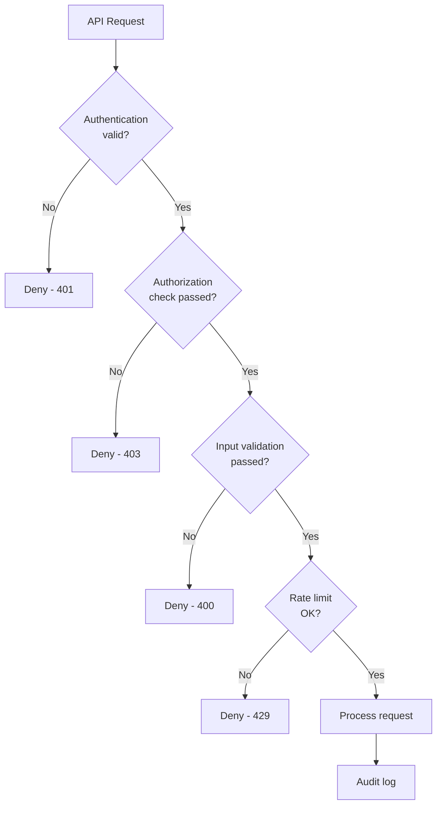

**Implementation guidance:**

- Start with `403 Forbidden` as the default HTTP response
- Require explicit permission grants at the code level
- Use framework middleware that denies by default
- Avoid "admin bypass" conditionals scattered across business logic

---

### 2.2 Least Privilege

Users, services, and API keys should have **only** the permissions required to complete their specific task.

| Concept | Example |
|---------|---------|
| **Scope tokens narrowly** | A CI/CD pipeline token should access repositories, not billing settings. |
| **Separate read and write permissions** | A mobile app might read user profiles but never delete accounts. |
| **Time-bound credentials** | Temporary tokens expire after minutes or hours, not years. |
| **Resource-specific grants** | Access to `/projects/123` does not imply access to `/projects/456`. |

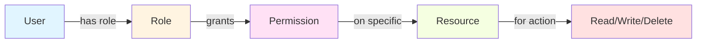

**Common mistakes:**

- Granting `admin` role to simplify early development
- Using long-lived API keys without rotation
- Giving service accounts permissions "just in case"
- Allowing read access to fields that contain PII without business need

---

### 2.3 Defense in Depth

No single security control should be treated as sufficient.

Layer multiple independent defenses:

| Layer | Control example | What it protects against |
|-------|-----------------|--------------------------|
| **Network** | IP allowlisting, VPC isolation, TLS 1.3+ | Network-level interception, tampering |
| **Gateway** | API gateway with rate limiting, WAF rules | DDoS, known exploit patterns |
| **Authentication** | OAuth 2.1, mTLS, JWT with short expiry | Credential theft, replay attacks |
| **Authorization** | Policy engine, RBAC, ABAC | Privilege escalation, BOLA |
| **Input validation** | Schema validation, allow-lists, parameterized queries | Injection, XSS, command injection |
| **Output encoding** | JSON escaping, content-type headers | Data leakage, reflected XSS |
| **Monitoring** | Real-time anomaly detection, SIEM integration | Post-compromise detection |

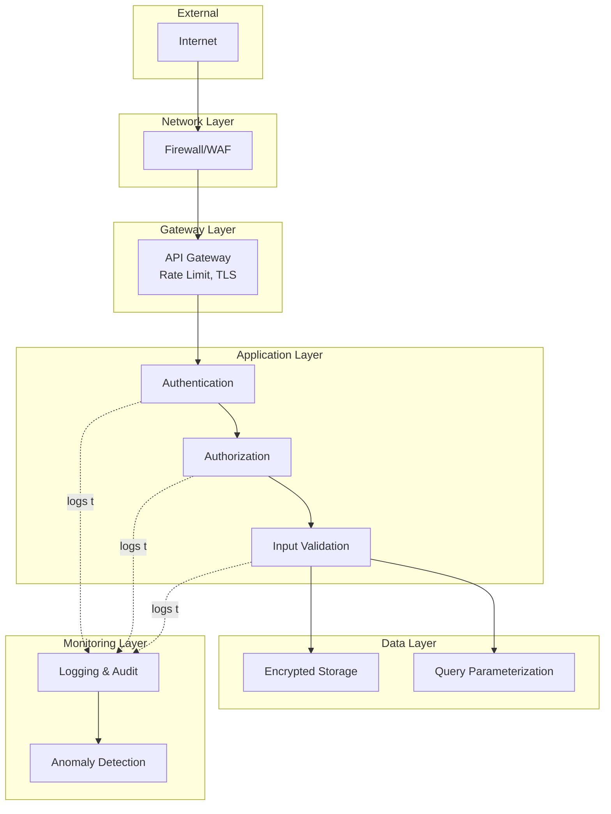

**Key insight:**

> If an attacker bypasses authentication, authorization should still block them.  
> If they bypass authorization, input validation should still prevent injection.  
> If they inject malicious queries, parameterized queries should still protect the database.

---

### 2.4 Fail Securely

Systems fail. Networks timeout. Databases go read-only. Caches expire. The question is not **if** failure happens, but **how the API behaves when it does**.

**Secure failure patterns:**

| Scenario | Insecure default | Secure default |
|----------|------------------|----------------|
| Authorization service unavailable | Allow request through | Deny request, return 503 |
| Rate limit store unreachable | Skip rate limiting | Deny request or use local fallback |
| JWT signature verification error | Accept token anyway | Reject token, return 401 |
| Input validation library throws exception | Process input | Reject request, return 400 |
| Database query timeout | Return partial data | Return error, log incident |

```python
# ❌ Insecure - fails open
def check_permission(user, resource):
    try:
        return policy_service.authorize(user, resource)
    except Exception:
        # Service down, just let them through
        return True

# ✅ Secure - fails closed
def check_permission(user, resource):
    try:
        return policy_service.authorize(user, resource)
    except Exception as e:
        logger.error(f"Authorization service failed: {e}")
        # Deny by default when service is unavailable
        return False
```

**Testing failure modes:**

- Simulate dependency outages during security testing
- Use chaos engineering to verify fail-secure behavior
- Review exception handlers for permissive fallbacks
- Monitor for authorization bypasses during incidents

---

### 2.5 Don't Trust Client Input

Every value sent by a client is potentially malicious or malformed.

This includes:

- URL parameters
- JSON/XML bodies
- HTTP headers (including `User-Agent`, `Referer`, `X-Forwarded-For`)
- File uploads
- Query strings
- GraphQL variables
- gRPC messages
- WebSocket frames

**Validation rules:**

| Type | Validation approach | Example |
|------|---------------------|---------|
| **Numeric IDs** | Validate type, range, and ownership | `assert isinstance(id, int) and id > 0` |
| **UUIDs** | Validate format, check authorization | `assert uuid.UUID(value)` then check access |
| **Enums** | Whitelist allowed values | `assert status in ['pending', 'approved', 'rejected']` |
| **Strings** | Length limits, character whitelist | `assert len(name) <= 100 and name.isalnum()` |
| **Dates** | Parse, validate range | `assert start_date < end_date` |
| **File uploads** | MIME type, size, virus scan | Check extension, content-type, scan bytes |
| **URLs** | Validate scheme, domain whitelist | Prevent SSRF via `file://`, `gopher://` |

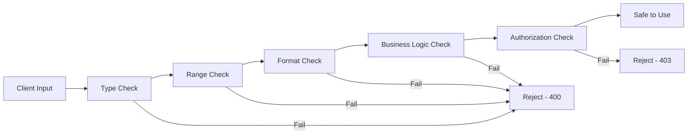

**Never trust:**

- Client-supplied IDs without ownership checks
- Client-declared roles or permissions
- Client-provided prices, discounts, or quantities (for financial operations)
- Client-side validation as a substitute for server-side checks

---

### 2.6 Keep It Simple

Complex systems have more attack surface. Complexity makes:

- Security reviews harder
- Code audits slower
- Bugs easier to hide
- Secure defaults easier to bypass

**Design patterns that reduce complexity:**

| Pattern | Benefit |
|---------|---------|
| **Consistent authorization model** | One policy engine, not scattered checks |
| **Declarative security** | Annotations/decorators over manual checks |
| **Standard error responses** | Predictable error handling, no leakage |
| **Centralized validation** | Reusable schemas, not per-endpoint logic |
| **Single authentication flow per API** | Easier to audit, test, and harden |

```python
# ❌ Complex - scattered authorization logic
@app.route('/api/projects/<id>')
def get_project(id):
    project = db.get_project(id)
    user = get_current_user()
    
    # Different checks in different places
    if project.owner_id == user.id:
        return project
    elif user.role == 'admin':
        return project
    elif project.is_public and user.is_verified:
        return project
    elif project.team_id in user.teams:
        return project
    else:
        abort(403)

# ✅ Simple - centralized policy
@app.route('/api/projects/<id>')
@require_permission('projects:read')
def get_project(id):
    project = db.get_project(id)
    return project
```

---

## 3. Secure API Architecture Patterns

### 3.1 Authentication Architecture

Modern APIs should use **token-based authentication** with short-lived credentials.

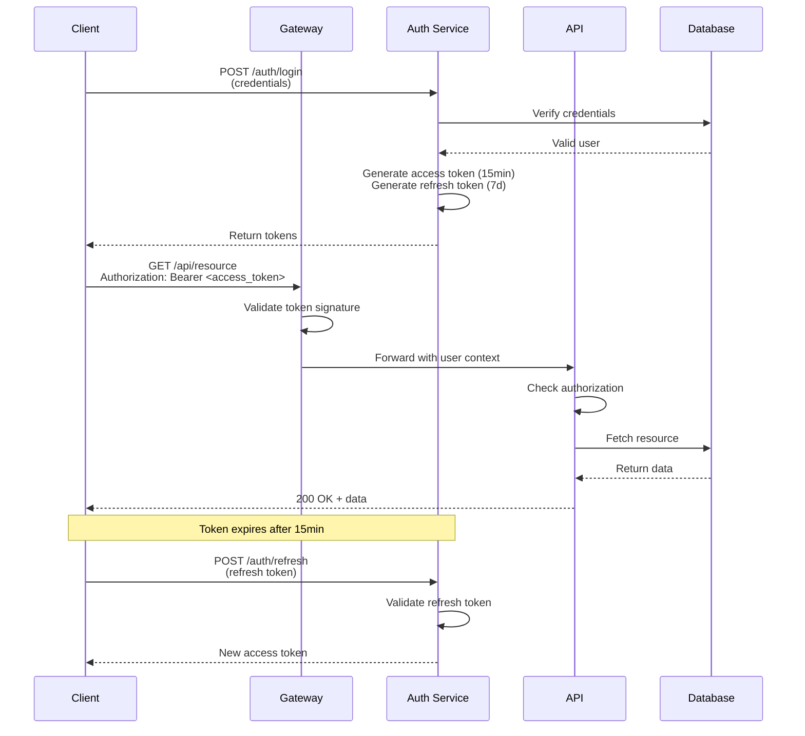

**Recommended patterns:**

| Component | Best practice | Why |
|-----------|---------------|-----|
| **Access tokens** | Short-lived (5-15 minutes), JWT or opaque | Limits exposure window |
| **Refresh tokens** | Longer-lived (days), single-use, rotation | Reduces re-authentication friction |
| **Token storage** | httpOnly cookies or secure storage | Prevents XSS token theft |
| **Token validation** | Verify signature, expiry, audience, issuer | Prevents forgery and replay |
| **Revocation** | Maintain blocklist or use token versioning | Enables emergency deactivation |

**Common authentication patterns:**

```text
1. OAuth 2.1 / OpenID Connect
   ├─ Best for: User-facing APIs, third-party integrations
   ├─ Pros: Industry standard, delegated auth, scopes
   └─ Cons: Complex to implement correctly

2. Mutual TLS (mTLS)
   ├─ Best for: Service-to-service, high-security environments
   ├─ Pros: Strong cryptographic identity, no passwords
   └─ Cons: Certificate management overhead

3. API Keys
   ├─ Best for: Server-to-server, partner integrations
   ├─ Pros: Simple, easy to rotate
   └─ Cons: Long-lived credentials, no user context

4. HMAC Signatures
   ├─ Best for: Webhooks, serverless functions
   ├─ Pros: Prevents replay, ensures integrity
   └─ Cons: Clock sync required, complex signing logic
```

---

### 3.2 Authorization Architecture

Authorization decisions should answer: **Can this subject perform this action on this resource?**

**Three common models:**

#### Role-Based Access Control (RBAC)

Users are assigned roles, roles grant permissions.

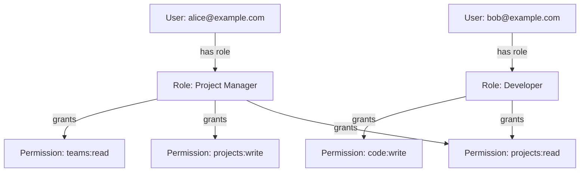

**When to use:**

- Clear organizational hierarchy
- Permissions align with job functions
- Limited number of roles (< 20)

**Example:**

```json
{
  "user": "alice@example.com",
  "roles": ["project_manager"],
  "permissions": [
    "projects:read",
    "projects:write",
    "teams:read"
  ]
}
```

#### Attribute-Based Access Control (ABAC)

Access decisions based on attributes of the user, resource, action, and environment.

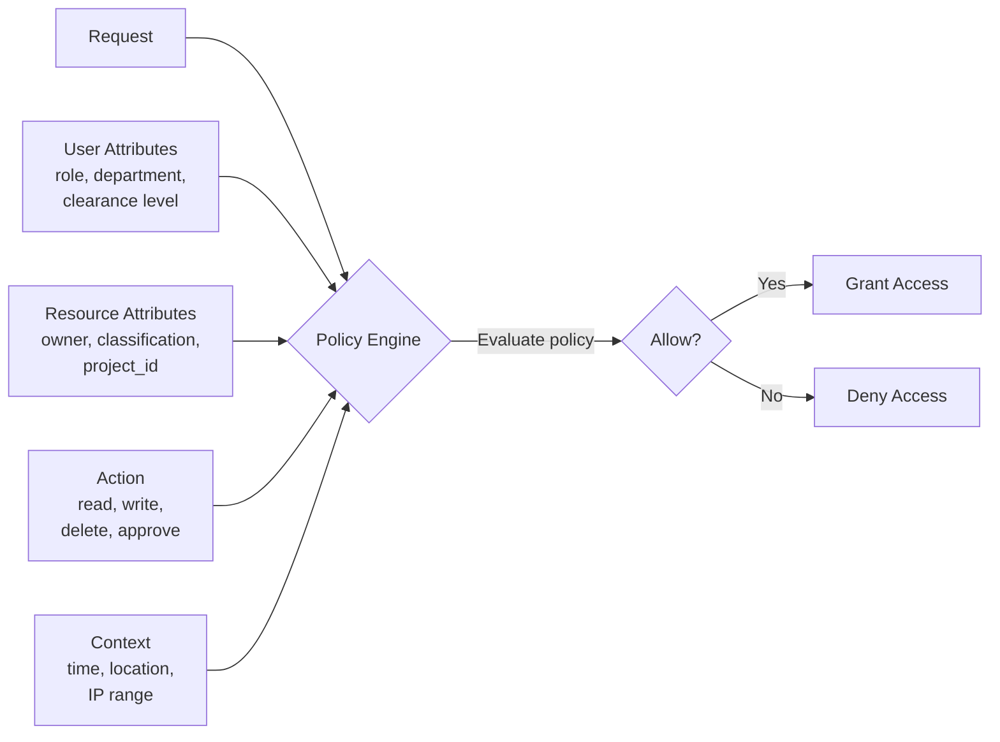

**When to use:**

- Complex authorization requirements
- Dynamic policies based on context
- Fine-grained access control needed

**Example policy (pseudocode):**

```text
ALLOW read ON resource 
  WHERE user.department == resource.department 
    AND user.clearance >= resource.classification
    AND current_time WITHIN business_hours
```

#### Relationship-Based Access Control (ReBAC)

Access based on relationships between entities (similar to Google Zanzibar).

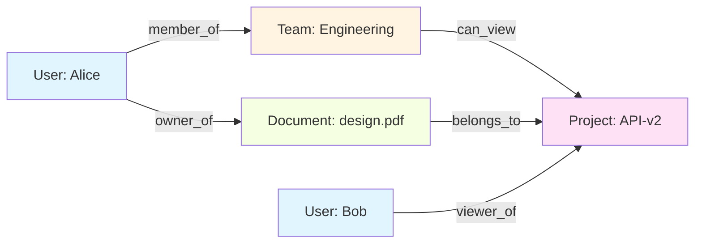

**When to use:**

- Multi-tenant applications
- Social graphs or collaborative platforms
- Shared resources with complex ownership

**Example check:**

```text
Can Alice read Document:design.pdf?

Check:
1. Alice is owner of Document:design.pdf → YES
   OR
2. Document:design.pdf belongs_to Project:API-v2
   AND Alice member_of Team:Engineering  
   AND Team:Engineering can_view Project:API-v2 → YES

Result: ALLOW
```

---

### 3.3 Input Validation Architecture

**Validation should happen in layers:**

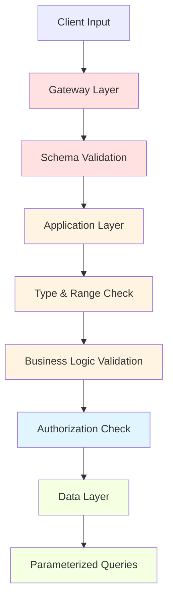

| Layer | Validation type | Example |
|-------|-----------------|---------|
| **Gateway** | Schema structure, content-type | Reject invalid JSON, enforce max request size |
| **Application** | Type, range, format | `age` is integer 0-150, `email` matches RFC 5322 |
| **Business logic** | Domain rules | `start_date` < `end_date`, `quantity` <= `stock` |
| **Data layer** | SQL injection prevention | Use parameterized queries, ORM escaping |

**Schema validation with OpenAPI example:**

```yaml
/api/users:
  post:
    requestBody:
      required: true
      content:
        application/json:
          schema:
            type: object
            required:
              - email
              - password
            properties:
              email:
                type: string
                format: email
                maxLength: 255
              password:
                type: string
                minLength: 12
                maxLength: 128
              age:
                type: integer
                minimum: 0
                maximum: 150
```

**GraphQL input validation:**

```graphql
input CreateUserInput {
  email: String! @constraint(format: "email", maxLength: 255)
  password: String! @constraint(minLength: 12, maxLength: 128)
  age: Int @constraint(min: 0, max: 150)
}

type Mutation {
  createUser(input: CreateUserInput!): User!
}
```

---

### 3.4 Rate Limiting Architecture

Protect APIs from abuse, brute force, and resource exhaustion.

**Multiple rate limit tiers:**

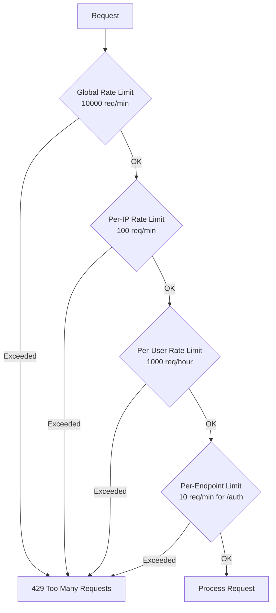

**Rate limiting strategies:**

| Strategy | Use case | Implementation |
|----------|----------|----------------|
| **Fixed window** | Simple enforcement | Allow N requests per time window |
| **Sliding window** | Smoother enforcement | Track requests in rolling time window |
| **Token bucket** | Allow bursts | Bucket refills at fixed rate |
| **Leaky bucket** | Smooth traffic | Process requests at constant rate |
| **Adaptive** | DDoS mitigation | Adjust limits based on system load |

**Example headers:**

```http
HTTP/1.1 200 OK
X-RateLimit-Limit: 1000
X-RateLimit-Remaining: 847
X-RateLimit-Reset: 1678901234
Retry-After: 120
```

**Endpoint-specific limits:**

```text
/auth/login        → 5 requests per 15 minutes per IP
/auth/password     → 3 requests per hour per user
/api/search        → 100 requests per minute per user
/api/upload        → 10 requests per hour per user
/api/admin/*       → 1000 requests per hour per admin
```

---

### 3.5 Error Handling & Logging

Errors should be **safe for external consumption** while **detailed for internal monitoring**.

**Error response pattern:**

```json
{
  "error": {
    "code": "RESOURCE_NOT_FOUND",
    "message": "The requested resource does not exist",
    "request_id": "req_7b3f8a2c1d",
    "timestamp": "2024-03-14T10:30:00Z"
  }
}
```

**Do NOT leak:**

- Stack traces
- SQL queries
- Internal file paths
- Framework versions
- Database errors
- Cryptographic details

**DO log internally:**

| Field | Purpose |
|-------|---------|
| `request_id` | Correlate requests across services |
| `user_id` | Track behavior, detect abuse |
| `endpoint` | Identify vulnerable endpoints |
| `status_code` | Monitor error rates |
| `ip_address` | Detect distributed attacks |
| `user_agent` | Identify automated tools |
| `response_time` | Detect performance issues |
| `authorization_decision` | Audit access patterns |

**Structured logging example:**

```json
{
  "timestamp": "2024-03-14T10:30:45.123Z",
  "level": "WARN",
  "request_id": "req_7b3f8a2c1d",
  "user_id": "usr_abc123",
  "ip_address": "203.0.113.45",
  "endpoint": "GET /api/projects/456",
  "status_code": 403,
  "auth_decision": "DENY",
  "reason": "user not in project team",
  "response_time_ms": 23
}
```

---

## 4. Secure API Design Patterns by Type

### 4.1 REST API Security Patterns

| Pattern | Implementation | Security benefit |
|---------|----------------|------------------|
| **Use HTTPS only** | Redirect HTTP → HTTPS, HSTS header | Prevents MitM, eavesdropping |
| **Versioning** | `/v1/`, `/v2/` in URL path | Allows security patches without breaking clients |
| **Resource-based URLs** | `/users/{id}/orders` not `/getUserOrders` | Clearer authorization boundaries |
| **HTTP methods correctly** | GET=read, POST=create, PUT/PATCH=update, DELETE=delete | Prevents CSRF, supports caching controls |
| **Status codes correctly** | 401=auth, 403=authz, 404=not found, 429=rate limit | Avoids info leakage, proper client handling |
| **Idempotency keys** | `Idempotency-Key` header for POST/PATCH | Prevents duplicate financial transactions |

**Resource ownership pattern:**

```http
GET /api/users/me/orders          ← Safe, implicit ownership
GET /api/users/123/orders         ← Requires authorization check
GET /api/orders?user_id=123       ← Requires authorization check
```

---

### 4.2 GraphQL API Security Patterns

| Pattern | Implementation | Security benefit |
|---------|----------------|------------------|
| **Disable introspection in production** | Block `__schema` and `__type` queries | Reduces reconnaissance |
| **Query depth limiting** | Max 7-10 levels deep | Prevents DoS via nested queries |
| **Query complexity scoring** | Assign cost to each field | Prevents expensive queries |
| **Persisted queries** | Whitelist query hashes | Prevents arbitrary query injection |
| **Field-level authorization** | Check permissions per resolver | Prevents unauthorized data access |

**Query complexity example:**

```graphql
# ❌ Too complex - could DoS the server
query {
  users {                         # Cost: 1 + (1 * N users)
    posts {                       # Cost: N users * M posts
      comments {                  # Cost: N * M * K comments
        author {                  # Cost: N * M * K * 1
          posts {                 # Cost: N * M * K * M posts
            comments {            # Cost: N * M * K * M * K...
              ...
            }
          }
        }
      }
    }
  }
}

# ✅ Controlled complexity
query {
  users(limit: 10) {              # Max 10 users
    posts(limit: 5) {             # Max 50 posts total
      title
      createdAt
    }
  }
}
```

**Field-level authorization:**

```javascript
const resolvers = {
  User: {
    email: (user, args, context) => {
      // Only return email if requester is the user or admin
      if (context.user.id === user.id || context.user.role === 'admin') {
        return user.email;
      }
      return null; // Or throw authorization error
    },
    
    ssn: (user, args, context) => {
      // SSN only for admins
      if (context.user.role !== 'admin') {
        throw new Error('Unauthorized');
      }
      return user.ssn;
    }
  }
};
```

---

### 4.3 gRPC API Security Patterns

| Pattern | Implementation | Security benefit |
|---------|----------------|------------------|
| **mTLS everywhere** | Require client certificates | Strong service identity |
| **Interceptors for auth** | Validate tokens in unary/streaming interceptors | Centralized authentication |
| **Context propagation** | Pass user context via metadata | Authorization across service chain |
| **Deadline enforcement** | Set timeouts on all calls | Prevents resource exhaustion |
| **Validate message size** | Limit max message size | Prevents memory exhaustion |

**gRPC interceptor example:**

```go
func AuthInterceptor(ctx context.Context, req interface{}, info *grpc.UnaryServerInfo, handler grpc.UnaryHandler) (interface{}, error) {
    // Extract token from metadata
    md, ok := metadata.FromIncomingContext(ctx)
    if !ok {
        return nil, status.Error(codes.Unauthenticated, "missing metadata")
    }
    
    tokens := md.Get("authorization")
    if len(tokens) == 0 {
        return nil, status.Error(codes.Unauthenticated, "missing token")
    }
    
    // Validate token
    user, err := validateToken(tokens[0])
    if err != nil {
        return nil, status.Error(codes.Unauthenticated, "invalid token")
    }
    
    // Add user to context
    ctx = context.WithValue(ctx, "user", user)
    
    // Continue to handler
    return handler(ctx, req)
}
```

---

### 4.4 WebSocket API Security Patterns

WebSockets maintain persistent connections, requiring different security patterns:

| Challenge | Solution |
|-----------|----------|
| **Authentication** | Authenticate during handshake, validate token before upgrade |
| **Authorization** | Re-check permissions on each message, not just connection |
| **Message validation** | Validate every incoming message against schema |
| **Rate limiting** | Limit messages per second per connection |
| **Connection limits** | Limit total connections per user/IP |
| **Heartbeat/timeout** | Close idle connections to free resources |

```javascript
// WebSocket authentication
wss.on('connection', (ws, req) => {
  const token = new URL(req.url, 'ws://localhost').searchParams.get('token');
  
  // Validate token during handshake
  const user = validateToken(token);
  if (!user) {
    ws.close(4401, 'Unauthorized');
    return;
  }
  
  ws.user = user;
  
  // Rate limit: max 10 messages per second
  const rateLimiter = new RateLimiter(10, 1000);
  
  ws.on('message', (data) => {
    if (!rateLimiter.allow()) {
      ws.close(4429, 'Too many requests');
      return;
    }
    
    // Validate message schema
    const message = JSON.parse(data);
    if (!validateSchema(message)) {
      ws.send(JSON.stringify({ error: 'Invalid message format' }));
      return;
    }
    
    // Check authorization for this specific action
    if (!canPerformAction(ws.user, message.action)) {
      ws.send(JSON.stringify({ error: 'Forbidden' }));
      return;
    }
    
    // Process message
    handleMessage(ws, message);
  });
});
```

---

## 5. Security Checklist for API Design

### Pre-Development Phase

- [ ] **Threat model the API** - identify assets, threats, attack vectors
- [ ] **Define security requirements** - authentication method, authorization model, compliance needs
- [ ] **Choose secure defaults** - frameworks with built-in security controls
- [ ] **Plan for secrets management** - vault for API keys, certificates, DB credentials
- [ ] **Design audit logging** - what events to log, retention period, SIEM integration

### Development Phase

- [ ] **Authentication**
  - [ ] Use industry-standard protocols (OAuth 2.1, OpenID Connect)
  - [ ] Use short-lived access tokens (5-15 minutes)
  - [ ] Implement refresh token rotation
  - [ ] Validate token signature, expiry, audience, issuer
  - [ ] Support token revocation
  
- [ ] **Authorization**
  - [ ] Deny by default
  - [ ] Check permissions on every request
  - [ ] Validate object-level access (prevent BOLA)
  - [ ] Validate function-level access (prevent BFLA)
  - [ ] Use centralized policy engine
  
- [ ] **Input Validation**
  - [ ] Validate all inputs against strict schemas
  - [ ] Use parameterized queries / ORM to prevent injection
  - [ ] Whitelist allowed values for enums
  - [ ] Enforce length limits on strings
  - [ ] Validate file uploads (type, size, content)
  - [ ] Sanitize output to prevent XSS
  
- [ ] **Rate Limiting**
  - [ ] Global rate limit per API
  - [ ] Per-IP rate limit
  - [ ] Per-user rate limit
  - [ ] Stricter limits on sensitive endpoints (/auth, /admin)
  - [ ] Return proper 429 status with Retry-After header
  
- [ ] **Data Protection**
  - [ ] Use HTTPS/TLS 1.3 everywhere
  - [ ] Encrypt sensitive data at rest
  - [ ] Redact PII from logs
  - [ ] Use HSTS header
  - [ ] Implement proper CORS policies
  
- [ ] **Error Handling**
  - [ ] Return generic error messages to clients
  - [ ] Log detailed errors internally with request_id
  - [ ] Never expose stack traces, SQL queries, or file paths
  - [ ] Use consistent error response format
  
- [ ] **Logging & Monitoring**
  - [ ] Log all authentication events
  - [ ] Log all authorization failures
  - [ ] Log all input validation failures
  - [ ] Include request_id, user_id, IP, endpoint, timestamp
  - [ ] Monitor for anomalies (unusual traffic, failed auth spikes)

### Pre-Production Phase

- [ ] **Security Testing**
  - [ ] Run automated security scans (SAST, DAST)
  - [ ] Test authentication bypass scenarios
  - [ ] Test authorization bypass (BOLA, BFLA)
  - [ ] Test injection vulnerabilities (SQL, NoSQL, command)
  - [ ] Test rate limiting effectiveness
  - [ ] Perform penetration testing
  
- [ ] **Configuration Hardening**
  - [ ] Disable debug mode
  - [ ] Remove default credentials
  - [ ] Disable unnecessary endpoints
  - [ ] Disable introspection (GraphQL)
  - [ ] Configure security headers (CSP, X-Frame-Options, etc.)
  - [ ] Review API gateway configuration
  
- [ ] **Dependency Security**
  - [ ] Scan dependencies for vulnerabilities
  - [ ] Update libraries to latest secure versions
  - [ ] Remove unused dependencies
  - [ ] Pin dependency versions
  
- [ ] **Documentation**
  - [ ] Document security assumptions
  - [ ] Document authentication flow
  - [ ] Document rate limits
  - [ ] Document error codes
  - [ ] Provide security best practices for API consumers

### Post-Production Phase

- [ ] **Continuous Monitoring**
  - [ ] Set up alerts for security events
  - [ ] Monitor authentication failure rates
  - [ ] Monitor for unusual API usage patterns
  - [ ] Track vulnerability disclosures affecting dependencies
  
- [ ] **Incident Response**
  - [ ] Define incident response plan
  - [ ] Establish runbook for security incidents
  - [ ] Practice token revocation procedures
  - [ ] Test backup and recovery
  
- [ ] **Regular Reviews**
  - [ ] Quarterly security reviews
  - [ ] Annual penetration tests
  - [ ] Regular dependency updates
  - [ ] Access control audits

---

## 6. Common API Security Pitfalls

### 6.1 Authentication Pitfalls

| Pitfall | Why it's dangerous | How to avoid |
|---------|-------------------|--------------|
| **Long-lived tokens** | Stolen token works for months/years | Use 5-15 minute access tokens with refresh rotation |
| **No token revocation** | Can't deactivate compromised credentials | Maintain token blocklist or version-based invalidation |
| **Client-side token storage in localStorage** | Vulnerable to XSS | Use httpOnly cookies or secure mobile storage |
| **Trusting `Authorization` header without validation** | Trivial to forge | Always verify signature, expiry, issuer |
| **Allowing weak passwords** | Brute-force attacks succeed | Enforce 12+ characters, complexity, check breached password lists |

### 6.2 Authorization Pitfalls

| Pitfall | Why it's dangerous | How to avoid |
|---------|-------------------|--------------|
| **Missing object-level checks (BOLA)** | User A can access User B's data | Check ownership on every object retrieval |
| **Missing function-level checks (BFLA)** | Regular user can call admin endpoints | Check role/permissions on every endpoint |
| **Trusting client-supplied IDs** | Client can manipulate `user_id` in request | Always use authenticated user context, never trust client |
| **Authorization in client code only** | Easily bypassed | Always enforce server-side |
| **Inconsistent authorization** | Some endpoints check, others don't | Use framework middleware for uniform enforcement |

### 6.3 Input Validation Pitfalls

| Pitfall | Why it's dangerous | How to avoid |
|---------|-------------------|--------------|
| **SQL injection via string concatenation** | Full database compromise | Use parameterized queries always |
| **NoSQL injection via object injection** | Database manipulation | Validate types before passing to MongoDB/etc |
| **SSRF via user-supplied URLs** | Internal network scanning | Whitelist allowed domains, block private IPs |
| **XXE via XML parsing** | File disclosure, SSRF | Disable external entity processing |
| **Path traversal via file paths** | Arbitrary file read | Validate against whitelist, use safe path joining |
| **Mass assignment** | Users set admin=true | Explicitly define allowed fields |

### 6.4 Configuration Pitfalls

| Pitfall | Why it's dangerous | How to avoid |
|---------|-------------------|--------------|
| **Debug mode in production** | Stack traces leak implementation details | Use environment-specific configs |
| **Default credentials** | Well-known, easily guessed | Force credential change on first use |
| **Verbose error messages** | Leak database schemas, file paths | Return generic errors to clients |
| **Missing CORS restrictions** | Allows unauthorized cross-origin requests | Whitelist allowed origins |
| **No HSTS header** | Allows downgrade to HTTP | Set `Strict-Transport-Security` header |
| **Exposing internal endpoints** | Admin panels, health checks accessible externally | Use network isolation, IP whitelists |

---

## 7. API Security Testing During Design

**Shift-left security:** Test security assumptions during the design phase, not after deployment.

### 7.1 Threat Modeling

Use STRIDE framework to identify threats:

| Threat | API example | Mitigation |
|--------|-------------|------------|
| **Spoofing** | Attacker forges authentication token | Strong token validation, signature verification |
| **Tampering** | Modify request parameters mid-flight | Use HTTPS, validate HMAC signatures |
| **Repudiation** | User denies performing action | Comprehensive audit logging |
| **Information Disclosure** | Error messages leak database schema | Generic error responses, structured logging |
| **Denial of Service** | Overwhelm API with requests | Rate limiting, query complexity limits |
| **Elevation of Privilege** | Regular user accesses admin endpoint | Function-level and object-level authorization |

### 7.2 Security Test Cases

**Authentication tests:**

```text
✓ Can access protected endpoint with valid token
✓ Cannot access with expired token (401)
✓ Cannot access with malformed token (401)
✓ Cannot access with token from different API (401)
✓ Cannot access with revoked token (401)
✓ Token refresh works with valid refresh token
✓ Token refresh fails with expired refresh token
```

**Authorization tests:**

```text
✓ User A cannot read User B's private resource (403)
✓ User A cannot update User B's resource (403)
✓ User A cannot delete User B's resource (403)
✓ Regular user cannot access admin endpoint (403)
✓ User without 'write' permission cannot modify resource (403)
```

**Input validation tests:**

```text
✓ SQL injection in 'id' parameter blocked
✓ XSS payload in 'comment' field sanitized
✓ Negative 'quantity' rejected (400)
✓ 'email' field validates RFC 5322 format
✓ File upload > 10MB rejected (413)
✓ SSRF via 'callback_url' blocked (400)
```

**Rate limiting tests:**

```text
✓ 101st request in 1 minute returns 429
✓ Retry-After header present in 429 response
✓ Rate limit resets after time window
✓ Authenticated users have higher limits than anonymous
✓ Admin endpoints have stricter limits
```

---

## 8. Frameworks and Tools for Secure API Design

### 8.1 API Gateway Solutions

| Tool | Use case | Key security features |
|------|----------|----------------------|
| **Kong** | Enterprise API gateway | OAuth 2.0, rate limiting, IP whitelist, WAF |
| **Tyk** | Open-source gateway | JWT validation, quota management, analytics |
| **AWS API Gateway** | Cloud-native AWS | IAM integration, throttling, API keys |
| **Azure API Management** | Cloud-native Azure | Azure AD integration, policies, monitoring |
| **Apigee** | Google Cloud | OAuth, SAML, threat detection |

### 8.2 Authentication/Authorization Libraries

| Language | Library | Features |
|----------|---------|----------|
| **Node.js** | Passport.js, jsonwebtoken | OAuth, JWT, multiple strategies |
| **Python** | Authlib, PyJWT | OAuth 2.1, OIDC, JWT |
| **Java** | Spring Security, Nimbus JOSE | OAuth 2, JWT, SAML |
| **Go** | golang-jwt, casbin | JWT validation, policy engine |
| **.NET** | IdentityServer, ASP.NET Identity | OAuth 2, OIDC, claims-based |

### 8.3 Policy Engines

| Tool | Model | Use case |
|------|-------|----------|
| **Open Policy Agent (OPA)** | Rego language | Cloud-native, microservices |
| **Casbin** | PERM model | Flexible, multiple languages |
| **AWS IAM** | JSON policies | AWS-native authorization |
| **Google Zanzibar** | Relationship-based | Fine-grained, scalable |

### 8.4 Security Testing Tools

| Tool | Type | Use case |
|------|------|----------|
| **OWASP ZAP** | DAST | Web API scanning |
| **Burp Suite** | Proxy/scanner | Manual + automated testing |
| **Postman** | API client | Collection-based security tests |
| **Nuclei** | Scanner | Template-based vulnerability detection |
| **SonarQube** | SAST | Code quality and security |
| **Semgrep** | SAST | Custom security rules |

---

## 9. Real-World Secure API Design Example

Let's design a secure multi-tenant task management API.

### Requirements

- Users belong to organizations (multi-tenancy)
- Users can create/read/update/delete tasks
- Tasks can be assigned to team members
- Admin users can manage organization settings
- Must support mobile app and web frontend

### Security Architecture

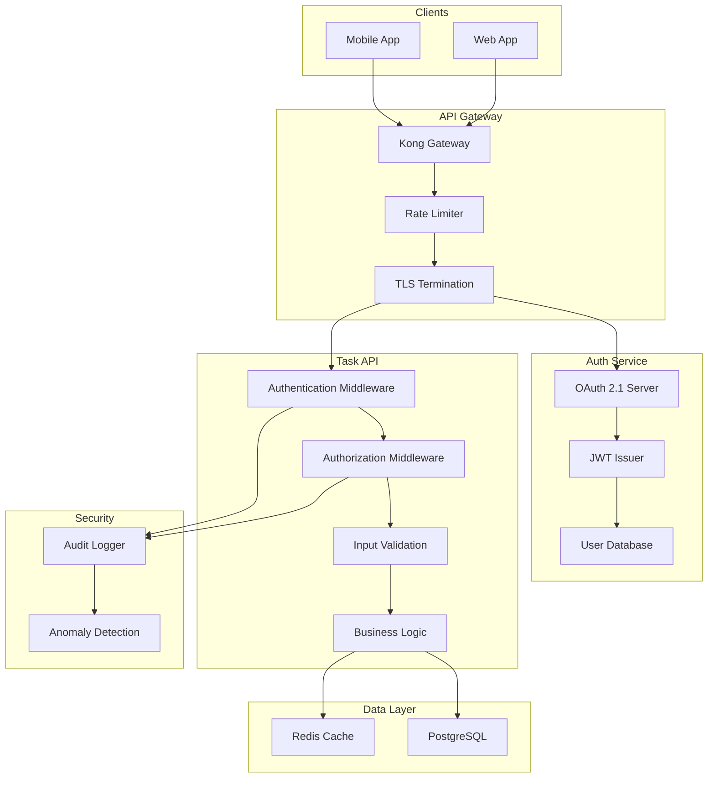

### Authentication Design

```javascript
// 1. Login flow
POST /auth/login
{
  "email": "alice@example.com",
  "password": "SecurePass123!"
}

Response:
{
  "access_token": "eyJhbGc...",  // 15-minute expiry
  "refresh_token": "rt_...",      // 7-day expiry, single-use
  "token_type": "Bearer",
  "expires_in": 900
}

// 2. API request with token
GET /api/v1/tasks
Authorization: Bearer eyJhbGc...

// 3. Token refresh
POST /auth/refresh
{
  "refresh_token": "rt_..."
}
```

### Authorization Design (RBAC + Object Ownership)

```javascript
// Policy: Can user perform action on task?
function canAccessTask(user, task, action) {
  // 1. Check tenant isolation
  if (user.org_id !== task.org_id) {
    return false;
  }
  
  // 2. Check ownership
  if (task.owner_id === user.id) {
    return true;  // Owner can do anything
  }
  
  // 3. Check assignment
  if (action === 'read' && task.assigned_to === user.id) {
    return true;  // Assigned users can read
  }
  
  // 4. Check role
  if (user.role === 'admin') {
    return true;  // Admins can access all tasks in org
  }
  
  return false;  // Deny by default
}
```

### API Endpoints with Security Controls

```javascript
// GET /api/v1/tasks - List tasks
app.get('/api/v1/tasks',
  authenticate,           // Verify JWT
  rateLimit(100, 60),    // 100 req/min
  async (req, res) => {
    // Only return tasks user can access
    const tasks = await Task.findAll({
      where: {
        org_id: req.user.org_id,  // Tenant isolation
        [Op.or]: [
          { owner_id: req.user.id },
          { assigned_to: req.user.id },
          ...(req.user.role === 'admin' ? [{}] : [])
        ]
      }
    });
    res.json(tasks);
  }
);

// GET /api/v1/tasks/:id - Get specific task
app.get('/api/v1/tasks/:id',
  authenticate,
  rateLimit(200, 60),
  validateParams({ id: 'uuid' }),  // Input validation
  async (req, res) => {
    const task = await Task.findByPk(req.params.id);
    
    if (!task) {
      return res.status(404).json({ error: 'Task not found' });
    }
    
    // Authorization check
    if (!canAccessTask(req.user, task, 'read')) {
      return res.status(403).json({ error: 'Forbidden' });
    }
    
    res.json(task);
  }
);

// POST /api/v1/tasks - Create task
app.post('/api/v1/tasks',
  authenticate,
  rateLimit(50, 60),
  validateBody({
    title: { type: 'string', maxLength: 200, required: true },
    description: { type: 'string', maxLength: 5000 },
    assigned_to: { type: 'uuid' }
  }),
  async (req, res) => {
    // Verify assigned_to user exists and is in same org
    if (req.body.assigned_to) {
      const assignee = await User.findByPk(req.body.assigned_to);
      if (!assignee || assignee.org_id !== req.user.org_id) {
        return res.status(400).json({ error: 'Invalid assignee' });
      }
    }
    
    const task = await Task.create({
      ...req.body,
      owner_id: req.user.id,
      org_id: req.user.org_id  // Enforce tenant isolation
    });
    
    auditLog('task.created', { user: req.user.id, task: task.id });
    res.status(201).json(task);
  }
);

// DELETE /api/v1/tasks/:id - Delete task
app.delete('/api/v1/tasks/:id',
  authenticate,
  rateLimit(50, 60),
  validateParams({ id: 'uuid' }),
  async (req, res) => {
    const task = await Task.findByPk(req.params.id);
    
    if (!task) {
      return res.status(404).json({ error: 'Task not found' });
    }
    
    // Only owner or admin can delete
    if (!canAccessTask(req.user, task, 'delete')) {
      return res.status(403).json({ error: 'Forbidden' });
    }
    
    await task.destroy();
    auditLog('task.deleted', { user: req.user.id, task: task.id });
    res.status(204).send();
  }
);
```

### Input Validation Schema

```javascript
const taskSchema = {
  title: {
    type: 'string',
    required: true,
    minLength: 1,
    maxLength: 200,
    pattern: /^[a-zA-Z0-9\s\-_.,!?]+$/  // Alphanumeric + common punctuation
  },
  description: {
    type: 'string',
    maxLength: 5000
  },
  status: {
    type: 'string',
    enum: ['todo', 'in_progress', 'done', 'archived']
  },
  priority: {
    type: 'integer',
    minimum: 1,
    maximum: 5
  },
  assigned_to: {
    type: 'string',
    format: 'uuid'
  },
  due_date: {
    type: 'string',
    format: 'date-time'
  }
};
```

### Rate Limiting Configuration

```javascript
const rateLimits = {
  global: { limit: 10000, window: 60 },       // 10k req/min globally
  perIp: { limit: 100, window: 60 },          // 100 req/min per IP
  perUser: { limit: 1000, window: 3600 },     // 1k req/hour per user
  
  endpoints: {
    'POST /auth/login': { limit: 5, window: 900 },      // 5 login attempts per 15min
    'POST /auth/register': { limit: 3, window: 3600 },  // 3 registrations per hour per IP
    'GET /api/v1/tasks': { limit: 200, window: 60 },    // 200 list calls per min
    'POST /api/v1/tasks': { limit: 50, window: 60 },    // 50 creates per min
    'DELETE /api/v1/*': { limit: 30, window: 60 }       // 30 deletes per min
  }
};
```

### Audit Logging

```javascript
function auditLog(event, metadata) {
  const log = {
    timestamp: new Date().toISOString(),
    event,
    user_id: metadata.user,
    org_id: metadata.org,
    ip_address: metadata.ip,
    user_agent: metadata.userAgent,
    request_id: metadata.requestId,
    details: metadata
  };
  
  // Send to logging service (Elasticsearch, Splunk, etc.)
  logger.info(log);
  
  // Trigger alerts for sensitive events
  if (['admin.created', 'permission.escalated', 'org.deleted'].includes(event)) {
    securityMonitor.alert(log);
  }
}
```

---

## 10. Summary

**Secure API design is about building trust boundaries that are:**

- **Clear** - developers know what to check and where
- **Consistent** - the same security controls apply everywhere
- **Automatic** - frameworks enforce security by default
- **Auditable** - every decision is logged and reviewable
- **Resilient** - failures don't create security gaps

**The three foundations:**

1. **Authentication** - prove who you are
2. **Authorization** - prove you're allowed to do this specific thing
3. **Validation** - prove the input is safe and expected

**The three disciplines:**

1. **Defense in depth** - layer multiple independent controls
2. **Deny by default** - nothing is allowed unless explicitly granted
3. **Fail securely** - when things break, security doesn't

**The three questions to ask before deploying any API:**

1. *What happens if the authentication system fails?* → Deny by default
2. *What happens if someone guesses valid object IDs?* → Authorization checks prevent access
3. *What happens if we get 100,000 requests per second?* → Rate limiting protects the system

Design with these patterns from the start, and security becomes part of the architecture instead of a bolt-on afterthought.

---

## 11. References

- OWASP API Security Top 10 (2023) - https://owasp.org/API-Security/
- OAuth 2.1 Authorization Framework - https://datatracker.ietf.org/doc/html/draft-ietf-oauth-v2-1-09
- GraphQL Security Best Practices - https://graphql.org/learn/authorization/
- NIST Cybersecurity Framework - https://www.nist.gov/cyberframework
- CWE Top 25 Most Dangerous Software Weaknesses - https://cwe.mitre.org/top25/
- REST Security Cheat Sheet - https://cheatsheetseries.owasp.org/cheatsheets/REST_Security_Cheat_Sheet.html
- API Security Best Practices (Google Cloud) - https://cloud.google.com/apis/design/security
- Microsoft API Security Guidelines - https://github.com/microsoft/api-guidelines/blob/master/Guidelines.md
- Zanzibar: Google's Consistent, Global Authorization System - https://research.google/pubs/pub48190/
- JWT Best Practices (RFC 8725) - https://datatracker.ietf.org/doc/html/rfc8725

---

**Next Steps:**

- [API Security Testing →](../13-automation/automated-security-testing.md)
- [Incident Response →](./incident-response.md)
- [Security Monitoring →](./security-monitoring.md)
