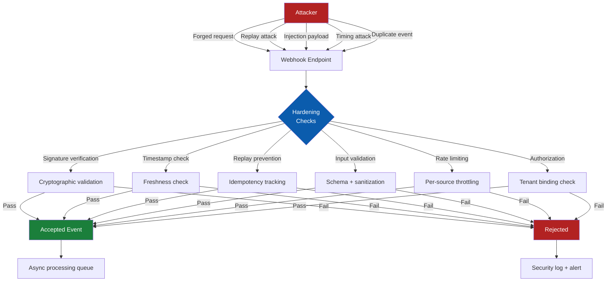
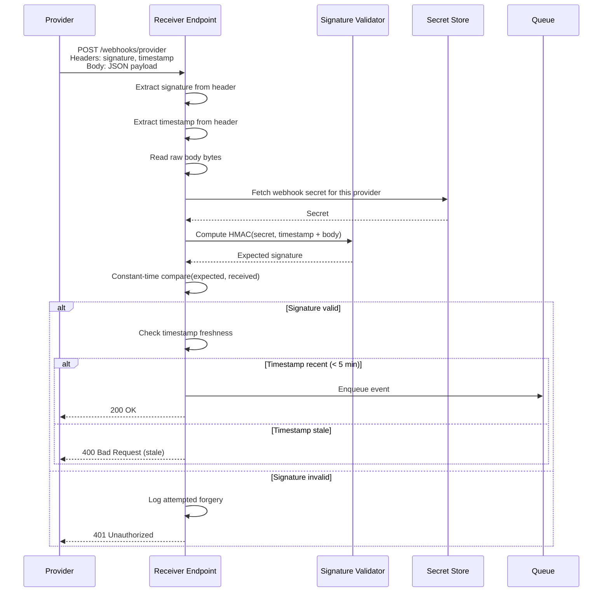
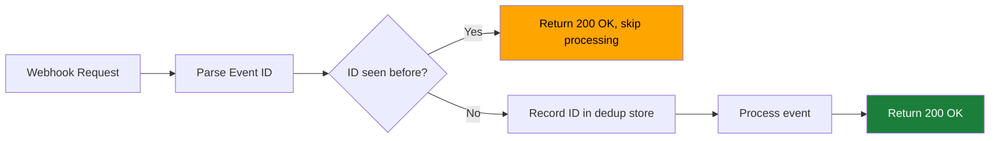
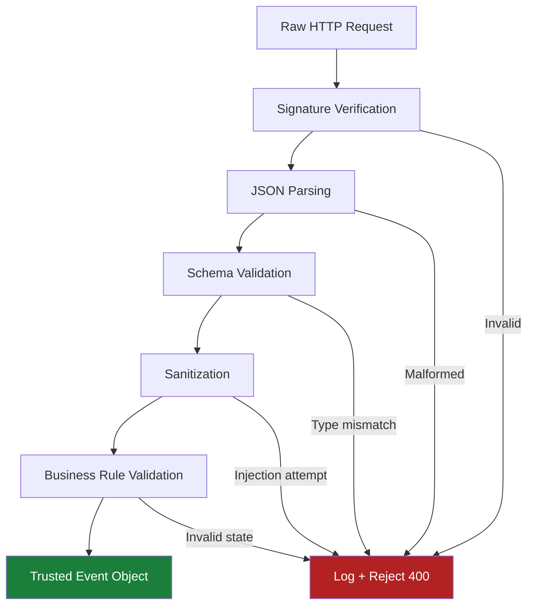
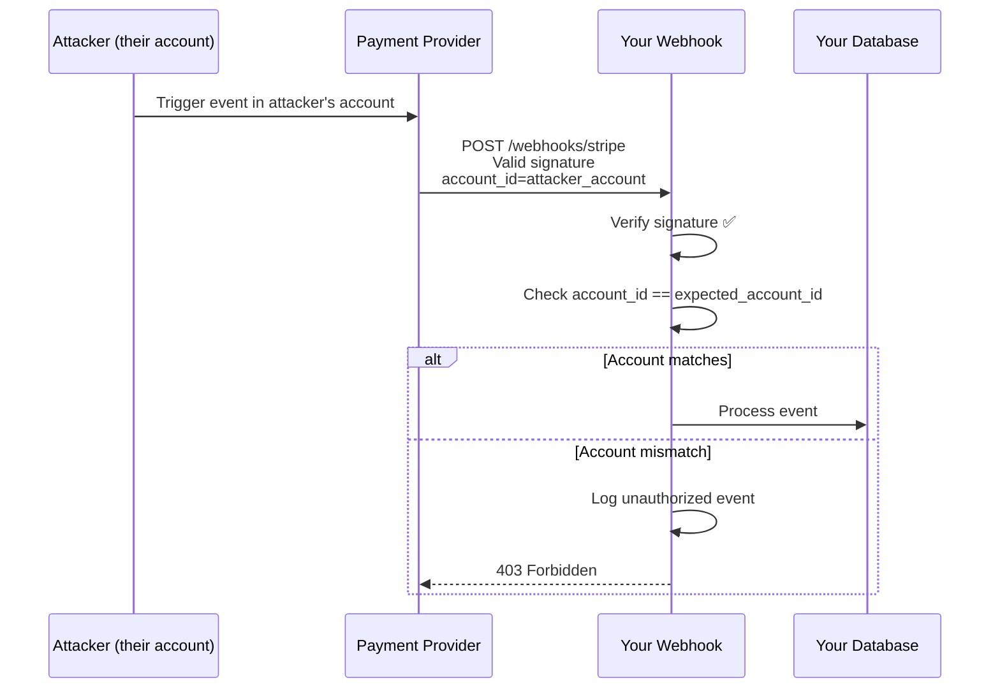
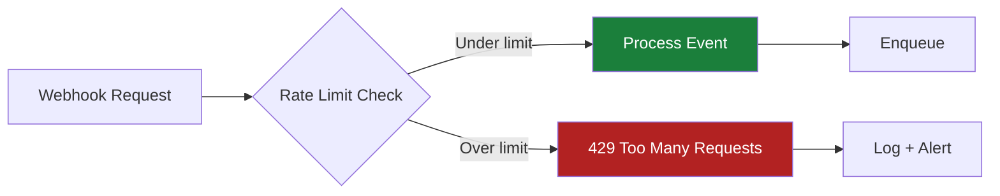
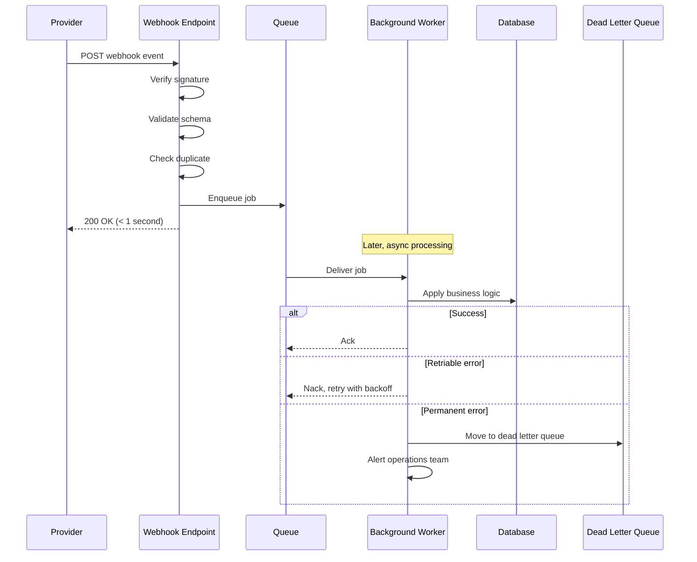

# Webhook Hardening

> **Webhook hardening is the practice of securing inbound event endpoints against unauthorized delivery, replay attacks, injection, and operational abuse. Because webhooks expose your API to automated requests from external systems, proper signature verification, input validation, idempotency, and monitoring are critical for protecting business-critical integrations.**

---

## 🧠 What Is It? (Beginner Explanation)

Webhooks flip the normal API security model:

- **Normal API:** your client calls an external server → you trust the server's responses
- **Webhook:** an external system calls **your** endpoint → you must not blindly trust the caller

Think of a webhook like this:

- someone claims to be your payment processor
- they send you a message saying "payment approved"
- before you ship the product or grant access, you need to prove:
  - the message really came from the processor
  - it has not been tampered with
  - it is not a duplicate or replay
  - it is meant for your tenant / account
  - it has not expired

**Webhook hardening** is the defensive practice of building those checks into your endpoint before any business logic runs.

### Why Webhooks Are Security-Critical

Webhooks often trigger high-impact actions:

| Integration | What the webhook does | Risk if validation is weak |
|---|---|---|
| **Payment gateway** | Confirms payment success | Attackers grant themselves premium access without paying |
| **Source control** | Notifies CI/CD to deploy code | Malicious code deployed to production |
| **Identity provider** | User lifecycle events (create, delete, suspend) | Account takeover, unauthorized access, privilege escalation |
| **Ticketing system** | Creates or closes support tickets | Ticket manipulation, data leakage |
| **SaaS platform** | Data sync, provisioning | Data corruption, unauthorized provisioning |
| **Email/SMS provider** | Delivery status updates | Incorrect analytics, retry storms |

That is why **webhook security is not optional** in production APIs.

---

## Core Threat Model



**Key principle:** every inbound webhook request is **untrusted** until signature, timestamp, identity, authorization, and deduplication checks pass.

---

## 🔒 Defense 1: Signature Verification

Webhooks should never rely on source IP, `User-Agent`, or a custom header alone. Attackers can spoof all of those.

The standard defense is **HMAC signature verification**:

1. You and the provider share a **secret** during webhook registration
2. The provider signs the payload using HMAC-SHA256 (or similar)
3. You compute the same signature locally and compare

### Common Signature Patterns

| Provider | Signature header | Algorithm | Signed content |
|---|---|---|---|
| **Stripe** | `Stripe-Signature` | HMAC-SHA256 | `timestamp.payload` |
| **GitHub** | `X-Hub-Signature-256` | HMAC-SHA256 | Raw request body |
| **Slack** | `X-Slack-Signature` | HMAC-SHA256 | `v0:timestamp:body` |
| **Shopify** | `X-Shopify-Hmac-SHA256` | HMAC-SHA256 | Raw body |
| **Twilio** | `X-Twilio-Signature` | HMAC-SHA1 | URL + sorted params |
| **Custom** | Custom header or JWT | Often HMAC or RSA | Depends on implementation |

### Secure Signature Validation Flow



### Implementation Checklist

| Check | Why it matters | How to implement |
|---|---|---|
| ✅ Use constant-time comparison | Prevents timing attacks | Use `crypto.timingSafeEqual()` (Node), `hmac.compare_digest()` (Python), `subtle.ConstantTimeCompare()` (Go) |
| ✅ Verify before parsing JSON | Prevents parser exploits on invalid payloads | Compute HMAC on raw bytes; only parse if signature valid |
| ✅ Include timestamp in signature | Prevents replay of old events | Most providers include timestamp in signed content |
| ✅ Reject stale timestamps | Limits replay window | Reject events older than 5 minutes |
| ✅ Store secrets securely | Prevents secret leakage | Use environment variables, secret manager, or encrypted config |
| ✅ Rotate secrets periodically | Limits blast radius if secret leaks | Support multiple active secrets during rotation window |
| ✅ Log failed verifications | Detects attack attempts | Include source IP, timestamp, provider, signature mismatch |

### Code Example: Stripe Signature Verification (Node.js)

```javascript
const crypto = require('crypto');

function verifyStripeSignature(req, secret) {
  const payload = req.body; // raw bytes, not parsed JSON
  const sigHeader = req.headers['stripe-signature'];
  
  // Parse signature header: "t=timestamp,v1=signature"
  const sigParts = {};
  sigHeader.split(',').forEach(part => {
    const [key, value] = part.split('=');
    sigParts[key] = value;
  });
  
  const timestamp = sigParts.t;
  const receivedSig = sigParts.v1;
  
  // Check timestamp freshness (5 minute tolerance)
  const now = Math.floor(Date.now() / 1000);
  if (now - timestamp > 300) {
    throw new Error('Webhook timestamp too old');
  }
  
  // Compute expected signature
  const signedPayload = `${timestamp}.${payload}`;
  const expectedSig = crypto
    .createHmac('sha256', secret)
    .update(signedPayload, 'utf8')
    .digest('hex');
  
  // Constant-time comparison
  const match = crypto.timingSafeEqual(
    Buffer.from(expectedSig, 'hex'),
    Buffer.from(receivedSig, 'hex')
  );
  
  if (!match) {
    throw new Error('Invalid signature');
  }
  
  return true;
}
```

---

## 🔒 Defense 2: Replay Protection and Idempotency

Even with valid signatures, attackers can **replay** old legitimate events.

### Replay Attack Scenario

1. Attacker intercepts a valid webhook request (HTTPS downgrade, compromised log, network tap)
2. Attacker sends the **same valid request** multiple times
3. Each delivery has a valid signature, but the event should only process once

### Defense: Event Deduplication

Track **unique event IDs** to prevent processing the same event twice.



### Implementation Strategies

| Strategy | Retention | Best for | Trade-offs |
|---|---|---|---|
| **In-memory cache** | Until restart | Low-volume, single-instance apps | Lost on restart; not shared across instances |
| **Redis SET** | Configurable TTL | High-volume, multi-instance | Requires Redis; network dependency |
| **Database unique constraint** | Permanent or pruned | Audit trail needed | Slower; requires DB roundtrip |
| **Bloom filter** | Fixed size, probabilistic | Extreme scale | False positives possible; can't delete |

### Recommended Approach

```javascript
const Redis = require('ioredis');
const redis = new Redis();

async function isDuplicate(eventId, ttlSeconds = 86400) {
  const key = `webhook:seen:${eventId}`;
  const result = await redis.set(key, '1', 'EX', ttlSeconds, 'NX');
  return result === null; // null means key already existed
}

// Usage in webhook handler
async function handleWebhook(req, res) {
  const event = req.body;
  
  if (await isDuplicate(event.id)) {
    console.log(`Duplicate event ignored: ${event.id}`);
    return res.status(200).send('OK');
  }
  
  // Process event
  await processEvent(event);
  res.status(200).send('OK');
}
```

### What to Use as Event ID

| Source | Reliability | Notes |
|---|---|---|
| **Provider's event ID** | High | Stripe uses `evt_...`, GitHub uses `X-GitHub-Delivery` header |
| **Combination of type + resource ID + timestamp** | Medium | Works if provider lacks IDs; risk of collisions |
| **Request signature** | Low | Changes if provider regenerates signature; not portable |

Always prefer the **provider's unique event identifier** if available.

---

## 🔒 Defense 3: Input Validation and Schema Enforcement

Just like user input, webhook payloads must be validated **before** business logic.

### Validation Layers



### Schema Validation Checklist

| Validation | Purpose | Example |
|---|---|---|
| ✅ Required fields present | Prevents null reference errors | `event.type`, `event.id`, `event.data` must exist |
| ✅ Field types correct | Prevents type coercion bugs | `amount` is number, `email` is string, `timestamp` is ISO8601 |
| ✅ String length limits | Prevents buffer overflow / DoS | `description` max 1000 chars, `email` max 255 chars |
| ✅ Enum validation | Prevents unexpected values | `status` must be one of `["pending", "completed", "failed"]` |
| ✅ Nested object depth | Prevents parser DoS | Maximum 5 levels of nesting |
| ✅ Array size limits | Prevents memory exhaustion | `items` array max 1000 elements |
| ✅ No unexpected fields | Prevents prototype pollution | Reject fields not in schema (strict mode) |

### Using JSON Schema

```javascript
const Ajv = require('ajv');
const ajv = new Ajv({ strict: true, removeAdditional: true });

const webhookSchema = {
  type: 'object',
  required: ['id', 'type', 'created', 'data'],
  properties: {
    id: { type: 'string', pattern: '^evt_[a-zA-Z0-9]{24}$' },
    type: { type: 'string', enum: ['payment.succeeded', 'payment.failed'] },
    created: { type: 'integer', minimum: 1600000000 },
    data: {
      type: 'object',
      required: ['amount', 'currency'],
      properties: {
        amount: { type: 'integer', minimum: 0, maximum: 99999999 },
        currency: { type: 'string', pattern: '^[A-Z]{3}$' }
      },
      additionalProperties: false
    }
  },
  additionalProperties: false
};

const validate = ajv.compile(webhookSchema);

function validateWebhookPayload(event) {
  const valid = validate(event);
  if (!valid) {
    throw new Error(`Schema validation failed: ${JSON.stringify(validate.errors)}`);
  }
}
```

### Sanitization for Injection Prevention

Even after schema validation, sanitize data before:

- inserting into databases (SQL injection)
- rendering in web pages (XSS)
- executing commands (command injection)
- constructing URLs (SSRF, open redirect)

```javascript
function sanitizeWebhookData(event) {
  return {
    id: event.id,
    type: event.type,
    amount: parseInt(event.data.amount, 10),
    currency: event.data.currency.toUpperCase(),
    // Escape user-controlled strings
    description: escapeHtml(event.data.description),
    email: validator.normalizeEmail(event.data.email)
  };
}
```

---

## 🔒 Defense 4: Authorization and Tenant Isolation

Webhook endpoints must enforce **tenant-level authorization**.

### The Problem

Many webhook endpoints use a **shared URL** for all customers:

```text
POST https://api.example.com/webhooks/stripe
```

If you only verify the signature but not **which account** the event belongs to, an attacker can:

1. Register a webhook with the provider using **their** account
2. Trigger events that send valid signed requests to **your** webhook
3. Pollute your data, trigger unintended actions, or cause DoS

### Defense: Bind Events to Your Account



### Implementation

```javascript
async function handleStripeWebhook(req, res) {
  // Step 1: Verify signature
  verifyStripeSignature(req, stripeWebhookSecret);
  
  const event = JSON.parse(req.body);
  
  // Step 2: Check account binding
  const expectedAccountId = process.env.STRIPE_ACCOUNT_ID;
  if (event.account && event.account !== expectedAccountId) {
    console.error(`Webhook event from wrong account: ${event.account}`);
    return res.status(403).send('Forbidden');
  }
  
  // Step 3: Process event
  await processEvent(event);
  res.status(200).send('OK');
}
```

### Multi-Tenant Scenarios

If you run a platform serving multiple customers:

| Approach | How it works | Security implication |
|---|---|---|
| **Unique URL per tenant** | `/webhooks/stripe/tenant-{id}` | Extract tenant from URL; verify in signature |
| **Shared URL + routing** | `/webhooks/stripe` + lookup tenant from event data | Must validate event's tenant ID against internal mapping |
| **Signed URL tokens** | `/webhooks/stripe?token={signed_tenant_id}` | Include token in signature verification |

Always validate that the event's **claimed tenant** matches the **authenticated tenant**.

---

## 🔒 Defense 5: Rate Limiting and DoS Protection

Webhooks can be abused for **denial of service**:

- attacker repeatedly triggers events
- your endpoint processes each one
- queue fills up, database slows down, alerts fire

### Rate Limiting Strategies



| Rate limit type | Window | Purpose | Example |
|---|---|---|---|
| **Per source IP** | 1 minute | Prevent single attacker from flooding | Max 100 requests/min from same IP |
| **Per event type** | 1 minute | Prevent spam of specific events | Max 50 `user.created` events/min |
| **Per account/tenant** | 1 hour | Prevent abuse from compromised accounts | Max 1000 events/hour per tenant |
| **Global** | 1 minute | Protect overall system capacity | Max 10,000 webhook requests/min total |

### Implementation with Redis

```javascript
const Redis = require('ioredis');
const redis = new Redis();

async function checkRateLimit(key, limit, windowSeconds) {
  const current = await redis.incr(key);
  if (current === 1) {
    await redis.expire(key, windowSeconds);
  }
  return current <= limit;
}

// Usage
const allowed = await checkRateLimit(
  `webhook:ratelimit:${sourceIP}`,
  100,  // limit
  60    // 1 minute window
);

if (!allowed) {
  return res.status(429).send('Too Many Requests');
}
```

### Additional DoS Protections

| Protection | Configuration | Rationale |
|---|---|---|
| **Request size limit** | 1 MB max body size | Prevents memory exhaustion from huge payloads |
| **Request timeout** | 10 seconds | Prevents slowloris-style attacks |
| **Queue depth limit** | 10,000 pending jobs | Prevents unbounded memory growth |
| **Circuit breaker** | Open after 10 consecutive failures | Prevents cascading failures in downstream systems |

---

## 🔒 Defense 6: Transport Security

Webhooks must use **HTTPS only** with proper certificate validation.

### Why HTTPS Matters for Webhooks

| Attack | Enabled by HTTP | Prevented by HTTPS |
|---|---|---|
| **Eavesdropping** | Attacker reads webhook payload in transit | Encrypted |
| **Tampering** | Attacker modifies payload mid-flight | Integrity protected |
| **Replay** | Attacker captures and resends request | Combined with signature verification |
| **Downgrade** | Attacker forces HTTP to steal credentials | TLS prevents fallback |

### Configuration Checklist

| Setting | Requirement | Why |
|---|---|---|
| ✅ HTTPS only | Reject HTTP webhook registration | Prevents plaintext transmission |
| ✅ TLS 1.2+ | Disable TLS 1.0/1.1 | Older versions have known vulnerabilities |
| ✅ Valid certificate | Require trusted CA-signed cert | Prevents MITM |
| ✅ HSTS enabled | `Strict-Transport-Security` header | Prevents protocol downgrade |
| ✅ Certificate pinning (optional) | Pin provider's cert or public key | Extra protection for high-value integrations |

### Webhook Registration Validation

```javascript
function validateWebhookUrl(url) {
  const parsed = new URL(url);
  
  // Must be HTTPS
  if (parsed.protocol !== 'https:') {
    throw new Error('Webhook URL must use HTTPS');
  }
  
  // Prevent internal network access (SSRF protection)
  const hostname = parsed.hostname;
  if (
    hostname === 'localhost' ||
    hostname === '127.0.0.1' ||
    hostname.startsWith('192.168.') ||
    hostname.startsWith('10.') ||
    hostname.startsWith('172.16.')
  ) {
    throw new Error('Webhook URL cannot point to private network');
  }
  
  // Optional: require specific domain suffix
  if (!hostname.endsWith('.example.com')) {
    throw new Error('Webhook URL must be under example.com domain');
  }
  
  return url;
}
```

---

## 🔒 Defense 7: Monitoring and Alerting

Even with all defenses in place, you need **visibility** into webhook behavior.

### What to Monitor

| Metric | Alert threshold | Purpose |
|---|---|---|
| **Signature verification failures** | > 10/hour from same source | Detects forgery attempts |
| **Stale timestamp rejections** | > 5% of requests | May indicate clock skew or replay attack |
| **Duplicate event rate** | > 10% duplicates | Unusual; may indicate provider retry storm or attack |
| **Unknown event types** | Any | Provider changed schema; update your handler |
| **Processing failures** | > 5% error rate | Application bug or malformed payloads |
| **Queue depth** | > 80% capacity | Risk of dropped events or DoS |
| **Latency** | p95 > 5 seconds | Performance degradation |

### Structured Logging

```javascript
function logWebhookEvent(event, status, error = null) {
  const logEntry = {
    timestamp: new Date().toISOString(),
    event_id: event.id,
    event_type: event.type,
    provider: 'stripe',
    source_ip: req.ip,
    status: status, // 'accepted', 'rejected', 'duplicate', 'error'
    error_message: error?.message,
    processing_time_ms: Date.now() - startTime
  };
  
  if (status === 'rejected' || status === 'error') {
    logger.warn('Webhook processing failed', logEntry);
  } else {
    logger.info('Webhook processed', logEntry);
  }
}
```

### Security Alerts

Set up alerts for:

- **Burst of signature failures** from same IP → potential attack
- **New event type** received → schema drift
- **Webhook from unexpected account ID** → account confusion or compromise
- **Queue depth spike** → potential DoS
- **Sudden drop in events** → upstream issue or misconfiguration

---

## 🔒 Defense 8: Async Processing and Failure Handling

Never block the webhook HTTP response waiting for downstream processing.

### The Recommended Pattern



### Why This Matters

| Approach | Risk | Impact |
|---|---|---|
| ❌ **Synchronous processing** | Long DB query, API call, or complex logic times out | Provider marks webhook as failed; retries; duplicate processing |
| ❌ **No retries** | Transient DB failure | Event lost; data inconsistency |
| ❌ **Infinite retries** | Permanent error (bad data) | Queue blocked; other events delayed |
| ✅ **Async with bounded retries** | Handles transient failures gracefully | Fast 200 response; retries with backoff; dead letter for investigation |

### Retry Configuration Example

```javascript
const jobQueue = new Queue('webhooks', {
  defaultJobOptions: {
    attempts: 5,
    backoff: {
      type: 'exponential',
      delay: 2000  // 2s, 4s, 8s, 16s, 32s
    },
    removeOnComplete: 100,  // Keep last 100 successful jobs
    removeOnFail: false     // Keep failed jobs for debugging
  }
});

jobQueue.process(async (job) => {
  const event = job.data;
  
  try {
    await processWebhookEvent(event);
  } catch (error) {
    if (isRetriable(error)) {
      throw error;  // Job will retry
    } else {
      // Permanent failure - log and don't retry
      logger.error('Non-retriable webhook error', { event, error });
      // Don't throw - job marked complete but logged
    }
  }
});

function isRetriable(error) {
  return (
    error.code === 'ECONNREFUSED' ||
    error.code === 'ETIMEDOUT' ||
    error.statusCode >= 500
  );
}
```

---

## 🛡️ Complete Hardening Implementation Checklist

Use this checklist when building or auditing webhook endpoints:

### Pre-Production

| Check | Status | Notes |
|---|:---:|---|
| ✅ Signature verification implemented | ☐ | Use constant-time comparison |
| ✅ Timestamp freshness enforced | ☐ | Reject events older than 5 minutes |
| ✅ Replay protection (deduplication) | ☐ | Track event IDs in Redis/DB |
| ✅ JSON schema validation | ☐ | Define and enforce schema |
| ✅ Input sanitization | ☐ | Escape before DB/rendering |
| ✅ Authorization checks | ☐ | Verify account/tenant binding |
| ✅ Rate limiting per IP | ☐ | Prevent DoS |
| ✅ Rate limiting per tenant | ☐ | Prevent abuse |
| ✅ HTTPS only | ☐ | Reject HTTP URLs |
| ✅ Request size limits | ☐ | Max 1 MB payload |
| ✅ Async processing with queue | ☐ | Return 200 quickly |
| ✅ Retry with exponential backoff | ☐ | Handle transient failures |
| ✅ Dead letter queue for permanent failures | ☐ | Alert on DLQ events |
| ✅ Structured logging | ☐ | Log all events with metadata |
| ✅ Monitoring dashboards | ☐ | Track success/failure rates |
| ✅ Alerting configured | ☐ | Alert on signature failures, queue depth |

### Post-Production

| Check | Status | Notes |
|---|:---:|---|
| ✅ Secret rotation tested | ☐ | Support overlapping secrets |
| ✅ Incident response plan | ☐ | How to handle webhook compromise |
| ✅ Regular security reviews | ☐ | Quarterly audit |
| ✅ Provider schema change tracking | ☐ | Subscribe to provider API changelog |
| ✅ Load testing | ☐ | Verify queue capacity under burst |

---

## 🔍 Testing Your Webhook Security

### Local Testing

```bash
# Test signature verification
curl -X POST https://localhost:3000/webhooks/test \
  -H "Content-Type: application/json" \
  -H "X-Signature: invalid_signature" \
  -d '{"event":"test"}'
# Expected: 401 Unauthorized

# Test replay protection
EVENT_ID="evt_test_$(date +%s)"
curl -X POST https://localhost:3000/webhooks/test \
  -H "X-Event-ID: $EVENT_ID" \
  -d '{"id":"'$EVENT_ID'","type":"test"}'
# First request: 200 OK
# Second request: 200 OK (but logged as duplicate, not processed)

# Test rate limiting
for i in {1..150}; do
  curl -s -o /dev/null -w "%{http_code}\n" \
    https://localhost:3000/webhooks/test \
    -d '{"test":"rate_limit"}'
done
# First 100: 200 OK
# Next 50: 429 Too Many Requests
```

### Provider Testing Tools

| Provider | Test tool | Documentation |
|---|---|---|
| **Stripe** | Stripe CLI: `stripe listen --forward-to localhost:3000/webhooks/stripe` | [Stripe webhooks testing](https://stripe.com/docs/webhooks/test) |
| **GitHub** | Webhook redelivery in repo settings | [GitHub webhooks](https://docs.github.com/en/webhooks) |
| **Twilio** | Webhook tester in console | [Twilio webhooks](https://www.twilio.com/docs/usage/webhooks) |
| **Shopify** | Webhook testing app | [Shopify webhooks](https://shopify.dev/docs/apps/webhooks) |

---

## 📚 Real-World Examples

### Stripe Webhook Hardening

```javascript
const express = require('express');
const bodyParser = require('body-parser');
const crypto = require('crypto');
const Redis = require('ioredis');

const app = express();
const redis = new Redis();

// Raw body needed for signature verification
app.post('/webhooks/stripe',
  bodyParser.raw({ type: 'application/json' }),
  async (req, res) => {
    const signature = req.headers['stripe-signature'];
    const secret = process.env.STRIPE_WEBHOOK_SECRET;
    
    // Defense 1: Verify signature
    let event;
    try {
      event = stripe.webhooks.constructEvent(req.body, signature, secret);
    } catch (err) {
      console.error('Signature verification failed:', err.message);
      return res.status(400).send(`Webhook Error: ${err.message}`);
    }
    
    // Defense 2: Check replay
    const isDupe = await redis.set(
      `stripe:event:${event.id}`,
      '1',
      'EX', 86400,
      'NX'
    ) === null;
    
    if (isDupe) {
      console.log(`Duplicate Stripe event: ${event.id}`);
      return res.status(200).send('OK');
    }
    
    // Defense 3: Validate event type
    const allowedTypes = ['payment_intent.succeeded', 'payment_intent.failed'];
    if (!allowedTypes.includes(event.type)) {
      console.warn(`Unknown event type: ${event.type}`);
      return res.status(400).send('Unknown event type');
    }
    
    // Defense 4: Queue for async processing
    await jobQueue.add('stripe-webhook', event);
    
    res.status(200).send('OK');
  }
);
```

### GitHub Webhook Hardening

```python
import hmac
import hashlib
import time
from flask import Flask, request, abort

app = Flask(__name__)
GITHUB_SECRET = os.environ['GITHUB_WEBHOOK_SECRET']

@app.route('/webhooks/github', methods=['POST'])
def github_webhook():
    # Defense 1: Verify signature
    signature = request.headers.get('X-Hub-Signature-256')
    if not signature:
        abort(401)
    
    expected = 'sha256=' + hmac.new(
        GITHUB_SECRET.encode(),
        request.data,
        hashlib.sha256
    ).hexdigest()
    
    if not hmac.compare_digest(signature, expected):
        abort(401)
    
    # Defense 2: Check replay (GitHub provides delivery ID)
    delivery_id = request.headers.get('X-GitHub-Delivery')
    if redis.setnx(f'github:delivery:{delivery_id}', 1):
        redis.expire(f'github:delivery:{delivery_id}', 86400)
    else:
        return 'OK', 200  # Duplicate
    
    # Defense 3: Validate event type
    event_type = request.headers.get('X-GitHub-Event')
    if event_type not in ['push', 'pull_request']:
        return 'Ignored', 200
    
    # Defense 4: Parse and validate payload
    payload = request.json
    if 'repository' not in payload:
        abort(400)
    
    # Defense 5: Queue for processing
    queue.enqueue('process_github_event', event_type, payload)
    
    return 'OK', 200
```

---

## 🚨 Common Mistakes and How to Avoid Them

| Mistake | Impact | Fix |
|---|---|---|
| ❌ Not verifying signatures | Anyone can forge webhook requests | Always verify HMAC/JWT signature |
| ❌ Using simple string comparison for signatures | Timing attack reveals valid signature | Use constant-time comparison |
| ❌ Parsing JSON before signature check | Parser vulnerability exploitation | Verify signature on raw bytes first |
| ❌ No timestamp validation | Replay attacks with old events | Reject events older than 5 minutes |
| ❌ No deduplication | Same event processed multiple times | Track event IDs in Redis/DB |
| ❌ Synchronous processing | Timeouts cause retries and duplicates | Enqueue immediately, return 200 |
| ❌ No retry limit | Infinite retry loop on permanent error | Max 5 retries, then dead letter queue |
| ❌ Trusting event source without tenant check | Cross-account event injection | Verify account/tenant binding |
| ❌ Allowing HTTP webhooks | MITM, eavesdropping, tampering | HTTPS only |
| ❌ No rate limiting | DoS via webhook flood | Rate limit by IP and tenant |
| ❌ Not logging failures | Can't detect attacks or debug issues | Structured logging for all events |
| ❌ Storing secrets in code | Secret leakage | Use environment variables or secret manager |

---

## 📖 References and Further Reading

### Standards and Best Practices

- [OWASP API Security Top 10 2023 - API10:2023 Unsafe Consumption of APIs](https://owasp.org/API-Security/editions/2023/en/0xaa-unsafe-consumption-of-apis/)
- [IETF RFC 8936 - HTTP Signatures](https://datatracker.ietf.org/doc/html/rfc8936)
- [NIST SP 800-107 - HMAC Security](https://csrc.nist.gov/publications/detail/sp/800-107/rev-1/final)

### Provider Documentation

- [Stripe Webhook Security](https://stripe.com/docs/webhooks/signatures)
- [GitHub Webhook Security](https://docs.github.com/en/webhooks/using-webhooks/validating-webhook-deliveries)
- [Twilio Webhook Security](https://www.twilio.com/docs/usage/webhooks/webhooks-security)
- [Slack Request Verification](https://api.slack.com/authentication/verifying-requests-from-slack)
- [Shopify Webhook Security](https://shopify.dev/docs/apps/webhooks/configuration/https#step-5-verify-the-webhook)

### Security Research

- [Webhook Security Best Practices - OWASP Cheat Sheet Series](https://cheatsheetseries.owasp.org/cheatsheets/Webhook_Security_Cheat_Sheet.html)
- [PortSwigger Research: Webhook Vulnerabilities](https://portswigger.net/research/webhook-hacking)
- [Server-Side Request Forgery Prevention - OWASP](https://cheatsheetseries.owasp.org/cheatsheets/Server_Side_Request_Forgery_Prevention_Cheat_Sheet.html)

---

## Summary

Webhook hardening requires defense in depth:

1. **Cryptographic verification** — HMAC signatures with constant-time comparison
2. **Replay protection** — timestamp checks and event ID deduplication
3. **Input validation** — schema enforcement and sanitization
4. **Authorization** — tenant/account binding verification
5. **Rate limiting** — per-IP and per-tenant throttling
6. **Transport security** — HTTPS only with valid certificates
7. **Monitoring** — structured logging and alerting
8. **Async processing** — quick acknowledgment with queued background work

> **The golden rule: treat every inbound webhook like an untrusted HTTP request from the public internet, because that is exactly what it is.**
