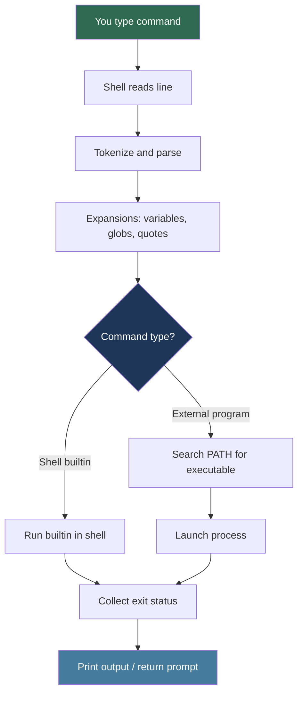

# Shell and Command Line Basics

> **Difficulty:** Beginner → Intermediate | **Category:** Linux Essentials

---

## Table of Contents

1. [What the Shell Is and Why It Matters](#what-the-shell-is-and-why-it-matters)
2. [Prompt Anatomy](#prompt-anatomy)
3. [Command Syntax Fundamentals](#command-syntax-fundamentals)
4. [How Command Execution Works](#how-command-execution-works)
5. [Built-in Help Systems (`man`, `--help`, `info`, `apropos`)](#built-in-help-systems-man---help-info-apropos)
6. [History and Reusing Commands](#history-and-reusing-commands)
7. [Tab Completion and Editing Efficiency](#tab-completion-and-editing-efficiency)
8. [Quoting Basics](#quoting-basics)
9. [Environment Variables](#environment-variables)
10. [Safe Habits for Daily CLI Work](#safe-habits-for-daily-cli-work)
11. [Mini Exercises](#mini-exercises)
12. [Quick Reference](#quick-reference)

---

## What the Shell Is and Why It Matters

A **shell** is a command interpreter between you and the operating system.

- You type text commands.
- The shell parses them.
- The shell launches programs (or runs built-in commands).
- You get output and an exit status.

Think of the shell as:

- **Interface**: text UI to interact with Linux
- **Automation layer**: run repetitive tasks quickly
- **Glue**: connect programs together with pipes and redirection

Common shells:

| Shell | Notes |
|---|---|
| `bash` | Most common default on Linux distributions |
| `zsh` | User-friendly interactive features, popular on macOS |
| `sh` | POSIX shell interface (often links to another shell) |
| `fish` | Friendly interactive shell with rich completion |

Check your current shell:

```bash
echo "$SHELL"
ps -p $$
```

---

## Prompt Anatomy

The **prompt** is what you see before each command. It often encodes context.

Example prompt:

```bash
geek@lab-host:~/projects/HackerNotes$ 
```

Breakdown:

- `geek` → current user
- `@lab-host` → hostname
- `:~/projects/HackerNotes` → current directory (`~` is your home directory)
- `$` → normal user
- `#` → root user (higher risk; commands can affect system-wide state)

Useful command to inspect identity and location:

```bash
whoami
hostname
pwd
id
```

### Prompt Safety Rule

Before pressing Enter, quickly check:

1. **Who am I?** (`$` vs `#`)
2. **Where am I?** (`pwd`)
3. **What am I about to run?**

---

## Command Syntax Fundamentals

Most commands follow this general shape:

```bash
command [options] [arguments]
```

Example:

```bash
ls -lah /var/log
```

- `ls` = command
- `-l -a -h` = options (`-lah` combined)
- `/var/log` = argument (target path)

### Option Styles

- **Short options**: `-a`, `-l`, `-h`
- **Long options**: `--all`, `--human-readable`

Example equivalence:

```bash
ls -a
ls --all
```

### Command Chaining Basics

```bash
cmd1 && cmd2   # run cmd2 only if cmd1 succeeds
cmd1 || cmd2   # run cmd2 only if cmd1 fails
cmd1 ;  cmd2   # run cmd2 regardless of success/failure
```

### Exit Status

Every command returns an integer status:

- `0` = success
- non-zero = failure (or specific condition)

```bash
grep "root" /etc/passwd
echo "$?"
```

---

## How Command Execution Works

When you press Enter, the shell goes through a pipeline of steps.



Practical checks:

```bash
type cd
type ls
which ls
echo "$PATH"
```

- `cd` is typically a shell builtin
- `ls` is usually an external binary (for example `/usr/bin/ls`)

---

## Built-in Help Systems (`man`, `--help`, `info`, `apropos`)

Linux gives you multiple help layers. Use them together.

### 1) `man` — manual pages

```bash
man ls
man 5 passwd
man -k copy
```

- `man ls` → command reference
- `man 5 passwd` → format of `/etc/passwd` file (section 5)
- `man -k` searches man page names/descriptions

Inside `man`:

- `/pattern` to search
- `n` / `N` next/previous match
- `q` quit

### 2) `--help` — quick option summary

```bash
ls --help
cp --help
grep --help
```

Best for fast syntax reminders.

### 3) `info` — structured GNU docs

```bash
info coreutils 'ls invocation'
info bash
```

`info` is often more tutorial-like than man pages.

### 4) `apropos` — discover commands by keyword

```bash
apropos archive
apropos "list directory"
```

If `apropos` returns nothing, update database (requires privileges):

```bash
sudo mandb
```

---

## History and Reusing Commands

The shell stores your command history (usually in `~/.bash_history`).

Useful shortcuts:

- `↑` / `↓` browse history
- `history` list commands
- `!n` run history entry by number
- `!!` rerun previous command
- `!grep` run last command starting with `grep`
- `Ctrl+r` reverse search history

Examples:

```bash
history | tail -n 20
!42
!!
```

### History Safety

Before running `!` expansions, preview first:

```bash
history | tail -n 10
```

For sensitive sessions, temporarily disable history:

```bash
unset HISTFILE
```

---

## Tab Completion and Editing Efficiency

Tab completion reduces typing errors and speeds up navigation.

### Completion Behavior

- Type partial command/path, then press `Tab`
- Press `Tab` twice to list possibilities (if many matches)

Examples:

```bash
cd /etc/sys<Tab>
cat /var/log/auth<Tab>
```

### Editing Keys (Bash/Readline)

- `Ctrl+a` → beginning of line
- `Ctrl+e` → end of line
- `Alt+f` → forward one word
- `Alt+b` → backward one word
- `Ctrl+u` → delete to start of line
- `Ctrl+k` → delete to end of line
- `Ctrl+l` → clear screen

These are simple but high-impact productivity tools.

---

## Quoting Basics

Quoting controls how the shell interprets spaces and special characters.

### 1) Unquoted (shell expands special characters)

```bash
echo $HOME
ls *.log
```

### 2) Single quotes `'...'` (literal text)

```bash
echo '$HOME is literal here'
```

- No variable expansion
- No command substitution

### 3) Double quotes `"..."` (expand variables, keep spaces)

```bash
name="Linux User"
echo "Hello, $name"
```

- `$name` expands
- spaces remain part of one argument

### 4) Escaping with backslash `\`

```bash
echo "He said: \"hello\""
```

### Why this matters

Without proper quotes, paths with spaces break:

```bash
# Risky if variable contains spaces
cp $file /tmp/

# Safe
cp "$file" /tmp/
```

Golden rule:

> Quote variables unless you specifically need word splitting or glob expansion.

---

## Environment Variables

Environment variables are key-value pairs inherited by child processes.

Common variables:

| Variable | Meaning |
|---|---|
| `PATH` | Directories searched for executables |
| `HOME` | Your home directory |
| `USER` | Current username |
| `SHELL` | Current login shell path |
| `PWD` | Current directory |
| `LANG` | Locale/language settings |

### Viewing Variables

```bash
printenv
printenv PATH
echo "$HOME"
```

### Creating Variables

```bash
project="HackerNotes"
echo "$project"
```

This creates a shell variable (local to current shell context).

### Exporting Variables

```bash
export EDITOR=vim
export PROJECT_ROOT="$HOME/projects/HackerNotes"
```

`export` makes it available to child processes:

```bash
bash -c 'echo "$EDITOR"'
```

### Persistent Configuration

Temporary: current shell session only.
Persistent (bash): add to `~/.bashrc`, then reload:

```bash
source ~/.bashrc
```

---

## Safe Habits for Daily CLI Work

Small habits prevent big mistakes.

### 1) Inspect before modifying

```bash
pwd
ls -lah
```

### 2) Prefer dry-runs or interactive flags

```bash
cp -iv source.txt dest.txt
mv -iv oldname newname
rm -i file.txt
```

### 3) Be careful with recursive operations

```bash
# Review targets first
find . -maxdepth 2 -type f | head

# Then apply changes
```

### 4) Use absolute paths in critical commands

```bash
rm -i /home/geek/tmp/test-file
```

### 5) Avoid running as root unless required

Use `sudo` only for commands that need elevated privileges.

### 6) Verify downloads/scripts before execution

- Read script contents
- Check source authenticity
- Avoid blind `curl ... | bash` patterns in real environments

### 7) Understand redirection before using it

```bash
command > file.txt      # overwrite
command >> file.txt     # append
command 2> error.log    # stderr only
command > out.log 2>&1  # stdout + stderr
```

---

## Mini Exercises

> Run these in a safe practice directory (for example inside `~/tmp/shell-lab`).

### Exercise 1 — Prompt and Identity

1. Show current user, host, and directory.
2. Verify your shell.

```bash
whoami
hostname
pwd
echo "$SHELL"
```

### Exercise 2 — Command Syntax

1. List all files (including hidden) in long human-readable format.
2. Check command exit code.

```bash
ls -lah
echo "$?"
```

### Exercise 3 — Help Systems

1. Open manual for `grep`.
2. Find commands related to "compression".
3. View quick help for `tar`.

```bash
man grep
apropos compression
tar --help
```

### Exercise 4 — History + Reuse

1. Run three different commands.
2. Show recent history.
3. Re-run last command with `!!`.

```bash
date
uname -a
id
history | tail -n 10
!!
```

### Exercise 5 — Quoting

1. Create a file with spaces in its name.
2. Copy it safely.

```bash
touch "my notes.txt"
cp "my notes.txt" "my notes copy.txt"
ls -lah
```

### Exercise 6 — Environment Variables

1. Create and export a variable.
2. Confirm child shell can read it.

```bash
export LAB_NAME="shell-basics"
bash -c 'echo "$LAB_NAME"'
```

### Exercise 7 — Safe Habits Drill

1. Create a test directory and files.
2. Remove one file interactively.

```bash
mkdir -p ~/tmp/shell-lab && cd ~/tmp/shell-lab
touch a.txt b.txt c.txt
ls -lah
rm -i b.txt
ls -lah
```

---

## Quick Reference

```bash
# Identity and context
whoami && hostname && pwd

# Help
man <command>
<command> --help
info <command>
apropos <keyword>

# History
history
!!
Ctrl+r

# Completion
Tab / Tab Tab

# Variables
printenv
echo "$PATH"
export NAME=value

# Safety checks
pwd
ls -lah
rm -i <file>
```

If you master this page, you can move comfortably into filesystem operations, text processing pipelines, and basic shell scripting.
