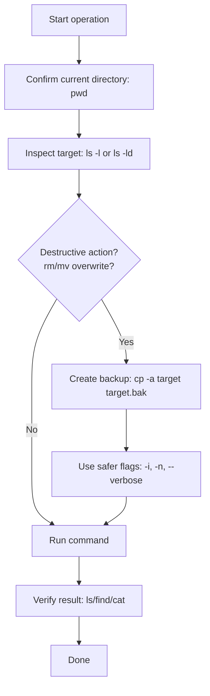

# Filesystem Navigation and Operations (Linux Essentials)

This note takes you from **beginner** commands to **intermediate-safe** habits for working with files and directories on Linux.

## Learning goals

By the end, you should be able to:
- Understand the Linux filesystem hierarchy (FHS basics)
- Navigate using absolute and relative paths confidently
- Create, copy, move, rename, and remove files/directories safely
- Understand hard links vs symbolic links
- Read and change basic permissions
- Find files with `find` and `locate`
- Create and extract archives with `tar`, `gzip`, `zip`

---

## 1) Linux filesystem hierarchy (FHS essentials)

Linux uses a **single directory tree** starting at `/` (root of the filesystem).

### Key directories to know

| Path | Purpose |
|---|---|
| `/` | Top-level root of the filesystem |
| `/home` | Regular user home directories |
| `/root` | Home directory of the root user |
| `/etc` | System-wide configuration files |
| `/var` | Variable data (logs, cache, spool) |
| `/tmp` | Temporary files (often cleaned automatically) |
| `/usr` | User-space programs, libraries, docs |
| `/bin` | Essential user commands (often symlinked to `/usr/bin`) |
| `/sbin` | Essential system/admin commands |
| `/dev` | Device files |
| `/proc` | Virtual process and kernel info |
| `/opt` | Optional third-party software |
| `/mnt`, `/media` | Mount points for filesystems/removable media |

### Filesystem hierarchy diagram

```mermaid
flowchart TD
    A[/ (root)/] --> B[/home]
    A --> C[/etc]
    A --> D[/var]
    A --> E[/usr]
    A --> F[/tmp]
    A --> G[/dev]
    A --> H[/proc]
    A --> I[/opt]
    A --> J[/mnt]
    B --> B1[/home/alex]
    D --> D1[/var/log]
    E --> E1[/usr/bin]
```

---

## 2) Path concepts: absolute vs relative

### Absolute path
- Starts with `/`
- Works from anywhere in the system
- Example: `/home/alex/projects/notes.txt`

### Relative path
- Does **not** start with `/`
- Interpreted from your current directory (`pwd`)
- Example: if you are in `/home/alex`, then `projects/notes.txt`

### Special path shortcuts
- `.` = current directory
- `..` = parent directory
- `~` = current user home
- `-` = previous directory (`cd -`)

### Navigation commands

```bash
pwd                  # print working directory
ls                   # list files
ls -la               # long + hidden files
cd /etc              # go to absolute path
cd ../..             # go up two levels (relative)
cd ~                 # go to home
cd -                 # go to previous directory
```

Tip: Use `realpath <path>` to resolve a path to a full absolute path.

---

## 3) Core file operations

### 3.1 Create files/directories

```bash
touch notes.txt                      # create empty file (or update timestamp)
mkdir reports                        # create one directory
mkdir -p projects/linux/day1         # create nested directories
```

### 3.2 Copy (`cp`)

```bash
cp file1.txt file1.backup.txt              # file to file
cp -r src_dir/ backup_src_dir/             # recursive directory copy
cp -a project/ project_backup/             # archive mode (preserve perms/times/links)
cp -i draft.txt final.txt                  # prompt before overwrite
cp -n draft.txt final.txt                  # never overwrite existing file
```

### 3.3 Move / rename (`mv`)

```bash
mv oldname.txt newname.txt                 # rename file
mv report.txt ~/Documents/                 # move file
mv -i data.csv ~/archive/                  # prompt before overwrite
```

### 3.4 Remove (`rm`, `rmdir`)

```bash
rm temp.txt                         # remove file
rm -i important.txt                 # ask before deleting
rm -r old_project/                  # recursive remove directory
rm -rf build/                       # force + recursive (dangerous)
rmdir empty_dir                     # remove empty directory only
```

Safety rule: prefer `rm -i` and verify with `ls` before destructive commands.

---

## 4) Safe file operation workflow

Use this flow every time you modify or delete important files.



---

## 5) Links: hard vs symbolic

Links let multiple paths refer to data.

### Hard link
- Another filename for the same inode/data
- Usually cannot cross filesystems
- If original name is deleted, data still exists as long as one hard link remains

```bash
ln original.txt hardlink.txt
ls -li original.txt hardlink.txt   # same inode number
```

### Symbolic (soft) link
- A pointer to another path
- Can cross filesystems, can point to directories
- Breaks if target path is removed/moved

```bash
ln -s /var/log/syslog syslog-link
ls -l syslog-link                  # shows -> target path
```

---

## 6) Permissions touchpoint (essential basics)

Every file has permissions for:
- `u` (user/owner)
- `g` (group)
- `o` (others)

Permission bits:
- `r` = read (4)
- `w` = write (2)
- `x` = execute (1)

View permissions:

```bash
ls -l script.sh
# -rwxr-xr-- 1 user group ... script.sh
```

Change permissions:

```bash
chmod u+x script.sh        # symbolic mode
chmod 755 script.sh        # numeric mode (rwxr-xr-x)
chmod 640 secrets.txt      # rw-r-----
```

Change ownership (usually requires sudo):

```bash
sudo chown alice:devops app.conf
```

---

## 7) Finding files: `find` and `locate`

### 7.1 `find` (real-time, very flexible)

```bash
find . -name "*.md"                           # by name from current directory
find /var/log -type f -name "*.log"           # files only
find . -type d -name "backup*"                # directories only
find . -size +100M                             # files larger than 100 MB
find . -mtime -7                               # modified in last 7 days
find . -name "*.tmp" -delete                  # delete matches (careful)
find . -name "*.log" -exec gzip {} \;         # run command on each match
```

Tip: test first without `-delete`.

### 7.2 `locate` (fast index lookup)

```bash
locate ssh_config
locate "*.service"
sudo updatedb         # refresh database (if needed)
```

- `locate` is very fast but can be stale.
- `find` is slower but always current.

---

## 8) Archive and compression basics

### 8.1 `tar` archives

```bash
tar -cvf project.tar project/         # create archive (no compression)
tar -tvf project.tar                  # list contents
tar -xvf project.tar                  # extract in current directory
```

### 8.2 gzip/bzip2/xz compression with tar

```bash
tar -czvf project.tar.gz project/     # gzip (common)
tar -xzvf project.tar.gz              # extract gzip tar

tar -cjvf project.tar.bz2 project/    # bzip2
tar -xjvf project.tar.bz2

tar -cJvf project.tar.xz project/     # xz (higher compression)
tar -xJvf project.tar.xz
```

### 8.3 zip/unzip

```bash
zip -r notes.zip notes/
unzip notes.zip -d restored_notes/
```

---

## 9) Beginner-to-intermediate command examples

```bash
# Build a small workspace
mkdir -p ~/lab/{docs,src,backup}
touch ~/lab/docs/{readme.md,todo.md}

# Copy docs into backup safely
cp -av ~/lab/docs/ ~/lab/backup/

# Rename and move file
mv ~/lab/docs/todo.md ~/lab/docs/tasks.md
mv ~/lab/docs/tasks.md ~/lab/src/

# Create a symbolic link to latest docs folder
ln -s ~/lab/docs ~/lab/latest-docs

# Find all markdown files in lab
find ~/lab -type f -name "*.md"

# Archive lab directory
cd ~
tar -czvf lab-$(date +%F).tar.gz lab/
```

---

## 10) Practice checklist

Use this as hands-on practice:

- [ ] Navigate to home, root, and previous directory using `cd`, `cd /`, `cd -`
- [ ] Explain the difference between absolute and relative paths with examples
- [ ] Create nested directories with `mkdir -p`
- [ ] Create files using `touch` and verify with `ls -l`
- [ ] Copy a directory with `cp -r` and with `cp -a`; compare results
- [ ] Rename and move files with `mv`
- [ ] Delete test files safely with `rm -i`; remove empty dirs with `rmdir`
- [ ] Create and inspect both hard link and symbolic link
- [ ] Change a file to mode `640` and explain resulting permissions
- [ ] Find files by name/type/time using at least three `find` commands
- [ ] Use `locate` and explain when results might be outdated
- [ ] Create and extract `tar.gz` and `zip` archives

---

## Quick recap

- Linux filesystem starts at `/` and follows a predictable hierarchy.
- Paths are absolute (`/path`) or relative (`path`).
- Core operations: `touch`, `mkdir`, `cp`, `mv`, `rm`.
- Use safe habits before destructive actions.
- Links, permissions, and search tools are essential daily skills.
- Archiving (`tar`, `zip`) is foundational for backup and transfer workflows.
