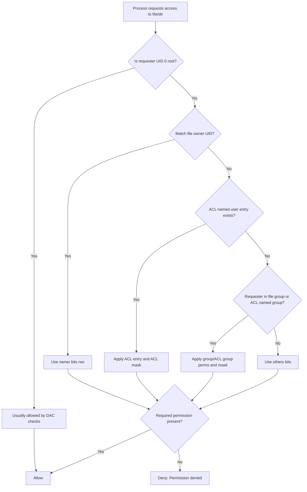

# Users, Groups, Permissions, and ACL (Linux)

This note takes you from **beginner** to **intermediate** on Linux access control.

---

## 1) Core identity concepts

Linux decides access based on identities:

- **User**: an account (human or service), identified by **UID**.
- **Group**: a collection of users, identified by **GID**.
- **Primary group**: default group of a user.
- **Supplementary groups**: extra groups a user belongs to.
- **root (UID 0)**: superuser account with broad system control.

Useful commands:

```bash
whoami
id
groups
getent passwd "$USER"
getent group
```

What to notice in `id` output:

- `uid=1000(alice)` → your user identity
- `gid=1000(alice)` → your primary group
- `groups=...` → supplementary groups

---

## 2) Ownership: user and group on files

Every file and directory has:

- an **owner user**
- an **owner group**

Check with:

```bash
ls -l
```

Example line:

```text
-rw-r----- 1 alice devs 1200 Mar 13 11:00 report.txt
```

- `alice` = owner user
- `devs` = owner group

Ownership matters because standard permissions are evaluated for:

1. owner
2. group
3. others

---

## 3) rwx permissions (files vs directories)

Permission bits are split into three classes:

- **u** (user/owner)
- **g** (group)
- **o** (others)

And three actions:

- **r** (read)
- **w** (write)
- **x** (execute/search)

### For files

- `r` = read file content
- `w` = modify/truncate file
- `x` = run file as a program/script

### For directories

- `r` = list names in directory
- `w` = create/delete/rename entries (usually also needs `x`)
- `x` = enter/search directory (`cd`, access child paths)

Common confusion:

- You can have `r` on a directory and still fail to open files inside if `x` is missing.

---

## 4) Numeric (octal) and symbolic permission modes

Numeric values:

- `r = 4`
- `w = 2`
- `x = 1`

Add them per class:

- `7 = rwx`
- `6 = rw-`
- `5 = r-x`
- `4 = r--`

Examples:

- `644` → `rw-r--r--`
- `640` → `rw-r-----`
- `755` → `rwxr-xr-x`
- `700` → `rwx------`

Symbolic examples:

```bash
chmod u+x script.sh
chmod g-w shared.txt
chmod o-rwx private.key
chmod a+r notes.txt
```

---

## 5) chmod, chown, chgrp (safe usage)

### `chmod` (change permission bits)

```bash
# Numeric
chmod 640 report.txt

# Symbolic
chmod u=rw,g=r,o= report.txt

# Recursive: use carefully and only on lab paths you control
chmod -R u+rwX,g-rwx,o-rwx /tmp/perm-lab
```

> Prefer targeted changes over broad `-R` on system paths.

### `chown` (change owner and optionally group)

```bash
# Change owner only (usually requires sudo)
sudo chown alice report.txt

# Change owner and group together
sudo chown alice:devs report.txt
```

### `chgrp` (change group owner)

```bash
chgrp devs report.txt
```

You can change group without sudo if:

- you own the file, and
- you are a member of the target group.

---

## 6) umask (default permission filter)

`umask` removes permissions from default creation modes.

Typical defaults before umask:

- new files start at `666` (`rw-rw-rw-`) (no execute by default)
- new directories start at `777` (`rwxrwxrwx`)

Effective permission = base mode minus umask bits.

Check and set:

```bash
umask
umask -S
umask 022
```

Examples:

- `umask 022` → files `644`, directories `755`
- `umask 027` → files `640`, directories `750`
- `umask 077` → files `600`, directories `700` (private)

For persistent settings, configure shell startup files or system policy files (varies by distro).

---

## 7) sudo basics (least privilege)

`sudo` lets permitted users run commands as another user (default: root).

Key commands:

```bash
sudo -l        # show what you can run
sudo -v        # refresh cached credentials
sudo -k        # invalidate cached credentials
sudo -u postgres id
```

Best practices:

- Use `sudo` only when needed.
- Prefer specific commands over full root shells.
- Edit sudo policy with `visudo` (syntax checks prevent lockout).
- Avoid running unsafe recursive commands as root.

---

## 8) Special permission bits: SUID, SGID, sticky

These are advanced bits beyond normal `rwx`.

### SUID (`u+s`, value 4000)

On executables, process runs with **file owner** privileges.

```bash
chmod u+s /path/to/program
ls -l /path/to/program
```

Typical indicator: owner execute appears as `s` (for example `-rwsr-xr-x`).

### SGID (`g+s`, value 2000)

- On executables: run with file group privileges.
- On directories: new files inherit directory's group (great for team shares).

```bash
chmod g+s /srv/shared
```

Directory example result: `drwxrws---`.

### Sticky bit (`+t`, value 1000)

Mostly for shared writable directories (like `/tmp`):

- users can create files
- only file owner (or root) can delete their own files

```bash
chmod +t /tmp/perm-lab-dropbox
```

Indicator on directory: `drwxrwxrwt`.

> Security note: do not set SUID/SGID blindly; audit purpose and binary trust.

---

## 9) ACL fundamentals (Access Control Lists)

Standard permissions have only owner/group/others. ACLs add fine-grained rules.

Useful when:

- multiple users need different rights on same path
- one-off exceptions should not force broad group changes

Tools:

```bash
getfacl project.txt
setfacl -m u:bob:rw project.txt
setfacl -m g:qa:r project.txt
setfacl -x u:bob project.txt
setfacl -b project.txt
```

Default ACLs on directories (inherited by new children):

```bash
setfacl -m d:g:devs:rwx /srv/dev-share
getfacl /srv/dev-share
```

Important ACL concepts:

- **named user/group entries**: specific exceptions
- **mask**: maximum effective permissions for group-class and named entries
- **default ACL**: inheritance template on directories

---

## 10) Linux access decision path (simplified)



> Real systems may include extra layers (for example SELinux/AppArmor). The diagram focuses on classic discretionary access control (DAC) + ACL logic.

---

## 11) Safe practice labs

Use only disposable paths under `/tmp`.

### Lab 1: Inspect identities and baseline permissions

```bash
mkdir -p /tmp/perm-lab && cd /tmp/perm-lab
id
umask
touch a.txt
mkdir dir1
ls -ld a.txt dir1
```

Goal: observe defaults affected by your current `umask`.

### Lab 2: rwx behavior on directories

```bash
mkdir -p /tmp/perm-lab/dir2
touch /tmp/perm-lab/dir2/file.txt
chmod 600 /tmp/perm-lab/dir2
ls -ld /tmp/perm-lab/dir2
```

Then test access and restore:

```bash
ls /tmp/perm-lab/dir2 || true
chmod 700 /tmp/perm-lab/dir2
ls /tmp/perm-lab/dir2
```

Goal: see why directory `x` matters for traversal.

### Lab 3: Symbolic and numeric chmod

```bash
cd /tmp/perm-lab
echo "hello" > report.txt
chmod 640 report.txt
ls -l report.txt
chmod u+x report.txt
ls -l report.txt
```

Goal: connect octal and symbolic changes.

### Lab 4: SGID team directory behavior

```bash
sudo mkdir -p /tmp/perm-lab-team
sudo chgrp "$(id -gn)" /tmp/perm-lab-team
sudo chmod 2775 /tmp/perm-lab-team
touch /tmp/perm-lab-team/newfile
ls -ld /tmp/perm-lab-team /tmp/perm-lab-team/newfile
```

Goal: verify inherited group ownership from SGID directory.

### Lab 5: ACL quick test

```bash
cd /tmp/perm-lab
echo "acl test" > acl.txt
getfacl acl.txt
setfacl -m u:"$USER":rw acl.txt
getfacl acl.txt
setfacl -b acl.txt
```

Goal: add/remove ACL entries and observe output format.

### Cleanup

```bash
rm -rf /tmp/perm-lab
sudo rm -rf /tmp/perm-lab-team
```

---

## 12) Quick reference

- View identity: `id`, `groups`
- View perms/owner: `ls -l`
- Change perms: `chmod`
- Change owner/group: `chown`, `chgrp`
- Default mode filter: `umask`
- Privileged execution: `sudo`
- Special bits: SUID `4`, SGID `2`, sticky `1` (leading octal digit)
- Fine-grained exceptions: `getfacl`, `setfacl`

If you remember one principle: **grant the minimum permissions needed, then verify with `ls -l` and `getfacl`**.
