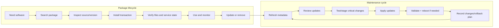

# Software Management and Repositories (Linux Essentials)

Software management is how Linux systems install, verify, update, and remove software safely.  
Instead of downloading random installers, Linux uses **package managers** tied to **trusted repositories**.

## 1) Core package concepts

- **Package**: A bundled application/library plus metadata (name, version, dependencies, files, scripts).
- **Dependency**: Another package required for software to work.
- **Repository (repo)**: A server containing packages and metadata indexes.
- **Package database**: Local record of installed packages and file ownership.
- **Transaction**: A single install/update/remove action tracked by the manager.
- **Metadata**: Package lists, checksums, signatures, dependency graph, changelogs.

Why this matters:
- Reproducible installs
- Faster patching
- Centralized trust via signatures
- Easier auditing and rollback



## 2) RPM + DNF basics (RHEL/Fedora/CentOS/Alma/Rocky)

### RPM (low-level package tool)
- Works on `.rpm` files directly.
- Good for local inspection/query.

```bash
# Query installed package info
rpm -qi openssh

# List files installed by a package
rpm -ql openssh-clients

# Find which package owns a file
rpm -qf /usr/bin/ssh

# Verify installed package files against RPM database
rpm -V openssh-clients
```

### DNF (high-level dependency-aware manager)
- Handles repos, dependencies, transactions, history.

```bash
# Search and inspect
sudo dnf search nginx
sudo dnf info nginx

# Install/remove
sudo dnf install nginx
sudo dnf remove nginx

# Update workflows
sudo dnf check-update
sudo dnf upgrade

# List enabled repositories
dnf repolist

# Transaction history and rollback options
dnf history
sudo dnf history info <transaction-id>
sudo dnf history undo <transaction-id>
```

## 3) APT overview (Debian/Ubuntu)

APT is the high-level manager using `.deb` packages and repo metadata.

```bash
# Refresh package index metadata
sudo apt update

# Upgrade installed packages
sudo apt upgrade

# Full upgrade (can add/remove packages to resolve dependency changes)
sudo apt full-upgrade

# Install/remove/purge
sudo apt install nginx
sudo apt remove nginx
sudo apt purge nginx
sudo apt autoremove --purge

# Query/search
apt search nginx
apt show nginx
apt list --installed
apt list --upgradable
```

## 4) Repository trust and signatures

Package managers trust repos through **GPG signatures**:

- Repositories sign metadata (and often packages).
- Your system stores trusted public keys in keyrings.
- Manager verifies signature before accepting metadata/packages.
- Invalid or missing signatures should be treated as a security warning.

### Good trust habits

1. Use official distro repos first.
2. Add third-party repos only when necessary.
3. Import keys from official vendor channels.
4. Verify fingerprint before trusting a new key.
5. Avoid outdated trust methods.

Examples:

```bash
# DNF: list repo definitions
ls /etc/yum.repos.d/

# DNF: inspect repo details
dnf repoinfo

# APT: modern keyring-based repo files
ls /etc/apt/sources.list.d/
ls /etc/apt/keyrings/

# APT: inspect configured sources
grep -R "^[^#].*deb " /etc/apt/sources.list /etc/apt/sources.list.d/ 2>/dev/null
```

## 5) Safe update workflows

### Recommended routine (servers and workstations)

1. **Read update scope** (security vs major version jumps).
2. **Snapshot/backup first** (VM snapshot, filesystem snapshot, or image backup).
3. **Refresh metadata** (`dnf makecache` or `apt update`).
4. **Preview changes** (`dnf check-update`, `apt list --upgradable`).
5. **Apply updates** in a maintenance window for critical systems.
6. **Validate services** and logs after update.
7. **Reboot if needed**, especially kernel/glibc/systemd updates.
8. **Document transaction IDs / package list** for rollback context.

Example maintenance commands:

```bash
# DNF example
sudo dnf makecache
sudo dnf check-update
sudo dnf upgrade -y
sudo needs-restarting -r || true

# APT example
sudo apt update
apt list --upgradable
sudo apt upgrade -y
sudo apt autoremove --purge -y
```

## 6) Package queries you should know

### RPM/DNF side

```bash
# Which package provides a command/file?
dnf provides /usr/bin/rsync

# Show installed versions
rpm -qa | grep -E '^openssl|^kernel'

# Show transaction history
dnf history list
```

### APT/DPKG side

```bash
# Show package version policy/candidates
apt policy openssl

# List files from an installed package
dpkg -L openssh-client

# Find package owning a file
dpkg -S /usr/bin/ssh
```

## 7) Rollback-aware habits

- Prefer **small, frequent updates** over huge infrequent jumps.
- Keep **change logs** (date, host, transaction ID, reason).
- Keep recent package caches/snapshots where policy allows.
- Test risky updates in staging first.
- For DNF, use `dnf history` to undo/redo transactions when possible.
- For APT, rely on snapshots/backups for stronger rollback (LVM/Btrfs/ZFS/VM).
- Never remove core libraries blindly; review dependency impact first.

## 8) Safety checklist (quick use)

- [ ] I verified repository source and signing key fingerprint.
- [ ] I ran metadata refresh before installing/updating.
- [ ] I reviewed what will change (upgradable list / transaction preview).
- [ ] I created a backup or snapshot for important systems.
- [ ] I applied updates in a suitable maintenance window.
- [ ] I validated critical services after changes.
- [ ] I documented what changed and how to rollback.

---

If you remember one rule: **Trust signed repositories, update deliberately, and keep rollback options ready before major changes.**
