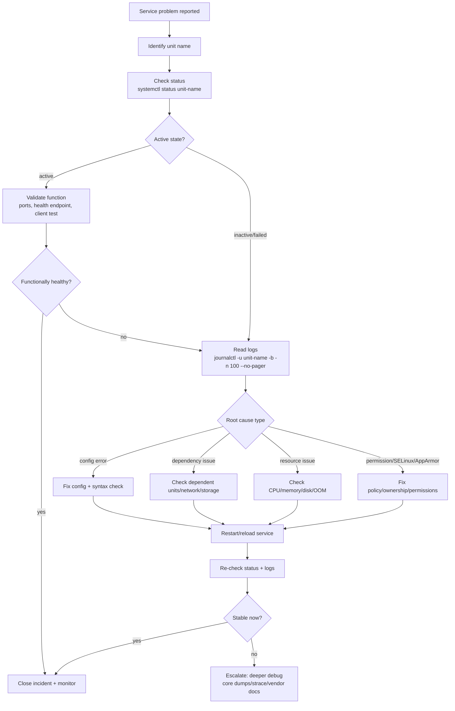

# Process, Service, and Log Management

## Why this matters
Linux systems run many things at once: shells, editors, web servers, databases, background workers, and scheduled jobs. To operate a server confidently, you need to:

- inspect and control **processes**
- understand and manage **services** with `systemd`
- read **logs** quickly to debug failures

This note moves from beginner commands to practical troubleshooting workflows.

---

## 1) Process fundamentals

A **process** is a running program instance with its own memory, PID (process ID), owner, and state.

Key fields you will see often:

- **PID**: process identifier
- **PPID**: parent process identifier
- **USER**: process owner
- **%CPU / %MEM**: resource usage
- **STAT**: process state (`R`, `S`, `D`, `T`, `Z`...)
- **CMD**: command that started the process

### Process states (common)

- `R` = running/runnable
- `S` = sleeping (interruptible)
- `D` = uninterruptible sleep (often I/O wait)
- `T` = stopped (job control or debugging)
- `Z` = zombie (finished, waiting for parent to reap it)

---

## 2) Inspecting processes: `ps`, `top`, `pgrep`

### `ps`: snapshot view
Use `ps` when you want a point-in-time list.

```bash
# Show all processes in full format
ps -ef

# BSD-style with CPU/memory and command tree clues
ps aux

# Show specific columns for easier reading
ps -eo pid,ppid,user,%cpu,%mem,stat,etime,cmd --sort=-%cpu | head

# Find children of a process
ps --ppid 1234 -o pid,stat,cmd
```

### `top`: live view
Use `top` for real-time monitoring.

```bash
top
```

Useful keys inside `top`:

- `P` sort by CPU
- `M` sort by memory
- `k` terminate a process by PID
- `1` show per-core CPU stats
- `q` quit

(You can also use `htop` if installed; it is more user-friendly.)

### `pgrep`: find process IDs by name/pattern

```bash
# Find PIDs by process name
pgrep nginx

# Match full command line
pgrep -af "python.*worker"

# Count matching processes
pgrep -c sshd
```

`pgrep` is safer and cleaner than parsing `ps` output with `grep`.

---

## 3) Controlling processes: `kill`, `pkill`, `killall`

> Despite the name, `kill` sends a **signal**. It does not always force-terminate.

```bash
# Ask process to terminate gracefully (SIGTERM)
kill 1234

# Explicit graceful terminate
kill -TERM 1234

# Force stop if process ignores TERM (last resort)
kill -KILL 1234

# List signal names
kill -l
```

Pattern-based variants:

```bash
# Send signal by process name
pkill -TERM nginx

# Match full command line
pkill -f "my-app --worker"

# killall by exact process name (availability/behavior can vary by distro)
killall -TERM nginx
```

Prefer graceful shutdown first (`TERM`), then `KILL` only if necessary.

---

## 4) Signals you must know

Signals are asynchronous notifications sent to processes.

| Signal | Number* | Typical use |
|---|---:|---|
| `SIGHUP` | 1 | Reload config / terminal hangup semantics |
| `SIGINT` | 2 | Interrupt (`Ctrl+C`) |
| `SIGQUIT` | 3 | Quit + core dump |
| `SIGTERM` | 15 | Graceful termination (default for `kill`) |
| `SIGKILL` | 9 | Immediate, cannot be trapped/ignored |
| `SIGSTOP` | 19 | Pause process, cannot be trapped |
| `SIGCONT` | 18 | Continue paused process |

\*Numbers can vary by architecture; names are more portable.

Practical examples:

```bash
# Reload daemon config without full restart (if supported)
kill -HUP <pid>

# Pause and resume a process
kill -STOP <pid>
kill -CONT <pid>
```

---

## 5) Job control (shell-level background work)

Job control is about processes started from your current shell.

```bash
# Run in background
sleep 300 &

# Show jobs in this shell
jobs -l

# Bring latest job to foreground
fg

# Continue stopped job in background
bg %1
```

Useful patterns:

```bash
# Keep command running after logout
nohup long_task.sh > task.log 2>&1 &

# Remove a job from shell job table (bash/zsh)
disown %1
```

Notes:

- `jobs`, `fg`, `bg` only affect jobs in the current shell session.
- Services (system-wide daemons) should usually be managed with `systemd`, not shell job control.

---

## 6) systemd concepts (service manager)

`systemd` is the init/service manager on most modern Linux distros.

### Core ideas

- **Unit**: systemd object definition (`.service`, `.socket`, `.target`, `.timer`, `.mount`...)
- **Service unit**: defines how a daemon starts/stops/restarts
- **Target**: grouping/synchronization point (similar to runlevels)
- **Dependency**: `After=`, `Requires=`, `Wants=` relationships
- **Unit file locations** (common):
  - `/usr/lib/systemd/system/` or `/lib/systemd/system/` (package-provided)
  - `/etc/systemd/system/` (admin overrides/custom units)

### Service lifecycle behavior

- `Type=simple` (default): process started directly
- `Type=forking`: daemon forks to background
- `Type=oneshot`: short task, often with `RemainAfterExit=yes`
- restart policy via `Restart=on-failure`, `RestartSec=...`

---

## 7) `systemctl` usage you need daily

```bash
# General status overview
systemctl status

# Status of one service
systemctl status nginx

# Start/stop/restart/reload
sudo systemctl start nginx
sudo systemctl stop nginx
sudo systemctl restart nginx
sudo systemctl reload nginx

# Enable/disable at boot
sudo systemctl enable nginx
sudo systemctl disable nginx

# Start now + enable at boot
sudo systemctl enable --now nginx

# Prevent any start (stronger than disable)
sudo systemctl mask nginx
sudo systemctl unmask nginx

# Check state quickly
systemctl is-active nginx
systemctl is-enabled nginx

# List failed units
systemctl --failed

# List loaded units and unit files
systemctl list-units --type=service
systemctl list-unit-files --type=service

# Show merged unit definition and drop-ins
systemctl cat nginx

# Show low-level unit properties
systemctl show nginx | grep -E 'ActiveState|SubState|FragmentPath|ExecStart'

# Reload unit files after editing/adding units
sudo systemctl daemon-reload
```

---

## 8) Understanding unit states

For troubleshooting, distinguish these layers:

### Load state
- `loaded`: unit file parsed successfully
- `not-found`: unit does not exist
- `masked`: unit symlinked to `/dev/null` (cannot start)

### Active state
- `active`: currently running/active
- `inactive`: not running
- `failed`: service crashed or exited with failure
- `activating` / `deactivating`: transition states

### Enablement state (`systemctl is-enabled`)
- `enabled`: starts automatically by dependency/target at boot
- `disabled`: not enabled for auto-start
- `static`: cannot be enabled directly (no `[Install]` section)
- `masked`: blocked from starting

Common confusion:

- A service can be **active** now but **disabled** (running manually, not auto-start).
- A service can be **enabled** but currently **inactive** (not started yet this boot).

---

## 9) Logs: journald and `/var/log`

### journald with `journalctl`
`systemd-journald` collects kernel and service logs in a structured journal.

```bash
# All logs
journalctl

# Current boot
journalctl -b

# Previous boot
journalctl -b -1

# Logs for one service
journalctl -u nginx

# Follow logs live (like tail -f)
journalctl -u nginx -f

# Time filtering
journalctl --since "2026-03-13 10:00" --until "2026-03-13 11:00"

# Priority filter (0 emerg .. 7 debug)
journalctl -p warning..alert

# Kernel messages only
journalctl -k

# No pager for scripting
journalctl -u nginx --no-pager -n 50
```

### Classic files under `/var/log`
Depending on distro and setup, logs may also be written to plain files:

- `/var/log/syslog` (Debian/Ubuntu general log)
- `/var/log/messages` (RHEL/CentOS general log)
- `/var/log/auth.log` or `/var/log/secure` (auth)
- `/var/log/kern.log` (kernel)
- application logs (for example `/var/log/nginx/`, `/var/log/httpd/`)

Common commands:

```bash
# Last lines
sudo tail -n 100 /var/log/syslog

# Follow updates
sudo tail -f /var/log/auth.log

# Search errors
sudo grep -i "error\\|failed\\|timeout" /var/log/syslog

# Fast search in big logs (ripgrep)
sudo rg -i "segfault|oom|denied" /var/log
```

Tip: start with `journalctl -u <service> -b` for service-specific issues, then expand to broader system logs if needed.

---

## 10) Service troubleshooting flow

Use this lifecycle whenever a service is down or unstable.



### Quick practical checklist

1. `systemctl status <unit>`
2. `journalctl -u <unit> -b -n 100 --no-pager`
3. Validate config (service-specific command)
4. Check dependencies: `systemctl list-dependencies <unit>`
5. Check host resources: `free -h`, `df -h`, `top`
6. Restart/reload and verify behavior

---

## 11) End-to-end command examples

### Example A: Web service won’t start

```bash
sudo systemctl start nginx
systemctl status nginx --no-pager
journalctl -u nginx -b -n 80 --no-pager
sudo nginx -t
sudo systemctl restart nginx
systemctl is-active nginx
curl -I http://127.0.0.1
```

### Example B: Find and stop runaway process

```bash
ps -eo pid,ppid,%cpu,%mem,stat,cmd --sort=-%cpu | head
pgrep -af python
kill -TERM <pid>
# if still stuck
kill -KILL <pid>
```

### Example C: Check failures after reboot

```bash
systemctl --failed
journalctl -b -p err..alert --no-pager
journalctl -u <unit> -b -1 --no-pager | tail -n 80
```

---

## 12) Practice tasks (hands-on)

1. List the top 10 CPU-consuming processes and explain each column you used.
2. Start `sleep 600` in background, stop it with `SIGSTOP`, then resume it with `SIGCONT`.
3. Use `pgrep -af` to find your shell and compare output with `ps -ef | grep`.
4. Pick a service (`ssh`, `cron`, `nginx`, etc.): check `status`, `is-active`, and `is-enabled`.
5. For the same service, show last 50 log lines from current boot using `journalctl`.
6. Intentionally run a bad config test (safe lab service), observe failure in `systemctl status` and logs.
7. Identify one `failed` unit with `systemctl --failed` and trace likely cause.
8. Compare `enabled` vs `active` by disabling a running non-critical test service.
9. Search `/var/log` for `error`, `denied`, and `timeout`, then summarize findings.
10. Build your own one-page incident checklist from the troubleshooting flow above.

---

## 13) Common mistakes to avoid

- Using `kill -9` first instead of graceful `TERM`
- Confusing shell jobs with system services
- Restarting repeatedly without reading logs
- Forgetting `daemon-reload` after unit file changes
- Assuming “enabled” means “currently running”

Master these basics and you can diagnose most day-to-day Linux service issues quickly.
