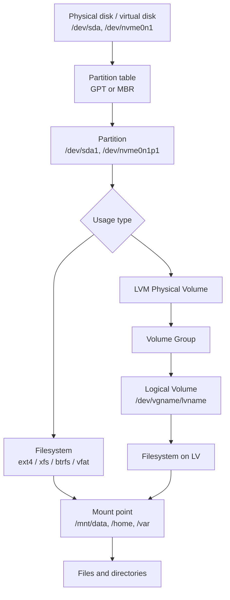

# Storage, Filesystems, LVM, and Mounting (Linux Essentials)

This note moves from **beginner fundamentals** to **intermediate administration habits** for Linux storage.

## Learning goals

By the end, you should be able to:
- Explain disks, partitions, filesystems, and mount points as a stack
- Inspect block devices and partition layouts safely
- Create filesystems with `mkfs` tools and verify results
- Mount and unmount filesystems correctly (temporary and persistent)
- Write safe `/etc/fstab` entries and validate them before reboot
- Understand core LVM objects (PV, VG, LV) and basic resizing
- Monitor storage capacity and inode usage
- Troubleshoot common storage and boot-time storage failures

---

## 1) Storage stack mental model

Linux stores data through layers. Thinking in layers helps with troubleshooting.



Quick rule:
- **Disk/partition/LV** = where data can live
- **Filesystem** = how data is organized
- **Mount point** = where it appears in the directory tree

---

## 2) Disks and partitions

## 2.1 Device naming

Common block device names:
- SATA/SCSI/virtio style: `/dev/sda`, `/dev/sdb`, partitions `/dev/sda1`
- NVMe style: `/dev/nvme0n1`, partitions `/dev/nvme0n1p1`
- Loop devices (lab/testing): `/dev/loop0`

## 2.2 Inspect current storage layout

```bash
lsblk
lsblk -f                    # show filesystems, labels, UUIDs
sudo fdisk -l               # partition tables and geometry
sudo blkid                  # filesystem signatures and UUIDs
findmnt                     # currently mounted filesystems
```

Useful output interpretation:
- `TYPE=disk` -> full disk
- `TYPE=part` -> partition
- `TYPE=lvm` -> logical volume mapping
- `FSTYPE` empty -> raw/unformatted block device

## 2.3 Partition table basics: GPT vs MBR

- **GPT** (modern default): supports many partitions and large disks
- **MBR** (legacy): limited partition scheme and smaller addressing limits

For modern Linux systems, use GPT unless compatibility requirements force MBR.

## 2.4 Create a partition (example)

> Warning: partitioning is destructive on target ranges. Double-check the device.

```bash
# Example target: /dev/sdb (replace with your lab/test disk)
sudo parted /dev/sdb --script mklabel gpt
sudo parted /dev/sdb --script mkpart primary ext4 1MiB 100%
sudo partprobe /dev/sdb
lsblk /dev/sdb
```

---

## 3) Filesystem fundamentals and `mkfs`

A filesystem stores metadata + file content. Different filesystems have different tradeoffs.

Common choices:
- `ext4`: stable, widely supported, general-purpose default
- `xfs`: excellent for large files and high-throughput workloads
- `btrfs`: advanced features (snapshots/checksums), operational complexity
- `vfat/exfat`: removable media interoperability
- `swap`: paging space (not a regular filesystem)

## 3.1 Create filesystems

> `mkfs*` overwrites filesystem metadata. Use only on the correct target.

```bash
sudo mkfs.ext4 -L data /dev/sdb1
sudo mkfs.xfs  -L logs /dev/sdc1
sudo mkswap    -L swap1 /dev/sdd1
```

## 3.2 Verify filesystem creation

```bash
lsblk -f
sudo blkid /dev/sdb1
sudo file -s /dev/sdb1
```

---

## 4) Mount and unmount

Mounting attaches a filesystem to a directory in `/`.

## 4.1 Temporary mount (until reboot)

```bash
sudo mkdir -p /mnt/data
sudo mount /dev/sdb1 /mnt/data
findmnt /mnt/data
df -hT /mnt/data
```

Now files written under `/mnt/data` are stored on `/dev/sdb1`.

## 4.2 Mount options you should know

- `defaults` -> common safe defaults
- `ro` / `rw` -> read-only / read-write
- `noexec` -> prevent direct binary execution
- `nosuid` -> ignore SUID/SGID bits
- `nodev` -> ignore device files on that filesystem
- `noatime` -> reduce metadata writes

Example:

```bash
sudo mount -o rw,noatime /dev/sdb1 /mnt/data
```

## 4.3 Unmount safely

```bash
sudo umount /mnt/data
```

If unmount fails with "target is busy":

```bash
sudo lsof +f -- /mnt/data
sudo fuser -vm /mnt/data
# stop processes or leave directory in other shells, then retry
sudo umount /mnt/data
```

Last-resort options (use carefully):

```bash
sudo umount -l /mnt/data     # lazy unmount
```

---

## 5) Persistent mounts with `/etc/fstab`

`/etc/fstab` tells Linux what to mount during boot.

## 5.1 fstab fields

Each non-comment line has 6 fields:

1. **Device** (`UUID=...`, `LABEL=...`, or path)
2. **Mount point** (`/data`)
3. **Filesystem type** (`ext4`, `xfs`, `swap`, `tmpfs`)
4. **Options** (`defaults`, `noatime`, `nofail`, ...)
5. **Dump** (usually `0`)
6. **Fsck order** (`1` for root, `2` for others, `0` for no fsck)

Prefer `UUID=` over `/dev/sdX` names because kernel device ordering can change.

## 5.2 Example entries

```fstab
# <device>                                 <mountpoint> <type> <options>              <dump> <pass>
UUID=11111111-2222-3333-4444-555555555555  /data        ext4   defaults,noatime       0      2
UUID=aaaaaaaa-bbbb-cccc-dddd-eeeeeeeeeeee  /var/log     xfs    defaults,nodev,nosuid  0      2
UUID=99999999-8888-7777-6666-555555555555  none         swap   sw                      0      0
```

## 5.3 Safe workflow when editing fstab

```bash
sudo cp /etc/fstab /etc/fstab.bak
sudo blkid
sudoedit /etc/fstab
sudo mount -a                # validate immediately
findmnt --verify             # extra validation
```

If `mount -a` is clean (no errors), reboot risk is much lower.

For non-critical disks on servers, consider `nofail` so boot continues even if the disk is absent.

---

## 6) LVM fundamentals (beginner to intermediate)

LVM adds flexibility between physical storage and filesystems.

Core objects:
- **PV (Physical Volume)**: disk/partition prepared for LVM (`pvcreate`)
- **VG (Volume Group)**: storage pool made from one or more PVs (`vgcreate`)
- **LV (Logical Volume)**: virtual partition carved from a VG (`lvcreate`)

## 6.1 Build a basic LVM stack

```bash
# Example: two partitions prepared for LVM
sudo pvcreate /dev/sdb1 /dev/sdc1
sudo vgcreate vgdata /dev/sdb1 /dev/sdc1
sudo lvcreate -n lvapp -L 20G vgdata

# put a filesystem on the LV
sudo mkfs.ext4 /dev/vgdata/lvapp
sudo mkdir -p /srv/appdata
sudo mount /dev/vgdata/lvapp /srv/appdata
```

Inspect LVM:

```bash
sudo pvs
sudo vgs
sudo lvs -a -o +devices
```

## 6.2 Extend capacity (common operation)

### Extend LV and ext4 filesystem

```bash
sudo lvextend -L +10G /dev/vgdata/lvapp
sudo resize2fs /dev/vgdata/lvapp
```

### Extend LV and XFS filesystem

```bash
sudo lvextend -L +10G /dev/vgdata/lvapp
sudo xfs_growfs /srv/appdata
```

Notes:
- XFS grows online but cannot shrink safely in normal workflows.
- ext4 can grow online; shrinking requires downtime and extra care.

## 6.3 Snapshot basics (intermediate)

```bash
sudo lvcreate -s -n lvapp_snap -L 2G /dev/vgdata/lvapp
sudo lvs
```

Snapshots help for short-term backup/rollback workflows, but they consume space as origin data changes.

---

## 7) Capacity monitoring and housekeeping

## 7.1 What to monitor regularly

- Filesystem capacity (`df -h`)
- Inodes (`df -ih`)
- Largest directories (`du`)
- Largest files (`find`)
- LVM free space (`vgs`)
- Log growth (`journalctl --disk-usage`, `/var/log`)

## 7.2 Practical commands

```bash
df -hT
df -ih
sudo du -xh --max-depth=1 /var | sort -h
sudo find / -xdev -type f -size +500M -printf '%10s %p\n' | sort -nr | head
sudo vgs
sudo lvs
journalctl --disk-usage
```

## 7.3 Quick threshold checks

```bash
# Show filesystems at or above 80% used
(df -hP | awk 'NR==1 || $5+0 >= 80')
```

---

## 8) Common failure modes and recovery mindset

## 8.1 Filesystem 100% full

Symptoms:
- "No space left on device"
- Services fail to write PID/log/temp files

Actions:
1. `df -hT` to identify affected mount
2. `du -xh --max-depth=1` to find largest directories
3. Rotate/clean logs, remove temporary or stale data
4. Extend volume (LVM/cloud disk) if needed

## 8.2 Inode exhaustion (space available but cannot create files)

Symptoms:
- Writes fail despite free GiB in `df -h`

Check:

```bash
df -ih
```

Fix:
- Remove massive counts of tiny files (cache/tmp/mail queue patterns)

## 8.3 Wrong `/etc/fstab` entry causes boot issues

Symptoms:
- Boot drops to emergency mode

Recovery approach:
1. Boot to rescue/emergency shell
2. Remount root read-write if needed
3. Fix `/etc/fstab` (bad UUID/type/options)
4. Validate with `mount -a`
5. Reboot

Preventive controls:
- Always back up `fstab`
- Always test with `mount -a`
- Use `UUID=` and `nofail` for optional devices

## 8.4 Device renamed or UUID changed

Symptoms:
- Mount fails for `/dev/sdX1`

Fix:
- Use stable identifiers (`UUID=`/`LABEL=`)
- Re-check with `blkid` and update `fstab`

## 8.5 Busy unmount

Symptoms:
- `umount: target is busy`

Fix:
- Identify users with `lsof`/`fuser`
- Stop processes, change working directories, retry

## 8.6 Read-only remount or I/O errors

Symptoms:
- Filesystem suddenly becomes read-only
- Kernel logs show I/O errors

Check:

```bash
dmesg | tail -n 100
```

Actions:
- Assume disk/hardware/storage-layer issue until proven otherwise
- Back up immediately
- Run filesystem checks during maintenance window (`fsck` on unmounted filesystems)
- Replace failing hardware/virtual disk backing if needed

## 8.7 LVM out of free extents

Symptoms:
- `lvextend` fails due to insufficient VG free space

Fix:
- Add another PV then extend VG/LV:

```bash
sudo pvcreate /dev/sdd1
sudo vgextend vgdata /dev/sdd1
sudo lvextend -L +20G /dev/vgdata/lvapp
```

---

## 9) Safe operating checklist (before storage changes)

- Confirm exact target with `lsblk -f` and `blkid`
- Confirm backups/snapshots exist for important data
- Avoid destructive operations on production mounts without change window
- Prefer `UUID=` in `fstab`
- Validate mount behavior with `mount -a`
- Document what changed (device, UUID, mountpoint, reason)

---

## 10) Hands-on lab checklist (practical)

Use a lab VM or disposable environment.

### Beginner lab

- [ ] Run `lsblk -f`, `blkid`, and identify disk vs partition vs mounted fs
- [ ] Create a test partition on a lab disk
- [ ] Format it with `mkfs.ext4 -L labdata`
- [ ] Mount to `/mnt/labdata` and create test files
- [ ] Unmount and remount successfully
- [ ] Add a working `/etc/fstab` entry using UUID
- [ ] Validate with `mount -a`

### Intermediate lab (LVM)

- [ ] Create two LVM PVs
- [ ] Create one VG and one LV
- [ ] Format LV and mount it
- [ ] Extend LV by +1G and grow filesystem
- [ ] Verify growth with `df -hT` and `lvs`
- [ ] Create and inspect an LVM snapshot
- [ ] Simulate capacity alert (>80%) and identify top consumers with `du`

### Troubleshooting drill

- [ ] Intentionally break a non-critical `fstab` entry in a lab
- [ ] Observe `mount -a` error output
- [ ] Fix entry and verify clean mount

---

## 11) Command quick reference

```bash
# Discovery
lsblk -f
blkid
findmnt

# Partitioning
parted /dev/sdb --script mklabel gpt mkpart primary ext4 1MiB 100%

# Filesystem creation
mkfs.ext4 -L data /dev/sdb1
mkfs.xfs -L logs /dev/sdc1

# Mounting
mount /dev/sdb1 /mnt/data
umount /mnt/data

# fstab validation
cp /etc/fstab /etc/fstab.bak
mount -a
findmnt --verify

# LVM
pvcreate /dev/sdb1
vgcreate vgdata /dev/sdb1
lvcreate -n lvapp -L 10G vgdata
lvextend -L +5G /dev/vgdata/lvapp
resize2fs /dev/vgdata/lvapp   # ext4
xfs_growfs /mountpoint         # xfs

# Capacity
 df -hT
 df -ih
 du -xh --max-depth=1 /var | sort -h
```

If you can perform the labs and explain each layer in the diagram, you have solid beginner-to-intermediate Linux storage skills.
