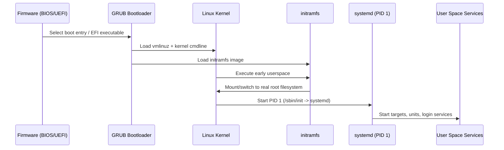

# Linux Boot Process, GRUB, and Recovery (Beginner → Intermediate)

This note explains what happens from power-on to login, how GRUB and `systemd` fit in, and how to recover when boot fails.

---

## 1) End-to-end boot flow

At a high level:

1. **Firmware** (BIOS/UEFI) performs hardware checks and finds a bootable device.
2. **Bootloader** (commonly GRUB) loads the Linux kernel and initial RAM disk.
3. **Kernel** initializes CPU, memory, drivers, and mounts a temporary root (`initramfs`).
4. **initramfs** loads needed modules and finds the real root filesystem.
5. **systemd (PID 1)** starts services and reaches the default target (multi-user or graphical).



---

## 2) GRUB basics

GRUB is the menu/loader between firmware and kernel.

### Key concepts
- **Menu entries**: different kernels or operating systems.
- **Kernel command line**: options passed to kernel (e.g., `ro`, `quiet`, `systemd.unit=rescue.target`).
- **Config file**: generated final config is often `/boot/grub/grub.cfg` (do not edit directly).
- **Defaults file**: distro-specific, often `/etc/default/grub`.

### Safe GRUB commands
> Commands differ by distro family.

```bash
# Debian/Ubuntu: regenerate GRUB config safely
sudo update-grub

# RHEL/CentOS/Fedora: regenerate config to common path (UEFI path may vary)
sudo grub2-mkconfig -o /boot/grub2/grub.cfg

# Show current kernel command line used by running system
cat /proc/cmdline
```

### Temporary edit at boot (safe and common)
1. At GRUB menu, highlight your kernel entry.
2. Press `e` to edit temporarily.
3. Find line starting with `linux`.
4. Add parameter (example): `systemd.unit=rescue.target`.
5. Boot with `Ctrl+x` or `F10`.

This change is **one-time** and resets next boot.

---

## 3) `systemd` targets you should know

Targets are groups of services (similar to old runlevels).

- `poweroff.target` → shutdown
- `rescue.target` → single-user style mode, basic services, usually requires root password
- `emergency.target` → minimal shell, very few services, often root fs may be read-only
- `multi-user.target` → non-graphical normal server mode
- `graphical.target` → desktop/login manager mode
- `default.target` → symlink to system default target

### Useful safe commands

```bash
# See default boot target
systemctl get-default

# See active target in current boot
systemctl list-units --type=target --state=active

# List available targets
systemctl list-unit-files --type=target

# Temporarily isolate into rescue mode (from running system)
sudo systemctl isolate rescue.target

# Set default boot target (persistent)
sudo systemctl set-default multi-user.target
```

---

## 4) Rescue vs Emergency mode

### Rescue mode (`rescue.target`)
Use when system boots but normal services fail.

- More services than emergency
- Better environment for diagnostics
- Often networking may not be fully available

### Emergency mode (`emergency.target`)
Use when root filesystem/services are badly broken.

- Minimal environment
- No normal service startup
- Intended for last-resort repairs

### Boot directly into these modes (temporary)
From GRUB edit screen (`e`), append one of:

- `systemd.unit=rescue.target`
- `systemd.unit=emergency.target`

---

## 5) Practical boot troubleshooting

Follow this order to avoid risky changes.

### A) Observe what failed

```bash
# Current boot logs (errors at high priority)
journalctl -b -p err..alert --no-pager

# Full boot log for current boot
journalctl -b --no-pager

# Failed systemd units
systemctl --failed
```

### B) Filesystem and mount issues

Symptoms: drops to emergency shell, `cannot mount`, `dependency failed for /`.

```bash
# Check block devices and mount points
lsblk -f

# Review static mount config carefully
sudo cat /etc/fstab

# Test fstab entries without rebooting (safe check)
sudo mount -a
```

If `mount -a` errors, fix bad UUIDs/options in `/etc/fstab`.

### C) Disk space / inode exhaustion

```bash
# Space usage
df -h

# Inode usage
df -i
```

Full `/` can prevent services/logins from starting.

### D) Kernel/initramfs mismatch

Symptoms: kernel panic, missing root driver, cannot find root fs.

```bash
# Installed kernels (Debian/Ubuntu)
dpkg -l | grep linux-image

# Installed kernels (RHEL family)
rpm -qa | grep '^kernel'
```

If needed, boot an older kernel from GRUB Advanced options.

### E) Bootloader problems

Symptoms: no GRUB menu, `grub rescue>`, missing entries.

- Confirm correct boot mode (UEFI vs Legacy BIOS).
- From live media/chroot, reinstall/regenerate GRUB using distro docs.
- Keep one known-good kernel entry available.

---

## 6) Safe recovery checklist (quick reference)

1. **Do not panic-reboot repeatedly**; capture first error text/photo.
2. Boot older kernel from GRUB if available.
3. Try temporary boot with `systemd.unit=rescue.target`.
4. Check failed units: `systemctl --failed`.
5. Check logs: `journalctl -b -p err..alert --no-pager`.
6. Verify mounts: `lsblk -f`, `/etc/fstab`, then `sudo mount -a`.
7. Check free space/inodes: `df -h`, `df -i`.
8. If still broken, use emergency mode and repair minimal issues.
9. After fix, reboot and re-check logs for residual errors.
10. Document root cause and permanent fix (kernel, fstab, service, bootloader).

---

## 7) Good habits to prevent boot failures

- Keep at least one older working kernel installed.
- Avoid editing `/boot/grub/grub.cfg` directly; regenerate instead.
- Validate `/etc/fstab` changes with `mount -a` before reboot.
- Keep rescue/live USB ready for offline repair.
- Make small changes and record what was changed.
