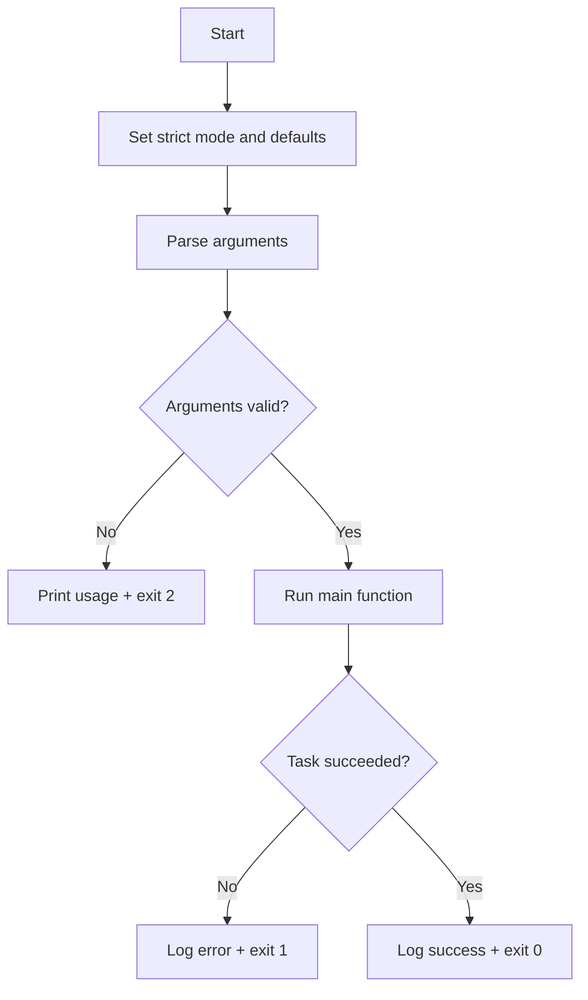

# Bash Scripting and Automation (Linux Essentials)

Bash scripting lets you automate repeatable admin work: checks, backups, health monitoring, and scheduled maintenance.

---

## 1) Shebang and script structure

The first line tells Linux which interpreter to use:

```bash
#!/usr/bin/env bash
```

- `#!/usr/bin/env bash` is portable across systems where Bash may not be in `/bin/bash`.
- Make scripts executable with `chmod +x script.sh`.
- Run with `./script.sh`.

Recommended safe baseline:

```bash
#!/usr/bin/env bash
set -Eeuo pipefail
IFS=$'\n\t'
```

- `-e`: exit on unhandled command errors  
- `-u`: error on unset variables  
- `-o pipefail`: fail pipeline if any command fails  
- `-E`: keeps `ERR` trap behavior in functions/subshells  
- `IFS=$'\n\t'`: safer word splitting

---

## 2) Variables

```bash
name="web01"
port=8080
readonly config_file="/etc/myapp.conf"
timestamp="$(date +%F_%H-%M-%S)"
```

Rules:
- No spaces around `=`
- Use meaningful names (`backup_dir`, `threshold`)
- Use `readonly` for constants
- Use command substitution with `$(...)`

Environment variable examples:

```bash
export PATH="$PATH:/opt/tools/bin"
echo "$HOME"
```

---

## 3) Quoting (critical)

Use quotes unless you explicitly need word splitting/globbing.

```bash
file="My Notes.txt"
cp "$file" "/backup/$file"
echo "User: $USER"
echo 'Literal $USER text'
```

- `"double quotes"`: expands variables/commands
- `'single quotes'`: literal text
- Unquoted variables can break scripts and create security bugs

---

## 4) Conditionals

Use `[[ ... ]]` for Bash tests:

```bash
if [[ -f "$config_file" ]]; then
  echo "Config exists"
elif [[ -d "/etc/myapp" ]]; then
  echo "Config directory exists"
else
  echo "Missing config"
fi
```

Common checks:
- `-f` file exists
- `-d` directory exists
- `-x` executable
- `-z` empty string
- `-n` non-empty string

---

## 5) Loops

`for` loop:

```bash
for service in sshd cron rsyslog; do
  systemctl is-active --quiet "$service" || echo "$service is down"
done
```

`while` loop:

```bash
count=1
while [[ $count -le 3 ]]; do
  echo "Attempt $count"
  ((count++))
done
```

---

## 6) Functions

Functions keep scripts readable and reusable.

```bash
log_info() {
  printf '[%s] INFO: %s\n' "$(date '+%F %T')" "$*"
}

die() {
  printf '[%s] ERROR: %s\n' "$(date '+%F %T')" "$*" >&2
  exit 1
}
```

---

## 7) Arguments and usage

Positional parameters:
- `$0` script name
- `$1`, `$2` ... arguments
- `$#` number of arguments
- `"$@"` all arguments (safe, preserves each argument)

Example parser:

```bash
usage() {
  echo "Usage: $0 <source_dir> <target_dir>"
}

[[ $# -ne 2 ]] && usage && exit 2
src_dir="$1"
dst_dir="$2"
```

---

## 8) Exit codes

- `0` = success
- non-zero = error (`1`, `2`, etc.)

```bash
cp "$src_dir/file" "$dst_dir/" || exit 1
exit 0
```

Use meaningful exits:
- `1`: runtime failure
- `2`: invalid usage/input

---

## 9) Logging patterns

Simple file logger:

```bash
LOG_FILE="/var/log/my-script.log"
log() {
  printf '[%s] %s\n' "$(date '+%F %T')" "$*" | tee -a "$LOG_FILE"
}
```

System logger (syslog/journald):

```bash
logger -t my-script "backup completed"
```

Tip: log both start and end of critical operations.

---

## 10) Safe scripting patterns (must-follow)

1. Use strict mode: `set -Eeuo pipefail`
2. Quote variables: `"$var"`
3. Validate inputs early
4. Use absolute paths for cron/system scripts
5. Prefer `[[ ... ]]` over `[ ... ]`
6. Use `read -r` to avoid backslash mangling
7. Avoid `eval` unless absolutely required
8. Clean up temp files with `trap`
9. Check dependencies (`command -v rsync >/dev/null`)
10. Run `shellcheck` when available

Safe temp/cleanup pattern:

```bash
tmp_dir="$(mktemp -d)"
cleanup() { rm -rf "$tmp_dir"; }
trap cleanup EXIT
```

---

## 11) Script logic flow (Mermaid)



---

## 12) Practical admin script #1: Disk usage monitor

Purpose: alert when a mount point exceeds a threshold; useful in cron/monitoring.

```bash
#!/usr/bin/env bash
set -Eeuo pipefail
IFS=$'\n\t'

threshold="${1:-85}"           # default 85%
mount_point="${2:-/}"          # default root filesystem
log_file="/var/log/disk-usage-check.log"

log() {
  printf '[%s] %s\n' "$(date '+%F %T')" "$*" | tee -a "$log_file"
}

usage_pct="$(
  df -P "$mount_point" | awk 'NR==2 {gsub(/%/, "", $5); print $5}'
)"

if [[ -z "$usage_pct" ]]; then
  log "ERROR: Could not read usage for mount point: $mount_point"
  exit 1
fi

if (( usage_pct >= threshold )); then
  log "WARNING: $mount_point usage is ${usage_pct}% (threshold: ${threshold}%)"
  exit 1
else
  log "OK: $mount_point usage is ${usage_pct}% (threshold: ${threshold}%)"
  exit 0
fi
```

How it works:
- Reads threshold and mount point from arguments
- Parses `df` output safely
- Logs with timestamp
- Returns non-zero when threshold is exceeded (monitoring-friendly)

---

## 13) Practical admin script #2: Multi-service watchdog

Purpose: check critical services and restart failed ones automatically.

```bash
#!/usr/bin/env bash
set -Eeuo pipefail
IFS=$'\n\t'

services=("$@")
[[ ${#services[@]} -eq 0 ]] && services=(sshd cron)

log_file="/var/log/service-watchdog.log"

log() {
  printf '[%s] %s\n' "$(date '+%F %T')" "$*" | tee -a "$log_file"
}

check_and_recover() {
  local svc="$1"
  if systemctl is-active --quiet "$svc"; then
    log "OK: $svc is active"
    return 0
  fi

  log "WARN: $svc is inactive; attempting restart"
  if systemctl restart "$svc"; then
    log "RECOVERED: $svc restarted successfully"
    return 0
  fi

  log "ERROR: Failed to restart $svc"
  return 1
}

failed=0
for svc in "${services[@]}"; do
  check_and_recover "$svc" || failed=1
done

exit "$failed"
```

How it works:
- Accepts services as arguments (`./watchdog.sh nginx sshd`)
- Loops through each service
- Tries restart if inactive
- Uses final exit code to signal if any service remains failed

---

## 14) Running scripts with cron (automation)

Example every 10 minutes:

```cron
*/10 * * * * /usr/local/bin/disk-check.sh 90 / >> /var/log/disk-check-cron.log 2>&1
```

Best practices for cron scripts:
- Use full paths (`/usr/bin/df`, `/usr/bin/systemctl` if needed)
- Redirect stdout/stderr
- Keep logs rotated
- Keep scripts idempotent (safe to run repeatedly)
