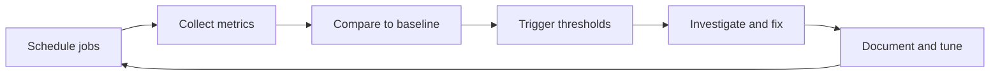

# Scheduling, Monitoring, and Performance

## Why this matters
Operations work is about consistency: run the right tasks at the right time, observe system health, and react before users notice problems. In Linux, this means combining:

- **Schedulers** (`cron`, `at`, `systemd timers`)
- **Resource monitoring** (CPU, memory, I/O)
- **Baselines and thresholds** (know normal vs abnormal)
- **Routine checks** (daily/weekly operational discipline)

---

## 1) Job scheduling with `cron`

`cron` runs recurring jobs based on a time expression.

### Cron format

```text
* * * * * command
- - - - -
| | | | |
| | | | +---- day of week (0-7, Sunday is 0 or 7)
| | | +------ month (1-12)
| | +-------- day of month (1-31)
| +---------- hour (0-23)
+------------ minute (0-59)
```

### Common cron commands

```bash
# Edit current user's crontab
crontab -e

# List current user's cron jobs
crontab -l

# Remove current user's crontab
crontab -r

# View system cron config
cat /etc/crontab
ls -1 /etc/cron.d/
ls -1 /etc/cron.daily /etc/cron.weekly /etc/cron.monthly
```

### Useful cron examples

```cron
# Run backup script every day at 02:30
30 2 * * * /usr/local/bin/backup.sh

# Run health check every 5 minutes
*/5 * * * * /usr/local/bin/health-check.sh

# Run every Monday at 06:00
0 6 * * 1 /usr/local/bin/weekly-report.sh
```

### Cron best practices

- Use **absolute paths** for commands and files.
- Set environment explicitly when needed (`PATH`, `SHELL`).
- Redirect output to logs for debugging.
- Keep scripts idempotent (safe if run more than once).

```cron
*/10 * * * * /usr/local/bin/sync.sh >> /var/log/sync.log 2>&1
```

### Mini-lab: Create and verify a cron health job

1. Create script:
   ```bash
   sudo tee /usr/local/bin/cron-health.sh >/dev/null <<'SCRIPT'
   #!/usr/bin/env bash
   date '+%F %T cron health ok' >> /tmp/cron-health.log
   SCRIPT
   sudo chmod +x /usr/local/bin/cron-health.sh
   ```
2. Add to crontab:
   ```bash
   crontab -e
   # Add:
   */2 * * * * /usr/local/bin/cron-health.sh
   ```
3. Verify after a few minutes:
   ```bash
   tail -n 5 /tmp/cron-health.log
   ```

---

## 2) One-time scheduling with `at`

Use `at` for one-off jobs in the future (unlike recurring `cron` jobs).

### Basic `at` usage

```bash
# Ensure at daemon is running
sudo systemctl status atd

# Schedule a command for a specific time
echo "/usr/local/bin/run-once.sh" | at 14:30

# Relative time examples
echo "reboot" | at now + 10 minutes
echo "tar -czf /tmp/home.tgz /home" | at now + 1 hour

# List queued jobs
atq

# Inspect a queued job
at -c <job_id>

# Remove queued job
atrm <job_id>
```

### `batch` mode

`batch` runs jobs when system load is low.

```bash
echo "updatedb" | batch
```

### Mini-lab: Schedule and cancel a one-time job

1. Queue a test job:
   ```bash
   echo "date >> /tmp/at-lab.log" | at now + 2 minutes
   atq
   ```
2. Cancel it:
   ```bash
   atrm <job_id_from_atq>
   atq
   ```
3. Queue again and confirm execution:
   ```bash
   echo "date >> /tmp/at-lab.log" | at now + 1 minute
   sleep 80
   tail -n 5 /tmp/at-lab.log
   ```

---

## 3) Modern scheduling with `systemd` timers

`systemd` timers are a robust alternative to cron:

- Better logging via `journalctl`
- Unit dependencies (`After=network-online.target`)
- Missed-run catch-up with `Persistent=true`
- Unified management with `systemctl`

### Minimal timer setup

Create a service unit:

`/etc/systemd/system/cleanup.service`

```ini
[Unit]
Description=Cleanup temp files

[Service]
Type=oneshot
ExecStart=/usr/local/bin/cleanup-temp.sh
```

Create a timer unit:

`/etc/systemd/system/cleanup.timer`

```ini
[Unit]
Description=Run cleanup every 15 minutes

[Timer]
OnCalendar=*:0/15
Persistent=true
Unit=cleanup.service

[Install]
WantedBy=timers.target
```

Enable and verify:

```bash
sudo systemctl daemon-reload
sudo systemctl enable --now cleanup.timer
systemctl list-timers --all | grep cleanup
journalctl -u cleanup.service -n 20 --no-pager
```

### Common timer expressions

```ini
OnCalendar=daily
OnCalendar=Mon..Fri 09:00
OnCalendar=*-*-01 03:00:00
OnBootSec=5min
OnUnitActiveSec=30min
```

### Mini-lab: Build a timer-backed heartbeat

1. Create script:
   ```bash
   sudo tee /usr/local/bin/timer-heartbeat.sh >/dev/null <<'SCRIPT'
   #!/usr/bin/env bash
   echo "$(date '+%F %T') timer heartbeat" >> /tmp/timer-heartbeat.log
   SCRIPT
   sudo chmod +x /usr/local/bin/timer-heartbeat.sh
   ```
2. Create `heartbeat.service` and `heartbeat.timer` under `/etc/systemd/system/`.
3. Start timer and validate:
   ```bash
   sudo systemctl daemon-reload
   sudo systemctl enable --now heartbeat.timer
   systemctl list-timers --all | grep heartbeat
   tail -n 5 /tmp/timer-heartbeat.log
   ```

---

## 4) Resource monitoring basics (CPU, memory, I/O)

### CPU monitoring

```bash
# Load averages and uptime
uptime
cat /proc/loadavg

# Live process CPU usage
top

# Per-CPU stats (sysstat package)
mpstat -P ALL 1 5

# CPU + run queue + context switching
vmstat 1 5
```

What to watch:

- High `%us` (user CPU): application-heavy load
- High `%sy` (system CPU): kernel/syscall/network/storage overhead
- High load average + long run queue: CPU contention
- High `%wa`: CPU waiting on I/O

### Memory monitoring

```bash
# Human-readable memory summary
free -h

# Detailed memory counters
grep -E 'MemTotal|MemFree|MemAvailable|SwapTotal|SwapFree' /proc/meminfo

# Paging/swap behavior over time
vmstat 1 5

# Historical memory trends (if sysstat enabled)
sar -r 1 5
```

What to watch:

- `MemAvailable` trending down for long periods
- Growing swap usage and swap-in/swap-out (`si/so` in `vmstat`)
- OOM kills in logs:

```bash
journalctl -k | grep -i -E 'oom|out of memory'
```

### I/O monitoring

```bash
# Disk capacity
df -h

# Directory growth drill-down
du -xh /var | sort -h | tail -n 20

# Block device I/O stats (sysstat)
iostat -xz 1 5

# Per-process I/O (requires root)
sudo iotop -o
```

What to watch:

- High `%util` and high await/latency on disks (`iostat`)
- Rapid disk consumption (`df -h` trending to full)
- Processes causing sustained write/read pressure (`iotop`)

### Mini-lab: Spot the bottleneck quickly

Run these in sequence:

```bash
uptime
vmstat 1 5
free -h
iostat -xz 1 3
df -h
```

Then decide:

- CPU bottleneck? (high run queue, high CPU)
- Memory pressure? (low available memory, swap activity)
- I/O bottleneck? (high disk wait and utilization)

---

## 5) Baselines: define “normal” first

Without a baseline, alerts are noise. Build a baseline during known-good periods.

### Baseline checklist

Capture at least:

- CPU: load average, `%us/%sy/%wa`, top CPU processes
- Memory: `MemAvailable`, swap usage, paging behavior
- I/O: disk `%util`, await latency, filesystem usage
- Timing context: business hours vs off-hours

### Simple baseline capture commands

```bash
# Snapshot file with timestamp
TS=$(date +%F_%H%M%S)
mkdir -p ~/ops-baseline
{
  echo "=== uptime ==="; uptime
  echo "=== vmstat ==="; vmstat 1 5
  echo "=== free ==="; free -h
  echo "=== iostat ==="; iostat -xz 1 3
  echo "=== df ==="; df -h
} > ~/ops-baseline/baseline_$TS.txt
```

Repeat daily for 1-2 weeks to see patterns and seasonality.

---

## 6) Threshold alerting basics

Thresholds convert observations into actionable alerts.

### Good threshold design

- Start with conservative static thresholds.
- Add durations to avoid flapping (e.g., "for 5 minutes").
- Separate warning and critical levels.
- Alert on user impact indicators first.

### Example starter thresholds

- CPU load average > number of vCPUs for 10 minutes
- `MemAvailable` < 10% for 5 minutes
- Disk usage > 85% (warning), > 95% (critical)
- Disk await latency above normal baseline by 2x+

### Lightweight local alert script example

```bash
#!/usr/bin/env bash
# /usr/local/bin/basic-alert-check.sh
set -euo pipefail

warn=false

# Disk threshold check
used_pct=$(df -P / | awk 'NR==2 {gsub("%",""); print $5}')
if [ "$used_pct" -ge 85 ]; then
  logger -p user.warning "ALERT: root filesystem at ${used_pct}%"
  warn=true
fi

# Memory threshold check
avail_mb=$(free -m | awk '/Mem:/ {print $7}')
if [ "$avail_mb" -lt 500 ]; then
  logger -p user.warning "ALERT: low available memory ${avail_mb}MB"
  warn=true
fi

$warn && exit 1 || exit 0
```

Schedule via cron or systemd timer, then feed logs to central monitoring later.

### Mini-lab: Trigger a safe threshold test

1. Run the script manually:
   ```bash
   sudo /usr/local/bin/basic-alert-check.sh; echo $?
   ```
2. Read warnings:
   ```bash
   journalctl -p warning -n 20 --no-pager
   ```
3. Temporarily lower a threshold in a lab VM to force a warning and verify pipeline end-to-end.

---

## 7) Routine operations checks

Consistency beats heroics. Use repeatable daily/weekly checks.

### Daily quick checks (5-10 min)

```bash
# Failed services
systemctl --failed

# Recent critical/warning logs
journalctl -p 0..4 -n 100 --no-pager

# Capacity and load
df -h
free -h
uptime

# Scheduled jobs status
systemctl list-timers --all | head -n 20
crontab -l
```

### Weekly checks

- Review growth trends (`/var`, logs, backups).
- Confirm backup jobs completed and restores are testable.
- Check package/security updates and reboot requirements.
- Tune thresholds based on observed baseline shifts.

### Monthly checks

- Validate monitoring coverage for new services.
- Retire noisy alerts and add missing high-signal alerts.
- Re-baseline after major architecture or workload changes.

---

## 8) Ops loop (continuous improvement)



---

## 9) Command cheat sheet

```bash
# Cron
crontab -e
crontab -l

# at
atq
atrm <job_id>

# systemd timers
systemctl list-timers --all
journalctl -u <service>.service --no-pager

# CPU / memory / I/O
uptime
top
vmstat 1 5
free -h
iostat -xz 1 5
df -h
iotop -o
```

If you build good schedules, collect meaningful metrics, and maintain baselines, performance work becomes predictable instead of reactive.
