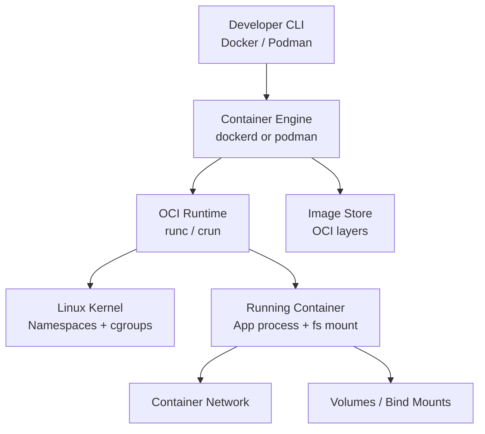

# Containers and Virtualization Basics

## Learning goals
By the end of this note, you should be able to:
- Explain the difference between virtualization and containers.
- Describe images vs containers and how runtimes use them.
- Use basic Docker and Podman commands to build, run, inspect, and remove containers.
- Work with container lifecycle, networks, and volumes.
- Apply basic container security hygiene in day-to-day usage.

---

## 1) Virtualization vs Containers

### Virtualization (VMs)
A **virtual machine (VM)** emulates a full computer. Each VM includes:
- Virtual hardware (CPU, memory, disk, NIC)
- Its own guest operating system
- Applications on top of that OS

A **hypervisor** (KVM, VMware, Hyper-V, etc.) manages VMs.

**Strengths:**
- Strong isolation boundary
- Can run different OS kernels (Linux host, Windows guest, etc.)
- Good for legacy apps and mixed OS workloads

**Tradeoffs:**
- Larger footprint (GB-level images)
- Slower startup (seconds to minutes)
- More overhead per workload

### Containers
A **container** packages an app + dependencies, but shares the host kernel.
Isolation is provided by Linux features like:
- **Namespaces** (process, network, mount isolation)
- **cgroups** (resource limits/accounting)
- **Capabilities/seccomp/AppArmor/SELinux** (privilege restrictions)

**Strengths:**
- Lightweight (often MB-level images)
- Fast startup (sub-second to seconds)
- Great for microservices, CI, reproducible dev environments

**Tradeoffs:**
- Weaker isolation than VMs by default
- Usually same-kernel-family requirement
- Misconfiguration can introduce security risk

### Quick comparison

| Topic | Virtual Machines | Containers |
|---|---|---|
| Isolation unit | Full OS instance | Process(s) |
| Kernel | Per-VM kernel | Shared host kernel |
| Startup | Slower | Faster |
| Resource overhead | Higher | Lower |
| Typical size | Larger | Smaller |
| Best for | Strong isolation, mixed OS | App packaging, scalable services |

---

## 2) Container runtime architecture (high-level)



Notes:
- **Docker** usually uses a daemon (`dockerd`).
- **Podman** is daemonless and supports rootless mode well.
- Both can run OCI-compatible images.

---

## 3) Image vs Container basics

### Image
A **container image** is a read-only template (layers + metadata).
- Built from a `Dockerfile` or `Containerfile`
- Includes filesystem, app binaries, libraries, and defaults
- Tagged like `nginx:1.27` or `myapp:dev`

### Container
A **container** is a running (or stopped) instance of an image.
- Adds a writable layer on top of image layers
- Has runtime config (env vars, ports, network, limits)
- Ephemeral unless data is persisted with volumes/bind mounts

Think of it as:
- **Image = class/template**
- **Container = object/instance**

### Registry
A **registry** stores and distributes images (Docker Hub, GHCR, Quay, private registries).

Common flow:
1. Build image
2. Tag image
3. Push to registry
4. Pull image elsewhere
5. Run container

---

## 4) Docker and Podman basics

Most commands are very similar.

### Check installation and info
```bash
docker --version
docker info

podman --version
podman info
```

### Pull and run your first container
```bash
# Docker
docker pull hello-world
docker run --rm hello-world

# Podman
podman pull hello-world
podman run --rm hello-world
```

### Run interactive shell in a container
```bash
# Docker
docker run --rm -it ubuntu:24.04 bash

# Podman
podman run --rm -it ubuntu:24.04 bash
```

### Run in background (detached)
```bash
# Start NGINX exposing host port 8080 -> container 80
docker run -d --name web -p 8080:80 nginx:alpine
# or
podman run -d --name web -p 8080:80 nginx:alpine

# Verify
curl -I http://127.0.0.1:8080
```

---

## 5) Container lifecycle commands

### Create / Start / Stop / Restart
```bash
# Create without starting
docker create --name demo alpine:3.20 sleep 600

# Start
docker start demo

# Stop gracefully
docker stop demo

# Restart
docker restart demo
```

Podman equivalents:
```bash
podman create --name demo alpine:3.20 sleep 600
podman start demo
podman stop demo
podman restart demo
```

### List and inspect
```bash
docker ps          # running
docker ps -a       # all states
docker logs web
docker inspect web

docker top web     # processes
docker stats       # live resource usage
```

### Execute command inside running container
```bash
docker exec -it web sh
# or with podman:
podman exec -it web sh
```

### Remove
```bash
docker rm demo
# force remove if still running
docker rm -f web

# remove dangling/unused resources carefully
docker system prune
```

---

## 6) Build images (Dockerfile / Containerfile)

Example minimal file:

```Dockerfile
FROM python:3.12-slim
WORKDIR /app
COPY requirements.txt .
RUN pip install --no-cache-dir -r requirements.txt
COPY . .
EXPOSE 8000
CMD ["python", "app.py"]
```

Build and tag:
```bash
docker build -t myapp:0.1 .
# or
podman build -t myapp:0.1 .
```

Run it:
```bash
docker run --rm -p 8000:8000 myapp:0.1
```

Tag + push:
```bash
docker tag myapp:0.1 ghcr.io/<user>/myapp:0.1
docker push ghcr.io/<user>/myapp:0.1
```

---

## 7) Networks and volumes

## Network basics
By default, containers get isolated networking and can be published to host ports.

### Port publishing
```bash
# host:container
docker run -d --name api -p 8080:3000 myapi:latest
```

### User-defined bridge network (service-to-service DNS)
```bash
docker network create app-net
docker run -d --name db --network app-net postgres:16
docker run -d --name api --network app-net myapi:latest
```

Now `api` can often reach `db` by container name (`db`) on that network.

Podman:
```bash
podman network create app-net
podman run -d --name db --network app-net postgres:16
podman run -d --name api --network app-net myapi:latest
```

## Volume basics
Containers are ephemeral; volumes persist data.

### Named volume
```bash
docker volume create pgdata
docker run -d --name db -e POSTGRES_PASSWORD=secret -v pgdata:/var/lib/postgresql/data postgres:16
```

### Bind mount (host path)
```bash
docker run --rm -it -v "$PWD":/workspace -w /workspace alpine:3.20 sh
```

Use bind mounts for local dev; use named volumes for managed persistence.

---

## 8) Basic container security hygiene

1. **Use trusted base images**
   - Prefer official/minimal images (`alpine`, `distroless`, slim variants)
   - Pin versions/tags (`nginx:1.27-alpine`), avoid only `latest`

2. **Run as non-root inside container**
   - In Dockerfile: create/use non-root `USER`
   - Prefer rootless Podman/Docker when possible

3. **Drop unnecessary privileges**
```bash
docker run --cap-drop ALL --cap-add NET_BIND_SERVICE ...
```

4. **Use read-only root filesystem when possible**
```bash
docker run --read-only --tmpfs /tmp ...
```

5. **Limit resources**
```bash
docker run --memory=512m --cpus=1.0 ...
```

6. **Do not bake secrets into images**
   - Use env files, secret managers, orchestrator secrets
   - Never commit credentials into Dockerfile or source

7. **Scan images regularly**
   - Docker Scout, Trivy, Grype, registry scanning

8. **Keep images small and patched**
   - Rebuild frequently to pull security updates
   - Remove build tools from runtime images (multi-stage builds)

9. **Use security profiles**
   - seccomp/AppArmor/SELinux defaults should remain enabled unless needed

---

## 9) Practical labs

## Lab 1: VM mindset vs container mindset
Goal: feel container speed/ephemerality.

Steps:
1. Run temporary shell:
   ```bash
   docker run --rm -it alpine:3.20 sh
   ```
2. Inside container, create a file in `/tmp`, exit.
3. Run again and verify file is gone.
4. Discuss: container writable layer is ephemeral unless persisted.

## Lab 2: Build and run a simple web app image
Goal: build your own image.

Steps:
1. Create `Dockerfile` for a tiny app.
2. Build image:
   ```bash
   docker build -t web-demo:1.0 .
   ```
3. Run and publish:
   ```bash
   docker run --rm -p 8080:8000 web-demo:1.0
   ```
4. Test with `curl http://127.0.0.1:8080`.

## Lab 3: Persistent database with volume
Goal: prove data persistence across container recreation.

Steps:
1. Create volume and run PostgreSQL:
   ```bash
   docker volume create pgdata-lab
   docker run -d --name pg1 -e POSTGRES_PASSWORD=secret -v pgdata-lab:/var/lib/postgresql/data postgres:16
   ```
2. Insert sample data.
3. Remove container, create a new one using same volume.
4. Verify data still exists.

## Lab 4: Basic hardening run profile
Goal: run container with reduced privileges.

```bash
docker run --rm -d \
  --name hardened-nginx \
  --read-only \
  --cap-drop ALL \
  --cap-add NET_BIND_SERVICE \
  --memory 256m \
  --cpus 0.5 \
  -p 8081:80 nginx:1.27-alpine
```

Verify it serves traffic, then inspect and explain each hardening flag.

---

## 10) Quick command cheat sheet

```bash
# Images
docker pull IMAGE
docker images
docker build -t NAME:TAG .
docker rmi IMAGE

# Containers
docker run [opts] IMAGE [cmd]
docker ps -a
docker logs CONTAINER
docker exec -it CONTAINER sh
docker stop CONTAINER && docker rm CONTAINER

# Networking/Storage
docker network ls
docker volume ls
```

Podman mostly mirrors this (`podman ...`).

---

## Summary
- VMs virtualize full machines; containers virtualize at the OS/process level.
- Images are immutable templates; containers are runtime instances.
- Docker and Podman share core workflows: pull, run, build, inspect, remove.
- Real-world usage requires understanding lifecycle, networking, and persistent storage.
- Security hygiene (non-root, least privilege, pinned images, scanning, limits) is foundational.
