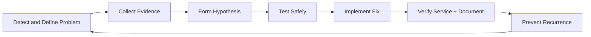

# Troubleshooting Capstone and Next Steps

## Why this final note matters
You now have the foundations: shell fluency, filesystem control, users/permissions, software management, networking, and process/service/log operations. This final note is about operating like a real admin: solving problems methodically, documenting clearly, and planning your next growth path.

---

## 1) Structured troubleshooting method
Use a repeatable cycle so you avoid random fixes and reduce downtime.

### The cycle

### Practical workflow (operator checklist)
1. **Define the symptom clearly**
   - What is broken?
   - Who is affected?
   - Since when?
   - What changed?
2. **Collect evidence before changing anything**
   - Service status: `systemctl status <service>`
   - Recent logs: `journalctl -u <service> -n 100 --no-pager`
   - Resource pressure: `top`, `free -h`, `df -h`, `iostat`
   - Connectivity: `ip a`, `ss -tulpn`, `ping`, `curl`
3. **Form one hypothesis at a time**
   - Example: “Service failed because config syntax is invalid.”
4. **Test the hypothesis with least-risk action**
   - Validate config first, then reload/restart.
5. **Apply fix in controlled way**
   - Prefer reversible changes.
   - Keep rollback path ready.
6. **Verify at multiple layers**
   - Process healthy, port listening, endpoint responding, user workflow restored.
7. **Capture the lesson**
   - Root cause, fix, prevention, runbook update.

### Rules that prevent chaos
- Change **one variable at a time**.
- Keep timestamps and commands in a live incident log.
- Don’t trust assumptions; verify with command output.
- If impact is high, communicate before risky actions.

---

## 2) Runbook discipline (from heroics to reliability)
A runbook turns personal experience into team capability.

### Minimum runbook template
- **Title / system / owner**
- **Purpose and scope**
- **Prerequisites and access level**
- **Detection signals** (alerts, logs, symptoms)
- **Diagnostic steps** (ordered, copy-paste safe)
- **Decision points** (if X -> do Y)
- **Recovery actions**
- **Verification checks**
- **Rollback procedure**
- **Escalation path**
- **Post-incident notes**

### Discipline standards
- Write commands exactly as they should be run.
- Mark destructive commands clearly (`rm`, firewall, partitioning, user changes).
- Keep procedures versioned and dated.
- Test runbooks in a lab, not first in production.
- Update runbooks after every incident or near-miss.

---

## 3) Capstone scenario design
Your capstone should simulate real operations, not isolated command trivia.

### Scenario design principles
- **Realistic**: include dependencies (service + network + permissions + storage).
- **Observable**: provide logs, metrics, and state clues.
- **Progressive**: easy symptom, deeper cause.
- **Constrained**: define time, tools, and change limits.
- **Evaluable**: objective success criteria.

### Build scenarios with this frame
1. **Context**: what system is this?
2. **Trigger**: what changed or failed?
3. **Symptoms**: what users/monitoring see?
4. **Hidden cause**: underlying technical reason.
5. **Allowed actions**: what learner can modify.
6. **Success criteria**: measurable recovery outcomes.
7. **Reflection prompts**: what to improve next time.

---

## 4) Verification and documentation standards
Fixing is not done until it is verified and recorded.

### Verification checklist
- Service state is `active (running)` where expected.
- Startup behavior confirmed (reboot/persistent checks if relevant).
- Functional test passes (CLI/API/UI path).
- No new errors in logs after fix window.
- Security posture unchanged or improved (permissions/firewall/secrets).
- Performance baseline acceptable (latency, CPU, memory, disk).

### Documentation checklist
- Incident timeline with UTC/local timestamp consistency.
- Commands executed and outputs summarized.
- Root cause classification (config, permissions, resource, network, dependency).
- Corrective action and preventive action separated.
- Runbook/monitoring updates listed.
- Short handoff summary for the next operator.

---

## 5) Capstone exercises (5) with expected outcomes

| # | Capstone exercise | What you must do | Expected outcome |
|---|---|---|---|
| 1 | **Service won’t start after config change** | Diagnose failed unit, validate config, fix syntax/paths, restart safely, verify endpoint. | Service reaches stable running state, health check succeeds, and postmortem notes include the exact bad line and prevention step. |
| 2 | **Disk space incident on `/var`** | Identify growth source (`du`, logs, cache), reclaim safely, implement log rotation or retention fix. | `/var` free space returns above target threshold, service errors stop, and retention policy is documented and tested. |
| 3 | **Permission regression after deployment** | Trace UID/GID/ACL mismatch, correct ownership/mode/ACL, confirm least privilege. | Application regains access without over-permissive shortcuts (`777` avoided), and permission model is documented in runbook. |
| 4 | **Intermittent network reachability** | Validate local stack, routing, DNS, firewall rules, listening sockets, and service binding behavior. | Connectivity is stable across repeated tests, root cause is isolated (DNS/firewall/bind/routing), and monitoring alert condition is refined. |
| 5 | **High CPU with user-facing slowdown** | Identify hot process, correlate logs and load, apply remediation (config tuning/restart/limit), and verify performance. | CPU utilization normalizes, response time improves to defined SLO, and a proactive alert or capacity recommendation is added. |

---

## 6) Next learning roadmap (RHCSA / LPI / DevOps)

### Track A: RHCSA-focused (hands-on RHEL operations)
- Prioritize: systemd, storage (LVM), SELinux, networking, users, scheduled tasks.
- Practice style: timed labs with only terminal access.
- Output goal: recover broken systems quickly with correct Red Hat workflows.

### Track B: LPI Linux path (breadth + admin depth)
- Prioritize: GNU/Linux commands, boot process, package management, scripting basics, networking, security.
- Practice style: mixed distro labs (Debian + RHEL families).
- Output goal: strong cross-distro understanding and exam-ready theory + practice balance.

### Track C: DevOps progression (automation + platform reliability)
- Add next: Git workflows, Bash/Python automation, CI/CD basics, containers, IaC fundamentals, monitoring/observability.
- Practice style: “operate then automate” (do manually once, script it second).
- Output goal: reproducible operations, faster incident response, lower toil.

### Suggested 12-week progression
- **Weeks 1-4:** Linux hardening + troubleshooting repetition (daily short drills).
- **Weeks 5-8:** Certification-focused labs (RHCSA or LPI objectives).
- **Weeks 9-12:** DevOps integration project (service + pipeline + monitoring + incident runbook).

---

## Final conclusion
The real milestone is not memorizing commands; it is building a **calm, evidence-driven operating habit**. If you can troubleshoot with structure, execute with runbook discipline, verify thoroughly, and document clearly, you are already thinking like a production engineer. Keep practicing capstones under constraints, then channel that momentum into RHCSA/LPI and DevOps automation.
