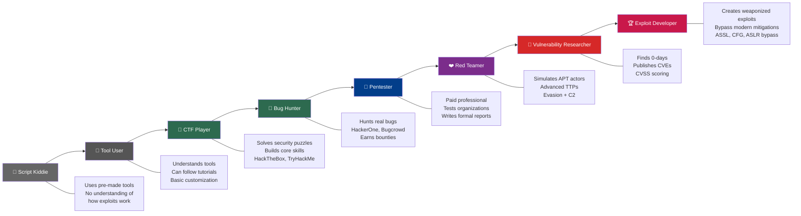
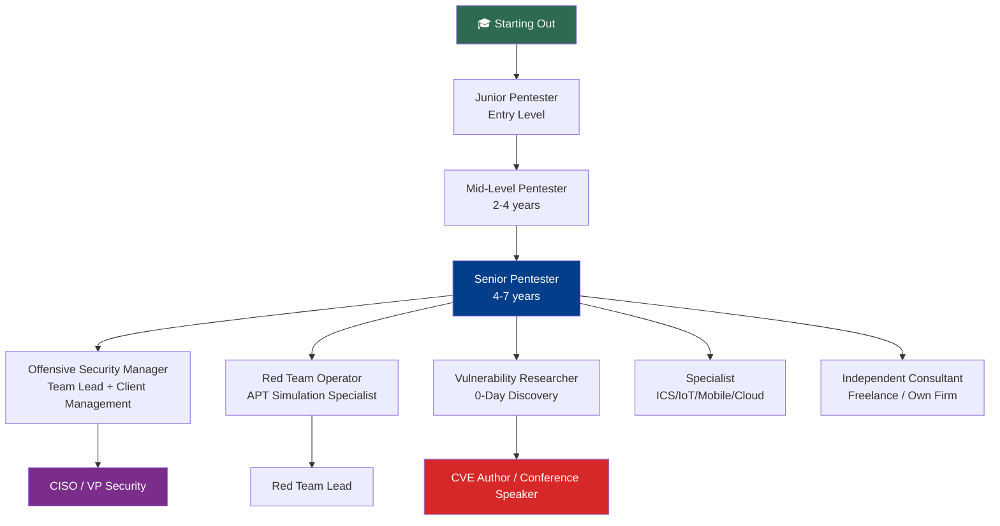
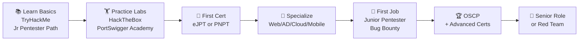

# Ethical Hacking vs Penetration Testing

> **Difficulty:** Beginner → Advanced | **Category:** Penetration Testing — Fundamentals

"Ethical hacking," "penetration testing," "red teaming," and "bug bounty hunting" are terms thrown around interchangeably — but they mean very different things. This note defines each precisely, compares them across every meaningful dimension, maps the hacker spectrum from script kiddie to researcher, and charts career paths in offensive security.

---

## Table of Contents
1. [Core Definitions](#1-core-definitions)
2. [The Full Comparison Table](#2-the-full-comparison-table)
3. [The Hacker Spectrum](#3-the-hacker-spectrum)
4. [Certifications — What Each Is Worth](#4-certifications--what-each-is-worth)
5. [Career Paths in Offensive Security](#5-career-paths-in-offensive-security)
6. [Skills Matrix](#6-skills-matrix)
7. [Getting Started — The Practical Path](#7-getting-started--the-practical-path)

---

## 1. Core Definitions

### Ethical Hacking

**Ethical hacking** is the broadest umbrella term — it refers to any authorized attempt to probe systems for security weaknesses using the same techniques and tools as a malicious hacker, but with permission and for defensive purposes.

The term was popularized by **John Patrick** of IBM in the 1990s and is now widely used in corporate and academic settings. Ethical hacking encompasses:
- Penetration testing
- Red teaming
- Vulnerability research
- CTF (Capture the Flag) competition
- Security tool development

> **Note:** "Ethical hacker" is a job title and a mindset, not a specific methodology. It simply means a hacker who operates within legal and ethical boundaries.

### Penetration Testing

**Penetration testing** is a *specific, time-boxed, methodical engagement* where a tester attempts to find and exploit vulnerabilities in a defined scope, then documents findings in a formal report.

Key characteristics:
- Fixed scope, fixed timeline
- Aims for comprehensive coverage of the attack surface
- Output is a detailed written report
- Often compliance-driven (PCI-DSS, SOC 2, etc.)

### Red Teaming

**Red teaming** is an *objective-driven adversarial simulation* that mimics a real advanced persistent threat (APT) actor. Unlike pentesting, red teams operate with minimal noise, avoid detection, and pursue specific goals (e.g., "reach the finance database").

Key characteristics:
- Goal-oriented, not comprehensive
- Emphasizes stealth and evasion
- Can last weeks to months
- Tests detection and response capability (blue team)
- Based on specific threat actor TTPs (MITRE ATT&CK)

### Bug Bounty Hunting

**Bug bounty hunting** is the practice of independently testing an organization's public-facing systems under their bug bounty program, finding vulnerabilities, and receiving monetary rewards.

Key characteristics:
- Self-directed (no formal engagement)
- Competitive (other researchers find same bugs)
- Scope defined by program (Hall of Fame / monetary tiers)
- No formal report — submit tickets through platform
- Common platforms: HackerOne, Bugcrowd, Intigriti, Synack

### Purple Teaming

**Purple teaming** is a *collaborative exercise* where offensive (red) and defensive (blue) teams work together — the red team executes attacks while the blue team simultaneously tunes detection and response.

---

## 2. The Full Comparison Table

| Dimension | Ethical Hacking (General) | Penetration Testing | Red Teaming | Bug Bounty | Purple Teaming |
|-----------|--------------------------|---------------------|-------------|------------|----------------|
| **Authorization** | Required | Written contract | Written contract | Program terms | Written contract |
| **Scope** | Varies | Fixed and documented | Goal-defined, flexible | Program-defined | Scenario-defined |
| **Objective** | Find weaknesses | Comprehensive vuln discovery + exploitation | Simulate APT, test detection | Find specific bugs | Improve detect/response |
| **Timeline** | Varies | Days to weeks | Weeks to months | Ongoing | Days to weeks |
| **Stealth required** | No | No (noisy is fine) | Yes — critical | No | No |
| **Report format** | Informal to formal | Formal technical report | Executive narrative + TTPs | Platform ticket | Detection improvement plan |
| **Blue team awareness** | Varies | Usually informed (unless assumed-breach) | Usually unaware (blind) | N/A | Fully aware and participating |
| **Coverage** | Varies | Broad — full attack surface | Narrow — specific objective path | Ad-hoc | Scenario-specific |
| **Compliance value** | Low | High (PCI, HIPAA, SOC2) | Medium | Low | Medium |
| **Cost** | Low–High | Medium–High ($$$) | Very High ($$$$) | Varies (pay per bug) | Medium–High |
| **Skill level required** | Low–Expert | Intermediate–Expert | Expert | Varies | Expert |
| **MITRE ATT&CK usage** | Optional | Optional | Core | Optional | Core |
| **Real-world APT simulation** | Partial | Partial | Full | No | Partial |
| **Output audience** | Self | Engineers + management | CISO + Board | Security team | Blue team |

---

## 3. The Hacker Spectrum



### Spectrum Breakdown

#### 🔰 Script Kiddie
- Runs downloaded tools without understanding them
- No ability to adapt when default approaches fail
- Typically attacks opportunistically (not targeted)
- Often caught quickly due to noisy, indiscriminate techniques

#### 🧰 Tool User / Hobbyist
- Understands what tools do, can configure them
- Follows security blogs, YouTube tutorials
- Has not yet built deep technical foundations

#### 🎯 CTF Player
- Actively practices on intentionally vulnerable platforms
- Builds skills in: web exploitation, reverse engineering, forensics, cryptography, pwn (binary exploitation)
- Develops systematic problem-solving approach
- Best starting point for aspiring professionals

**Recommended Practice Platforms:**
```
HackTheBox         → Real-world style machines (beginner to insane)
TryHackMe          → Guided learning paths, structured labs
PicoCTF            → Beginner-focused CTF
pwn.college        → Binary exploitation focus
DVWA               → Damn Vulnerable Web Application (self-hosted)
VulnHub            → Downloadable vulnerable VMs
PortSwigger Labs   → Best web app security labs in existence
```

#### 🐛 Bug Bounty Hunter
- Systematically tests real-world applications within program scope
- Earns money discovering real vulnerabilities in live systems
- Competitive — may share a finding with dozens of other hunters
- Top earners: $100K–$2M+ per year from bounties alone

#### 🔐 Penetration Tester (Professional)
- Contracted by organizations to test specific assets
- Produces formal deliverables (reports, executive summaries)
- Must manage client communication professionally
- Follows structured methodologies (PTES, OWASP, NIST)

#### ❤️ Red Teamer
- Simulates specific threat actors
- Uses advanced TTPs: C2 frameworks, living off the land, custom malware
- Operates against fully defended environments with EDR, SIEM, SOC
- Key skill: **bypassing modern defenses** without detection

#### 🔬 Vulnerability Researcher
- Discovers previously unknown (0-day) vulnerabilities
- Works in academia, government, private research firms (Zerodium, Google Project Zero)
- Deep expertise in specific technologies (browsers, kernels, hypervisors)
- Publishes CVEs, writes advisories, presents at DEF CON / Black Hat

#### 🏆 Exploit Developer
- Turns vulnerabilities into reliable, weaponized exploits
- Must bypass modern mitigations: ASLR, DEP/NX, Stack Canaries, CFG, CET
- Writes custom shellcode, ROP chains, heap grooming
- Extremely rare skill set; commands highest compensation

---

## 4. Certifications — What Each Is Worth

### Entry Level

| Certification | Issuer | Format | Cost | Practical? | Industry Respect |
|--------------|--------|--------|------|-----------|-----------------|
| **CompTIA Security+** | CompTIA | MCQ exam | ~$370 | No | Medium (entry HR filter) |
| **eJPT** | eLearnSecurity (INE) | Practical lab exam | ~$200 | Yes | Medium (solid starter) |
| **CompTIA PenTest+** | CompTIA | MCQ + practical | ~$370 | Partial | Low–Medium |

### Intermediate Level

| Certification | Issuer | Format | Cost | Practical? | Industry Respect |
|--------------|--------|--------|------|-----------|-----------------|
| **CEH** | EC-Council | MCQ exam | $950–$1,900 | No | Medium (common HR req, theory-heavy) |
| **PNPT** | TCM Security | 5-day practical pentest + report | $399 | Yes | High (highly practical, respected by practitioners) |
| **GPEN** | SANS/GIAC | MCQ exam | $2,499–$7,000 | No | High (expensive but respected) |
| **eCPPT** | eLearnSecurity | Practical lab exam | ~$400 | Yes | Medium–High |

### Advanced Level

| Certification | Issuer | Format | Cost | Practical? | Industry Respect |
|--------------|--------|--------|------|-----------|-----------------|
| **OSCP** | Offensive Security | 24-hour practical exam | $1,499 | Yes | ⭐ Gold standard |
| **GXPN** | SANS/GIAC | MCQ + practical | $5,000+ | Partial | Very High |
| **CRTO** | Zero-Point Security | Practical (Cobalt Strike) | £399 | Yes | High (red team focus) |

### Expert Level

| Certification | Issuer | Focus | Cost | Practical? | Industry Respect |
|--------------|--------|-------|------|-----------|-----------------|
| **OSEP** | Offensive Security | Evasion + advanced ops | $1,499 | Yes | Very High |
| **OSED** | Offensive Security | Exploit development (Windows) | $1,499 | Yes | Exceptional |
| **OSMR** | Offensive Security | macOS research | $1,499 | Yes | Exceptional |
| **GREM** | SANS/GIAC | Malware reverse engineering | $5,000+ | Partial | Very High |

### Community Verdict

```
Best value starter:       eJPT → confirms you can actually hack
Best practical mid-level: PNPT → realistic engagement, real report
Industry gold standard:   OSCP → required for many senior roles
Red team specialists:     CRTO + OSEP
Exploit developers:       OSED + GREM
```

> **Note:** Certifications open doors; skills keep you there. A cert on your resume gets you past HR; how you perform in technical interviews and actual work determines career progression.

---

## 5. Career Paths in Offensive Security



### Role Deep Dives

#### Junior Penetration Tester
- **Experience:** 0–2 years
- **Common tasks:** Running scans, basic web app testing, report writing support, tool setup
- **Salary (US):** $60,000–$90,000
- **Salary (UK):** £35,000–£50,000
- **Key certs:** eJPT, CompTIA Sec+, PNPT

#### Mid-Level Penetration Tester
- **Experience:** 2–4 years
- **Common tasks:** Full solo engagements, complex web app + network testing, client communication
- **Salary (US):** $90,000–$130,000
- **Salary (UK):** £50,000–£70,000
- **Key certs:** OSCP, PNPT, eCPPT

#### Senior Penetration Tester
- **Experience:** 4–7 years
- **Common tasks:** Complex engagements (AD, cloud, IoT), junior mentoring, methodology development, custom exploit writing
- **Salary (US):** $130,000–$180,000
- **Salary (UK):** £70,000–£100,000
- **Key certs:** OSCP, GPEN, CRTO, OSEP

#### Red Team Operator
- **Experience:** 5+ years
- **Common tasks:** Full APT simulation, C2 infrastructure (Cobalt Strike/Sliver/Havoc), custom malware, EDR evasion, physical ops
- **Salary (US):** $140,000–$220,000
- **Salary (UK):** £80,000–£130,000
- **Key certs:** CRTO, OSEP, CRTE, CARTP

#### Vulnerability Researcher
- **Experience:** 5–10+ years
- **Common tasks:** Auditing codebases for 0-days, fuzzing, writing PoCs, CVE submission
- **Salary (US):** $150,000–$300,000+
- **Salary (UK):** £80,000–£150,000+
- **Notable employers:** Google Project Zero, Trend Micro ZDI, NSA, GCHQ, independent

### Compensation Comparison

| Role | US Average | UK Average | Remote? |
|------|-----------|-----------|---------|
| Junior Pentester | $75,000 | £42,000 | Sometimes |
| Mid-Level Pentester | $110,000 | £60,000 | Common |
| Senior Pentester | $155,000 | £85,000 | Common |
| Red Team Operator | $175,000 | £100,000 | Rare (clearance often needed) |
| Vuln Researcher | $220,000+ | £120,000+ | Sometimes |
| CISO | $250,000+ | £150,000+ | Rare |

---

## 6. Skills Matrix

### Technical Skills by Career Stage

| Skill Area | Junior | Mid | Senior | Red Team |
|-----------|--------|-----|--------|----------|
| Networking fundamentals | ✅ Required | ✅ | ✅ | ✅ |
| Linux command line | ✅ Required | ✅ | ✅ | ✅ |
| Windows internals | Partial | ✅ Required | ✅ | ✅ |
| Web app testing (OWASP) | ✅ Required | ✅ | ✅ | ✅ |
| Active Directory attacks | Basic | ✅ Required | ✅ | ✅ |
| Scripting (Python/Bash/PS) | Basic | ✅ Required | ✅ | ✅ |
| Custom exploit writing | ❌ | Basic | Good | ✅ Required |
| C2 framework operation | ❌ | Basic | Good | ✅ Required |
| Malware development | ❌ | ❌ | Optional | Advanced |
| Binary exploitation | ❌ | ❌ | Optional | Optional |
| Cloud security testing | Basic | Good | ✅ Required | Good |
| Report writing | Good | ✅ Required | ✅ Expert | ✅ Required |

### Learning Resources by Skill

```
Web Application Security:
  → PortSwigger Web Security Academy (FREE — best resource)
  → OWASP WSTG (free documentation)
  → HackTheBox (web challenges)

Active Directory:
  → TCM Security "Practical Ethical Hacking" course
  → HackTheBox Pro Labs (RastaLabs, Offshore)
  → TryHackMe "Jr Penetration Tester" path

Red Team / C2:
  → Zero-Point Security CRTO course (Cobalt Strike)
  → VX Underground (malware research community)
  → Cobalt Strike documentation

Binary Exploitation:
  → pwn.college (free, excellent)
  → Exploit Education (exploit.education)
  → LiveOverflow YouTube channel

Cloud Security:
  → CloudGoat by Rhino Security (intentionally vulnerable AWS)
  → flaws.cloud (S3 misconfiguration challenges)
  → AzureGoat, GCPGoat
```

---

## 7. Getting Started — The Practical Path

### The Recommended Progression



### 90-Day Starter Plan

| Week | Focus | Platform / Resource |
|------|-------|---------------------|
| 1–2 | Linux fundamentals, Networking basics | TryHackMe "Pre-Security" path |
| 3–4 | Web application basics, Burp Suite intro | TryHackMe "Jr Pentester" |
| 5–6 | Active Directory concepts | TCM Security courses |
| 7–8 | Practice machines (Easy) | HackTheBox |
| 9–10 | Web Academy labs | PortSwigger Web Security Academy |
| 11–12 | eJPT exam prep + take exam | INE/eLearnSecurity |

### Essential Free Resources

```
PortSwigger Web Security Academy  → https://portswigger.net/web-security
TryHackMe                          → https://tryhackme.com
HackTheBox                         → https://hackthebox.com
TCM Security (paid but affordable) → https://tcm-sec.com
OWASP WSTG                         → https://owasp.org/www-project-web-security-testing-guide/
MITRE ATT&CK                       → https://attack.mitre.org
GTFOBins                           → https://gtfobins.github.io
LOLBAS                             → https://lolbas-project.github.io
PayloadsAllTheThings               → https://github.com/swisskyrepo/PayloadsAllTheThings
HackTricks                         → https://book.hacktricks.xyz
```

---

> **Note:** The path from beginner to professional pentester typically takes 1–3 years of dedicated study and practice. The key differentiator isn't certification — it's hands-on problem-solving capability. Labs, CTFs, and bug bounties are the proving ground.

> **Warning:** The offensive security community has a low tolerance for those who apply skills without authorization. Reputation matters enormously. Never cross the line from authorized to unauthorized — careers have ended, and people have been prosecuted, for exactly this.
