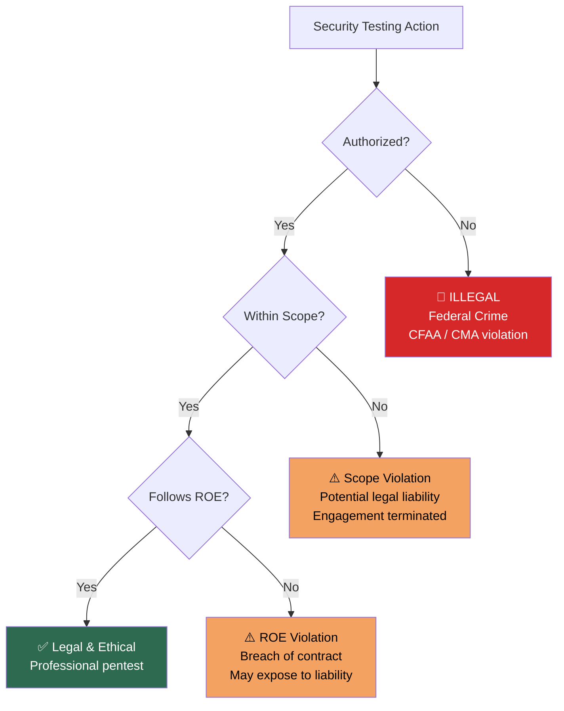
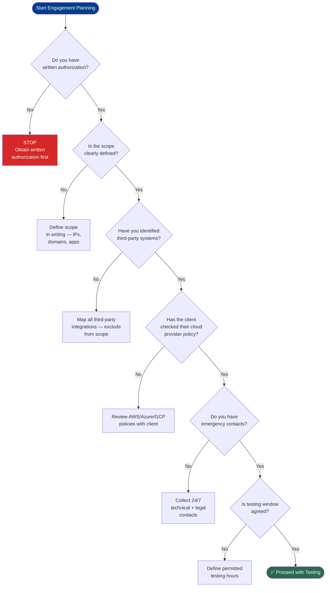

# Legal Considerations in Penetration Testing

> **Difficulty:** Beginner → Advanced | **Category:** Penetration Testing — Fundamentals

Legal awareness is not optional for penetration testers — it is the foundation of the entire profession. The same technical actions that make you a valued security professional can result in federal charges if performed without proper authorization. This note covers the key laws, real arrest cases, safe practice environments, and a complete pre-engagement legal checklist.

---

## Table of Contents
1. [Why Legal Knowledge is Non-Negotiable](#1-why-legal-knowledge-is-non-negotiable)
2. [Key Laws by Jurisdiction](#2-key-laws-by-jurisdiction)
3. [What "Unauthorized Access" Really Means](#3-what-unauthorized-access-really-means)
4. [Written Authorization Requirements](#4-written-authorization-requirements)
5. [Real Cases — Pentesters Arrested](#5-real-cases--pentesters-arrested)
6. [Safe Practice Environments](#6-safe-practice-environments)
7. [Cloud Provider Pentest Policies](#7-cloud-provider-pentest-policies)
8. [Bug Bounty Legal Scope](#8-bug-bounty-legal-scope)
9. [GDPR Implications for Pentesters](#9-gdpr-implications-for-pentesters)
10. [Before You Hack — Checklist](#10-before-you-hack--checklist)

---

## 1. Why Legal Knowledge is Non-Negotiable



**Key principle:** Authorization transforms hacking from a crime into a profession. Without it, there is no "ethical" in ethical hacking — it is simply unauthorized computer access, which is a criminal offense in virtually every jurisdiction worldwide.

The consequences of unauthorized access — even "accidentally" testing a system just outside scope — can include:
- Federal criminal charges (CFAA: up to 10–20 years for serious violations)
- Civil lawsuits from the victim organization
- Loss of security clearance
- Career-ending reputational damage
- Extradition (for international cases)

---

## 2. Key Laws by Jurisdiction

### United States — Computer Fraud and Abuse Act (CFAA)

The **Computer Fraud and Abuse Act (18 U.S.C. § 1030)** is the primary US federal cybercrime law, enacted in 1986 and significantly amended multiple times.

**Key provisions:**

| Section | Offense | Maximum Penalty |
|---------|---------|----------------|
| § 1030(a)(1) | Accessing classified information | 1–10 years |
| § 1030(a)(2) | Unauthorized access obtaining information | 1–5 years |
| § 1030(a)(3) | Accessing government computers | 1 year |
| § 1030(a)(4) | Fraud through computer access | 5–10 years |
| § 1030(a)(5)(A) | Knowingly damaging a computer | 1–10 years |
| § 1030(a)(7) | Threats to damage a computer | 5–10 years |

**What makes CFAA dangerous for pentesters:**
- "Exceeds authorized access" — vague language that has been interpreted broadly
- Even if you have permission from an admin, testing a third-party system integrated with the target can be a violation
- Port scanning has been argued as CFAA violation in some interpretations
- The **Van Buren v. United States (2021)** Supreme Court ruling clarified "exceeds authorized access" somewhat — limiting it to areas you weren't permitted to access, not just violating terms of service

### United Kingdom — Computer Misuse Act (CMA) 1990

| Section | Offense | Maximum Sentence |
|---------|---------|-----------------|
| Section 1 | Unauthorized access to computer material | 2 years |
| Section 2 | Unauthorized access with intent to commit further offenses | 5 years |
| Section 3 | Unauthorized acts causing impairment (DoS) | 10 years |
| Section 3A | Making, supplying or obtaining articles for use in above | 2 years |
| Section 3ZA | Unauthorized acts causing serious damage (e.g., NHS) | Life imprisonment |

> **Warning:** Section 3A is particularly relevant to pentesters — it criminalizes making or supplying tools intended for CMA offenses. Security tools like exploitation frameworks exist in a legal grey area under this section.

**The CMA and legitimate pentesting:**
- Authorization is a defense in the UK but must be **explicit and documented**
- The "good faith" defense exists but is not guaranteed
- UK law lacks a formal "authorized pentest" exemption unlike some US state laws

### European Union — GDPR (Art. 32)

The **General Data Protection Regulation** doesn't criminalize pentesting directly, but has significant implications:

| Requirement | GDPR Article | Pentester Relevance |
|-------------|-------------|---------------------|
| Security testing of systems processing personal data | Art. 32(1)(d) | Organizations *must* regularly test security — creates demand |
| Handling personal data during testing | Art. 5, 25 | Pentesters who access PII must handle it per GDPR |
| Data breach notification | Art. 33 | Finding data exposure during test may trigger reporting obligation |
| Data minimization | Art. 5(1)(c) | Do not extract personal data unless strictly necessary as evidence |
| DPA agreements | Art. 28 | Pentest firms may need to be registered as Data Processors |

### Other Jurisdictions

| Country | Primary Law | Key Notes |
|---------|------------|-----------|
| **Canada** | Criminal Code s. 342.1 | Similar to CFAA; written auth essential |
| **Australia** | Criminal Code Act s. 477–478 | Up to 10 years for unauthorized access |
| **Germany** | §202a StGB | Includes "spying" on data; tool distribution prosecuted |
| **India** | IT Act 2000, s. 43/66 | Growing enforcement; auth documentation critical |
| **Singapore** | Computer Misuse Act (Cap. 50A) | Similar to UK CMA |
| **UAE** | Federal Decree Law 34/2021 | Strict; any unauthorized access prosecutable |

---

## 3. What "Unauthorized Access" Really Means

Understanding precisely what constitutes "unauthorized" access prevents accidental legal exposure.

### The Authorization Spectrum

```
Clearly Authorized:
  ✅ Written contract explicitly listing target IP: 192.168.1.10
  ✅ Scope document signed by system owner (not just IT contact)
  ✅ Cloud provider notified (if required by their policy)

Grey Areas:
  ⚠️ Subsidiary of client — may not be covered unless explicitly included
  ⚠️ Third-party services integrated with target (CDN, payment processor)
  ⚠️ Shared hosting environments — other tenants may be impacted
  ⚠️ Automated scanning that hits out-of-scope IPs in same range
  ⚠️ Bug bounty — testing features or endpoints not listed in scope

Clearly NOT Authorized:
  ❌ Testing a competitor "to help them"
  ❌ Going beyond listed IP ranges because you think they're related
  ❌ Continuing testing after engagement end date
  ❌ Accessing personal data found during testing beyond what's needed as evidence
  ❌ "Notifying" a company of a breach without prior authorization to test
```

### The Third-Party Problem

One of the most common legal pitfalls: **target systems use third-party services** (payment gateways, cloud providers, CDNs, SaaS APIs). Your authorization covers the client's systems — not these third parties.

**Example:** Testing an e-commerce site that uses Stripe for payments. You are NOT authorized to test Stripe's infrastructure, even if you discover Stripe API endpoints during the engagement. Test payloads that interact with Stripe's servers could violate Stripe's terms of service and potentially the CFAA.

---

## 4. Written Authorization Requirements

### The Authorization Document — Minimum Requirements

A legally sound penetration testing authorization must contain:

```
1. PARTIES IDENTIFIED
   - Full legal name of authorizing organization
   - Name and title of authorized signatory (must have authority to authorize)
   - Pentesting firm/individual full legal name

2. SCOPE DEFINITION
   - Explicit list of in-scope IP addresses, ranges, hostnames, URLs
   - Explicit list of out-of-scope systems
   - Application names and versions (for app testing)

3. TIMING
   - Engagement start date and time
   - Engagement end date and time
   - Permitted testing windows (e.g., weekdays 09:00–17:00 only)

4. PERMITTED ACTIVITIES
   - Types of testing authorized (network, web app, social engineering, physical)
   - Specific prohibited activities (DoS, destructive testing, exfiltration of real data)

5. DATA HANDLING
   - How sensitive data discovered must be handled
   - Data retention/destruction policy post-engagement

6. EMERGENCY CONTACTS
   - Technical contact (available during testing)
   - Legal/management contact
   - Incident response contact (if critical vuln found)

7. AUTHORIZATION STATEMENT
   - Explicit statement that testing is authorized
   - Reference to relevant jurisdiction

8. SIGNATURES
   - Wet signatures or legally valid digital signatures
   - Date of execution
```

### Get-Out-of-Jail Letter

In addition to the full contract, pentesters often carry a **brief authorization letter** for on-site or physical testing engagements:

```
AUTHORIZATION TO TEST

Date: [DATE]
To Whom It May Concern:

This letter confirms that [PENTESTER NAME / COMPANY] is authorized to 
conduct security testing activities on behalf of [CLIENT ORGANIZATION] 
at the following location(s) / systems:

[LIST SCOPE]

The testing period is from [START DATE] to [END DATE].

Any questions should be directed to:
[CLIENT SECURITY CONTACT]
[EMAIL]
[PHONE — must be reachable 24/7 during testing]

Authorized by:
[NAME, TITLE]
[SIGNATURE]
[CLIENT LEGAL NAME]
```

> **Note:** This letter is not a replacement for the full contract — it's a quick reference document in case you're stopped by law enforcement or client staff during physical testing. Always carry it during on-site engagements.

---

## 5. Real Cases — Pentesters Arrested

These cases illustrate how easily things go wrong without proper documentation.

### Case 1: Coalfire Consultants — Iowa Courthouse (2019)

**What happened:** Two Coalfire security consultants were hired by the Iowa Judicial Branch to test physical security of Iowa courthouses. They successfully bypassed alarms and entered a courthouse after hours — then were arrested by county sheriff's deputies.

**Problem:** The authorization letter from the state judicial branch was not recognized by county law enforcement. The consultants spent a night in jail and faced criminal charges for second-degree burglary.

**Resolution:** Charges were eventually dropped after months of legal proceedings, but the case had significant professional and personal impact.

**Lesson:** Authorization must be understood and recognized by **all relevant authorities**, including local law enforcement. Brief relevant authorities before physical tests.

### Case 2: Aaron Swartz (2011)

**What happened:** Activist and programmer Aaron Swartz used MIT's open network to mass-download academic articles from JSTOR (which he had legitimate access to). He faced federal charges under CFAA for "unauthorized access."

**Problem:** Even having legitimate user credentials, the manner of access (automated bulk download) was charged as CFAA violation.

**Lesson:** The CFAA's definition of "unauthorized" is expansive. Automated scanning/access, even to authorized systems, in unauthorized *manner* can be prosecuted.

### Case 3: Justin Shafer — Dental Software (2016)

**What happened:** Security researcher Justin Shafer discovered that a dental software company (Patterson Dental) left patient data on an FTP server with anonymous access enabled — no password required.

**Lesson:** Even accessing publicly accessible (anonymous FTP) data led to FBI investigations. "It was publicly accessible" is NOT a defense. Always get authorization before accessing any data.

### Case 4: Pen Tester Arrested for Scope Creep

**Pattern:** Multiple documented cases where pentesters, finding a vulnerability in an in-scope system, pivot to an out-of-scope system to demonstrate greater impact — without informing the client first.

**Lesson:** Always stop at scope boundaries. Document the potential path. Brief the client. Get written authorization to extend scope. Never exceed scope without explicit approval.

---

## 6. Safe Practice Environments

Practice *legally and safely* on intentionally vulnerable systems before engaging real targets.

### Online Platforms

| Platform | Type | Cost | Best For |
|----------|------|------|---------|
| **HackTheBox** | Online VMs | Free + VIP ($14/mo) | Real-world style machines |
| **TryHackMe** | Guided labs | Free + Premium ($14/mo) | Structured learning paths |
| **PortSwigger Web Academy** | Web app labs | Free | Web application testing |
| **VulnHub** | Downloadable VMs | Free | Offline practice |
| **PentesterLab** | Web + code challenges | Free + Pro ($20/mo) | Code review skills |
| **Hack The Box Pro Labs** | Enterprise environments | $28/mo | AD, enterprise simulations |
| **SANS NetWars** | CTF/competition | Event-based | Intensive competition practice |

### Self-Hosted Vulnerable Applications

```bash
# DVWA (Damn Vulnerable Web Application)
docker run --rm -it -p 80:80 vulnerables/web-dvwa

# WebGoat (OWASP)
docker run -p 8080:8080 -p 9090:9090 webgoat/goat-and-wolf

# Juice Shop (OWASP)
docker run --rm -p 3000:3000 bkimminich/juice-shop

# Metasploitable 2
# Download from: https://sourceforge.net/projects/metasploitable/
# Boot as VM — intentionally vulnerable Linux machine

# FLAWS.CLOUD (AWS misconfigs)
# Access at: http://flaws.cloud — public challenge, safe to test
```

### Building a Home Lab

```bash
# Recommended home lab setup:
# Host Machine: any PC with 16GB+ RAM
# Hypervisor: VirtualBox (free) or VMware Workstation

# Attacker VM: Kali Linux or Parrot OS
# Target VMs from VulnHub:
#   - Metasploitable 2/3 (beginner networks)
#   - DC-1 series (beginner Linux)
#   - Kioptrix series (classic beginner)
#   - HackLAB: Vulnix, Raven, Toppo

# Network configuration:
# Use Host-Only or NAT networks
# NEVER bridge intentionally vulnerable VMs to your real network
```

> **Warning:** Never put Metasploitable, DVWA, or other intentionally vulnerable machines on a network accessible from the internet. They are designed to be compromised and will be quickly exploited by automated bots.

---

## 7. Cloud Provider Pentest Policies

Each major cloud provider has specific policies governing security testing of their infrastructure.

### Amazon Web Services (AWS)

```
AWS Penetration Testing Policy (as of 2024):
URL: https://aws.amazon.com/security/penetration-testing/

PERMITTED without prior approval (for your own resources):
  - EC2, NAT Gateway, Elastic Load Balancers
  - RDS, CloudFront, Aurora
  - API Gateway, Lambda, Lightsail
  - Elastic Beanstalk, Fargate

PROHIBITED at all times:
  - DNS zone walking via Route 53
  - DoS / DDoS (simulated or real)
  - Port/protocol/request flooding
  - Testing AWS infrastructure not owned by you
  - Testing other AWS customers' resources

ACTION REQUIRED for certain tests:
  - "Simulated Events" (including security incidents, incident response testing)
  - Submit via AWS Vulnerability Reporting Form
```

### Microsoft Azure

```
Azure Penetration Testing Rules of Engagement:
URL: https://www.microsoft.com/en-us/msrc/pentest-rules-of-engagement

KEY REQUIREMENTS:
  - Must complete Penetration Testing Rules of Engagement before testing
  - Testing your own Azure resources is permitted
  - Multi-tenant services require advance notification
  - Prohibited: DoS attacks, physical data center access, social engineering 
    of Microsoft employees, cross-tenant attacks

NOTIFICATION: Required for large-scale or high-impact testing via 
Microsoft Security Response Center (MSRC)
```

### Google Cloud Platform (GCP)

```
GCP Acceptable Use Policy (AUP):
URL: https://cloud.google.com/terms/aup

KEY POINTS:
  - Testing your own GCP resources is generally permitted
  - No authorization form required for normal penetration testing
  - Prohibited: Testing Google's infrastructure, DoS attacks, 
    malware distribution, port scanning non-owned resources
  - Report vulnerabilities to: bughunters.google.com
  - Google Cloud Vulnerability Reward Program available
```

### Summary Table

| Provider | Approval Required? | Notification Required? | Self-Service Testing? |
|----------|-------------------|----------------------|----------------------|
| AWS | No (permitted services) | For simulated events | Yes |
| Azure | No (ROE acknowledgment) | Large-scale tests | Yes |
| GCP | No | Large-scale tests | Yes |

---

## 8. Bug Bounty Legal Scope

Bug bounty programs grant **limited authorization** to test specific assets under specific conditions. Understanding the legal boundaries of a bug bounty program is critical.

### Common Scope Restrictions

```
IN SCOPE (typical):
  ✅ Listed domains: *.example.com, app.example.com
  ✅ Listed applications with version numbers
  ✅ Mobile apps listed in program

OUT OF SCOPE (typical):
  ❌ Third-party services (AWS infrastructure, payment processors)
  ❌ Subdomains not explicitly listed
  ❌ Social engineering of employees
  ❌ Physical attacks
  ❌ DoS / DDoS attacks
  ❌ Automated scanners that generate excessive load
  ❌ Accounts not created by you (no testing other users)
```

### Safe Harbor Provisions

Quality bug bounty programs include **safe harbor language** that provides legal protection to good-faith researchers:

```
Example safe harbor language (from HackerOne-style programs):
"We will not pursue civil action or initiate a complaint with law enforcement 
for accidental, good faith violations of this policy. We consider security 
research conducted consistent with this policy to be authorized conduct."

What "good faith" typically means:
  - Only testing within scope
  - Not accessing data beyond what's needed to demonstrate the vulnerability
  - Not exploiting the vulnerability for personal gain
  - Reporting the issue promptly and not publicizing before fix
  - Not disrupting services
```

> **Warning:** Safe harbor is contractual — it doesn't override criminal law. If you violate a bug bounty program's terms, the organization may (and has, historically) prosecuted researchers. Always read the full program policy before testing.

### Before Submitting to Bug Bounty

```
Pre-submission checklist:
□ Vulnerability is within listed scope
□ Vulnerability is not a duplicate (search program history)
□ Vulnerability meets minimum severity threshold
□ Proof of concept does not access other users' data
□ No destructive testing was performed
□ Report includes: title, severity, steps to reproduce, impact, remediation
□ Screenshots/video evidence included
□ CVSS score included (optional but helpful)
```

---

## 9. GDPR Implications for Pentesters

### When GDPR Applies
GDPR applies when testing systems that process personal data of EU/EEA citizens, regardless of where the pentester or client is located.

### Pentester Obligations Under GDPR

| Situation | GDPR Consideration | Action |
|-----------|-------------------|--------|
| You access a database containing PII during testing | Article 5 — Data Minimization | Screenshot only the schema/column names as evidence; don't copy actual personal data |
| Client is EU data controller hiring you | Article 28 — Data Processor | May need DPA (Data Processing Agreement) |
| You discover a data breach during testing | Article 33 — Breach Notification | Notify client immediately; they have 72hr to notify supervisory authority |
| Your report contains personal data as evidence | Article 5 — Data Minimization | Anonymize/redact personal data in reports |
| Client wants you to store test data | Article 5(e) — Storage Limitation | Define data retention policy; destroy data after agreed period |

### Practical Steps

```bash
# During testing — DO:
# Screenshot database structure, not content
# Redact actual personal data from screenshots before including in report
# Use synthetic data for testing when possible

# In your report — DO:
# Include "[REDACTED]" where personal data appeared in evidence
# Note "Database contained personal information — contents redacted per GDPR Article 5"

# Post-engagement — DO:
# Securely delete all copies of client data per agreed timeline
# Obtain written confirmation from client that report was received
# Maintain engagement records per your jurisdiction's requirements
```

---

## 10. Before You Hack — Checklist

Use this checklist before beginning any penetration testing engagement.



### The Complete Pre-Engagement Legal Checklist

```
DOCUMENTATION
□ Signed Statement of Work (SOW) or Master Service Agreement (MSA)
□ Signed Rules of Engagement (ROE) document
□ NDA executed by all parties with access to findings
□ Written authorization letter (brief version for on-site use)
□ Scope document listing all in-scope systems explicitly
□ Out-of-scope list confirmed with client

LEGAL REVIEW
□ CFAA / CMA / local law implications reviewed
□ Third-party systems identified and excluded from scope
□ Cloud provider pentest policies checked (AWS/Azure/GCP)
□ GDPR/data protection obligations identified (if applicable)
□ Any government/critical infrastructure systems flagged for additional care

OPERATIONAL READINESS
□ 24/7 emergency contact established (who to call if something breaks)
□ Deconfliction contact with blue team (if not blind)
□ Testing window agreed (dates, times, time zones)
□ Data handling procedures agreed and documented
□ Reporting timeline and format agreed
□ Retest provisions agreed (included or additional fee)

INSURANCE
□ Professional indemnity/liability insurance in place
□ Cyber liability insurance in place (if applicable)

AFTER ENGAGEMENT
□ All client data securely deleted per agreed timeline
□ Final report delivered via secure channel (encrypted)
□ Engagement records retained per legal requirements (typically 7 years)
```

---

> **Note:** When in doubt, err on the side of caution and get more documentation, not less. Professional paranoia about authorization keeps careers intact and people out of courtrooms.

> **Warning:** "I was just testing to help them" is not a legal defense. "I found the vulnerability reported online and tried to see if it was real" is not a legal defense. Only explicit, written, prior authorization from the system owner constitutes a valid defense against computer crime charges.
