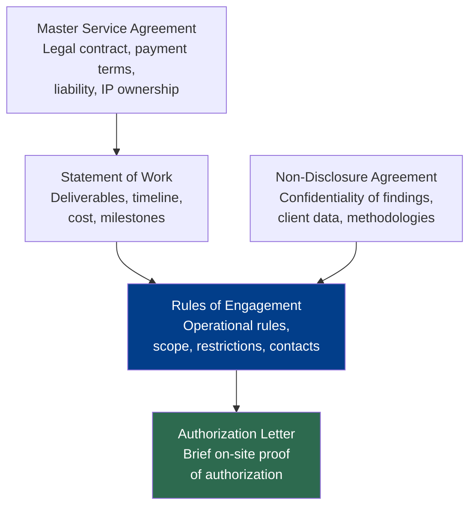
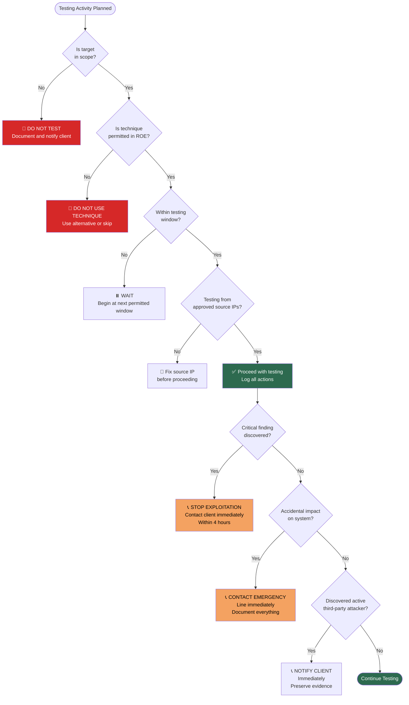

# Rules of Engagement (ROE)

> **Difficulty:** Beginner → Advanced | **Category:** Penetration Testing — Fundamentals

Rules of Engagement are the operational backbone of any penetration testing engagement. They define what you can do, when, to what, and how to handle unexpected events. Without a properly executed ROE, even the best pentester is legally exposed and operationally blind. This note covers every component of a professional ROE document, common mistakes, and a complete sample template.

---

## Table of Contents
1. [What ROE Is and Why It Exists](#1-what-roe-is-and-why-it-exists)
2. [ROE vs Contract vs Scope](#2-roe-vs-contract-vs-scope)
3. [Full ROE Document Components](#3-full-roe-document-components)
4. [Complete Sample ROE Template](#4-complete-sample-roe-template)
5. [ROE Decision Flow](#5-roe-decision-flow)
6. [Handling Critical Findings During Testing](#6-handling-critical-findings-during-testing)
7. [Deconfliction with the Blue Team](#7-deconfliction-with-the-blue-team)
8. [Common ROE Mistakes](#8-common-roe-mistakes)
9. [The Get-Out-of-Jail Letter](#9-the-get-out-of-jail-letter)
10. [ROE for Different Engagement Types](#10-roe-for-different-engagement-types)

---

## 1. What ROE Is and Why It Exists

**Rules of Engagement (ROE)** is a document that defines the operational boundaries, permitted techniques, communication protocols, and escalation procedures for a penetration testing engagement.

Think of ROE as the "operational plan" that sits between the legal contract (which governs the business relationship) and the actual technical testing (which is what you do on the keyboard).

### Why ROE Exists

| Problem | ROE Solution |
|---------|-------------|
| Tester causes unintended system outage | Testing window + prohibited techniques documented |
| Tester scans third-party systems by accident | Explicit in-scope/out-of-scope lists |
| Client not reachable during critical finding | Emergency contact chain established |
| Tester discovers live exploit in production | Critical finding escalation procedure defined |
| Blue team detects and blocks tester | Deconfliction process prevents friendly fire |
| Dispute over what was tested | Everything agreed in writing before testing |
| Law enforcement stops tester on-site | Authorization documentation carried at all times |

### ROE vs Other Documents



---

## 2. ROE vs Contract vs Scope

These three documents are distinct and all necessary:

| Document | What It Covers | Who Signs |
|----------|---------------|-----------|
| **Contract / MSA** | Legal terms, liability, payment, IP rights, dispute resolution | Legal representatives |
| **NDA** | Confidentiality of all findings and data encountered | All team members |
| **SOW** | What deliverables will be produced, timeline, pricing | Project managers / commercial leads |
| **ROE** | How testing will be conducted operationally | Technical leads + client security team |
| **Authorization Letter** | Brief proof of authorization for on-site use | Client security director / CTO |

> **Note:** All of these should be executed BEFORE testing begins. The ROE specifically should be finalized and signed before any scanning or exploitation activity occurs.

---

## 3. Full ROE Document Components

A professionally structured ROE document contains the following sections:

### 3.1 Engagement Overview

```
- Engagement name and reference number
- Client organization name and registered address
- Pentesting firm/individual name and contact
- Engagement type: External Network / Internal Network / Web App / 
  Red Team / Social Engineering / Physical / Combination
- Engagement start date and end date
- Report delivery date
```

### 3.2 Testing Window

Defines **when** testing is permitted. This is critical — unauthorized testing outside the agreed window is a scope violation.

```
Testing Windows:
  - Scheduled window: [Day/time range, e.g., Monday–Friday, 09:00–17:00 local]
  - After-hours testing: [Yes/No — requires separate approval]
  - Weekend testing: [Yes/No — requires separate approval]
  - Blackout dates: [Dates when no testing permitted, e.g., end of quarter, product launch]
  - Time zone: [Always specify — UTC preferred for international engagements]

Pre-testing notification:
  - Tester must notify [CONTACT] [X] hours before each testing session begins
  - Tester must notify [CONTACT] when each testing session ends
```

### 3.3 Scope — In-Scope Systems

```
Network Ranges:
  192.168.1.0/24 (Internal corporate network)
  10.10.0.0/16 (Development environment)
  203.0.113.50 (External web server)

Domains/Hostnames:
  *.example.com (all subdomains)
  api.example.com
  admin.example.com

Web Applications:
  https://app.example.com (customer portal)
  https://admin.example.com (admin panel)
  Mobile app: "ExampleApp" v2.3.1 on iOS and Android

Cloud Accounts:
  AWS Account ID: 123456789012
  Only S3 buckets, EC2 instances, and IAM in this account
```

### 3.4 Out-of-Scope Systems

```
Explicitly Out of Scope:
  192.168.1.5   (production database — critical, no testing)
  192.168.1.100 (phone system — third-party managed)
  payment.example.com (Stripe-hosted payment page)
  *.third-party-cdn.com (third-party CDN)
  Any Amazon/Microsoft/Google infrastructure not in the listed account

Out-of-Scope Activities (regardless of target):
  - Denial of Service (DoS) or Distributed DoS attacks
  - Destruction or modification of client data
  - Exfiltration of actual customer/employee personal data
  - Physical destruction of hardware
  - Testing customer accounts without written consent
  - Social engineering of employees (unless explicitly in scope)
```

### 3.5 Permitted and Prohibited Techniques

```
PERMITTED:
  ✅ Port scanning and service enumeration
  ✅ Vulnerability scanning (with agreed rate limits)
  ✅ Web application testing per OWASP WSTG
  ✅ Password spraying (max 3 attempts per account per hour)
  ✅ Exploitation of identified vulnerabilities
  ✅ Privilege escalation attempts
  ✅ Lateral movement within in-scope network ranges
  ✅ Persistence mechanisms (for demonstration only, to be removed post-test)
  ✅ Data exfiltration simulation (using dummy/test data only)

PROHIBITED:
  ❌ DoS/DDoS attacks of any kind
  ❌ Brute force attacks that could lock out production accounts
  ❌ Accessing, exfiltrating, or retaining actual personal/financial data
  ❌ Permanent modification of systems (registry, startup, cron)
  ❌ Destruction of logs (read-only access to logs is permitted)
  ❌ Installing persistent backdoors (must be removed within 24hrs)
  ❌ Pivoting to out-of-scope systems
  ❌ Social engineering of employees (unless listed as in-scope)
  ❌ Testing from outside [listed source IP ranges]
```

### 3.6 Source IP Addresses

```
Testing Source IPs (client must whitelist):
  Test Machine: 198.51.100.50 (primary attack machine)
  Backup: 198.51.100.51 (secondary, in case of ISP issues)
  VPN Exit: 198.51.100.52 (if testing through VPN)

Implication: Any activity from these IPs during testing window 
should NOT be blocked by client security teams (deconfliction).
```

### 3.7 Emergency Contacts

```
CLIENT CONTACTS:
  Primary Technical Contact:
    Name: Jane Smith (Security Engineer)
    Phone: +1-555-0100 (available during testing window)
    Email: j.smith@example.com
    Availability: Monday–Friday 08:00–18:00 ET

  After-Hours Emergency:
    Name: Mike Johnson (CISO)
    Phone: +1-555-0199 (24/7 availability during engagement)
    Email: m.johnson@example.com

  IT Infrastructure Lead (for critical system issues):
    Name: Tom Lee
    Phone: +1-555-0102
    Email: t.lee@example.com

PENTESTER CONTACTS:
  Lead Pentester:
    Name: [Your name]
    Phone: [Your number]
    Email: [Your email]

WHEN TO USE EMERGENCY CONTACTS:
  Immediately:
    - Any critical finding allowing active exploitation in production
    - Any accidental impact on system availability
    - Any discovery of active malicious activity (third-party attackers)
    - Any situation where law enforcement involvement is imminent
```

### 3.8 Data Handling and Confidentiality

```
Data Handling Requirements:
  - All engagement data stored encrypted at rest (AES-256 minimum)
  - No engagement data stored on personal devices
  - Engagement data transmitted via encrypted channel only (SFTP, encrypted email)
  - Screenshots/evidence must not include actual personal data of employees or customers
  - Personal data encountered must be immediately noted and not retained
  - All engagement data destroyed within [30/60/90] days of report delivery
  - Deletion confirmed in writing to client

Report Distribution:
  - Report delivered via [encrypted email / secure file share]
  - Maximum recipients: [names listed]
  - Client may not share report with third parties without pentester's consent
  - Raw tool output delivered separately (appendix)
```

### 3.9 Third-Party Systems

```
Third-Party System Inventory:
  System              | Provider      | In Scope? | Contact Required?
  --------------------|---------------|-----------|------------------
  CDN (Cloudflare)    | Cloudflare    | No        | N/A
  Payment gateway     | Stripe        | No        | N/A
  Email delivery      | SendGrid      | No        | N/A
  CRM                 | Salesforce    | No        | N/A
  AWS hosting         | Amazon        | Partial   | AWS policy reviewed
  SSO provider        | Okta          | No        | N/A

Note: Testing any third-party system not explicitly listed as in-scope 
is prohibited without obtaining separate authorization from that provider.
```

### 3.10 Reporting and Communication

```
Interim Reports:
  - Daily verbal/written status update to [PRIMARY CONTACT]
  - Critical findings reported immediately (do not wait for final report)
  - Draft report delivered: [DATE]
  - Review period: [X business days]
  - Final report delivered: [DATE]

Critical Finding Escalation:
  - Defined as: CVSS 9.0+ or confirmed access to crown jewel assets
  - Escalation timeline: Within 4 hours of discovery
  - Escalation method: Phone call to Primary Contact + written summary
  - Do not exploit further until client acknowledges and provides direction
```

---

## 4. Complete Sample ROE Template

```
═══════════════════════════════════════════════════════════════════
          PENETRATION TESTING RULES OF ENGAGEMENT
═══════════════════════════════════════════════════════════════════

ENGAGEMENT REFERENCE: ENG-2024-0001
DATE OF EXECUTION: [DATE]

PARTIES:
  Client:    Example Corporation, 123 Main Street, City, State, ZIP
  Tester:    [Pentesting Firm Name], [Address]

ENGAGEMENT DETAILS:
  Type:      External Network + Web Application Penetration Test
  Start:     2024-01-15 09:00 UTC
  End:       2024-01-19 17:00 UTC
  Report Due: 2024-01-26

─────────────────────────────────────────────────────────────────
SECTION 1: SCOPE
─────────────────────────────────────────────────────────────────

IN-SCOPE:
  External IP: 203.0.113.50 (web server)
  External IP: 203.0.113.51 (VPN gateway)
  Domain: *.example.com (all public-facing subdomains)
  Application: https://app.example.com
  Application: https://api.example.com

OUT-OF-SCOPE:
  203.0.113.100 (shared hosting — third party)
  payments.example.com (Stripe-hosted)
  All internal/RFC1918 addresses
  All Amazon, Cloudflare, or third-party infrastructure

─────────────────────────────────────────────────────────────────
SECTION 2: TESTING WINDOWS
─────────────────────────────────────────────────────────────────

Permitted: Monday–Friday, 09:00–17:00 UTC only
Blackout: 2024-01-17 (system upgrade scheduled)
Source IPs: 198.51.100.50, 198.51.100.51

─────────────────────────────────────────────────────────────────
SECTION 3: PERMITTED ACTIVITIES
─────────────────────────────────────────────────────────────────

✅ Port scanning, service fingerprinting
✅ Vulnerability scanning (max 100 req/sec)
✅ Web application testing per OWASP WSTG
✅ Authentication bypass attempts
✅ SQL injection, XSS, SSRF, command injection
✅ Exploitation of confirmed vulnerabilities
❌ DoS or service disruption
❌ Data exfiltration of real user data
❌ Brute force causing account lockout in production

─────────────────────────────────────────────────────────────────
SECTION 4: CONTACTS
─────────────────────────────────────────────────────────────────

Technical Lead:   Jane Smith | +1-555-0100 | j.smith@example.com
Emergency:        Mike Johnson | +1-555-0199 | m.johnson@example.com
Pentester Lead:   [Name] | [Phone] | [Email]

─────────────────────────────────────────────────────────────────
SECTION 5: DATA HANDLING
─────────────────────────────────────────────────────────────────

All data encrypted at rest and in transit.
No personal data to be retained. Report via encrypted channel.
All engagement data destroyed 30 days post-report delivery.

─────────────────────────────────────────────────────────────────
AUTHORIZED SIGNATURES:
─────────────────────────────────────────────────────────────────

Client Authorized Signatory:
Name: _________________________ Title: _________________________
Signature: ____________________ Date: __________________________

Pentester:
Name: _________________________ 
Signature: ____________________ Date: __________________________

═══════════════════════════════════════════════════════════════════
```

---

## 5. ROE Decision Flow



---

## 6. Handling Critical Findings During Testing

A critical finding — a zero-day, a domain admin shell, a confirmed customer data exposure — requires immediate escalation regardless of time of day.

### Critical Finding Response Protocol

```
STEP 1: STOP EXPLOITATION
  - Do not exploit further or pivot to additional systems
  - Take screenshot evidence of current access level
  - Note exact timestamp and method used

STEP 2: DOCUMENT IMMEDIATELY
  - What vulnerability was found?
  - What systems are affected?
  - What data is at risk?
  - What was the attack path?
  - Write this within 30 minutes of discovery

STEP 3: NOTIFY CLIENT
  - Call primary technical contact within 4 hours (immediately for active exploitation)
  - Do NOT send over unencrypted email
  - Provide: affected system, vulnerability type, exploitation status, your recommendation

STEP 4: AWAIT DIRECTION
  Client may:
    a) Ask you to continue — get written confirmation
    b) Ask you to stop and patch first — document and pause
    c) Ask for full evidence — prepare detailed PoC notes
    d) Invoke incident response — cooperate fully

STEP 5: DOCUMENT IN REPORT
  - Mark as Critical in risk register
  - Include in executive summary
  - Provide immediate remediation steps
```

---

## 7. Deconfliction with the Blue Team

**Deconfliction** is the process of ensuring the client's internal security team (blue team / SOC) knows a pentest is occurring and can distinguish legitimate testing activity from actual attacks.

### Why Deconfliction Matters

Without deconfliction:
- SOC may block pentester's IP, invalidating test results
- Incident response may be triggered, wasting resources and causing panic
- Blue team may "burn" their detection capabilities responding to known test activity
- Pentester's actions may be mis-attributed in forensic investigation

### Deconfliction Models

| Model | Description | Used For |
|-------|-------------|---------|
| **Full Deconfliction** | Blue team knows exact testing window and source IPs; told to observe but not block | Standard pentest |
| **Partial Deconfliction** | Blue team knows a test is happening but not exact timing — tests their alerting | Purple team |
| **Blind Test** | Blue team unaware entirely | Red team engagement |

```bash
# Deconfliction information to share with blue team:
# Testing window: [dates/times]
# Source IPs: 198.51.100.50, 198.51.100.51
# Tester contact: [name, phone]
# Rule: Alert on activity from these IPs (to validate detection), but do NOT block

# Useful for blue team logging context:
# All pentester traffic should be tagged in SIEM with:
# Source IP: 198.51.100.50
# Tag: AUTHORIZED_PENTEST_2024-01
```

---

## 8. Common ROE Mistakes

### Pentester Mistakes

| Mistake | Consequence | Prevention |
|---------|-------------|-----------|
| **No written authorization** | Criminal liability | Never start without signed documents |
| **Testing outside scope** | Legal exposure, contract breach | Verify every target before touching |
| **Testing outside agreed window** | Scope violation | Set calendar alerts; reconfirm window daily |
| **Testing from wrong IP** | Blue team may block; scope questions arise | Verify source IP before each session |
| **Not escalating critical findings** | Client not informed; liability | Establish and follow escalation protocol |
| **Pivoting to third-party systems** | Legal exposure | Map all third-party integrations before testing |
| **Retaining client data post-engagement** | GDPR / contractual violation | Agree and execute data destruction |
| **Not logging activities** | Cannot prove what was done | Use logging tools; full command history |

### Client Mistakes

| Mistake | Consequence | Prevention |
|---------|-------------|-----------|
| **Inadequate signatory authority** | Authorization may be legally invalid | Ensure signatory has actual authority over systems |
| **Incorrect scope (missing systems)** | Key assets not tested | Comprehensive inventory review before scoping |
| **No emergency contact coverage** | Cannot reach anyone during critical finding | 24/7 contact during testing period mandatory |
| **Not informing blue team** | SOC incident, blocked tester | Choose deconfliction model explicitly |
| **Overly restrictive ROE** | Test produces minimal value | Balance business risk with testing depth |

---

## 9. The Get-Out-of-Jail Letter

For physical engagements or situations where security personnel or law enforcement may intercept the pentester, a brief authorization letter must be carried at all times.

```
─────────────────────────────────────────────────────────────────
                    AUTHORIZATION TO CONDUCT
                    SECURITY TESTING ACTIVITIES
─────────────────────────────────────────────────────────────────

DATE: [DATE]

TO WHOM IT MAY CONCERN:

This letter confirms that the individual(s) named below are authorized
to conduct security testing activities on behalf of Example Corporation.

AUTHORIZED INDIVIDUALS:
  Full Name: [PENTESTER NAME]
  ID Verification: [Passport/Driver's License number on file]

AUTHORIZED ACTIVITIES:
  The named individual(s) are authorized to conduct physical security
  assessments, including but not limited to: testing access controls,
  badge systems, and physical entry points at Example Corporation
  facilities located at:

  PRIMARY SITE: 123 Main Street, City, State, ZIP

AUTHORIZATION PERIOD:
  From: 2024-01-15 09:00 (local)
  To:   2024-01-15 17:00 (local)

IMMEDIATE CONTACT FOR VERIFICATION:
  Name:  Mike Johnson, Chief Information Security Officer
  Phone: +1-555-0199 (available 24/7 during this period)
  Email: m.johnson@example.com

Any questions regarding the legitimacy of this testing should be
directed to the contact above. We appreciate your cooperation in 
supporting our organization's security program.

Authorized by:

Name:  _________________________ 
Title: _________________________
Org:   Example Corporation
Sign:  _________________________
Date:  _________________________

[COMPANY LETTERHEAD / STAMP]
─────────────────────────────────────────────────────────────────
```

> **Warning:** This letter must be current (matching today's date and test window), must have a verifiable phone number, and must have real wet signatures. A photocopy or digital version without the ability to verify in real-time is significantly weaker.

---

## 10. ROE for Different Engagement Types

ROE varies by engagement type. Key differences:

| Component | Standard Pentest | Red Team | Bug Bounty | Physical |
|-----------|-----------------|----------|------------|---------|
| Scope | Comprehensive, specific | Goal-defined, broader | Program-defined | Physical locations |
| Testing window | Fixed hours | Often 24/7 | Ongoing | Business hours typically |
| Blue team awareness | Usually yes | No (blind) | No | No |
| Source IP disclosure | Yes | No | No | N/A |
| Deconfliction contact | Required | Usually none | None | Required |
| Social engineering | Usually no | Often yes | No | Yes |
| Physical access | No | Sometimes | No | Core activity |
| Destructive testing | Prohibited | Prohibited | Prohibited | Prohibited |
| Persistence | Temporary, remove | Longer, remove | No | N/A |

---

> **Note:** The ROE is a living document during engagement — if the client wants to expand scope (e.g., add another IP range), get written approval before testing it. Mid-engagement scope changes happen regularly; handle them professionally.

> **Warning:** ROE violations — even accidental ones — must be disclosed to the client immediately. Attempting to hide a scope violation is grounds for contract termination and potential legal action. Transparency always.
