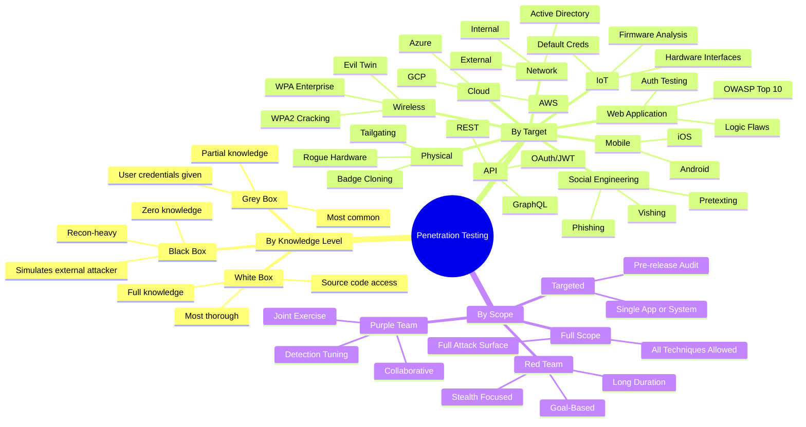

# Types of Penetration Testing

> **Note:** This note is part of the **Penetration Testing — 01 Fundamentals** series. Understanding the taxonomy of pentesting types helps you choose the right engagement model and communicate clearly with clients.

---

## Table of Contents

1. [By Knowledge Level](#1-by-knowledge-level)
2. [By Target](#2-by-target)
3. [By Scope and Methodology](#3-by-scope-and-methodology)
4. [Choosing the Right Type](#4-choosing-the-right-type)
5. [Full Taxonomy Diagram](#5-full-taxonomy-diagram)
6. [Summary](#6-summary)

---

## 1. By Knowledge Level

The **knowledge-level taxonomy** refers to how much information the tester is given about the target before testing begins. This fundamentally shapes the efficiency, realism, and goals of the engagement.

### Black Box Testing

**Black box** testing simulates an **external attacker with zero prior knowledge** of the target. The tester receives only a company name (and sometimes just a domain or IP range) and must discover everything else themselves.

**What the tester receives:**
- Company name / target domain
- Sometimes: a single IP or CIDR range
- Nothing else — no credentials, no architecture diagrams, no source code

**What the tester must discover themselves:**
- IP ranges and subdomains
- Technology stack (web servers, frameworks, databases)
- Employee names and email formats (via OSINT)
- Running services and open ports
- Application functionality

**Real-world example:** Your company hires a firm and says "our domain is acmecorp.com — try to get into our systems." The tester then spends time on reconnaissance before they can even begin testing.

**Pros:**
- Most realistic simulation of an external attacker
- Tests the entire attack surface including OSINT exposure
- No insider knowledge means no assumptions

**Cons:**
- Inefficient — significant time spent on reconnaissance that wouldn't be needed with more context
- May miss internal-only vulnerabilities
- Lower ROI for the time invested (less vulnerabilities found per dollar)
- Tester may never find internal systems if external perimeter is solid

---

### White Box Testing

**White box** testing (also called **crystal box** or **clear box**) gives the tester **full knowledge** of the target environment. The tester receives source code, architecture diagrams, network topology, credentials, API documentation — everything.

**What the tester receives:**
- Source code repositories
- Architecture and infrastructure diagrams
- Admin credentials (or dedicated test accounts)
- API documentation and specs
- Network diagrams
- CI/CD pipeline details

**Real-world example:** A financial institution asks a firm to test their new banking API. The firm receives the OpenAPI spec, test credentials, and access to the staging environment's source code on GitHub.

**Pros:**
- Most thorough coverage — tester can find deeply buried logic flaws
- Efficient — no time wasted on reconnaissance
- Code review identifies vulnerabilities that runtime testing misses
- Best for auditing a specific application before launch

**Cons:**
- Doesn't simulate a real external attacker
- Requires the tester to have code review skills (not all pentesters do)
- Can create false confidence ("we tested the code but not the infrastructure")
- Access to everything means the tester must be deeply trusted

---

### Grey Box Testing

**Grey box** testing is the most common in real-world engagements. The tester receives **partial knowledge** — typically credentials for a standard user account, plus some basic information about the environment.

**What the tester receives:**
- Standard user credentials (non-admin)
- Basic network topology or IP ranges
- Sometimes: list of technologies in use
- No source code, no admin access

**Real-world example:** A healthcare company wants to test their patient portal. They provide a test patient account and tell the tester "the portal runs on AWS and uses a React frontend." The tester tries to escalate privileges, access other patients' data, and compromise the backend.

**Pros:**
- Balances realism with efficiency
- Simulates an insider threat or compromised user account
- More cost-effective than pure black box
- Covers the widest range of real-world attack scenarios

**Cons:**
- Doesn't test discovery/enumeration skills the way black box does
- Doesn't provide the depth of white box code review
- Results depend heavily on what initial information is provided

---

### Knowledge-Level Comparison Table

| Attribute | Black Box | Grey Box | White Box |
|---|---|---|---|
| **Knowledge given** | None (name/domain only) | Partial (user account + basic info) | Full (source code, admin creds, diagrams) |
| **Realism** | Highest | High | Low |
| **Efficiency** | Lowest | High | Highest |
| **Coverage depth** | Shallow-medium | Medium-deep | Deepest |
| **Simulates** | External attacker | Compromised user / insider | Code auditor / QA |
| **Best for** | External perimeter assessment | Web app / API / internal testing | Pre-launch audit, compliance |
| **Time required** | More (recon-heavy) | Moderate | Less per finding |
| **Cost efficiency** | Low | High | Medium |
| **Logic flaws found** | Unlikely | Possible | Highly likely |
| **Most common in practice?** | Less common | **Yes, most common** | Common for code review |

---

## 2. By Target

Different systems require different skills, tools, and methodologies. Here's a breakdown of each target type.

### Network Penetration Testing

Testing the security of **network infrastructure** — routers, switches, firewalls, VPNs, and everything in between.

**External network pentesting:** Testing from the internet inward. Goal is to compromise internet-facing systems (web servers, VPNs, mail servers) and pivot deeper.

**Internal network pentesting:** Testing from inside the network (simulating a rogue employee, a compromised workstation, or an attacker who has already breached the perimeter). Goal is often to reach domain admin or critical internal systems.

**Key tools:**
```bash
nmap -sV -sC -O -p- 10.10.10.0/24      # Service/OS detection
nmap --script vuln 10.10.10.1           # Vuln scripts
masscan -p1-65535 10.10.10.0/24 --rate=1000  # Fast port scan
netdiscover -r 192.168.1.0/24          # ARP-based host discovery
```

**Common findings:** Open management ports (telnet/SSH with weak creds), unpatched services, weak firewall rules, no network segmentation, IPv6 misconfiguration.

---

### Web Application Penetration Testing

Testing **web applications** for vulnerabilities like those in the **OWASP Top 10**:

| OWASP Top 10 (2021) | Description |
|---|---|
| A01: Broken Access Control | Users accessing data/functions they shouldn't |
| A02: Cryptographic Failures | Weak encryption, exposed sensitive data |
| A03: Injection | SQLi, command injection, LDAP injection |
| A04: Insecure Design | Logic flaws in the design |
| A05: Security Misconfiguration | Default creds, exposed error messages, open S3 buckets |
| A06: Vulnerable Components | Outdated libraries with known CVEs |
| A07: Auth Failures | Weak passwords, broken MFA, session management flaws |
| A08: Software & Data Integrity | Insecure CI/CD, deserialization flaws |
| A09: Logging & Monitoring Failures | No alerting, no audit trail |
| A10: SSRF | Server-Side Request Forgery |

**Key tools:**
```bash
burpsuite                              # Manual proxy and scanner
nikto -h https://target.com           # Web server vulnerability scanner
gobuster dir -u https://target.com -w /usr/share/wordlists/dirb/common.txt  # Directory brute-force
sqlmap -u "https://target.com/item?id=1" --dbs  # SQL injection automation
wfuzz -c -w wordlist.txt --hc 404 https://target.com/FUZZ  # Fuzzing
```

---

### Mobile Application Penetration Testing

Testing **iOS and Android applications** for vulnerabilities in:
- Insecure data storage (clear-text credentials in SQLite, SharedPreferences)
- Insecure communication (TLS certificate pinning bypass, plain HTTP)
- Weak authentication (biometric bypass, insecure session tokens)
- Client-side business logic bypasses
- Deep link exploitation

**Android tools:**
```bash
adb shell                              # Android Debug Bridge shell
apktool d target.apk                   # Decompile APK
jadx-gui                               # Decompile Dalvik bytecode to Java
frida -U -l bypass-ssl.js com.target.app  # Dynamic instrumentation
drozer console connect                 # Android security assessment framework
```

**iOS tools:**
```bash
objection -g com.target.ios explore    # iOS runtime manipulation
frida -U -l bypass-jailbreak.js -n "TargetApp"  # Jailbreak/SSL bypass
ssh root@192.168.1.100                 # SSH into jailbroken device
```

> **Note:** Mobile pentesting requires physical or virtual devices and specific tooling. iOS testing especially benefits from a jailbroken device for deep analysis.

---

### API Penetration Testing

**API security testing** has become one of the fastest-growing areas of pentesting as organizations shift to microservices and REST/GraphQL architectures.

**Key areas to test:**
- **Authentication/Authorization** (JWT attacks, OAuth misconfigurations, BOLA/BFLA)
- **Injection** (SQLi, NoSQLi via JSON params)
- **Rate limiting** (API key brute force, scraping)
- **Mass assignment** (sending extra JSON properties to elevate privileges)
- **GraphQL introspection** (information disclosure)
- **SSRF via API parameters**

```bash
# Broken Object Level Authorization (BOLA) — OWASP API Top 1
# Access another user's resource by changing the ID
curl -H "Authorization: Bearer <your_token>" \
     https://api.target.com/v1/users/1337/data  # Try another user's ID

# JWT algorithm confusion
python3 jwt_tool.py <token> -X a      # Algorithm switch attack

# GraphQL introspection query
curl -X POST https://api.target.com/graphql \
  -H "Content-Type: application/json" \
  -d '{"query": "{__schema{types{name fields{name}}}}"}'
```

---

### Cloud Penetration Testing

Testing **cloud environments** (AWS, Azure, GCP) for misconfigurations, overprivileged IAM roles, exposed storage, and metadata service exploitation.

**Key areas:**
- IAM privilege escalation (over-permissive roles)
- S3/Blob/GCS bucket misconfigurations (public read/write)
- Metadata API abuse (SSRF → IMDS → credential theft)
- Publicly exposed services (databases, dashboards)
- Lambda/Function misconfiguration
- Container escape (EKS, AKS, GKE)

```bash
# AWS — check what identity you're using
aws sts get-caller-identity

# Enumerate S3 buckets
aws s3 ls s3://target-bucket --no-sign-request

# Check for metadata access (from EC2 instance)
curl http://169.254.169.254/latest/meta-data/iam/security-credentials/

# Enumerate IAM permissions (using Pacu or manually)
aws iam list-attached-user-policies --user-name current-user
```

> **Warning:** Cloud providers (AWS, Azure, GCP) have specific **penetration testing policies**. You must review and comply with these before testing cloud infrastructure. Testing certain services without pre-authorization from the provider is prohibited even if you own the account.

---

### Social Engineering

Testing the **human element** — the most consistently exploitable attack surface in any organization.

**Types:**
- **Phishing**: Mass email campaigns to harvest credentials
- **Spear phishing**: Targeted phishing against specific individuals (e.g., CFO, IT admin)
- **Vishing**: Voice/phone-based social engineering
- **Smishing**: SMS-based phishing
- **Pretexting**: Creating a fabricated scenario (e.g., "I'm from IT, I need your password to fix your account")

> **Warning:** Social engineering engagements require the most careful scoping and authorization. Targeting specific individuals (especially executives) and creating fake email domains or clone websites requires explicit written permission.

---

### Physical Penetration Testing

Testing **physical security controls** — badge readers, locks, CCTV, security guards, and building access procedures.

**Common objectives:**
- Gain unauthorized physical access to server rooms or restricted areas
- Clone access badges (using Proxmark or Flipper Zero)
- Tailgate through secured doors
- Install rogue hardware (keyloggers, network implants, rogue APs)

---

### Wireless Penetration Testing

Testing **Wi-Fi and wireless networks**:
- WPA2 handshake capture and offline cracking
- WPA Enterprise (PEAP/MSCHAPv2) credential harvesting
- Rogue access point setup (Evil Twin attacks)
- Wi-Fi deauthentication attacks

```bash
# Set adapter to monitor mode
airmon-ng start wlan0

# Capture WPA2 handshake
airodump-ng -c 6 --bssid AA:BB:CC:DD:EE:FF -w capture wlan0mon

# Crack captured handshake
hashcat -m 22000 capture.hc22000 /usr/share/wordlists/rockyou.txt
```

---

### Active Directory / Domain Pentesting

One of the most impactful test types in corporate environments. AD misconfigurations can lead to complete domain compromise.

**Key attack paths:**
- Kerberoasting (extract service tickets, crack offline)
- AS-REP Roasting (accounts without pre-auth required)
- Pass-the-Hash / Pass-the-Ticket
- DCSync (replicating NTDS.dit)
- BloodHound attack path analysis

```bash
# Kerberoasting — find service accounts with SPNs
impacket-GetUserSPNs -request -dc-ip 10.10.10.1 domain.local/user:password

# BloodHound data collection
bloodhound-python -u user -p password -d domain.local -c all -dc 10.10.10.1

# Pass-the-Hash with CrackMapExec
crackmapexec smb 10.10.10.0/24 -u Administrator -H <NTLM_hash>
```

---

### IoT Penetration Testing

Testing **Internet of Things devices** — cameras, routers, industrial control systems, smart home devices, medical devices.

**Key areas:**
- Default or hardcoded credentials
- Unencrypted firmware (extracted via UART, JTAG, or SPI flash)
- Exposed management interfaces (Telnet, HTTP, MQTT)
- Insecure update mechanisms (no signature verification)
- Hardware debug ports left enabled in production

---

## 3. By Scope and Methodology

### Full Scope Engagement

The tester has **no restrictions** other than staying within the agreed organization's perimeter. They can use any technique (phishing, physical entry, network attacks, application attacks) to achieve the objectives.

Best for: Mature security programs wanting a realistic threat simulation.

### Targeted / Focused Engagement

Testing a **specific component** — e.g., "only test our new payment API" or "only test the VPN gateway." Narrowly scoped, efficient, often used after major changes.

Best for: Pre-release audits, compliance-specific testing.

### Red Team Exercises

A **red team** exercise is an adversarial simulation designed to test the **detection and response capabilities** of the defending team (blue team). The goal is often NOT to find every vulnerability, but to simulate a specific threat actor reaching a specific objective (e.g., "steal the CFO's laptop data") while the SOC tries to detect and stop them.

**Key differences from pentesting:**
- Long duration (weeks to months)
- Stealth is paramount (pentesters are noisy; red teamers aren't)
- Goal-based, not coverage-based
- Tests people + processes + technology together

### Purple Team Exercises

A **purple team** is a collaborative exercise where red and blue teams work together openly — the red team executes attacks while the blue team tunes detections in real time. The goal is to improve defensive capabilities as a team.

---

## 4. Choosing the Right Type

```
Is this a compliance check?
 └─ Yes → Scoped assessment (web app / network) with methodology mapped to standard (PCI/SOC2/ISO)

Is this testing a specific new application before launch?
 └─ Yes → White box web application or API pentest

Is this testing the entire organization's security posture?
 └─ Yes → Full scope grey box or black box engagement

Do you want to test detection and response capabilities?
 └─ Yes → Red team exercise

Do you want to improve both attack and defense simultaneously?
 └─ Yes → Purple team exercise
```

---

## 5. Full Taxonomy Diagram



---

## 6. Summary

| Type | Simulates | Best Used For |
|---|---|---|
| **Black Box** | External attacker | External perimeter, OSINT exposure |
| **Grey Box** | Compromised user | Web apps, APIs, internal network |
| **White Box** | Code auditor | Pre-launch, compliance, deep bugs |
| **Network Pentest** | Network attacker | Infrastructure security |
| **Web App Pentest** | Web attacker | Application vulnerabilities |
| **API Pentest** | API abuser | API security |
| **Cloud Pentest** | Cloud attacker | Misconfiguration, IAM |
| **Red Team** | APT / nation-state | Detection & response maturity |
| **Purple Team** | Collaborative | Security capability building |

Understanding these distinctions helps you:
1. **Select the right engagement** for your security goals
2. **Communicate clearly** with clients about what they're buying
3. **Set realistic expectations** about what each type will and won't find

---

*Sources: OWASP Testing Guide v4.2, PTES, NIST SP 800-115, OWASP API Security Top 10, PortSwigger Web Security Academy*
