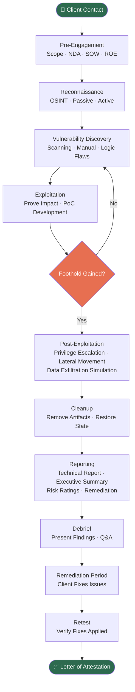

# What Is Penetration Testing?

> **Note:** This note is part of the **Penetration Testing — 01 Fundamentals** series. No prior offensive security experience is required, but familiarity with basic networking concepts (TCP/IP, ports, protocols) is helpful.

---

## Table of Contents

1. [Definition — More Than "Hacking with Permission"](#1-definition)
2. [The Mindset: Think Like an Attacker, Act Like a Professional](#2-the-mindset)
3. [Why Organizations Need Pentesting](#3-why-organizations-need-it)
4. [Pentesting vs. Vulnerability Scanning](#4-pentesting-vs-vulnerability-scanning)
5. [The Locksmith Analogy](#5-the-locksmith-analogy)
6. [Who Performs Pentests?](#6-who-performs-pentests)
7. [What Pentesting Is NOT](#7-what-pentesting-is-not)
8. [Real-World Breach Examples](#8-real-world-breach-examples)
9. [The Pentesting Process Lifecycle](#9-the-pentesting-process-lifecycle)
10. [Summary](#10-summary)

---

## 1. Definition

**Penetration testing** (also called **pentesting** or **ethical hacking**) is the practice of simulating a cyberattack against a computer system, network, web application, or organization — with explicit, written authorization from the owner — in order to identify security weaknesses before a malicious actor can exploit them.

The key word in that sentence is *authorized*. Without authorization, the exact same actions become a federal crime in most jurisdictions.

But even "authorized hacking" is too simplistic a definition. Penetration testing is:

- A **structured, methodological process** (not random hacking)
- **Goal-driven** (find specific vulnerabilities, prove impact, simulate specific threat actors)
- **Time-bounded** (conducted within agreed windows)
- **Reported and documented** (produces deliverables, not just "we found bugs")
- **Ethical and professional** (operates under rules of engagement, NDAs, and legal frameworks)

The best definition comes from **NIST SP 800-115**:

> *"Security testing in which assessors mimic real-world attacks to identify methods for circumventing the security features of an application, system, or network."*

And from the **Penetration Testing Execution Standard (PTES)**:

> *"Penetration testing is a method of evaluating the security of a computer system or network by simulating an attack from malicious outsiders (who do not have an authorized user account) and malicious insiders (who have a standard user account)."*

---

## 2. The Mindset: Think Like an Attacker, Act Like a Professional

The core skill of a penetration tester is **adversarial thinking** — the ability to look at a system from the perspective of someone trying to break it, rather than someone trying to use it or build it.

### Attacker Thinking

When a developer builds a login form, they think: *"How does a valid user log in?"*

When a penetration tester evaluates a login form, they think:
- *Can I bypass authentication entirely?*
- *Can I enumerate valid usernames through error messages?*
- *Is there a rate limit, or can I brute-force?*
- *Does the session token have enough entropy?*
- *Is there a SQL injection in the username field?*
- *Can I manipulate the "forgot password" flow?*

This is **adversarial thinking**: actively looking for failure modes, edge cases, and trust violations that normal users would never notice or try.

### Professional Conduct

Equally important is the **professional side**. A penetration tester who thinks like an attacker but acts like one too — exfiltrating real data, persisting on systems after engagement ends, or selling findings — is a criminal, not a professional.

Professional pentesting means:
- Operating strictly within the **agreed scope**
- **Documenting everything** you do (timestamps, commands, screenshots)
- **Stopping** when you hit out-of-scope systems
- **Notifying the client** immediately if you find a critical vulnerability that poses imminent risk
- **Destroying or returning** any data captured during testing
- Maintaining **confidentiality** about findings

---

## 3. Why Organizations Need Pentesting

### Compliance Requirements

Many regulatory frameworks **mandate** regular penetration testing:

| Framework | Who It Applies To | Pentesting Requirement |
|---|---|---|
| **PCI DSS** (Payment Card Industry Data Security Standard) | Any org processing card payments | Required annually and after major changes (Req. 11.3) |
| **SOC 2** | SaaS/cloud providers | Pentesting is a common control for Type II audits |
| **HIPAA** | Healthcare orgs (US) | Risk assessments including technical testing |
| **ISO 27001** | Any org seeking certification | Technical vulnerability assessments required |
| **DORA** (EU Digital Operational Resilience Act) | Financial sector | Threat-led penetration testing (TLPT) |
| **FedRAMP** | US government cloud services | Annual pentesting mandatory |

### Breach Prevention

The primary goal is finding vulnerabilities before attackers do. A vulnerability sitting in production for 6 months costs nothing if found by your pentesters. The same vulnerability exploited by a threat actor costs an average of **$4.45 million** per breach (IBM Cost of a Data Breach Report 2023).

### Security Posture Assessment

Pentesting answers the question: *"If an attacker targeted us today, how far could they get?"* This is different from asking "do we have vulnerabilities?" (which vulnerability scanners answer) — it answers the follow-up: "so what? what's the actual impact?"

### Third-Party Assurance

Organizations increasingly require their vendors to have recent pentest reports before signing contracts. A pentest report is a form of security proof that can be shared with customers, auditors, and partners.

---

## 4. Pentesting vs. Vulnerability Scanning

This is one of the most commonly confused distinctions in cybersecurity.

| Attribute | Vulnerability Scanning | Penetration Testing |
|---|---|---|
| **Method** | Automated tools only | Manual + automated |
| **Goal** | Enumerate known vulnerabilities | Prove exploitability and business impact |
| **False positives** | High (tools report theoretical issues) | Low (tester validates findings manually) |
| **Depth** | Wide and shallow | Narrow and deep |
| **Chaining** | Cannot chain vulnerabilities together | Can chain: foothold → pivot → domain admin |
| **Business logic** | Cannot test logic flaws | Can test logic flaws, auth bypasses |
| **Duration** | Hours | Days to weeks |
| **Cost** | Low ($0 – $5K for tools/licenses) | High ($5K – $100K+) |
| **Skill required** | Low (run tool, read report) | High (requires expertise and creativity) |
| **Output** | List of CVEs with CVSS scores | Narrative report with proven attack paths |

A **vulnerability scanner** (like Nessus, OpenVAS, or Qualys) is like running a metal detector across a field — it tells you where to dig but doesn't dig itself. A **penetration tester** digs, finds what's actually there, and tells you its real value.

> **Warning:** Many organizations check the compliance box with "vulnerability scanning" and call it pentesting. These are fundamentally different activities. Scanners cannot discover: business logic flaws, authentication bypasses, chained attack paths, insider threat scenarios, or social engineering vectors.

---

## 5. The Locksmith Analogy

Imagine you own a house and you want to know how secure it is. You could:

**Option A (vulnerability scan):** Walk around the house with a checklist. *"Front door: locked. Back door: locked. Windows: closed."* — This tells you the obvious things are in place.

**Option B (penetration test):** Hire a professional locksmith (with your written permission) to try to break into the house by any means necessary. They might discover:
- The front door lock is a cheap brand that can be bumped open in 10 seconds
- The back door has a gap that lets them reach the lock handle from outside
- The window locks are decorative and can be popped with a credit card
- The alarm system has a 30-second delay before activating
- The keypad PIN for the garage is "1234" (same as the default)

**Option C (red team exercise):** A whole team spends two weeks trying to get inside. They try social engineering your housekeeper, physically tail your kids to find when the house is empty, research your schedule from social media, clone your car key remote, and eventually get in during a Tuesday afternoon.

Each of these is a different level of security testing. Penetration testing sits between the checklist and the red team — rigorous, adversarial, but more focused than a full red team operation.

---

## 6. Who Performs Pentests?

### Internal Red Teams

Large organizations (Fortune 500, banks, government agencies) employ **internal red teams** — full-time offensive security professionals on staff. 

**Advantages:**
- Deep knowledge of internal systems and architecture
- Can conduct ongoing, continuous testing
- Cost-effective at scale

**Disadvantages:**
- Subject to organizational blind spots ("we've always done it this way")
- May face political friction when reporting findings to leadership
- Certification and knowledge can stagnate without external exposure

### External Consulting Firms

Most organizations hire **third-party penetration testing firms** for periodic assessments.

**Advantages:**
- Fresh perspective — no insider bias
- Specialized expertise (e.g., firms that only do cloud or OT pentesting)
- Independence increases credibility of findings for auditors
- Access to latest offensive techniques and tooling

**Disadvantages:**
- Expensive ($1,500–$3,000+ per day for skilled testers)
- Requires significant onboarding and context-sharing
- Relationship is transactional — limited institutional memory

### Independent Consultants / Freelancers

Experienced individual practitioners who operate independently. Often former employees of large firms.

### Bug Bounty Hunters

Crowd-sourced security researchers who test within a defined program scope for financial rewards. Not the same as pentesting — they operate continuously, without fixed scope agreements, and are paid per valid finding.

---

## 7. What Pentesting Is NOT

### Not a One-Time Fix

A pentest is a **snapshot in time**. The moment testing ends, the organization continues to:
- Deploy new code
- Change configurations
- Add new services
- Hire new employees (social engineering risk)
- Install new software with vulnerabilities

A clean pentest report today does not mean you're secure tomorrow. This is why industry frameworks recommend **annual pentests at minimum**, with additional testing after major changes.

### Not Foolproof

Even the best penetration testers have blind spots. Pentesting:
- Is **scoped** — if attackers go outside scope, they may find what testers did not
- Is **time-limited** — real attackers may spend months or years
- Is **tool-dependent** — zero-days unknown to the tester community won't be found
- Does **not guarantee** that all vulnerabilities are discovered

### Not a Substitute for Secure Development

Pentesting finds vulnerabilities in systems that have already been built. It does not make developers write secure code. Organizations should invest in:
- Security training for developers
- Static Application Security Testing (SAST) in CI/CD pipelines
- Threat modeling during design phase
- Security code reviews

### Not the Same as a Security Audit

A **security audit** checks whether processes, policies, and controls meet a standard (e.g., ISO 27001). A pentest tests whether those controls actually work against a simulated attacker. You need both.

---

## 8. Real-World Breach Examples

These are real-world breaches where pentesting likely would have caught the root cause:

### Target (2013) — 40 Million Cards Stolen
**Root cause:** A third-party HVAC vendor's network credentials were compromised. Attackers used those credentials to pivot from the vendor's network segment into the POS environment. A network segmentation pentest would have identified that HVAC vendor systems had unnecessary access to the cardholder data environment.

### Equifax (2017) — 147 Million Records Exposed
**Root cause:** An unpatched Apache Struts vulnerability (CVE-2017-5638), publicly known for **78 days** before exploitation. A web application pentest or even a vulnerability scan with patch verification would have caught this.

### SolarWinds (2020) — Supply Chain Attack
**Root cause:** Attackers compromised the SolarWinds Orion build pipeline, inserting malicious code into signed software updates. A red team assessment of the software development infrastructure may have identified the weak build security controls.

### Capital One (2019) — 100 Million Records
**Root cause:** Misconfigured AWS Web Application Firewall allowed a Server-Side Request Forgery (SSRF) attack that accessed EC2 metadata, leading to IAM credential theft and S3 data exfiltration. A cloud pentesting engagement would have found the SSRF and the misconfigured IAM roles.

### Uber (2016) — 57 Million Records
**Root cause:** GitHub repository containing AWS credentials in plaintext. A secrets management audit or a simple automated scan of public GitHub repos would have found this.

> **Note:** In the majority of high-profile breaches, the initial access vector was not an exotic zero-day — it was a known vulnerability, a misconfiguration, or a credential issue. These are exactly the things pentesting is designed to find.

---

## 9. The Pentesting Process Lifecycle

### Phase Summary

| Phase | What Happens | Duration (Typical) |
|---|---|---|
| **Pre-Engagement** | Contracts, scope, rules | 1–5 days |
| **Reconnaissance** | Passive/active information gathering | 10–20% of engagement |
| **Vulnerability Discovery** | Automated + manual assessment | 30–40% of engagement |
| **Exploitation** | Proving vulnerabilities are real | 20–30% of engagement |
| **Post-Exploitation** | Demonstrating impact depth | 10–20% of engagement |
| **Reporting** | Writing deliverables | 20–30% of engagement |
| **Retest** | Verifying fixes | Separate engagement or included |

---

## 10. Summary

| Concept | Key Takeaway |
|---|---|
| **Definition** | Authorized simulation of cyberattacks to find real vulnerabilities |
| **Mindset** | Adversarial thinking + professional conduct |
| **Why needed** | Compliance, breach prevention, posture validation |
| **vs. Vuln Scanning** | Scanners enumerate; pentesters prove and chain |
| **Who does it** | Internal red teams + external firms + freelancers |
| **What it's not** | Not a one-time fix, not foolproof, not a security audit |

> **Note:** Penetration testing is one of the most valuable investments an organization can make in its security program. But its value is only realized when findings are taken seriously, remediated promptly, and retested to confirm fixes — not when the report sits in a drawer.

---

*Sources: NIST SP 800-115, PTES (pentest-standard.org), OWASP Testing Guide, IBM Cost of a Data Breach Report 2023, PortSwigger Web Security Academy*
