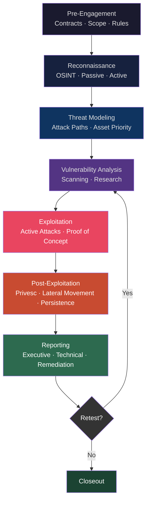

# Penetration Testing Methodology

> **A structured, legal process of simulating real-world cyberattacks to find vulnerabilities before malicious actors do.**

## 🧠 What Is It?

Penetration testing (pen testing) is like hiring a professional lockpicker to test all your doors and windows *before* a burglar does. You give them permission, a scope, and a time limit — and they try everything to break in, then tell you exactly how they did it and how to fix it.

Unlike a real attacker who has unlimited time and no rules, a penetration tester operates within a legal contract, a defined scope, and specific goals.

**Key distinction**: Vulnerability scanning ≠ Penetration testing. Scanning just finds known holes. Penetration testing *exploits* those holes to demonstrate real business impact.

## 🏗️ How It Works

### The 7 Phases of a Penetration Test

Every professional penetration test follows a structured lifecycle. Skipping phases leads to missed vulnerabilities and incomplete reports.

**Phase 1: Pre-Engagement (Planning)**  
Everything legal and logistical happens here. Contracts, scope, rules.

**Phase 2: Reconnaissance (Recon)**  
Gather intelligence on the target without (or before) touching systems.

**Phase 3: Threat Modeling**  
Identify what assets matter, what attack paths exist, what threats are realistic.

**Phase 4: Vulnerability Analysis**  
Identify potential vulnerabilities through scanning and research.

**Phase 5: Exploitation**  
Actively attempt to exploit identified vulnerabilities.

**Phase 6: Post-Exploitation**  
After a foothold: escalate privileges, move laterally, establish persistence, exfiltrate data.

**Phase 7: Reporting**  
Document everything: findings, evidence, business impact, remediation steps.

## 📊 Diagram



## ⚙️ Technical Details

### Legal Framework

**This is the most important section.** Operating without proper authorization is a federal crime.

#### Key Documents

**1. Statement of Work (SoW)**  
Defines *what* will be tested, *how*, and for *how long*. Contains:
- Scope of assessment (IP ranges, domains, applications)
- Testing windows (business hours only? 24/7?)
- Deliverables (report types, format)
- Payment terms

**2. Rules of Engagement (RoE)**  
The operational contract. Defines:
- Permitted attack techniques (is social engineering in scope? physical access?)
- Out-of-scope systems (production databases, third-party services)
- Emergency contact procedures (who to call if something breaks)
- Data handling requirements (how to handle PII found during testing)
- "Loud" vs "quiet" — stealth requirements

**3. Get-Out-of-Jail Letter**  
A signed letter from the client authorizing testing. Carry a physical copy during engagements. If security/law enforcement stops you, this proves authorization.

Example excerpt:
```
This letter confirms that [Pentester Name / Company] is authorized to conduct 
penetration testing against systems owned by [Client Company] in the IP range 
[X.X.X.X/XX] from [Start Date] to [End Date]. 
Signed: [CISO Name], [Date]
```

**4. Non-Disclosure Agreement (NDA)**  
Protects client confidentiality. You agree not to share findings with third parties.

**5. Master Service Agreement (MSA)**  
Umbrella contract covering liability, intellectual property, indemnification.

#### Laws You Must Know

**Computer Fraud and Abuse Act (CFAA) — USA**
- 18 U.S.C. § 1030
- Makes it illegal to access computer systems "without authorization" or in excess of authorization
- "Authorization" is the key word — your SoW/RoE provides this
- Penalties: up to 10-20 years federal prison for serious violations
- Landmark cases: *United States v. Nosal*, *Van Buren v. United States*

**UK Computer Misuse Act 1990**
- Section 1: Unauthorized access to computer material (up to 2 years)
- Section 2: Unauthorized access with intent to commit further offences (up to 5 years)
- Section 3: Unauthorized modification of computer material (up to 10 years)
- Section 3ZA: Unauthorized acts causing serious damage (up to life imprisonment)

**Other Key Regulations**
- GDPR (EU) — handling personal data found during testing
- HIPAA (USA) — healthcare data encountered during testing
- PCI DSS — cardholder data environments
- ECPA — Electronic Communications Privacy Act (wiretapping laws)

### Penetration Test Types

| Aspect | Black Box | Gray Box | White Box |
|--------|-----------|----------|-----------|
| **Knowledge Given** | None — simulates external attacker | Partial — some credentials, network diagrams | Full — source code, architecture, credentials |
| **Realism** | Highest | Medium | Lowest |
| **Efficiency** | Lowest (time-intensive recon) | Balanced | Highest |
| **Coverage** | May miss internal issues | Good balance | Most thorough |
| **Cost** | Highest (more time) | Medium | Lower per hour |
| **Best For** | External attack simulation | General assessments | Code audits, thorough coverage |
| **Tester Starts With** | Company name only | User credentials + IP ranges | Everything |

### PTES — Penetration Testing Execution Standard

The industry standard framework. Seven phases:

**1. Pre-engagement Interactions**
- Scope definition, goal setting, timing, payment
- Deliverable agreement
- Emergency contacts established

**2. Intelligence Gathering**
- OSINT, active recon, infrastructure mapping
- Corporate intel, employee info, technology fingerprinting

**3. Threat Modeling**
- Business asset analysis
- Threat community analysis
- Threat capability analysis
- Attack scenario creation

**4. Vulnerability Analysis**
- Testing using active/passive methods
- Validation of vulnerabilities (eliminate false positives)
- Research (CVE databases, Exploit-DB)

**5. Exploitation**
- Precision attacks targeting confirmed vulnerabilities
- Chaining vulnerabilities for maximum impact
- Capturing proof (screenshots, output files)

**6. Post Exploitation**
- Infrastructure analysis from inside the network
- Data exfiltration proof
- Persistence mechanisms
- Pivoting to other systems

**7. Reporting**
- Executive summary (non-technical)
- Technical findings with CVSS scores
- Remediation roadmap
- Evidence and appendices

### Red Team vs Penetration Test

| Aspect | Penetration Test | Red Team Assessment |
|--------|-----------------|---------------------|
| **Goal** | Find as many vulnerabilities as possible | Test detection & response capabilities |
| **Duration** | 1-4 weeks | 3-6 months |
| **Scope** | Defined, broad | Narrow objective (e.g., "access CEO email") |
| **Blue Team Aware?** | Usually yes | No — full adversary simulation |
| **Stealth** | Not required | Critical |
| **Techniques** | Standard toolkit | Advanced TTPs, custom tooling, 0-days |
| **Report Focus** | Vulnerability list + remediations | Detection gaps + incident response gaps |
| **MITRE ATT&CK** | Partial mapping | Full campaign mapping |
| **Social Engineering** | Optional | Often included |
| **Physical** | Rarely | Often included |

### Network vs Web vs Internal Pentest

| Type | Starting Point | Key Focus | Primary Tools |
|------|---------------|-----------|---------------|
| **External Network** | Internet-facing IPs | Perimeter, firewalls, exposed services | Nmap, Nessus, Metasploit |
| **Web Application** | Web app URL | OWASP Top 10, business logic | Burp Suite, OWASP ZAP, SQLMap |
| **Internal Network** | LAN access (VPN/on-site) | AD, lateral movement, internal services | BloodHound, CrackMapExec, Mimikatz |
| **Wireless** | Proximity to target | WPA2, evil twin, rogue AP | Aircrack-ng, Kismet, Hashcat |
| **Social Engineering** | Phone/email | Phishing, pretexting, vishing | GoPhish, SET |
| **Physical** | On-site | Access controls, badge cloning | Proxmark3, lockpicks |

### Blue Team Awareness

**Should the blue team know?**
- **White-box pentest**: Blue team usually knows (improves realism of defenses)  
- **Red team**: Blue team does NOT know (tests their detection capabilities)

**Purple team**: A collaborative exercise where red and blue work together to improve defenses in real-time.

**Key consideration**: Inform the SOC manager (but not analysts) to avoid legal issues if your IP gets blocked or alerted on. This person is called the **"White Team"** — they know the test is happening but don't interfere.

## 💥 Exploitation Step-by-Step

### Pre-Engagement Checklist

```
PRE-ENGAGEMENT CHECKLIST
═══════════════════════════════════════════════
[ ] Signed Statement of Work received
[ ] Signed Rules of Engagement received
[ ] NDA signed by both parties
[ ] Get-out-of-jail letter printed and available
[ ] Scope document reviewed and understood
[ ] Out-of-scope systems documented
[ ] Emergency contacts recorded (client CISO, IT contact)
[ ] Testing window confirmed (dates/times)
[ ] Data handling procedures agreed
[ ] Report format and delivery method agreed
[ ] Legal counsel reviewed contract (for large engagements)
[ ] VPN/access credentials received (if gray/white box)
[ ] Kickoff call completed
[ ] Client escalation procedure documented
[ ] Pentest VM/environment prepared and isolated
[ ] VPN for testing traffic confirmed
[ ] Note-taking tool set up (CherryTree, Obsidian, Notion)
[ ] Screenshot tool configured
[ ] Report template ready
```

### Time Management: 5-Day Engagement Budget

```
DAY 1 — Recon & Scanning          (8 hours)
  ├── Passive OSINT                 (2h)
  ├── Active Recon / DNS            (1h)
  ├── Port Scanning (Nmap/Masscan)  (2h)
  └── Vulnerability Scanning        (3h — run overnight)

DAY 2 — Enumeration & Analysis    (8 hours)
  ├── Service Enumeration           (3h)
  ├── Web App Scanning              (2h)
  ├── Vulnerability Validation      (2h)
  └── Attack Path Planning          (1h)

DAY 3 — Exploitation              (8 hours)
  ├── Exploit high-value targets    (4h)
  ├── Web app exploitation          (2h)
  └── Credential attacks            (2h)

DAY 4 — Post-Exploitation         (8 hours)
  ├── Privilege escalation          (2h)
  ├── Lateral movement              (2h)
  ├── Persistence establishment     (1h)
  ├── Data exfiltration PoC         (1h)
  └── Cleanup & evidence capture    (2h)

DAY 5 — Reporting                 (8 hours)
  ├── Draft executive summary       (1h)
  ├── Write technical findings      (4h)
  ├── Add evidence/screenshots      (1h)
  ├── Remediation recommendations   (1h)
  └── Review and finalize           (1h)
```

### Common Scoping Mistakes

1. **Too broad scope** — "Test everything" with no IP list. Leads to legal liability.
2. **No third-party exclusions** — CDN providers, cloud services, SaaS tools are often out of scope legally.
3. **No testing window** — Testing during business hours can disrupt operations.
4. **No emergency contact** — If you break something, who do you call?
5. **Forgetting subdomains** — Scope says `example.com` — does that include `dev.example.com`?
6. **Cloud environment confusion** — AWS/Azure/GCP have their own penetration testing policies.
7. **Shared hosting** — Testing a web server might affect other tenants.
8. **No data handling agreement** — What happens to credentials or PII you find?

## 🛠️ Tools

### Tools by Phase

**Pre-Engagement**
```bash
# Note-taking
cherrytree                          # Hierarchical note-taking
obsidian                            # Markdown-based knowledge base

# Report templates
git clone https://github.com/hmaverickadams/TCM-Security-Sample-Pentest-Report
```

**Reconnaissance**
```bash
# Passive OSINT
theHarvester -d target.com -b all    # Email/domain harvesting
maltego                              # Visual OSINT mapping
recon-ng                             # OSINT framework
shodan search "org:TargetCorp"       # Shodan CLI

# DNS
dig any target.com                   # All DNS records
whois target.com                     # Registration info
amass enum -d target.com             # Subdomain enumeration
```

**Scanning**
```bash
nmap -sC -sV -oA scan target.com     # Default scan with scripts
masscan -p1-65535 192.168.1.0/24 --rate=1000  # Fast port scan
nessus                               # Vulnerability scanner (GUI)
nikto -h http://target.com           # Web server scanner
```

**Enumeration**
```bash
gobuster dir -u http://target.com -w /usr/share/wordlists/dirb/common.txt
enum4linux -a 192.168.1.100          # SMB enumeration
wpscan --url http://target.com       # WordPress scanner
```

**Exploitation**
```bash
msfconsole                           # Metasploit framework
searchsploit apache 2.4              # ExploitDB search
sqlmap -u "http://target.com/?id=1"  # SQL injection
```

**Post-Exploitation**
```bash
meterpreter > getsystem              # Privilege escalation
meterpreter > hashdump               # Credential dumping
linpeas.sh                           # Linux privesc enumeration
winpeas.exe                          # Windows privesc enumeration
mimikatz.exe                         # Windows credential dumping
```

**Reporting**
```bash
# CVSS Calculator
https://nvd.nist.gov/vuln-metrics/cvss/v3-calculator

# Report generation
dradis                               # Collaboration and reporting
serpico                              # Report generator
```

### OWASP Testing Guide Reference

The OWASP Web Security Testing Guide (WSTG) is the definitive web application testing methodology.

Key test categories:
- **OTG-INFO** — Information Gathering
- **OTG-CONFIG** — Configuration and Deployment Management
- **OTG-IDENT** — Identity Management
- **OTG-AUTHN** — Authentication Testing
- **OTG-AUTHZ** — Authorization Testing
- **OTG-SESS** — Session Management
- **OTG-INPVAL** — Input Validation (SQLi, XSS, etc.)
- **OTG-ERR** — Error Handling
- **OTG-CRYPST** — Cryptography
- **OTG-BUSLOGIC** — Business Logic

Download: `https://owasp.org/www-project-web-security-testing-guide/`

## 🔍 Detection

**How defenders detect pentests:**

- IDS/IPS alerts on port scans (Snort rule: `alert tcp any any -> any any (flags:S; threshold:type both, track by_src, count 100, seconds 1;)`)
- SIEM correlation rules for rapid sequential connection attempts
- Honeypot interactions logged
- Unusual authentication attempts (many failed logins)
- Known exploit signatures (Nmap NSE fingerprints, Metasploit default UA strings)
- Endpoint detection: Metasploit meterpreter signatures, known post-exploitation tools

**Evading detection (legitimate for authorized engagements):**
- Use legitimate-looking user agents
- Throttle scan speeds
- Use proxy chains
- Avoid known C2 IP ranges
- Time attacks to blend with normal traffic

## 🛡️ Mitigation

This section covers organizational controls that make penetration testing harder (and thus improve security):

1. **Segment networks** — Flat networks give attackers free movement; VLANs limit blast radius
2. **Patch management** — 85% of exploits target known vulnerabilities with patches available
3. **Principle of least privilege** — Limit what each account/service can do
4. **Multi-factor authentication** — Stops credential-based attacks
5. **Endpoint Detection & Response (EDR)** — Catches post-exploitation activity
6. **Web Application Firewall (WAF)** — Blocks common web exploitation attempts
7. **Log everything** — Without logs, you can't detect or investigate
8. **Vulnerability management program** — Regular scanning + remediation tracking
9. **Security awareness training** — Humans are usually the easiest attack vector
10. **Incident response plan** — Know what to do when (not if) you get compromised

### Pentest Report Types

**Executive Summary**
- Audience: C-suite, board members
- Length: 1-3 pages
- Content: Overall risk posture, business impact, top 3-5 findings summary, investment recommendations
- No technical jargon

**Technical Report**
- Audience: IT/security team
- Length: 20-100+ pages
- Content: Full methodology, all findings with CVSS scores, evidence (screenshots, commands, output), step-by-step reproduction
- CVSS scoring for each finding

**Remediation Report / Remediation Tracker**
- Audience: IT operations
- Content: Finding → Remediation action → Owner → Priority → Deadline
- Often delivered as a spreadsheet

**Attestation Letter**
- A brief signed letter stating the test was conducted and no critical vulnerabilities remain (after remediation)
- Used for compliance purposes

## 📚 References

- [PTES — Penetration Testing Execution Standard](http://www.pentest-standard.org/)
- [OWASP Web Security Testing Guide](https://owasp.org/www-project-web-security-testing-guide/)
- [NIST SP 800-115 — Technical Guide to Information Security Testing](https://csrc.nist.gov/publications/detail/sp/800-115/final)
- [CFAA — 18 U.S.C. § 1030](https://www.law.cornell.edu/uscode/text/18/1030)
- [UK Computer Misuse Act 1990](https://www.legislation.gov.uk/ukpga/1990/18/contents)
- [CVSS v3.1 Specification](https://www.first.org/cvss/specification-document)
- [MITRE ATT&CK Framework](https://attack.mitre.org/)
- [TCM Security — Practical Ethical Hacking](https://academy.tcm-sec.com/)
- [HackTricks — Pentesting Methodology](https://book.hacktricks.xyz/)
- [PayloadsAllTheThings](https://github.com/swisskyrepo/PayloadsAllTheThings)
